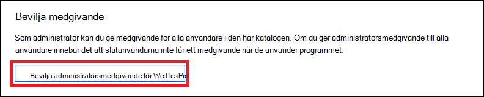

# <a name="use-microsoft-defender-for-endpoint-apis"></a><span data-ttu-id="0a38a-104">Använda Microsoft Defender för slutpunkts-API:er</span><span class="sxs-lookup"><span data-stu-id="0a38a-104">Use Microsoft Defender for Endpoint APIs</span></span>

[!INCLUDE [Microsoft 365 Defender rebranding](../../includes/microsoft-defender.md)]


<span data-ttu-id="0a38a-105">**Gäller för:**</span><span class="sxs-lookup"><span data-stu-id="0a38a-105">**Applies to:**</span></span>
- [<span data-ttu-id="0a38a-106">Microsoft Defender för Endpoint</span><span class="sxs-lookup"><span data-stu-id="0a38a-106">Microsoft Defender for Endpoint</span></span>](https://go.microsoft.com/fwlink/?linkid=2154037)

> <span data-ttu-id="0a38a-107">Vill du uppleva Microsoft Defender för Slutpunkt?</span><span class="sxs-lookup"><span data-stu-id="0a38a-107">Want to experience Microsoft Defender for Endpoint?</span></span> [<span data-ttu-id="0a38a-108">Registrera dig för en kostnadsfri utvärderingsversion.</span><span class="sxs-lookup"><span data-stu-id="0a38a-108">Sign up for a free trial.</span></span>](https://www.microsoft.com/microsoft-365/windows/microsoft-defender-atp?ocid=docs-wdatp-exposedapis-abovefoldlink)

[!include[Microsoft Defender for Endpoint API URIs for US Government](../../includes/microsoft-defender-api-usgov.md)]

[!include[Improve request performance](../../includes/improve-request-performance.md)]

<span data-ttu-id="0a38a-109">På den här sidan beskrivs hur du skapar ett program för att få programmässiga åtkomst till Defender för Endpoint för en användares räkning.</span><span class="sxs-lookup"><span data-stu-id="0a38a-109">This page describes how to create an application to get programmatic access to Defender for Endpoint on behalf of a user.</span></span>

<span data-ttu-id="0a38a-110">Om du behöver programmeringsåtkomst till Microsoft Defender för Slutpunkt utan en användare går du till [Access Microsoft Defender för Slutpunkt med programkontext](exposed-apis-create-app-webapp.md).</span><span class="sxs-lookup"><span data-stu-id="0a38a-110">If you need programmatic access Microsoft Defender for Endpoint without a user, refer to [Access Microsoft Defender for Endpoint with application context](exposed-apis-create-app-webapp.md).</span></span>

<span data-ttu-id="0a38a-111">Om du inte är säker på vilken åtkomst du behöver kan du läsa [introduktionssidan.](apis-intro.md)</span><span class="sxs-lookup"><span data-stu-id="0a38a-111">If you are not sure which access you need, read the [Introduction page](apis-intro.md).</span></span>

<span data-ttu-id="0a38a-112">Microsoft Defender för slutpunkt visar mycket av dess data och åtgärder via en uppsättning programmässiga API:er.</span><span class="sxs-lookup"><span data-stu-id="0a38a-112">Microsoft Defender for Endpoint exposes much of its data and actions through a set of programmatic APIs.</span></span> <span data-ttu-id="0a38a-113">De här API:erna gör det möjligt att automatisera arbetsflöden och nya funktioner baserat på Microsoft Defender för Slutpunkt-funktioner.</span><span class="sxs-lookup"><span data-stu-id="0a38a-113">Those APIs will enable you to automate work flows and innovate based on Microsoft Defender for Endpoint capabilities.</span></span> <span data-ttu-id="0a38a-114">API-åtkomst kräver OAuth2.0-autentisering.</span><span class="sxs-lookup"><span data-stu-id="0a38a-114">The API access requires OAuth2.0 authentication.</span></span> <span data-ttu-id="0a38a-115">Mer information finns i [OAuth 2.0 auktoriseringskod för Flow.](/azure/active-directory/develop/active-directory-v2-protocols-oauth-code)</span><span class="sxs-lookup"><span data-stu-id="0a38a-115">For more information, see [OAuth 2.0 Authorization Code Flow](/azure/active-directory/develop/active-directory-v2-protocols-oauth-code).</span></span>

<span data-ttu-id="0a38a-116">I allmänhet måste du vidta följande steg för att använda API:er:</span><span class="sxs-lookup"><span data-stu-id="0a38a-116">In general, you’ll need to take the following steps to use the APIs:</span></span>
- <span data-ttu-id="0a38a-117">Skapa ett AAD-program</span><span class="sxs-lookup"><span data-stu-id="0a38a-117">Create an AAD application</span></span>
- <span data-ttu-id="0a38a-118">Hämta en åtkomsttoken med det här programmet</span><span class="sxs-lookup"><span data-stu-id="0a38a-118">Get an access token using this application</span></span>
- <span data-ttu-id="0a38a-119">Använda token för att komma åt Defender för Endpoint API</span><span class="sxs-lookup"><span data-stu-id="0a38a-119">Use the token to access Defender for Endpoint API</span></span>

<span data-ttu-id="0a38a-120">På den här sidan förklaras hur du skapar ett AAD-program, hämtar en åtkomsttoken till Microsoft Defender för Endpoint och verifierar token.</span><span class="sxs-lookup"><span data-stu-id="0a38a-120">This page explains how to create an AAD application, get an access token to Microsoft Defender for Endpoint and validate the token.</span></span>

>[!NOTE]
> <span data-ttu-id="0a38a-121">När du öppnar Microsoft Defender för Endpoint API åt en användare behöver du rätt programbehörighet och användarbehörighet.</span><span class="sxs-lookup"><span data-stu-id="0a38a-121">When accessing Microsoft Defender for Endpoint API on behalf of a user, you will need the correct Application permission and user permission.</span></span>
> <span data-ttu-id="0a38a-122">Om du inte är bekant med användarbehörigheter i Microsoft Defender för Endpoint kan du läsa Hantera [portalåtkomst med hjälp av rollbaserad åtkomstkontroll](rbac.md).</span><span class="sxs-lookup"><span data-stu-id="0a38a-122">If you are not familiar with user permissions on Microsoft Defender for Endpoint, see [Manage portal access using role-based access control](rbac.md).</span></span>

>[!TIP]
> <span data-ttu-id="0a38a-123">Om du har behörighet att utföra en åtgärd i portalen har du behörighet att utföra åtgärden i API:t.</span><span class="sxs-lookup"><span data-stu-id="0a38a-123">If you have the permission to perform an action in the portal, you have the permission to perform the action in the API.</span></span>

## <a name="create-an-app"></a><span data-ttu-id="0a38a-124">Skapa en app</span><span class="sxs-lookup"><span data-stu-id="0a38a-124">Create an app</span></span>

1. <span data-ttu-id="0a38a-125">Logga in på [Azure](https://portal.azure.com) med ett användarkonto som har **rollen Global** administratör.</span><span class="sxs-lookup"><span data-stu-id="0a38a-125">Log on to [Azure](https://portal.azure.com) with a user account that has the **Global Administrator** role.</span></span>

2. <span data-ttu-id="0a38a-126">Gå till **Azure Active Directory**  >  **Appregistreringar**  >  **Ny registrering.**</span><span class="sxs-lookup"><span data-stu-id="0a38a-126">Navigate to **Azure Active Directory** > **App registrations** > **New registration**.</span></span> 

   

3. <span data-ttu-id="0a38a-128">När sidan **Registrera ett program** visas anger du registreringsinformationen för ditt program:</span><span class="sxs-lookup"><span data-stu-id="0a38a-128">When the **Register an application** page appears, enter your application's registration information:</span></span>

   - <span data-ttu-id="0a38a-129">**Namn** – Ange ett beskrivande programnamn som ska visas för användare av programmet.</span><span class="sxs-lookup"><span data-stu-id="0a38a-129">**Name** - Enter a meaningful application name that will be displayed to users of the app.</span></span>
   - <span data-ttu-id="0a38a-130">**Kontotyper som stöds** – Välj vilka konton du vill att programmet ska ha stöd för.</span><span class="sxs-lookup"><span data-stu-id="0a38a-130">**Supported account types** - Select which accounts you would like your application to support.</span></span>

       | <span data-ttu-id="0a38a-131">Kontotyper som stöds</span><span class="sxs-lookup"><span data-stu-id="0a38a-131">Supported account types</span></span> | <span data-ttu-id="0a38a-132">Beskrivning</span><span class="sxs-lookup"><span data-stu-id="0a38a-132">Description</span></span> |
       |-------------------------|-------------|
       | <span data-ttu-id="0a38a-133">**Konton endast i den här organisationskatalogen**</span><span class="sxs-lookup"><span data-stu-id="0a38a-133">**Accounts in this organizational directory only**</span></span> | <span data-ttu-id="0a38a-134">Välj det här alternativet om du skapar ett LOB-program.</span><span class="sxs-lookup"><span data-stu-id="0a38a-134">Select this option if you're building a line-of-business (LOB) application.</span></span> <span data-ttu-id="0a38a-135">Det här alternativet är inte tillgängligt om du inte registrerar programmet i en katalog.</span><span class="sxs-lookup"><span data-stu-id="0a38a-135">This option is not available if you're not registering the application in a directory.</span></span><br><br><span data-ttu-id="0a38a-136">Det här alternativet mappar endast till Azure AD med en klientorganisation.</span><span class="sxs-lookup"><span data-stu-id="0a38a-136">This option maps to Azure AD only single-tenant.</span></span><br><br><span data-ttu-id="0a38a-137">Det här är standardalternativet såvida du inte registrerar programmet utanför en katalog.</span><span class="sxs-lookup"><span data-stu-id="0a38a-137">This is the default option unless you're registering the app outside of a directory.</span></span> <span data-ttu-id="0a38a-138">I fall där appen är registrerad utanför en katalog är standard azure AD-konton för flera innehavare och personliga Microsoft-konton.</span><span class="sxs-lookup"><span data-stu-id="0a38a-138">In cases where the app is registered outside of a directory, the default is Azure AD multi-tenant and personal Microsoft accounts.</span></span> |
       | <span data-ttu-id="0a38a-139">**Konton i valfri organisationskatalog**</span><span class="sxs-lookup"><span data-stu-id="0a38a-139">**Accounts in any organizational directory**</span></span> | <span data-ttu-id="0a38a-140">Välj det här alternativet om du vill rikta alla företags- och utbildningskunder.</span><span class="sxs-lookup"><span data-stu-id="0a38a-140">Select this option if you would like to target all business and educational customers.</span></span><br><br><span data-ttu-id="0a38a-141">Det här alternativet mappar till en Azure AD endast för flera innehavare.</span><span class="sxs-lookup"><span data-stu-id="0a38a-141">This option maps to an Azure AD only multi-tenant.</span></span><br><br><span data-ttu-id="0a38a-142">Om du har registrerat appen som Azure AD endast för en enskild klientorganisation kan du uppdatera den till Att vara Azure AD för flera innehavare och tillbaka till en klientorganisation via **autentiseringsbladet.**</span><span class="sxs-lookup"><span data-stu-id="0a38a-142">If you registered the app as Azure AD only single-tenant, you can update it to be Azure AD multi-tenant and back to single-tenant through the **Authentication** blade.</span></span> |
       | <span data-ttu-id="0a38a-143">**Konton i valfri organisationskatalog och personliga Microsoft-konton**</span><span class="sxs-lookup"><span data-stu-id="0a38a-143">**Accounts in any organizational directory and personal Microsoft accounts**</span></span> | <span data-ttu-id="0a38a-144">Välj det här alternativet om du vill ha det i hela uppsättningen kunder.</span><span class="sxs-lookup"><span data-stu-id="0a38a-144">Select this option to target the widest set of customers.</span></span><br><br><span data-ttu-id="0a38a-145">Det här alternativet mappar till Azure AD-konton för flera innehavare och personliga Microsoft-konton.</span><span class="sxs-lookup"><span data-stu-id="0a38a-145">This option maps to Azure AD multi-tenant and personal Microsoft accounts.</span></span><br><br><span data-ttu-id="0a38a-146">Om du har registrerat appen som Azure AD-konton för flera innehavare och personliga Microsoft-konton kan du inte ändra detta i användargränssnittet.</span><span class="sxs-lookup"><span data-stu-id="0a38a-146">If you registered the app as Azure AD multi-tenant and personal Microsoft accounts, you cannot change this in the UI.</span></span> <span data-ttu-id="0a38a-147">I stället måste du använda manifestredigeraren för att ändra kontotyperna som stöds.</span><span class="sxs-lookup"><span data-stu-id="0a38a-147">Instead, you must use the application manifest editor to change the supported account types.</span></span> |

   - <span data-ttu-id="0a38a-148">**Omdirigerings-URI (valfritt)** – Välj typ av app du **skapar,** Webb eller Offentlig klient **(mobil & skrivbord)** och ange sedan omdirigerings-URI (eller svars-URL) för programmet.</span><span class="sxs-lookup"><span data-stu-id="0a38a-148">**Redirect URI (optional)** - Select the type of app you're building, **Web** or **Public client (mobile & desktop)**, and then enter the redirect URI (or reply URL) for your application.</span></span>
       - <span data-ttu-id="0a38a-149">För webbprogram anger du programmets bas-URL.</span><span class="sxs-lookup"><span data-stu-id="0a38a-149">For web applications, provide the base URL of your app.</span></span> <span data-ttu-id="0a38a-150">Kan till `http://localhost:31544` exempel vara URL-adressen för en webbapp som körs på din lokala dator.</span><span class="sxs-lookup"><span data-stu-id="0a38a-150">For example, `http://localhost:31544` might be the URL for a web app running on your local machine.</span></span> <span data-ttu-id="0a38a-151">Användarna skulle använda URL-adressen för att logga in i ett webbklientprogram.</span><span class="sxs-lookup"><span data-stu-id="0a38a-151">Users would use this URL to sign in to a web client application.</span></span>
       - <span data-ttu-id="0a38a-152">För offentliga klientprogram anger du den URI som används av Azure AD för att returnera tokensvar.</span><span class="sxs-lookup"><span data-stu-id="0a38a-152">For public client applications, provide the URI used by Azure AD to return token responses.</span></span> <span data-ttu-id="0a38a-153">Ange ett specifikt värde för programmet, till exempel `myapp://auth` .</span><span class="sxs-lookup"><span data-stu-id="0a38a-153">Enter a value specific to your application, such as `myapp://auth`.</span></span>

     <span data-ttu-id="0a38a-154">Om du vill se specifika exempel för webbprogram eller interna program kan du läsa [våra snabbstartsguider.](/azure/active-directory/develop/#quickstarts)</span><span class="sxs-lookup"><span data-stu-id="0a38a-154">To see specific examples for web applications or native applications, check out our [quickstarts](/azure/active-directory/develop/#quickstarts).</span></span>

     <span data-ttu-id="0a38a-155">När du är klar väljer du **Registrera**.</span><span class="sxs-lookup"><span data-stu-id="0a38a-155">When finished, select **Register**.</span></span>

4. <span data-ttu-id="0a38a-156">Tillåt att ditt program får åtkomst till Microsoft Defender för Endpoint och tilldela behörigheten Läsaviseringar:</span><span class="sxs-lookup"><span data-stu-id="0a38a-156">Allow your Application to access Microsoft Defender for Endpoint and assign it 'Read alerts' permission:</span></span>

    - <span data-ttu-id="0a38a-157">Välj API-behörigheter Lägg till **behörighetS-API:er** som min organisation använder för  >    >   > **WindowsDefenderATP** och välj på **WindowsDefenderATP.**</span><span class="sxs-lookup"><span data-stu-id="0a38a-157">On your application page, select **API Permissions** > **Add permission** > **APIs my organization uses** > type **WindowsDefenderATP** and select on **WindowsDefenderATP**.</span></span>

    - <span data-ttu-id="0a38a-158">**Obs!** *WindowsDefenderATP* visas inte i den ursprungliga listan.</span><span class="sxs-lookup"><span data-stu-id="0a38a-158">**Note**: *WindowsDefenderATP* does not appear in the original list.</span></span> <span data-ttu-id="0a38a-159">Börja skriva namnet i textrutan så att det visas.</span><span class="sxs-lookup"><span data-stu-id="0a38a-159">Start writing its name in the text box to see it appear.</span></span>

      

    - <span data-ttu-id="0a38a-161">Välj **Avisering om**  >  **delegerade behörigheter.Läs** > välj **Lägg till behörigheter**</span><span class="sxs-lookup"><span data-stu-id="0a38a-161">Choose **Delegated permissions** > **Alert.Read** > select **Add permissions**</span></span>

      

    - <span data-ttu-id="0a38a-163">**Viktigt meddelande:** Välj relevant behörighet.</span><span class="sxs-lookup"><span data-stu-id="0a38a-163">**Important note**: Select the relevant permissions.</span></span> <span data-ttu-id="0a38a-164">Läsaviseringar är bara ett exempel.</span><span class="sxs-lookup"><span data-stu-id="0a38a-164">Read alerts is only an example.</span></span>

      <span data-ttu-id="0a38a-165">Exempel:</span><span class="sxs-lookup"><span data-stu-id="0a38a-165">For instance,</span></span>

      - <span data-ttu-id="0a38a-166">Om [du vill köra avancerade](run-advanced-query-api.md)frågor väljer du behörigheten Kör avancerade frågor</span><span class="sxs-lookup"><span data-stu-id="0a38a-166">To [run advanced queries](run-advanced-query-api.md), select 'Run advanced queries' permission</span></span>
      - <span data-ttu-id="0a38a-167">Om [du vill isolera en enhet](isolate-machine.md)väljer du behörigheten Isolera dator</span><span class="sxs-lookup"><span data-stu-id="0a38a-167">To [isolate a device](isolate-machine.md), select 'Isolate machine' permission</span></span>
      - <span data-ttu-id="0a38a-168">Ta reda på vilken behörighet du behöver i avsnittet **Behörigheter** i API:t som du vill anropa.</span><span class="sxs-lookup"><span data-stu-id="0a38a-168">To determine which permission you need, view the **Permissions** section in the API you are interested to call.</span></span>

    - <span data-ttu-id="0a38a-169">Välj **Bevilja medgivande**</span><span class="sxs-lookup"><span data-stu-id="0a38a-169">Select **Grant consent**</span></span>

      <span data-ttu-id="0a38a-170">**Obs!** Varje gång du lägger till behörighet måste du välja **Bevilja medgivande** för att den nya behörigheten ska gälla.</span><span class="sxs-lookup"><span data-stu-id="0a38a-170">**Note**: Every time you add permission you must select on **Grant consent** for the new permission to take effect.</span></span>

      

6. <span data-ttu-id="0a38a-172">Skriv ned ditt program-ID och ditt klient-ID:</span><span class="sxs-lookup"><span data-stu-id="0a38a-172">Write down your application ID and your tenant ID:</span></span>

   - <span data-ttu-id="0a38a-173">Gå till Översikt på **programsidan och** kopiera följande information:</span><span class="sxs-lookup"><span data-stu-id="0a38a-173">On your application page, go to **Overview** and copy the following information:</span></span>

   


## <a name="get-an-access-token"></a><span data-ttu-id="0a38a-175">Hämta en åtkomsttoken</span><span class="sxs-lookup"><span data-stu-id="0a38a-175">Get an access token</span></span>

<span data-ttu-id="0a38a-176">Mer information om AAD-tokens finns i [Självstudiekurs för Azure AD](/azure/active-directory/develop/active-directory-v2-protocols-oauth-client-creds)</span><span class="sxs-lookup"><span data-stu-id="0a38a-176">For more information on AAD tokens, see [Azure AD tutorial](/azure/active-directory/develop/active-directory-v2-protocols-oauth-client-creds)</span></span>

### <a name="using-c"></a><span data-ttu-id="0a38a-177">Använda C #</span><span class="sxs-lookup"><span data-stu-id="0a38a-177">Using C#</span></span>

- <span data-ttu-id="0a38a-178">Kopiera/klistra in nedanstående klass i programmet.</span><span class="sxs-lookup"><span data-stu-id="0a38a-178">Copy/Paste the below class in your application.</span></span>
- <span data-ttu-id="0a38a-179">Använd **metoden AcquireUserTokenAsync** med ditt program-ID, klientorganisations-ID, användarnamn och lösenord för att hämta en token.</span><span class="sxs-lookup"><span data-stu-id="0a38a-179">Use **AcquireUserTokenAsync** method with your application ID, tenant ID, user name, and password to acquire a token.</span></span>

    ```csharp
    namespace WindowsDefenderATP
    {
        using System.Net.Http;
        using System.Text;
        using System.Threading.Tasks;
        using Newtonsoft.Json.Linq;

        public static class WindowsDefenderATPUtils
        {
            private const string Authority = "https://login.microsoftonline.com";

            private const string WdatpResourceId = "https://api.securitycenter.microsoft.com";

            public static async Task<string> AcquireUserTokenAsync(string username, string password, string appId, string tenantId)
            {
                using (var httpClient = new HttpClient())
                {
                    var urlEncodedBody = $"resource={WdatpResourceId}&client_id={appId}&grant_type=password&username={username}&password={password}";

                    var stringContent = new StringContent(urlEncodedBody, Encoding.UTF8, "application/x-www-form-urlencoded");

                    using (var response = await httpClient.PostAsync($"{Authority}/{tenantId}/oauth2/token", stringContent).ConfigureAwait(false))
                    {
                        response.EnsureSuccessStatusCode();

                        var json = await response.Content.ReadAsStringAsync().ConfigureAwait(false);

                        var jObject = JObject.Parse(json);

                        return jObject["access_token"].Value<string>();
                    }
                }
            }
        }
    }
    ```

## <a name="validate-the-token"></a><span data-ttu-id="0a38a-180">Verifiera token</span><span class="sxs-lookup"><span data-stu-id="0a38a-180">Validate the token</span></span>

<span data-ttu-id="0a38a-181">Kontrollera att du har fått rätt token:</span><span class="sxs-lookup"><span data-stu-id="0a38a-181">Verify to make sure you got a correct token:</span></span>
- <span data-ttu-id="0a38a-182">Kopiera/klistra in [i JWT](https://jwt.ms) den token du fick i föregående steg för att avkoda den</span><span class="sxs-lookup"><span data-stu-id="0a38a-182">Copy/paste into [JWT](https://jwt.ms) the token you got in the previous step in order to decode it</span></span>
- <span data-ttu-id="0a38a-183">Verifiera att du får ett SCP-anspråk med rätt appbehörighet</span><span class="sxs-lookup"><span data-stu-id="0a38a-183">Validate you get a 'scp' claim with the desired app permissions</span></span>
- <span data-ttu-id="0a38a-184">På skärmbilden nedan kan du se en avkodad token som förvärvats från programmet i självstudiekursen:</span><span class="sxs-lookup"><span data-stu-id="0a38a-184">In the screenshot below you can see a decoded token acquired from the app in the tutorial:</span></span>


## <a name="use-the-token-to-access-microsoft-defender-for-endpoint-api"></a><span data-ttu-id="0a38a-186">Använda token för att komma åt Microsoft Defender för Endpoint API</span><span class="sxs-lookup"><span data-stu-id="0a38a-186">Use the token to access Microsoft Defender for Endpoint API</span></span>

- <span data-ttu-id="0a38a-187">Välj det API du vill använda – Microsoft [Defender som stöds för slutpunkts-API:er](exposed-apis-list.md)</span><span class="sxs-lookup"><span data-stu-id="0a38a-187">Choose the API you want to use - [Supported Microsoft Defender for Endpoint APIs](exposed-apis-list.md)</span></span>
- <span data-ttu-id="0a38a-188">Ange rubriken Auktorisering i HTTP-begäran som du skickar till "Bearer {token}" (Bearer är auktoriseringsschemat)</span><span class="sxs-lookup"><span data-stu-id="0a38a-188">Set the Authorization header in the HTTP request you send to "Bearer {token}" (Bearer is the Authorization scheme)</span></span>
- <span data-ttu-id="0a38a-189">Förfallodatum för token är 1 timme (du kan skicka mer än en begäran med samma token)</span><span class="sxs-lookup"><span data-stu-id="0a38a-189">The Expiration time of the token is 1 hour (you can send more than one request with the same token)</span></span>

- <span data-ttu-id="0a38a-190">Exempel på att skicka en begäran om att få en lista med aviseringar **med C#**</span><span class="sxs-lookup"><span data-stu-id="0a38a-190">Example of sending a request to get a list of alerts **using C#**</span></span> 

    ```csharp
    var httpClient = new HttpClient();

    var request = new HttpRequestMessage(HttpMethod.Get, "https://api.securitycenter.microsoft.com/api/alerts");

    request.Headers.Authorization = new AuthenticationHeaderValue("Bearer", token);

    var response = httpClient.SendAsync(request).GetAwaiter().GetResult();

    // Do something useful with the response
    ```

## <a name="see-also"></a><span data-ttu-id="0a38a-191">Se även</span><span class="sxs-lookup"><span data-stu-id="0a38a-191">See also</span></span>
- [<span data-ttu-id="0a38a-192">Microsoft Defender för slutpunkts-API:er</span><span class="sxs-lookup"><span data-stu-id="0a38a-192">Microsoft Defender for Endpoint APIs</span></span>](exposed-apis-list.md)
- [<span data-ttu-id="0a38a-193">Access Microsoft Defender för slutpunkt med programkontext</span><span class="sxs-lookup"><span data-stu-id="0a38a-193">Access Microsoft Defender for Endpoint with application context</span></span>](exposed-apis-create-app-webapp.md)
