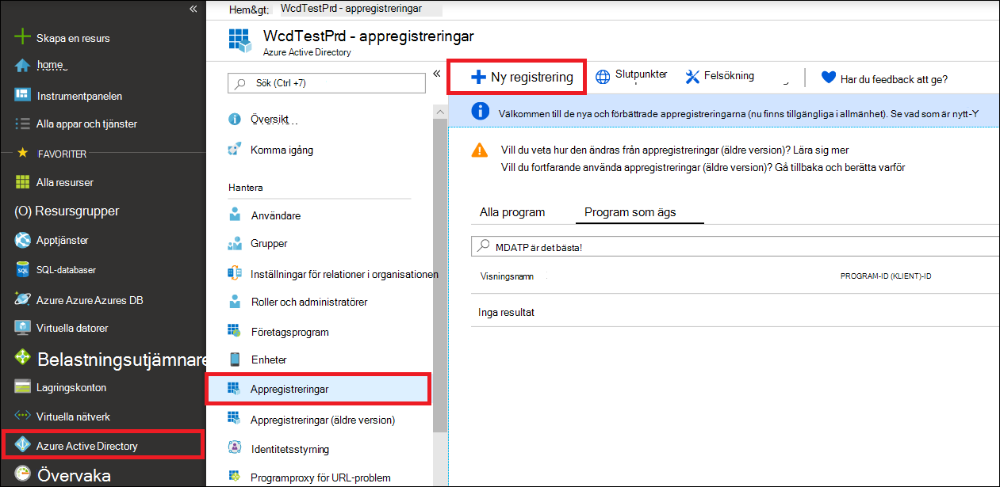
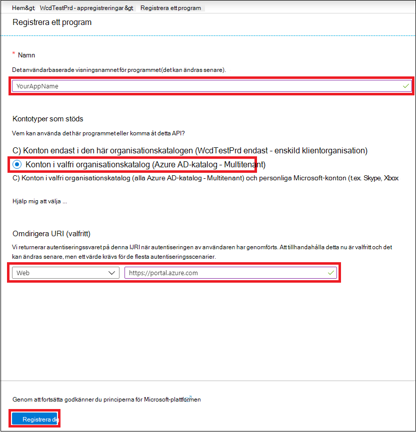
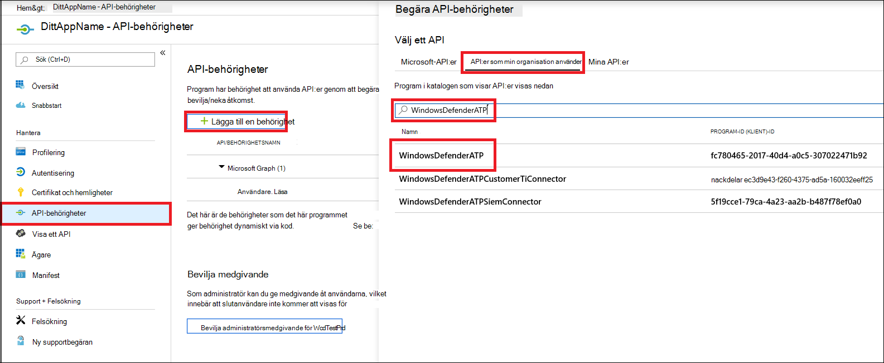
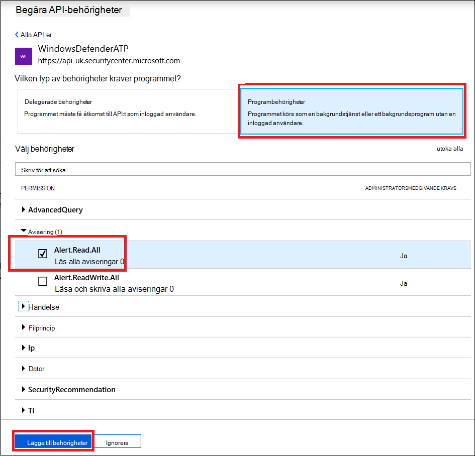
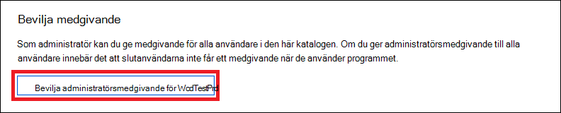
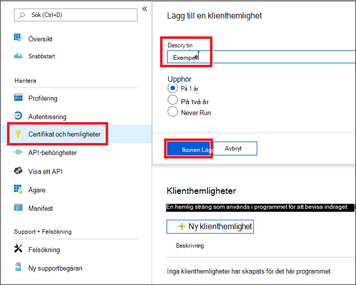
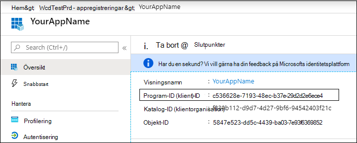
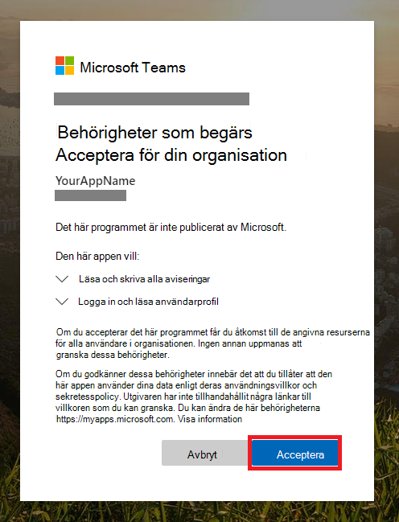

# <a name="partner-access-through-microsoft-defender-for-endpoint-apis"></a><span data-ttu-id="1a1b4-104">Partneråtkomst via Microsoft Defender för slutpunkts-API:er</span><span class="sxs-lookup"><span data-stu-id="1a1b4-104">Partner access through Microsoft Defender for Endpoint APIs</span></span>

[!INCLUDE [Microsoft 365 Defender rebranding](../../includes/microsoft-defender.md)]


<span data-ttu-id="1a1b4-105">**Gäller för:** [Microsoft Defender för slutpunkt](https://go.microsoft.com/fwlink/?linkid=2154037)</span><span class="sxs-lookup"><span data-stu-id="1a1b4-105">**Applies to:** [Microsoft Defender for Endpoint](https://go.microsoft.com/fwlink/?linkid=2154037)</span></span>

> <span data-ttu-id="1a1b4-106">Vill du uppleva Microsoft Defender för Slutpunkt?</span><span class="sxs-lookup"><span data-stu-id="1a1b4-106">Want to experience Microsoft Defender for Endpoint?</span></span> [<span data-ttu-id="1a1b4-107">Registrera dig för en kostnadsfri utvärderingsversion.</span><span class="sxs-lookup"><span data-stu-id="1a1b4-107">Sign up for a free trial.</span></span>](https://www.microsoft.com/microsoft-365/windows/microsoft-defender-atp?ocid=docs-wdatp-exposedapis-abovefoldlink)

[!include[Microsoft Defender for Endpoint API URIs for US Government](../../includes/microsoft-defender-api-usgov.md)]

[!include[Improve request performance](../../includes/improve-request-performance.md)]

<span data-ttu-id="1a1b4-108">På den här sidan beskrivs hur du skapar ett Azure Active Directory-program (Azure AD) för att få programmässiga åtkomst till Microsoft Defender för Endpoint åt dina kunder.</span><span class="sxs-lookup"><span data-stu-id="1a1b4-108">This page describes how to create an Azure Active Directory (Azure AD) application to get programmatic access to Microsoft Defender for Endpoint on behalf of your customers.</span></span>


<span data-ttu-id="1a1b4-109">Microsoft Defender för slutpunkt visar mycket av dess data och åtgärder via en uppsättning programmässiga API:er.</span><span class="sxs-lookup"><span data-stu-id="1a1b4-109">Microsoft Defender for Endpoint exposes much of its data and actions through a set of programmatic APIs.</span></span> <span data-ttu-id="1a1b4-110">De HÄR API:erna hjälper dig att automatisera arbetsflöden och nya funktioner baserat på Microsoft Defender för Slutpunkt-funktioner.</span><span class="sxs-lookup"><span data-stu-id="1a1b4-110">Those APIs will help you automate work flows and innovate based on Microsoft Defender for Endpoint capabilities.</span></span> <span data-ttu-id="1a1b4-111">API-åtkomst kräver OAuth2.0-autentisering.</span><span class="sxs-lookup"><span data-stu-id="1a1b4-111">The API access requires OAuth2.0 authentication.</span></span> <span data-ttu-id="1a1b4-112">Mer information finns i [OAuth 2.0 Auktoriseringskodflöde](https://docs.microsoft.com/azure/active-directory/develop/active-directory-v2-protocols-oauth-code).</span><span class="sxs-lookup"><span data-stu-id="1a1b4-112">For more information, see [OAuth 2.0 Authorization Code Flow](https://docs.microsoft.com/azure/active-directory/develop/active-directory-v2-protocols-oauth-code).</span></span>

<span data-ttu-id="1a1b4-113">I allmänhet måste du vidta följande steg för att använda API:er:</span><span class="sxs-lookup"><span data-stu-id="1a1b4-113">In general, you’ll need to take the following steps to use the APIs:</span></span>
- <span data-ttu-id="1a1b4-114">Skapa ett **Azure AD-program med** flera innehavare.</span><span class="sxs-lookup"><span data-stu-id="1a1b4-114">Create a **multi-tenant** Azure AD application.</span></span>
- <span data-ttu-id="1a1b4-115">Få auktoriserat(medgivande) av din kundadministratör för programmet för att få tillgång till Defender för de Endpoint-resurser som behövs.</span><span class="sxs-lookup"><span data-stu-id="1a1b4-115">Get authorized(consent) by your customer administrator for your application to access Defender for Endpoint resources it needs.</span></span>
- <span data-ttu-id="1a1b4-116">Hämta en åtkomsttoken med det här programmet.</span><span class="sxs-lookup"><span data-stu-id="1a1b4-116">Get an access token using this application.</span></span>
- <span data-ttu-id="1a1b4-117">Använd tokenet för att få åtkomst till Microsoft Defender för Endpoint API.</span><span class="sxs-lookup"><span data-stu-id="1a1b4-117">Use the token to access Microsoft Defender for Endpoint API.</span></span>

<span data-ttu-id="1a1b4-118">Följande steg vägleder dig hur du skapar ett Azure AD-program, hämtar en åtkomsttoken till Microsoft Defender för Endpoint och verifierar token.</span><span class="sxs-lookup"><span data-stu-id="1a1b4-118">The following steps will guide you how to create an Azure AD application, get an access token to Microsoft Defender for Endpoint and validate the token.</span></span>

## <a name="create-the-multi-tenant-app"></a><span data-ttu-id="1a1b4-119">Skapa appen för flera innehavare</span><span class="sxs-lookup"><span data-stu-id="1a1b4-119">Create the multi-tenant app</span></span>

1. <span data-ttu-id="1a1b4-120">Logga in på [Azure-klienten med](https://portal.azure.com) användare som har **rollen global** administratör.</span><span class="sxs-lookup"><span data-stu-id="1a1b4-120">Sign in to your [Azure tenant](https://portal.azure.com) with user that has **Global Administrator** role.</span></span>

2. <span data-ttu-id="1a1b4-121">Gå till **Azure Active Directory-appregistreringar**  >    >  **Ny registrering.**</span><span class="sxs-lookup"><span data-stu-id="1a1b4-121">Navigate to **Azure Active Directory** > **App registrations** > **New registration**.</span></span> 

   

3. <span data-ttu-id="1a1b4-123">I registreringsformuläret:</span><span class="sxs-lookup"><span data-stu-id="1a1b4-123">In the registration form:</span></span>

    - <span data-ttu-id="1a1b4-124">Välj ett namn på programmet.</span><span class="sxs-lookup"><span data-stu-id="1a1b4-124">Choose a name for your application.</span></span>

    - <span data-ttu-id="1a1b4-125">Kontotyper som stöds – konton i valfri organisationskatalog.</span><span class="sxs-lookup"><span data-stu-id="1a1b4-125">Supported account types - accounts in any organizational directory.</span></span>

    - <span data-ttu-id="1a1b4-126">Omdirigera URI – typ: Webb, URI: https://portal.azure.com</span><span class="sxs-lookup"><span data-stu-id="1a1b4-126">Redirect URI - type: Web, URI: https://portal.azure.com</span></span>

    


4. <span data-ttu-id="1a1b4-128">Tillåt att programmet får åtkomst till Microsoft Defender för Endpoint och tilldela det med minimal mängd behörigheter som krävs för att slutföra integreringen.</span><span class="sxs-lookup"><span data-stu-id="1a1b4-128">Allow your Application to access Microsoft Defender for Endpoint and assign it with the minimal set of permissions required to complete the integration.</span></span>

   - <span data-ttu-id="1a1b4-129">Välj API-behörigheter Lägg till **behörighetS-API:er** som min organisation använder för  >    >   > **WindowsDefenderATP** och välj på **WindowsDefenderATP.**</span><span class="sxs-lookup"><span data-stu-id="1a1b4-129">On your application page, select **API Permissions** > **Add permission** > **APIs my organization uses** > type **WindowsDefenderATP** and select on **WindowsDefenderATP**.</span></span>

   - <span data-ttu-id="1a1b4-130">**Obs!** *WindowsDefenderATP* visas inte i den ursprungliga listan.</span><span class="sxs-lookup"><span data-stu-id="1a1b4-130">**Note**: *WindowsDefenderATP* does not appear in the original list.</span></span> <span data-ttu-id="1a1b4-131">Börja skriva namnet i textrutan så att det visas.</span><span class="sxs-lookup"><span data-stu-id="1a1b4-131">Start writing its name in the text box to see it appear.</span></span>

   
   
   ### <a name="request-api-permissions"></a><span data-ttu-id="1a1b4-133">Begära API-behörigheter</span><span class="sxs-lookup"><span data-stu-id="1a1b4-133">Request API permissions</span></span>

   <span data-ttu-id="1a1b4-134">Ta reda på vilken behörighet du behöver i avsnittet **Behörigheter** i API:t som du vill anropa.</span><span class="sxs-lookup"><span data-stu-id="1a1b4-134">To determine which permission you need, review the **Permissions** section in the API you are interested to call.</span></span> <span data-ttu-id="1a1b4-135">Till exempel:</span><span class="sxs-lookup"><span data-stu-id="1a1b4-135">For instance:</span></span>

   - <span data-ttu-id="1a1b4-136">Om [du vill köra avancerade](run-advanced-query-api.md)frågor väljer du behörigheten Kör avancerade frågor</span><span class="sxs-lookup"><span data-stu-id="1a1b4-136">To [run advanced queries](run-advanced-query-api.md), select 'Run advanced queries' permission</span></span>
   
   - <span data-ttu-id="1a1b4-137">Om [du vill isolera en enhet](isolate-machine.md)väljer du behörigheten Isolera dator</span><span class="sxs-lookup"><span data-stu-id="1a1b4-137">To [isolate a device](isolate-machine.md), select 'Isolate machine' permission</span></span>

   <span data-ttu-id="1a1b4-138">I följande exempel använder vi **behörigheten Läs alla** aviseringar:</span><span class="sxs-lookup"><span data-stu-id="1a1b4-138">In the following example we will use **'Read all alerts'** permission:</span></span>

   <span data-ttu-id="1a1b4-139">Välj **Avisering om**  >  **programbehörigheter.Read.All >** på Lägg till **behörigheter**</span><span class="sxs-lookup"><span data-stu-id="1a1b4-139">Choose **Application permissions** > **Alert.Read.All** > select on **Add permissions**</span></span>

   


5. <span data-ttu-id="1a1b4-141">Välj **Bevilja medgivande**</span><span class="sxs-lookup"><span data-stu-id="1a1b4-141">Select **Grant consent**</span></span>

    - <span data-ttu-id="1a1b4-142">**Obs!** Varje gång du lägger till behörighet måste du välja **Bevilja medgivande** för att den nya behörigheten ska gälla.</span><span class="sxs-lookup"><span data-stu-id="1a1b4-142">**Note**: Every time you add permission you must select on **Grant consent** for the new permission to take effect.</span></span>

    

6. <span data-ttu-id="1a1b4-144">Gör programmet hemligt.</span><span class="sxs-lookup"><span data-stu-id="1a1b4-144">Add a secret to the application.</span></span>

    - <span data-ttu-id="1a1b4-145">Välj **Certifikat & hemligheter ,** lägg till en beskrivning av hemligheten och välj Lägg **till**.</span><span class="sxs-lookup"><span data-stu-id="1a1b4-145">Select **Certificates & secrets**, add description to the secret and select **Add**.</span></span>

    <span data-ttu-id="1a1b4-146">**Viktigt:** Efter att du klickat på Lägg **till kopierar du det genererade hemliga värdet**.</span><span class="sxs-lookup"><span data-stu-id="1a1b4-146">**Important**: After click Add, **copy the generated secret value**.</span></span> <span data-ttu-id="1a1b4-147">Du kommer inte att kunna hämta igen när du har lämnat!</span><span class="sxs-lookup"><span data-stu-id="1a1b4-147">You won't be able to retrieve after you leave!</span></span>

    

7. <span data-ttu-id="1a1b4-149">Skriv ned ditt program-ID:</span><span class="sxs-lookup"><span data-stu-id="1a1b4-149">Write down your application ID:</span></span>

   - <span data-ttu-id="1a1b4-150">Gå till Översikt på **programsidan och** kopiera följande information:</span><span class="sxs-lookup"><span data-stu-id="1a1b4-150">On your application page, go to **Overview** and copy the following information:</span></span>

   

8. <span data-ttu-id="1a1b4-152">Lägg till programmet i kundens klientorganisation.</span><span class="sxs-lookup"><span data-stu-id="1a1b4-152">Add the application to your customer's tenant.</span></span>

    <span data-ttu-id="1a1b4-153">Du behöver att programmet ska godkännas i varje kundklientorganisation där du tänker använda det.</span><span class="sxs-lookup"><span data-stu-id="1a1b4-153">You need your application to be approved in each customer tenant where you intend to use it.</span></span> <span data-ttu-id="1a1b4-154">Det beror på att ditt program interagerar med Microsoft Defender för Endpoint-programmet åt din kund.</span><span class="sxs-lookup"><span data-stu-id="1a1b4-154">This is because your application interacts with Microsoft Defender for Endpoint application on behalf of your customer.</span></span>

    <span data-ttu-id="1a1b4-155">En användare med **global administratör** från kundens klientorganisation måste välja medgivandelänken och godkänna programmet.</span><span class="sxs-lookup"><span data-stu-id="1a1b4-155">A user with **Global Administrator** from your customer's tenant need to select the consent link and approve your application.</span></span>

    <span data-ttu-id="1a1b4-156">Medgivandelänken är i formuläret:</span><span class="sxs-lookup"><span data-stu-id="1a1b4-156">Consent link is of the form:</span></span>

    ```
    https://login.microsoftonline.com/common/oauth2/authorize?prompt=consent&client_id=00000000-0000-0000-0000-000000000000&response_type=code&sso_reload=true
    ```

    <span data-ttu-id="1a1b4-157">Där 00000000-0000-0000-0000-00000000000 ska ersättas med ditt Program-ID</span><span class="sxs-lookup"><span data-stu-id="1a1b4-157">Where 00000000-0000-0000-0000-000000000000 should be replaced with your Application ID</span></span>

    <span data-ttu-id="1a1b4-158">När du klickat på medgivandelänken loggar du in med den globala administratören för kundens klientorganisation och godkänner programmet.</span><span class="sxs-lookup"><span data-stu-id="1a1b4-158">After clicking on the consent link, sign in with the Global Administrator of the customer's tenant and consent the application.</span></span>

    

    <span data-ttu-id="1a1b4-160">Dessutom måste du be kunden om deras klientorganisations-ID och spara det för framtida användning när du hämtar token.</span><span class="sxs-lookup"><span data-stu-id="1a1b4-160">In addition, you will need to ask your customer for their tenant ID and save it for future use when acquiring the token.</span></span>

- <span data-ttu-id="1a1b4-161">**Klart!**</span><span class="sxs-lookup"><span data-stu-id="1a1b4-161">**Done!**</span></span> <span data-ttu-id="1a1b4-162">Du har registrerat ett program!</span><span class="sxs-lookup"><span data-stu-id="1a1b4-162">You have successfully registered an application!</span></span> 
- <span data-ttu-id="1a1b4-163">Se exempel nedan för insamling och validering av token.</span><span class="sxs-lookup"><span data-stu-id="1a1b4-163">See examples below for token acquisition and validation.</span></span>

## <a name="get-an-access-token-example"></a><span data-ttu-id="1a1b4-164">Hämta ett exempel på åtkomsttoken:</span><span class="sxs-lookup"><span data-stu-id="1a1b4-164">Get an access token example:</span></span>

<span data-ttu-id="1a1b4-165">**Obs!** Om du vill få åtkomsttoken åt kunden använder du kundens klientorganisations-ID vid följande tokeninköp.</span><span class="sxs-lookup"><span data-stu-id="1a1b4-165">**Note:** To get access token on behalf of your customer, use the customer's tenant ID on the following token acquisitions.</span></span>

<br><span data-ttu-id="1a1b4-166">Mer information om AAD token finns i [AAD-självstudiekursen](https://docs.microsoft.com/azure/active-directory/develop/active-directory-v2-protocols-oauth-client-creds)</span><span class="sxs-lookup"><span data-stu-id="1a1b4-166">For more information on AAD token, see [AAD tutorial](https://docs.microsoft.com/azure/active-directory/develop/active-directory-v2-protocols-oauth-client-creds)</span></span>

### <a name="using-powershell"></a><span data-ttu-id="1a1b4-167">Använda PowerShell</span><span class="sxs-lookup"><span data-stu-id="1a1b4-167">Using PowerShell</span></span>

```
# That code gets the App Context Token and save it to a file named "Latest-token.txt" under the current directory
# Paste below your Tenant ID, App ID and App Secret (App key).

$tenantId = '' ### Paste your tenant ID here
$appId = '' ### Paste your Application ID here
$appSecret = '' ### Paste your Application key here

$resourceAppIdUri = 'https://api.securitycenter.microsoft.com'
$oAuthUri = "https://login.microsoftonline.com/$TenantId/oauth2/token"
$authBody = [Ordered] @{
    resource = "$resourceAppIdUri"
    client_id = "$appId"
    client_secret = "$appSecret"
    grant_type = 'client_credentials'
}
$authResponse = Invoke-RestMethod -Method Post -Uri $oAuthUri -Body $authBody -ErrorAction Stop
$token = $authResponse.access_token
Out-File -FilePath "./Latest-token.txt" -InputObject $token
return $token
```

### <a name="using-c"></a><span data-ttu-id="1a1b4-168">Med hjälp av C#:</span><span class="sxs-lookup"><span data-stu-id="1a1b4-168">Using C#:</span></span>

><span data-ttu-id="1a1b4-169">Koden nedan testades med Nuget Microsoft.IdentityModel.Clients.ActiveDirectory</span><span class="sxs-lookup"><span data-stu-id="1a1b4-169">The below code was tested with Nuget Microsoft.IdentityModel.Clients.ActiveDirectory</span></span>

- <span data-ttu-id="1a1b4-170">Skapa ett nytt konsolprogram</span><span class="sxs-lookup"><span data-stu-id="1a1b4-170">Create a new Console Application</span></span>
- <span data-ttu-id="1a1b4-171">Installera NuGet [Microsoft.IdentityModel.Clients.ActiveDirectory](https://www.nuget.org/packages/Microsoft.IdentityModel.Clients.ActiveDirectory/)</span><span class="sxs-lookup"><span data-stu-id="1a1b4-171">Install NuGet [Microsoft.IdentityModel.Clients.ActiveDirectory](https://www.nuget.org/packages/Microsoft.IdentityModel.Clients.ActiveDirectory/)</span></span>
- <span data-ttu-id="1a1b4-172">Lägg till nedan med</span><span class="sxs-lookup"><span data-stu-id="1a1b4-172">Add the below using</span></span>

    ```
    using Microsoft.IdentityModel.Clients.ActiveDirectory;
    ```

- <span data-ttu-id="1a1b4-173">Kopiera/klistra in nedanstående kod i programmet (glöm inte att uppdatera de tre variablerna: ```tenantId, appId, appSecret``` )</span><span class="sxs-lookup"><span data-stu-id="1a1b4-173">Copy/Paste the below code in your application (do not forget to update the three variables: ```tenantId, appId, appSecret```)</span></span>

    ```
    string tenantId = "00000000-0000-0000-0000-000000000000"; // Paste your own tenant ID here
    string appId = "11111111-1111-1111-1111-111111111111"; // Paste your own app ID here
    string appSecret = "22222222-2222-2222-2222-222222222222"; // Paste your own app secret here for a test, and then store it in a safe place! 

    const string authority = "https://login.microsoftonline.com";
    const string wdatpResourceId = "https://api.securitycenter.microsoft.com";

    AuthenticationContext auth = new AuthenticationContext($"{authority}/{tenantId}/");
    ClientCredential clientCredential = new ClientCredential(appId, appSecret);
    AuthenticationResult authenticationResult = auth.AcquireTokenAsync(wdatpResourceId, clientCredential).GetAwaiter().GetResult();
    string token = authenticationResult.AccessToken;
    ```


### <a name="using-python"></a><span data-ttu-id="1a1b4-174">Använda Python</span><span class="sxs-lookup"><span data-stu-id="1a1b4-174">Using Python</span></span>

<span data-ttu-id="1a1b4-175">Se Hämta [token med Python](run-advanced-query-sample-python.md#get-token)</span><span class="sxs-lookup"><span data-stu-id="1a1b4-175">Refer to [Get token using Python](run-advanced-query-sample-python.md#get-token)</span></span>

### <a name="using-curl"></a><span data-ttu-id="1a1b4-176">Använda Avokrypt</span><span class="sxs-lookup"><span data-stu-id="1a1b4-176">Using Curl</span></span>

> [!NOTE]
> <span data-ttu-id="1a1b4-177">Enligt nedanstående procedur för Avbildning för Windows är redan installerat på datorn</span><span class="sxs-lookup"><span data-stu-id="1a1b4-177">The below procedure supposed Curl for Windows is already installed on your computer</span></span>

- <span data-ttu-id="1a1b4-178">Öppna ett kommandofönster</span><span class="sxs-lookup"><span data-stu-id="1a1b4-178">Open a command window</span></span>
- <span data-ttu-id="1a1b4-179">Ange CLIENT_ID ditt Azure-program-ID</span><span class="sxs-lookup"><span data-stu-id="1a1b4-179">Set CLIENT_ID to your Azure application ID</span></span>
- <span data-ttu-id="1a1b4-180">Ställ CLIENT_SECRET till Azure-programhemligheten</span><span class="sxs-lookup"><span data-stu-id="1a1b4-180">Set CLIENT_SECRET to your Azure application secret</span></span>
- <span data-ttu-id="1a1b4-181">Ange TENANT_ID azure-klientorganisations-ID för kunden som vill använda ditt program för att få åtkomst till Microsoft Defender för endpoint-programmet</span><span class="sxs-lookup"><span data-stu-id="1a1b4-181">Set TENANT_ID to the Azure tenant ID of the customer that wants to use your application to access Microsoft Defender for Endpoint application</span></span>
- <span data-ttu-id="1a1b4-182">Kör följande kommando:</span><span class="sxs-lookup"><span data-stu-id="1a1b4-182">Run the below command:</span></span>

```
curl -i -X POST -H "Content-Type:application/x-www-form-urlencoded" -d "grant_type=client_credentials" -d "client_id=%CLIENT_ID%" -d "scope=https://securitycenter.onmicrosoft.com/windowsatpservice/.default" -d "client_secret=%CLIENT_SECRET%" "https://login.microsoftonline.com/%TENANT_ID%/oauth2/v2.0/token" -k
```

<span data-ttu-id="1a1b4-183">Du får ett svar på formuläret:</span><span class="sxs-lookup"><span data-stu-id="1a1b4-183">You will get an answer of the form:</span></span>

```
{"token_type":"Bearer","expires_in":3599,"ext_expires_in":0,"access_token":"eyJ0eXAiOiJKV1QiLCJhbGciOiJSUzI1NiIsIn <truncated> aWReH7P0s0tjTBX8wGWqJUdDA"}
```

## <a name="validate-the-token"></a><span data-ttu-id="1a1b4-184">Verifiera token</span><span class="sxs-lookup"><span data-stu-id="1a1b4-184">Validate the token</span></span>

<span data-ttu-id="1a1b4-185">Sanity-kontroll för att kontrollera att du har fått ett korrekt token:</span><span class="sxs-lookup"><span data-stu-id="1a1b4-185">Sanity check to make sure you got a correct token:</span></span>
- <span data-ttu-id="1a1b4-186">Kopiera/klistra in [i JWT](https://jwt.ms) den token du får i föregående steg för att avkoda den</span><span class="sxs-lookup"><span data-stu-id="1a1b4-186">Copy/paste into [JWT](https://jwt.ms) the token you get in the previous step in order to decode it</span></span>
- <span data-ttu-id="1a1b4-187">Verifiera att du får ett anspråk om "roller" med rätt behörighet</span><span class="sxs-lookup"><span data-stu-id="1a1b4-187">Validate you get a 'roles' claim with the desired permissions</span></span>
- <span data-ttu-id="1a1b4-188">På skärmbilden nedan kan du se en avkodad token som förvärvats från ett program med flera behörigheter till Microsoft Defender för Slutpunkt:</span><span class="sxs-lookup"><span data-stu-id="1a1b4-188">In the screenshot below, you can see a decoded token acquired from an Application with multiple permissions to  Microsoft Defender for Endpoint:</span></span>
- <span data-ttu-id="1a1b4-189">Anspråket "tid" är det klientorganisations-ID som token tillhör.</span><span class="sxs-lookup"><span data-stu-id="1a1b4-189">The "tid" claim is the tenant ID the token belongs to.</span></span>


## <a name="use-the-token-to-access-microsoft-defender-for-endpoint-api"></a><span data-ttu-id="1a1b4-191">Använda token för att komma åt Microsoft Defender för Endpoint API</span><span class="sxs-lookup"><span data-stu-id="1a1b4-191">Use the token to access Microsoft Defender for Endpoint API</span></span>

- <span data-ttu-id="1a1b4-192">Välj det API du vill använda. Mer information finns i Microsoft Defender som stöds [för slutpunkts-API:er](exposed-apis-list.md)</span><span class="sxs-lookup"><span data-stu-id="1a1b4-192">Choose the API you want to use, for more information, see [Supported Microsoft Defender for Endpoint APIs](exposed-apis-list.md)</span></span>
- <span data-ttu-id="1a1b4-193">Ange rubriken Auktorisering i http-begäran som du skickar till "Bearer {token}" (Bearer är auktoriseringsschemat)</span><span class="sxs-lookup"><span data-stu-id="1a1b4-193">Set the Authorization header in the Http request you send to "Bearer {token}" (Bearer is the Authorization scheme)</span></span>
- <span data-ttu-id="1a1b4-194">Förfallodatum för token är 1 timme (du kan skicka mer än en begäran med samma token)</span><span class="sxs-lookup"><span data-stu-id="1a1b4-194">The Expiration time of the token is 1 hour (you can send more than one request with the same token)</span></span>

- <span data-ttu-id="1a1b4-195">Exempel på att skicka en begäran om att få en lista med aviseringar **med C#**</span><span class="sxs-lookup"><span data-stu-id="1a1b4-195">Example of sending a request to get a list of alerts **using C#**</span></span> 
    ```
    var httpClient = new HttpClient();

    var request = new HttpRequestMessage(HttpMethod.Get, "https://api.securitycenter.microsoft.com/api/alerts");

    request.Headers.Authorization = new AuthenticationHeaderValue("Bearer", token);

    var response = httpClient.SendAsync(request).GetAwaiter().GetResult();

    // Do something useful with the response
    ```

## <a name="see-also"></a><span data-ttu-id="1a1b4-196">Se även</span><span class="sxs-lookup"><span data-stu-id="1a1b4-196">See also</span></span>
- [<span data-ttu-id="1a1b4-197">Microsoft Defender-API:er som stöds för slutpunkts-API:er</span><span class="sxs-lookup"><span data-stu-id="1a1b4-197">Supported Microsoft Defender for Endpoint APIs</span></span>](exposed-apis-list.md)
- [<span data-ttu-id="1a1b4-198">Åtkomst till Microsoft Defender för Endpoint åt en användare</span><span class="sxs-lookup"><span data-stu-id="1a1b4-198">Access Microsoft Defender for Endpoint on behalf of a user</span></span>](exposed-apis-create-app-nativeapp.md)
