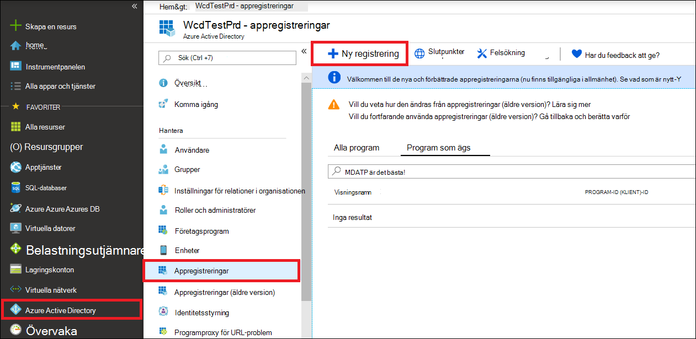
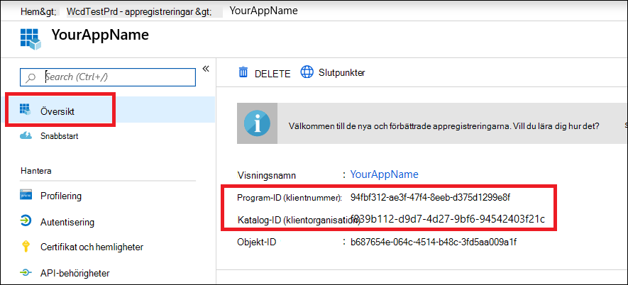

# <a name="create-an-app-to-access-microsoft-defender-for-endpoint-without-a-user"></a>Skapa en app för åtkomst till Microsoft Defender för slutpunkt utan en användare

[!INCLUDE [Microsoft 365 Defender rebranding](../../includes/microsoft-defender.md)]


**Gäller för:** [Microsoft Defender för slutpunkt](https://go.microsoft.com/fwlink/?linkid=2154037)

- Vill du uppleva Microsoft Defender för Slutpunkt? [Registrera dig för en kostnadsfri utvärderingsversion.](https://www.microsoft.com/microsoft-365/windows/microsoft-defender-atp?ocid=docs-wdatp-exposedapis-abovefoldlink)

[!include[Microsoft Defender for Endpoint API URIs for US Government](../../includes/microsoft-defender-api-usgov.md)]

[!include[Improve request performance](../../includes/improve-request-performance.md)]

På den här sidan beskrivs hur du skapar ett program för att få programtisk åtkomst till Defender för Endpoint utan en användare. Om du behöver programmeringsåtkomst till Defender för Endpoint för en användares räkning kan du gå till [Få åtkomst med användarkontext](exposed-apis-create-app-nativeapp.md). Om du inte är säker på vilken åtkomst du behöver kan du [gå till Komma igång.](apis-intro.md)

Microsoft Defender för slutpunkt visar mycket av dess data och åtgärder via en uppsättning programmässiga API:er. De HÄR API:erna hjälper dig att automatisera arbetsflöden och nyfikna baserat på Defender för Slutpunkt-funktioner. API-åtkomst kräver OAuth2.0-autentisering. Mer information finns i [OAuth 2.0 auktoriseringskod för Flow.](https://docs.microsoft.com/azure/active-directory/develop/active-directory-v2-protocols-oauth-code)

I allmänhet måste du vidta följande steg för att använda API:er:
- Skapa ett Azure Active Directory (Azure AD).
- Hämta en åtkomsttoken med det här programmet.
- Använd tokenet för att komma åt Defender för Endpoint API.

I den här artikeln förklaras hur du skapar ett Azure AD-program, hämtar en åtkomsttoken till Microsoft Defender för Endpoint och verifierar token.

## <a name="create-an-app"></a>Skapa en app

1. Logga in på [Azure](https://portal.azure.com) med en användare som har **rollen Global** administratör.

2. Gå till **Azure Active Directory**  >  **Appregistreringar**  >  **Ny registrering.** 

   

3. Välj ett namn på din ansökan i registreringsformuläret och välj sedan **Registrera**.

4. Om du vill aktivera appen för  att komma åt Defender för Slutpunkt och tilldela behörigheten Läs alla aviseringar väljer du API-behörigheter Lägg till **behörighets-API:er** som min organisation använder >, skriver  >    >   **WindowsDefenderATP** och väljer **sedan WindowsDefenderATP.**

   > [!NOTE]
   > *WindowsDefenderATP* visas inte i den ursprungliga listan. Börja skriva namnet i textrutan så att det visas.

   

   - Välj **Avisering om**  >  **programbehörigheter.Läs.Alla** och välj sedan Lägg till **behörigheter.**

   

     Du måste välja rätt behörighet. "Läs alla aviseringar" är bara ett exempel. Till exempel:

     - Om [du vill köra avancerade](run-advanced-query-api.md)frågor väljer du behörigheten Kör avancerade frågor.
     - Om [du vill isolera en](isolate-machine.md)enhet väljer du behörigheten "Isolera dator".
     - Du kan avgöra vilken behörighet du behöver i avsnittet **Behörigheter i** api:t som du vill anropa.

5. Välj **Bevilja medgivande**.

     > [!NOTE]
     > Varje gång du lägger till en behörighet måste du välja **Ge medgivande** för att den nya behörigheten ska gälla.

    

6. Om du vill lägga till en hemligt i programmet väljer **du Certifikat &,** lägger till en beskrivning till hemligheten och väljer sedan Lägg **till**.

    > [!NOTE]
    > När du har **valt Lägg** till väljer du kopiera **det genererade hemliga värdet**. Du kommer inte att kunna hämta det här värdet när du har lämnar det.

    

7. Skriv ned ditt program-ID och ditt klient-ID. Gå till Översikt på **programsidan och** kopiera följande.

   

8. **Endast för Microsoft Defender för slutpunktspartner.** Ange att appen ska ha flera klientorganisationsklienter (tillgänglig i alla klientorganisationen efter medgivande). Detta krävs **för** appar från tredje part (till exempel om du skapar ett program som ska köras i flera kunders klientorganisation). Detta krävs **inte** om du skapar en tjänst som du bara vill köra i klientorganisationen (till exempel om du skapar ett program för din egen användning som bara kommer att interagera med dina egna data). Så här anger du att programmet ska ha flera klientorganisationsklienter:

    - Gå till **Autentisering** och lägg till `https://portal.azure.com` som Redirect **URI.**

    - Längst ned på **sidan,** under Kontotyper  som stöds, väljer du Konton i ett organisationskatalogprograms medgivande för appen med flera innehavare.

    Du behöver att programmet ska godkännas i varje klientorganisation där du tänker använda det. Det beror på att ditt program interagerar Defender för Endpoint åt din kund.

    Du (eller kunden om du skriver en app från tredje part) måste välja länken för medgivande och godkänna appen. Medgivandet bör göras med en användare som har administratörsbehörighet i Active Directory.

    Medgivandelänken är utformad på följande sätt: 

    ```
    https://login.microsoftonline.com/common/oauth2/authorize?prompt=consent&client_id=00000000-0000-0000-0000-000000000000&response_type=code&sso_reload=true
    ```

    Där 00000000-0000-0000-0000-00000000000 ersätts med ditt program-ID.


**Klart!** Du har registrerat ett program! Se exempel nedan för insamling och validering av token.

## <a name="get-an-access-token"></a>Hämta en åtkomsttoken

Mer information om Azure AD-token finns i [självstudiekursen om Azure AD.](https://docs.microsoft.com/azure/active-directory/develop/active-directory-v2-protocols-oauth-client-creds)

### <a name="use-powershell"></a>Använda PowerShell

```powershell
# This script acquires the App Context Token and stores it in the variable $token for later use in the script.
# Paste your Tenant ID, App ID, and App Secret (App key) into the indicated quotes below.

$tenantId = '' ### Paste your tenant ID here
$appId = '' ### Paste your Application ID here
$appSecret = '' ### Paste your Application key here

$resourceAppIdUri = 'https://api.securitycenter.microsoft.com'
$oAuthUri = "https://login.microsoftonline.com/$TenantId/oauth2/token"
$authBody = [Ordered] @{
    resource = "$resourceAppIdUri"
    client_id = "$appId"
    client_secret = "$appSecret"
    grant_type = 'client_credentials'
}
$authResponse = Invoke-RestMethod -Method Post -Uri $oAuthUri -Body $authBody -ErrorAction Stop
$token = $authResponse.access_token
```

### <a name="use-c"></a>Använd C#:

Följande kod testades med NuGet Microsoft.IdentityModel.Clients.ActiveDirectory 3.19.8.

1. Skapa ett nytt konsolprogram.
1. Installera NuGet [Microsoft.IdentityModel.Clients.ActiveDirectory](https://www.nuget.org/packages/Microsoft.IdentityModel.Clients.ActiveDirectory/).
1. Lägg till följande:

    ```
    using Microsoft.IdentityModel.Clients.ActiveDirectory;
    ```

1. Kopiera och klistra in följande kod i programmet (glöm inte att uppdatera de tre variablerna: ```tenantId, appId, appSecret``` ):

    ```
    string tenantId = "00000000-0000-0000-0000-000000000000"; // Paste your own tenant ID here
    string appId = "11111111-1111-1111-1111-111111111111"; // Paste your own app ID here
    string appSecret = "22222222-2222-2222-2222-222222222222"; // Paste your own app secret here for a test, and then store it in a safe place! 

    const string authority = "https://login.microsoftonline.com";
    const string wdatpResourceId = "https://api.securitycenter.microsoft.com";

    AuthenticationContext auth = new AuthenticationContext($"{authority}/{tenantId}/");
    ClientCredential clientCredential = new ClientCredential(appId, appSecret);
    AuthenticationResult authenticationResult = auth.AcquireTokenAsync(wdatpResourceId, clientCredential).GetAwaiter().GetResult();
    string token = authenticationResult.AccessToken;
    ```


### <a name="use-python"></a>Använda Python

Se [Hämta token med Python](run-advanced-query-sample-python.md#get-token).

### <a name="use-curl"></a>Använd Avokrypt

> [!NOTE]
> Följande procedur förutsätter att Avig för Windows är redan installerat på datorn.

1. Öppna en kommandotolk och ange CLIENT_ID ditt Azure-program-ID.
1. Ställ CLIENT_SECRET till Azure-programhemligheten.
1. Ange TENANT_ID Azure-klientorganisations-ID för kunden som vill använda appen för att komma åt Defender för Slutpunkt.
1. Kör följande kommando:

```
curl -i -X POST -H "Content-Type:application/x-www-form-urlencoded" -d "grant_type=client_credentials" -d "client_id=%CLIENT_ID%" -d "scope=https://securitycenter.onmicrosoft.com/windowsatpservice/.default" -d "client_secret=%CLIENT_SECRET%" "https://login.microsoftonline.com/%TENANT_ID%/oauth2/v2.0/token" -k
```

Du får ett svar i följande formulär:

```
{"token_type":"Bearer","expires_in":3599,"ext_expires_in":0,"access_token":"eyJ0eXAiOiJKV1QiLCJhbGciOiJSUzI1NiIsIn <truncated> aWReH7P0s0tjTBX8wGWqJUdDA"}
```

## <a name="validate-the-token"></a>Verifiera token

Se till att du har fått rätt token:

1. Kopiera och klistra in den token du fick i föregående steg i [JWT](https://jwt.ms) för att avkoda den.
1. Verifiera att du får ett anspråk om "roller" med rätt behörighet
1. I följande bild kan du se en avkodad token som förvärvats från en app med behörighet till alla Microsoft Defender för Endpoints roller:


## <a name="use-the-token-to-access-microsoft-defender-for-endpoint-api"></a>Använda token för att komma åt Microsoft Defender för Endpoint API

1. Välj det API du vill använda. Mer information finns i Defender [för slutpunkts-API:er som stöds.](exposed-apis-list.md)
1. Ange ett auktoriseringshuvud i http-begäran som du skickar till "Bearer {token}" (Bearer är auktoriseringsschemat).
1. Utgångstiden för token är en timme. Du kan skicka fler än en begäran med samma token.

Följande är ett exempel på att skicka en begäran om att få en lista med aviseringar **med hjälp av C#**: 
```
    var httpClient = new HttpClient();

    var request = new HttpRequestMessage(HttpMethod.Get, "https://api.securitycenter.microsoft.com/api/alerts");

    request.Headers.Authorization = new AuthenticationHeaderValue("Bearer", token);

    var response = httpClient.SendAsync(request).GetAwaiter().GetResult();

    // Do something useful with the response
```

## <a name="see-also"></a>Se även
- [Microsoft Defender för Endpoint API:er som stöds](exposed-apis-list.md)
- [Åtkomst till Microsoft Defender för Endpoint åt en användare](exposed-apis-create-app-nativeapp.md)
