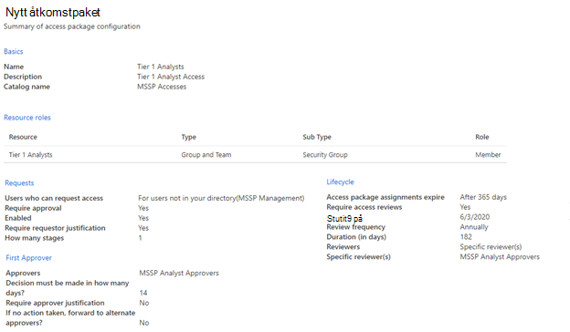
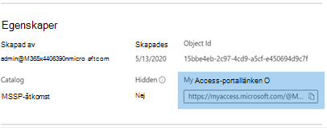

# Bevilja åtkomst för hanterad säkerhetstjänstleverantör (MSSP) (förhandsversion)

[!INCLUDE [Microsoft 365 Defender rebranding](../../includes/microsoft-defender.md)]

**Gäller för:**
- [Microsoft Defender för Endpoint](https://go.microsoft.com/fwlink/p/?linkid=2154037)
- [Microsoft 365 Defender](https://go.microsoft.com/fwlink/?linkid=2118804)

>Vill du använda Defender för Slutpunkt? [Registrera dig för en kostnadsfri utvärderingsversion.](https://www.microsoft.com/microsoft-365/windows/microsoft-defender-atp?ocid=docs-mssp-support-abovefoldlink)

>[!IMPORTANT] 
>En del information gäller förinstallerad produkt som kan ha ändrats mycket innan den släpps kommersiellt. Microsoft lämnar inga garantier, uttryckliga eller underförstådda, med avseende på den information som anges här.

Om du vill implementera en lösning med flera klientorganisationens delegerade åtkomst gör du följande:

1. Aktivera [rollbaserad åtkomstkontroll i](rbac.md) Defender för Endpoint och ansluta med Active Directory-grupper (AD).

2. Konfigurera [styrningsåtkomstpaket](https://docs.microsoft.com/azure/active-directory/governance/identity-governance-overview) för åtkomstbegäran och etablering.

3. Hantera åtkomstförfrågningar och granskningar i [Microsoft Myaccess.](https://docs.microsoft.com/azure/active-directory/governance/entitlement-management-request-approve)

## Aktivera rollbaserade åtkomstkontroller i Microsoft Defender för Endpoint

1. **Skapa åtkomstgrupper för MSSP-resurser i Kund-AAD: Grupper**

    De här grupperna länkas till de roller som du skapar i Defender för Slutpunkt. Det gör du genom att skapa tre grupper i kundens AD-klientorganisation. Med den här metoden skapar vi följande grupper:

    - Analytiker på nivå 1 
    - Analytiker på nivå 2 
    - Mssp-analytikers godkännare  

2. Skapa Defender för slutpunktsroller för lämpliga åtkomstnivåer i Customer Defender för Endpoint.

    Om du vill aktivera RBAC i kundens Microsoft Defender Säkerhetscenter öppnar du Inställningar > Behörigheter **>** Roller och "Aktivera roller" från ett användarkonto med rättigheter som global administratör eller säkerhetsadministratör.

    

    Skapa sedan RBAC-roller för att uppfylla behoven på MSSP-nivån. Länka de här rollerna till de skapade användargrupperna via "Tilldelade användargrupper".

    Två möjliga roller:

    - **Nivå 1-analytiker**  
      Utför alla åtgärder utom live-svar och hantera säkerhetsinställningar.

    - **Nivå 2-analytiker**  
      Nivå 1-funktioner med tillägg till [live-svar](live-response.md)

    Mer information finns i Använda [rollbaserad åtkomstkontroll.](rbac.md)

## Konfigurera styrningsåtkomstpaket

1.  **Lägg till MSSP som ansluten organisation i kund AAD: identitetsstyrning**
    
    Om du lägger till MSSP som en ansluten organisation kan MSSP begära åtkomst och tillhandahålla åtkomst. 

    Det gör du genom att i kundens AD-klientorganisation få åtkomst till identitetsstyrning: Ansluten organisation. Lägg till en ny organisation och sök efter din MSSP-analytiker via klientorganisations-ID eller domän. Vi föreslår att du skapar en separat AD-klientorganisation för dina MSSP-analytiker.

2. **Skapa en resurskatalog i Kund AAD: Identitetsstyrning**

    Resurskataloger är en logisk samling åtkomstpaket som skapats i kundens AD-klientorganisation.

    Det gör du genom att i kundens AD-klientorganisation få åtkomst till identitetsstyrning: kataloger och lägga till **ny katalog.** I exemplet kallar vi det **MSSP Accesses.** 

    

    Mer information finns i [Skapa en resurskatalog.](https://docs.microsoft.com/azure/active-directory/governance/entitlement-management-catalog-create)

3. **Skapa åtkomstpaket för MSSP-resurser Kund AAD: Identitetsstyrning**

    Åtkomstpaket är den samling av rättigheter och åtkomst som en begärare kommer att beviljas vid godkännande. 

    Det gör du genom att i kundens AD-klientorganisation få åtkomst till identitetsstyrning: Åtkomstpaket och lägga till **Nytt åtkomstpaket**. Skapa ett åtkomstpaket för MSSP-godkännare och varje analytiker. Följande analytikerkonfiguration på nivå 1 skapar till exempel ett åtkomstpaket som:

    - Kräver att en medlem i AD-gruppens **analytiker (MSSP) godkännare godkänner** nya begäranden
    - Har årliga åtkomstgranskningar, där SOC-analytiker kan begära ett åtkomsttillägg
    - Kan endast begäras av användare i MSSP-klientorganisationen
    - Access upphör automatiskt efter 365 dagar

    > [!div class="mx-imgBorder"]
    > 

    Mer information finns i [Skapa ett nytt åtkomstpaket.](https://docs.microsoft.com/azure/active-directory/governance/entitlement-management-access-package-create)

4. **Länk för åtkomstbegäran till MSSP-resurser från kund AAD: identitetsstyrning**

    Länken Min åtkomstportal används av MSSP SOC-analytiker för att begära åtkomst via de åtkomstpaket som skapats. Länken är beständiga, vilket innebär att samma länk kan användas med tiden för nya analytiker. Analytikerbegäran går i en kö för godkännande av analytiker som godkänner **MSSP.**

    > [!div class="mx-imgBorder"]
    > 

    Länken finns på översiktssidan för varje åtkomstpaket.

## Hantera åtkomst 

1. Granska och auktorisera åtkomstförfrågningar i Customer and/or MSSP myaccess.

    Åtkomstförfrågningar hanteras i kundens My Access av medlemmar i gruppen Analysts godkännare för MSSP.

    Det gör du genom att använda kundens myaccess med hjälp av:  `https://myaccess.microsoft.com/@<Customer Domain >` . 

    Exempel:  `https://myaccess.microsoft.com/@M365x440XXX.onmicrosoft.com#/`   
2. Godkänn eller neka förfrågningar i **avsnittet Godkännanden** i användargränssnittet.

    I det här läget har analytikernas åtkomst etablerats och varje analytiker ska kunna komma åt kundens Microsoft Defender Säkerhetscenter: `https://securitycenter.Microsoft.com/?tid=<CustomerTenantId>`

## Relaterade ämnen
- [Få åtkomst till MSSP-kundportalen](access-mssp-portal.md)
- [Konfigurera varningsaviseringar](configure-mssp-notifications.md)
- [Hämta varningar från kundens klientorganisation](fetch-alerts-mssp.md)

 

