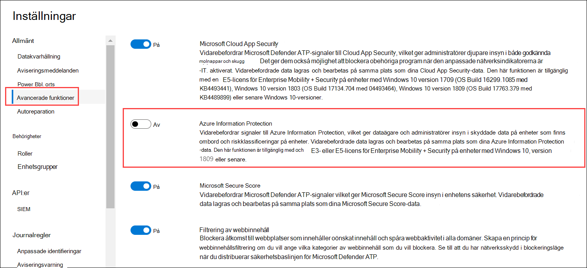
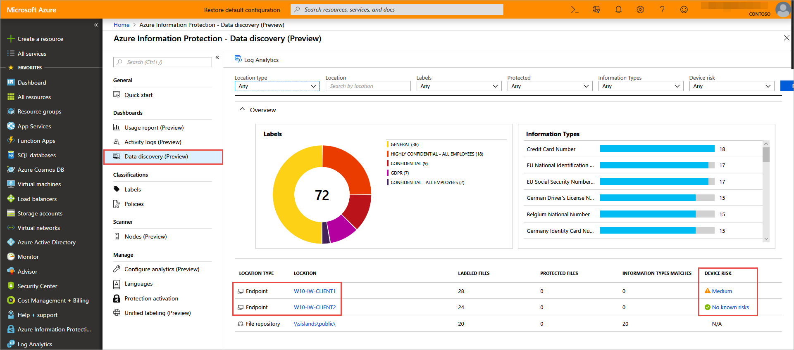

# <a name="information-protection-in-windows-overview"></a>Översikt över informationsskydd i Windows

[!INCLUDE [Microsoft 365 Defender rebranding](../../includes/microsoft-defender.md)]

**Gäller för:**

- [Microsoft Defender för Endpoint](https://go.microsoft.com/fwlink/p/?linkid=2154037)
- [Microsoft 365 Defender](https://go.microsoft.com/fwlink/?linkid=2118804)

> Vill du använda Defender för Slutpunkt? [Registrera dig för en kostnadsfri utvärderingsversion.](https://www.microsoft.com/microsoft-365/windows/microsoft-defender-atp?ocid=docs-wdatp-exposedapis-abovefoldlink) 


[!include[Prerelease information](../../includes/prerelease.md)]

Informationsskydd är en viktig del av Microsoft 365 Enterprise-programsviten, som ger intelligent skydd för att skydda känsliga data samtidigt som produktivitet på arbetsplatsen möjliggörs.


>[!TIP]
> Läs vårt blogginlägg om hur Microsoft Defender för Endpoint integreras med Microsoft Information Protection för att upptäcka, skydda och [övervaka känsliga data på Windows enheter.](https://cloudblogs.microsoft.com/microsoftsecure/2019/01/17/windows-defender-atp-integrates-with-microsoft-information-protection-to-discover-protect-and-monitor-sensitive-data-on-windows-devices/)

Defender för Endpoint tillämpar följande metoder för att identifiera, klassificera och skydda data:

- **Dataidentifiering** – Identifiera känsliga data på Windows-enheter som är i riskabelt
- **Dataklassificering** – Klassificera data automatiskt utifrån vanliga MicrosoftS informationsskyddsprinciper (MIP) som hanteras Office 365 säkerhets- & efterlevnadscenter. Med automatisk klassificering kan du skydda känsliga data även om slutanvändaren inte har klassificerat dem manuellt.


## <a name="data-discovery-and-data-classification"></a>Dataidentifiering och dataklassificering

Defender för Slutpunkt identifierar automatiskt filer med känslighetsetiketter och filer som innehåller typer av känslig information.

Känslighetsetiketter klassificerar och hjälper till att skydda känsligt innehåll.

Typer av känslig information i Office 365 DLP-implementering (Data Loss Prevention) faller under två kategorier:

- Standard
- Anpassad

Standardtyper för känslig information är t.ex. bankkontonummer, personnummer och nationella IT-nummer. Mer information finns i Vilken [typ av känslig information letar efter](/office365/securitycompliance/what-the-sensitive-information-types-look-for).

Anpassade typer är sådana som du definierar och som har utformats för att skydda olika typer av känslig information (till exempel anställnings-ID eller projektnummer). Mer information finns i Skapa [en anpassad typ av känslig information.](/office365/securitycompliance/create-a-custom-sensitive-information-type)

När en fil skapas eller redigeras på en Windows söker Defender för Slutpunkt igenom innehållet för att utvärdera om det innehåller känslig information.

Aktivera Azure Information Protection-integreringen så att när en fil som innehåller känslig information upptäcks av Defender för Endpoint, även om etiketter eller informationstyper, vidarebefordras den automatiskt till Azure Information Protection från enheten.



De rapporterade signalerna kan visas på Azure Information Protection – Instrumentpanelen för dataidentifiering.

## <a name="azure-information-protection---data-discovery-dashboard"></a>Azure Information Protection – Instrumentpanel för dataidentifiering

Den här instrumentpanelen visar en sammanfattad identifieringsinformation av data som upptäcks av både Defender för Endpoint och Azure Information Protection. Data från Defender för slutpunkt markeras med Platstyp – Slutpunkt.



Lägg märke till kolumnen Enhetsrisk till höger. Den här enhetsrisken härleds direkt från Defender för Endpoint, vilket anger risknivån för säkerhetsenheten där filen identifierats, baserat på de aktiva säkerhetshot som upptäckts av Defender för Endpoint.

Klicka på en enhet för att visa en lista med filer som observerats på enheten med deras känslighetsetiketter och informationstyper.

>[!NOTE]
>Det kan ta ungefär 15–20 minuter innan identifieringen av Azure Information Protection Dashboard återspeglar identifierade filer.

## <a name="log-analytics"></a>Logganalys

Dataidentifiering baserat på Defender för slutpunkt är också tillgängligt i [Azure Log Analytics](/azure/log-analytics/log-analytics-overview), där du kan utföra komplexa frågor över rådata.

Mer information om Azure Information Protection-analyser finns i [Central rapportering för Azure Information Protection.](/azure/information-protection/reports-aip)

Öppna Azure Log Analytics i Azure Portal och öppna ett frågeverktyg (standard eller klassisk).

Om du vill visa Defender för slutpunktsdata utför du en fråga som innehåller:

```
InformationProtectionLogs_CL
| where Workload_s == "Windows Defender"
```

**Krav:**

- Kunder måste ha en prenumeration på Azure Information Protection.
- Aktivera Azure Information Protection-integrering i Microsoft Defender Säkerhetscenter:
    - Gå till **Inställningar** i Microsoft Defender Säkerhetscenter, klicka på **Avancerat Inställningar** under **Allmänt.**


