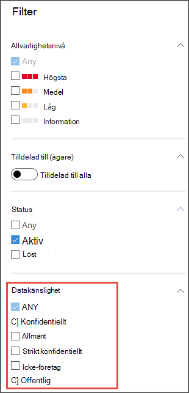
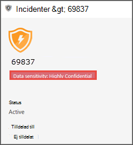
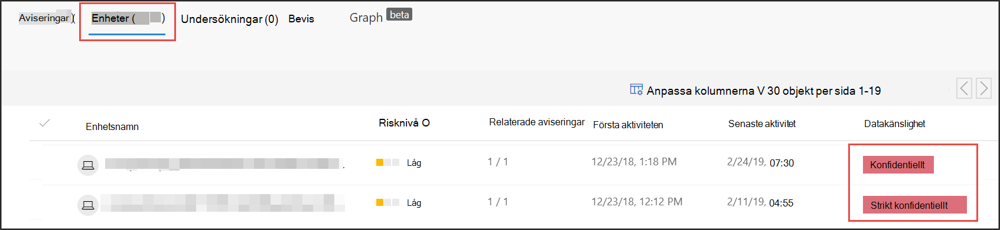
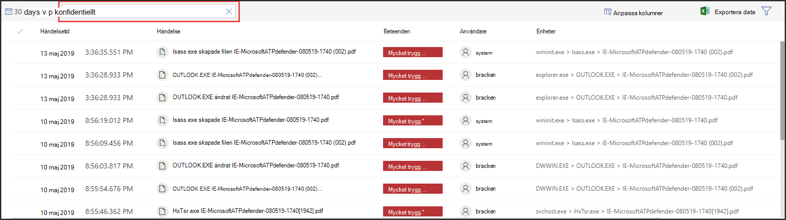

# Använda känslighetsetiketter för att prioritera incidentsvar  

[!INCLUDE [Microsoft 365 Defender rebranding](../../includes/microsoft-defender.md)]

**Gäller för:**
- [Microsoft Defender för Endpoint](https://go.microsoft.com/fwlink/p/?linkid=2146631)
- [Microsoft 365 Defender](https://go.microsoft.com/fwlink/?linkid=2118804)

> Vill du använda Defender för Slutpunkt? [Registrera dig för en kostnadsfri utvärderingsversion.](https://www.microsoft.com/microsoft-365/windows/microsoft-defender-atp?ocid=docs-wdatp-exposedapis-abovefoldlink) 

En typisk avancerad livscykel för beständiga hot involverar datainfiltrering. Vid säkerhetstillbud är det viktigt att ha möjlighet att prioritera undersökningar där känsliga filer kan vara känsliga så att företagsdata och företagsinformation skyddas.

Defender för Endpoint gör prioriteringen av säkerhetstillbud enklare med hjälp av känslighetsetiketter. Känslighetsetiketter identifierar snabbt incidenter som involverar enheter med känslig information, till exempel konfidentiell information. 

## Undersöka incidenter med känslig information
Lär dig hur du använder datakänslighetsetiketter för att prioritera undersökning av incidenter.

>[!NOTE]
>Etiketter identifieras för Windows 10, version 1809 eller senare.

1. Välj Incidenter i Microsoft Defender **Säkerhetscenter.** 

2. Rulla till höger för att se **kolumnen Datakänslighet.** I den här kolumnen visas känslighetsetiketter som har observerats på enheter som är relaterade till incidenterna och som anger om känsliga filer kan påverkas av händelsen.

    

    Du kan också filtrera baserat på **datakänslighet** 

    

3. Öppna incidentsidan för ytterligare undersökning.

    

4. Välj fliken **Enheter** för att identifiera enheter som lagrar filer med känslighetsetiketter.

    
   

5. Välj de enheter som lagrar känsliga data och sök igenom tidslinjen för att identifiera vilka filer som kan påverkas och vidta lämpliga åtgärder för att säkerställa att data skyddas. 

   Du kan begränsa händelser som visas på enhetens tidslinje genom att söka efter datakänslighetsetiketter. Då visas endast händelser som är associerade med filer som har sa etikettnamn.

    

>[!TIP]
>Dessa datapunkter visas även genom DeviceFileEvents vid avancerad sökning, så att avancerade frågor och schemaidentifiering kan ta hänsyn till känslighetsetiketter och filskyddsstatus. 
