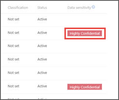

# Använda känslighetsetiketter för att prioritera incidentsvarUse sensitivity labels to prioritize incident response  

[!INCLUDE [Microsoft 365 Defender rebranding](../../includes/microsoft-defender.md)]

**Gäller för:****Applies to:**
- [Microsoft Defender för EndpointMicrosoft Defender for Endpoint](https://go.microsoft.com/fwlink/p/?linkid=2154037)
- [Microsoft 365 DefenderMicrosoft 365 Defender](https://go.microsoft.com/fwlink/?linkid=2118804)

> Vill du använda Defender för Slutpunkt?Want to experience Defender for Endpoint? [Registrera dig för en kostnadsfri utvärderingsversion.Sign up for a free trial.](https://www.microsoft.com/microsoft-365/windows/microsoft-defender-atp?ocid=docs-wdatp-exposedapis-abovefoldlink) 

En typisk avancerad livscykel för beständiga hot involverar datainfiltrering.A typical advanced persistent threat lifecycle involves data exfiltration. Vid säkerhetstillbud är det viktigt att ha möjlighet att prioritera undersökningar där känsliga filer kan vara känsliga så att företagsdata och företagsinformation skyddas.In a security incident, it's important to have the ability to prioritize investigations where sensitive files may be jeopardy so that corporate data and information are protected.

Defender för Endpoint gör prioriteringen av säkerhetstillbud enklare med hjälp av känslighetsetiketter.Defender for Endpoint helps to make the prioritization of security incidents much simpler with the use of sensitivity labels. Känslighetsetiketter identifierar snabbt incidenter som involverar enheter med känslig information, till exempel konfidentiell information.Sensitivity labels quickly identify incidents that may involve devices with sensitive information such as confidential information. 

## Undersöka incidenter med känslig informationInvestigate incidents that involve sensitive data
Lär dig hur du använder datakänslighetsetiketter för att prioritera undersökning av incidenter.Learn how to use data sensitivity labels to prioritize incident investigation.

>[!NOTE]
>Etiketter identifieras för Windows 10, version 1809 eller senare.Labels are detected for Windows 10, version 1809 or later.

1. I Microsoft Defender Säkerhetscenter du **Incidenter**.In Microsoft Defender Security Center, select **Incidents**. 

2. Rulla till höger för att se **kolumnen Datakänslighet.**Scroll to the right to see the **Data sensitivity** column. I den här kolumnen visas känslighetsetiketter som har observerats på enheter som är relaterade till incidenterna och som anger om känsliga filer kan påverkas av händelsen.This column reflects sensitivity labels that have been observed on devices related to the incidents providing an indication of whether sensitive files may be impacted by the incident.

    

    Du kan också filtrera baserat på **datakänslighet**You can also filter based on **Data sensitivity** 

    

3. Öppna incidentsidan för ytterligare undersökning.Open the incident page to further investigate.

    

4. Välj fliken **Enheter** för att identifiera enheter som lagrar filer med känslighetsetiketter.Select the **Devices** tab to identify devices storing files with sensitivity labels.

    
   

5. Välj de enheter som lagrar känsliga data och sök igenom tidslinjen för att identifiera vilka filer som kan påverkas och vidta lämpliga åtgärder för att säkerställa att data skyddas.Select the devices that store sensitive data and search through the timeline to identify which files may be impacted then take appropriate action to ensure that data is protected. 

   Du kan begränsa händelser som visas på enhetens tidslinje genom att söka efter datakänslighetsetiketter.You can narrow down the events shown on the device timeline by searching for data sensitivity labels. Då visas endast händelser som är associerade med filer som har sa etikettnamn.Doing this will show only events associated with files that have said label name.

    

>[!TIP]
>Dessa datapunkter visas även genom DeviceFileEvents vid avancerad sökning, så att avancerade frågor och schemaidentifiering kan ta hänsyn till känslighetsetiketter och filskyddsstatus.These data points are also exposed through the ‘DeviceFileEvents’ in advanced hunting, allowing advanced queries and schedule detection to take into account sensitivity labels and file protection status. 
