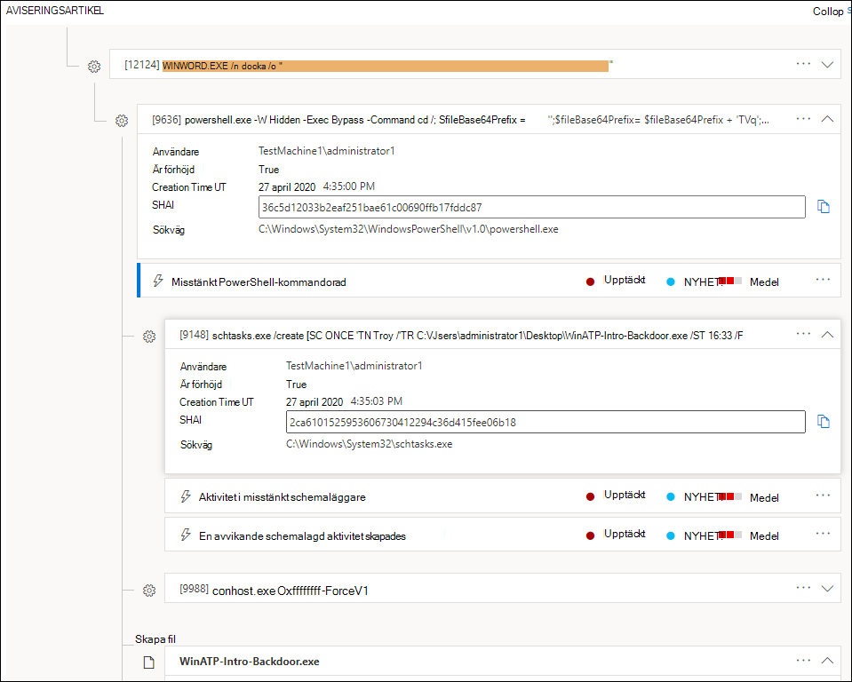
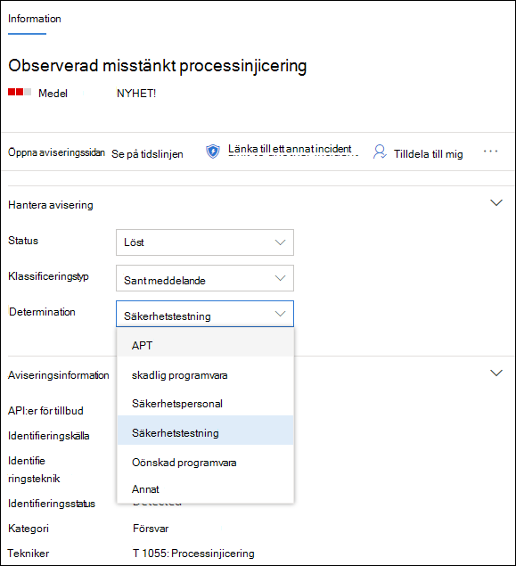
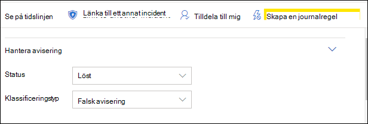

# Undersöka aviseringar i Microsoft Defender för Slutpunkt

[!INCLUDE [Microsoft 365 Defender rebranding](../../includes/microsoft-defender.md)]

**Gäller för:**
- [Microsoft Defender för Endpoint](https://go.microsoft.com/fwlink/p/?linkid=2154037)
- [Microsoft 365 Defender](https://go.microsoft.com/fwlink/?linkid=2118804)

>Vill du använda Defender för Slutpunkt? [Registrera dig för en kostnadsfri utvärderingsversion.](https://www.microsoft.com/microsoft-365/windows/microsoft-defender-atp?ocid=docs-wdatp-investigatealerts-abovefoldlink) 

Undersök aviseringar som påverkar nätverket, förstå vad de betyder och hur du löser dem.

Välj en avisering från aviseringskön för att gå till aviseringssidan. Den här vyn innehåller aviseringsrubriken, de berörda tillgångarna, informationsfönstret och aviseringsartikeln.

Från aviseringssidan börjar du din undersökning genom att välja de berörda tillgångarna eller någon av enheterna under trädvyn för aviseringsartikeln. Informationsfönstret fylls automatiskt i med ytterligare information om det du har markerat. Om du vill se vilken typ av information du kan visa här kan du läsa [Granska aviseringar i Microsoft Defender för slutpunkt.](/microsoft-365/security/defender-endpoint/review-alerts)

## Undersök användning av aviseringsartikeln

Information om aviseringsinformationen varför aviseringen utlöstes, relaterade händelser som inträffat före och efter, samt andra relaterade enheter.

Enheter är klickbara och alla enheter som inte är en avisering kan utökas med hjälp av expanderikonen på höger sida av enhetens kort. Enheten i fokus anges med ett blått band till vänster om enhetens kort, med varningen i fokus först.

Utöka enheterna för att få en snabb överblick över informationen. När du väljer en entitet växlas kontexten för informationsfönstret till den här enheten och du kan granska ytterligare information och hantera den enheten. Om *du markerar ...* till höger om entitetskortet visas alla åtgärder som är tillgängliga för den enheten. Samma åtgärder visas i informationsfönstret när entiteten är i fokus.

> [!NOTE]
> Avsnittet med aviseringsavsnittet kan innehålla fler än en avisering, och ytterligare aviseringar om samma körningsträd visas före eller efter den avisering du har markerat.

## Vidta åtgärder från informationsfönstret

När du har valt en intresseenhet ändras informationsfönstret för att visa information om den valda entitetstypen, historisk information när den är tillgänglig och erbjuder kontroller för att vidta åtgärder på den här enheten direkt från aviseringssidan. 

När du har undersökt klart går du tillbaka till den avisering  du började med, markerar aviseringens status som Löst och klassificerar den som antingen **Falsk avisering** eller **Sant-avisering.** Klassificera aviseringar hjälper till att finjustera den här funktionen för att ge mer sanna aviseringar och mindre falska aviseringar.

Om du klassificerar det som en verklig varning kan du också välja ett avgörande, som visas i bilden nedan.

Om du får en falsk avisering med ett affärsprogram skapar du en regel för att undvika den här typen av avisering i framtiden.

> [!TIP]
> Om du har problem som inte beskrivs ovan kan du använda knappen för 🙂 att ge feedback eller öppna ett supportärenden.

## Relaterade ämnen
- [Visa och ordna kön Microsoft Defender för slutpunktsaviseringar](alerts-queue.md)
- [Hantera Microsoft Defender för slutpunktsaviseringar](manage-alerts.md)
- [Undersöka en fil som är kopplad till en Defender för slutpunktsavisering](investigate-files.md)
- [Undersök enheter i listan Defender för slutpunktsenheter](investigate-machines.md)
- [Undersöka en IP-adress som är kopplad till en Defender för Slutpunktsavisering](investigate-ip.md)
- [Undersöka en domän som är kopplad till en Defender för slutpunktsavisering](investigate-domain.md)
- [Undersöka ett användarkonto i Defender för Slutpunkt](investigate-user.md)

