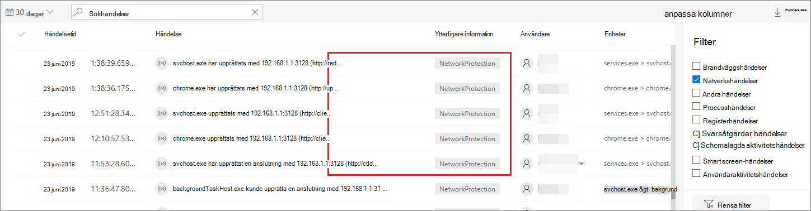
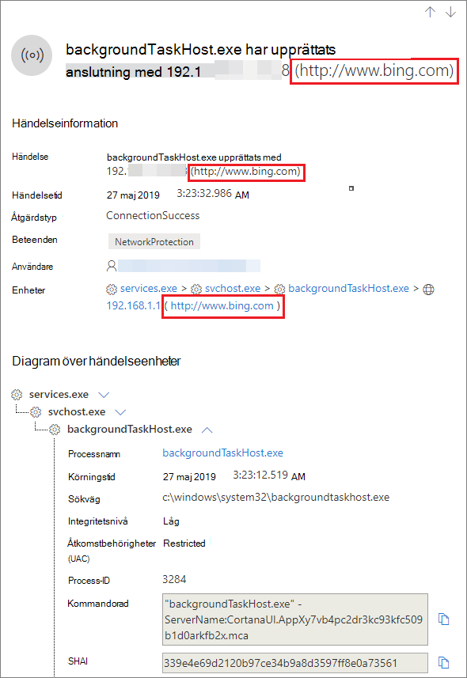
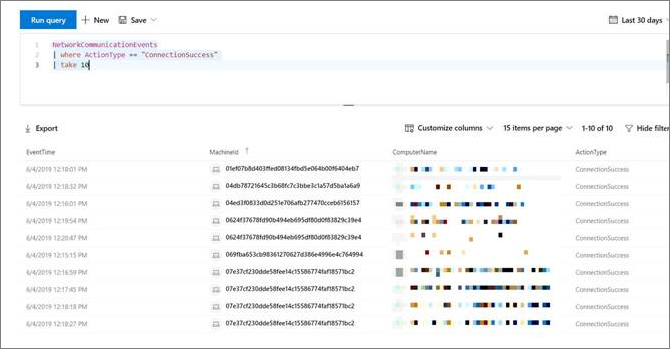

# <a name="investigate-connection-events-that-occur-behind-forward-proxies"></a><span data-ttu-id="cb13a-104">Undersöka anslutningshändelser som inträffar bakom framåt proxy</span><span class="sxs-lookup"><span data-stu-id="cb13a-104">Investigate connection events that occur behind forward proxies</span></span>

[!INCLUDE [Microsoft 365 Defender rebranding](../../includes/microsoft-defender.md)]

<span data-ttu-id="cb13a-105">**Gäller för:**</span><span class="sxs-lookup"><span data-stu-id="cb13a-105">**Applies to:**</span></span>
- [<span data-ttu-id="cb13a-106">Microsoft Defender för Endpoint</span><span class="sxs-lookup"><span data-stu-id="cb13a-106">Microsoft Defender for Endpoint</span></span>](https://go.microsoft.com/fwlink/p/?linkid=2146631)
- [<span data-ttu-id="cb13a-107">Microsoft 365 Defender</span><span class="sxs-lookup"><span data-stu-id="cb13a-107">Microsoft 365 Defender</span></span>](https://go.microsoft.com/fwlink/?linkid=2118804)

> <span data-ttu-id="cb13a-108">Vill du använda Defender för Slutpunkt?</span><span class="sxs-lookup"><span data-stu-id="cb13a-108">Want to experience Defender for Endpoint?</span></span> [<span data-ttu-id="cb13a-109">Registrera dig för en kostnadsfri utvärderingsversion.</span><span class="sxs-lookup"><span data-stu-id="cb13a-109">Sign up for a free trial.</span></span>](https://www.microsoft.com/microsoft-365/windows/microsoft-defender-atp?ocid=docs-wdatp-investigatemachines-abovefoldlink)

<span data-ttu-id="cb13a-110">Defender för Endpoint har stöd för övervakning av nätverksanslutningen från olika nivåer av nätverksstacken.</span><span class="sxs-lookup"><span data-stu-id="cb13a-110">Defender for Endpoint supports network connection monitoring from different levels of the network stack.</span></span> <span data-ttu-id="cb13a-111">Ett svårt fall är när nätverket använder en framåtproxy som en gateway till Internet.</span><span class="sxs-lookup"><span data-stu-id="cb13a-111">A challenging case is when the network uses a forward proxy as a gateway to the Internet.</span></span>

<span data-ttu-id="cb13a-112">Proxyn fungerar som om den var målslutpunkten.</span><span class="sxs-lookup"><span data-stu-id="cb13a-112">The proxy acts as if it was the target endpoint.</span></span>  <span data-ttu-id="cb13a-113">I sådana fall granskar enkla nätverksanslutningsskärmar anslutningarna med proxyn, vilket är korrekt men har ett lägre undersökningsvärde.</span><span class="sxs-lookup"><span data-stu-id="cb13a-113">In these cases, simple network connection monitors will audit the connections with the proxy which is correct but has lower investigation value.</span></span> 

<span data-ttu-id="cb13a-114">Defender för Endpoint har stöd för avancerad HTTP-nivåövervakning via nätverksskydd.</span><span class="sxs-lookup"><span data-stu-id="cb13a-114">Defender for Endpoint supports advanced HTTP level monitoring through network protection.</span></span> <span data-ttu-id="cb13a-115">När den är aktiverad visas en ny typ av händelse där de verkliga domännamnen visas.</span><span class="sxs-lookup"><span data-stu-id="cb13a-115">When turned on, a new type of event is surfaced which exposes the real target domain names.</span></span>

## <a name="use-network-protection-to-monitor-network-connection-behind-a-firewall"></a><span data-ttu-id="cb13a-116">Använda nätverksskydd för att övervaka nätverksanslutningen bakom en brandvägg</span><span class="sxs-lookup"><span data-stu-id="cb13a-116">Use network protection to monitor network connection behind a firewall</span></span>
<span data-ttu-id="cb13a-117">Det är möjligt att övervaka nätverksanslutningen bakom en vidarebefordrad proxyserver på grund av ytterligare nätverkshändelser som kommer från nätverksskyddet.</span><span class="sxs-lookup"><span data-stu-id="cb13a-117">Monitoring network connection behind a forward proxy is possible due to additional network events that originate from network protection.</span></span> <span data-ttu-id="cb13a-118">Om du vill visa dem på en tidslinje på en enhet aktiverar du nätverksskyddet (minst i granskningsläge).</span><span class="sxs-lookup"><span data-stu-id="cb13a-118">To see them on a device timeline, turn network protection on (at the minimum in audit mode).</span></span> 

<span data-ttu-id="cb13a-119">Nätverksskyddet kan styras med hjälp av följande lägen:</span><span class="sxs-lookup"><span data-stu-id="cb13a-119">Network protection can be controlled using the following modes:</span></span>

- <span data-ttu-id="cb13a-120">**Blockera**</span><span class="sxs-lookup"><span data-stu-id="cb13a-120">**Block**</span></span> <br> <span data-ttu-id="cb13a-121">Användare eller appar kommer att blockeras från att ansluta till skadliga domäner.</span><span class="sxs-lookup"><span data-stu-id="cb13a-121">Users or apps will be blocked from connecting to dangerous domains.</span></span> <span data-ttu-id="cb13a-122">Du kan se aktiviteten i Microsoft Defender Säkerhetscenter.</span><span class="sxs-lookup"><span data-stu-id="cb13a-122">You will be able to see this activity in Microsoft Defender Security Center.</span></span>
- <span data-ttu-id="cb13a-123">**Granskning**</span><span class="sxs-lookup"><span data-stu-id="cb13a-123">**Audit**</span></span> <br> <span data-ttu-id="cb13a-124">Användare eller appar kommer inte att blockeras från att ansluta till skadliga domäner.</span><span class="sxs-lookup"><span data-stu-id="cb13a-124">Users or apps will not be blocked from connecting to dangerous domains.</span></span> <span data-ttu-id="cb13a-125">Men den här aktiviteten visas fortfarande i Microsoft Defender Säkerhetscenter.</span><span class="sxs-lookup"><span data-stu-id="cb13a-125">However, you will still see this activity in Microsoft Defender Security Center.</span></span>


<span data-ttu-id="cb13a-126">Om du inaktiverar nätverksskydd blockeras inte användare eller appar från att ansluta till skadliga domäner.</span><span class="sxs-lookup"><span data-stu-id="cb13a-126">If you turn network protection off, users or apps will not be blocked from connecting to dangerous domains.</span></span> <span data-ttu-id="cb13a-127">Du ser ingen nätverksaktivitet i Microsoft Defender Säkerhetscenter.</span><span class="sxs-lookup"><span data-stu-id="cb13a-127">You will not see any network activity in Microsoft Defender Security Center.</span></span>

<span data-ttu-id="cb13a-128">Om du inte konfigurerar den inaktiveras nätverksblockering som standard.</span><span class="sxs-lookup"><span data-stu-id="cb13a-128">If you do not configure it, network blocking will be turned off by default.</span></span>

<span data-ttu-id="cb13a-129">Mer information finns i [Aktivera nätverksskydd](enable-network-protection.md).</span><span class="sxs-lookup"><span data-stu-id="cb13a-129">For more information, see [Enable network protection](enable-network-protection.md).</span></span>

## <a name="investigation-impact"></a><span data-ttu-id="cb13a-130">Undersöknings påverkan</span><span class="sxs-lookup"><span data-stu-id="cb13a-130">Investigation impact</span></span>
<span data-ttu-id="cb13a-131">När nätverksskyddet är aktiverat ser du att IP-adressen fortsätter representera proxyn på en enhets tidslinje, medan den verkliga måladressen visas.</span><span class="sxs-lookup"><span data-stu-id="cb13a-131">When network protection is turned on, you'll see that on a device's timeline the IP address will keep representing the proxy, while the real target address shows up.</span></span>



<span data-ttu-id="cb13a-133">Ytterligare händelser som utlöses av nätverkets skyddslager är nu tillgängliga för att ta fram de verkliga domännamnen även bakom en proxy.</span><span class="sxs-lookup"><span data-stu-id="cb13a-133">Additional events triggered by the network protection layer are now available to surface the real domain names even behind a proxy.</span></span>

<span data-ttu-id="cb13a-134">Händelsens information:</span><span class="sxs-lookup"><span data-stu-id="cb13a-134">Event's information:</span></span>




## <a name="hunt-for-connection-events-using-advanced-hunting"></a><span data-ttu-id="cb13a-136">Sök efter anslutningshändelser med avancerad sökning</span><span class="sxs-lookup"><span data-stu-id="cb13a-136">Hunt for connection events using advanced hunting</span></span> 
<span data-ttu-id="cb13a-137">Alla nya anslutningshändelser är också tillgängliga så att du kan leta efter avancerad sökning.</span><span class="sxs-lookup"><span data-stu-id="cb13a-137">All new connection events are available for you to hunt on through advanced hunting as well.</span></span> <span data-ttu-id="cb13a-138">Eftersom dessa händelser är anslutningshändelser kan du hitta dem under tabellen DeviceNetworkEvents under `ConnecionSuccess` åtgärdstyp.</span><span class="sxs-lookup"><span data-stu-id="cb13a-138">Since these events are connection events, you can find them under the DeviceNetworkEvents table under the `ConnecionSuccess` action type.</span></span>

<span data-ttu-id="cb13a-139">Med den här enkla frågan visas alla relevanta händelser:</span><span class="sxs-lookup"><span data-stu-id="cb13a-139">Using this simple query will show you all the relevant events:</span></span>

```
DeviceNetworkEvents
| where ActionType == "ConnectionSuccess" 
| take 10
```



<span data-ttu-id="cb13a-141">Du kan också filtrera bort händelser som är relaterade till anslutningen till själva proxyn.</span><span class="sxs-lookup"><span data-stu-id="cb13a-141">You can also filter out  events that are related to connection to the proxy itself.</span></span> 

<span data-ttu-id="cb13a-142">Använd följande fråga för att filtrera ut anslutningarna till proxyn:</span><span class="sxs-lookup"><span data-stu-id="cb13a-142">Use the following query to filter out the connections to the proxy:</span></span>

```
DeviceNetworkEvents
| where ActionType == "ConnectionSuccess" and RemoteIP != "ProxyIP"  
| take 10
```


## <a name="related-topics"></a><span data-ttu-id="cb13a-143">Relaterade ämnen</span><span class="sxs-lookup"><span data-stu-id="cb13a-143">Related topics</span></span>
- [<span data-ttu-id="cb13a-144">Tillämpa nätverksskydd med GP – princip-CSP</span><span class="sxs-lookup"><span data-stu-id="cb13a-144">Applying network protection with GP - policy CSP</span></span>](https://docs.microsoft.com/windows/client-management/mdm/policy-csp-defender#defender-enablenetworkprotection)
