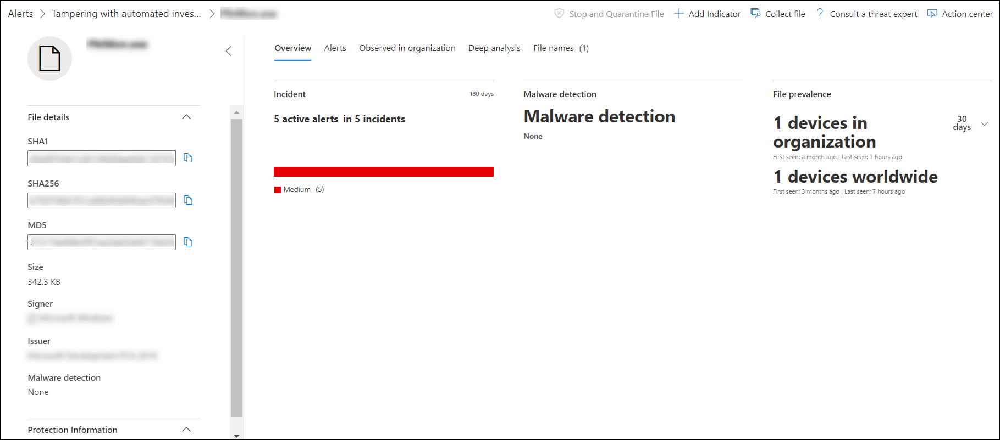

# Undersöka en fil som är kopplad till en Microsoft Defender för slutpunktsavisering

[!INCLUDE [Microsoft 365 Defender rebranding](../../includes/microsoft-defender.md)]

**Gäller för:**
- [Microsoft Defender för Endpoint](https://go.microsoft.com/fwlink/p/?linkid=2154037)
- [Microsoft 365 Defender](https://go.microsoft.com/fwlink/?linkid=2118804)

>Vill du använda Defender för Slutpunkt? [Registrera dig för en kostnadsfri utvärderingsversion.](https://www.microsoft.com/microsoft-365/windows/microsoft-defender-atp?ocid=docs-wdatp-investigatefiles-abovefoldlink)

Undersök informationen i en fil som är associerad med en viss avisering, ett visst beteende eller en händelse för att avgöra om filen har skadliga aktiviteter, identifiera attackor motivationen och förstå den potentiella omfattningen av intrånget.

Det finns många sätt att komma åt den detaljerade profilsidan för en viss fil. Du kan till exempel använda sökfunktionen, klicka på en länk från **aviseringsprocessens träd** **,** incidentdiagram, artefakttidslinje eller välja en händelse som visas på **enhetens tidslinje**.

När du är på den detaljerade profilsidan kan du växla mellan de nya och gamla sidlayouterna genom att byta **ny Filsida**. Resten av den här artikeln beskriver den nyare sidlayouten.

Du kan hämta information från följande avsnitt i filvyn:

- Filinformation, identifiering av skadlig kod, filföresökning
- Djupanalys
- Varningar
- Observerad i organisationen
- Djupanalys
- Filnamn

Du kan också vidta åtgärder för en fil från den här sidan.

## Filåtgärder

Ovanför filinformationskorten längst upp på profilsidan. Åtgärder som du kan utföra här är:

- Stoppa och sätta i karantän
- Indikator för att lägga till/redigera
- Ladda ned fil
- Kontakta en hotexpert
- Åtgärdscenter

Mer information om de här åtgärderna finns i [Vidta svarsåtgärder för en fil.](respond-file-alerts.md)

## Filinformation, identifiering av skadlig kod och fildeektering

Filinformation, incident, identifiering av skadlig kod och arkiv som innehåller information om filen visar olika attribut om filen.

Du ser information som filens MD5, förhållandet för total virusidentifiering och Microsoft Defender AV-identifiering om det finns tillgängligt, samt filens läkare.

Filens kreditkort visar var filen sågs på enheter i organisationen och i hela världen. 

> [!NOTE] 
> Olika användare kan se olika värden i enheten i *organisationsavsnittet* av filens kreditkort. Det beror på att kortet visar information baserat på RBAC-omfattningen som en användare har. Det betyder att om en användare har beviljats insyn på en viss uppsättning enheter kan de bara se filen som organisatorisk mapp på de enheterna.

## Varningar

På **fliken** Aviseringar finns en lista med aviseringar som är associerade med filen. Listan täcker mycket av samma information som kön Aviseringar, utom för enhetsgruppen, om sådan finns, den aktuella enheten tillhör. Du kan välja vilken typ av information som visas genom att **välja Anpassa** kolumner i verktygsfältet ovanför kolumnrubrikerna.

## Observerad i organisationen

På **fliken Observerad i** organisationen kan du ange ett datumintervall för att se vilka enheter som har observerats med filen.

>[!NOTE]
>Den här fliken visar maximalt antal 100 enheter. Om du _vill_ visa alla enheter med filen exporterar du fliken till en CSV-fil genom att välja **Exportera** i åtgärdsmenyn ovanför flikens kolumnrubriker.

Använd skjutreglaget eller områdesväljaren för att snabbt ange en tidsperiod som du vill kontrollera händelser som innefattar filen. Du kan ange ett så litet tidsfönster som en enda dag. Det gör att du kan se endast filer som kommunicerade med IP-adressen vid den tidpunkten, vilket avsevärt minskar onödig bläddring och sökning.

## Djupanalys

På **fliken Djupanalys** kan du skicka filen för djupanalys för att få mer information om filens beteende och den effekt den får i dina organisationer. När du har skickat filen visas den djupa analysrapporten på den här fliken när resultaten är tillgängliga. Om djupanalys inte hittar något är rapporten tom och resultatutrymmet förblir tomt.

## Filnamn

På **fliken Filnamn** visas alla namn som filen har observerats att använda i dina organisationer.

## Relaterade ämnen

- [Visa och ordna microsoft Defender för slutpunktskön](alerts-queue.md)
- [Hantera Microsoft Defender för slutpunktsaviseringar](manage-alerts.md)
- [Undersöka Microsoft Defender för slutpunktsaviseringar](investigate-alerts.md)
- [Undersöka enheter i listan Microsoft Defender för slutpunktsenheter](investigate-machines.md)
- [Undersöka en IP-adress som är kopplad till en Microsoft Defender för Slutpunktsavisering](investigate-ip.md)
- [Undersöka en domän som är kopplad till en Microsoft Defender för slutpunktsavisering](investigate-domain.md)
- [Undersöka ett användarkonto i Microsoft Defender för Endpoint](investigate-user.md)
- [Utföra svarsåtgärder för en fil](respond-file-alerts.md)
