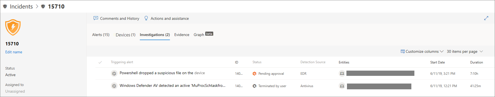

# Undersöka incidenter i Microsoft Defender för Slutpunkt

[!INCLUDE [Microsoft 365 Defender rebranding](../../includes/microsoft-defender.md)]

**Gäller för:**
- [Microsoft Defender för Endpoint](https://go.microsoft.com/fwlink/p/?linkid=2146631)
- [Microsoft 365 Defender](https://go.microsoft.com/fwlink/?linkid=2118804)

Undersök incidenter som påverkar nätverket, förstå vad de betyder och samla bevis för att lösa dem. 

När du undersöker en händelse ser du:
- Incidentinformation
- Incidentkommentarer och åtgärder
- Flikar (aviseringar, enheter, undersökningar, bevis, diagram)

> [!VIDEO https://www.microsoft.com/en-us/videoplayer/embed/RE4qLUV]

## Analysera incidentinformation 
Klicka på en incident om du vill **visa fönstret Incident.** Välj **Öppna incidentsida om** du vill se incidentinformation och relaterad information (aviseringar, enheter, undersökningar, bevis, graf). 

### Varningar
Du kan undersöka aviseringarna och se hur de länkades ihop vid en incident. Aviseringar grupperas i incidenter baserat på följande anledningar:
- Automatisk undersökning – Den automatiska undersökningen utlöste den länkade aviseringen när den ursprungliga aviseringen undersöks 
- Filegenskaper – De filer som är associerade med aviseringen har liknande egenskaper
- Manuell koppling – En användare länkade aviseringarna manuellt
- Proximatisk tid – Aviseringarna utlöstes på samma enhet inom en viss tidsperiod
- Samma fil – Filerna som är associerade med aviseringen är exakt likadana
- Samma URL – URL:en som utlöste aviseringen är exakt samma

Du kan också hantera en avisering och se metadata för aviseringar tillsammans med annan information. Mer information finns i [Undersöka aviseringar](investigate-alerts.md). 

### Enheter
Du kan också undersöka vilka enheter som är en del av eller relaterade till en viss händelse. Mer information finns i [Undersöka enheter](investigate-machines.md).

### Undersökningar
Välj **Undersökningar** om du vill se alla automatiska undersökningar som startats av systemet som svar på incidentaviseringarna.

## Gå igenom bevisen
Microsoft Defender för slutpunkt undersöker automatiskt alla händelser som stöds och misstänkta enheter i aviseringarna, vilket ger dig information om viktiga filer, processer, tjänster och mycket mer. 

Alla analyserade enheter markeras som smittade, åtgärdade eller misstänkta. 

## Visualisera associerade hot mot cybersäkerhet 
Microsoft Defender för Endpoint sammanställer hotinformationen till en incident så att du kan se de mönster och korrelationer som kommer in från olika datapunkter. Du kan visa en sådan korrelation via incidentdiagrammet.

### Incidentdiagram
Graph **berättar** om cybersäkerhetsattacken. Den visar till exempel vad som var startpunkten, vilken indikator på kompromettering eller aktivitet som observerats på vilken enhet. o.s.v.

Du kan klicka på cirklarna i incidentdiagrammet för att visa information om skadliga filer, associerade filidentifieringar, hur många förekomster som har gjorts i hela världen, om det har observerats i organisationen, i så fall hur många instanser.

## Relaterade ämnen
- [Incidentkö](https://docs.microsoft.com/microsoft-365/security/defender-endpoint/view-incidents-queue)
- [Undersöka incidenter i Microsoft Defender för Slutpunkt](https://docs.microsoft.com/microsoft-365/security/defender-endpoint/investigate-incidents)
- [Hantera Microsoft Defender för slutpunktsincidenter](https://docs.microsoft.com/microsoft-365/security/defender-endpoint/manage-incidents)
