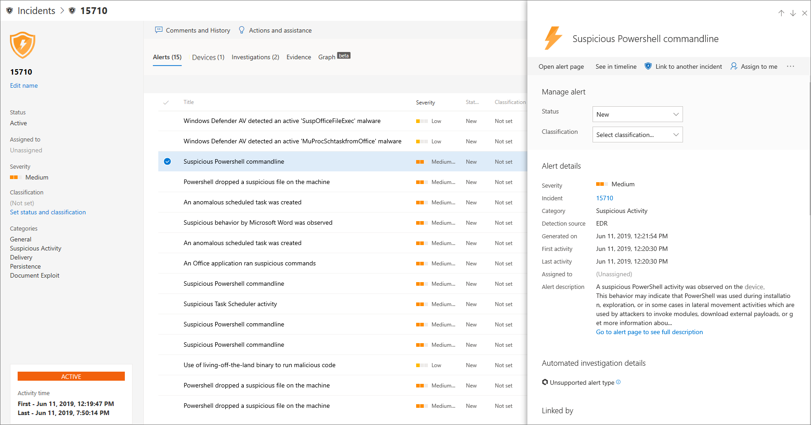

# Undersöka incidenter i Microsoft Defender för SlutpunktInvestigate incidents in Microsoft Defender for Endpoint

[!INCLUDE [Microsoft 365 Defender rebranding](../../includes/microsoft-defender.md)]

**Gäller för:****Applies to:**
- [Microsoft Defender för EndpointMicrosoft Defender for Endpoint](https://go.microsoft.com/fwlink/p/?linkid=2154037)
- [Microsoft 365 DefenderMicrosoft 365 Defender](https://go.microsoft.com/fwlink/?linkid=2118804)

Undersök incidenter som påverkar nätverket, förstå vad de betyder och samla bevis för att lösa dem.Investigate incidents that affect your network, understand what they mean, and collate evidence to resolve them. 

När du undersöker en händelse ser du:When you investigate an incident, you'll see:
- IncidentinformationIncident details
- Incidentkommentarer och åtgärderIncident comments and actions
- Flikar (aviseringar, enheter, undersökningar, bevis, diagram)Tabs (alerts, devices, investigations, evidence, graph)

> [!VIDEO https://www.microsoft.com/en-us/videoplayer/embed/RE4qLUV]

## Analysera incidentinformationAnalyze incident details 
Klicka på en incident om du vill **visa fönstret Incident.**Click an incident to see the **Incident pane**. Välj **Öppna incidentsida om** du vill se incidentinformation och relaterad information (aviseringar, enheter, undersökningar, bevis, graf).Select **Open incident page** to see the incident details and related information (alerts, devices, investigations, evidence, graph). 

### VarningarAlerts
Du kan undersöka aviseringarna och se hur de länkades ihop vid en incident.You can investigate the alerts and see how they were linked together in an incident. Aviseringar grupperas i incidenter baserat på följande anledningar:Alerts are grouped into incidents based on the following reasons:
- Automatisk undersökning – Den automatiska undersökningen utlöste den länkade aviseringen när den ursprungliga aviseringen undersöksAutomated investigation - The automated investigation triggered the linked alert while investigating the original alert 
- Filegenskaper – De filer som är associerade med aviseringen har liknande egenskaperFile characteristics - The files associated with the alert have similar characteristics
- Manuell koppling – En användare länkade aviseringarna manuelltManual association - A user manually linked the alerts
- Proximatisk tid – Aviseringarna utlöstes på samma enhet inom en viss tidsperiodProximate time - The alerts were triggered on the same device within a certain timeframe
- Samma fil – Filerna som är associerade med aviseringen är exakt likadanaSame file - The files associated with the alert are exactly the same
- Samma URL – URL:en som utlöste aviseringen är exakt sammaSame URL - The URL that triggered the alert is exactly the same

Du kan också hantera en avisering och se metadata för aviseringar tillsammans med annan information.You can also manage an alert and see alert metadata along with other information. Mer information finns i [Undersöka aviseringar](investigate-alerts.md).For more information, see [Investigate alerts](investigate-alerts.md). 

### EnheterDevices
Du kan också undersöka vilka enheter som är en del av eller relaterade till en viss händelse.You can also investigate the devices that are part of, or related to, a given incident. Mer information finns i [Undersöka enheter](investigate-machines.md).For more information, see [Investigate devices](investigate-machines.md).

### UndersökningarInvestigations
Välj **Undersökningar** om du vill se alla automatiska undersökningar som startats av systemet som svar på incidentaviseringarna.Select **Investigations** to see all the automatic investigations launched by the system in response to the incident alerts.

## Gå igenom bevisenGoing through the evidence
Microsoft Defender för slutpunkt undersöker automatiskt alla händelser som stöds och misstänkta enheter i aviseringarna, vilket ger dig information om viktiga filer, processer, tjänster och mycket mer.Microsoft Defender for Endpoint automatically investigates all the incidents' supported events and suspicious entities in the alerts, providing you with autoresponse and information about the important files, processes, services, and more. 

Alla analyserade enheter markeras som smittade, åtgärdade eller misstänkta.Each of the analyzed entities will be marked as infected, remediated, or suspicious. 

## Visualisera associerade hot mot cybersäkerhetVisualizing associated cybersecurity threats 
Microsoft Defender för Endpoint sammanställer hotinformationen till en incident så att du kan se de mönster och korrelationer som kommer in från olika datapunkter.Microsoft Defender for Endpoint aggregates the threat information into an incident so you can see the patterns and correlations coming in from various data points. Du kan visa en sådan korrelation via incidentdiagrammet.You can view such correlation through the incident graph.

### IncidentdiagramIncident graph
Graph **berättar** om cybersäkerhetsattacken.The **Graph** tells the story of the cybersecurity attack. Den visar till exempel vad som var startpunkten, vilken indikator på kompromettering eller aktivitet som observerats på vilken enhet.For example, it shows you what was the entry point, which indicator of compromise or activity was observed on which device. o.s.v.etc.

Du kan klicka på cirklarna i incidentdiagrammet för att visa information om skadliga filer, associerade filidentifieringar, hur många förekomster som har gjorts i hela världen, om det har observerats i organisationen, i så fall hur många instanser.You can click the circles on the incident graph to view the details of the malicious files, associated file detections, how many instances have there been worldwide, whether it’s been observed in your organization, if so, how many instances.

## Relaterade ämnenRelated topics
- [IncidentköIncidents queue](https://docs.microsoft.com/microsoft-365/security/defender-endpoint/view-incidents-queue)
- [Undersöka incidenter i Microsoft Defender för SlutpunktInvestigate incidents in Microsoft Defender for Endpoint](https://docs.microsoft.com/microsoft-365/security/defender-endpoint/investigate-incidents)
- [Hantera Microsoft Defender för slutpunktsincidenterManage Microsoft Defender for Endpoint incidents](https://docs.microsoft.com/microsoft-365/security/defender-endpoint/manage-incidents)
