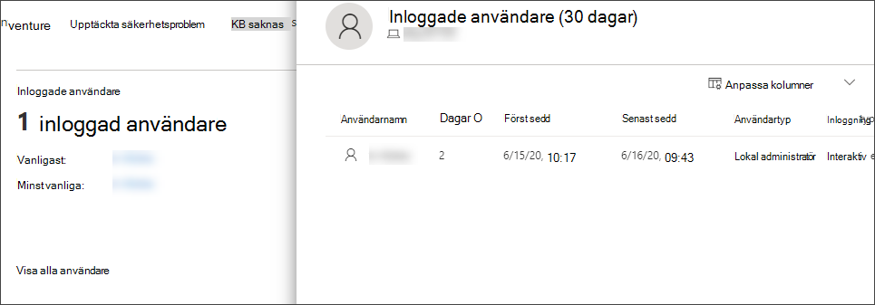

# Undersöka enheter i listan Microsoft Defender för slutpunktsenheterInvestigate devices in the Microsoft Defender for Endpoint Devices list

[!INCLUDE [Microsoft 365 Defender rebranding](../../includes/microsoft-defender.md)]

**Gäller för:****Applies to:**
- [Microsoft Defender för EndpointMicrosoft Defender for Endpoint](https://go.microsoft.com/fwlink/p/?linkid=2154037)
- [Microsoft 365 DefenderMicrosoft 365 Defender](https://go.microsoft.com/fwlink/?linkid=2118804)

>Vill du använda Defender för Slutpunkt?Want to experience Defender for Endpoint? [Registrera dig för en kostnadsfri utvärderingsversion.Sign up for a free trial.](https://www.microsoft.com/microsoft-365/windows/microsoft-defender-atp?ocid=docs-wdatp-investigatemachines-abovefoldlink)

Undersök informationen om en avisering som upphöjts på en specifik enhet för att identifiera andra beteenden eller händelser som kan vara relaterade till aviseringen eller den möjliga omfattningen av intrånget.Investigate the details of an alert raised on a specific device to identify other behaviors or events that might be related to the alert or the potential scope of the breach.

> [!NOTE]
> Som en del av undersökningen eller svarsprocessen kan du samla in ett undersökningspaket från en enhet.As part of the investigation or response process, you can collect an investigation package from a device. Gör så här: Samla [in undersökningspaket från enheter](https://docs.microsoft.com/microsoft-365/security/defender-endpoint/respond-machine-alerts#collect-investigation-package-from-devices).Here's how: [Collect investigation package from devices](https://docs.microsoft.com/microsoft-365/security/defender-endpoint/respond-machine-alerts#collect-investigation-package-from-devices).

Du kan klicka på berörda enheter när du ser dem i portalen för att öppna en detaljerad rapport om enheten.You can click on affected devices whenever you see them in the portal to open a detailed report about that device. Enheter som påverkas identifieras i följande områden:Affected devices are identified in the following areas:

- [EnhetslistaDevices list](investigate-machines.md)
- [VarningsköAlerts queue](alerts-queue.md)
- [Instrumentpanel för säkerhetsåtgärderSecurity operations dashboard](security-operations-dashboard.md)
- Alla enskilda aviseringarAny individual alert
- Alla enskilda vy med filinformationAny individual file details view
- En IP-adress eller domäninformationsvyAny IP address or domain details view

När du undersöker en specifik enhet visas:When you investigate a specific device, you'll see:

- EnhetsinformationDevice details
- SvarsåtgärderResponse actions
- Flikar (översikt, varningar, tidslinje, säkerhetsrekommendationer, programlager, identifierade säkerhetsproblem, saknade KBS)Tabs (overview, alerts, timeline, security recommendations, software inventory, discovered vulnerabilities, missing KBs)
- Kort (aktiva aviseringar, inloggade användare, säkerhetsbedömning)Cards (active alerts, logged on users, security assessment)

## EnhetsinformationDevice details

Avsnittet med enhetsinformation innehåller information som enhetens domän, operativsystem och status.The device details section provides information such as the domain, OS, and health state of the device. Om det finns ett undersökningspaket tillgängligt på enheten visas en länk som gör att du kan ladda ned paketet.If there's an investigation package available on the device, you'll see a link that allows you to download the package.

## SvarsåtgärderResponse actions

Svarsåtgärder löper högst upp på en specifik enhet och omfattar:Response actions run along the top of a specific device page and include:

- Hantera taggarManage tags
- Identifiera enhetIsolate device
- Begränsa körning av programRestrict app execution
- Kör antivirusgenomsökningRun antivirus scan
- Samla in undersökningspaketCollect investigation package
- Starta Live Response-sessionInitiate Live Response Session
- Initiera en automatiserad undersökningInitiate automated investigation
- Konsultera en hotexpertConsult a threat expert
- ÅtgärdscenterAction center

Du kan vidta åtgärder för svar i Åtgärdscenter, på en viss enhet eller på en viss filsida.You can take response actions in the Action center, in a specific device page, or in a specific file page.

Mer information om hur du vidta åtgärder på en enhet finns i [Vidta svarsåtgärder på en enhet.](respond-machine-alerts.md)For more information on how to take action on a device, see [Take response action on a device](respond-machine-alerts.md).

Mer information finns i Undersöka [användarenheter.](investigate-user.md)For more information, see [Investigate user entities](investigate-user.md).

## FlikarTabs

Flikarna ger relevant information om säkerhet och skydd mot hot som är relaterade till enheten.The tabs provide relevant security and threat prevention information related to the device. På varje flik kan du anpassa de kolumner som visas genom att välja **Anpassa kolumner** från fältet ovanför kolumnrubrikerna.In each tab, you can customize the columns that are shown by selecting **Customize columns** from the bar above the column headers.

### ÖversiktOverview
På **fliken** Översikt visas [korten](#cards) för aktiva aviseringar, inloggade användare och säkerhetsbedömning.The **Overview** tab displays the [cards](#cards) for active alerts, logged on users, and security assessment.

### VarningarAlerts

På **fliken** Aviseringar finns en lista med aviseringar som är associerade med enheten.The **Alerts** tab provides a list of alerts that are associated with the device. Den här listan är en filtrerad version av kön Aviseringar och visar en kort beskrivning av aviseringen, allvarlighetsgraden (hög, medium, låg, information), status i kön (ny, pågående, löst), klassificering (inte inställd, falsk avisering, verklig varning), undersökningstillstånd, kategori av avisering, vem som adresserar aviseringen och den senaste aktiviteten.This list is a filtered version of the [Alerts queue](alerts-queue.md), and shows a short description of the alert, severity (high, medium, low, informational), status in the queue (new, in progress, resolved), classification (not set, false alert, true alert), investigation state, category of alert, who is addressing the alert, and last activity. Du kan också filtrera aviseringarna.You can also filter the alerts.

När cirkelikonen till vänster om en avisering är markerad visas en utfällsymbol.When the circle icon to the left of an alert is selected, a fly-out appears. Från den här panelen kan du hantera aviseringen och visa mer information, till exempel incidentnummer och relaterade enheter.From this panel you can manage the alert and view more details such as incident number and related devices. Du kan välja flera aviseringar åt gången.Multiple alerts can be selected at a time.

Om du vill se en helsida med en avisering som innehåller incidentdiagram och processträd väljer du aviseringens rubrik.To see a full page view of an alert including incident graph and process tree, select the title of the alert.

### TidslinjeTimeline

På **fliken** Tidslinje visas en kronologisk vy över händelserna och tillhörande aviseringar som har observerats på enheten.The **Timeline** tab provides a chronological view of the events and associated alerts that have been observed on the device. Det kan hjälpa dig korrelera händelser, filer och IP-adresser i relation till enheten.This can help you correlate any events, files, and IP addresses in relation to the device.

På tidslinjen kan du även selektivt granska nedåt i händelser som inträffat under en viss tidsperiod.The timeline also enables you to selectively drill down into events that occurred within a given time period. Du kan visa tidssekvensen av händelser som inträffat på en enhet under en viss tidsperiod.You can view the temporal sequence of events that occurred on a device over a selected time period. Om du vill ha mer kontroll över vyn kan du filtrera efter händelsegrupper eller anpassa kolumnerna.To further control your view, you can filter by event groups or customize the columns.

>[!NOTE]
> För att brandväggshändelser ska visas måste du aktivera granskningsprincipen i Anslutning till [granskningsfiltreringsplattform.](https://docs.microsoft.com/windows/security/threat-protection/auditing/audit-filtering-platform-connection)For firewall events to be displayed, you'll need to enable the audit policy, see [Audit Filtering Platform connection](https://docs.microsoft.com/windows/security/threat-protection/auditing/audit-filtering-platform-connection).
>Brandväggen omfattar följande händelserFirewall covers the following events
>
>- [5025 –](https://docs.microsoft.com/windows/security/threat-protection/auditing/event-5025) brandväggstjänsten har stoppats[5025](https://docs.microsoft.com/windows/security/threat-protection/auditing/event-5025) - firewall service stopped
>- [5031](https://docs.microsoft.com/windows/security/threat-protection/auditing/event-5031) – programmet kan inte acceptera inkommande anslutningar i nätverket[5031](https://docs.microsoft.com/windows/security/threat-protection/auditing/event-5031) - application blocked from accepting incoming connections on the network
>- [5157](https://docs.microsoft.com/windows/security/threat-protection/auditing/event-5157) – blockerad anslutning[5157](https://docs.microsoft.com/windows/security/threat-protection/auditing/event-5157) - blocked connection

Några av funktionerna omfattar:Some of the functionality includes:

- Söka efter specifika händelserSearch for specific events
  - Använd sökfältet för att söka efter specifika tidslinjehändelser.Use the search bar to look for specific timeline events.
- Filtrera händelser från ett visst datumFilter events from a specific date
  - Välj kalenderikonen uppe till vänster i tabellen om du vill visa händelser under den senaste dagen, veckan, 30 dagar eller det anpassade intervallet.Select the calendar icon in the upper left of the table to display events in the past day, week, 30 days, or custom range. Som standard är enhetens tidslinje inställd på att visa händelser från de senaste 30 dagarna.By default, the device timeline is set to display the events from the past 30 days.
  - Använd tidslinjen för att hoppa till en viss tidpunkt genom att markera avsnittet.Use the timeline to jump to a specific moment in time by highlighting the section. Pilarna på tidslinjens pinpoint för automatiserade undersökningarThe arrows on the timeline pinpoint automated investigations
- Exportera detaljerade tidslinjehändelser för enheterExport detailed device timeline events
  - Exportera enhetens tidslinje för det aktuella datumet eller ett angivet datumintervall upp till sju dagar.Export the device timeline for the current date or a specified date range up to seven days.

Mer information om vissa händelser finns i **avsnittet Ytterligare information.**More details about certain events are provided in the **Additional information** section. Den här informationen varierar beroende på typen av händelse, till exempel:These details vary depending on the type of event, for example: 

- Finns av Application Guard – webbläsarhändelsen begränsades av en isolerad behållareContained by Application Guard - the web browser event was restricted by an isolated container
- Aktiva hot upptäcktes – hotidentifieringen inträffade medan hoten kördesActive threat detected - the threat detection occurred while the threat was running
- Åtgärd lyckades inte – ett försök att åtgärda det identifierade hotet anropades men misslyckadesRemediation unsuccessful - an attempt to remediate the detected threat was invoked but failed
- Åtgärd lyckades – det identifierade hotet har stoppats och åtgärdatsRemediation successful - the detected threat was stopped and cleaned
- Varning som förbikopplats av användaren – Windows Defender SmartScreen-varningen avvisades och åsidosättdes av en användareWarning bypassed by user - the Windows Defender SmartScreen warning was dismissed and overridden by a user
- Misstänkt skript har upptäckts – ett skript som kan vara skadligt hittades när det kördesSuspicious script detected - a potentially malicious script was found running
- Aviseringskategorin – om händelsen ledde till en avisering genereras aviseringskategorin ("T.ex. aviseringsrörelse")The alert category - if the event led to the generation of an alert, the alert category  ("Lateral Movement", for example) is provided

#### HändelseinformationEvent details
Välj en händelse om du vill visa relevant information om händelsen.Select an event to view relevant details about that event. En panel visas för att visa allmän händelseinformation.A panel displays to show general event information. När tillämpliga data är tillgängliga visas även ett diagram som visar relaterade enheter och deras relationer.When applicable and data is available, a graph showing related entities and their relationships are also shown.

Om du vill kontrollera händelsen ytterligare och relaterade händelser kan du snabbt köra en [avancerad fråga om sökning](advanced-hunting-overview.md) genom att välja Sök efter relaterade **händelser.**To further inspect the event and related events, you can quickly run an [advanced hunting](advanced-hunting-overview.md) query by selecting **Hunt for related events**. Frågan returnerar den valda händelsen och listan med andra händelser som inträffade samtidigt på samma slutpunkt.The query will return the selected event and the list of other events that occurred around the same time on the same endpoint.

### SäkerhetsrekommendationerSecurity recommendations

**Säkerhetsrekommendationer** genereras från Microsoft Defender för Endpoints hot för [& Sårbarhetshantering.](tvm-dashboard-insights.md)**Security recommendations** are generated from Microsoft Defender for Endpoint's [Threat & Vulnerability Management](tvm-dashboard-insights.md) capability. Om du väljer en rekommendation visas en panel där du kan se relevant information, till exempel en beskrivning av rekommendationen och potentiella risker som är förknippade med att inte anta den.Selecting a recommendation will show a panel where you can view relevant details such as description of the recommendation and the potential risks associated with not enacting it. Mer [information finns i Säkerhetsrekommendationer.](tvm-security-recommendation.md)See [Security recommendation](tvm-security-recommendation.md) for details.

### ProgramvaruinventeringSoftware inventory

På **fliken För inventering** av programvara kan du visa programvara på enheten och se eventuella hot eller svagheter.The **Software inventory** tab lets you view software on the device, along with any weaknesses or threats. Om du markerar namnet på programvaran kommer du till sidan med programvaruinformation där du kan se säkerhetsrekommendationer, identifierade säkerhetsproblem, installerade enheter och versionsdistribution.Selecting the name of the software will take you to the software details page where you can view security recommendations, discovered vulnerabilities, installed devices, and version distribution. Se [Inventering av programvara](tvm-software-inventory.md) för mer informationSee [Software inventory](tvm-software-inventory.md) for details

### Upptäckta säkerhetsproblemDiscovered vulnerabilities

På **fliken Identifierade säkerhetsproblem** visas namn, allvarlighetsgrad och information om hot om identifierade säkerhetsproblem på enheten.The **Discovered vulnerabilities** tab shows the name, severity, and threat insights of discovered vulnerabilities on the device. Om du väljer specifika säkerhetsproblem visas en beskrivning och information.Selecting specific vulnerabilities will show a description and details.

### Saknade KBsMissing KBs
På **fliken saknade KB** visas de säkerhetsuppdateringar som saknas för enheten.The **Missing KBs** tab lists the missing security updates for the device.

## KortCards

### Aktiva aviseringarActive alerts

**Kortet Azure Advanced Threat Protection** visar en översikt över aviseringar relaterade till enheten och deras risknivå, om du har aktiverat Azure ATP-funktionen och det finns aktiva aviseringar.The **Azure Advanced Threat Protection** card will display a high-level overview of alerts related to the device and their risk level, if you have enabled the Azure ATP feature, and there are any active alerts. Mer information finns i den granskande detaljgranskningen "Aviseringar".More information is available in the "Alerts" drill down.

>[!NOTE]
>Du måste aktivera integreringen på både Azure ATP och Defender för Endpoint om du vill använda den här funktionen.You'll need to enable the integration on both Azure ATP and Defender for Endpoint to use this feature. I Defender för Slutpunkt kan du aktivera den här funktionen i avancerade funktioner.In Defender for Endpoint, you can enable this feature in advanced features. Mer information om hur du aktiverar avancerade funktioner finns i [Aktivera avancerade funktioner.](advanced-features.md)For more information on how to enable advanced features, see [Turn on advanced features](advanced-features.md).

### Inloggade användareLogged on users

Kortet **Inloggade användare visar** hur många användare som har loggat in de senaste 30 dagarna, tillsammans med de mest och minst vanliga användarna.The **Logged on users** card shows how many users have logged on in the past 30 days, along with the most and least frequent users. Om du väljer länken "Visa alla användare" öppnas informationsfönstret med information som användartyp, inloggningstyp och när användaren sågs för första och sista gången.Selecting the "See all users" link opens the details pane, which displays information such as user type, log on type, and when the user was first and last seen. Mer information finns i Undersöka [användarenheter.](investigate-user.md)For more information, see [Investigate user entities](investigate-user.md).

### SäkerhetsutvärderingarSecurity assessments

Kortet **för säkerhetsutvärderingar** visar den totala exponeringsnivån, säkerhetsrekommendationer, installerad programvara och identifierade säkerhetsproblem.The **Security assessments** card shows the overall exposure level, security recommendations, installed software, and discovered vulnerabilities. Exponeringsnivån för en enhet bestäms av den kumulativa effekten av de väntande säkerhetsrekommendationerna.A device's exposure level is determined by the cumulative impact of its pending security recommendations.

## Relaterade ämnenRelated topics

- [Visa och ordna kön Microsoft Defender för slutpunktsaviseringarView and organize the Microsoft Defender for Endpoint Alerts queue](alerts-queue.md)
- [Hantera Microsoft Defender för slutpunktsaviseringarManage Microsoft Defender for Endpoint alerts](manage-alerts.md)
- [Undersöka Microsoft Defender för slutpunktsaviseringarInvestigate Microsoft Defender for Endpoint alerts](investigate-alerts.md)
- [Undersöka en fil som är kopplad till en Defender för slutpunktsaviseringInvestigate a file associated with a Defender for Endpoint alert](investigate-files.md)
- [Undersöka en IP-adress som är kopplad till en Defender för SlutpunktsaviseringInvestigate an IP address associated with a Defender for Endpoint alert](investigate-ip.md)
- [Undersöka en domän som är kopplad till en Defender för slutpunktsaviseringInvestigate a domain associated with a Defender for Endpoint alert](investigate-domain.md)
- [Undersöka ett användarkonto i Defender för SlutpunktInvestigate a user account in Defender for Endpoint](investigate-user.md)
- [SäkerhetsrekommendationerSecurity recommendation](tvm-security-recommendation.md)
- [ProgramvaruinventeringSoftware inventory](tvm-software-inventory.md)
