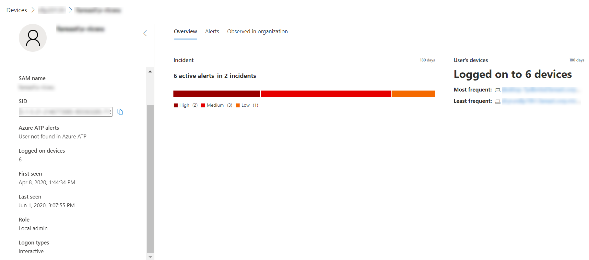

# Undersöka ett användarkonto i Microsoft Defender för EndpointInvestigate a user account in Microsoft Defender for Endpoint

[!INCLUDE [Microsoft 365 Defender rebranding](../../includes/microsoft-defender.md)]

**Gäller för:****Applies to:**
- [Microsoft Defender för EndpointMicrosoft Defender for Endpoint](https://go.microsoft.com/fwlink/p/?linkid=2154037)
- [Microsoft 365 DefenderMicrosoft 365 Defender](https://go.microsoft.com/fwlink/?linkid=2118804)

>Vill du använda Defender för Slutpunkt?Want to experience Defender for Endpoint? [Registrera dig för en kostnadsfri utvärderingsversion.Sign up for a free trial.](https://www.microsoft.com/microsoft-365/windows/microsoft-defender-atp?ocid=docs-wdatp-investigatgeuser-abovefoldlink)

## Undersöka enheter för användarkontonInvestigate user account entities

Identifiera användarkonton med de mest aktiva aviseringarna (visas på instrumentpanelen som "Användare på risk") och undersöker fall av potentiella komprometterade autentiseringsuppgifter, eller pivotera på det associerade användarkontot när du undersöker en avisering eller enhet för att identifiera möjlig mobil rörelse mellan enheter med det användarkontot.Identify user accounts with the most active alerts (displayed on dashboard as "Users at risk") and investigate cases of potential compromised credentials, or pivot on the associated user account when investigating an alert or device to identify possible lateral movement between devices with that user account.

Användarkontoinformationen finns i följande vyer:You can find user account information in the following views:

- InstrumentpanelenDashboard
- AviseringsköAlert queue
- Sidan EnhetsinformationDevice details page

I de här vyerna finns det en klickbar länk till användarkontots informationssida där mer information om användarkontot visas.A clickable user account link is available in these views, that will take you to the user account details page where more details about the user account are shown.

När du undersöker en användarkontotitet visas:When you investigate a user account entity, you'll see:

- Användarkontoinformation, Microsoft Defender för identitetsaviseringar och inloggad på enheter, roll, inloggningstyp och annan informationUser account details, Microsoft Defender for Identity alerts, and logged on devices, role, logon type, and other details
- Översikt över incidenter och användarens enheterOverview of the incidents and user's devices
- Aviseringar relaterade till den här användarenAlerts related to this user
- Observerad i organisationen (enheter som är inloggade)Observed in organization (devices logged on to)

### AnvändarinformationUser details

I  fönstret Användarinformation till vänster finns information om användaren, till exempel relaterade öppna incidenter, aktiva aviseringar, SAM-namn, SID, Microsoft Defender för identitetsaviseringar, antalet enheter som användaren är inloggad på, när användaren sågs för första och sista gången, roll och inloggning.The **User details** pane on left provides information about the user, such as related open incidents, active alerts, SAM name, SID, Microsoft Defender for Identity alerts, number of devices the user is logged on to, when the user was first and last seen, role, and logon types. Beroende på vilka integrationsfunktioner du har aktiverat visas annan information.Depending on the integration features you've enabled, you'll see other details. Om du till exempel aktiverar Skype för företag-integrering kommer du att kunna kontakta användaren från portalen.For example, if you enable the Skype for business integration, you'll be able to contact the user from the portal. Avsnittet **Azure ATP-aviseringar** innehåller en länk som tar dig till sidan Microsoft Defender för identitet om du har aktiverat Microsoft Defender för identitetsfunktionen och det finns aviseringar relaterade till användaren.The **Azure ATP alerts** section contains a link that will take you to the Microsoft Defender for Identity page, if you have enabled the Microsoft Defender for Identity feature, and there are alerts related to the user. På sidan Microsoft Defender för identitet hittar du mer information om aviseringarna.The Microsoft Defender for Identity page will provide more information about the alerts.

>[!NOTE]
>Du måste aktivera integreringen på både Microsoft Defender för identitet och Defender för Endpoint om du vill använda den här funktionen.You'll need to enable the integration on both Microsoft Defender for Identity and Defender for Endpoint to use this feature. I Defender för Slutpunkt kan du aktivera den här funktionen i avancerade funktioner.In Defender for Endpoint, you can enable this feature in advanced features. Mer information om hur du aktiverar avancerade funktioner finns i [Aktivera avancerade funktioner.](advanced-features.md)For more information on how to enable advanced features, see [Turn on advanced features](advanced-features.md).

Översikt, aviseringar och observerade i organisationen är olika flikar som visar olika attribut om användarkontot.The Overview, Alerts, and Observed in organization are different tabs that display various attributes about the user account.

### ÖversiktOverview

På **fliken** Översikt visas incidentinformation och en lista med de enheter som användaren har loggat in på.The **Overview** tab shows the incidents details and a list of the devices that the user has logged on to. Du kan expandera dessa om du vill se information om inloggningshändelserna för varje enhet.You can expand these to see details of the log-on events for each device.

### VarningarAlerts

På **fliken** Aviseringar finns en lista med aviseringar som är kopplade till användarkontot.The **Alerts** tab provides a list of alerts that are associated with the user account. Den här listan är en filtrerad vy av aviseringskön och visar aviseringar där användarkontexten är det valda användarkontot, datumet när den senaste aktiviteten upptäcktes, en kort beskrivning av aviseringen, enheten som är kopplad till aviseringen, aviseringens allvarlighetsgrad, aviseringens status i kön och vem som har tilldelats aviseringen.This list is a filtered view of the [Alert queue](alerts-queue.md), and shows alerts where the user context is the selected user account, the date when the last activity was detected, a short description of the alert, the device associated with the alert, the alert's severity, the alert's status in the queue, and who is assigned the alert.

### Observerad i organisationenObserved in organization

På  fliken Observerad på organisation kan du ange ett datumintervall för att visa en lista över enheter där användaren har varit inloggad, det vanligaste och minst frekventa inloggade användarkontot för var och en av dessa enheter samt totalt antal observerade användare på varje enhet.The **Observed in organization** tab allows you to specify a date range to see a list of devices where this user was observed logged on to, the most frequent and least frequent logged on user account for each of these devices, and total observed users on each device.

Om du markerar ett objekt i organisationstabellen Observerat utökas objektet och mer information om enheten visas.Selecting an item on the Observed in organization table will expand the item, revealing more details about the device. Om du direkt markerar en länk i ett objekt skickas du till motsvarande sida.Directly selecting a link within an item will send you to the corresponding page.

## Söka efter specifika användarkontonSearch for specific user accounts

1. Välj **Användare** i **sökfältets** nedrullningsbar meny.Select **User** from the **Search bar** drop-down menu.
2. Ange användarkontot i **sökfältet.**Enter the user account in the **Search** field.
3. Klicka på sökikonen eller tryck på **Retur.**Click the search icon or press **Enter**.

En lista med användare som matchar frågetexten visas.A list of users matching the query text is displayed. Du ser användarkontots domän och namn, när användarkontot senast sågs och det totala antalet enheter som det observerades loggade in på under de senaste 30 dagarna.You'll see the user account's domain and name, when the user account was last seen, and the total number of devices it was observed logged on to in the last 30 days.

Du kan filtrera resultatet efter följande tidsperioder:You can filter the results by the following time periods:

- 1 dag1 day
- 3 dagar3 days
- 7 dagar7 days
- 30 dagar30 days
- 6 månader6 months

## Relaterade ämnenRelated topics

- [Visa och ordna kön Microsoft Defender för slutpunktsaviseringarView and organize the Microsoft Defender for Endpoint Alerts queue](alerts-queue.md)
- [Hantera Microsoft Defender för slutpunktsaviseringarManage Microsoft Defender for Endpoint alerts](manage-alerts.md)
- [Undersöka Microsoft Defender för slutpunktsaviseringarInvestigate Microsoft Defender for Endpoint alerts](investigate-alerts.md)
- [Undersöka en fil som är kopplad till en Defender för slutpunktsaviseringInvestigate a file associated with a Defender for Endpoint alert](investigate-files.md)
- [Undersök enheter i listan Defender för slutpunktsenheterInvestigate devices in the Defender for Endpoint Devices list](investigate-machines.md)
- [Undersöka en IP-adress som är kopplad till en Defender för SlutpunktsaviseringInvestigate an IP address associated with a Defender for Endpoint alert](investigate-ip.md)
- [Undersöka en domän som är kopplad till en Defender för slutpunktsaviseringInvestigate a domain associated with a Defender for Endpoint alert](investigate-domain.md)
