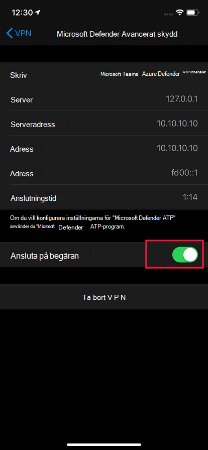
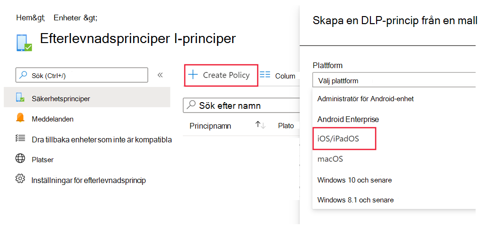
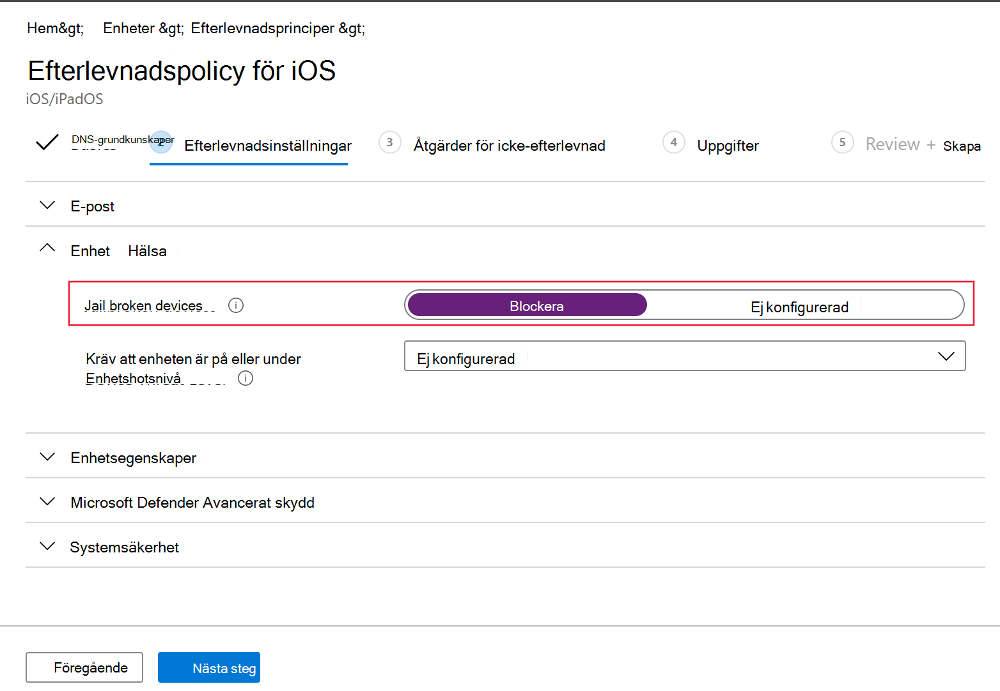
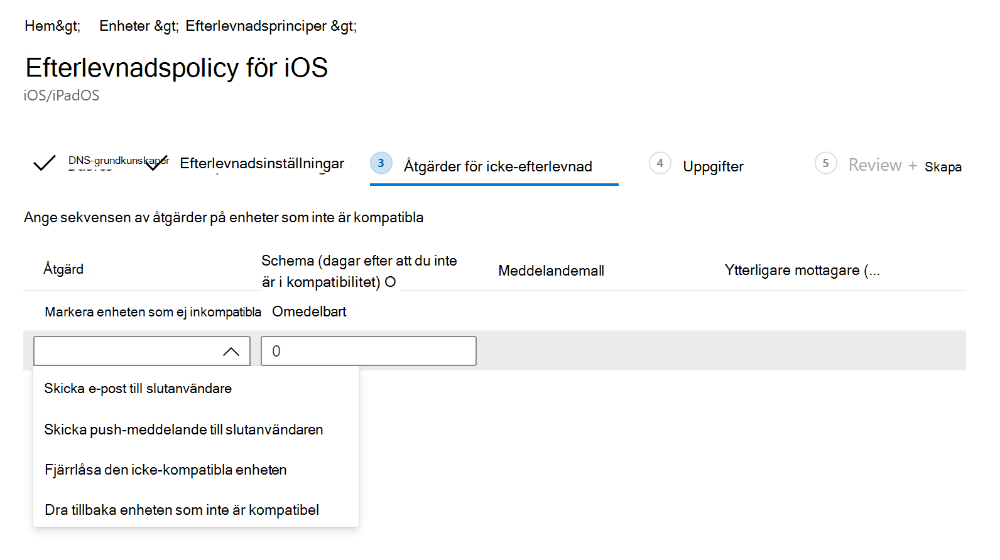

# Konfigurera Microsoft Defender för slutpunkt för iOS-funktionerConfigure Microsoft Defender for Endpoint for iOS features

[!INCLUDE [Microsoft 365 Defender rebranding](../../includes/microsoft-defender.md)]

**Gäller för:****Applies to:**
- [Microsoft Defender för EndpointMicrosoft Defender for Endpoint](https://go.microsoft.com/fwlink/p/?linkid=2154037)
- [Microsoft 365 DefenderMicrosoft 365 Defender](https://go.microsoft.com/fwlink/?linkid=2118804)

> Vill du använda Defender för Slutpunkt?Want to experience Defender for Endpoint? [Registrera dig för en kostnadsfri utvärderingsversion.Sign up for a free trial.](https://www.microsoft.com/microsoft-365/windows/microsoft-defender-atp?ocid=docs-wdatp-exposedapis-abovefoldlink) 

> [!NOTE]
> Defender för Endpoint för iOS skulle använda en VPN för att tillhandahålla webskyddsfunktionen.Defender for Endpoint for iOS would use a VPN in order to provide the Web Protection feature. Det här är inte en vanlig VPN och är en lokal/självslingande VPN som inte tar trafik utanför enheten.This is not a regular VPN and is a local/self-looping VPN that does not take traffic outside the device.

## Villkorsstyrd åtkomst med Defender för Slutpunkt för iOSConditional Access with Defender for Endpoint for iOS  
Microsoft Defender för Slutpunkt för iOS tillsammans med Microsoft Intune och Azure Active Directory gör det möjligt att tillämpa enhetsefterlevnad och villkorsstyrd åtkomstprincip baserat på risknivåer för enheter.Microsoft Defender for Endpoint for iOS along with Microsoft Intune and Azure Active Directory enables enforcing Device compliance and Conditional Access policies based on device risk levels. Defender för Endpoint är en MTD-lösning (Mobile Threat Defense) som du kan distribuera för att utnyttja den här funktionen via Intune.Defender for Endpoint is a Mobile Threat Defense (MTD) solution that you can deploy to leverage this capability via Intune.

Mer information om hur du konfigurera villkorsstyrd åtkomst med Defender för slutpunkt för iOS finns [i Defender för Endpoint och Intune.](https://docs.microsoft.com/mem/intune/protect/advanced-threat-protection)For more information about how to set up Conditional Access with Defender for Endpoint for iOS, see [Defender for Endpoint and Intune](https://docs.microsoft.com/mem/intune/protect/advanced-threat-protection).

## Web Protection och VPNWeb Protection and VPN

Som standard innehåller och aktiverar Defender för Slutpunkt för iOS webbskyddsfunktionen.By default, Defender for Endpoint for iOS includes and enables the web protection feature. [Webbskydd](web-protection-overview.md) hjälper till att skydda enheter mot webbhot och skyddar användare mot nätfiskeattacker.[Web protection](web-protection-overview.md) helps to secure devices against web threats and protect users from phishing attacks. Defender för Endpoint för iOS använder en VPN för att tillhandahålla detta skydd.Defender for Endpoint for iOS uses a VPN in order to provide this protection. Observera att det här är en lokal VPN och till skillnad från traditionell VPN skickas inte nätverkstrafik utanför enheten.Please note this is a local VPN and unlike traditional VPN, network traffic is not sent outside the device.

När den är aktiverad som standard kan det finnas fall där du måste inaktivera VPN.While enabled by default, there might be some cases that require you to disable VPN. Du kanske till exempel vill köra vissa appar som inte fungerar när en VPN konfigureras.For example, you want to run some apps that do not work when a VPN is configured. I sådana fall kan du välja att inaktivera VPN från appen på enheten genom att följa stegen nedan:In such cases, you can choose to disable VPN from the app on the device by following the steps below:

1. På din iOS-enhet öppnar du **appen Inställningar,** klickar eller trycker på **Allmänt** och sedan **VPN.**On your iOS device, open the **Settings** app, click or tap **General** and then **VPN**.
1. Klicka eller tryck på i-knappen för Microsoft Defender ATP.Click or tap the "i" button for Microsoft Defender ATP.
1. Inaktivera VPN **genom att stänga av** Anslut på begäran.Toggle off **Connect On Demand** to disable VPN.

    > [!div class="mx-imgBorder"]
    > 

> [!NOTE]
> Web Protection är inte tillgängligt när VPN inaktiveras.Web Protection will not be available when VPN is disabled. Om du vill återaktivera Web Protection öppnar du appen Microsoft Defender för Endpoint på enheten och klickar eller trycker på **Starta VPN.**To re-enable Web Protection, open the Microsoft Defender for Endpoint app on the device and click or tap **Start VPN**.

## Det finns flera VPN-profilerCo-existence of multiple VPN profiles

Apple iOS stöder inte flera vpn som gäller hela enheten för att vara aktiva samtidigt.Apple iOS does not support multiple device-wide VPNs to be active simultaneously. Även om flera VPN-profiler kan finnas på enheten kan bara ett VPN vara aktivt i taget.While multiple VPN profiles can exist on the device, only one VPN can be active at a time.

## Konfigurera efterlevnadsprincip mot jailbroken enheterConfigure compliance policy against jailbroken devices

För att skydda företagsdata från att kommas åt på jailbroken iOS-enheter rekommenderar vi att du konfigurerar följande efterlevnadsprincip på Intune.To protect corporate data from being accessed on jailbroken iOS devices, we recommend that you set up the following compliance policy on Intune.

> [!NOTE]
> För stunden ger Inte Microsoft Defender för Endpoint för iOS skydd mot scenarier.At this time Microsoft Defender for Endpoint for iOS does not provide protection against jailbreak scenarios. Om den används på en jailbroken enhet kan data som används av programmet i vissa fall som ditt företags-e-post-ID och företagsprofilbild (om tillgängligt) visas lokaltIf used on a jailbroken device, then in specific scenarios data that is used by the application like your corporate email id and corporate profile picture (if available) can be exposed locally

Följ stegen nedan för att skapa en efterlevnadsprincip mot jailbroken enheter.Follow the steps below to create a compliance policy against jailbroken devices.

1. Gå [till Principer för enhetsefterlevnad](https://go.microsoft.com/fwlink/?linkid=2109431)i **Administrationscenter för** Microsoft Endpoint  ->    ->  Manager.In [Microsoft Endpoint Manager admin center](https://go.microsoft.com/fwlink/?linkid=2109431), go to **Devices** -> **Compliance policies** -> **Create Policy**. Välj "iOS/iPadOS" som plattform och klicka på **Skapa**.Select "iOS/iPadOS" as platform and click **Create**.

    > [!div class="mx-imgBorder"]
    > 

2. Ange ett namn på principen, till exempel "Efterlevnadsprincip för Företag".Specify a name of the policy, for example "Compliance Policy for Jailbreak".
3. På sidan inställningar för efterlevnad klickar du för att expandera **avsnittet Enhetshälsa** och klickar på **Spärra för** **Jailbroken-enheter.**In the compliance settings page, click to expand **Device Health** section and click **Block** for **Jailbroken devices** field.

    > [!div class="mx-imgBorder"]
    > 

4. I avsnittet *Åtgärd för icke-efterlevnad* väljer du åtgärderna enligt dina krav och väljer **Nästa.**In the *Action for noncompliance* section, select the actions as per your requirements and select **Next**.

    > [!div class="mx-imgBorder"]
    > 

5. I avsnittet *Tilldelningar* väljer du de användargrupper som du vill inkludera för den här principen och väljer sedan **Nästa.**In the *Assignments* section, select the user groups that you want to include for this policy and then select **Next**.
6. I avsnittet **Granska+Skapa** kontrollerar du att all information som angetts är korrekt och väljer sedan **Skapa**.In the **Review+Create** section, verify that all the information entered is correct and then select **Create**.

## Konfigurera anpassade indikatorerConfigure custom indicators

Med Defender för Endpoint för iOS kan administratörer även konfigurera anpassade indikatorer på iOS-enheter.Defender for Endpoint for iOS enables admins to configure custom indicators on iOS devices as well. Mer information om hur du konfigurerar anpassade indikatorer finns [i Hantera indikatorer.](https://docs.microsoft.com/microsoft-365/security/defender-endpoint/manage-indicators)For more information on how to configure custom indicators, see [Manage indicators](https://docs.microsoft.com/microsoft-365/security/defender-endpoint/manage-indicators).

> [!NOTE]
> Defender för Endpoint för iOS har stöd för att endast skapa anpassade indikatorer för IP-adresser och URL:er/domäner.Defender for Endpoint for iOS supports creating custom indicators only for IP addresses and URLs/domains.

## Rapportera osäker webbplatsReport unsafe site

Nätfiskewebbplatser utger sig för att vara betrodda webbplatser i syfte att skaffa personlig eller ekonomisk information.Phishing websites impersonate trustworthy websites for the purpose of obtaining your personal or financial information. Gå till [sidan Ge feedback om nätverksskydd](https://www.microsoft.com/wdsi/filesubmission/exploitguard/networkprotection) om du vill rapportera en webbplats som kan vara en nätfiskewebbplats.Visit the [Provide feedback about network protection](https://www.microsoft.com/wdsi/filesubmission/exploitguard/networkprotection) page if you want to report a website that could be a phishing site.
