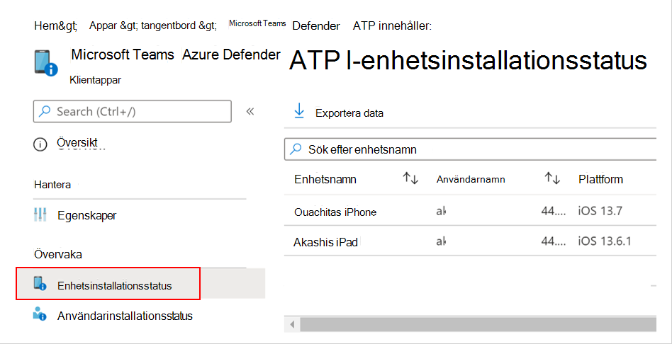
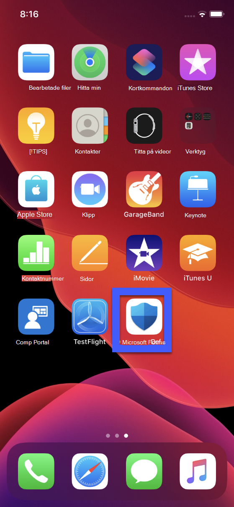
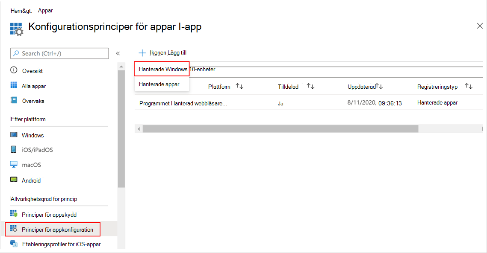
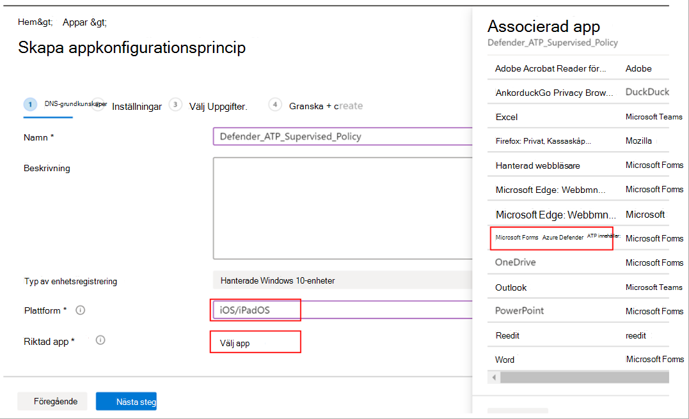
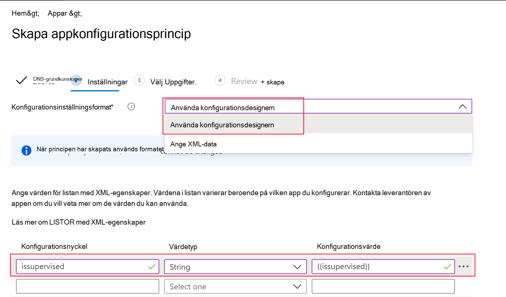
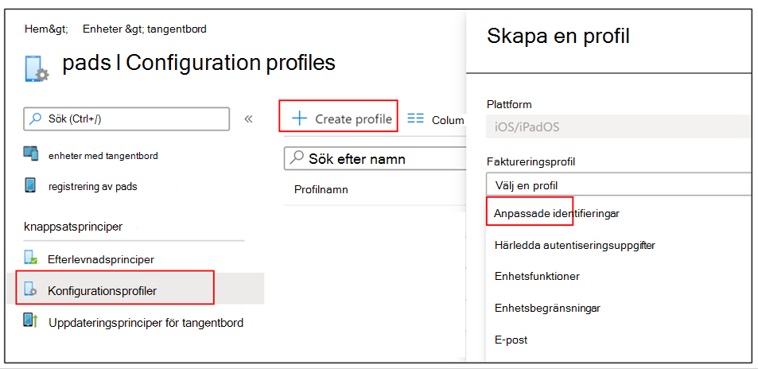

# Distribuera Microsoft Defender för Slutpunkt i iOS

[!INCLUDE [Microsoft 365 Defender rebranding](../../includes/microsoft-defender.md)]

**Gäller för:**
- [Microsoft Defender för Endpoint](https://go.microsoft.com/fwlink/p/?linkid=2154037)
- [Microsoft 365 Defender](https://go.microsoft.com/fwlink/?linkid=2118804)

> Vill du använda Defender för Slutpunkt? [Registrera dig för en kostnadsfri utvärderingsversion.](https://www.microsoft.com/microsoft-365/windows/microsoft-defender-atp?ocid=docs-wdatp-investigateip-abovefoldlink)

I det här avsnittet beskrivs hur du distribuerar Defender för Slutpunkt på iOS Intune-företagsportal registrerade enheter. Mer information om registrering av Intune-enheter finns i [Registrera iOS-/iPadOS-enheter i Intune.](/mem/intune/enrollment/ios-enroll)

## Innan du börjar

- Kontrollera att du har åtkomst till [administrationscentret för Microsoft Endpoint Manager.](https://go.microsoft.com/fwlink/?linkid=2109431)

- Se till att iOS-registreringen utförs för dina användare. Användarna måste ha en Defender för slutpunktslicens tilldelad för att kunna använda Defender för slutpunkt i iOS. Anvisningar om [hur du tilldelar licenser](/azure/active-directory/users-groups-roles/licensing-groups-assign) finns i Tilldela licenser till användare.

> [!NOTE]
> Microsoft Defender för slutpunkt på iOS är tillgängligt i [Apple App Store.](https://aka.ms/mdatpiosappstore)

## Distributionssteg

Distribuera Defender för Slutpunkt på iOS via Intune-företagsportal.

### Lägg till en iOS Store-app

1. I [administrationscentret för Microsoft Endpoint manager](https://go.microsoft.com/fwlink/?linkid=2109431)går du till **Appar**  ->  **iOS/iPadOS Lägg**  ->  **till**  ->  **iOS Store-app och** klickar på **Välj**.

    > [!div class="mx-imgBorder"]
    > 

1. På sidan Lägg till app klickar du på **Sök i App Store** och skriver Microsoft Defender **Endpoint** i sökfältet. I avsnittet med sökresultat klickar du på *Microsoft Defender Endpoint och* klickar på **Välj**.

1. Välj **iOS 11.0** som Minimum-operativsystem. Granska resten av informationen om programmet och klicka på **Nästa**.

1. Gå till *avsnittet Obligatoriska* i avsnittet Uppgifter **och** välj Lägg **till grupp**. Du kan sedan välja den användargrupp(er) som du vill rikta Defender mot Endpoint i iOS-appen. Klicka **på Markera** och sedan på **Nästa.**

    > [!NOTE]
    > Den valda användargruppen ska bestå av intune-registrerade användare.

    > [!div class="mx-imgBorder"]
    > 

1. I avsnittet *Granska + Skapa* kontrollerar du att all information som angetts är korrekt och väljer sedan **Skapa**. Inom en liten stund bör appen Defender för Slutpunkt skapas korrekt och ett meddelande bör visas i det övre högra hörnet på sidan.

1. På sidan med appinformation som  visas i avsnittet Övervaka väljer du Enhetsinstallationsstatus **för** att verifiera att enhetsinstallationen har slutförts.

    > [!div class="mx-imgBorder"]
    > 

## Automatisk registrering av VPN-profil (förenklad registrering)

Administratörer kan konfigurera automatisk konfiguration av VPN-profilen. Det här ställer automatiskt in Defender för Endpoint VPN-profilen utan att användaren behöver göra det under registrering. Observera att VPN används för att tillhandahålla webskyddsfunktionen. Det här är inte en vanlig VPN och är en lokal/självslingande VPN som inte tar trafik utanför enheten.

1. I [administrationscentret för Microsoft Endpoint Manager](https://go.microsoft.com/fwlink/?linkid=2109431)går du till   ->  **Konfigurationsprofiler för enheter** Skapa  ->  **profil**.
1. Välj **Plattform** som **iOS/iPadOS** och **Profiltyp** som **VPN.** Klicka på **Skapa**.
1. Skriv in ett namn på profilen och klicka på **Nästa.**
1. Välj **Anpassad VPN** för Anslutningstyp och ange följande i avsnittet **Bas-VPN:**
    - Anslutningsnamn = Microsoft Defender för Slutpunkt
    - VPN-serveradress = 127.0.0.1
    - Autentiseringsmetod = "Användarnamn och lösenord"
    - Delade tunnlar = Inaktivera
    - VPN-identifierare = com.microsoft.scmx
    - I paren med nyckelvärden anger du nyckeln **AutoOnboard och** anger värdet **till True**.
    - Typ av automatisk VPN = On-demand VPN
    - Klicka **på** Lägg **till för på** begäran-regler och välj Jag vill göra följande = Upprätta **VPN**, Jag vill begränsa till = **Alla domäner.**

    

1. Klicka på Nästa och tilldela profilen till riktade användare.
1. I avsnittet *Granska + Skapa* kontrollerar du att all information som angetts är korrekt och väljer sedan **Skapa**.

## Fullständig registrering och kontrollstatus

1. När Defender för slutpunkt på iOS har installerats på enheten visas appikonen.

    

2. Tryck på appikonen Defender för slutpunkt (MSDefender) och följ anvisningarna på skärmen för att slutföra introduktionsstegen. Informationen innefattar godkännande av iOS-behörigheter som krävs av Defender för Endpoint på iOS.

3. Vid lyckad registrering börjar enheten visas i listan Enheter i Microsoft Defender Säkerhetscenter.

    > [!div class="mx-imgBorder"]
    > 

## Konfigurera Microsoft Defender för slutpunkt för övervakat läge

Microsoft Defender för Slutpunkt för iOS-appen har särskild kapacitet för övervakade iOS-/iPadOS-enheter, givet de utökade hanteringsfunktionerna som tillhandahålls av plattformen på dessa typer av enheter. Om du vill dra nytta av de här funktionerna behöver appen Defender för slutpunkt veta om en enhet är i övervakat läge.

### Konfigurera övervakat läge via Intune

Med Intune kan du konfigurera appen Defender för iOS via en princip för appkonfiguration.

   > [!NOTE]
   > Den här appkonfigurationsprincipen för övervakade enheter gäller endast hanterade enheter och bör riktas för alla hanterade iOS-enheter.

1. Logga in på [administrationscentret Microsoft Endpoint Manager och](https://go.microsoft.com/fwlink/?linkid=2109431) gå till Programkonfigurationsprinciper,   >  **Lägg**  >  **till**. Klicka på **Hanterade enheter.**

    > [!div class="mx-imgBorder"]
    > 

1. Ange *följande* information på sidan Skapa appkonfigurationsprincip:
    - Principnamn
    - Plattform: Välj iOS/iPadOS
    - Riktad app: Välj **Microsoft Defender Endpoint** i listan

    > [!div class="mx-imgBorder"]
    > 

1. På nästa skärm väljer du **Använd konfigurationsdesignern** som format. Ange följande egenskap:
    - Konfigurationsnyckel: issupervised
    - Värdetyp: Sträng
    - Konfigurationsvärde: {{issupervised}}
    
    > [!div class="mx-imgBorder"]
    > 

1. Klicka **på Nästa** så att sidan **Omfattningstaggar** öppnas. Omfattningstaggar är valfria. Klicka **på Nästa** för att fortsätta.

1. På sidan **Uppgifter väljer** du de grupper som ska få den här profilen. I det här scenariot är det bäst att rikta alla **enheter mot mål.** Mer information om hur du tilldelar profiler finns i [Tilldela användar- och enhetsprofiler.](/mem/intune/configuration/device-profile-assign)

   När du distribuerar till användargrupper måste en användare logga in på en enhet innan principen tillämpas.

   Klicka på **Nästa**.

1. På sidan **Granska + skapa** väljer du Skapa när du är **klar.** Den nya profilen visas i listan över konfigurationsprofiler.

1. För förbättrade funktioner mot nätfiske kan du därefter distribuera en anpassad profil på de övervakade iOS-enheterna. Följ stegen nedan:
    - Ladda ned konfigurationsprofilen från [https://aka.ms/mdatpiossupervisedprofile](https://aka.ms/mdatpiossupervisedprofile)
    - Gå till  ->  **Konfigurationsprofiler för enheter iOS/iPadOS**  ->    ->  **Skapa profil**

    > [!div class="mx-imgBorder"]
    > 

    - Ange ett namn på profilen. När du uppmanas att importera en konfigurationsprofilfil väljer du den som hämtats ovan.
    - I avsnittet **Uppgift** väljer du den enhetsgrupp för vilken du vill använda den här profilen. Det är en bra metod att detta ska tillämpas på alla hanterade iOS-enheter. Klicka på **Nästa**.
    - På sidan **Granska + skapa** väljer du Skapa när du är **klar.** Den nya profilen visas i listan över konfigurationsprofiler.

## Nästa steg

[Konfigurera Defender för slutpunkt för iOS-funktioner](ios-configure-features.md)
