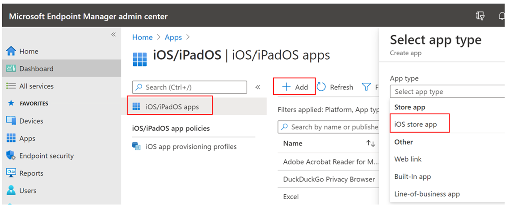
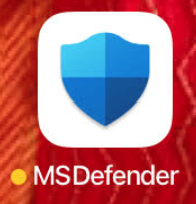

# Distribuera Microsoft Defender för Slutpunkt i iOSDeploy Microsoft Defender for Endpoint on iOS

[!INCLUDE [Microsoft 365 Defender rebranding](../../includes/microsoft-defender.md)]

**Gäller för:****Applies to:**
- [Microsoft Defender för EndpointMicrosoft Defender for Endpoint](https://go.microsoft.com/fwlink/p/?linkid=2154037)
- [Microsoft 365 DefenderMicrosoft 365 Defender](https://go.microsoft.com/fwlink/?linkid=2118804)

> Vill du använda Defender för Slutpunkt?Want to experience Defender for Endpoint? [Registrera dig för en kostnadsfri utvärderingsversion.Sign up for a free trial.](https://www.microsoft.com/microsoft-365/windows/microsoft-defender-atp?ocid=docs-wdatp-investigateip-abovefoldlink)

I det här avsnittet beskrivs hur du distribuerar Defender för Slutpunkt på iOS Intune-företagsportal registrerade enheter.This topic describes deploying Defender for Endpoint on iOS on Intune Company Portal enrolled devices. Mer information om registrering av Intune-enheter finns i [Registrera iOS-/iPadOS-enheter i Intune.](/mem/intune/enrollment/ios-enroll)For more information about Intune device enrollment, see [Enroll iOS/iPadOS devices in Intune](/mem/intune/enrollment/ios-enroll).

## Innan du börjarBefore you begin

- Kontrollera att du har åtkomst till [administrationscentret för Microsoft Endpoint Manager.](https://go.microsoft.com/fwlink/?linkid=2109431)Ensure you have access to [Microsoft Endpoint manager admin center](https://go.microsoft.com/fwlink/?linkid=2109431).

- Se till att iOS-registreringen utförs för dina användare.Ensure iOS enrollment is done for your users. Användarna måste ha en Defender för slutpunktslicens tilldelad för att kunna använda Defender för slutpunkt i iOS.Users need to have a Defender for Endpoint license assigned in order to use Defender for Endpoint on iOS. Anvisningar om [hur du tilldelar licenser](/azure/active-directory/users-groups-roles/licensing-groups-assign) finns i Tilldela licenser till användare.Refer to [Assign licenses to users](/azure/active-directory/users-groups-roles/licensing-groups-assign) for instructions on how to assign licenses.

> [!NOTE]
> Microsoft Defender för slutpunkt på iOS är tillgängligt i [Apple App Store.](https://aka.ms/mdatpiosappstore)Microsoft Defender for Endpoint on iOS is available in the [Apple App Store](https://aka.ms/mdatpiosappstore).

## DistributionsstegDeployment steps

Distribuera Defender för Slutpunkt på iOS via Intune-företagsportal.Deploy Defender for Endpoint on iOS via Intune Company Portal.

### Lägg till en iOS Store-appAdd iOS store app

1. I [administrationscentret för Microsoft Endpoint manager](https://go.microsoft.com/fwlink/?linkid=2109431)går du till **Appar**  ->  **iOS/iPadOS Lägg**  ->  **till**  ->  **iOS Store-app och** klickar på **Välj**.In [Microsoft Endpoint manager admin center](https://go.microsoft.com/fwlink/?linkid=2109431), go to **Apps** -> **iOS/iPadOS** -> **Add** -> **iOS store app** and click **Select**.

    > [!div class="mx-imgBorder"]
    > 

1. På sidan Lägg till app klickar du på **Sök i App Store** och skriver Microsoft Defender **Endpoint** i sökfältet.On the Add app page, click on **Search the App Store** and type **Microsoft Defender Endpoint** in the search bar. I avsnittet med sökresultat klickar du på *Microsoft Defender Endpoint och* klickar på **Välj**.In the search results section, click on *Microsoft Defender Endpoint* and click **Select**.

1. Välj **iOS 11.0** som Minimum-operativsystem.Select **iOS 11.0** as the Minimum operating system. Granska resten av informationen om programmet och klicka på **Nästa**.Review the rest of information about the app and click **Next**.

1. Gå till *avsnittet Obligatoriska* i avsnittet Uppgifter **och** välj Lägg **till grupp**.In the *Assignments* section, go to the **Required** section and select **Add group**. Du kan sedan välja den användargrupp(er) som du vill rikta Defender mot Endpoint i iOS-appen.You can then choose the user group(s) that you would like to target Defender for Endpoint on iOS app. Klicka **på Markera** och sedan på **Nästa.**Click **Select** and then **Next**.

    > [!NOTE]
    > Den valda användargruppen ska bestå av intune-registrerade användare.The selected user group should consist of Intune enrolled users.

    > [!div class="mx-imgBorder"]
    > 

1. I avsnittet *Granska + Skapa* kontrollerar du att all information som angetts är korrekt och väljer sedan **Skapa**.In the *Review + Create* section, verify that all the information entered is correct and then select **Create**. Inom en liten stund bör appen Defender för Slutpunkt skapas korrekt och ett meddelande bör visas i det övre högra hörnet på sidan.In a few moments, the Defender for Endpoint app should be created successfully, and a notification should show up at the top-right corner of the page.

1. På sidan med appinformation som  visas i avsnittet Övervaka väljer du Enhetsinstallationsstatus **för** att verifiera att enhetsinstallationen har slutförts.In the app information page that is displayed, in the **Monitor** section, select **Device install status** to verify that the device installation has completed successfully.

    > [!div class="mx-imgBorder"]
    > 

## Automatisk registrering av VPN-profil (förenklad registrering)Auto-Onboarding of VPN profile (Simplified Onboarding)

Administratörer kan konfigurera automatisk konfiguration av VPN-profilen.Admins can configure auto-setup of VPN profile. Det här ställer automatiskt in Defender för Endpoint VPN-profilen utan att användaren behöver göra det under registrering.This will automatically setup the Defender for Endpoint VPN profile without having the user to do so while onboarding. Observera att VPN används för att tillhandahålla webskyddsfunktionen.Note that VPN is used in order to provide the Web Protection feature. Det här är inte en vanlig VPN och är en lokal/självslingande VPN som inte tar trafik utanför enheten.This is not a regular VPN and is a local/self-looping VPN that does not take traffic outside the device.

1. I [administrationscentret för Microsoft Endpoint Manager](https://go.microsoft.com/fwlink/?linkid=2109431)går du till   ->  **Konfigurationsprofiler för enheter** Skapa  ->  **profil**.In [Microsoft Endpoint manager admin center](https://go.microsoft.com/fwlink/?linkid=2109431), go to **Devices** -> **Configuration Profiles** -> **Create Profile**.
1. Välj **Plattform** som **iOS/iPadOS** och **Profiltyp** som **VPN.**Choose **Platform** as **iOS/iPadOS** and **Profile type** as **VPN**. Klicka på **Skapa**.Click **Create**.
1. Skriv in ett namn på profilen och klicka på **Nästa.**Type a name for the profile and click **Next**.
1. Välj **Anpassad VPN** för Anslutningstyp och ange följande i avsnittet **Bas-VPN:**Select **Custom VPN** for Connection Type and in the **Base VPN** section, enter the following:
    - Anslutningsnamn = Microsoft Defender för SlutpunktConnection Name = Microsoft Defender for Endpoint
    - VPN-serveradress = 127.0.0.1VPN server address = 127.0.0.1
    - Autentiseringsmetod = "Användarnamn och lösenord"Auth method = "Username and password"
    - Delade tunnlar = InaktiveraSplit Tunneling = Disable
    - VPN-identifierare = com.microsoft.scmxVPN identifier = com.microsoft.scmx
    - I paren med nyckelvärden anger du nyckeln **AutoOnboard och** anger värdet **till True**.In the key-value pairs, enter the key **AutoOnboard** and set the value to **True**.
    - Typ av automatisk VPN = On-demand VPNType of Automatic VPN = On-demand VPN
    - Klicka **på** Lägg **till för på** begäran-regler och välj Jag vill göra följande = Upprätta **VPN**, Jag vill begränsa till = **Alla domäner.**Click **Add** for **On Demand Rules** and select **I want to do the following = Establish VPN**, **I want to restrict to = All domains**.

    

1. Klicka på Nästa och tilldela profilen till riktade användare.Click Next and assign the profile to targeted users.
1. I avsnittet *Granska + Skapa* kontrollerar du att all information som angetts är korrekt och väljer sedan **Skapa**.In the *Review + Create* section, verify that all the information entered is correct and then select **Create**.

## Fullständig registrering och kontrollstatusComplete onboarding and check status

1. När Defender för slutpunkt på iOS har installerats på enheten visas appikonen.Once Defender for Endpoint on iOS has been installed on the device, you  will see the app icon.

    

2. Tryck på appikonen Defender för slutpunkt (MSDefender) och följ anvisningarna på skärmen för att slutföra introduktionsstegen.Tap the Defender for Endpoint app icon (MSDefender) and follow the on-screen instructions to complete the onboarding steps. Informationen innefattar godkännande av iOS-behörigheter som krävs av Defender för Endpoint på iOS.The details include end-user acceptance of iOS permissions required by Defender for Endpoint on iOS.

3. Vid lyckad registrering börjar enheten visas i listan Enheter i Microsoft Defender Säkerhetscenter.Upon successful onboarding, the device will start showing up on the Devices list in Microsoft Defender Security Center.

    > [!div class="mx-imgBorder"]
    > 

## Konfigurera Microsoft Defender för slutpunkt för övervakat lägeConfigure Microsoft Defender for Endpoint for Supervised Mode

Microsoft Defender för Slutpunkt för iOS-appen har särskild kapacitet för övervakade iOS-/iPadOS-enheter, givet de utökade hanteringsfunktionerna som tillhandahålls av plattformen på dessa typer av enheter.The Microsoft Defender for Endpoint on iOS app has specialized ability on supervised iOS/iPadOS devices, given the increased management capabilities provided by the platform on these types of devices. Om du vill dra nytta av de här funktionerna behöver appen Defender för slutpunkt veta om en enhet är i övervakat läge.To take advantage of these capabilities, the Defender for Endpoint app needs to know if a device is in Supervised Mode.

### Konfigurera övervakat läge via IntuneConfigure Supervised Mode via Intune

Med Intune kan du konfigurera appen Defender för iOS via en princip för appkonfiguration.Intune allows you to configure the Defender for iOS app through an App Configuration policy.

   > [!NOTE]
   > Den här appkonfigurationsprincipen för övervakade enheter gäller endast hanterade enheter och bör riktas för alla hanterade iOS-enheter.This app configuration policy for supervised devices is applicable only to managed devices and should be targeted for all managed iOS devices as a best practice.

1. Logga in på [administrationscentret Microsoft Endpoint Manager och](https://go.microsoft.com/fwlink/?linkid=2109431) gå till Programkonfigurationsprinciper,   >  **Lägg**  >  **till**.Sign in to the [Microsoft Endpoint Manager admin center](https://go.microsoft.com/fwlink/?linkid=2109431) and go to **Apps** > **App configuration policies** > **Add**. Klicka på **Hanterade enheter.**Click on **Managed devices**.

    > [!div class="mx-imgBorder"]
    > 

1. Ange *följande* information på sidan Skapa appkonfigurationsprincip:In the *Create app configuration policy* page, provide the following information:
    - PrincipnamnPolicy Name
    - Plattform: Välj iOS/iPadOSPlatform: Select iOS/iPadOS
    - Riktad app: Välj **Microsoft Defender Endpoint** i listanTargeted app: Select **Microsoft Defender Endpoint** from the list

    > [!div class="mx-imgBorder"]
    > 

1. På nästa skärm väljer du **Använd konfigurationsdesignern** som format.In the next screen, select **Use configuration designer** as the format. Ange följande egenskap:Specify the following property:
    - Konfigurationsnyckel: issupervisedConfiguration Key: issupervised
    - Värdetyp: SträngValue type: String
    - Konfigurationsvärde: {{issupervised}}Configuration Value: {{issupervised}}
    
    > [!div class="mx-imgBorder"]
    > 

1. Klicka **på Nästa** så att sidan **Omfattningstaggar** öppnas.Click **Next** to open the **Scope tags** page. Omfattningstaggar är valfria.Scope tags are optional. Klicka **på Nästa** för att fortsätta.Click **Next** to continue.

1. På sidan **Uppgifter väljer** du de grupper som ska få den här profilen.On the **Assignments** page, select the groups that will receive this profile. I det här scenariot är det bäst att rikta alla **enheter mot mål.**For this scenario, it is best practice to target **All Devices**. Mer information om hur du tilldelar profiler finns i [Tilldela användar- och enhetsprofiler.](/mem/intune/configuration/device-profile-assign)For more information on assigning profiles, see [Assign user and device profiles](/mem/intune/configuration/device-profile-assign).

   När du distribuerar till användargrupper måste en användare logga in på en enhet innan principen tillämpas.When deploying to user groups, a user must sign in to a device before the policy applies.

   Klicka på **Nästa**.Click **Next**.

1. På sidan **Granska + skapa** väljer du Skapa när du är **klar.**On the **Review + create** page, when you're done, choose **Create**. Den nya profilen visas i listan över konfigurationsprofiler.The new profile is displayed in the list of configuration profiles.

1. För förbättrade funktioner mot nätfiske kan du därefter distribuera en anpassad profil på de övervakade iOS-enheterna.Next, for enhanced Anti-phishing capabilities, you can deploy a custom profile on the supervised iOS devices. Följ stegen nedan:Follow the steps below:
    - Ladda ned konfigurationsprofilen från [https://aka.ms/mdatpiossupervisedprofile](https://aka.ms/mdatpiossupervisedprofile)Download the config profile from [https://aka.ms/mdatpiossupervisedprofile](https://aka.ms/mdatpiossupervisedprofile)
    - Gå till  ->  **Konfigurationsprofiler för enheter iOS/iPadOS**  ->    ->  **Skapa profil**Navigate to **Devices** -> **iOS/iPadOS** -> **Configuration profiles** -> **Create Profile**

    > [!div class="mx-imgBorder"]
    > 

    - Ange ett namn på profilen.Provide a name of the profile. När du uppmanas att importera en konfigurationsprofilfil väljer du den som hämtats ovan.When prompted to import a Configuration profile file, select the one downloaded above.
    - I avsnittet **Uppgift** väljer du den enhetsgrupp för vilken du vill använda den här profilen.In the **Assignment** section, select the device group to which you want to apply this profile. Det är en bra metod att detta ska tillämpas på alla hanterade iOS-enheter.As a best practice, this should be applied to all managed iOS devices. Klicka på **Nästa**.Click **Next**.
    - På sidan **Granska + skapa** väljer du Skapa när du är **klar.**On the **Review + create** page, when you're done, choose **Create**. Den nya profilen visas i listan över konfigurationsprofiler.The new profile is displayed in the list of configuration profiles.

## Nästa stegNext Steps

[Konfigurera Defender för slutpunkt för iOS-funktionerConfigure Defender for Endpoint on iOS features](ios-configure-features.md)
