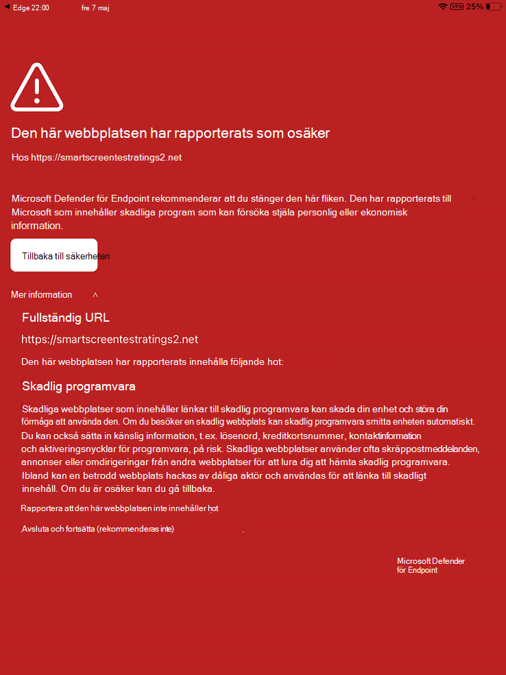

# Felsöka problem och hitta svar på vanliga frågor och svar i Microsoft Defender för Endpoint i iOS

[!INCLUDE [Microsoft 365 Defender rebranding](../../includes/microsoft-defender.md)]

**Gäller för:**
- [Microsoft Defender för Endpoint](https://go.microsoft.com/fwlink/p/?linkid=2154037)
- [Microsoft 365 Defender](https://go.microsoft.com/fwlink/?linkid=2118804)

> Vill du använda Defender för Slutpunkt? [Registrera dig för en kostnadsfri utvärderingsversion.](https://www.microsoft.com/microsoft-365/windows/microsoft-defender-atp?ocid=docs-wdatp-exposedapis-abovefoldlink) 

Det här avsnittet innehåller felsökningsinformation som hjälper dig att lösa problem som kan uppstå när du använder Microsoft Defender för Endpoint i iOS.

> [!NOTE]
> Defender för Endpoint i iOS skulle använda ett VPN för att tillhandahålla webskyddsfunktionen. Det här är inte en vanlig VPN och är en lokal/självslingande VPN som inte tar trafik utanför enheten.

## Appar fungerar inte när VPN är aktiverat
Det finns vissa appar som slutar fungera när ett aktivt VPN upptäcks. Du kan inaktivera VPN under tiden du använder sådana appar. 

Som standard inkluderar och aktiverar Defender för Slutpunkt i iOS webbskyddsfunktionen. [Webbskydd](web-protection-overview.md) hjälper till att skydda enheter mot webbhot och skyddar användare mot nätfiskeattacker. Defender för Endpoint på iOS använder en VPN för att tillhandahålla detta skydd. Observera att det här är en lokal VPN och till skillnad från traditionell VPN skickas inte nätverkstrafik utanför enheten.

När den är aktiverad som standard kan det finnas fall där du måste inaktivera VPN. Du kanske till exempel vill köra vissa appar som inte fungerar när en VPN konfigureras. I sådana fall kan du välja att inaktivera VPN från appen på enheten genom att följa stegen nedan:

1. På din iOS-enhet öppnar du **Inställningar,** klickar eller trycker på **Allmänt** och sedan **VPN.**
1. Klicka eller tryck på i-knappen för Microsoft Defender för Slutpunkt.
1. Inaktivera ANSLUT **för att** inaktivera VPN.

    > [!div class="mx-imgBorder"]
    > 

> [!NOTE]
> Web Protection är inte tillgängligt när VPN inaktiveras. Om du vill återaktivera Web Protection öppnar du appen Microsoft Defender för Endpoint på enheten och klickar eller trycker på **Starta VPN.**

## Problem med flera VPN-profiler

Apple iOS stöder inte flera **vpn som gäller hela enheten** för att vara aktiva samtidigt. Även om flera VPN-profiler kan finnas på enheten kan bara ett VPN vara aktivt i taget.

Microsoft Defender för endpoint VPN kan finnas tillsammans med andra VPN som är konfigurerade *som per app* eller *"Personligt".*

## Batteriförbrukning

I Inställningar visar iOS endast batterianvändningen av appar som är synliga för användaren under en viss tid. Batterianvändningen från appar som visas på skärmen gäller bara under den tiden och beräknas av iOS baserat på en mängd faktorer, till exempel CPU och nätverksanvändning. Microsoft Defender för Endpoint använder en lokal/loop-back VPN i bakgrunden för att kontrollera webbtrafiken efter skadliga webbplatser eller anslutningar. Nätverkspaket från alla appar går igenom den här kontrollen och det gör att batterianvändningen av Microsoft Defender för Endpoint beräknas felaktigt. Den faktiska batteriförbrukningen i Microsoft Defender för Endpoint är mycket mindre än vad som visas på sidan Inställningar batteri på enheten.

Batterianvändning per dag av Microsoft Defender för Slutpunkt som körs i bakgrunden är cirka **8,81**% av det totala batteriet som använts den dagen. Det här måttet rapporteras av Apple baserat på faktisk användning av Microsoft Defender för Endpoint på slutanvändareenheter och på grund av orsaker som nämns ovan kan även redovisas för andra appar som har nätverksaktivitet.

Vpn som används är också en lokal VPN och till skillnad från en traditionell VPN skickas inte nätverkstrafik utanför enheten.

## Dataanvändning

Microsoft Defender för Endpoint använder ett vpn som ger lokal/loopback för att kontrollera webbtrafik efter skadliga webbplatser eller anslutningar. På grund av den här orsaken kan Microsoft Defender för Slutpunktsdataanvändning redovisas felaktigt. Den faktiska dataanvändningen av Microsoft Defender för Endpoint är inte signifikant och mindre än vad som visas på Inställningar på enheten.

## Rapportera osäker webbplats

Nätfiskewebbplatser utger sig för att vara betrodda webbplatser i syfte att skaffa personlig eller ekonomisk information. Gå till [sidan Ge feedback om nätverksskydd](https://www.microsoft.com/wdsi/filesubmission/exploitguard/networkprotection) om du vill rapportera en webbplats som kan vara en nätfiskewebbplats.

## Skadlig webbplats har upptäckts

Microsoft Defender för slutpunkt skyddar dig mot nätfiske eller andra webbaserade attacker. Om en skadlig webbplats upptäcks blockeras anslutningen och en avisering skickas till organisationens säkerhetscenterportal. Aviseringen omfattar domännamnet för anslutningen, fjärr-IP-adressen och enhetsinformationen.

Dessutom visas ett meddelande på iOS-enheten. När användaren trycker på meddelandet öppnas följande skärm för att granska informationen.

> [!div class="mx-imgBorder"]
> 

## Data och sekretess

Mer information om data som samlas in och sekretess finns i [Sekretessinformation – Microsoft Defender för Endpoint på iOS.](ios-privacy.md)

