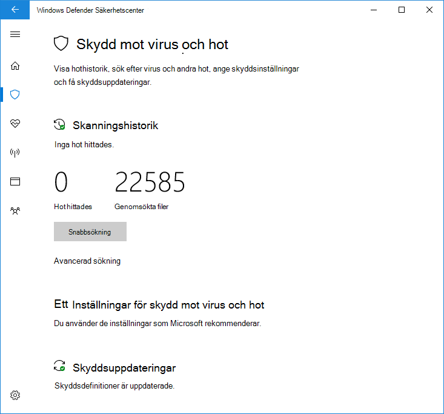

# Använd begränsad regelbunden genomsökning i Microsoft Defender Antivirus

[!INCLUDE [Microsoft 365 Defender rebranding](../../includes/microsoft-defender.md)]

**Gäller för:**

- [Microsoft Defender för Endpoint](/microsoft-365/security/defender-endpoint/)

Begränsad regelbunden genomsökning är en särskild typ av identifiering och åtgärd av hot som kan aktiveras när du har installerat ett annat antivirusprogram på en Windows 10-enhet.

Det kan bara aktiveras i vissa situationer. Mer information om begränsad regelbunden genomsökning och hur Microsoft Defender Antivirus fungerar med andra antivirusprogram finns i [Kompatibilitet för Microsoft Defender Antivirus.](microsoft-defender-antivirus-compatibility.md)

**Microsoft rekommenderar inte att du använder den här funktionen i företagsmiljöer. Det här är en funktion som främst är avsedd för konsumenter.** Den här funktionen använder endast en begränsad delmängd av funktionerna i Microsoft Defender Antivirus för att identifiera skadlig programvara och kommer inte att kunna identifiera den största delen av skadlig programvara och eventuellt oönskad programvara. Dessutom är hanterings- och rapporteringsfunktionerna begränsade. Microsoft rekommenderar företag att välja sin primära antiviruslösning och använda den exklusivt.

## Aktivera begränsad regelbunden genomsökning

Som standard aktiveras antivirusprogrammet Microsoft Defender på en Windows 10-enhet om det inte finns något annat antivirusprogram installerat, eller om den andra produkten är inaktiv, har gått ut eller inte fungerar korrekt.

Om Microsoft Defender Antivirus är aktiverat visas de vanliga alternativen för att konfigurera det på enheten:

Om ett annat antivirusprogram är installerat och fungerar korrekt inaktiveras antivirusprogrammet Microsoft Defender. Windows-säkerhetsappen ändrar **avsnittet Skydd mot &** virus för att visa status om AV-produkten, och ge en länk till produktens konfigurationsalternativ.

Under en tredje parts AV-produkter visas en ny länk som **Microsoft Defender Antivirus-alternativ**. Om du klickar på länken expanderas växlingsknappen som aktiverar begränsad regelbunden genomsökning. Observera att det begränsade periodiska alternativet är en växlingsknapp för att aktivera eller inaktivera regelbunden genomsökning. 

Om du för skjut **reglaget** till På visas standardalternativen för Microsoft Defender AV under tredje parts AV-produkt. Det begränsade alternativet för regelbunden genomsökning visas längst ned på sidan.

## Relaterade artiklar

- [Konfigurera behavioruellt, heuristiskt och realtidsskydd](configure-protection-features-microsoft-defender-antivirus.md)
- [Microsoft Defender Antivirus i Windows 10](microsoft-defender-antivirus-in-windows-10.md)