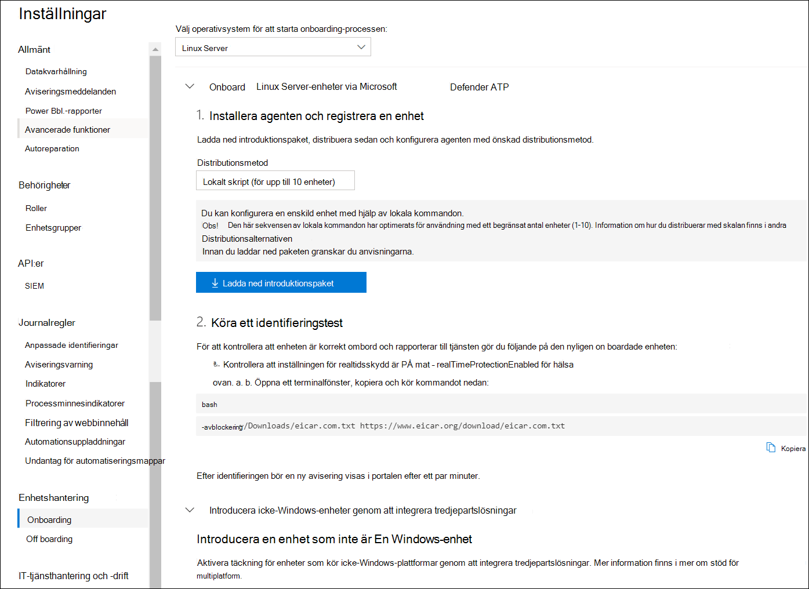

# <a name="deploy-microsoft-defender-for-endpoint-on-linux-manually"></a>Distribuera Microsoft Defender för Slutpunkt i Linux manuellt

[!INCLUDE [Microsoft 365 Defender rebranding](../../includes/microsoft-defender.md)]


**Gäller för:**
- [Microsoft Defender för Endpoint](https://go.microsoft.com/fwlink/p/?linkid=2154037)
- [Microsoft 365 Defender](https://go.microsoft.com/fwlink/?linkid=2118804)

> Vill du använda Defender för Slutpunkt? [Registrera dig för en kostnadsfri utvärderingsversion.](https://www.microsoft.com/microsoft-365/windows/microsoft-defender-atp?ocid=docs-wdatp-investigateip-abovefoldlink)

I den här artikeln beskrivs hur du distribuerar Microsoft Defender för Endpoint på Linux manuellt. För en lyckad distribution måste alla följande uppgifter slutföras:

- [Distribuera Microsoft Defender för Slutpunkt i Linux manuellt](#deploy-microsoft-defender-for-endpoint-on-linux-manually)
  - [Krav och systemkrav](#prerequisites-and-system-requirements)
  - [Konfigurera linux-programvarans lagringsplats](#configure-the-linux-software-repository)
    - [RHEL och varianter (CentOS och Oracle Linux)](#rhel-and-variants-centos-and-oracle-linux)
    - [SLES och varianter](#sles-and-variants)
    - [Ubuntu och Ubuntu systems](#ubuntu-and-debian-systems)
  - [Programinstallation](#application-installation)
  - [Ladda ned onboarding-paketet](#download-the-onboarding-package)
  - [Klientkonfiguration](#client-configuration)
  - [Installationsskript](#installer-script)
  - [Logga installationsproblem](#log-installation-issues)
  - [Uppgraderingar av operativsystem](#operating-system-upgrades)
  - [Avinstallation](#uninstallation)

## <a name="prerequisites-and-system-requirements"></a>Krav och systemkrav

Innan du börjar kan du gå till [Microsoft Defender för Slutpunkt](microsoft-defender-endpoint-linux.md) på Linux för att få en beskrivning av krav och systemkrav för den aktuella programvaruversionen.

## <a name="configure-the-linux-software-repository"></a>Konfigurera linux-programvarans lagringsplats

Defender för Slutpunkt i Linux kan distribueras från någon av följande kanaler (anges nedan som *[kanal]*): *insiders-fast,* *insiders-slow* eller *prod*. Var och en av dessa kanaler motsvarar en linux-programvarudatabas. Anvisningar för hur du konfigurerar enheten för att använda någon av dessa lagringsningar finns nedan.

Valet av kanal avgör typ och frekvens för uppdateringar som erbjuds till din enhet. Enheter inom *insiders – snabbt* är de första som får uppdateringar och nya funktioner, följt senare av *insiders-slow* och slutligen *av prod*.

Om du vill förhandsgranska nya funktioner och ge tidig feedback rekommenderar vi att du konfigurerar vissa enheter i företaget så att de använder *insiders snabbt* eller *insiders -långsamt.*

> [!WARNING]
> Om du byter kanal efter den första installationen måste produkten installeras om. Om du vill byta produktkanal: avinstallera det befintliga paketet, konfigurera om enheten så att den nya kanalen används och följ stegen i det här dokumentet för att installera paketet från den nya platsen.

### <a name="rhel-and-variants-centos-and-oracle-linux"></a>RHEL och varianter (CentOS och Oracle Linux)

- Installera `yum-utils` om det inte är installerat än:

    ```bash
    sudo yum install yum-utils
    ```

- Notera din distribution och version och identifiera den mest närmaste posten (efter huvudämne och sedan mindre) för den under `https://packages.microsoft.com/config/` . Till exempel är RHEL 7,9 närmare 7,4 än 8.

    I kommandona nedan *ersätter du [distro]* *och [version]* med den information som du har identifierat:

    > [!NOTE]
    > Om du använder Oracle Linux *ersätter du [distro]* med "rhel".

    ```bash
    sudo yum-config-manager --add-repo=https://packages.microsoft.com/config/[distro]/[version]/[channel].repo
    ```

    Om du till exempel kör CentOS 7 och vill distribuera Defender för Endpoint på Linux från *prod-kanalen:*

    ```bash
    sudo yum-config-manager --add-repo=https://packages.microsoft.com/config/centos/7/prod.repo
    ```

    Eller om du vill utforska nya funktioner på valda enheter kanske du vill distribuera MDE för Linux till *insiders-fast-kanal:*

    ```bash
    sudo yum-config-manager --add-repo=https://packages.microsoft.com/config/centos/7/insiders-fast.repo
    ```

- Installera den offentliga Microsoft GPG-nyckeln:

    ```bash
    sudo rpm --import http://packages.microsoft.com/keys/microsoft.asc
    ```

- Ladda ned och gör att alla metadata för de för tillfället aktiverade lagringsplatsen för yum går att använda:

    ```bash
    yum makecache
    ```

### <a name="sles-and-variants"></a>SLES och varianter

- Notera din distribution och version och identifiera den mest närmaste posten (efter huvudämne och sedan mindre) för den under `https://packages.microsoft.com/config/` .

    Ersätt [distro] och *[version]* med den information du har identifierat med följande kommandon: 

    ```bash
    sudo zypper addrepo -c -f -n microsoft-[channel] https://packages.microsoft.com/config/[distro]/[version]/[channel].repo
    ```

    Om du till exempel kör SLES 12 och vill distribuera MDE för Linux från *prod-kanalen:*

    ```bash
    sudo zypper addrepo -c -f -n microsoft-prod https://packages.microsoft.com/config/sles/12/prod.repo
    ```

- Installera den offentliga Microsoft GPG-nyckeln:

    ```bash
    sudo rpm --import http://packages.microsoft.com/keys/microsoft.asc
    ```

### <a name="ubuntu-and-debian-systems"></a>Ubuntu och Ubuntu systems

- Installera `curl` om det inte är installerat än:

    ```bash
    sudo apt-get install curl
    ```

- Installera `libplist-utils` om det inte är installerat än:

    ```bash
    sudo apt-get install libplist-utils
    ```

- Notera din distribution och version och identifiera den mest närmaste posten (efter huvudämne och sedan mindre) för den under `https://packages.microsoft.com/config` .

    I kommandot nedan ersätter *du [distro]* och *[version]* med den information som du har identifierat:

    ```bash
    curl -o microsoft.list https://packages.microsoft.com/config/[distro]/[version]/[channel].list
    ```

    Till exempel om du kör Ubuntu 18.04 och vill distribuera MDE för Linux från *prod-kanalen:*

    ```bash
    curl -o microsoft.list https://packages.microsoft.com/config/ubuntu/18.04/prod.list
    ```

- Installera lagringsplatsens konfiguration:

    ```bash
    sudo mv ./microsoft.list /etc/apt/sources.list.d/microsoft-[channel].list
    ```
    Om du till exempel har *valt prod-kanal:*

    ```bash
    sudo mv ./microsoft.list /etc/apt/sources.list.d/microsoft-prod.list
    ```

- Installera paketet `gpg` om det inte redan är installerat:

    ```bash
    sudo apt-get install gpg
    ```

  Installera `gpg` om inte är `gnupg` tillgängligt.

- Installera den offentliga Microsoft GPG-nyckeln:

    ```bash
    curl https://packages.microsoft.com/keys/microsoft.asc | sudo apt-key add -
    ```

- Installera https-drivrutinen om den inte redan finns:

    ```bash
    sudo apt-get install apt-transport-https
    ```

- Uppdatera metadata för lagringsplatsen:

    ```bash
    sudo apt-get update
    ```

## <a name="application-installation"></a>Programinstallation

- RHEL och varianter (CentOS och Oracle Linux):

    ```bash
    sudo yum install mdatp
    ```

    Om du har flera Microsoft-lagringslager konfigurerade på enheten kan du vara specifik för vilken lagringsplats paketet ska installeras från. I följande exempel visas hur du installerar paketet från kanalen `production` om du även har `insiders-fast` databasens kanal konfigurerad på den här enheten. Det här kan inträffa om du använder flera Microsoft-produkter på din enhet. Beroende på distributionen och versionen av servern kan lagringsplatsaliaset vara ett annat än det som visas i följande exempel.

    ```bash
    # list all repositories
    yum repolist
    ```
    ```Output
    ...
    packages-microsoft-com-prod               packages-microsoft-com-prod        316
    packages-microsoft-com-prod-insiders-fast packages-microsoft-com-prod-ins      2
    ...
    ```
    ```bash
    # install the package from the production repository
    sudo yum --enablerepo=packages-microsoft-com-prod install mdatp
    ```

- SLES och varianter:

    ```bash
    sudo zypper install mdatp
    ```

    Om du har flera Microsoft-lagringslager konfigurerade på enheten kan du vara specifik för vilken lagringsplats paketet ska installeras från. I följande exempel visas hur du installerar paketet från kanalen `production` om du även har `insiders-fast` databasens kanal konfigurerad på den här enheten. Det här kan inträffa om du använder flera Microsoft-produkter på din enhet.

    ```bash
    zypper repos
    ```

    ```Output
    ...
    #  | Alias | Name | ...
    XX | packages-microsoft-com-insiders-fast | microsoft-insiders-fast | ...
    XX | packages-microsoft-com-prod | microsoft-prod | ...
    ...
    ```
    ```bash
    sudo zypper install packages-microsoft-com-prod:mdatp
    ```

- Ubuntu och Ubuntu system:

    ```bash
    sudo apt-get install mdatp
    ```

    Om du har flera Microsoft-lagringslager konfigurerade på enheten kan du vara specifik för vilken lagringsplats paketet ska installeras från. I följande exempel visas hur du installerar paketet från kanalen `production` om du även har `insiders-fast` databasens kanal konfigurerad på den här enheten. Det här kan inträffa om du använder flera Microsoft-produkter på din enhet.

    ```bash
    cat /etc/apt/sources.list.d/*
    ```
    ```Output
    deb [arch=arm64,armhf,amd64] https://packages.microsoft.com/ubuntu/18.04/prod insiders-fast main
    deb [arch=amd64] https://packages.microsoft.com/ubuntu/18.04/prod bionic main
    ```
    ```bash
    sudo apt -t bionic install mdatp
    ```

## <a name="download-the-onboarding-package"></a>Ladda ned onboarding-paketet

Ladda ned introduktionspaketet från Microsoft Defender Säkerhetscenter:

1. I Microsoft Defender Säkerhetscenter går du till Inställningar > **på Enhetshantering > Onboarding.**
2. I den första listrutan väljer du **Linux Server** som operativsystem. I den andra listrutan väljer du Lokalt skript (för upp till **10 enheter)** som distributionsmetod.
3. Välj **Hämta introduktionspaket**. Spara filen som WindowsDefenderATPOnboardingPackage.zip.

    

4. Kontrollera att filen finns i kommandotolken.
    Extrahera innehållet i arkivet:

    ```bash
    ls -l
    ```

    ```Output
    total 8
    -rw-r--r-- 1 test  staff  5752 Feb 18 11:22 WindowsDefenderATPOnboardingPackage.zip
    ```

    ```bash
    unzip WindowsDefenderATPOnboardingPackage.zip
    ```
    ```Output
    Archive:  WindowsDefenderATPOnboardingPackage.zip
    inflating: MicrosoftDefenderATPOnboardingLinuxServer.py
    ```


## <a name="client-configuration"></a>Klientkonfiguration

1. Kopiera MicrosoftDefenderATPOnboardingLinuxServer.py till målenheten.

    Till en början är klientenheten inte kopplad till en organisation. Observera att *orgId-attributet* är tomt:

    ```bash
    mdatp health --field org_id
    ```

2. Kör MicrosoftDefenderATPOnboardingLinuxServer.py och observera att du måste ha installerat på enheten för att kunna `python` köra det här kommandot:

    ```bash
    python MicrosoftDefenderATPOnboardingLinuxServer.py
    ```

3. Kontrollera att enheten nu är kopplad till din organisation och rapporterar en giltig organisationsidentifierare:

    ```bash
    mdatp health --field org_id
    ```

4. Några minuter efter att du slutfört installationen kan du se statusen genom att köra följande kommando. Returvärdet för `1` anger att produkten fungerar som förväntat:

    ```bash
    mdatp health --field healthy
    ```

    > [!IMPORTANT]
    > När produkten startas för första gången laddas de senaste definitionerna för program mot skadlig programvara ned. Beroende på din Internetanslutning kan det ta upp till några minuter. Under den här tiden returnerar kommandot ovan värdet `false` . Du kan kontrollera statusen för definitionsuppdateringen med hjälp av följande kommando:
    > ```bash
    > mdatp health --field definitions_status
    > ```
    > Observera att du kan också behöva konfigurera en proxy när du har slutfört den första installationen. Se [Konfigurera Defender för slutpunkt på Linux för statisk proxyidentifiering: Konfiguration efter installation.](https://docs.microsoft.com/microsoft-365/security/defender-endpoint/linux-static-proxy-configuration#post-installation-configuration)

5. Kör ett identifieringstest för att verifiera att enheten är korrekt onboarded och rapporterar till tjänsten. Utför följande steg på den nyligen inbyggda enheten:

    - Se till att realtidsskyddet är aktiverat (som visas på grund av att följande kommando `1` körs):

        ```bash
        mdatp health --field real_time_protection_enabled
        ```

    - Öppna ett terminalfönster. Kopiera och kör följande kommando:

        ``` bash
        curl -o /tmp/eicar.com.txt https://www.eicar.org/download/eicar.com.txt
        ```

    - Filen skulle ha satts i karantän av Defender för Endpoint på Linux. Använd följande kommando för att lista alla identifierade hot:

        ```bash
        mdatp threat list
        ```

## <a name="installer-script"></a>Installationsskript

Alternativt kan du använda ett automatiserat installationsprogram [bash-skript](https://github.com/microsoft/mdatp-xplat/blob/master/linux/installation/mde_installer.sh) som tillhandahålls i vår [offentliga GitHub databas.](https://github.com/microsoft/mdatp-xplat/)
Skriptet identifierar distributionen och versionen och uppsättningar av enheten för att hämta det senaste paketet och installera det.
Du kan också registrera dig för ett skript.

```bash
❯ ./mde_installer.sh --help
usage: basename ./mde_installer.sh [OPTIONS]
Options:
-c|--channel      specify the channel from which you want to install. Default: insiders-fast
-i|--install      install the product
-r|--remove       remove the product
-u|--upgrade      upgrade the existing product
-o|--onboard      onboard/offboard the product with <onboarding_script>
-p|--passive-mode set EPP to passive mode
-t|--tag          set a tag by declaring <name> and <value>. ex: -t GROUP Coders
-m|--min_req      enforce minimum requirements
-w|--clean        remove repo from package manager for a specific channel
-v|--version      print out script version
-h|--help         display help
```

Läs mer [här.](https://github.com/microsoft/mdatp-xplat/tree/master/linux/installation)

## <a name="log-installation-issues"></a>Logga installationsproblem

Mer [information om hur](linux-resources.md#log-installation-issues) du hittar den automatiskt genererade loggen som skapas av installationsprogrammet när ett fel uppstår finns i Problem med logginstallationen.

## <a name="operating-system-upgrades"></a>Uppgraderingar av operativsystem

När du uppgraderar ditt operativsystem till en ny huvudversion måste du först avinstallera Defender för Slutpunkt i Linux, installera uppgraderingen och slutligen konfigurera om Defender för Slutpunkt på Linux på din enhet.

## <a name="how-to-migrate-from-insiders-fast-to-production-channel"></a>Migrera från Insiders-Fast till produktionskanalen

1. Avinstallera "Insiders-Fast-kanalen" versionen av MDE för Linux.

    ``
    sudo yum remove mdatp
    ``

1. Inaktivera MDE för Linux Insiders-Fast platsen  ``
    sudo yum repolist
    ``

    > [!NOTE]
    > Utdata ska visa "packages-microsoft-com-fast-prod".

    ``
    sudo yum-config-manager --disable packages-microsoft-com-fast-prod
    ``
1. Distribuera om MDE för Linux med "Produktionskanal".


## <a name="uninstallation"></a>Avinstallation

Se [Avinstallera](linux-resources.md#uninstall) för mer information om hur du tar bort Defender för Slutpunkt på Linux från klientenheter.
