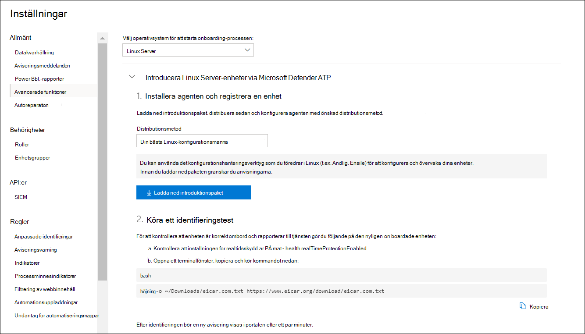

# <a name="deploy-microsoft-defender-for-endpoint-for-linux-with-ansible"></a><span data-ttu-id="37205-104">Distribuera Microsoft Defender för Slutpunkt för Linux med Ansible</span><span class="sxs-lookup"><span data-stu-id="37205-104">Deploy Microsoft Defender for Endpoint for Linux with Ansible</span></span>

[!INCLUDE [Microsoft 365 Defender rebranding](../../includes/microsoft-defender.md)]


<span data-ttu-id="37205-105">**Gäller för:**</span><span class="sxs-lookup"><span data-stu-id="37205-105">**Applies to:**</span></span>
- [<span data-ttu-id="37205-106">Microsoft Defender för Endpoint</span><span class="sxs-lookup"><span data-stu-id="37205-106">Microsoft Defender for Endpoint</span></span>](https://go.microsoft.com/fwlink/p/?linkid=2154037)
- [<span data-ttu-id="37205-107">Microsoft 365 Defender</span><span class="sxs-lookup"><span data-stu-id="37205-107">Microsoft 365 Defender</span></span>](https://go.microsoft.com/fwlink/?linkid=2118804)

> <span data-ttu-id="37205-108">Vill du använda Defender för Slutpunkt?</span><span class="sxs-lookup"><span data-stu-id="37205-108">Want to experience Defender for Endpoint?</span></span> [<span data-ttu-id="37205-109">Registrera dig för en kostnadsfri utvärderingsversion.</span><span class="sxs-lookup"><span data-stu-id="37205-109">Sign up for a free trial.</span></span>](https://www.microsoft.com/microsoft-365/windows/microsoft-defender-atp?ocid=docs-wdatp-investigateip-abovefoldlink)

<span data-ttu-id="37205-110">I den här artikeln beskrivs hur du distribuerar Defender för Endpoint för Linux med Ansible.</span><span class="sxs-lookup"><span data-stu-id="37205-110">This article describes how to deploy Defender for Endpoint for Linux using Ansible.</span></span> <span data-ttu-id="37205-111">För en lyckad distribution måste alla följande uppgifter slutföras:</span><span class="sxs-lookup"><span data-stu-id="37205-111">A successful deployment requires the completion of all of the following tasks:</span></span>

- [<span data-ttu-id="37205-112">Ladda ned onboarding-paketet</span><span class="sxs-lookup"><span data-stu-id="37205-112">Download the onboarding package</span></span>](#download-the-onboarding-package)
- [<span data-ttu-id="37205-113">Skapa ansible YAML-filer</span><span class="sxs-lookup"><span data-stu-id="37205-113">Create Ansible YAML files</span></span>](#create-ansible-yaml-files)
- [<span data-ttu-id="37205-114">Distribution</span><span class="sxs-lookup"><span data-stu-id="37205-114">Deployment</span></span>](#deployment)
- [<span data-ttu-id="37205-115">Referenser</span><span class="sxs-lookup"><span data-stu-id="37205-115">References</span></span>](#references)

## <a name="prerequisites-and-system-requirements"></a><span data-ttu-id="37205-116">Krav och systemkrav</span><span class="sxs-lookup"><span data-stu-id="37205-116">Prerequisites and system requirements</span></span>

<span data-ttu-id="37205-117">Innan du börjar kan du gå [till huvudsidan för Defender](microsoft-defender-endpoint-linux.md) för Endpoint för Linux för att få en beskrivning av förutsättningarna och systemkraven för den aktuella programvaruversionen.</span><span class="sxs-lookup"><span data-stu-id="37205-117">Before you get started, see [the main Defender for Endpoint for Linux page](microsoft-defender-endpoint-linux.md) for a description of prerequisites and system requirements for the current software version.</span></span>

<span data-ttu-id="37205-118">För ansible-distribution måste du dessutom känna till Ansible-administrationsuppgifter, ha Ansible konfigurerat och veta hur du distribuerar spelböcker och uppgifter.</span><span class="sxs-lookup"><span data-stu-id="37205-118">In addition, for Ansible deployment, you need to be familiar with Ansible administration tasks, have Ansible configured, and know how to deploy playbooks and tasks.</span></span> <span data-ttu-id="37205-119">Det finns många sätt att slutföra samma aktivitet på ansible.</span><span class="sxs-lookup"><span data-stu-id="37205-119">Ansible has many ways to complete the same task.</span></span> <span data-ttu-id="37205-120">De här instruktionerna förutsätter tillgänglighet för ansible-moduler som stöds, till exempel *apt* och *inte arkiverade för* distribution av paketet.</span><span class="sxs-lookup"><span data-stu-id="37205-120">These instructions assume availability of supported Ansible modules, such as *apt* and *unarchive* to help deploy the package.</span></span> <span data-ttu-id="37205-121">Din organisation kan använda ett annat arbetsflöde.</span><span class="sxs-lookup"><span data-stu-id="37205-121">Your organization might use a different workflow.</span></span> <span data-ttu-id="37205-122">Mer information finns [i dokumentationen till Ansible.](https://docs.ansible.com/)</span><span class="sxs-lookup"><span data-stu-id="37205-122">Refer to the [Ansible documentation](https://docs.ansible.com/) for details.</span></span>

- <span data-ttu-id="37205-123">Ansible måste vara installerat på minst en dator (vi kallar det för primär dator).</span><span class="sxs-lookup"><span data-stu-id="37205-123">Ansible needs to be installed on at least one computer (we will call it the primary computer).</span></span>
- <span data-ttu-id="37205-124">SSH måste konfigureras för ett administratörskonto mellan den primära datorn och alla klienter, och det rekommenderas att konfigureras med offentlig nyckelautentisering.</span><span class="sxs-lookup"><span data-stu-id="37205-124">SSH must be configured for an administrator account between the primary computer and all clients, and it is recommended be configured with public key authentication.</span></span>
- <span data-ttu-id="37205-125">Följande programvara måste vara installerad på alla klienter:</span><span class="sxs-lookup"><span data-stu-id="37205-125">The following software must be installed on all clients:</span></span>
  - <span data-ttu-id="37205-126">böjning</span><span class="sxs-lookup"><span data-stu-id="37205-126">curl</span></span>
  - <span data-ttu-id="37205-127">python-apt</span><span class="sxs-lookup"><span data-stu-id="37205-127">python-apt</span></span>

- <span data-ttu-id="37205-128">Alla värdar måste visas i följande format i `/etc/ansible/hosts` den eller relevanta filen:</span><span class="sxs-lookup"><span data-stu-id="37205-128">All hosts must be listed in the following format in the `/etc/ansible/hosts` or relevant file:</span></span>

    ```bash
    [servers]
    host1 ansible_ssh_host=10.171.134.39
    host2 ansible_ssh_host=51.143.50.51
    ```

- <span data-ttu-id="37205-129">Ping-test:</span><span class="sxs-lookup"><span data-stu-id="37205-129">Ping test:</span></span>

    ```bash
    ansible -m ping all
    ```

## <a name="download-the-onboarding-package"></a><span data-ttu-id="37205-130">Ladda ned onboarding-paketet</span><span class="sxs-lookup"><span data-stu-id="37205-130">Download the onboarding package</span></span>

<span data-ttu-id="37205-131">Ladda ned introduktionspaketet från Microsoft Defender Säkerhetscenter:</span><span class="sxs-lookup"><span data-stu-id="37205-131">Download the onboarding package from Microsoft Defender Security Center:</span></span>

1. <span data-ttu-id="37205-132">I Microsoft Defender Säkerhetscenter går du till **Inställningar > Enhetshantering > Onboarding**.</span><span class="sxs-lookup"><span data-stu-id="37205-132">In Microsoft Defender Security Center, go to **Settings > Device Management > Onboarding**.</span></span>
2. <span data-ttu-id="37205-133">I den första listrutan väljer du **Linux Server** som operativsystem.</span><span class="sxs-lookup"><span data-stu-id="37205-133">In the first drop-down menu, select **Linux Server** as the operating system.</span></span> <span data-ttu-id="37205-134">I den andra nedrullningsmenyn väljer du **Det konfigurationshanteringsverktyg du** föredrar i Linux som distributionsmetod.</span><span class="sxs-lookup"><span data-stu-id="37205-134">In the second drop-down menu, select **Your preferred Linux configuration management tool** as the deployment method.</span></span>
3. <span data-ttu-id="37205-135">Välj **Hämta introduktionspaket**.</span><span class="sxs-lookup"><span data-stu-id="37205-135">Select **Download onboarding package**.</span></span> <span data-ttu-id="37205-136">Spara filen som WindowsDefenderATPOnboardingPackage.zip.</span><span class="sxs-lookup"><span data-stu-id="37205-136">Save the file as WindowsDefenderATPOnboardingPackage.zip.</span></span>

    

4. <span data-ttu-id="37205-138">Kontrollera att filen finns i kommandotolken.</span><span class="sxs-lookup"><span data-stu-id="37205-138">From a command prompt, verify that you have the file.</span></span> <span data-ttu-id="37205-139">Extrahera innehållet i arkivet:</span><span class="sxs-lookup"><span data-stu-id="37205-139">Extract the contents of the archive:</span></span>

    ```bash
    ls -l
    ```
    ```Output
    total 8
    -rw-r--r-- 1 test  staff  4984 Feb 18 11:22 WindowsDefenderATPOnboardingPackage.zip
    ```
    ```bash
    unzip WindowsDefenderATPOnboardingPackage.zip
    ```
    ```Output
    Archive:  WindowsDefenderATPOnboardingPackage.zip
    inflating: mdatp_onboard.json
    ```

## <a name="create-ansible-yaml-files"></a><span data-ttu-id="37205-140">Skapa ansible YAML-filer</span><span class="sxs-lookup"><span data-stu-id="37205-140">Create Ansible YAML files</span></span>

<span data-ttu-id="37205-141">Skapa en underaktivitet eller rollfiler som bidrar till en spelbok eller uppgift.</span><span class="sxs-lookup"><span data-stu-id="37205-141">Create a subtask or role files that contribute to an playbook or task.</span></span>

- <span data-ttu-id="37205-142">Skapa onboarding-uppgiften: `onboarding_setup.yml`</span><span class="sxs-lookup"><span data-stu-id="37205-142">Create the onboarding task, `onboarding_setup.yml`:</span></span>

    ```bash
    - name: Create MDATP directories
      file:
        path: /etc/opt/microsoft/mdatp/
        recurse: true
        state: directory
        mode: 0755
        owner: root
        group: root

    - name: Register mdatp_onboard.json
      stat:
        path: /etc/opt/microsoft/mdatp/mdatp_onboard.json
      register: mdatp_onboard

    - name: Extract WindowsDefenderATPOnboardingPackage.zip into /etc/opt/microsoft/mdatp
      unarchive:
        src: WindowsDefenderATPOnboardingPackage.zip
        dest: /etc/opt/microsoft/mdatp
        mode: 0600
        owner: root
        group: root
      when: not mdatp_onboard.stat.exists
    ```

- <span data-ttu-id="37205-143">Lägg till Defender för slutpunktens lagringsplats och nyckel.</span><span class="sxs-lookup"><span data-stu-id="37205-143">Add the Defender for Endpoint repository and key.</span></span>

    <span data-ttu-id="37205-144">Defender för Endpoint för Linux kan distribueras från någon av följande kanaler (anges nedan som *[kanal]*): *insiders-fast,* *insiders-slow* eller *prod*. Var och en av dessa kanaler motsvarar en linux-programvarudatabas.</span><span class="sxs-lookup"><span data-stu-id="37205-144">Defender for Endpoint for Linux can be deployed from one of the following channels (denoted below as *[channel]*): *insiders-fast*, *insiders-slow*, or *prod*. Each of these channels corresponds to a Linux software repository.</span></span>

    <span data-ttu-id="37205-145">Valet av kanal avgör typ och frekvens för uppdateringar som erbjuds till din enhet.</span><span class="sxs-lookup"><span data-stu-id="37205-145">The choice of the channel determines the type and frequency of updates that are offered to your device.</span></span> <span data-ttu-id="37205-146">Enheter inom *insiders – snabbt* är de första som får uppdateringar och nya funktioner, följt senare av *insiders-slow* och slutligen *av prod*.</span><span class="sxs-lookup"><span data-stu-id="37205-146">Devices in *insiders-fast* are the first ones to receive updates and new features, followed later by *insiders-slow* and lastly by *prod*.</span></span>

    <span data-ttu-id="37205-147">Om du vill förhandsgranska nya funktioner och ge tidig feedback rekommenderar vi att du konfigurerar vissa enheter i företaget så att de använder *insiders snabbt* eller *insiders -långsamt.*</span><span class="sxs-lookup"><span data-stu-id="37205-147">In order to preview new features and provide early feedback, it is recommended that you configure some devices in your enterprise to use either *insiders-fast* or *insiders-slow*.</span></span>

    > [!WARNING]
    > <span data-ttu-id="37205-148">Om du byter kanal efter den första installationen måste produkten installeras om.</span><span class="sxs-lookup"><span data-stu-id="37205-148">Switching the channel after the initial installation requires the product to be reinstalled.</span></span> <span data-ttu-id="37205-149">Om du vill byta produktkanal: avinstallera det befintliga paketet, konfigurera om enheten så att den nya kanalen används och följ stegen i det här dokumentet för att installera paketet från den nya platsen.</span><span class="sxs-lookup"><span data-stu-id="37205-149">To switch the product channel: uninstall the existing package, re-configure your device to use the new channel, and follow the steps in this document to install the package from the new location.</span></span>

    <span data-ttu-id="37205-150">Notera distribution och version och ange den mest närmaste posten för den under `https://packages.microsoft.com/config/` .</span><span class="sxs-lookup"><span data-stu-id="37205-150">Note your distribution and version and identify the closest entry for it under `https://packages.microsoft.com/config/`.</span></span>

    <span data-ttu-id="37205-151">I följande kommandon ersätter *du [distro]* *och [version]* med den information som du har identifierat.</span><span class="sxs-lookup"><span data-stu-id="37205-151">In the following commands, replace *[distro]* and *[version]* with the information you've identified.</span></span>

    > [!NOTE]
    > <span data-ttu-id="37205-152">Om du använder Oracle Linux *ersätter du [distro]* med "rhel".</span><span class="sxs-lookup"><span data-stu-id="37205-152">In case of Oracle Linux, replace *[distro]* with “rhel”.</span></span>

  ```bash
  - name: Add Microsoft APT key
    apt_key:
      keyserver: https://packages.microsoft.com/
      id: BC528686B50D79E339D3721CEB3E94ADBE1229CF
    when: ansible_os_family == "Debian"

  - name: Add Microsoft apt repository for MDATP
    apt_repository:
      repo: deb [arch=arm64,armhf,amd64] https://packages.microsoft.com/[distro]/[version]/prod [channel] main
      update_cache: yes
      state: present
      filename: microsoft-[channel].list
    when: ansible_os_family == "Debian"

  - name: Add Microsoft DNF/YUM key
    rpm_key:
      state: present
      key: https://packages.microsoft.com/keys/microsoft.asc
    when: ansible_os_family == "RedHat"

  - name: Add  Microsoft yum repository for MDATP
    yum_repository:
      name: packages-microsoft-com-prod-[channel]
      description: Microsoft Defender for Endpoint
      file: microsoft-[channel]
      baseurl: https://packages.microsoft.com/[distro]/[version]/[channel]/
      gpgcheck: yes
      enabled: Yes
  when: ansible_os_family == "RedHat"
  ```

- <span data-ttu-id="37205-153">Skapa ansible-installationen och avinstallera YAML-filer.</span><span class="sxs-lookup"><span data-stu-id="37205-153">Create the Ansible install and uninstall YAML files.</span></span>

    - <span data-ttu-id="37205-154">För apt-baserade distributioner använder du följande YAML-fil:</span><span class="sxs-lookup"><span data-stu-id="37205-154">For apt-based distributions use the following YAML file:</span></span>

        ```bash
        cat install_mdatp.yml
        ```
        ```Output
        - hosts: servers
          tasks:
            - include: ../roles/onboarding_setup.yml
            - include: ../roles/add_apt_repo.yml
            - apt:
                name: mdatp
                state: latest
                update_cache: yes
        ```

        ```bash
        cat uninstall_mdatp.yml
        ```
        ```Output
        - hosts: servers
        tasks:
            - apt:
                name: mdatp
                state: absent
        ```

    - <span data-ttu-id="37205-155">För yum-baserade distributioner använder du följande YAML-fil:</span><span class="sxs-lookup"><span data-stu-id="37205-155">For yum-based distributions use the following YAML file:</span></span>

        ```bash
        cat install_mdatp_yum.yml
        ```
        ```Output
        - hosts: servers
          tasks:
            - include: ../roles/onboarding_setup.yml
            - include: ../roles/add_yum_repo.yml
            - yum:
              name: mdatp
              state: latest
              enablerepo: packages-microsoft-com-prod-[channel]
        ```

        ```bash
        cat uninstall_mdatp_yum.yml
        ```
        ```Output
        - hosts: servers
        tasks:
            - yum:
               name: mdatp
                state: absent
        ```

## <a name="deployment"></a><span data-ttu-id="37205-156">Distribution</span><span class="sxs-lookup"><span data-stu-id="37205-156">Deployment</span></span>

<span data-ttu-id="37205-157">Kör nu uppgiftsfilerna under `/etc/ansible/playbooks/` eller relevant katalog.</span><span class="sxs-lookup"><span data-stu-id="37205-157">Now run the tasks files under `/etc/ansible/playbooks/` or relevant directory.</span></span>

- <span data-ttu-id="37205-158">Installation:</span><span class="sxs-lookup"><span data-stu-id="37205-158">Installation:</span></span>

    ```bash
    ansible-playbook /etc/ansible/playbooks/install_mdatp.yml -i /etc/ansible/hosts
    ```

> [!IMPORTANT]
> <span data-ttu-id="37205-159">När produkten startas för första gången laddas de senaste definitionerna för program mot skadlig programvara ned.</span><span class="sxs-lookup"><span data-stu-id="37205-159">When the product starts for the first time, it downloads the latest antimalware definitions.</span></span> <span data-ttu-id="37205-160">Beroende på din Internetanslutning kan det ta upp till några minuter.</span><span class="sxs-lookup"><span data-stu-id="37205-160">Depending on your Internet connection, this can take up to a few minutes.</span></span>

- <span data-ttu-id="37205-161">Verifiering/konfiguration:</span><span class="sxs-lookup"><span data-stu-id="37205-161">Validation/configuration:</span></span>

    ```bash
    ansible -m shell -a 'mdatp connectivity test' all
    ```
    ```bash
    ansible -m shell -a 'mdatp health' all
    ```

- <span data-ttu-id="37205-162">Avinstallation:</span><span class="sxs-lookup"><span data-stu-id="37205-162">Uninstallation:</span></span>

    ```bash
    ansible-playbook /etc/ansible/playbooks/uninstall_mdatp.yml -i /etc/ansible/hosts
    ```

## <a name="log-installation-issues"></a><span data-ttu-id="37205-163">Logga installationsproblem</span><span class="sxs-lookup"><span data-stu-id="37205-163">Log installation issues</span></span>

<span data-ttu-id="37205-164">Mer [information om hur](linux-resources.md#log-installation-issues) du hittar den automatiskt genererade loggen som skapas av installationsprogrammet när ett fel uppstår finns i Problem med logginstallationen.</span><span class="sxs-lookup"><span data-stu-id="37205-164">See [Log installation issues](linux-resources.md#log-installation-issues) for more information on how to find the automatically generated log that is created by the installer when an error occurs.</span></span>

## <a name="operating-system-upgrades"></a><span data-ttu-id="37205-165">Uppgraderingar av operativsystem</span><span class="sxs-lookup"><span data-stu-id="37205-165">Operating system upgrades</span></span>

<span data-ttu-id="37205-166">När du uppgraderar ditt operativsystem till en ny huvudversion måste du först avinstallera Defender för Endpoint för Linux, installera uppgraderingen och slutligen konfigurera om Defender för Endpoint för Linux på din enhet.</span><span class="sxs-lookup"><span data-stu-id="37205-166">When upgrading your operating system to a new major version, you must first uninstall Defender for Endpoint for Linux, install the upgrade, and finally reconfigure Defender for Endpoint for Linux on your device.</span></span>

## <a name="references"></a><span data-ttu-id="37205-167">Referenser</span><span class="sxs-lookup"><span data-stu-id="37205-167">References</span></span>

- [<span data-ttu-id="37205-168">Lägga till eller ta bort YUM-lagringsplatsen</span><span class="sxs-lookup"><span data-stu-id="37205-168">Add or remove YUM repositories</span></span>](https://docs.ansible.com/ansible/2.3/yum_repository_module.html)

- [<span data-ttu-id="37205-169">Hantera paket med pakethanteraren för yum</span><span class="sxs-lookup"><span data-stu-id="37205-169">Manage packages with the yum package manager</span></span>](https://docs.ansible.com/ansible/latest/modules/yum_module.html)

- [<span data-ttu-id="37205-170">Lägga till och ta bort APT-lagringsplatsen</span><span class="sxs-lookup"><span data-stu-id="37205-170">Add and remove APT repositories</span></span>](https://docs.ansible.com/ansible/latest/modules/apt_repository_module.html)

- [<span data-ttu-id="37205-171">Hantera avd-paket</span><span class="sxs-lookup"><span data-stu-id="37205-171">Manage apt-packages</span></span>](https://docs.ansible.com/ansible/latest/modules/apt_module.html)
