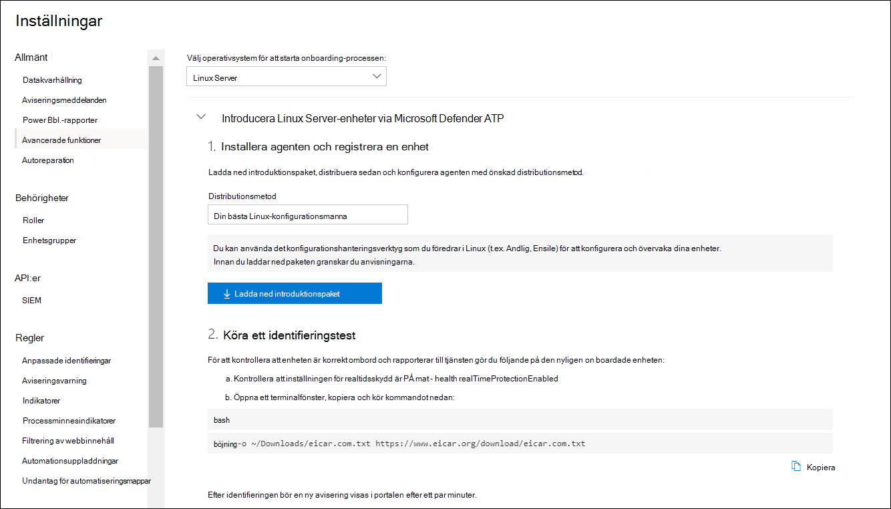

# <a name="deploy-microsoft-defender-for-endpoint-on-linux-with-puppet"></a><span data-ttu-id="c01d7-104">Distribuera Microsoft Defender för slutpunkt på Linux med Defender</span><span class="sxs-lookup"><span data-stu-id="c01d7-104">Deploy Microsoft Defender for Endpoint on Linux with Puppet</span></span>

[!INCLUDE [Microsoft 365 Defender rebranding](../../includes/microsoft-defender.md)]


<span data-ttu-id="c01d7-105">**Gäller för:**</span><span class="sxs-lookup"><span data-stu-id="c01d7-105">**Applies to:**</span></span>
- [<span data-ttu-id="c01d7-106">Microsoft Defender för Endpoint</span><span class="sxs-lookup"><span data-stu-id="c01d7-106">Microsoft Defender for Endpoint</span></span>](https://go.microsoft.com/fwlink/p/?linkid=2154037)
- [<span data-ttu-id="c01d7-107">Microsoft 365 Defender</span><span class="sxs-lookup"><span data-stu-id="c01d7-107">Microsoft 365 Defender</span></span>](https://go.microsoft.com/fwlink/?linkid=2118804)

> <span data-ttu-id="c01d7-108">Vill du använda Defender för Slutpunkt?</span><span class="sxs-lookup"><span data-stu-id="c01d7-108">Want to experience Defender for Endpoint?</span></span> [<span data-ttu-id="c01d7-109">Registrera dig för en kostnadsfri utvärderingsversion.</span><span class="sxs-lookup"><span data-stu-id="c01d7-109">Sign up for a free trial.</span></span>](https://www.microsoft.com/microsoft-365/windows/microsoft-defender-atp?ocid=docs-wdatp-investigateip-abovefoldlink)

<span data-ttu-id="c01d7-110">I den här artikeln beskrivs hur du distribuerar Defender för Endpoint på Linux med Hjälp av Linux.</span><span class="sxs-lookup"><span data-stu-id="c01d7-110">This article describes how to deploy Defender for Endpoint on Linux using Puppet.</span></span> <span data-ttu-id="c01d7-111">För en lyckad distribution måste alla följande uppgifter slutföras:</span><span class="sxs-lookup"><span data-stu-id="c01d7-111">A successful deployment requires the completion of all of the following tasks:</span></span>

- [<span data-ttu-id="c01d7-112">Ladda ned onboarding-paketet</span><span class="sxs-lookup"><span data-stu-id="c01d7-112">Download the onboarding package</span></span>](#download-the-onboarding-package)
- [<span data-ttu-id="c01d7-113">Create Manifest</span><span class="sxs-lookup"><span data-stu-id="c01d7-113">Create Puppet manifest</span></span>](#create-a-puppet-manifest)
- [<span data-ttu-id="c01d7-114">Distribution</span><span class="sxs-lookup"><span data-stu-id="c01d7-114">Deployment</span></span>](#deployment)
- [<span data-ttu-id="c01d7-115">Kontrollera onboarding-status</span><span class="sxs-lookup"><span data-stu-id="c01d7-115">Check onboarding status</span></span>](#check-onboarding-status)

## <a name="prerequisites-and-system-requirements"></a><span data-ttu-id="c01d7-116">Krav och systemkrav</span><span class="sxs-lookup"><span data-stu-id="c01d7-116">Prerequisites and system requirements</span></span>

 <span data-ttu-id="c01d7-117">En beskrivning av krav och systemkrav för den aktuella programvaruversionen finns på [huvudsidan för Defender för slutpunkt på Linux.](microsoft-defender-endpoint-linux.md)</span><span class="sxs-lookup"><span data-stu-id="c01d7-117">For a description of prerequisites and system requirements for the current software version, see [the main Defender for Endpoint on Linux page](microsoft-defender-endpoint-linux.md).</span></span>

<span data-ttu-id="c01d7-118">För distributionen av distributionsen så måste du dessutom vara bekant med projektadministrationsuppgifter, har konfigurering av första hand och vet hur du distribuerar paket.</span><span class="sxs-lookup"><span data-stu-id="c01d7-118">In addition, for Puppet deployment, you need to be familiar with Puppet administration tasks, have Puppet configured, and know how to deploy packages.</span></span> <span data-ttu-id="c01d7-119">Det finns många sätt att slutföra samma uppgift på.</span><span class="sxs-lookup"><span data-stu-id="c01d7-119">Puppet has many ways to complete the same task.</span></span> <span data-ttu-id="c01d7-120">I de här instruktionerna förutsätts att det finns stöd för moduler som stöds, till exempel *apt* för att distribuera paketet.</span><span class="sxs-lookup"><span data-stu-id="c01d7-120">These instructions assume availability of supported Puppet modules, such as *apt* to help deploy the package.</span></span> <span data-ttu-id="c01d7-121">Din organisation kan använda ett annat arbetsflöde.</span><span class="sxs-lookup"><span data-stu-id="c01d7-121">Your organization might use a different workflow.</span></span> <span data-ttu-id="c01d7-122">Mer information finns [i dokumentation](https://puppet.com/docs) om Dokumentation.</span><span class="sxs-lookup"><span data-stu-id="c01d7-122">Refer to the [Puppet documentation](https://puppet.com/docs) for details.</span></span>

## <a name="download-the-onboarding-package"></a><span data-ttu-id="c01d7-123">Ladda ned onboarding-paketet</span><span class="sxs-lookup"><span data-stu-id="c01d7-123">Download the onboarding package</span></span>

<span data-ttu-id="c01d7-124">Ladda ned introduktionspaketet från Microsoft Defender Säkerhetscenter:</span><span class="sxs-lookup"><span data-stu-id="c01d7-124">Download the onboarding package from Microsoft Defender Security Center:</span></span>

1. <span data-ttu-id="c01d7-125">I Microsoft Defender Säkerhetscenter går du till Inställningar > **på Enhetshantering > Onboarding.**</span><span class="sxs-lookup"><span data-stu-id="c01d7-125">In Microsoft Defender Security Center, go to **Settings > Device Management > Onboarding**.</span></span>
2. <span data-ttu-id="c01d7-126">I den första listrutan väljer du **Linux Server** som operativsystem.</span><span class="sxs-lookup"><span data-stu-id="c01d7-126">In the first drop-down menu, select **Linux Server** as the operating system.</span></span> <span data-ttu-id="c01d7-127">I den andra nedrullningsmenyn väljer du **Det konfigurationshanteringsverktyg du** föredrar i Linux som distributionsmetod.</span><span class="sxs-lookup"><span data-stu-id="c01d7-127">In the second drop-down menu, select **Your preferred Linux configuration management tool** as the deployment method.</span></span>
3. <span data-ttu-id="c01d7-128">Välj **Hämta introduktionspaket**.</span><span class="sxs-lookup"><span data-stu-id="c01d7-128">Select **Download onboarding package**.</span></span> <span data-ttu-id="c01d7-129">Spara filen som WindowsDefenderATPOnboardingPackage.zip.</span><span class="sxs-lookup"><span data-stu-id="c01d7-129">Save the file as WindowsDefenderATPOnboardingPackage.zip.</span></span>

    

4. <span data-ttu-id="c01d7-131">Kontrollera att filen finns i kommandotolken.</span><span class="sxs-lookup"><span data-stu-id="c01d7-131">From a command prompt, verify that you have the file.</span></span> 

    ```bash
    ls -l
    ```
    ```Output
    total 8
    -rw-r--r-- 1 test  staff  4984 Feb 18 11:22 WindowsDefenderATPOnboardingPackage.zip
    ```
5. <span data-ttu-id="c01d7-132">Extrahera innehållet i arkivet.</span><span class="sxs-lookup"><span data-stu-id="c01d7-132">Extract the contents of the archive.</span></span>
    ```bash
    unzip WindowsDefenderATPOnboardingPackage.zip
    ```
    ```Output
    Archive:  WindowsDefenderATPOnboardingPackage.zip
    inflating: mdatp_onboard.json
    ```

## <a name="create-a-puppet-manifest"></a><span data-ttu-id="c01d7-133">Skapa ett manifest av semanifest</span><span class="sxs-lookup"><span data-stu-id="c01d7-133">Create a Puppet manifest</span></span>

<span data-ttu-id="c01d7-134">Du måste skapa ett Manifest för att distribuera Defender för Slutpunkt på Linux till enheter som hanteras av en Server för server av en klient.</span><span class="sxs-lookup"><span data-stu-id="c01d7-134">You need to create a Puppet manifest for deploying Defender for Endpoint on Linux to devices managed by a Puppet server.</span></span> <span data-ttu-id="c01d7-135">I det här exemplet används de *apt-* och *yumrepo-moduler* som är tillgängliga från celllabs, och förutsätter att modulerna har installerats på din Server för server för server, så att du kan installera dem på den.</span><span class="sxs-lookup"><span data-stu-id="c01d7-135">This example makes use of the *apt* and *yumrepo* modules available from puppetlabs, and assumes that the modules have been installed on your Puppet server.</span></span>

<span data-ttu-id="c01d7-136">Skapa mapparna *install_mdatp/filer* *och install_mdatp/manifest* under modulmappen i din arkivinstallation.</span><span class="sxs-lookup"><span data-stu-id="c01d7-136">Create the folders *install_mdatp/files* and *install_mdatp/manifests* under the modules folder of your Puppet installation.</span></span> <span data-ttu-id="c01d7-137">Den här mappen finns normalt *i /etc/lablabs/code/environments/production/modules* på din Server för server för server, där du kan installera en server.</span><span class="sxs-lookup"><span data-stu-id="c01d7-137">This folder is typically located in */etc/puppetlabs/code/environments/production/modules* on your Puppet server.</span></span> <span data-ttu-id="c01d7-138">Kopiera filen mdatp_onboard.jsfilen som skapats ovan till mappen *install_mdatp/filer.*</span><span class="sxs-lookup"><span data-stu-id="c01d7-138">Copy the mdatp_onboard.json file created above to the *install_mdatp/files* folder.</span></span> <span data-ttu-id="c01d7-139">Skapa en *init.pp*</span><span class="sxs-lookup"><span data-stu-id="c01d7-139">Create an *init.pp*</span></span> <span data-ttu-id="c01d7-140">som innehåller distributionsanvisningarna:</span><span class="sxs-lookup"><span data-stu-id="c01d7-140">file that contains the deployment instructions:</span></span>

```bash
pwd
```
```Output
/etc/puppetlabs/code/environments/production/modules
```

```bash
tree install_mdatp
```
```Output
install_mdatp
├── files
│   └── mdatp_onboard.json
└── manifests
    └── init.pp
```

### <a name="contents-of-install_mdatpmanifestsinitpp"></a><span data-ttu-id="c01d7-141">Innehållet i `install_mdatp/manifests/init.pp`</span><span class="sxs-lookup"><span data-stu-id="c01d7-141">Contents of `install_mdatp/manifests/init.pp`</span></span>

<span data-ttu-id="c01d7-142">Defender för Slutpunkt i Linux kan distribueras från någon av följande kanaler (anges nedan som *[kanal]*): *insiders-fast,* *insiders-slow* eller *prod*. Var och en av dessa kanaler motsvarar en linux-programvarudatabas.</span><span class="sxs-lookup"><span data-stu-id="c01d7-142">Defender for Endpoint on Linux can be deployed from one of the following channels (denoted below as *[channel]*): *insiders-fast*, *insiders-slow*, or *prod*. Each of these channels corresponds to a Linux software repository.</span></span>

<span data-ttu-id="c01d7-143">Valet av kanal avgör typ och frekvens för uppdateringar som erbjuds till din enhet.</span><span class="sxs-lookup"><span data-stu-id="c01d7-143">The choice of the channel determines the type and frequency of updates that are offered to your device.</span></span> <span data-ttu-id="c01d7-144">Enheter inom *insiders – snabbt* är de första som får uppdateringar och nya funktioner, följt senare av *insiders-slow* och slutligen *av prod*.</span><span class="sxs-lookup"><span data-stu-id="c01d7-144">Devices in *insiders-fast* are the first ones to receive updates and new features, followed later by *insiders-slow* and lastly by *prod*.</span></span>

<span data-ttu-id="c01d7-145">Om du vill förhandsgranska nya funktioner och ge tidig feedback rekommenderar vi att du konfigurerar vissa enheter i företaget så att de använder *insiders snabbt* eller *insiders -långsamt.*</span><span class="sxs-lookup"><span data-stu-id="c01d7-145">In order to preview new features and provide early feedback, it is recommended that you configure some devices in your enterprise to use either *insiders-fast* or *insiders-slow*.</span></span>

> [!WARNING]
> <span data-ttu-id="c01d7-146">Om du byter kanal efter den första installationen måste produkten installeras om.</span><span class="sxs-lookup"><span data-stu-id="c01d7-146">Switching the channel after the initial installation requires the product to be reinstalled.</span></span> <span data-ttu-id="c01d7-147">Om du vill byta produktkanal: avinstallera det befintliga paketet, konfigurera om enheten så att den nya kanalen används och följ stegen i det här dokumentet för att installera paketet från den nya platsen.</span><span class="sxs-lookup"><span data-stu-id="c01d7-147">To switch the product channel: uninstall the existing package, re-configure your device to use the new channel, and follow the steps in this document to install the package from the new location.</span></span>

<span data-ttu-id="c01d7-148">Notera distribution och version och ange den mest närmaste posten för den under `https://packages.microsoft.com/config/` .</span><span class="sxs-lookup"><span data-stu-id="c01d7-148">Note your distribution and version and identify the closest entry for it under `https://packages.microsoft.com/config/`.</span></span>

<span data-ttu-id="c01d7-149">I kommandona nedan *ersätter du [distro]* *och [version]* med den information som du har identifierat:</span><span class="sxs-lookup"><span data-stu-id="c01d7-149">In the below commands, replace *[distro]* and *[version]* with the information you've identified:</span></span>

> [!NOTE]
> <span data-ttu-id="c01d7-150">När det gäller RedHat, Oracle EL och CentOS 8 ersätter *du [distro]* med 'rhel'.</span><span class="sxs-lookup"><span data-stu-id="c01d7-150">In case of RedHat, Oracle EL, and CentOS 8, replace *[distro]* with 'rhel'.</span></span>

```puppet
# Puppet manifest to install Microsoft Defender for Endpoint on Linux.
# @param channel The release channel based on your environment, insider-fast or prod.
# @param distro The Linux distribution in lowercase. In case of RedHat, Oracle EL, and CentOS 8, the distro variable should be 'rhel'.
# @param version The Linux distribution release number, e.g. 7.4.

class install_mdatp (
$channel = 'insiders-fast',
$distro = undef,
$version = undef
){
    case $::osfamily {
        'Debian' : {
            apt::source { 'microsoftpackages' :
                location => "https://packages.microsoft.com/${distro}/${version}/prod",
                release  => $channel,
                repos    => 'main',
                key      => {
                    'id'     => 'BC528686B50D79E339D3721CEB3E94ADBE1229CF',
                    'server' => 'keyserver.ubuntu.com',
                },
            }
        }
        'RedHat' : {
            yumrepo { 'microsoftpackages' :
                baseurl  => "https://packages.microsoft.com/${distro}/${version}/${channel}",
                descr    => "packages-microsoft-com-prod-${channel}",
                enabled  => 1,
                gpgcheck => 1,
                gpgkey   => 'https://packages.microsoft.com/keys/microsoft.asc'
            }
        }
        default : { fail("${::osfamily} is currently not supported.") }
    }

    case $::osfamily {
        /(Debian|RedHat)/: {
            file { ['/etc/opt', '/etc/opt/microsoft', '/etc/opt/microsoft/mdatp']:
                ensure => directory,
                owner  => root,
                group  => root,
                mode   => '0755'
            }

            file { '/etc/opt/microsoft/mdatp/mdatp_onboard.json':
                source  => 'puppet:///modules/install_mdatp/mdatp_onboard.json',
                owner   => root,
                group   => root,
                mode    => '0600',
                require => File['/etc/opt/microsoft/mdatp']
            }

            package { 'mdatp':
                ensure  => 'installed',
                require => File['/etc/opt/microsoft/mdatp/mdatp_onboard.json']
            }
        }
        default : { fail("${::osfamily} is currently not supported.") }
    }
}
```

## <a name="deployment"></a><span data-ttu-id="c01d7-151">Distribution</span><span class="sxs-lookup"><span data-stu-id="c01d7-151">Deployment</span></span>

<span data-ttu-id="c01d7-152">Ta med manifestet ovan på din webbplats.pp</span><span class="sxs-lookup"><span data-stu-id="c01d7-152">Include the above manifest in your site.pp</span></span> <span data-ttu-id="c01d7-153">fil:</span><span class="sxs-lookup"><span data-stu-id="c01d7-153">file:</span></span>

```bash
cat /etc/puppetlabs/code/environments/production/manifests/site.pp
```
```Output
node "default" {
    include install_mdatp
}
```

<span data-ttu-id="c01d7-154">Registrerade agentenheter avsöker med jämna mellanrum på Server för server, och installerar nya konfigurationsprofiler och principer så snart de hittas.</span><span class="sxs-lookup"><span data-stu-id="c01d7-154">Enrolled agent devices periodically poll the Puppet Server and install new configuration profiles and policies as soon as they are detected.</span></span>

## <a name="monitor-puppet-deployment"></a><span data-ttu-id="c01d7-155">Övervaka distribution av bildskärmar</span><span class="sxs-lookup"><span data-stu-id="c01d7-155">Monitor Puppet deployment</span></span>

<span data-ttu-id="c01d7-156">På agentenheten kan du även kontrollera status för onboarding genom att köra:</span><span class="sxs-lookup"><span data-stu-id="c01d7-156">On the agent device, you can also check the onboarding status by running:</span></span>

```bash
mdatp health
```
```Output
...
licensed                                : true
org_id                                  : "[your organization identifier]"
...
```

- <span data-ttu-id="c01d7-157">**licensierad:** Detta bekräftar att enheten är knuten till din organisation.</span><span class="sxs-lookup"><span data-stu-id="c01d7-157">**licensed**: This confirms that the device is tied to your organization.</span></span>

- <span data-ttu-id="c01d7-158">**orgId:** Det här är din Defender för slutpunktsorganisationsidentifierare.</span><span class="sxs-lookup"><span data-stu-id="c01d7-158">**orgId**: This is your Defender for Endpoint organization identifier.</span></span>

## <a name="check-onboarding-status"></a><span data-ttu-id="c01d7-159">Kontrollera onboarding-status</span><span class="sxs-lookup"><span data-stu-id="c01d7-159">Check onboarding status</span></span>

<span data-ttu-id="c01d7-160">Du kan kontrollera att enheter har varit korrekt onboarded genom att skapa ett skript.</span><span class="sxs-lookup"><span data-stu-id="c01d7-160">You can check that devices have been correctly onboarded by creating a script.</span></span> <span data-ttu-id="c01d7-161">Följande skript kontrollerar till exempel registrerade enheter för registreringsstatus:</span><span class="sxs-lookup"><span data-stu-id="c01d7-161">For example, the following script checks enrolled devices for onboarding status:</span></span>

```bash
mdatp health --field healthy
```

<span data-ttu-id="c01d7-162">Kommandot ovan skrivs ut `1` om produkten är onboarded och fungerar som förväntat.</span><span class="sxs-lookup"><span data-stu-id="c01d7-162">The above command prints `1` if the product is onboarded and functioning as expected.</span></span>

> [!IMPORTANT]
> <span data-ttu-id="c01d7-163">När produkten startas för första gången laddas de senaste definitionerna för program mot skadlig programvara ned.</span><span class="sxs-lookup"><span data-stu-id="c01d7-163">When the product starts for the first time, it downloads the latest antimalware definitions.</span></span> <span data-ttu-id="c01d7-164">Beroende på din Internetanslutning kan det ta upp till några minuter.</span><span class="sxs-lookup"><span data-stu-id="c01d7-164">Depending on your Internet connection, this can take up to a few minutes.</span></span> <span data-ttu-id="c01d7-165">Under den här tiden returnerar kommandot ovan värdet `0` .</span><span class="sxs-lookup"><span data-stu-id="c01d7-165">During this time the above command returns a value of `0`.</span></span>

<span data-ttu-id="c01d7-166">Om produkten inte är felfri visar utgångskoden (som kan kontrolleras `echo $?` genom) problemet:</span><span class="sxs-lookup"><span data-stu-id="c01d7-166">If the product is not healthy, the exit code (which can be checked through `echo $?`) indicates the problem:</span></span>

- <span data-ttu-id="c01d7-167">1 om enheten inte är ombord ännu.</span><span class="sxs-lookup"><span data-stu-id="c01d7-167">1 if the device isn't onboarded yet.</span></span>
- <span data-ttu-id="c01d7-168">3 om anslutningen till daemon inte kan upprättas.</span><span class="sxs-lookup"><span data-stu-id="c01d7-168">3 if the connection to the daemon cannot be established.</span></span>

## <a name="log-installation-issues"></a><span data-ttu-id="c01d7-169">Logga installationsproblem</span><span class="sxs-lookup"><span data-stu-id="c01d7-169">Log installation issues</span></span>

 <span data-ttu-id="c01d7-170">Mer information om hur du hittar den automatiskt genererade loggen som skapas av installationsprogrammet när ett fel uppstår finns i [Problem med logginstallation.](linux-resources.md#log-installation-issues)</span><span class="sxs-lookup"><span data-stu-id="c01d7-170">For more information on how to find the automatically generated log that is created by the installer when an error occurs, see [Log installation issues](linux-resources.md#log-installation-issues).</span></span>

## <a name="operating-system-upgrades"></a><span data-ttu-id="c01d7-171">Uppgraderingar av operativsystem</span><span class="sxs-lookup"><span data-stu-id="c01d7-171">Operating system upgrades</span></span>

<span data-ttu-id="c01d7-172">När du uppgraderar ditt operativsystem till en ny huvudversion måste du först avinstallera Defender för Slutpunkt i Linux, installera uppgraderingen och slutligen konfigurera om Defender för Slutpunkt på Linux på din enhet.</span><span class="sxs-lookup"><span data-stu-id="c01d7-172">When upgrading your operating system to a new major version, you must first uninstall Defender for Endpoint on Linux, install the upgrade, and finally reconfigure Defender for Endpoint on Linux on your device.</span></span>

## <a name="uninstallation"></a><span data-ttu-id="c01d7-173">Avinstallation</span><span class="sxs-lookup"><span data-stu-id="c01d7-173">Uninstallation</span></span>

<span data-ttu-id="c01d7-174">Skapa en *remove_mdatp* som *install_mdatp* med följande innehåll i *init.pp*</span><span class="sxs-lookup"><span data-stu-id="c01d7-174">Create a module *remove_mdatp* similar to *install_mdatp* with the following contents in *init.pp*</span></span> <span data-ttu-id="c01d7-175">fil:</span><span class="sxs-lookup"><span data-stu-id="c01d7-175">file:</span></span>

```bash
class remove_mdatp {
    package { 'mdatp':
        ensure => 'purged',
    }
}
```
