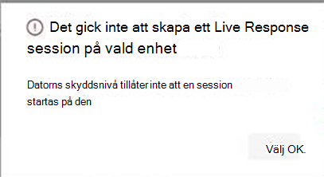

# <a name="investigate-entities-on-devices-using-live-response"></a><span data-ttu-id="f835b-104">Undersök enheter på enheter med live-svar</span><span class="sxs-lookup"><span data-stu-id="f835b-104">Investigate entities on devices using live response</span></span>

[!INCLUDE [Microsoft 365 Defender rebranding](../../includes/microsoft-defender.md)]

<span data-ttu-id="f835b-105">**Gäller för:**</span><span class="sxs-lookup"><span data-stu-id="f835b-105">**Applies to:**</span></span>
- [<span data-ttu-id="f835b-106">Microsoft Defender för Endpoint</span><span class="sxs-lookup"><span data-stu-id="f835b-106">Microsoft Defender for Endpoint</span></span>](https://go.microsoft.com/fwlink/p/?linkid=2154037)
- [<span data-ttu-id="f835b-107">Microsoft 365 Defender</span><span class="sxs-lookup"><span data-stu-id="f835b-107">Microsoft 365 Defender</span></span>](https://go.microsoft.com/fwlink/?linkid=2118804)


> <span data-ttu-id="f835b-108">Vill du använda Defender för Slutpunkt?</span><span class="sxs-lookup"><span data-stu-id="f835b-108">Want to experience Defender for Endpoint?</span></span> [<span data-ttu-id="f835b-109">Registrera dig för en kostnadsfri utvärderingsversion.</span><span class="sxs-lookup"><span data-stu-id="f835b-109">Sign up for a free trial.</span></span>](https://www.microsoft.com/microsoft-365/windows/microsoft-defender-atp?ocid=docs-wdatp-investigateip-abovefoldlink)

<span data-ttu-id="f835b-110">Live Response ger säkerhetsoperationer direktåtkomst till en enhet (kallas även dator) med en fjärrgränssnittsanslutning.</span><span class="sxs-lookup"><span data-stu-id="f835b-110">Live response gives security operations teams instantaneous access to a device (also referred to as a machine) using a remote shell connection.</span></span> <span data-ttu-id="f835b-111">Det ger dig möjlighet att göra djupgående undersökningsarbete och vidta omedelbart åtgärder för att snabbt identifiera hot – i realtid.</span><span class="sxs-lookup"><span data-stu-id="f835b-111">This gives you the power to do in-depth investigative work and take immediate response actions to promptly contain identified threats—in real time.</span></span> 

<span data-ttu-id="f835b-112">Live response är utformat för att förbättra undersökningar genom att göra det möjligt för säkerhetsgruppen att samla in tekniska data, köra skript, skicka misstänkta enheter för analys, åtgärda hot och proaktivt leta efter nya hot.</span><span class="sxs-lookup"><span data-stu-id="f835b-112">Live response is designed to enhance investigations by enabling your security operations team to collect forensic data, run scripts, send suspicious entities for analysis, remediate threats, and proactively hunt for emerging threats.</span></span><br/><br/>

> [!VIDEO https://www.microsoft.com/videoplayer/embed/RE4qLUW]

<span data-ttu-id="f835b-113">Med live-svar kan analytiker göra följande:</span><span class="sxs-lookup"><span data-stu-id="f835b-113">With live response, analysts can do all of the following tasks:</span></span>
- <span data-ttu-id="f835b-114">Kör grundläggande och avancerade kommandon för att göra saker på en enhet.</span><span class="sxs-lookup"><span data-stu-id="f835b-114">Run basic and advanced commands to do investigative work on a device.</span></span>
- <span data-ttu-id="f835b-115">Ladda ned filer som exempel på skadlig programvara och resultat av PowerShell-skript.</span><span class="sxs-lookup"><span data-stu-id="f835b-115">Download files such as malware samples and outcomes of PowerShell scripts.</span></span>
- <span data-ttu-id="f835b-116">Ladda ned filer i bakgrunden (nytt!).</span><span class="sxs-lookup"><span data-stu-id="f835b-116">Download files in the background (new!).</span></span>
- <span data-ttu-id="f835b-117">Ladda upp ett PowerShell-skript eller körbart till biblioteket och kör det på en enhet från klientorganisationsnivå.</span><span class="sxs-lookup"><span data-stu-id="f835b-117">Upload a PowerShell script or executable to the library and run it on a device from a tenant level.</span></span>
- <span data-ttu-id="f835b-118">Vidta eller ångra åtgärder.</span><span class="sxs-lookup"><span data-stu-id="f835b-118">Take or undo remediation actions.</span></span>

## <a name="before-you-begin"></a><span data-ttu-id="f835b-119">Innan du börjar</span><span class="sxs-lookup"><span data-stu-id="f835b-119">Before you begin</span></span>

<span data-ttu-id="f835b-120">Innan du kan starta en session på en enhet kontrollerar du att du uppfyller följande krav:</span><span class="sxs-lookup"><span data-stu-id="f835b-120">Before you can initiate a session on a device, make sure you fulfill the following requirements:</span></span>

- <span data-ttu-id="f835b-121">**Kontrollera att du kör en version av Windows som stöds.**</span><span class="sxs-lookup"><span data-stu-id="f835b-121">**Verify that you're running a supported version of Windows**.</span></span> <br/>
<span data-ttu-id="f835b-122">Enheter måste köra någon av följande versioner av Windows</span><span class="sxs-lookup"><span data-stu-id="f835b-122">Devices must be running one of the following versions of Windows</span></span>

  - <span data-ttu-id="f835b-123">**Windows 10**</span><span class="sxs-lookup"><span data-stu-id="f835b-123">**Windows 10**</span></span>
    - <span data-ttu-id="f835b-124">[Version 1909](https://docs.microsoft.com/windows/whats-new/whats-new-windows-10-version-1909) eller senare</span><span class="sxs-lookup"><span data-stu-id="f835b-124">[Version 1909](https://docs.microsoft.com/windows/whats-new/whats-new-windows-10-version-1909) or later</span></span>  
    - <span data-ttu-id="f835b-125">[Version 1903](https://docs.microsoft.com/windows/whats-new/whats-new-windows-10-version-1903) med [KB4515384](https://support.microsoft.com/en-us/help/4515384/windows-10-update-kb4515384)</span><span class="sxs-lookup"><span data-stu-id="f835b-125">[Version 1903](https://docs.microsoft.com/windows/whats-new/whats-new-windows-10-version-1903) with [KB4515384](https://support.microsoft.com/en-us/help/4515384/windows-10-update-kb4515384)</span></span>
    - <span data-ttu-id="f835b-126">[Version 1809 (RS 5)](https://docs.microsoft.com/windows/whats-new/whats-new-windows-10-version-1809) [med KB4537818](https://support.microsoft.com/help/4537818/windows-10-update-kb4537818)</span><span class="sxs-lookup"><span data-stu-id="f835b-126">[Version 1809 (RS 5)](https://docs.microsoft.com/windows/whats-new/whats-new-windows-10-version-1809) with [with KB4537818](https://support.microsoft.com/help/4537818/windows-10-update-kb4537818)</span></span>
    - <span data-ttu-id="f835b-127">[Version 1803 (RS 4)](https://docs.microsoft.com/windows/whats-new/whats-new-windows-10-version-1803) med [KB4537795](https://support.microsoft.com/help/4537795/windows-10-update-kb4537795)</span><span class="sxs-lookup"><span data-stu-id="f835b-127">[Version 1803 (RS 4)](https://docs.microsoft.com/windows/whats-new/whats-new-windows-10-version-1803) with [KB4537795](https://support.microsoft.com/help/4537795/windows-10-update-kb4537795)</span></span>
    - <span data-ttu-id="f835b-128">[Version 1709 (RS 3)](https://docs.microsoft.com/windows/whats-new/whats-new-windows-10-version-1709) med [KB4537816](https://support.microsoft.com/help/4537816/windows-10-update-kb4537816)</span><span class="sxs-lookup"><span data-stu-id="f835b-128">[Version 1709 (RS 3)](https://docs.microsoft.com/windows/whats-new/whats-new-windows-10-version-1709) with [KB4537816](https://support.microsoft.com/help/4537816/windows-10-update-kb4537816)</span></span>
  
  - <span data-ttu-id="f835b-129">**Windows Server 2019 – endast tillämpligt för offentlig förhandsversion**</span><span class="sxs-lookup"><span data-stu-id="f835b-129">**Windows Server 2019 - Only applicable for Public preview**</span></span>
    - <span data-ttu-id="f835b-130">Version 1903 eller (med [KB4515384](https://support.microsoft.com/en-us/help/4515384/windows-10-update-kb4515384)) senare</span><span class="sxs-lookup"><span data-stu-id="f835b-130">Version 1903 or (with [KB4515384](https://support.microsoft.com/en-us/help/4515384/windows-10-update-kb4515384)) later</span></span> 
    - <span data-ttu-id="f835b-131">Version 1809 (med [KB4537818](https://support.microsoft.com/en-us/help/4537818/windows-10-update-kb4537818))</span><span class="sxs-lookup"><span data-stu-id="f835b-131">Version 1809 (with [KB4537818](https://support.microsoft.com/en-us/help/4537818/windows-10-update-kb4537818))</span></span>

- <span data-ttu-id="f835b-132">**Aktivera livesvar från sidan avancerade inställningar**.</span><span class="sxs-lookup"><span data-stu-id="f835b-132">**Enable live response from the advanced settings page**.</span></span><br>
<span data-ttu-id="f835b-133">Du måste aktivera svarsfunktion på sidan Avancerade [funktioner.](advanced-features.md)</span><span class="sxs-lookup"><span data-stu-id="f835b-133">You'll need to enable the live response capability in the [Advanced features settings](advanced-features.md) page.</span></span>

    >[!NOTE]
    ><span data-ttu-id="f835b-134">Endast användare med administratörsroller för säkerhet och global administration kan redigera de här inställningarna.</span><span class="sxs-lookup"><span data-stu-id="f835b-134">Only users with manage security or global admin roles can edit these settings.</span></span>

- <span data-ttu-id="f835b-135">**Aktivera live-svar för servrar från sidan avancerade inställningar** (rekommenderas).</span><span class="sxs-lookup"><span data-stu-id="f835b-135">**Enable live response for servers from the advanced settings page** (recommended).</span></span><br>

    >[!NOTE]
    ><span data-ttu-id="f835b-136">Endast användare med administratörsroller för säkerhet och global administration kan redigera de här inställningarna.</span><span class="sxs-lookup"><span data-stu-id="f835b-136">Only users with manage security or global admin roles can edit these settings.</span></span>
    
- <span data-ttu-id="f835b-137">**Kontrollera att enheten har en nivå för automatiseringsreparation tilldelad**.</span><span class="sxs-lookup"><span data-stu-id="f835b-137">**Ensure that the device has an Automation Remediation level assigned to it**.</span></span><br>
<span data-ttu-id="f835b-138">Du måste minst aktivera den lägsta åtgärdsnivån för en viss enhetsgrupp.</span><span class="sxs-lookup"><span data-stu-id="f835b-138">You'll need to enable, at least, the minimum Remediation Level for a given Device Group.</span></span> <span data-ttu-id="f835b-139">Annars kommer du inte att kunna upprätta en Live Response-session för en medlem i den gruppen.</span><span class="sxs-lookup"><span data-stu-id="f835b-139">Otherwise you won't be able to establish a Live Response session to a member of that group.</span></span>

    <span data-ttu-id="f835b-140">Du får följande felmeddelande:</span><span class="sxs-lookup"><span data-stu-id="f835b-140">You'll receive the following error:</span></span>

    

- <span data-ttu-id="f835b-142">**Aktivera körning av skript som inte tilldelats med Live Response** (valfritt).</span><span class="sxs-lookup"><span data-stu-id="f835b-142">**Enable live response unsigned script execution** (optional).</span></span> <br>

    >[!WARNING]
    ><span data-ttu-id="f835b-143">Om du tillåter användning av osignerade skript kan din exponering öka för hot.</span><span class="sxs-lookup"><span data-stu-id="f835b-143">Allowing the use of unsigned scripts may increase your exposure to threats.</span></span>
 
  <span data-ttu-id="f835b-144">Vi rekommenderar inte att du kör osignerade skript eftersom det kan öka exponeringen mot hot.</span><span class="sxs-lookup"><span data-stu-id="f835b-144">Running unsigned scripts is not recommended as it can increase your exposure to threats.</span></span> <span data-ttu-id="f835b-145">Om du måste använda dem måste du aktivera inställningen på sidan [Avancerade inställningar.](advanced-features.md)</span><span class="sxs-lookup"><span data-stu-id="f835b-145">If you must use them however, you'll need to enable the setting in the [Advanced features settings](advanced-features.md) page.</span></span>
    
- <span data-ttu-id="f835b-146">**Kontrollera att du har rätt behörigheter.**</span><span class="sxs-lookup"><span data-stu-id="f835b-146">**Ensure that you have the appropriate permissions**.</span></span><br>
    <span data-ttu-id="f835b-147">Endast användare som har etablerats med rätt behörighet kan starta en session.</span><span class="sxs-lookup"><span data-stu-id="f835b-147">Only users who have been provisioned with the appropriate permissions can initiate a session.</span></span> <span data-ttu-id="f835b-148">Mer information om rolltilldelningar finns i [Skapa och hantera roller.](user-roles.md)</span><span class="sxs-lookup"><span data-stu-id="f835b-148">For more information on role assignments, see [Create and manage roles](user-roles.md).</span></span> 

    > [!IMPORTANT]
    > <span data-ttu-id="f835b-149">Alternativet för att ladda upp en fil till biblioteket är bara tillgängligt för dem med rätt behörighet för RBAC.</span><span class="sxs-lookup"><span data-stu-id="f835b-149">The option to upload a file to the library is only available to those with the appropriate RBAC permissions.</span></span> <span data-ttu-id="f835b-150">Knappen är nedtonad för användare som endast har delegerade behörigheter.</span><span class="sxs-lookup"><span data-stu-id="f835b-150">The button is greyed out for users with only delegated permissions.</span></span>

    <span data-ttu-id="f835b-151">Beroende på vilken roll du har beviljats kan du köra grundläggande eller avancerade kommandon för livesvar.</span><span class="sxs-lookup"><span data-stu-id="f835b-151">Depending on the role that's been granted to you, you can run basic or advanced live response commands.</span></span> <span data-ttu-id="f835b-152">Användarbehörigheter styrs av den anpassade rollen RBAC.</span><span class="sxs-lookup"><span data-stu-id="f835b-152">Users permissions are controlled by RBAC custom role.</span></span> 

## <a name="live-response-dashboard-overview"></a><span data-ttu-id="f835b-153">Översikt över instrumentpanelen för livesvar</span><span class="sxs-lookup"><span data-stu-id="f835b-153">Live response dashboard overview</span></span>
<span data-ttu-id="f835b-154">När du startar en svarssession på en enhet öppnas en instrumentpanel.</span><span class="sxs-lookup"><span data-stu-id="f835b-154">When you initiate a live response session on a device, a dashboard opens.</span></span> <span data-ttu-id="f835b-155">På instrumentpanelen finns information om sessionen, till exempel följande:</span><span class="sxs-lookup"><span data-stu-id="f835b-155">The dashboard provides information about the session such as the following:</span></span> 

- <span data-ttu-id="f835b-156">Vem skapade sessionen</span><span class="sxs-lookup"><span data-stu-id="f835b-156">Who created the session</span></span>
- <span data-ttu-id="f835b-157">När sessionen startades</span><span class="sxs-lookup"><span data-stu-id="f835b-157">When the session started</span></span>
- <span data-ttu-id="f835b-158">Sessionens varaktighet</span><span class="sxs-lookup"><span data-stu-id="f835b-158">The duration of the session</span></span>

<span data-ttu-id="f835b-159">Instrumentpanelen ger dig också tillgång till:</span><span class="sxs-lookup"><span data-stu-id="f835b-159">The dashboard also gives you access to:</span></span>
- <span data-ttu-id="f835b-160">Koppla från session</span><span class="sxs-lookup"><span data-stu-id="f835b-160">Disconnect session</span></span>
- <span data-ttu-id="f835b-161">Ladda upp filer till biblioteket</span><span class="sxs-lookup"><span data-stu-id="f835b-161">Upload files to the library</span></span> 
- <span data-ttu-id="f835b-162">Kommandokonsol</span><span class="sxs-lookup"><span data-stu-id="f835b-162">Command console</span></span>
- <span data-ttu-id="f835b-163">Kommandologg</span><span class="sxs-lookup"><span data-stu-id="f835b-163">Command log</span></span>


## <a name="initiate-a-live-response-session-on-a-device"></a><span data-ttu-id="f835b-164">Starta en svarssession i live på en enhet</span><span class="sxs-lookup"><span data-stu-id="f835b-164">Initiate a live response session on a device</span></span> 

1. <span data-ttu-id="f835b-165">Logga in på Microsoft Defender Säkerhetscenter.</span><span class="sxs-lookup"><span data-stu-id="f835b-165">Sign in to Microsoft Defender Security Center.</span></span>

2. <span data-ttu-id="f835b-166">Gå till sidan enhetslista och välj en enhet du vill undersöka.</span><span class="sxs-lookup"><span data-stu-id="f835b-166">Navigate to the devices list page and select a device to investigate.</span></span> <span data-ttu-id="f835b-167">Sidan Enheter öppnas.</span><span class="sxs-lookup"><span data-stu-id="f835b-167">The devices page opens.</span></span>

3. <span data-ttu-id="f835b-168">Starta livesvarssessionen genom att **välja Initiera svarssession i direktsändning.**</span><span class="sxs-lookup"><span data-stu-id="f835b-168">Launch the live response session by selecting **Initiate live response session**.</span></span> <span data-ttu-id="f835b-169">En kommandokonsol visas.</span><span class="sxs-lookup"><span data-stu-id="f835b-169">A command console is displayed.</span></span> <span data-ttu-id="f835b-170">Vänta medan sessionen ansluts till enheten.</span><span class="sxs-lookup"><span data-stu-id="f835b-170">Wait while the session connects to the device.</span></span>

4. <span data-ttu-id="f835b-171">Använd de inbyggda kommandona för att göra det här.</span><span class="sxs-lookup"><span data-stu-id="f835b-171">Use the built-in commands to do investigative work.</span></span> <span data-ttu-id="f835b-172">Mer information finns i [Live response-kommandon](#live-response-commands).</span><span class="sxs-lookup"><span data-stu-id="f835b-172">For more information, see [Live response commands](#live-response-commands).</span></span>

5. <span data-ttu-id="f835b-173">När du har slutfört din undersökning väljer **du Koppla från session** och sedan **Bekräfta**.</span><span class="sxs-lookup"><span data-stu-id="f835b-173">After completing your investigation, select **Disconnect session**, then select **Confirm**.</span></span>

## <a name="live-response-commands"></a><span data-ttu-id="f835b-174">Kommandon för livesvar</span><span class="sxs-lookup"><span data-stu-id="f835b-174">Live response commands</span></span>

<span data-ttu-id="f835b-175">Beroende på vilken roll du har beviljats kan du köra grundläggande eller avancerade kommandon för livesvar.</span><span class="sxs-lookup"><span data-stu-id="f835b-175">Depending on the role that's been granted to you, you can run basic or advanced live response commands.</span></span> <span data-ttu-id="f835b-176">Användarbehörigheter styrs av anpassade rollerna i RBAC.</span><span class="sxs-lookup"><span data-stu-id="f835b-176">User permissions are controlled by RBAC custom roles.</span></span> <span data-ttu-id="f835b-177">Mer information om rolltilldelningar finns i [Skapa och hantera roller.](user-roles.md)</span><span class="sxs-lookup"><span data-stu-id="f835b-177">For more information on role assignments, see [Create and manage roles](user-roles.md).</span></span> 


>[!NOTE]
><span data-ttu-id="f835b-178">Live response är ett molnbaserat interaktivt gränssnitt som exempelvis kan specifika kommandogränssnitt variera vad gäller svarstider beroende på nätverkskvalitet och systembelastning mellan slutanvändaren och målenheten.</span><span class="sxs-lookup"><span data-stu-id="f835b-178">Live response is a cloud-based interactive shell, as such, specific command experience may vary in response time depending on network quality and system load between the end user and the target device.</span></span>

### <a name="basic-commands"></a><span data-ttu-id="f835b-179">Grundläggande kommandon</span><span class="sxs-lookup"><span data-stu-id="f835b-179">Basic commands</span></span>

<span data-ttu-id="f835b-180">Följande kommandon är tillgängliga för användarroller som ges möjlighet att köra **grundläggande kommandon** för livesvar.</span><span class="sxs-lookup"><span data-stu-id="f835b-180">The following commands are available for user roles that are granted the ability to run **basic** live response commands.</span></span> <span data-ttu-id="f835b-181">Mer information om rolltilldelningar finns i [Skapa och hantera roller.](user-roles.md)</span><span class="sxs-lookup"><span data-stu-id="f835b-181">For more information on role assignments, see [Create and manage roles](user-roles.md).</span></span> 

| <span data-ttu-id="f835b-182">Kommando</span><span class="sxs-lookup"><span data-stu-id="f835b-182">Command</span></span> | <span data-ttu-id="f835b-183">Beskrivning</span><span class="sxs-lookup"><span data-stu-id="f835b-183">Description</span></span> |
|---|---|--- |
|`cd` | <span data-ttu-id="f835b-184">Ändrar den aktuella katalogen.</span><span class="sxs-lookup"><span data-stu-id="f835b-184">Changes the current directory.</span></span> | 
|`cls` | <span data-ttu-id="f835b-185">Tar bort konsolskärmen.</span><span class="sxs-lookup"><span data-stu-id="f835b-185">Clears the console screen.</span></span>  |
|`connect` | <span data-ttu-id="f835b-186">Startar en svarssession i direktsändning på enheten.</span><span class="sxs-lookup"><span data-stu-id="f835b-186">Initiates a live response session to the device.</span></span> |
|`connections` | <span data-ttu-id="f835b-187">Visar alla aktiva anslutningar.</span><span class="sxs-lookup"><span data-stu-id="f835b-187">Shows all the active connections.</span></span> |
|`dir` | <span data-ttu-id="f835b-188">Visar en lista med filer och undermappar i en katalog.</span><span class="sxs-lookup"><span data-stu-id="f835b-188">Shows a list of files and subdirectories in a directory.</span></span> |
|`download <file_path> &` | <span data-ttu-id="f835b-189">En fil laddas ned i bakgrunden.</span><span class="sxs-lookup"><span data-stu-id="f835b-189">Downloads a file in the background.</span></span> |
|`drivers` |  <span data-ttu-id="f835b-190">Visar alla drivrutiner som är installerade på enheten.</span><span class="sxs-lookup"><span data-stu-id="f835b-190">Shows all drivers installed on the device.</span></span> |
|`fg <command ID>` | <span data-ttu-id="f835b-191">Placera det angivna jobbet i förgrunden, vilket gör det till aktuellt jobb.</span><span class="sxs-lookup"><span data-stu-id="f835b-191">Place the specified job in the foreground in the foreground, making it the current job.</span></span> <br> <span data-ttu-id="f835b-192">Obs! FG tar ett kommando-ID som är tillgängligt från jobb, inte från PID</span><span class="sxs-lookup"><span data-stu-id="f835b-192">NOTE: fg takes a “command ID” available from jobs, not a PID</span></span> |
|`fileinfo` | <span data-ttu-id="f835b-193">Hämta information om en fil.</span><span class="sxs-lookup"><span data-stu-id="f835b-193">Get information about a file.</span></span> |
|`findfile` | <span data-ttu-id="f835b-194">Söker efter ett namn på enheten.</span><span class="sxs-lookup"><span data-stu-id="f835b-194">Locates files by a given name on the device.</span></span> |
|`getfile <file_path>` | <span data-ttu-id="f835b-195">En fil laddas ned.</span><span class="sxs-lookup"><span data-stu-id="f835b-195">Downloads a file.</span></span> |
|`help` | <span data-ttu-id="f835b-196">Innehåller hjälpinformation för livesvarskommandon.</span><span class="sxs-lookup"><span data-stu-id="f835b-196">Provides help information for live response commands.</span></span> |
|`jobs` | <span data-ttu-id="f835b-197">Visar jobb som körs, deras ID och status.</span><span class="sxs-lookup"><span data-stu-id="f835b-197">Shows currently running jobs, their ID and status.</span></span> |
|`persistence` | <span data-ttu-id="f835b-198">Visar alla kända beständighetsmetoder på enheten.</span><span class="sxs-lookup"><span data-stu-id="f835b-198">Shows all known persistence methods on the device.</span></span> |
|`processes` | <span data-ttu-id="f835b-199">Visar alla processer som körs på enheten.</span><span class="sxs-lookup"><span data-stu-id="f835b-199">Shows all processes running on the device.</span></span> |
|`registry` | <span data-ttu-id="f835b-200">Visar registervärden.</span><span class="sxs-lookup"><span data-stu-id="f835b-200">Shows registry values.</span></span> |
|`scheduledtasks` | <span data-ttu-id="f835b-201">Visar alla schemalagda uppgifter på enheten.</span><span class="sxs-lookup"><span data-stu-id="f835b-201">Shows all scheduled tasks on the device.</span></span> |
|`services` | <span data-ttu-id="f835b-202">Visar alla tjänster på enheten.</span><span class="sxs-lookup"><span data-stu-id="f835b-202">Shows all services on the device.</span></span> |
|`trace` | <span data-ttu-id="f835b-203">Ställer in terminalens loggningsläge för felsökning.</span><span class="sxs-lookup"><span data-stu-id="f835b-203">Sets the terminal's logging mode to debug.</span></span> |

### <a name="advanced-commands"></a><span data-ttu-id="f835b-204">Avancerade kommandon</span><span class="sxs-lookup"><span data-stu-id="f835b-204">Advanced commands</span></span>
<span data-ttu-id="f835b-205">Följande kommandon är tillgängliga för användarroller som ges möjlighet att köra **avancerade svarskommandon.**</span><span class="sxs-lookup"><span data-stu-id="f835b-205">The following commands are available for user roles that are granted the ability to run **advanced** live response commands.</span></span> <span data-ttu-id="f835b-206">Mer information om rolltilldelningar finns i [Skapa och hantera roller.](user-roles.md)</span><span class="sxs-lookup"><span data-stu-id="f835b-206">For more information on role assignments, see [Create and manage roles](user-roles.md).</span></span> 

| <span data-ttu-id="f835b-207">Kommando</span><span class="sxs-lookup"><span data-stu-id="f835b-207">Command</span></span> | <span data-ttu-id="f835b-208">Beskrivning</span><span class="sxs-lookup"><span data-stu-id="f835b-208">Description</span></span> |
|---|---|
| `analyze` | <span data-ttu-id="f835b-209">Analyserar enheten med olika informationsmotorer för att nå ett omdöme.</span><span class="sxs-lookup"><span data-stu-id="f835b-209">Analyses the entity with various incrimination engines to reach a verdict.</span></span> |
| `run` | <span data-ttu-id="f835b-210">Kör ett PowerShell-skript från biblioteket på enheten.</span><span class="sxs-lookup"><span data-stu-id="f835b-210">Runs a PowerShell script from the library on the device.</span></span> |
| `library` | <span data-ttu-id="f835b-211">Visar filer som har laddats upp till livesvarsbiblioteket.</span><span class="sxs-lookup"><span data-stu-id="f835b-211">Lists files that were uploaded to the live response library.</span></span> |
| `putfile` | <span data-ttu-id="f835b-212">Lägger till en fil från biblioteket till enheten.</span><span class="sxs-lookup"><span data-stu-id="f835b-212">Puts a file from the library to the device.</span></span> <span data-ttu-id="f835b-213">Filer sparas i en arbetsmapp och tas bort när enheten startas om som standard.</span><span class="sxs-lookup"><span data-stu-id="f835b-213">Files are saved in a working folder and are deleted when the device restarts by default.</span></span> |
| `remediate` | <span data-ttu-id="f835b-214">Åtgärdar en enhet på enheten.</span><span class="sxs-lookup"><span data-stu-id="f835b-214">Remediates an entity on the device.</span></span> <span data-ttu-id="f835b-215">Åtgärdsåtgärden varierar beroende på entitetstyp:</span><span class="sxs-lookup"><span data-stu-id="f835b-215">The remediation action will vary depending on the entity type:</span></span><br><span data-ttu-id="f835b-216">- Arkiv: ta bort</span><span class="sxs-lookup"><span data-stu-id="f835b-216">- File: delete</span></span><br><span data-ttu-id="f835b-217">- Process: stopp, ta bort bildfil</span><span class="sxs-lookup"><span data-stu-id="f835b-217">- Process: stop, delete image file</span></span><br><span data-ttu-id="f835b-218">- Tjänst: stoppa, ta bort bildfil</span><span class="sxs-lookup"><span data-stu-id="f835b-218">- Service: stop, delete image file</span></span><br><span data-ttu-id="f835b-219">- Registerpost: ta bort</span><span class="sxs-lookup"><span data-stu-id="f835b-219">- Registry entry: delete</span></span><br><span data-ttu-id="f835b-220">- Schemalagd aktivitet: ta bort</span><span class="sxs-lookup"><span data-stu-id="f835b-220">- Scheduled task: remove</span></span><br><span data-ttu-id="f835b-221">- Mappobjekt vid start: ta bort fil</span><span class="sxs-lookup"><span data-stu-id="f835b-221">- Startup folder item: delete file</span></span> <br> <span data-ttu-id="f835b-222">Obs! Det här kommandot har ett kommando som krävs.</span><span class="sxs-lookup"><span data-stu-id="f835b-222">NOTE: This command has a prerequisite command.</span></span> <span data-ttu-id="f835b-223">Du kan använda kommandot `-auto` tillsammans med för att automatiskt köra kommandot som `remediate` krävs.</span><span class="sxs-lookup"><span data-stu-id="f835b-223">You can use the `-auto` command in conjunction with `remediate` to automatically run the prerequisite command.</span></span> 
|`undo` | <span data-ttu-id="f835b-224">Återställer en enhet som har åtgärdats.</span><span class="sxs-lookup"><span data-stu-id="f835b-224">Restores an entity that was remediated.</span></span> |


## <a name="use-live-response-commands"></a><span data-ttu-id="f835b-225">Använda kommandon för livesvar</span><span class="sxs-lookup"><span data-stu-id="f835b-225">Use live response commands</span></span>

<span data-ttu-id="f835b-226">De kommandon som du kan använda i konsolen följer liknande principer som [Windows-kommandon.](https://docs.microsoft.com/windows-server/administration/windows-commands/windows-commands#BKMK_c)</span><span class="sxs-lookup"><span data-stu-id="f835b-226">The commands that you can use in the console follow similar principles as [Windows Commands](https://docs.microsoft.com/windows-server/administration/windows-commands/windows-commands#BKMK_c).</span></span>

<span data-ttu-id="f835b-227">Med avancerade kommandon får du en robustare uppsättning åtgärder som gör att du kan vidta mer kraftfulla åtgärder, till exempel ladda ned och ladda upp en fil, köra skript på enheten och vidta åtgärder för en enhet.</span><span class="sxs-lookup"><span data-stu-id="f835b-227">The advanced commands offer a more robust set of actions that allow you to take more powerful actions such as download and upload a file, run scripts on the device, and take remediation actions on an entity.</span></span>

### <a name="get-a-file-from-the-device"></a><span data-ttu-id="f835b-228">Hämta en fil från enheten</span><span class="sxs-lookup"><span data-stu-id="f835b-228">Get a file from the device</span></span>

<span data-ttu-id="f835b-229">För scenarier när du vill hämta en fil från en enhet som du undersöker kan du använda `getfile` kommandot.</span><span class="sxs-lookup"><span data-stu-id="f835b-229">For scenarios when you'd like get a file from a device you're investigating, you can use the `getfile` command.</span></span> <span data-ttu-id="f835b-230">På så sätt kan du spara filen från enheten för ytterligare undersökning.</span><span class="sxs-lookup"><span data-stu-id="f835b-230">This allows you to save the file from the device for further investigation.</span></span>

>[!NOTE]
><span data-ttu-id="f835b-231">Följande filstorleksbegränsningar gäller:</span><span class="sxs-lookup"><span data-stu-id="f835b-231">The following file size limits apply:</span></span>
>- <span data-ttu-id="f835b-232">`getfile` gräns: 3 GB</span><span class="sxs-lookup"><span data-stu-id="f835b-232">`getfile` limit: 3 GB</span></span>
>- <span data-ttu-id="f835b-233">`fileinfo` gräns: 10 GB</span><span class="sxs-lookup"><span data-stu-id="f835b-233">`fileinfo` limit: 10 GB</span></span>
>- <span data-ttu-id="f835b-234">`library` gräns: 250 MB</span><span class="sxs-lookup"><span data-stu-id="f835b-234">`library` limit: 250 MB</span></span>

### <a name="download-a-file-in-the-background"></a><span data-ttu-id="f835b-235">Ladda ned en fil i bakgrunden</span><span class="sxs-lookup"><span data-stu-id="f835b-235">Download a file in the background</span></span>

<span data-ttu-id="f835b-236">Filerna kan nu laddas ned i bakgrunden så att teamet med säkerhetsåtgärder kan fortsätta att undersöka en påverkade enhet.</span><span class="sxs-lookup"><span data-stu-id="f835b-236">To enable your security operations team to continue investigating an impacted device, files can now be downloaded in the background.</span></span>

- <span data-ttu-id="f835b-237">Om du vill ladda ned en fil i bakgrunden skriver du . `download <file_path> &`</span><span class="sxs-lookup"><span data-stu-id="f835b-237">To download a file in the background, in the live response command console, type `download <file_path> &`.</span></span>
- <span data-ttu-id="f835b-238">Om du väntar på att en fil ska laddas ned kan du flytta den till bakgrunden genom att använda Ctrl + Z.</span><span class="sxs-lookup"><span data-stu-id="f835b-238">If you are waiting for a file to be downloaded, you can move it to the background by using Ctrl + Z.</span></span>
- <span data-ttu-id="f835b-239">Om du vill föra in en filnedladdning i förgrunden skriver du `fg <command_id>` .</span><span class="sxs-lookup"><span data-stu-id="f835b-239">To bring a file download to the foreground, in the live response command console, type `fg <command_id>`.</span></span>

<span data-ttu-id="f835b-240">Här är några exempel:</span><span class="sxs-lookup"><span data-stu-id="f835b-240">Here are some examples:</span></span>


|<span data-ttu-id="f835b-241">Kommando</span><span class="sxs-lookup"><span data-stu-id="f835b-241">Command</span></span>  |<span data-ttu-id="f835b-242">Vad den gör</span><span class="sxs-lookup"><span data-stu-id="f835b-242">What it does</span></span>  |
|---------|---------|
|`Download "C:\windows\some_file.exe" &`     |<span data-ttu-id="f835b-243">Börjar ladda ned en fil med *namnetsome_file.exe* fil i bakgrunden.</span><span class="sxs-lookup"><span data-stu-id="f835b-243">Starts downloading a file named *some_file.exe* in the background.</span></span>         |
|`fg 1234`     |<span data-ttu-id="f835b-244">Returnerar en nedladdning med kommando-ID *1234 till* förgrunden.</span><span class="sxs-lookup"><span data-stu-id="f835b-244">Returns a download with command ID *1234* to the foreground.</span></span>         |


### <a name="put-a-file-in-the-library"></a><span data-ttu-id="f835b-245">Placera en fil i biblioteket</span><span class="sxs-lookup"><span data-stu-id="f835b-245">Put a file in the library</span></span>

<span data-ttu-id="f835b-246">Live response har ett bibliotek där du kan placera filer i.</span><span class="sxs-lookup"><span data-stu-id="f835b-246">Live response has a library where you can put files into.</span></span> <span data-ttu-id="f835b-247">Biblioteket lagrar filer (till exempel skript) som kan köras i en svarssession i direktsändning på klientorganisationsnivå.</span><span class="sxs-lookup"><span data-stu-id="f835b-247">The library stores files (such as scripts) that can be run in a live response session at the tenant level.</span></span>

<span data-ttu-id="f835b-248">Med Live Response kan PowerShell-skript köras, men du måste först placera filerna i biblioteket innan du kan köra dem.</span><span class="sxs-lookup"><span data-stu-id="f835b-248">Live response allows PowerShell scripts to run, however you must first put the files into the library before you can run them.</span></span> 

<span data-ttu-id="f835b-249">Du kan ha en samling PowerShell-skript som kan köras på enheter som du startar svarssessioner med i direktsändning.</span><span class="sxs-lookup"><span data-stu-id="f835b-249">You can have a collection of PowerShell scripts that can run on devices that you initiate live response sessions with.</span></span> 

#### <a name="to-upload-a-file-in-the-library"></a><span data-ttu-id="f835b-250">Ladda upp en fil i biblioteket</span><span class="sxs-lookup"><span data-stu-id="f835b-250">To upload a file in the library</span></span>

1. <span data-ttu-id="f835b-251">Klicka **på Ladda upp fil till bibliotek**.</span><span class="sxs-lookup"><span data-stu-id="f835b-251">Click **Upload file to library**.</span></span> 

2. <span data-ttu-id="f835b-252">Klicka **på** Bläddra och markera filen.</span><span class="sxs-lookup"><span data-stu-id="f835b-252">Click **Browse** and select the file.</span></span>

3. <span data-ttu-id="f835b-253">Ge en kort beskrivning.</span><span class="sxs-lookup"><span data-stu-id="f835b-253">Provide a brief description.</span></span>

4. <span data-ttu-id="f835b-254">Ange om du vill skriva över en fil med samma namn.</span><span class="sxs-lookup"><span data-stu-id="f835b-254">Specify if you'd like to overwrite a file with the same name.</span></span>

5. <span data-ttu-id="f835b-255">Om du vill vara det ska du veta vilka parametrar som krävs för skriptet, markera kryssrutan skriptparametrar.</span><span class="sxs-lookup"><span data-stu-id="f835b-255">If you'd like to be,  know what parameters are needed for the script, select the script parameters check box.</span></span> <span data-ttu-id="f835b-256">I textfältet anger du ett exempel och en beskrivning.</span><span class="sxs-lookup"><span data-stu-id="f835b-256">In the text field, enter an example and a description.</span></span>

6. <span data-ttu-id="f835b-257">Klicka **på Bekräfta.**</span><span class="sxs-lookup"><span data-stu-id="f835b-257">Click **Confirm**.</span></span> 

7. <span data-ttu-id="f835b-258">(Valfritt) Kör kommandot för att verifiera att filen har laddats upp till `library` biblioteket.</span><span class="sxs-lookup"><span data-stu-id="f835b-258">(Optional) To verify that the file was uploaded to the library, run the `library` command.</span></span>


### <a name="cancel-a-command"></a><span data-ttu-id="f835b-259">Avbryta ett kommando</span><span class="sxs-lookup"><span data-stu-id="f835b-259">Cancel a command</span></span>
<span data-ttu-id="f835b-260">När som helst under en session kan du avbryta ett kommando genom att trycka på CTRL + C.</span><span class="sxs-lookup"><span data-stu-id="f835b-260">Anytime during a session, you can cancel a command by pressing CTRL + C.</span></span>  

>[!WARNING]
><span data-ttu-id="f835b-261">Om du använder den här genvägen stoppas inte kommandot på agentsidan.</span><span class="sxs-lookup"><span data-stu-id="f835b-261">Using this shortcut will not stop the command in the agent side.</span></span> <span data-ttu-id="f835b-262">Det avbryter bara kommandot i portalen.</span><span class="sxs-lookup"><span data-stu-id="f835b-262">It will only cancel the command in the portal.</span></span> <span data-ttu-id="f835b-263">Så om du ändrar åtgärder som "åtgärd" kan det fortsätta medan kommandot avbryts.</span><span class="sxs-lookup"><span data-stu-id="f835b-263">So, changing operations such as "remediate" may continue, while the command is canceled.</span></span> 

### <a name="automatically-run-prerequisite-commands"></a><span data-ttu-id="f835b-264">Köra nödvändiga kommandon automatiskt</span><span class="sxs-lookup"><span data-stu-id="f835b-264">Automatically run prerequisite commands</span></span>

<span data-ttu-id="f835b-265">Vissa kommandon har nödvändiga kommandon för att köras.</span><span class="sxs-lookup"><span data-stu-id="f835b-265">Some commands have prerequisite commands to run.</span></span> <span data-ttu-id="f835b-266">Om du inte kör det nödvändiga kommandot får du ett felmeddelande.</span><span class="sxs-lookup"><span data-stu-id="f835b-266">If you don't run the prerequisite command, you'll get an error.</span></span> <span data-ttu-id="f835b-267">Om du till exempel kör `download` kommandot utan `fileinfo` returneras ett fel.</span><span class="sxs-lookup"><span data-stu-id="f835b-267">For example, running the `download` command without `fileinfo` will return an error.</span></span>

<span data-ttu-id="f835b-268">Du kan använda flagga automatiskt för att automatiskt köra nödvändiga kommandon, till exempel:</span><span class="sxs-lookup"><span data-stu-id="f835b-268">You can use the auto flag to automatically run prerequisite commands, for example:</span></span>

```console
getfile c:\Users\user\Desktop\work.txt -auto
```

## <a name="run-a-powershell-script"></a><span data-ttu-id="f835b-269">Köra ett PowerShell-skript</span><span class="sxs-lookup"><span data-stu-id="f835b-269">Run a PowerShell script</span></span> 

<span data-ttu-id="f835b-270">Innan du kan köra ett PowerShell-skript måste du först ladda upp det till biblioteket.</span><span class="sxs-lookup"><span data-stu-id="f835b-270">Before you can run a PowerShell script, you must first upload it to the library.</span></span> 

<span data-ttu-id="f835b-271">När skriptet har laddats upp till biblioteket använder du `run` kommandot för att köra skriptet.</span><span class="sxs-lookup"><span data-stu-id="f835b-271">After uploading the script to the library, use the `run` command to run the script.</span></span>

<span data-ttu-id="f835b-272">Om du tänker använda ett osignerat skript i sessionen måste du aktivera inställningen på sidan [Avancerade inställningar för](advanced-features.md) funktioner.</span><span class="sxs-lookup"><span data-stu-id="f835b-272">If you plan to use an unsigned script in the session, you'll need to enable the setting in the [Advanced features settings](advanced-features.md) page.</span></span>

>[!WARNING]
><span data-ttu-id="f835b-273">Om du tillåter användning av osignerade skript kan din exponering öka för hot.</span><span class="sxs-lookup"><span data-stu-id="f835b-273">Allowing the use of unsigned scripts may increase your exposure to threats.</span></span>

## <a name="apply-command-parameters"></a><span data-ttu-id="f835b-274">Använda kommandoparametrar</span><span class="sxs-lookup"><span data-stu-id="f835b-274">Apply command parameters</span></span>

- <span data-ttu-id="f835b-275">Läs konsolhjälpen om du vill lära dig mer om kommandoparametrar.</span><span class="sxs-lookup"><span data-stu-id="f835b-275">View the console help to learn about command parameters.</span></span> <span data-ttu-id="f835b-276">Om du vill lära dig mer om ett enskilt kommando kör du:</span><span class="sxs-lookup"><span data-stu-id="f835b-276">To learn about an individual command, run:</span></span>
 
    `help <command name>`

- <span data-ttu-id="f835b-277">Observera att parametrar hanteras utifrån en fast ordning när du tillämpar parametrar på kommandon:</span><span class="sxs-lookup"><span data-stu-id="f835b-277">When applying parameters to commands, note that parameters are handled based on a fixed order:</span></span>
 
    `<command name> param1 param2` 

- <span data-ttu-id="f835b-278">När du anger parametrar utanför den fasta ordningen ska du ange namnet på parametern med ett bindestreck innan du anger värdet:</span><span class="sxs-lookup"><span data-stu-id="f835b-278">When specifying parameters outside of the fixed order, specify the name of the parameter with a hyphen before providing the value:</span></span>
 
    `<command name> -param2_name param2`

- <span data-ttu-id="f835b-279">När du använder kommandon som har nödvändiga kommandon kan du använda flaggor:</span><span class="sxs-lookup"><span data-stu-id="f835b-279">When using commands that have prerequisite commands, you can use flags:</span></span>

    <span data-ttu-id="f835b-280">`<command name> -type file -id <file path> - auto` eller `remediate file <file path> - auto` .</span><span class="sxs-lookup"><span data-stu-id="f835b-280">`<command name> -type file -id <file path> - auto` or `remediate file <file path> - auto`.</span></span>

## <a name="supported-output-types"></a><span data-ttu-id="f835b-281">Utdatatyper som stöds</span><span class="sxs-lookup"><span data-stu-id="f835b-281">Supported output types</span></span>

<span data-ttu-id="f835b-282">Live Response har stöd för utdatatyper i tabell och JSON-format.</span><span class="sxs-lookup"><span data-stu-id="f835b-282">Live response supports table and JSON format output types.</span></span> <span data-ttu-id="f835b-283">För varje kommando finns det ett standardbeteende för utdata.</span><span class="sxs-lookup"><span data-stu-id="f835b-283">For each command, there's a default output behavior.</span></span> <span data-ttu-id="f835b-284">Du kan ändra utdata i det valda utdataformatet med följande kommandon:</span><span class="sxs-lookup"><span data-stu-id="f835b-284">You can modify the output in your preferred output format using the following commands:</span></span>

- `-output json`
- `-output table`

>[!NOTE]
><span data-ttu-id="f835b-285">Färre fält visas i tabellformat på grund av det begränsade utrymmet.</span><span class="sxs-lookup"><span data-stu-id="f835b-285">Fewer fields are shown in table format due to the limited space.</span></span> <span data-ttu-id="f835b-286">Om du vill se mer information i resultatet kan du använda JSON-utdatakommandot så att mer information visas.</span><span class="sxs-lookup"><span data-stu-id="f835b-286">To see more details in the output, you can use the JSON output command so that more details are shown.</span></span>

## <a name="supported-output-pipes"></a><span data-ttu-id="f835b-287">Utdatarör som stöds</span><span class="sxs-lookup"><span data-stu-id="f835b-287">Supported output pipes</span></span>

<span data-ttu-id="f835b-288">Live Response har stöd för utdata piping till CLI och fil.</span><span class="sxs-lookup"><span data-stu-id="f835b-288">Live response supports output piping to CLI and file.</span></span> <span data-ttu-id="f835b-289">CLI är standardbeteendet för utdata.</span><span class="sxs-lookup"><span data-stu-id="f835b-289">CLI is the default output behavior.</span></span> <span data-ttu-id="f835b-290">Du kan pipa utdata till en fil med följande kommando: [kommando] > [filnamn].txt.</span><span class="sxs-lookup"><span data-stu-id="f835b-290">You can pipe the output to a file using the following command: [command] > [filename].txt.</span></span>  

<span data-ttu-id="f835b-291">Exempel:</span><span class="sxs-lookup"><span data-stu-id="f835b-291">Example:</span></span>

```console
processes > output.txt
```

## <a name="view-the-command-log"></a><span data-ttu-id="f835b-292">Visa kommandologgen</span><span class="sxs-lookup"><span data-stu-id="f835b-292">View the command log</span></span>

<span data-ttu-id="f835b-293">Välj fliken **Kommandologg** för att se de kommandon som används på enheten under en session.</span><span class="sxs-lookup"><span data-stu-id="f835b-293">Select the **Command log** tab to see the commands used on the device during a session.</span></span> <span data-ttu-id="f835b-294">Varje kommando spåras med fullständig information som:</span><span class="sxs-lookup"><span data-stu-id="f835b-294">Each command is tracked with full details such as:</span></span>
- <span data-ttu-id="f835b-295">ID</span><span class="sxs-lookup"><span data-stu-id="f835b-295">ID</span></span>
- <span data-ttu-id="f835b-296">Kommandorad</span><span class="sxs-lookup"><span data-stu-id="f835b-296">Command line</span></span>
- <span data-ttu-id="f835b-297">Varaktighet</span><span class="sxs-lookup"><span data-stu-id="f835b-297">Duration</span></span>
- <span data-ttu-id="f835b-298">Status och inmatnings- eller utdatas sidofält</span><span class="sxs-lookup"><span data-stu-id="f835b-298">Status and input or output side bar</span></span>

## <a name="limitations"></a><span data-ttu-id="f835b-299">Begränsningar</span><span class="sxs-lookup"><span data-stu-id="f835b-299">Limitations</span></span>

- <span data-ttu-id="f835b-300">Livesvarssessioner är begränsade till 25 livesvarssessioner åt gången.</span><span class="sxs-lookup"><span data-stu-id="f835b-300">Live response sessions are limited to 25 live response sessions at a time.</span></span>
- <span data-ttu-id="f835b-301">Värdet för inaktiv timeout för livesvarssession är 30 minuter.</span><span class="sxs-lookup"><span data-stu-id="f835b-301">Live response session inactive timeout value is 30 minutes.</span></span> 
- <span data-ttu-id="f835b-302">En användare kan starta upp till 10 samtidiga sessioner.</span><span class="sxs-lookup"><span data-stu-id="f835b-302">A user can initiate up to 10 concurrent sessions.</span></span>
- <span data-ttu-id="f835b-303">En enhet kan bara vara i en session i taget.</span><span class="sxs-lookup"><span data-stu-id="f835b-303">A device can only be in one session at a time.</span></span>
- <span data-ttu-id="f835b-304">Följande filstorleksbegränsningar gäller:</span><span class="sxs-lookup"><span data-stu-id="f835b-304">The following file size limits apply:</span></span>
   - <span data-ttu-id="f835b-305">`getfile` gräns: 3 GB</span><span class="sxs-lookup"><span data-stu-id="f835b-305">`getfile` limit: 3 GB</span></span>
   - <span data-ttu-id="f835b-306">`fileinfo` gräns: 10 GB</span><span class="sxs-lookup"><span data-stu-id="f835b-306">`fileinfo` limit: 10 GB</span></span>
   - <span data-ttu-id="f835b-307">`library` gräns: 250 MB</span><span class="sxs-lookup"><span data-stu-id="f835b-307">`library` limit: 250 MB</span></span>

## <a name="related-article"></a><span data-ttu-id="f835b-308">Relaterad artikel</span><span class="sxs-lookup"><span data-stu-id="f835b-308">Related article</span></span>
- [<span data-ttu-id="f835b-309">Kommandoexempel för livesvar</span><span class="sxs-lookup"><span data-stu-id="f835b-309">Live response command examples</span></span>](live-response-command-examples.md)
