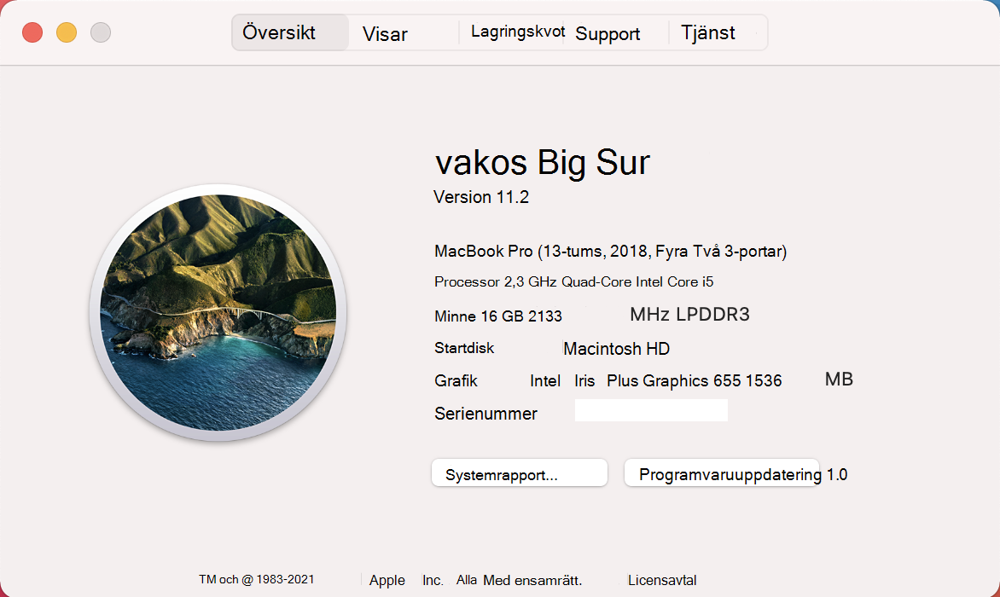

# <a name="device-control-for-macos"></a>Enhetskontroll för macOS

[!INCLUDE [Microsoft 365 Defender rebranding](../../includes/microsoft-defender.md)]

**Gäller för:**
- [Microsoft Defender för Endpoint](https://go.microsoft.com/fwlink/p/?linkid=2154037)
- [Microsoft 365 Defender](https://go.microsoft.com/fwlink/?linkid=2118804)

> Vill du uppleva Microsoft Defender för Slutpunkt? [Registrera dig för en kostnadsfri utvärderingsversion.](https://www.microsoft.com/microsoft-365/windows/microsoft-defender-atp?ocid=docs-wdatp-exposedapis-abovefoldlink)

## <a name="requirements"></a>Krav

Enhetskontroll för macOS har följande krav:

>[!div class="checklist"]
> - Microsoft Defender för slutpunktsberättigande (kan vara utvärderingsversion)
> - Lägsta OS-version: macOS 11 eller senare
> - Lägsta produktversion: 101.34.20

## <a name="device-control-policy"></a>Princip för enhetskontroll

Om du vill konfigurera enhetskontroll för macOS måste du skapa en princip som beskriver de begränsningar du vill införa i organisationen.

Principen för enhetskontroll ingår i konfigurationsprofilen som används för att konfigurera alla andra produktinställningar. Mer information finns i [Konfigurationsprofilens struktur.](mac-preferences.md#configuration-profile-structure)

I konfigurationsprofilen definieras enhetens kontrollprincip i följande avsnitt:

|Avsnitt|Värde|
|:---|:---|
| **Domän** | `com.microsoft.wdav` |
| **Nyckel** | deviceControl |
| **Datatyp** | Ordlista (kapslad inställning) |
| **Kommentarer** | I följande avsnitt finns en beskrivning av innehållet i ordlistan. |

Principen för enhetskontroll kan användas för att:

- [Anpassa URL-målet för meddelanden upphöjt av enhetskontroll](#customize-url-target-for-notifications-raised-by-device-control)
- [Tillåt eller blockera flyttbara enheter](#allow-or-block-removable-devices)

### <a name="customize-url-target-for-notifications-raised-by-device-control"></a>Anpassa URL-målet för meddelanden upphöjt av enhetskontroll

När den princip för enhetskontroll som du har tillämpat tillämpas på en enhet (till exempel åtkomsten till en flyttbar medieenhet är begränsad) visas ett meddelande för användaren.


När slutanvändare klickar på det här meddelandet öppnas en webbsida i standardwebbläsaren. Du kan konfigurera URL-adressen som öppnas när slutanvändare klickar på meddelandet.

|Avsnitt|Värde|
|:---|:---|
| **Domän** | `com.microsoft.wdav` |
| **Nyckel** | navigationTarget |
| **Datatyp** | Sträng |
| **Kommentarer** | Om den inte är definierad använder produkten en standard-URL som pekar till en allmän sida som förklarar produktens åtgärder. |

### <a name="allow-or-block-removable-devices"></a>Tillåt eller blockera flyttbara enheter

Avsnittet för flyttbara mediefiler i enhetens kontrollprincip används för att begränsa åtkomsten till flyttbara medium. 

> [!NOTE]
> Följande typer av flyttbara media stöds för närvarande och kan ingå i principen: USB-lagringsenheter.

|Avsnitt|Värde|
|:---|:---|
| **Domän** | `com.microsoft.wdav` |
| **Nyckel** | removableMediaPolicy |
| **Datatyp** | Ordlista (kapslad inställning) |
| **Kommentarer** | I följande avsnitt finns en beskrivning av innehållet i ordlistan. |

Det här avsnittet i principen är hierarkiskt, vilket ger maximal flexibilitet och omfattar ett brett utbud av användningsfall. På den högsta nivån finns leverantörer som har ett leverantörs-ID. För varje leverantör finns det produkter som identifieras med ett produkt-ID. För varje produkt finns slutligen serienummer som anger specifika enheter.

```
|-- policy top level 
    |-- vendor 1 
        |-- product 1 
            |-- serial number 1 
            ...
            |-- serial number N 
        ...
        |-- product N 
    ...
    |-- vendor N
```

Mer information om hur du hittar enhetsidentifierare finns i [Slå upp enhetsidentifierare](#look-up-device-identifiers).

Principen utvärderas från det mest specifika inmatnings området till det mest allmänna. När en enhet är ansluten försöker produkten alltså hitta den mest specifika matchningen i principen för varje flyttbar medieenhet och tillämpa behörigheterna på den nivån. Om det inte finns någon matchning tillämpas nästa bästa matchning, hela vägen till den behörighet som anges på den högsta nivån, vilket är standard när en enhet inte matchar någon annan post i principen.

#### <a name="policy-enforcement-level"></a>Tillämpningsnivå för policy

Under avsnittet flyttbara media finns ett alternativ för att ställa in tillämpningsnivån, som kan ha något av följande värden:

- `audit` – Om åtkomsten till en enhet är begränsad visas ett meddelande för användaren under den här tillämpningsnivån, men enheten kan fortfarande användas. Den här tillämpningsnivån kan vara användbar för att utvärdera en princips effektivitet.
- `block` – Under den här tillämpningsnivån är åtgärderna som användaren kan utföra på enheten begränsade till vad som har definierats i principen. Dessutom skickas ett meddelande till användaren. 

> [!NOTE] 
> Som standard har tillämpningsnivån `audit` . 

|Avsnitt|Värde|
|:---|:---|
| **Domän** | `com.microsoft.wdav` |
| **Nyckel** | enforcementLevel |
| **Datatyp** | Sträng |
| **Möjliga värden** | granskning (standard) <br/> blockera |

#### <a name="default-permission-level"></a>Standardbehörighetsnivå

På den översta nivån i avsnittet flyttbara media kan du konfigurera standardbehörighetsnivån för enheter som inte matchar något annat i principen.

Den här inställningen kan ställas in på:

- `none` - Inga åtgärder kan utföras på enheten
- En kombination av följande värden:
    - `read` - Läsåtgärder tillåts på enheten
    - `write` - Skrivåtgärder tillåts på enheten
    - `execute` - Utföra åtgärder tillåts på enheten

> [!NOTE]
> Om `none` finns i behörighetsnivån ignoreras alla andra behörigheter ( `read` , eller `write` `execute` ).

> [!NOTE]
> Behörigheten `execute` refererar bara till körning av Binärfilerna i Så här många binärfiler. Den innehåller inte körning av skript eller andra typer av nyttolaster.

|Avsnitt|Värde|
|:---|:---|
| **Domän** | `com.microsoft.wdav` |
| **Nyckel** | behörighet |
| **Datatyp** | Matris med strängar |
| **Möjliga värden** | none (ingen) <br/> läsa <br/> skriva <br/> utföra |

#### <a name="restrict-removable-media-by-vendor-product-and-serial-number"></a>Begränsa flyttbara medium efter leverantör, produkt och serienummer

Enligt beskrivningen [i Tillåt eller blockera](#allow-or-block-removable-devices)flyttbara enheter kan flyttbara medium, t.ex. USB-enheter, identifieras med leverantörs-ID, produkt-ID och serienummer.

På den högsta nivån i principen för flyttbara media kan du definiera mer detaljerade begränsningar på leverantörsnivå. 

Ordlistan `vendors` innehåller en eller flera poster där varje post identifieras med leverantörs-ID.

|Avsnitt|Värde|
|:---|:---|
| **Domän** | `com.microsoft.wdav` |
| **Nyckel** | leverantörer |
| **Datatyp** | Ordlista (kapslad inställning) |

Du kan ange önskad behörighetsnivå för enheter från den leverantören för varje leverantör.

|Avsnitt|Värde|
|:---|:---|
| **Domän** | `com.microsoft.wdav` |
| **Nyckel** | behörighet |
| **Datatyp** | Matris med strängar |
| **Möjliga värden** | Samma som [standardbehörighetsnivå](#default-permission-level) |

Alternativt kan du ange en uppsättning produkter som tillhör den leverantören och vilka mer detaljerade behörigheter definieras för. Ordlistan `products` innehåller en eller flera poster där varje post identifieras med produkt-ID: t. 

|Avsnitt|Värde|
|:---|:---|
| **Domän** | `com.microsoft.wdav` |
| **Nyckel** | produkter |
| **Datatyp** | Ordlista (kapslad inställning) |

Du kan ange önskad behörighetsnivå för varje produkt.

|Avsnitt|Värde|
|:---|:---|
| **Domän** | `com.microsoft.wdav` |
| **Nyckel** | behörighet |
| **Datatyp** | Matris med strängar |
| **Möjliga värden** | Samma som [standardbehörighetsnivå](#default-permission-level) |

Du kan dessutom ange en valfri uppsättning serienummer som mer detaljerade behörigheter definieras för.

Ordlistan `serialNumbers` innehåller en eller flera poster där varje post identifieras med serienumret.

|Avsnitt|Värde|
|:---|:---|
| **Domän** | `com.microsoft.wdav` |
| **Nyckel** | serialNumbers |
| **Datatyp** | Ordlista (kapslad inställning) |

Du kan ange önskad behörighetsnivå för varje serienummer.

|Avsnitt|Värde|
|:---|:---|
| **Domän** | `com.microsoft.wdav` |
| **Nyckel** | behörighet |
| **Datatyp** | Matris med strängar |
| **Möjliga värden** | Samma som [standardbehörighetsnivå](#default-permission-level) |

#### <a name="example-device-control-policy"></a>Exempel på princip för enhetskontroll

Följande exempel visar hur alla ovanstående begrepp kan kombineras i en enhetskontrollprincip. Observera i exemplet nedan hur hierarkiskt principen för flyttbara media är.

```xml
<?xml version="1.0" encoding="UTF-8"?> 
<!DOCTYPE plist PUBLIC "-//Apple//DTD PLIST 1.0//EN" "http://www.apple.com/DTDs/PropertyList-1.0.dtd"> 
<plist version="1.0"> 
<dict> 
    <key>deviceControl</key> 
    <dict> 
        <key>navigationTarget</key> 
        <string>[custom URL for notifications]</string> 
        <key>removableMediaPolicy</key> 
        <dict> 
            <key>enforcementLevel</key> 
            <string>[enforcement level]</string> <!-- audit / block --> 
            <key>permission</key> 
            <array> 
                <string>[permission]</string> <!-- none / read / write / execute --> 
                <!-- other permissions -->
            </array> 
            <key>vendors</key> 
            <dict> 
                <key>[vendor id]</key> 
                <dict>
                    <key>permission</key> 
                    <array> 
                        <string>[permission]</string> <!-- none / read / write / execute --> 
                        <!-- other permissions -->
                    </array> 
                    <key>products</key> 
                    <dict> 
                        <key>[product id]</key> 
                        <dict> 
                            <key>permission</key> 
                            <array> 
                                <string>[permission]</string> <!-- none / read / write / execute --> 
                                <!-- other permissions -->
                            </array> 
                            <key>serialNumbers</key> 
                            <dict> 
                                <key>[serial-number]</key> 
                                <array> 
                                    <string>[permission]</string> <!-- none / read / write / execute --> 
                                    <!-- other permissions -->
                                </array> 
                                <!-- other serial numbers --> 
                            </dict> 
                        </dict> 
                        <!-- other products --> 
                    </dict> 
                </dict> 
                <!-- other vendors --> 
            </dict> 
        </dict> 
    </dict> 
</dict> 
</plist> 
```

Vi har tagit med fler exempel på principer för enhetskontroll i följande dokument:

- [Exempel på principer för enhetskontroll för Intune](mac-device-control-intune.md)
- [Exempel på principer för enhetskontroll för JAMF](mac-device-control-jamf.md)

#### <a name="look-up-device-identifiers"></a>Slå upp enhetsidentifierare

Så här hittar du leverantörs-ID, produkt-ID och serienummer för en USB-enhet:

1. Logga in på en Mac-enhet.
1. Anslut den USB-enhet där du vill slå upp identifierarna.
1. På menyn på översta nivån i macOS väljer du **Om den här mac-datorn.**

    

1. Välj **Systemrapport**.

    

1. Välj USB i den vänstra **kolumnen.**

    

1. Under **USB-enhetsträd** navigerar du till den USB-enhet som du har anslutit.

    

1. Leverantörs-ID, produkt-ID och serienummer visas. När du lägger till leverantörs-ID och produkt-ID i principen för flyttbara media får du bara lägga till delen efter `0x` . I bilden nedan är leverantörs-ID och `1000` `090c` produkt-ID.

#### <a name="discover-usb-devices-in-your-organization"></a>Upptäck USB-enheter i din organisation

Du kan visa monterings-, avsluts- och volymändringshändelser som kommer från USB-enheter i Microsoft Defender för avancerad sökning för slutpunkt. Dessa händelser kan vara användbara för att identifiera misstänkt användningsaktivitet eller utföra interna undersökningar.

```
DeviceEvents 
    | where ActionType == "UsbDriveMounted" or ActionType == "UsbDriveUnmounted" or ActionType == "UsbDriveDriveLetterChanged"
    | where DeviceId == "<device ID>"
```

## <a name="device-control-policy-deployment"></a>Distribution av princip för enhetskontroll

Principen för enhetskontroll måste finnas bredvid de andra produktinställningarna, enligt beskrivningen i Ange inställningar för [Microsoft Defender för Slutpunkt på macOS.](mac-preferences.md)

Den här profilen kan distribueras med hjälp av anvisningarna i [Distribution av konfigurationsprofil.](mac-preferences.md#configuration-profile-deployment)

## <a name="troubleshooting-tips"></a>Felsökningstips

När konfigurationsprofilen har installerats via Intune eller JAMF kan du kontrollera om den hämtats av produkten genom att köra följande kommando från terminalen:

```bash
mdatp device-control removable-media policy list
```

Det här kommandot skriver ut enligt standardprincipen för enhetskontroll som produkten använder. Om det här skrivs ut ser du till att (a) konfigurationsprofilen verkligen har tryckts ned till din enhet från hanteringskonsolen och (b) det är en giltig princip för enhetskontroll, enligt beskrivningen i det här `Policy is empty` dokumentet.

På en enhet där principen har levererats och där det finns en eller flera enheter som är inkopplade kan du köra följande kommando för att visa alla enheter och de gällande behörigheterna som tillämpas på dem.

```bash
mdatp device-control removable-media devices list
```

Exempel på utdata:

```Output
.Device(s)
|-o Name: Untitled 1, Permission ["read", "execute"]
| |-o Vendor: General "fff0"
| |-o Product: USB Flash Disk "1000"
| |-o Serial number: "04ZSSMHI2O7WBVOA"
| |-o Mount point: "/Volumes/TESTUSB"
```

I exemplet ovan finns det bara en flyttbar medieenhet som är ansluten och den har och behörigheter, enligt principen för enhetskontroll som `read` `execute` levererades till enheten.

## <a name="related-topics"></a>Relaterade ämnen

- [Exempel på principer för enhetskontroll för Intune](mac-device-control-intune.md)
- [Exempel på principer för enhetskontroll för JAMF](mac-device-control-jamf.md)
