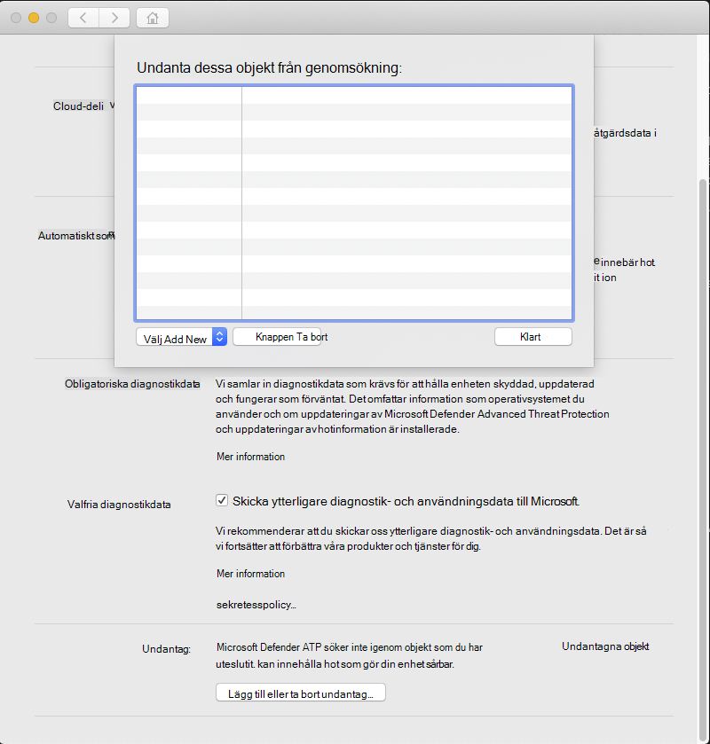

# <a name="configure-and-validate-exclusions-for-microsoft-defender-for-endpoint-on-macos"></a><span data-ttu-id="614f2-105">Konfigurera och validera undantag för Microsoft Defender för slutpunkt i macOS</span><span class="sxs-lookup"><span data-stu-id="614f2-105">Configure and validate exclusions for Microsoft Defender for Endpoint on macOS</span></span>

[!INCLUDE [Microsoft 365 Defender rebranding](../../includes/microsoft-defender.md)]


<span data-ttu-id="614f2-106">**Gäller för:**</span><span class="sxs-lookup"><span data-stu-id="614f2-106">**Applies to:**</span></span>
- [<span data-ttu-id="614f2-107">Microsoft Defender för Endpoint</span><span class="sxs-lookup"><span data-stu-id="614f2-107">Microsoft Defender for Endpoint</span></span>](https://go.microsoft.com/fwlink/p/?linkid=2154037)
- [<span data-ttu-id="614f2-108">Microsoft 365 Defender</span><span class="sxs-lookup"><span data-stu-id="614f2-108">Microsoft 365 Defender</span></span>](https://go.microsoft.com/fwlink/?linkid=2118804)

> <span data-ttu-id="614f2-109">Vill du använda Defender för Slutpunkt?</span><span class="sxs-lookup"><span data-stu-id="614f2-109">Want to experience Defender for Endpoint?</span></span> [<span data-ttu-id="614f2-110">Registrera dig för en kostnadsfri utvärderingsversion.</span><span class="sxs-lookup"><span data-stu-id="614f2-110">Sign up for a free trial.</span></span>](https://www.microsoft.com/microsoft-365/windows/microsoft-defender-atp?ocid=docs-wdatp-investigateip-abovefoldlink)

<span data-ttu-id="614f2-111">Den här artikeln innehåller information om hur du definierar undantag som gäller för sökning på begäran, skydd och övervakning i realtid.</span><span class="sxs-lookup"><span data-stu-id="614f2-111">This article provides information on how to define exclusions that apply to on-demand scans, and real-time protection and monitoring.</span></span>

>[!IMPORTANT]
><span data-ttu-id="614f2-112">Undantag som beskrivs i den här artikeln gäller inte för andra Defender för slutpunkt på Mac-funktioner, inklusive identifiering av slutpunkt och svar (EDR).</span><span class="sxs-lookup"><span data-stu-id="614f2-112">The exclusions described in this article don't apply to other Defender for Endpoint on Mac capabilities, including endpoint detection and response (EDR).</span></span> <span data-ttu-id="614f2-113">Filer som du undantar med hjälp av metoderna som beskrivs i den här artikeln kan fortfarande utlösa EDR-aviseringar och andra identifieringar.</span><span class="sxs-lookup"><span data-stu-id="614f2-113">Files that you exclude using the methods described in this article can still trigger EDR alerts and other detections.</span></span>

<span data-ttu-id="614f2-114">Du kan utesluta vissa filer, mappar, processer och process öppna filer från Defender för Slutpunkt på Mac-genomsökningar.</span><span class="sxs-lookup"><span data-stu-id="614f2-114">You can exclude certain files, folders, processes, and process-opened files from Defender for Endpoint on Mac scans.</span></span>

<span data-ttu-id="614f2-115">Undantag kan vara bra för att undvika felaktiga identifieringar av filer eller programvara som är unika eller anpassade för din organisation.</span><span class="sxs-lookup"><span data-stu-id="614f2-115">Exclusions can be useful to avoid incorrect detections on files or software that are unique or customized to your organization.</span></span> <span data-ttu-id="614f2-116">De kan också vara användbara för att minska prestandaproblem som orsakas av Defender för Endpoint på Mac.</span><span class="sxs-lookup"><span data-stu-id="614f2-116">They can also be useful for mitigating performance issues caused by Defender for Endpoint on Mac.</span></span>

>[!WARNING]
><span data-ttu-id="614f2-117">När du definierar undantag sänks skyddet som erbjuds av Defender för Slutpunkt på Mac.</span><span class="sxs-lookup"><span data-stu-id="614f2-117">Defining exclusions lowers the protection offered by Defender for Endpoint on Mac.</span></span> <span data-ttu-id="614f2-118">Du bör alltid utvärdera riskerna som är associerade med att implementera undantag och du bör endast utesluta filer som du är säker på inte är skadliga.</span><span class="sxs-lookup"><span data-stu-id="614f2-118">You should always evaluate the risks that are associated with implementing exclusions, and you should only exclude files that you are confident are not malicious.</span></span>

## <a name="supported-exclusion-types"></a><span data-ttu-id="614f2-119">Undantagstyper som stöds</span><span class="sxs-lookup"><span data-stu-id="614f2-119">Supported exclusion types</span></span>

<span data-ttu-id="614f2-120">I följande tabell visas de undantagstyper som stöds av Defender för slutpunkt på Mac.</span><span class="sxs-lookup"><span data-stu-id="614f2-120">The follow table shows the exclusion types supported by Defender for Endpoint on Mac.</span></span>

<span data-ttu-id="614f2-121">Exkludering</span><span class="sxs-lookup"><span data-stu-id="614f2-121">Exclusion</span></span> | <span data-ttu-id="614f2-122">Definition</span><span class="sxs-lookup"><span data-stu-id="614f2-122">Definition</span></span> | <span data-ttu-id="614f2-123">Exempel</span><span class="sxs-lookup"><span data-stu-id="614f2-123">Examples</span></span>
---|---|---
<span data-ttu-id="614f2-124">Filnamnstillägg</span><span class="sxs-lookup"><span data-stu-id="614f2-124">File extension</span></span> | <span data-ttu-id="614f2-125">Alla filer med tillägget, var som helst på datorn</span><span class="sxs-lookup"><span data-stu-id="614f2-125">All files with the extension, anywhere on the machine</span></span> | `.test`
<span data-ttu-id="614f2-126">Fil</span><span class="sxs-lookup"><span data-stu-id="614f2-126">File</span></span> | <span data-ttu-id="614f2-127">En specifik fil som identifieras med den fullständiga sökvägen</span><span class="sxs-lookup"><span data-stu-id="614f2-127">A specific file identified by the full path</span></span> | `/var/log/test.log`<br/>`/var/log/*.log`<br/>`/var/log/install.?.log`
<span data-ttu-id="614f2-128">Mapp</span><span class="sxs-lookup"><span data-stu-id="614f2-128">Folder</span></span> | <span data-ttu-id="614f2-129">Alla filer under den angivna mappen (rekursivt)</span><span class="sxs-lookup"><span data-stu-id="614f2-129">All files under the specified folder (recursively)</span></span> | `/var/log/`<br/>`/var/*/`
<span data-ttu-id="614f2-130">Process</span><span class="sxs-lookup"><span data-stu-id="614f2-130">Process</span></span> | <span data-ttu-id="614f2-131">En specifik process (anges antingen med den fullständiga sökvägen eller filnamnet) och alla filer som öppnas av den</span><span class="sxs-lookup"><span data-stu-id="614f2-131">A specific process (specified either by the full path or file name) and all files opened by it</span></span> | `/bin/cat`<br/>`cat`<br/>`c?t`

<span data-ttu-id="614f2-132">Undantag för filer, mappar och processer stöder följande jokertecken:</span><span class="sxs-lookup"><span data-stu-id="614f2-132">File, folder, and process exclusions support the following wildcards:</span></span>

<span data-ttu-id="614f2-133">Jokertecken</span><span class="sxs-lookup"><span data-stu-id="614f2-133">Wildcard</span></span> | <span data-ttu-id="614f2-134">Beskrivning</span><span class="sxs-lookup"><span data-stu-id="614f2-134">Description</span></span> | <span data-ttu-id="614f2-135">Exempel</span><span class="sxs-lookup"><span data-stu-id="614f2-135">Example</span></span> | <span data-ttu-id="614f2-136">Matchningar</span><span class="sxs-lookup"><span data-stu-id="614f2-136">Matches</span></span> | <span data-ttu-id="614f2-137">Matchar inte</span><span class="sxs-lookup"><span data-stu-id="614f2-137">Does not match</span></span>
---|---|---|---|---
\* |    <span data-ttu-id="614f2-138">Matchar valbara antal tecken inklusive inga (observera att när det här jokertecknet används inuti en sökväg kommer det bara att ersätta en mapp)</span><span class="sxs-lookup"><span data-stu-id="614f2-138">Matches any number of any characters including none (note that when this wildcard is used inside a path it will substitute only one folder)</span></span> | `/var/*/*.log` | `/var/log/system.log` | `/var/log/nested/system.log`
<span data-ttu-id="614f2-139">?</span><span class="sxs-lookup"><span data-stu-id="614f2-139">?</span></span> | <span data-ttu-id="614f2-140">Matchar ett enstaka tecken</span><span class="sxs-lookup"><span data-stu-id="614f2-140">Matches any single character</span></span> | `file?.log` | `file1.log`<br/>`file2.log` | `file123.log`

>[!NOTE]
><span data-ttu-id="614f2-141">Produkten försöker lösa företagslänkar vid utvärdering av undantag.</span><span class="sxs-lookup"><span data-stu-id="614f2-141">The product attempts to resolve firmlinks when evaluating exclusions.</span></span> <span data-ttu-id="614f2-142">Firmlink-upplösning fungerar inte när undantaget innehåller jokertecken eller målfilen (i `Data` volymen) inte finns.</span><span class="sxs-lookup"><span data-stu-id="614f2-142">Firmlink resolution does not work when the exclusion contains wildcards or the target file (on the `Data` volume) does not exist.</span></span>

## <a name="how-to-configure-the-list-of-exclusions"></a><span data-ttu-id="614f2-143">Så här konfigurerar du listan med undantag</span><span class="sxs-lookup"><span data-stu-id="614f2-143">How to configure the list of exclusions</span></span>

### <a name="from-the-management-console"></a><span data-ttu-id="614f2-144">Från hanteringskonsolen</span><span class="sxs-lookup"><span data-stu-id="614f2-144">From the management console</span></span>

<span data-ttu-id="614f2-145">Mer information om hur du konfigurerar undantag från JAMF, Intune eller en annan hanteringskonsol finns i Ange inställningar för Defender för [slutpunkt på Mac.](mac-preferences.md)</span><span class="sxs-lookup"><span data-stu-id="614f2-145">For more information on how to configure exclusions from JAMF, Intune, or another management console, see [Set preferences for Defender for Endpoint on Mac](mac-preferences.md).</span></span>

### <a name="from-the-user-interface"></a><span data-ttu-id="614f2-146">Från användargränssnittet</span><span class="sxs-lookup"><span data-stu-id="614f2-146">From the user interface</span></span>

<span data-ttu-id="614f2-147">Öppna Defender för slutpunkt-programmet och gå till **Hantera inställningar Lägg** till eller Ta bort  >  **undantag...**, enligt följande skärmbild:</span><span class="sxs-lookup"><span data-stu-id="614f2-147">Open the Defender for Endpoint application and navigate to **Manage settings** > **Add or Remove Exclusion...**, as shown in the following screenshot:</span></span>



<span data-ttu-id="614f2-149">Välj den typ av undantag som du vill lägga till och följ anvisningarna.</span><span class="sxs-lookup"><span data-stu-id="614f2-149">Select the type of exclusion that you wish to add and follow the prompts.</span></span>

## <a name="validate-exclusions-lists-with-the-eicar-test-file"></a><span data-ttu-id="614f2-150">Validera undantagslistor med EICAR-testfilen</span><span class="sxs-lookup"><span data-stu-id="614f2-150">Validate exclusions lists with the EICAR test file</span></span>

<span data-ttu-id="614f2-151">Du kan verifiera att undantagslistorna fungerar genom att hämta `curl` en testfil.</span><span class="sxs-lookup"><span data-stu-id="614f2-151">You can validate that your exclusion lists are working by using `curl` to download a test file.</span></span>

<span data-ttu-id="614f2-152">I följande Bash-kodstycke `test.txt` ersätter du med en fil som överensstämmer med dina undantagsregler.</span><span class="sxs-lookup"><span data-stu-id="614f2-152">In the following Bash snippet, replace `test.txt` with a file that conforms to your exclusion rules.</span></span> <span data-ttu-id="614f2-153">Om du till exempel har utelämnat `.testing` tillägget ersätter du `test.txt` med `test.testing` .</span><span class="sxs-lookup"><span data-stu-id="614f2-153">For example, if you have excluded the `.testing` extension, replace `test.txt` with `test.testing`.</span></span> <span data-ttu-id="614f2-154">Om du testar en sökväg bör du kontrollera att du kör kommandot inom den sökvägen.</span><span class="sxs-lookup"><span data-stu-id="614f2-154">If you are testing a path, ensure that you run the command within that path.</span></span>

```bash
curl -o test.txt https://www.eicar.org/download/eicar.com.txt
```

<span data-ttu-id="614f2-155">Om Defender för Slutpunkt på Mac rapporterar skadlig programvara fungerar regeln inte.</span><span class="sxs-lookup"><span data-stu-id="614f2-155">If Defender for Endpoint on Mac reports malware, then the rule is not working.</span></span> <span data-ttu-id="614f2-156">Om det inte finns någon rapport om skadlig programvara, och den hämtade filen finns, fungerar undantaget.</span><span class="sxs-lookup"><span data-stu-id="614f2-156">If there is no report of malware, and the downloaded file exists, then the exclusion is working.</span></span> <span data-ttu-id="614f2-157">Du kan öppna filen för att bekräfta att innehållet är detsamma som det som beskrivs på [EICAR-testfilens webbplats](http://2016.eicar.org/86-0-Intended-use.html).</span><span class="sxs-lookup"><span data-stu-id="614f2-157">You can open the file to confirm that the contents are the same as what is described on the [EICAR test file website](http://2016.eicar.org/86-0-Intended-use.html).</span></span>

<span data-ttu-id="614f2-158">Om du inte har tillgång till Internet kan du skapa en egen EICAR-testfil.</span><span class="sxs-lookup"><span data-stu-id="614f2-158">If you do not have Internet access, you can create your own EICAR test file.</span></span> <span data-ttu-id="614f2-159">Skriv EICAR-strängen till en ny textfil med följande Bash-kommando:</span><span class="sxs-lookup"><span data-stu-id="614f2-159">Write the EICAR string to a new text file with the following Bash command:</span></span>

```bash
echo 'X5O!P%@AP[4\PZX54(P^)7CC)7}$EICAR-STANDARD-ANTIVIRUS-TEST-FILE!$H+H*' > test.txt
```

<span data-ttu-id="614f2-160">Du kan också kopiera strängen till en tom textfil och försöka spara den med filnamnet eller i mappen som du försöker utelämna.</span><span class="sxs-lookup"><span data-stu-id="614f2-160">You can also copy the string into a blank text file and attempt to save it with the file name or in the folder you are attempting to exclude.</span></span>

## <a name="allow-threats"></a><span data-ttu-id="614f2-161">Tillåt hot</span><span class="sxs-lookup"><span data-stu-id="614f2-161">Allow threats</span></span>

<span data-ttu-id="614f2-162">Förutom att utesluta att visst innehåll genomsöks kan du också konfigurera produkten så att den inte identifierar vissa klasser av hot (identifieras med hotnamnet).</span><span class="sxs-lookup"><span data-stu-id="614f2-162">In addition to excluding certain content from being scanned, you can also configure the product not to detect some classes of threats (identified by the threat name).</span></span> <span data-ttu-id="614f2-163">Var försiktig när du använder den här funktionen eftersom den kan lämna enheten oskyddad.</span><span class="sxs-lookup"><span data-stu-id="614f2-163">You should exercise caution when using this functionality, as it can leave your device unprotected.</span></span>

<span data-ttu-id="614f2-164">Kör följande kommando för att lägga till ett namn för hot i listan över tillåtna hot:</span><span class="sxs-lookup"><span data-stu-id="614f2-164">To add a threat name to the allowed list, execute the following command:</span></span>

```bash
mdatp threat allowed add --name [threat-name]
```

<span data-ttu-id="614f2-165">Hotnamnet som associeras med en identifiering på din enhet kan erhållas med följande kommando:</span><span class="sxs-lookup"><span data-stu-id="614f2-165">The threat name associated with a detection on your device can be obtained using the following command:</span></span>

```bash
mdatp threat list
```

<span data-ttu-id="614f2-166">Om du till exempel vill lägga `EICAR-Test-File (not a virus)` till (hotnamnet som är associerat med EICAR-identifieringen) i listan över tillåtna, kör du följande kommando:</span><span class="sxs-lookup"><span data-stu-id="614f2-166">For example, to add `EICAR-Test-File (not a virus)` (the threat name associated with the EICAR detection) to the allowed list, execute the following command:</span></span>

```bash
mdatp threat allowed add --name "EICAR-Test-File (not a virus)"
```
