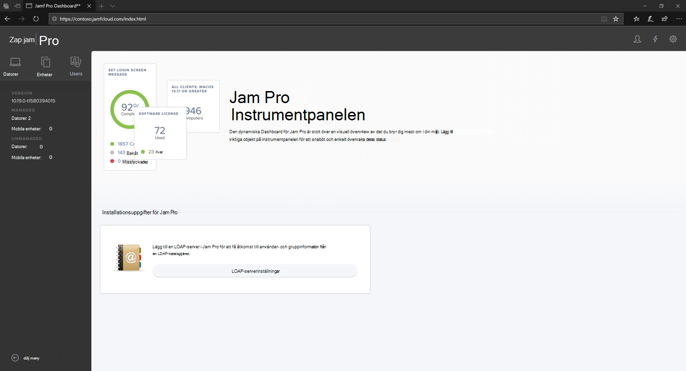
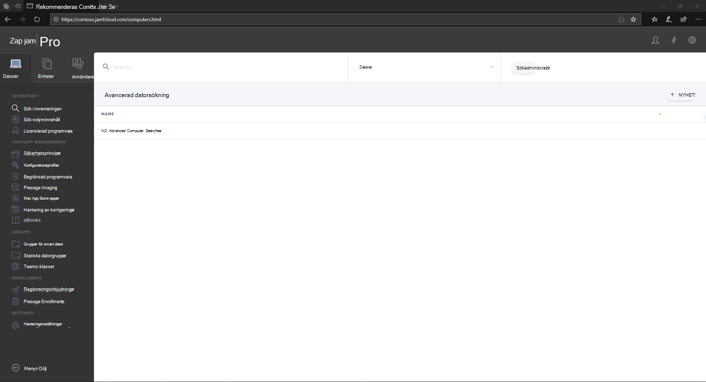

# Logga in på Jamf Pro

[!INCLUDE [Microsoft 365 Defender rebranding](../../includes/microsoft-defender.md)]

**Gäller för:**
- [Microsoft Defender för Endpoint](https://go.microsoft.com/fwlink/p/?linkid=2154037)
- [Microsoft 365 Defender](https://go.microsoft.com/fwlink/?linkid=2118804)

> Vill du använda Defender för Slutpunkt? [Registrera dig för en kostnadsfri utvärderingsversion.](https://www.microsoft.com/microsoft-365/windows/microsoft-defender-atp?ocid=docs-wdatp-investigateip-abovefoldlink)

1. Ange dina autentiseringsuppgifter.

    

2. Välj **Datorer.**

    

3. De tillgängliga inställningarna visas.

     

## Nästa steg
[Konfigurera enhetsgrupperna i Jamf Pro](mac-jamfpro-device-groups.md)

