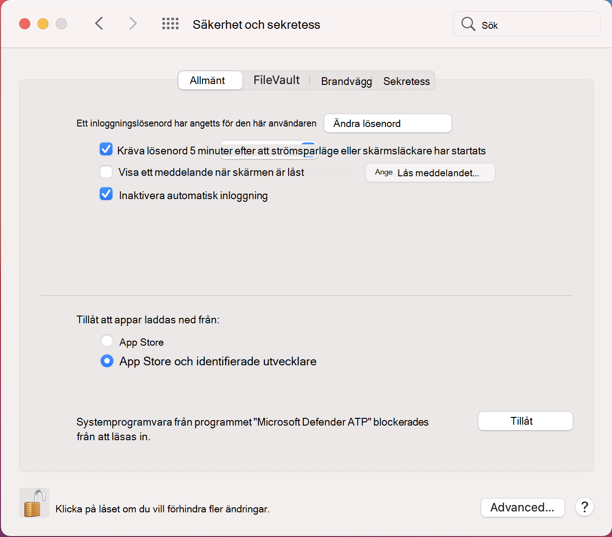

# <a name="manual-deployment-for-microsoft-defender-for-endpoint-for-macos"></a><span data-ttu-id="56a9a-104">Manuell distribution av Microsoft Defender för Slutpunkt för macOS</span><span class="sxs-lookup"><span data-stu-id="56a9a-104">Manual deployment for Microsoft Defender for Endpoint for macOS</span></span>

[!INCLUDE [Microsoft 365 Defender rebranding](../../includes/microsoft-defender.md)]

<span data-ttu-id="56a9a-105">**Gäller för:**</span><span class="sxs-lookup"><span data-stu-id="56a9a-105">**Applies to:**</span></span>
- [<span data-ttu-id="56a9a-106">Microsoft Defender för Endpoint</span><span class="sxs-lookup"><span data-stu-id="56a9a-106">Microsoft Defender for Endpoint</span></span>](https://go.microsoft.com/fwlink/p/?linkid=2154037)
- [<span data-ttu-id="56a9a-107">Microsoft 365 Defender</span><span class="sxs-lookup"><span data-stu-id="56a9a-107">Microsoft 365 Defender</span></span>](https://go.microsoft.com/fwlink/?linkid=2118804)

> <span data-ttu-id="56a9a-108">Vill du använda Defender för Slutpunkt?</span><span class="sxs-lookup"><span data-stu-id="56a9a-108">Want to experience Defender for Endpoint?</span></span> [<span data-ttu-id="56a9a-109">Registrera dig för en kostnadsfri utvärderingsversion.</span><span class="sxs-lookup"><span data-stu-id="56a9a-109">Sign up for a free trial.</span></span>](https://www.microsoft.com/microsoft-365/windows/microsoft-defender-atp?ocid=docs-wdatp-investigateip-abovefoldlink)

<span data-ttu-id="56a9a-110">I det här avsnittet beskrivs hur du distribuerar Microsoft Defender för slutpunkt för macOS manuellt.</span><span class="sxs-lookup"><span data-stu-id="56a9a-110">This topic describes how to deploy Microsoft Defender for Endpoint for macOS manually.</span></span> <span data-ttu-id="56a9a-111">För en lyckad distribution måste du slutföra alla följande steg:</span><span class="sxs-lookup"><span data-stu-id="56a9a-111">A successful deployment requires the completion of all of the following steps:</span></span>
- [<span data-ttu-id="56a9a-112">Ladda ned installation- och onboarding-paket</span><span class="sxs-lookup"><span data-stu-id="56a9a-112">Download installation and onboarding packages</span></span>](#download-installation-and-onboarding-packages)
- [<span data-ttu-id="56a9a-113">Programinstallation (macOS 10.15 och äldre versioner)</span><span class="sxs-lookup"><span data-stu-id="56a9a-113">Application installation (macOS 10.15 and older versions)</span></span>](#application-installation-macos-1015-and-older-versions)
- [<span data-ttu-id="56a9a-114">Programinstallation (macOS 11 och senare versioner)</span><span class="sxs-lookup"><span data-stu-id="56a9a-114">Application installation (macOS 11 and newer versions)</span></span>](#application-installation-macos-11-and-newer-versions)
- [<span data-ttu-id="56a9a-115">Klientkonfiguration</span><span class="sxs-lookup"><span data-stu-id="56a9a-115">Client configuration</span></span>](#client-configuration)

## <a name="prerequisites-and-system-requirements"></a><span data-ttu-id="56a9a-116">Krav och systemkrav</span><span class="sxs-lookup"><span data-stu-id="56a9a-116">Prerequisites and system requirements</span></span>

<span data-ttu-id="56a9a-117">Innan du börjar kan du gå [till huvudsidan för Microsoft Defender](microsoft-defender-endpoint-mac.md) för Slutpunkt för macOS för att få en beskrivning av förutsättningarna och systemkraven för den aktuella programvaruversionen.</span><span class="sxs-lookup"><span data-stu-id="56a9a-117">Before you get started, see [the main Microsoft Defender for Endpoint for macOS page](microsoft-defender-endpoint-mac.md) for a description of prerequisites and system requirements for the current software version.</span></span>

## <a name="download-installation-and-onboarding-packages"></a><span data-ttu-id="56a9a-118">Ladda ned installation- och onboarding-paket</span><span class="sxs-lookup"><span data-stu-id="56a9a-118">Download installation and onboarding packages</span></span>

<span data-ttu-id="56a9a-119">Ladda ned installation- och onboarding-paketen från Microsoft Defender Säkerhetscenter:</span><span class="sxs-lookup"><span data-stu-id="56a9a-119">Download the installation and onboarding packages from Microsoft Defender Security Center:</span></span>

1. <span data-ttu-id="56a9a-120">I Microsoft Defender Säkerhetscenter går du till **Inställningar > Enhetshantering > Onboarding**.</span><span class="sxs-lookup"><span data-stu-id="56a9a-120">In Microsoft Defender Security Center, go to **Settings > Device Management > Onboarding**.</span></span>
2. <span data-ttu-id="56a9a-121">I avsnitt 1 på sidan anger du operativsystem till **macOS** och distributionsmetod till **Lokalt skript.**</span><span class="sxs-lookup"><span data-stu-id="56a9a-121">In Section 1 of the page, set operating system to **macOS** and Deployment method to **Local script**.</span></span>
3. <span data-ttu-id="56a9a-122">I avsnitt 2 på sidan väljer du Ladda **ned installationspaketet**.</span><span class="sxs-lookup"><span data-stu-id="56a9a-122">In Section 2 of the page, select **Download installation package**.</span></span> <span data-ttu-id="56a9a-123">Spara den som wdav.pkg i en lokal katalog.</span><span class="sxs-lookup"><span data-stu-id="56a9a-123">Save it as wdav.pkg to a local directory.</span></span>
4. <span data-ttu-id="56a9a-124">Välj Hämta introduktionspaket i avsnitt 2 **på sidan.**</span><span class="sxs-lookup"><span data-stu-id="56a9a-124">In Section 2 of the page, select **Download onboarding package**.</span></span> <span data-ttu-id="56a9a-125">Spara den WindowsDefenderATPOnboardingPackage.zip filen i samma katalog.</span><span class="sxs-lookup"><span data-stu-id="56a9a-125">Save it as WindowsDefenderATPOnboardingPackage.zip to the same directory.</span></span>

    

5. <span data-ttu-id="56a9a-127">Kontrollera att du har de två filerna i kommandotolken.</span><span class="sxs-lookup"><span data-stu-id="56a9a-127">From a command prompt, verify that you have the two files.</span></span>
    
## <a name="application-installation-macos-1015-and-older-versions"></a><span data-ttu-id="56a9a-128">Programinstallation (macOS 10.15 och äldre versioner)</span><span class="sxs-lookup"><span data-stu-id="56a9a-128">Application installation (macOS 10.15 and older versions)</span></span>

<span data-ttu-id="56a9a-129">Du måste ha administratörsbehörighet på enheten för att slutföra den här processen.</span><span class="sxs-lookup"><span data-stu-id="56a9a-129">To complete this process, you must have admin privileges on the device.</span></span>

1. <span data-ttu-id="56a9a-130">Navigera till den nedladdade wdav.pkg i Finder och öppna den.</span><span class="sxs-lookup"><span data-stu-id="56a9a-130">Navigate to the downloaded wdav.pkg in Finder and open it.</span></span>

    

2. <span data-ttu-id="56a9a-132">Välj **Fortsätt**, godkänn licensvillkoren och ange lösenordet när du uppmanas att göra det.</span><span class="sxs-lookup"><span data-stu-id="56a9a-132">Select **Continue**, agree with the License terms, and enter the password when prompted.</span></span>

    

   > [!IMPORTANT]
   > <span data-ttu-id="56a9a-134">Du uppmanas att tillåta att en drivrutin från Microsoft installeras (antingen "Systemtillägg blockerat" eller "Installationen är spärrad" eller båda.</span><span class="sxs-lookup"><span data-stu-id="56a9a-134">You will be prompted to allow a driver from Microsoft to be installed (either "System Extension Blocked" or "Installation is on hold" or both.</span></span> <span data-ttu-id="56a9a-135">Drivrutinen måste tillåtas att installeras.</span><span class="sxs-lookup"><span data-stu-id="56a9a-135">The driver must be allowed to be installed.</span></span>

   

3. <span data-ttu-id="56a9a-137">Välj **Öppna säkerhetsinställningar** eller **Öppna systeminställningar > säkerhetsinställningar & sekretess.**</span><span class="sxs-lookup"><span data-stu-id="56a9a-137">Select **Open Security Preferences** or **Open System Preferences > Security & Privacy**.</span></span> <span data-ttu-id="56a9a-138">Välj **Tillåt:**</span><span class="sxs-lookup"><span data-stu-id="56a9a-138">Select **Allow**:</span></span>

    

   <span data-ttu-id="56a9a-140">Installationen utförs.</span><span class="sxs-lookup"><span data-stu-id="56a9a-140">The installation proceeds.</span></span>

   > [!CAUTION]
   > <span data-ttu-id="56a9a-141">Om du inte väljer **Tillåt** fortsätter installationen efter 5 minuter.</span><span class="sxs-lookup"><span data-stu-id="56a9a-141">If you don't select **Allow**, the installation will proceed after 5 minutes.</span></span> <span data-ttu-id="56a9a-142">Microsoft Defender för Slutpunkt läses in, men vissa funktioner, till exempel realtidsskydd, inaktiveras.</span><span class="sxs-lookup"><span data-stu-id="56a9a-142">Microsoft Defender for Endpoint will be loaded, but some features, such as real-time protection, will be disabled.</span></span> <span data-ttu-id="56a9a-143">Mer information [om hur du löser](mac-support-kext.md) det finns i Felsöka problem med kerneltillägg.</span><span class="sxs-lookup"><span data-stu-id="56a9a-143">See [Troubleshoot kernel extension issues](mac-support-kext.md) for information on how to resolve this.</span></span>

> [!NOTE]
> <span data-ttu-id="56a9a-144">macOS kan begära att starta om enheten vid den första installationen av Microsoft Defender för Slutpunkt.</span><span class="sxs-lookup"><span data-stu-id="56a9a-144">macOS may request to reboot the device upon the first installation of Microsoft Defender for Endpoint.</span></span> <span data-ttu-id="56a9a-145">Realtidsskydd är inte tillgängligt förrän enheten startas om.</span><span class="sxs-lookup"><span data-stu-id="56a9a-145">Real-time protection will not be available until the device is rebooted.</span></span>

## <a name="application-installation-macos-11-and-newer-versions"></a><span data-ttu-id="56a9a-146">Programinstallation (macOS 11 och senare versioner)</span><span class="sxs-lookup"><span data-stu-id="56a9a-146">Application installation (macOS 11 and newer versions)</span></span>

<span data-ttu-id="56a9a-147">Du måste ha administratörsbehörighet på enheten för att slutföra den här processen.</span><span class="sxs-lookup"><span data-stu-id="56a9a-147">To complete this process, you must have admin privileges on the device.</span></span>

1. <span data-ttu-id="56a9a-148">Navigera till den nedladdade wdav.pkg i Finder och öppna den.</span><span class="sxs-lookup"><span data-stu-id="56a9a-148">Navigate to the downloaded wdav.pkg in Finder and open it.</span></span>

    

2. <span data-ttu-id="56a9a-150">Välj **Fortsätt**, godkänn licensvillkoren och ange lösenordet när du uppmanas att göra det.</span><span class="sxs-lookup"><span data-stu-id="56a9a-150">Select **Continue**, agree with the License terms, and enter the password when prompted.</span></span>

3. <span data-ttu-id="56a9a-151">I slutet av installationsprocessen godkänner du de systemtillägg som används av produkten.</span><span class="sxs-lookup"><span data-stu-id="56a9a-151">At the end of the installation process, you'll be promoted to approve the system extensions used by the product.</span></span> <span data-ttu-id="56a9a-152">Välj **Öppna säkerhetsinställningar**.</span><span class="sxs-lookup"><span data-stu-id="56a9a-152">Select **Open Security Preferences**.</span></span>

    

4. <span data-ttu-id="56a9a-154">I fönstret **Säkerhet & sekretess** väljer du **Tillåt**.</span><span class="sxs-lookup"><span data-stu-id="56a9a-154">From the **Security & Privacy** window, select **Allow**.</span></span>

    

5. <span data-ttu-id="56a9a-156">Upprepa steg 3 & 4 för alla systemtillägg som distribueras med Microsoft Defender för Slutpunkt för Mac.</span><span class="sxs-lookup"><span data-stu-id="56a9a-156">Repeat steps 3 & 4 for all system extensions distributed with Microsoft Defender for Endpoint for Mac.</span></span>

6. <span data-ttu-id="56a9a-157">Som en del av funktionerna Identifiering av slutpunkt och svar inspekterar Microsoft Defender för Slutpunkt för Mac sockettrafik och rapporterar den här informationen till Microsoft Defender Säkerhetscenter-portalen.</span><span class="sxs-lookup"><span data-stu-id="56a9a-157">As part of the Endpoint Detection and Response capabilities, Microsoft Defender for Endpoint for Mac inspects socket traffic and reports this information to the Microsoft Defender Security Center portal.</span></span> <span data-ttu-id="56a9a-158">När du uppmanas att ge Microsoft Defender behörighet att filtrera nätverkstrafik väljer du **Tillåt**.</span><span class="sxs-lookup"><span data-stu-id="56a9a-158">When prompted to grant Microsoft Defender for Endpoint permissions to filter network traffic, select **Allow**.</span></span>

    

7. <span data-ttu-id="56a9a-160">Öppna **Systeminställningar för**& sekretess och gå till fliken Sekretess. Ge fullständig diskåtkomstbehörighet till Microsoft Defender ATP och  >   Microsoft Defender  **ATP Endpoint Security Extension.**  </span><span class="sxs-lookup"><span data-stu-id="56a9a-160">Open **System Preferences** > **Security & Privacy** and navigate to the **Privacy** tab. Grant **Full Disk Access** permission to **Microsoft Defender ATP** and **Microsoft Defender ATP Endpoint Security Extension**.</span></span>

    

## <a name="client-configuration"></a><span data-ttu-id="56a9a-162">Klientkonfiguration</span><span class="sxs-lookup"><span data-stu-id="56a9a-162">Client configuration</span></span>

1. <span data-ttu-id="56a9a-163">Kopiera wdav.pkg och MicrosoftDefenderATPOnboardingMacOs.py till enheten där du distribuerar Microsoft Defender för Endpoint för macOS.</span><span class="sxs-lookup"><span data-stu-id="56a9a-163">Copy wdav.pkg and MicrosoftDefenderATPOnboardingMacOs.py to the device where you deploy Microsoft Defender for Endpoint for macOS.</span></span>

    <span data-ttu-id="56a9a-164">Klientenheten är inte kopplad till org_id.</span><span class="sxs-lookup"><span data-stu-id="56a9a-164">The client device isn't associated with org_id.</span></span> <span data-ttu-id="56a9a-165">Observera att *org_id* är tomt.</span><span class="sxs-lookup"><span data-stu-id="56a9a-165">Note that the *org_id* attribute is blank.</span></span>

    ```bash
    mdatp health --field org_id
    ```

2. <span data-ttu-id="56a9a-166">Kör Python-skriptet för att installera konfigurationsfilen:</span><span class="sxs-lookup"><span data-stu-id="56a9a-166">Run the Python script to install the configuration file:</span></span>

    ```bash
    /usr/bin/python MicrosoftDefenderATPOnboardingMacOs.py
    ```

3. <span data-ttu-id="56a9a-167">Kontrollera att enheten nu är kopplad till din organisation och rapporterar ett giltigt organisations-ID:</span><span class="sxs-lookup"><span data-stu-id="56a9a-167">Verify that the device is now associated with your organization and reports a valid org ID:</span></span>

    ```bash
    mdatp health --field org_id
    ```

    <span data-ttu-id="56a9a-168">Efter installationen visas Microsoft Defender-ikonen i statusfältet i macOS i det övre högra hörnet.</span><span class="sxs-lookup"><span data-stu-id="56a9a-168">After installation, you'll see the Microsoft Defender icon in the macOS status bar in the top-right corner.</span></span>
    
    > [!div class="mx-imgBorder"]
    > <span data-ttu-id="56a9a-169"></span><span class="sxs-lookup"><span data-stu-id="56a9a-169"></span></span>


## <a name="how-to-allow-full-disk-access"></a><span data-ttu-id="56a9a-170">Så här tillåter du fullständig diskåtkomst</span><span class="sxs-lookup"><span data-stu-id="56a9a-170">How to Allow Full Disk Access</span></span>

> [!CAUTION]
> <span data-ttu-id="56a9a-171">macOS 10.15 (Catalina) innehåller nya förbättringar av säkerhet och sekretess.</span><span class="sxs-lookup"><span data-stu-id="56a9a-171">macOS 10.15 (Catalina) contains new security and privacy enhancements.</span></span> <span data-ttu-id="56a9a-172">Från och med den här versionen kan program som standard inte komma åt vissa platser på disken (till exempel Dokument, Nedladdningar, Skrivbord osv.) utan uttryckligt medgivande.</span><span class="sxs-lookup"><span data-stu-id="56a9a-172">Beginning with this version, by default, applications are not able to access certain locations on disk (such as Documents, Downloads, Desktop, etc.) without explicit consent.</span></span> <span data-ttu-id="56a9a-173">Om inget sådant medgivande getts kan Inte Microsoft Defender för Endpoint skydda din enhet fullt ut.</span><span class="sxs-lookup"><span data-stu-id="56a9a-173">In the absence of this consent, Microsoft Defender for Endpoint is not able to fully protect your device.</span></span>

1. <span data-ttu-id="56a9a-174">Om du vill ge medgivande öppnar **du**  >  **Systeminställningar & Fullständig**  >    >  **diskåtkomst till sekretesssekretessen.**</span><span class="sxs-lookup"><span data-stu-id="56a9a-174">To grant consent, open **System Preferences** > **Security & Privacy** > **Privacy** > **Full Disk Access**.</span></span> <span data-ttu-id="56a9a-175">Klicka på låsikonen om du vill göra ändringar (längst ned i dialogrutan).</span><span class="sxs-lookup"><span data-stu-id="56a9a-175">Click the lock icon to make changes (bottom of the dialog box).</span></span> <span data-ttu-id="56a9a-176">Välj Microsoft Defender för Slutpunkt.</span><span class="sxs-lookup"><span data-stu-id="56a9a-176">Select Microsoft Defender for Endpoint.</span></span>

2. <span data-ttu-id="56a9a-177">Kör ett AV-identifieringstest för att verifiera att enheten är korrekt onboarded och rapporterar till tjänsten.</span><span class="sxs-lookup"><span data-stu-id="56a9a-177">Run an AV detection test to verify that the device is properly onboarded and reporting to the service.</span></span> <span data-ttu-id="56a9a-178">Utför följande steg på den nyligen inbyggda enheten:</span><span class="sxs-lookup"><span data-stu-id="56a9a-178">Perform the following steps on the newly onboarded device:</span></span>

    1. <span data-ttu-id="56a9a-179">Se till att realtidsskyddet är aktiverat (visas med resultatet 1 när följande kommando körs):</span><span class="sxs-lookup"><span data-stu-id="56a9a-179">Ensure that real-time protection is enabled (denoted by a result of 1 from running the following command):</span></span>

        ```bash
        mdatp health --field real_time_protection_enabled
        ```

    1. <span data-ttu-id="56a9a-180">Öppna ett terminalfönster.</span><span class="sxs-lookup"><span data-stu-id="56a9a-180">Open a Terminal window.</span></span> <span data-ttu-id="56a9a-181">Kopiera och kör följande kommando:</span><span class="sxs-lookup"><span data-stu-id="56a9a-181">Copy and execute the following command:</span></span>

        ```bash
        curl -o ~/Downloads/eicar.com.txt https://www.eicar.org/download/eicar.com.txt
        ```

    1. <span data-ttu-id="56a9a-182">Filen borde ha satts i karantän av Defender för Slutpunkt för Mac.</span><span class="sxs-lookup"><span data-stu-id="56a9a-182">The file should have been quarantined by Defender for Endpoint for Mac.</span></span> <span data-ttu-id="56a9a-183">Använd följande kommando för att lista alla identifierade hot:</span><span class="sxs-lookup"><span data-stu-id="56a9a-183">Use the following command to list all the detected threats:</span></span>

        ```bash
        mdatp threat list
        ```

3. <span data-ttu-id="56a9a-184">Kör ett EDR-identifieringstest för att verifiera att enheten är korrekt onboarded och rapporterar till tjänsten.</span><span class="sxs-lookup"><span data-stu-id="56a9a-184">Run an EDR detection test to verify that the device is properly onboarded and reporting to the service.</span></span> <span data-ttu-id="56a9a-185">Utför följande steg på den nyligen inbyggda enheten:</span><span class="sxs-lookup"><span data-stu-id="56a9a-185">Perform the following steps on the newly onboarded device:</span></span>

   1. <span data-ttu-id="56a9a-186">I webbläsaren, till exempel Microsoft Edge för Mac eller Safari.</span><span class="sxs-lookup"><span data-stu-id="56a9a-186">In your browser such as Microsoft Edge for Mac or Safari.</span></span>

   1. <span data-ttu-id="56a9a-187">Ladda ned MDATP MacOS DIY.zip och https://aka.ms/mdatpmacosdiy extrahera.</span><span class="sxs-lookup"><span data-stu-id="56a9a-187">Download MDATP MacOS DIY.zip from https://aka.ms/mdatpmacosdiy and extract.</span></span>

      <span data-ttu-id="56a9a-188">Du kan uppmanas att göra följande:</span><span class="sxs-lookup"><span data-stu-id="56a9a-188">You may be prompted:</span></span>

      > <span data-ttu-id="56a9a-189">Vill du tillåta nedladdningar på "mdatpclientanalyzer.blob.core.windows.net"?</span><span class="sxs-lookup"><span data-stu-id="56a9a-189">Do you want to allow downloads on "mdatpclientanalyzer.blob.core.windows.net"?</span></span><br/>
      > <span data-ttu-id="56a9a-190">Du kan ändra vilka webbplatser som kan ladda ned filer i Webbplatsinställningar.</span><span class="sxs-lookup"><span data-stu-id="56a9a-190">You can change which websites can download files in Websites Preferences.</span></span>

4. <span data-ttu-id="56a9a-191">Klicka **på Tillåt.**</span><span class="sxs-lookup"><span data-stu-id="56a9a-191">Click **Allow**.</span></span>

5. <span data-ttu-id="56a9a-192">Öppna **Nedladdningar**.</span><span class="sxs-lookup"><span data-stu-id="56a9a-192">Open **Downloads**.</span></span>

6. <span data-ttu-id="56a9a-193">Du bör se **MDATP MacOS GÖR-DET-SJÄLV.**</span><span class="sxs-lookup"><span data-stu-id="56a9a-193">You should see **MDATP MacOS DIY**.</span></span>

   > [!TIP]
   > <span data-ttu-id="56a9a-194">Om du dubbelklickar visas följande meddelande:</span><span class="sxs-lookup"><span data-stu-id="56a9a-194">If you double-click, you will get the following message:</span></span>
   > 
   > > <span data-ttu-id="56a9a-195">**"MDATP MacOS GÖR-SJÄLV" kan inte öppnas eftersom utvecklaren inte kan verifieras.**</span><span class="sxs-lookup"><span data-stu-id="56a9a-195">**"MDATP MacOS DIY" cannot be opened because the developer cannot be verifier.**</span></span><br/>
   > > <span data-ttu-id="56a9a-196">macOS kan inte verifiera att den här appen är gratis från skadlig programvara.</span><span class="sxs-lookup"><span data-stu-id="56a9a-196">macOS cannot verify that this app is free from malware.</span></span><br/>
   > > <span data-ttu-id="56a9a-197">**\[ Flytta till \] Papperskorgen** **\[ \]**</span><span class="sxs-lookup"><span data-stu-id="56a9a-197">**\[Move to Trash\]** **\[Cancel\]**</span></span> 
  
7. <span data-ttu-id="56a9a-198">Klicka på **Avbryt**.</span><span class="sxs-lookup"><span data-stu-id="56a9a-198">Click **Cancel**.</span></span>

8. <span data-ttu-id="56a9a-199">Högerklicka på **MDATP MacOS GÖR-SJÄLV** och klicka sedan på **Öppna.**</span><span class="sxs-lookup"><span data-stu-id="56a9a-199">Right-click **MDATP MacOS DIY**, and then click **Open**.</span></span> 

    <span data-ttu-id="56a9a-200">Följande meddelande ska visas i systemet:</span><span class="sxs-lookup"><span data-stu-id="56a9a-200">The system should display the following message:</span></span>

    > <span data-ttu-id="56a9a-201">**macOS kan inte verifiera utvecklaren **av MDATP MacOS DIY.** Vill du öppna den?**</span><span class="sxs-lookup"><span data-stu-id="56a9a-201">**macOS cannot verify the developer of **MDATP MacOS DIY**. Are you sure you want to open it?**</span></span><br/>
    > <span data-ttu-id="56a9a-202">Genom att öppna det här programmet åsidosätter du systemsäkerhet som kan exponera din dator och personliga information för skadlig programvara som kan skada din Mac eller försämra din integritet.</span><span class="sxs-lookup"><span data-stu-id="56a9a-202">By opening this app, you will be overriding system security which can expose your computer and personal information to malware that may harm your Mac or compromise your privacy.</span></span>

10. <span data-ttu-id="56a9a-203">Klicka **på Öppna**.</span><span class="sxs-lookup"><span data-stu-id="56a9a-203">Click **Open**.</span></span>

    <span data-ttu-id="56a9a-204">Följande meddelande ska visas i systemet:</span><span class="sxs-lookup"><span data-stu-id="56a9a-204">The system should display the following message:</span></span>

    > <span data-ttu-id="56a9a-205">Microsoft Defender ATP – testfil för macOS EDR-GÖR-DET</span><span class="sxs-lookup"><span data-stu-id="56a9a-205">Microsoft Defender ATP - macOS EDR DIY test file</span></span><br/>
    > <span data-ttu-id="56a9a-206">Motsvarande avisering är tillgänglig i MDATP-portalen.</span><span class="sxs-lookup"><span data-stu-id="56a9a-206">Corresponding alert will be available in the MDATP portal.</span></span>

11. <span data-ttu-id="56a9a-207">Klicka **på Öppna**.</span><span class="sxs-lookup"><span data-stu-id="56a9a-207">Click **Open**.</span></span>

    <span data-ttu-id="56a9a-208">Om några minuter ska en avisering med namnet "macOS EDR-testvarning" höjas.</span><span class="sxs-lookup"><span data-stu-id="56a9a-208">In a few minutes an alert named "macOS EDR Test Alert" should be raised.</span></span>

12. <span data-ttu-id="56a9a-209">Gå till Microsoft Defender Säkerhetscenter ( https://SecurityCenter.microsoft.com) .</span><span class="sxs-lookup"><span data-stu-id="56a9a-209">Go to Microsoft Defender Security Center (https://SecurityCenter.microsoft.com).</span></span>

13. <span data-ttu-id="56a9a-210">Gå till aviseringskön.</span><span class="sxs-lookup"><span data-stu-id="56a9a-210">Go to the Alert Queue.</span></span>

    :::image type="content" source="images/b8db76c2-c368-49ad-970f-dcb87534d9be.png" alt-text="Exempel på en macOS EDR-testvarning som visar allvarlighetsgrad, kategori, identifieringskälla och en komprimerad meny med åtgärder.":::
    
    <span data-ttu-id="56a9a-212">Titta på aviseringsinformationen och enhetens tidslinje och utför de vanliga undersökningsstegen.</span><span class="sxs-lookup"><span data-stu-id="56a9a-212">Look at the alert details and the device timeline, and perform the regular investigation steps.</span></span>

## <a name="logging-installation-issues"></a><span data-ttu-id="56a9a-213">Loggningsinstallationsproblem</span><span class="sxs-lookup"><span data-stu-id="56a9a-213">Logging installation issues</span></span>

<span data-ttu-id="56a9a-214">Mer [information om hur](mac-resources.md#logging-installation-issues) du hittar den automatiskt genererade loggen som skapas av installationsprogrammet när ett fel uppstår finns i Problem med loggningsinstallationen.</span><span class="sxs-lookup"><span data-stu-id="56a9a-214">See [Logging installation issues](mac-resources.md#logging-installation-issues) for more information on how to find the automatically generated log that is created by the installer when an error occurs.</span></span>

## <a name="uninstallation"></a><span data-ttu-id="56a9a-215">Avinstallation</span><span class="sxs-lookup"><span data-stu-id="56a9a-215">Uninstallation</span></span>

<span data-ttu-id="56a9a-216">Mer [information om hur](mac-resources.md#uninstalling) du tar bort Microsoft Defender för Endpoint för macOS från klientenheter finns i Avinstallera.</span><span class="sxs-lookup"><span data-stu-id="56a9a-216">See [Uninstalling](mac-resources.md#uninstalling) for details on how to remove Microsoft Defender for Endpoint for macOS from client devices.</span></span>
