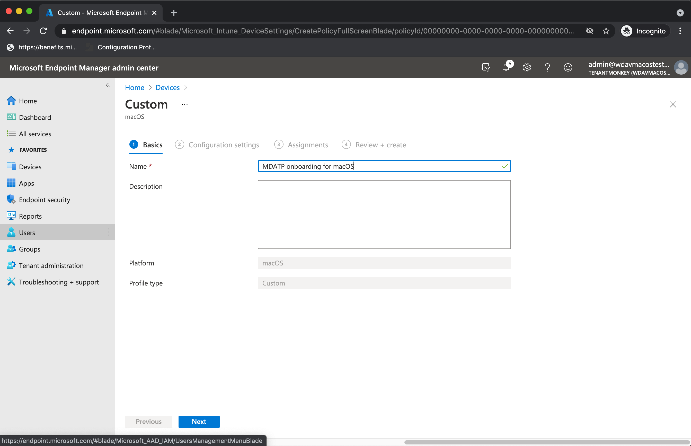
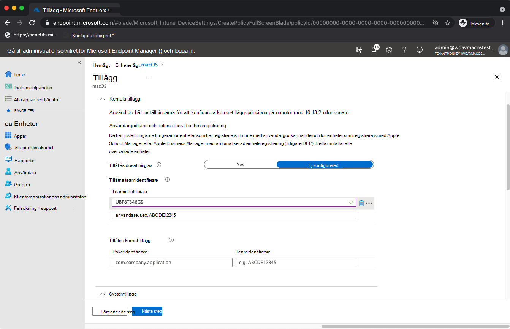
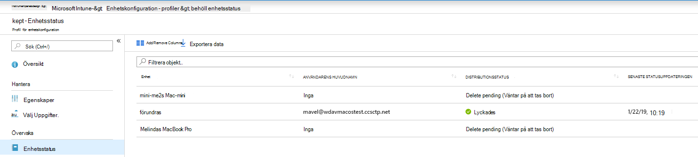
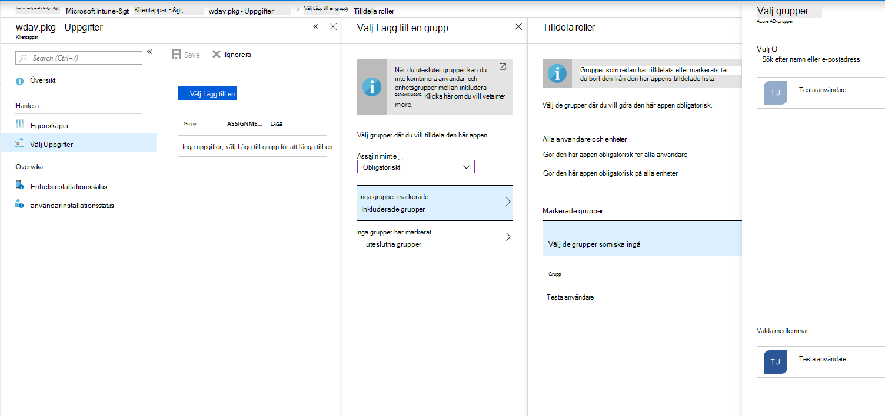
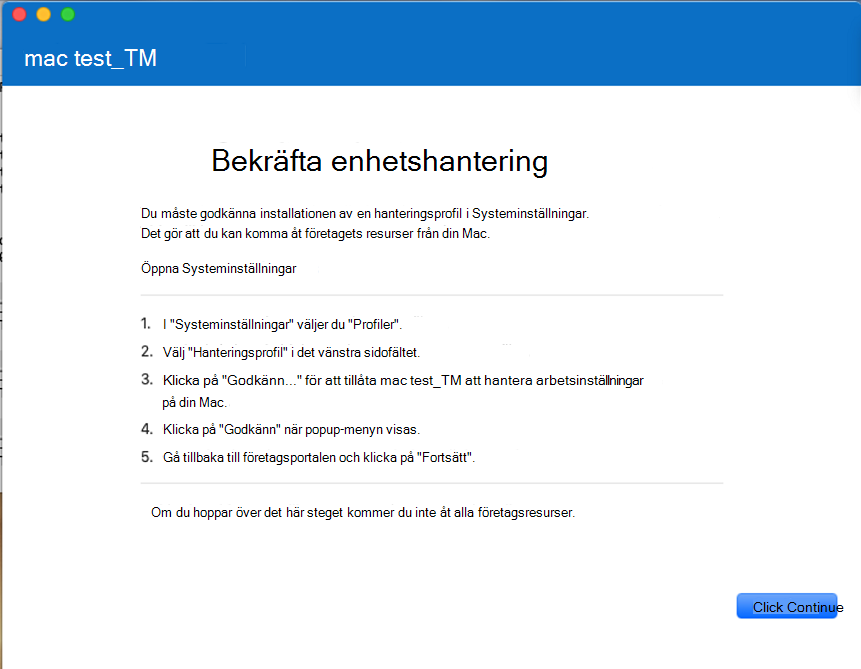
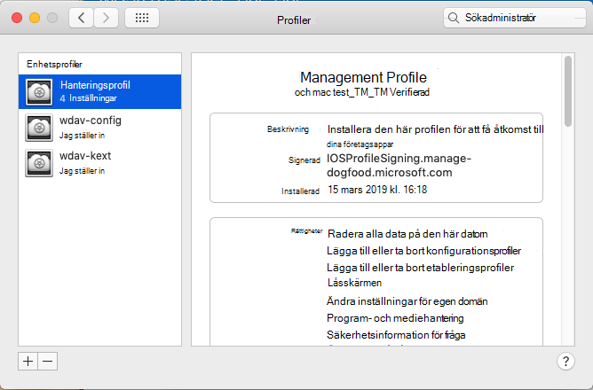
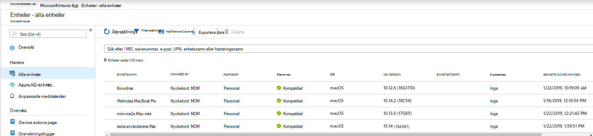
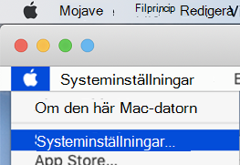
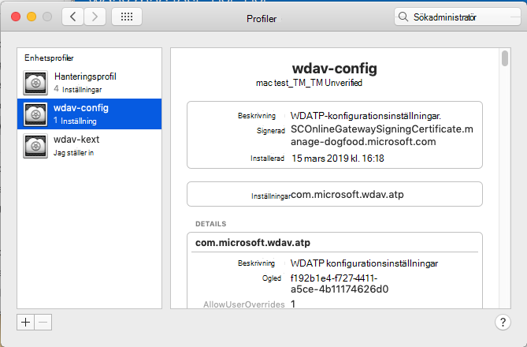

# <a name="intune-based-deployment-for-microsoft-defender-for-endpoint-on-macos"></a>Intune-baserad distribution för Microsoft Defender för Slutpunkt i macOS

[!INCLUDE [Microsoft 365 Defender rebranding](../../includes/microsoft-defender.md)]

**Gäller för:**

- [Microsoft Defender för Endpoint för macOS](microsoft-defender-endpoint-mac.md)

I det här avsnittet beskrivs hur du distribuerar Microsoft Defender för slutpunkt på macOS via Intune. För en lyckad distribution måste du slutföra alla följande steg:

1. [Ladda ned onboarding-paketet](#download-the-onboarding-package)
1. [Konfigurera klientenhet](#client-device-setup)
1. [Godkänna systemtillägg](#approve-system-extensions)
1. [Skapa systemkonfigurationsprofiler](#create-system-configuration-profiles)
1. [Publicera program](#publish-application)

## <a name="prerequisites-and-system-requirements"></a>Krav och systemkrav

Innan du börjar kan du gå [till huvudsidan för Microsoft Defender](microsoft-defender-endpoint-mac.md) för Slutpunkt på macOS för att få en beskrivning av förutsättningarna och systemkraven för den aktuella programvaruversionen.

## <a name="overview"></a>Översikt

I följande tabell sammanfattas de steg du måste vidta för att distribuera och hantera Microsoft Defender för Slutpunkt på Mac-datorer, via Intune. Mer detaljerade anvisningar finns nedan.

| Steg | Exempelfilnamn | BundleIdentifier |
|-|-|-|
| [Ladda ned onboarding-paketet](#download-the-onboarding-package) | WindowsDefenderATPOnboarding__MDATP_wdav.atp.xml | com.microsoft.wdav.atp |
| [Godkänna systemtillägg för Microsoft Defender för Slutpunkt](#approve-system-extensions) | MDATP_SysExt.xml | Uppgift saknas |
| [Godkänna Kernel-tillägg för Microsoft Defender för Slutpunkt](#download-the-onboarding-package) | MDATP_KExt.xml | Uppgift saknas |
| [Bevilja fullständig diskåtkomst till Microsoft Defender för Slutpunkt](#full-disk-access) | MDATP_tcc_Catalina_or_newer.xml | com.microsoft.wdav.tcc |
| [Princip för nätverkstillägg](#network-filter) | MDATP_NetExt.xml | Uppgift saknas |
| [Konfigurera Microsoft AutoUpdate (MAU)](mac-updates.md#intune) | MDATP_Microsoft_AutoUpdate.xml | com.microsoft.autoupdate2 |
| [Konfigurationsinställningar för Microsoft Defender för slutpunkt](mac-preferences.md#intune-profile-1)<br/><br/> **Obs!** Om du planerar att köra en tredjeparts-AV för macOS ställer du in `passiveMode` på `true` . | MDATP_WDAV_and_exclusion_settings_Preferences.xml | com.microsoft.wdav |
| [Konfigurera Microsoft Defender för Endpoint- och MS AutoUpdate-meddelanden (MAU)](mac-updates.md) | MDATP_MDAV_Tray_and_AutoUpdate2.mobileconfig | com.microsoft.autoupdate2 eller com.microsoft.wdav.tray |


## <a name="download-the-onboarding-package"></a>Ladda ned onboarding-paketet

Ladda ned onboarding-paketen från Microsoft Defender Säkerhetscenter:

1. I Microsoft Defender Säkerhetscenter du till Inställningar  >  **onboarding av**  >  **enhetshantering.**

2. Ställ in operativsystemet på **macOS** och distributionsmetoden till **Hantering av mobila enheter /Microsoft Intune.**

    

3. Välj **Hämta introduktionspaket**. Spara den _WindowsDefenderATPOnboardingPackage.zip_ filen i samma katalog.

4. Extrahera innehållet i .zip filen:

    ```bash
    unzip WindowsDefenderATPOnboardingPackage.zip
    ```
    ```Output
    Archive:  WindowsDefenderATPOnboardingPackage.zip
    warning:  WindowsDefenderATPOnboardingPackage.zip appears to use backslashes as path separators
      inflating: intune/kext.xml
      inflating: intune/WindowsDefenderATPOnboarding.xml
      inflating: jamf/WindowsDefenderATPOnboarding.plist
    ```

## <a name="create-system-configuration-profiles"></a>Skapa systemkonfigurationsprofiler

Nästa steg är att skapa systemkonfigurationsprofiler som Microsoft Defender för Endpoint behöver.
Öppna [konfigurationsprofiler Microsoft Endpoint Manager Enheter](https://endpoint.microsoft.com/) **i administrationscentret** för  >  **enheter.**

### <a name="onboarding-blob"></a>Blob för onboarding

Den här profilen innehåller licensinformation för Microsoft Defender för Endpoint, utan att den rapporterar att den inte är licensierad.

1. Välj **Skapa profil** under **Konfigurationsprofiler**.
1. Välj **Plattform** = **macOS**, **Profiltyp** = **Mallar**. **Mallnamn** = **Anpassad**. Klicka på **Skapa**.

    > [!div class="mx-imgBorder"]
    > 

1. Välj ett namn för profilen, t.ex. "MDATP onboarding för macOS". Klicka på **Nästa**.

    > [!div class="mx-imgBorder"]
    > 

1. Välj ett namn för konfigurationsprofilens namn, t.ex. "MDATP onboarding för macOS".
1. Välj intune/WindowsDefenderATPOnboarding.xml som du extraherade från onboarding-paketet ovan som konfigurationsprofilfil.

    > [!div class="mx-imgBorder"]
    > 

1. Klicka på **Nästa**.
1. Tilldela enheter på fliken **Uppgift.** Klicka på **Nästa.**

    > [!div class="mx-imgBorder"]
    > 

1. Granska och **skapa**.
1. Öppna   >  **konfigurationsprofiler för** enheter – du kan se din skapade profil där.

    > [!div class="mx-imgBorder"]
    > 

### <a name="approve-system-extensions"></a>Godkänna systemtillägg

Den här profilen krävs för macOS 10.15 (Catalina) eller nyare. Den ignoreras i äldre macOS.

1. Välj **Skapa profil** under **Konfigurationsprofiler**.
1. Välj **Plattform** = **macOS**, **Profiltyp** = **Mallar**. **Mallnamn** = **Tillägg**. Klicka på **Skapa**.
1. Ge den **här nya** profilen ett namn på fliken Grunder.
1. På fliken **Konfigurationsinställningar** expanderar **du Systemtillägg** och lägger till följande poster i avsnittet **Tillåtna systemtillägg:**

    Paketidentifierare         | Teamidentifierare
    --------------------------|----------------
    com.microsoft.wdav.epsext | UBF8T346G9
    com.microsoft.wdav.netext | UBF8T346G9

    > [!div class="mx-imgBorder"]
    > 

1. På fliken **Uppgifter tilldelar** du den här profilen till **Alla användare & Alla enheter.**
1. Granska och skapa den här konfigurationsprofilen.

### <a name="kernel-extensions"></a>Kernel-tillägg

Den här profilen krävs för macOS 10.15 (Catalina) eller äldre. Det ignoreras på nyare macOS.

> [!CAUTION]
> Apple Silicon-enheter (M1) stöder inte KEXT. Installationen av en konfigurationsprofil som består av KEXT-principer misslyckas på dessa enheter.

1. Välj **Skapa profil** under **Konfigurationsprofiler**.
1. Välj **Plattform** = **macOS**, **Profiltyp** = **Mallar**. **Mallnamn** = **Tillägg**. Klicka på **Skapa**.
1. Ge den **här nya** profilen ett namn på fliken Grunder.
1. Expandera **Kernel-tillägg** på **fliken Konfigurationsinställningar.**
1. Ange **teamidentifierare** **till UBF8T346G9** och klicka på **Nästa**.

    > [!div class="mx-imgBorder"]
    > 

1. På fliken **Uppgifter tilldelar** du den här profilen till **Alla användare & Alla enheter.**
1. Granska och skapa den här konfigurationsprofilen.

### <a name="full-disk-access"></a>Fullständig diskåtkomst

   > [!CAUTION]
   > macOS 10.15 (Catalina) innehåller nya förbättringar av säkerhet och sekretess. Från och med den här versionen kan program som standard inte komma åt vissa platser på disken (till exempel Dokument, Nedladdningar, Skrivbord osv.) utan uttryckligt medgivande. Om inget sådant medgivande getts kan Inte Microsoft Defender för Endpoint skydda din enhet fullt ut.
   >
   > Den här konfigurationsprofilen beviljar Fullständig diskåtkomst till Microsoft Defender för Endpoint. Om du tidigare har konfigurerat Microsoft Defender för Slutpunkt via Intune rekommenderar vi att du uppdaterar distributionen med den här konfigurationsprofilen.

Ladda [**ned fulldisk.mobileconfig från**](https://raw.githubusercontent.com/microsoft/mdatp-xplat/master/macos/mobileconfig/profiles/kext.mobileconfig) vår [GitHub-lagringsplats.](https://github.com/microsoft/mdatp-xplat/tree/master/macos/mobileconfig/profiles)

Följ instruktionerna för [blob för onboarding ovan,](#onboarding-blob) med hjälp av "MDATP Full Disk Access" som profilnamn och nedladdat **fulldisk.mobileconfig** som konfigurationsprofilnamn.

### <a name="network-filter"></a>Nätverksfilter

Som en del av funktionerna Slutpunktsidentifiering och svar inspekterar Microsoft Defender för slutpunkt på macOS sockettrafik och rapporterar den här informationen till Microsoft Defender Säkerhetscenter portalen. Med följande princip kan nätverkstillägget utföra de här funktionerna.

Ladda [**ned netfilter.mobileconfig från**](https://raw.githubusercontent.com/microsoft/mdatp-xplat/master/macos/mobileconfig/profiles/kext.mobileconfig) vår [GitHub-lagringsplats](https://github.com/microsoft/mdatp-xplat/tree/master/macos/mobileconfig/profiles).

Följ instruktionerna för [blob för onboarding](#onboarding-blob) ovan, med "MDATP Network Filter" som profilnamn och nedladdat **netfilter.mobileconfig** som konfigurationsprofilnamn.

### <a name="notifications"></a>Meddelanden

Den här profilen används för att tillåta Microsoft Defender för Slutpunkt på macOS och Microsoft Auto Update för att visa meddelanden i användargränssnittet i macOS 10.15 (Catalina) eller nyare.

Ladda [**ned notif.mobileconfig från**](https://raw.githubusercontent.com/microsoft/mdatp-xplat/master/macos/mobileconfig/profiles/kext.mobileconfig) vår [GitHub-lagringsplats](https://github.com/microsoft/mdatp-xplat/tree/master/macos/mobileconfig/profiles).

Följ instruktionerna för [blob för onboarding](#onboarding-blob) ovan, med "MDATP Network Filter" som profilnamn och nedladdat **notif.mobileconfig** som konfigurationsprofilnamn.

### <a name="view-status"></a>Visa status

När Intune-ändringarna har spridits till de registrerade enheterna kan du se dem under **Övervaka**  >  **enhetsstatus:**

> [!div class="mx-imgBorder"]
> 

## <a name="publish-application"></a>Publicera program

I det här steget kan du distribuera Microsoft Defender för Endpoint till registrerade datorer.

1. Öppna [Microsoft Endpoint Manager i](https://endpoint.microsoft.com/) **administrationscentret.**

    > [!div class="mx-imgBorder"]
    > 

1. Välj Efter plattform > macOS-> Lägg till.
1. Välj **Apptyp** = **macOS och** klicka på **Välj.**

    > [!div class="mx-imgBorder"]
    > 

1. Behåll standardvärdena och klicka på **Nästa.**

    > [!div class="mx-imgBorder"]
    > 

1. Lägg till uppgifter och klicka på **Nästa.**

    > [!div class="mx-imgBorder"]
    > 

1. Granska och **skapa**.
1. Du kan besöka **Appar**  >  **Efter plattform**  >  **macOS** för att se det i listan över alla program.

    > [!div class="mx-imgBorder"]
    > 

(Detaljerad information finns på [Intune-sidan för Defender-distribution](/mem/intune/apps/apps-advanced-threat-protection-macos).)

   > [!CAUTION]
   > Du måste skapa alla nödvändiga konfigurationsprofiler och skicka dem till alla datorer, enligt ovan.

## <a name="client-device-setup"></a>Konfigurera klientenhet

Du behöver ingen särskild etablering för en Mac-enhet utöver en Företagsportal [standardinstallation.](/intune-user-help/enroll-your-device-in-intune-macos-cp)

1. Bekräfta enhetshantering.

    > [!div class="mx-imgBorder"]
    > 

    Välj **Öppna systeminställningar**, leta **reda på Hanteringsprofil** i listan och välj **Godkänn...**. Din hanteringsprofil visades som **verifierad:**

    

2. Välj **Fortsätt** och slutför registreringen.

   Nu kan du registrera fler enheter. Du kan också registrera dem senare, när du har slutfört konfiguration av systemkonfiguration och programpaket.

3. Öppna Hantera enheter alla enheter  >  **i**  >  Intune. Här kan du se din enhet bland dem som listas:

   > [!div class="mx-imgBorder"]
   > 

## <a name="verify-client-device-state"></a>Verifiera status för klientenhet

1. När konfigurationsprofilerna har distribuerats till dina enheter öppnar du **Systeminställningar**  >  **på** din Mac-enhet.

    > [!div class="mx-imgBorder"]
    > 

    

2. Kontrollera att följande konfigurationsprofiler finns och är installerade. **Hanteringsprofilen** ska vara Intune-systemprofilen. _Wdav-config_ _och wdav-kext_ är systemkonfigurationsprofiler som lagts till i Intune:

    

3. Du bör även se ikonen Microsoft Defender för Slutpunkt i det övre högra hörnet:

    > [!div class="mx-imgBorder"]
    > 

## <a name="troubleshooting"></a>Felsökning

Problem: Ingen licens hittades.

Lösning: Följ stegen ovan för att skapa en enhetsprofil med hjälp av WindowsDefenderATPOnboarding.xml.

## <a name="logging-installation-issues"></a>Loggningsinstallationsproblem

Mer information om hur du hittar den automatiskt genererade loggen som skapas av installationsprogrammet när ett fel uppstår finns i Problem [med loggningsinstallation.](mac-resources.md#logging-installation-issues)

## <a name="uninstallation"></a>Avinstallation

Mer [information om hur](mac-resources.md#uninstalling) du tar bort Microsoft Defender för Slutpunkt på macOS från klientenheter finns i Avinstallera.
