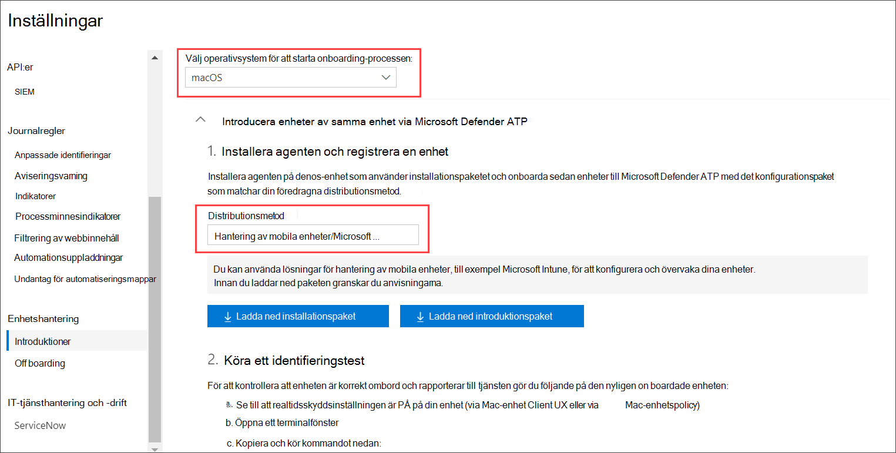
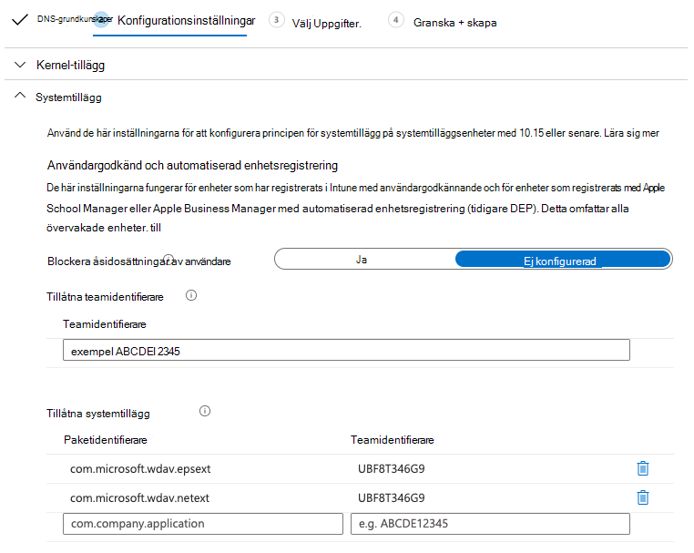

# <a name="intune-based-deployment-for-microsoft-defender-for-endpoint-for-mac"></a>Intune-baserad distribution för Microsoft Defender för Endpoint för Mac

[!INCLUDE [Microsoft 365 Defender rebranding](../../includes/microsoft-defender.md)]


> [!NOTE]
> I den här dokumentationen förklaras den äldre metoden för att distribuera och konfigurera Microsoft Defender för Endpoint på macOS-enheter. Den ursprungliga upplevelsen finns nu i MEM-konsolen. Lanseringen av det inbyggda användargränssnittet i MEM-konsolen ger administratörer ett mycket enklare sätt att konfigurera och distribuera programmet och skicka det till macOS-enheter. <br> <br>
>Blogginlägget [MEM förenklar distribution av Microsoft Defender för Endpoint för macOS förklarar](https://techcommunity.microsoft.com/t5/microsoft-endpoint-manager-blog/microsoft-endpoint-manager-simplifies-deployment-of-microsoft/ba-p/1322995) de nya funktionerna. Om du vill konfigurera appen går du [till Inställningar för Microsoft Defender för Slutpunkt för Mac i Microsoft InTune.](https://docs.microsoft.com/mem/intune/protect/antivirus-microsoft-defender-settings-macos) Om du vill distribuera appen går du till Lägg [till Microsoft Defender för slutpunkt till macOS-enheter med Microsoft Intune.](https://docs.microsoft.com/mem/intune/apps/apps-advanced-threat-protection-macos)

**Gäller för:**

- [Microsoft Defender för Slutpunkt för Mac](microsoft-defender-endpoint-mac.md)

I det här avsnittet beskrivs hur du distribuerar Microsoft Defender för Slutpunkt för Mac via Intune. För en lyckad distribution måste du slutföra alla följande steg:

1. [Ladda ned installation- och onboarding-paket](#download-installation-and-onboarding-packages)
1. [Konfigurera klientenhet](#client-device-setup)
1. [Godkänna systemtillägg](#approve-system-extensions)
1. [Skapa systemkonfigurationsprofiler](#create-system-configuration-profiles)
1. [Publicera program](#publish-application)

## <a name="prerequisites-and-system-requirements"></a>Krav och systemkrav

Innan du börjar kan du gå [till huvudsidan för Microsoft Defender](microsoft-defender-endpoint-mac.md) för Slutpunkt för Mac för att få en beskrivning av förutsättningarna och systemkraven för den aktuella programvaruversionen.

## <a name="overview"></a>Översikt

I följande tabell sammanfattas de steg du måste vidta för att distribuera och hantera Microsoft Defender för Endpoint för Mac-datorer via Intune. Mer detaljerade anvisningar finns nedan.

| Steg | Exempelfilnamn | BundleIdentifier |
|-|-|-|
| [Ladda ned installation- och onboarding-paket](#download-installation-and-onboarding-packages) | WindowsDefenderATPOnboarding__MDATP_wdav.atp.xml | com.microsoft.wdav.atp |
| [Godkänna systemtillägg för Microsoft Defender för Slutpunkt](#approve-system-extensions) | MDATP_SysExt.xml | Uppgift saknas |
| [Godkänna Kernel-tillägg för Microsoft Defender för Slutpunkt](#download-installation-and-onboarding-packages) | MDATP_KExt.xml | Uppgift saknas |
| [Bevilja fullständig diskåtkomst till Microsoft Defender för Slutpunkt](#create-system-configuration-profiles-step-8) | MDATP_tcc_Catalina_or_newer.xml | com.microsoft.wdav.tcc |
| [Princip för nätverkstillägg](#create-system-configuration-profiles-step-9) | MDATP_NetExt.xml | Uppgift saknas |
| [Konfigurera Microsoft AutoUpdate (MAU)](https://docs.microsoft.com/microsoft-365/security/defender-endpoint/mac-updates#intune) | MDATP_Microsoft_AutoUpdate.xml | com.microsoft.autoupdate2 |
| [Konfigurationsinställningar för Microsoft Defender för slutpunkt](https://docs.microsoft.com/microsoft-365/security/defender-endpoint/mac-preferences#intune-profile-1)<br/><br/> **Obs!** Om du planerar att köra en tredjeparts-AV för macOS ställer du in `passiveMode` på `true` . | MDATP_WDAV_and_exclusion_settings_Preferences.xml | com.microsoft.wdav |
| [Konfigurera Microsoft Defender för Endpoint- och MS AutoUpdate-meddelanden (MAU)](#create-system-configuration-profiles-step-10) | MDATP_MDAV_Tray_and_AutoUpdate2.mobileconfig | com.microsoft.autoupdate2 eller com.microsoft.wdav.tray |

## <a name="download-installation-and-onboarding-packages"></a>Ladda ned installation- och onboarding-paket

Ladda ned installation- och onboarding-paketen från Microsoft Defender Säkerhetscenter:

1. I Microsoft Defender Säkerhetscenter går du till **Inställningar för** registrering  >  **av**  >  **enhetshantering.**

2. Ställ in operativsystemet på **macOS** och distributionsmetoden till **Mobile Device Management/Microsoft Intune.**

    

3. Välj **Ladda ned installationspaketet**. Spara den som _wdav.pkg_ i en lokal katalog.

4. Välj **Hämta introduktionspaket**. Spara den _WindowsDefenderATPOnboardingPackage.zip_ filen i samma katalog.

5. Ladda **ned IntuneAppUtil** från [https://docs.microsoft.com/intune/lob-apps-macos](https://docs.microsoft.com/intune/lob-apps-macos) .

6. Kontrollera att du har de tre filerna i kommandotolken.
  

    ```bash
    ls -l
    ```

    ```Output
    total 721688
    -rw-r--r--  1 test  staff     269280 Mar 15 11:25 IntuneAppUtil
    -rw-r--r--  1 test  staff      11821 Mar 15 09:23 WindowsDefenderATPOnboardingPackage.zip
    -rw-r--r--  1 test  staff  354531845 Mar 13 08:57 wdav.pkg
    ```
7. Extrahera innehållet i ZIP-filerna:

    ```bash
    unzip WindowsDefenderATPOnboardingPackage.zip
    ```
    ```Output
    Archive:  WindowsDefenderATPOnboardingPackage.zip
    warning:  WindowsDefenderATPOnboardingPackage.zip appears to use backslashes as path separators
      inflating: intune/kext.xml
      inflating: intune/WindowsDefenderATPOnboarding.xml
      inflating: jamf/WindowsDefenderATPOnboarding.plist
    ```

8. Gör IntuneAppUtil till en körbar:

    ```bash
    chmod +x IntuneAppUtil
    ```

9. Skapa wdav.pkg.intunemac-paketet från wdav.pkg:

    ```bash
    ./IntuneAppUtil -c wdav.pkg -o . -i "com.microsoft.wdav" -n "1.0.0"
    ```
    ```Output
    Microsoft Intune Application Utility for Mac OS X
    Version: 1.0.0.0
    Copyright 2018 Microsoft Corporation

    Creating intunemac file for /Users/test/Downloads/wdav.pkg
    Composing the intunemac file output
    Output written to ./wdav.pkg.intunemac.

    IntuneAppUtil successfully processed "wdav.pkg",
    to deploy refer to the product documentation.
    ```

## <a name="client-device-setup"></a>Konfigurera klientenhet

Du behöver ingen särskild etablering för en Mac-enhet utöver en vanlig [företagsportalinstallation.](https://docs.microsoft.com/intune-user-help/enroll-your-device-in-intune-macos-cp)

1. Bekräfta enhetshantering.

    Välj **Öppna systeminställningar**, leta **reda på Hanteringsprofil** i listan och välj **Godkänn...**. Din hanteringsprofil visades som **verifierad:**

    

2. Välj **Fortsätt** och slutför registreringen.

   Nu kan du registrera fler enheter. Du kan också registrera dem senare, när du har slutfört konfiguration av systemkonfiguration och programpaket.

3. Öppna Hantera enheter alla enheter  >  **i**  >  Intune. Här kan du se din enhet bland dem som listas:

   > [!div class="mx-imgBorder"]
   > 

## <a name="approve-system-extensions"></a>Godkänna systemtillägg

Så här godkänner du systemtilläggen:

1. Öppna Hantera enhetskonfiguration **i**  >  Intune. Välj **Hantera**  >  **profiler**  >  **skapa profil**.

2. Välj ett namn för profilen. Ändra **Platform=macOS** till **Profiltyp=Tillägg.** Välj **Skapa**.

3. Ge den **här nya** profilen ett namn på fliken Grunder.

4. På fliken **Konfigurationsinställningar** lägger du till följande poster i avsnittet Tillåtna **systemtillägg:**

    Paketidentifierare         | Teamidentifierare
    --------------------------|----------------
    com.microsoft.wdav.epsext | UBF8T346G9
    com.microsoft.wdav.netext | UBF8T346G9

    > [!div class="mx-imgBorder"]
    > 

5. På fliken **Uppgifter tilldelar** du den här profilen till **Alla användare & Alla enheter.**

6. Granska och skapa den här konfigurationsprofilen.

## <a name="create-system-configuration-profiles"></a>Skapa systemkonfigurationsprofiler

1. Öppna Hantera enhetskonfiguration **i**  >  Intune. Välj **Hantera**  >  **profiler**  >  **skapa profil**.

2. Välj ett namn för profilen. Ändra **Platform=macOS** till **Profiltyp=Anpassad**. Välj **Konfigurera**.

3. Öppna konfigurationsprofilen och ladda upp intune/kext.xml. Den här filen har skapats i ett av de föregående avsnitten.

4. Välj **OK**.

    

5. Välj   >  **Hantera uppgifter.** På fliken **Inkludera** väljer du **Tilldela till alla användare & alla enheter.**

6. Upprepa steg 1 till 5 för fler profiler.

7. Skapa en annan profil, ge den ett namn och ladda upp intune/WindowsDefenderATPOnboarding.xml filen.

8. Ladda **ned fulldisk.mobileconfig från** vår [GitHub-lagringsplats](https://raw.githubusercontent.com/microsoft/mdatp-xplat/master/macos/mobileconfig/profiles/fulldisk.mobileconfig) och spara den **tcc.xml**. Skapa en annan profil, ge den ett namn och ladda upp filen till den.<a name="create-system-configuration-profiles-step-8" id = "create-system-configuration-profiles-step-8"></a>

   > [!CAUTION]
   > macOS 10.15 (Catalina) innehåller nya förbättringar av säkerhet och sekretess. Från och med den här versionen kan program som standard inte komma åt vissa platser på disken (till exempel Dokument, Nedladdningar, Skrivbord osv.) utan uttryckligt medgivande. Om inget sådant medgivande getts kan Inte Microsoft Defender för Endpoint skydda din enhet fullt ut.
   >
   > Den här konfigurationsprofilen beviljar Fullständig diskåtkomst till Microsoft Defender för Endpoint. Om du tidigare har konfigurerat Microsoft Defender för Slutpunkt via Intune rekommenderar vi att du uppdaterar distributionen med den här konfigurationsprofilen.

9. Som en del av funktionerna Identifiering av slutpunkt och svar inspekterar Microsoft Defender för Slutpunkt för Mac sockettrafik och rapporterar den här informationen till Microsoft Defender Säkerhetscenter-portalen. Med följande princip kan nätverkstillägget utföra de här funktionerna. Ladda **ned netfilter.mobileconfig** från vår [GitHub-lagringsplats](https://raw.githubusercontent.com/microsoft/mdatp-xplat/master/macos/mobileconfig/profiles/netfilter.mobileconfig), spara den som netext.xml och distribuera den med samma steg som i föregående avsnitt. <a name = "create-system-configuration-profiles-step-9" id = "create-system-configuration-profiles-step-9"></a>

10. Om du vill tillåta Microsoft Defender för Slutpunkt för Mac och Microsoft Auto Update att visa meddelanden i användargränssnittet på macOS 10.15 (Catalina) laddar du ned från vår GitHub-lagringsplats och importerar den som en anpassad `notif.mobileconfig` nyttolast. [](https://raw.githubusercontent.com/microsoft/mdatp-xplat/master/macos/mobileconfig/profiles/notif.mobileconfig) <a name = "create-system-configuration-profiles-step-10" id = "create-system-configuration-profiles-step-10"></a>

11. Välj **Hantera > uppgifter**.  På fliken **Inkludera** väljer du **Tilldela till alla användare & alla enheter.**

När Intune-ändringarna har spridits till de registrerade enheterna kan du se dem under **Övervaka**  >  **enhetsstatus:**

> [!div class="mx-imgBorder"]
> 

## <a name="publish-application"></a>Publicera program

1. Öppna bladet Hantera klientappar **> Intune.** Välj **Appar > Lägg till**.

2. Välj **Apptyp=Annat/verksamhetsområde.**

3. Välj **file=wdav.pkg.intunemac**. Välj **OK för** att ladda upp.

4. Välj **Konfigurera** och lägg till den information som krävs.

5. Använd **macOS High Sierra 10.14** som lägsta OPERATIVSYSTEM.

6. Ställ *in Ignorera programversion* på **Ja.** Andra inställningar kan vara valfria värden.

    > [!CAUTION]
    > Inställningen *Ignorera appversion* **till Nej** påverkar programmets möjlighet att ta emot uppdateringar via Microsoft AutoUpdate. Mer information om hur produkten uppdateras finns i Distribuera uppdateringar för Microsoft Defender för Endpoint för [Mac.](mac-updates.md)
    >
    > Om versionen som laddas upp av Intune är lägre än versionen på enheten installeras den lägre versionen, vilket innebär att Microsoft Defender för Slutpunkt nedgraderas. Det kan resultera i att programmet inte fungerar. Mer information om hur produkten uppdateras finns i Distribuera uppdateringar för Microsoft Defender för Endpoint för [Mac.](mac-updates.md) Om du har distribuerat Microsoft Defender för Slutpunkt *med Ignorera app-version* inställd **på Nej** ändrar du det till **Ja.** Om Microsoft Defender för slutpunkt fortfarande inte kan installeras på en klientenhet avinstallerar du Microsoft Defender för Endpoint och skickar den uppdaterade principen.
     
    > [!div class="mx-imgBorder"]
    > 

7. Välj **OK och** Lägg **till**.

    > [!div class="mx-imgBorder"]
    > 

8. Det kan ta en stund att ladda upp paketet. När det är klart väljer du paketet i listan och går till **Uppgifter och Lägg** till **grupp.**

    > [!div class="mx-imgBorder"]
    > 

9. Ändra **tilldelningstyp till** **Obligatoriskt.**

10. Välj **Grupper som ingår.** Välj **Gör den här appen obligatorisk för alla enheter=Ja.** Välj **Välj grupp för att** inkludera och lägga till en grupp som innehåller de användare du vill rikta. Välj **OK** och **Spara**.

    > [!div class="mx-imgBorder"]
    > 

11. Efter en tid kommer programmet att publiceras på alla registrerade enheter. Den visas i Övervaka enhet  >  **under** **Enhetsinstallationsstatus:**

    > [!div class="mx-imgBorder"]
    > 

## <a name="verify-client-device-state"></a>Verifiera status för klientenhet

1. När konfigurationsprofilerna har distribuerats till dina enheter öppnar du **Systeminställningar**  >  **på** din Mac-enhet.

    <br/>
    

2. Kontrollera att följande konfigurationsprofiler finns och är installerade. **Hanteringsprofilen** ska vara Intune-systemprofilen. _Wdav-config_ _och wdav-kext_ är systemkonfigurationsprofiler som har lagts till i Intune: 

3. Du bör även se Microsoft Defender-ikonen i det övre högra hörnet:

    > [!div class="mx-imgBorder"]
    > 

## <a name="troubleshooting"></a>Felsökning

Problem: Ingen licens hittades

Lösning: Följ stegen ovan för att skapa en enhetsprofil med WindowsDefenderATPOnboarding.xml

## <a name="logging-installation-issues"></a>Loggningsinstallationsproblem

Mer information om hur du hittar den automatiskt genererade loggen som skapas av installationsprogrammet när ett fel uppstår finns i Problem [med loggningsinstallation.](mac-resources.md#logging-installation-issues)

## <a name="uninstallation"></a>Avinstallation

Mer [information om hur](mac-resources.md#uninstalling) du tar bort Microsoft Defender för Slutpunkt för Mac från klientenheter finns i Avinstallera.
