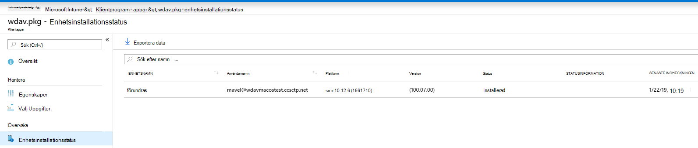
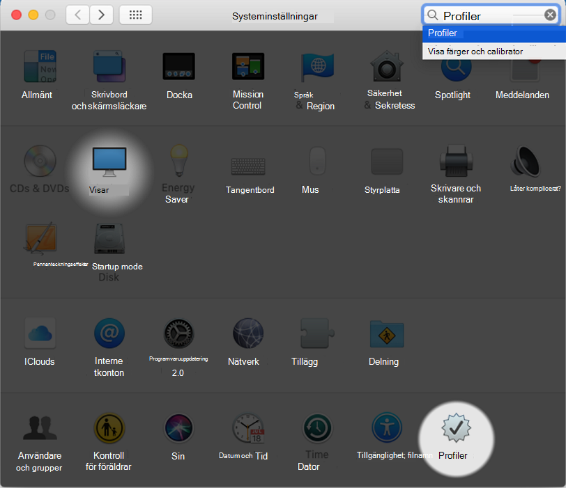

# <a name="intune-based-deployment-for-microsoft-defender-for-endpoint-for-mac"></a><span data-ttu-id="c0766-104">Intune-baserad distribution för Microsoft Defender för Endpoint för Mac</span><span class="sxs-lookup"><span data-stu-id="c0766-104">Intune-based deployment for Microsoft Defender for Endpoint for Mac</span></span>

[!INCLUDE [Microsoft 365 Defender rebranding](../../includes/microsoft-defender.md)]


> [!NOTE]
> <span data-ttu-id="c0766-105">I den här dokumentationen förklaras den äldre metoden för att distribuera och konfigurera Microsoft Defender för Endpoint på macOS-enheter.</span><span class="sxs-lookup"><span data-stu-id="c0766-105">This documentation explains the legacy method for deploying and configuring Microsoft Defender for Endpoint on macOS devices.</span></span> <span data-ttu-id="c0766-106">Den ursprungliga upplevelsen finns nu i MEM-konsolen.</span><span class="sxs-lookup"><span data-stu-id="c0766-106">The native experience is now available in the MEM console.</span></span> <span data-ttu-id="c0766-107">Lanseringen av det inbyggda användargränssnittet i MEM-konsolen ger administratörer ett mycket enklare sätt att konfigurera och distribuera programmet och skicka det till macOS-enheter.</span><span class="sxs-lookup"><span data-stu-id="c0766-107">The release of the native UI in the MEM console provide admins with a much simpler way to configure and deploy the application and send it down to macOS devices.</span></span> <br> <br>
><span data-ttu-id="c0766-108">Blogginlägget [MEM förenklar distribution av Microsoft Defender för Endpoint för macOS förklarar](https://techcommunity.microsoft.com/t5/microsoft-endpoint-manager-blog/microsoft-endpoint-manager-simplifies-deployment-of-microsoft/ba-p/1322995) de nya funktionerna.</span><span class="sxs-lookup"><span data-stu-id="c0766-108">The blog post [MEM simplifies deployment of Microsoft Defender for Endpoint for macOS](https://techcommunity.microsoft.com/t5/microsoft-endpoint-manager-blog/microsoft-endpoint-manager-simplifies-deployment-of-microsoft/ba-p/1322995) explains the new features.</span></span> <span data-ttu-id="c0766-109">Om du vill konfigurera appen går du [till Inställningar för Microsoft Defender för Slutpunkt för Mac i Microsoft InTune.](https://docs.microsoft.com/mem/intune/protect/antivirus-microsoft-defender-settings-macos)</span><span class="sxs-lookup"><span data-stu-id="c0766-109">To configure the app, go to [Settings for Microsoft Defender for Endpoint for Mac in Microsoft InTune](https://docs.microsoft.com/mem/intune/protect/antivirus-microsoft-defender-settings-macos).</span></span> <span data-ttu-id="c0766-110">Om du vill distribuera appen går du till Lägg [till Microsoft Defender för slutpunkt till macOS-enheter med Microsoft Intune.](https://docs.microsoft.com/mem/intune/apps/apps-advanced-threat-protection-macos)</span><span class="sxs-lookup"><span data-stu-id="c0766-110">To deploy the app, go to [Add Microsoft Defender for Endpoint to macOS devices using Microsoft Intune](https://docs.microsoft.com/mem/intune/apps/apps-advanced-threat-protection-macos).</span></span>

<span data-ttu-id="c0766-111">**Gäller för:**</span><span class="sxs-lookup"><span data-stu-id="c0766-111">**Applies to:**</span></span>

- [<span data-ttu-id="c0766-112">Microsoft Defender för Slutpunkt för Mac</span><span class="sxs-lookup"><span data-stu-id="c0766-112">Microsoft Defender for Endpoint for Mac</span></span>](microsoft-defender-endpoint-mac.md)

<span data-ttu-id="c0766-113">I det här avsnittet beskrivs hur du distribuerar Microsoft Defender för Slutpunkt för Mac via Intune.</span><span class="sxs-lookup"><span data-stu-id="c0766-113">This topic describes how to deploy Microsoft Defender for Endpoint for Mac through Intune.</span></span> <span data-ttu-id="c0766-114">För en lyckad distribution måste du slutföra alla följande steg:</span><span class="sxs-lookup"><span data-stu-id="c0766-114">A successful deployment requires the completion of all of the following steps:</span></span>

1. [<span data-ttu-id="c0766-115">Ladda ned installation- och onboarding-paket</span><span class="sxs-lookup"><span data-stu-id="c0766-115">Download installation and onboarding packages</span></span>](#download-installation-and-onboarding-packages)
1. [<span data-ttu-id="c0766-116">Konfigurera klientenhet</span><span class="sxs-lookup"><span data-stu-id="c0766-116">Client device setup</span></span>](#client-device-setup)
1. [<span data-ttu-id="c0766-117">Godkänna systemtillägg</span><span class="sxs-lookup"><span data-stu-id="c0766-117">Approve system extensions</span></span>](#approve-system-extensions)
1. [<span data-ttu-id="c0766-118">Skapa systemkonfigurationsprofiler</span><span class="sxs-lookup"><span data-stu-id="c0766-118">Create System Configuration profiles</span></span>](#create-system-configuration-profiles)
1. [<span data-ttu-id="c0766-119">Publicera program</span><span class="sxs-lookup"><span data-stu-id="c0766-119">Publish application</span></span>](#publish-application)

## <a name="prerequisites-and-system-requirements"></a><span data-ttu-id="c0766-120">Krav och systemkrav</span><span class="sxs-lookup"><span data-stu-id="c0766-120">Prerequisites and system requirements</span></span>

<span data-ttu-id="c0766-121">Innan du börjar kan du gå [till huvudsidan för Microsoft Defender](microsoft-defender-endpoint-mac.md) för Slutpunkt för Mac för att få en beskrivning av förutsättningarna och systemkraven för den aktuella programvaruversionen.</span><span class="sxs-lookup"><span data-stu-id="c0766-121">Before you get started, see [the main Microsoft Defender for Endpoint for Mac page](microsoft-defender-endpoint-mac.md) for a description of prerequisites and system requirements for the current software version.</span></span>

## <a name="overview"></a><span data-ttu-id="c0766-122">Översikt</span><span class="sxs-lookup"><span data-stu-id="c0766-122">Overview</span></span>

<span data-ttu-id="c0766-123">I följande tabell sammanfattas de steg du måste vidta för att distribuera och hantera Microsoft Defender för Endpoint för Mac-datorer via Intune.</span><span class="sxs-lookup"><span data-stu-id="c0766-123">The following table summarizes the steps you would need to take to deploy and manage Microsoft Defender for Endpoint for Macs, via Intune.</span></span> <span data-ttu-id="c0766-124">Mer detaljerade anvisningar finns nedan.</span><span class="sxs-lookup"><span data-stu-id="c0766-124">More detailed steps are available below.</span></span>

| <span data-ttu-id="c0766-125">Steg</span><span class="sxs-lookup"><span data-stu-id="c0766-125">Step</span></span> | <span data-ttu-id="c0766-126">Exempelfilnamn</span><span class="sxs-lookup"><span data-stu-id="c0766-126">Sample file names</span></span> | <span data-ttu-id="c0766-127">BundleIdentifier</span><span class="sxs-lookup"><span data-stu-id="c0766-127">BundleIdentifier</span></span> |
|-|-|-|
| [<span data-ttu-id="c0766-128">Ladda ned installation- och onboarding-paket</span><span class="sxs-lookup"><span data-stu-id="c0766-128">Download installation and onboarding packages</span></span>](#download-installation-and-onboarding-packages) | <span data-ttu-id="c0766-129">WindowsDefenderATPOnboarding__MDATP_wdav.atp.xml</span><span class="sxs-lookup"><span data-stu-id="c0766-129">WindowsDefenderATPOnboarding__MDATP_wdav.atp.xml</span></span> | <span data-ttu-id="c0766-130">com.microsoft.wdav.atp</span><span class="sxs-lookup"><span data-stu-id="c0766-130">com.microsoft.wdav.atp</span></span> |
| [<span data-ttu-id="c0766-131">Godkänna systemtillägg för Microsoft Defender för Slutpunkt</span><span class="sxs-lookup"><span data-stu-id="c0766-131">Approve System Extension for Microsoft Defender for Endpoint</span></span>](#approve-system-extensions) | <span data-ttu-id="c0766-132">MDATP_SysExt.xml</span><span class="sxs-lookup"><span data-stu-id="c0766-132">MDATP_SysExt.xml</span></span> | <span data-ttu-id="c0766-133">Uppgift saknas</span><span class="sxs-lookup"><span data-stu-id="c0766-133">N/A</span></span> |
| [<span data-ttu-id="c0766-134">Godkänna Kernel-tillägg för Microsoft Defender för Slutpunkt</span><span class="sxs-lookup"><span data-stu-id="c0766-134">Approve Kernel Extension for Microsoft Defender for Endpoint</span></span>](#download-installation-and-onboarding-packages) | <span data-ttu-id="c0766-135">MDATP_KExt.xml</span><span class="sxs-lookup"><span data-stu-id="c0766-135">MDATP_KExt.xml</span></span> | <span data-ttu-id="c0766-136">Uppgift saknas</span><span class="sxs-lookup"><span data-stu-id="c0766-136">N/A</span></span> |
| [<span data-ttu-id="c0766-137">Bevilja fullständig diskåtkomst till Microsoft Defender för Slutpunkt</span><span class="sxs-lookup"><span data-stu-id="c0766-137">Grant full disk access to Microsoft Defender for Endpoint</span></span>](#create-system-configuration-profiles-step-8) | <span data-ttu-id="c0766-138">MDATP_tcc_Catalina_or_newer.xml</span><span class="sxs-lookup"><span data-stu-id="c0766-138">MDATP_tcc_Catalina_or_newer.xml</span></span> | <span data-ttu-id="c0766-139">com.microsoft.wdav.tcc</span><span class="sxs-lookup"><span data-stu-id="c0766-139">com.microsoft.wdav.tcc</span></span> |
| [<span data-ttu-id="c0766-140">Princip för nätverkstillägg</span><span class="sxs-lookup"><span data-stu-id="c0766-140">Network Extension policy</span></span>](#create-system-configuration-profiles-step-9) | <span data-ttu-id="c0766-141">MDATP_NetExt.xml</span><span class="sxs-lookup"><span data-stu-id="c0766-141">MDATP_NetExt.xml</span></span> | <span data-ttu-id="c0766-142">Uppgift saknas</span><span class="sxs-lookup"><span data-stu-id="c0766-142">N/A</span></span> |
| [<span data-ttu-id="c0766-143">Konfigurera Microsoft AutoUpdate (MAU)</span><span class="sxs-lookup"><span data-stu-id="c0766-143">Configure Microsoft AutoUpdate (MAU)</span></span>](https://docs.microsoft.com/microsoft-365/security/defender-endpoint/mac-updates#intune) | <span data-ttu-id="c0766-144">MDATP_Microsoft_AutoUpdate.xml</span><span class="sxs-lookup"><span data-stu-id="c0766-144">MDATP_Microsoft_AutoUpdate.xml</span></span> | <span data-ttu-id="c0766-145">com.microsoft.autoupdate2</span><span class="sxs-lookup"><span data-stu-id="c0766-145">com.microsoft.autoupdate2</span></span> |
| [<span data-ttu-id="c0766-146">Konfigurationsinställningar för Microsoft Defender för slutpunkt</span><span class="sxs-lookup"><span data-stu-id="c0766-146">Microsoft Defender for Endpoint configuration settings</span></span>](https://docs.microsoft.com/microsoft-365/security/defender-endpoint/mac-preferences#intune-profile-1)<br/><br/> <span data-ttu-id="c0766-147">**Obs!** Om du planerar att köra en tredjeparts-AV för macOS ställer du in `passiveMode` på `true` .</span><span class="sxs-lookup"><span data-stu-id="c0766-147">**Note:** If you're planning to run a third-party AV for macOS, set `passiveMode` to `true`.</span></span> | <span data-ttu-id="c0766-148">MDATP_WDAV_and_exclusion_settings_Preferences.xml</span><span class="sxs-lookup"><span data-stu-id="c0766-148">MDATP_WDAV_and_exclusion_settings_Preferences.xml</span></span> | <span data-ttu-id="c0766-149">com.microsoft.wdav</span><span class="sxs-lookup"><span data-stu-id="c0766-149">com.microsoft.wdav</span></span> |
| [<span data-ttu-id="c0766-150">Konfigurera Microsoft Defender för Endpoint- och MS AutoUpdate-meddelanden (MAU)</span><span class="sxs-lookup"><span data-stu-id="c0766-150">Configure Microsoft Defender for Endpoint and MS AutoUpdate (MAU) notifications</span></span>](#create-system-configuration-profiles-step-10) | <span data-ttu-id="c0766-151">MDATP_MDAV_Tray_and_AutoUpdate2.mobileconfig</span><span class="sxs-lookup"><span data-stu-id="c0766-151">MDATP_MDAV_Tray_and_AutoUpdate2.mobileconfig</span></span> | <span data-ttu-id="c0766-152">com.microsoft.autoupdate2 eller com.microsoft.wdav.tray</span><span class="sxs-lookup"><span data-stu-id="c0766-152">com.microsoft.autoupdate2 or com.microsoft.wdav.tray</span></span> |

## <a name="download-installation-and-onboarding-packages"></a><span data-ttu-id="c0766-153">Ladda ned installation- och onboarding-paket</span><span class="sxs-lookup"><span data-stu-id="c0766-153">Download installation and onboarding packages</span></span>

<span data-ttu-id="c0766-154">Ladda ned installation- och onboarding-paketen från Microsoft Defender Säkerhetscenter:</span><span class="sxs-lookup"><span data-stu-id="c0766-154">Download the installation and onboarding packages from Microsoft Defender Security Center:</span></span>

1. <span data-ttu-id="c0766-155">I Microsoft Defender Säkerhetscenter går du till **Inställningar för** registrering  >  **av**  >  **enhetshantering.**</span><span class="sxs-lookup"><span data-stu-id="c0766-155">In Microsoft Defender Security Center, go to **Settings** > **Device Management** > **Onboarding**.</span></span>

2. <span data-ttu-id="c0766-156">Ställ in operativsystemet på **macOS** och distributionsmetoden till **Mobile Device Management/Microsoft Intune.**</span><span class="sxs-lookup"><span data-stu-id="c0766-156">Set the operating system to **macOS** and the deployment method to **Mobile Device Management / Microsoft Intune**.</span></span>

    

3. <span data-ttu-id="c0766-158">Välj **Ladda ned installationspaketet**.</span><span class="sxs-lookup"><span data-stu-id="c0766-158">Select **Download installation package**.</span></span> <span data-ttu-id="c0766-159">Spara den som _wdav.pkg_ i en lokal katalog.</span><span class="sxs-lookup"><span data-stu-id="c0766-159">Save it as _wdav.pkg_ to a local directory.</span></span>

4. <span data-ttu-id="c0766-160">Välj **Hämta introduktionspaket**.</span><span class="sxs-lookup"><span data-stu-id="c0766-160">Select **Download onboarding package**.</span></span> <span data-ttu-id="c0766-161">Spara den _WindowsDefenderATPOnboardingPackage.zip_ filen i samma katalog.</span><span class="sxs-lookup"><span data-stu-id="c0766-161">Save it as _WindowsDefenderATPOnboardingPackage.zip_ to the same directory.</span></span>

5. <span data-ttu-id="c0766-162">Ladda **ned IntuneAppUtil** från [https://docs.microsoft.com/intune/lob-apps-macos](https://docs.microsoft.com/intune/lob-apps-macos) .</span><span class="sxs-lookup"><span data-stu-id="c0766-162">Download **IntuneAppUtil** from [https://docs.microsoft.com/intune/lob-apps-macos](https://docs.microsoft.com/intune/lob-apps-macos).</span></span>

6. <span data-ttu-id="c0766-163">Kontrollera att du har de tre filerna i kommandotolken.</span><span class="sxs-lookup"><span data-stu-id="c0766-163">From a command prompt, verify that you have the three files.</span></span>
  

    ```bash
    ls -l
    ```

    ```Output
    total 721688
    -rw-r--r--  1 test  staff     269280 Mar 15 11:25 IntuneAppUtil
    -rw-r--r--  1 test  staff      11821 Mar 15 09:23 WindowsDefenderATPOnboardingPackage.zip
    -rw-r--r--  1 test  staff  354531845 Mar 13 08:57 wdav.pkg
    ```
7. <span data-ttu-id="c0766-164">Extrahera innehållet i ZIP-filerna:</span><span class="sxs-lookup"><span data-stu-id="c0766-164">Extract the contents of the .zip files:</span></span>

    ```bash
    unzip WindowsDefenderATPOnboardingPackage.zip
    ```
    ```Output
    Archive:  WindowsDefenderATPOnboardingPackage.zip
    warning:  WindowsDefenderATPOnboardingPackage.zip appears to use backslashes as path separators
      inflating: intune/kext.xml
      inflating: intune/WindowsDefenderATPOnboarding.xml
      inflating: jamf/WindowsDefenderATPOnboarding.plist
    ```

8. <span data-ttu-id="c0766-165">Gör IntuneAppUtil till en körbar:</span><span class="sxs-lookup"><span data-stu-id="c0766-165">Make IntuneAppUtil an executable:</span></span>

    ```bash
    chmod +x IntuneAppUtil
    ```

9. <span data-ttu-id="c0766-166">Skapa wdav.pkg.intunemac-paketet från wdav.pkg:</span><span class="sxs-lookup"><span data-stu-id="c0766-166">Create the wdav.pkg.intunemac package from wdav.pkg:</span></span>

    ```bash
    ./IntuneAppUtil -c wdav.pkg -o . -i "com.microsoft.wdav" -n "1.0.0"
    ```
    ```Output
    Microsoft Intune Application Utility for Mac OS X
    Version: 1.0.0.0
    Copyright 2018 Microsoft Corporation

    Creating intunemac file for /Users/test/Downloads/wdav.pkg
    Composing the intunemac file output
    Output written to ./wdav.pkg.intunemac.

    IntuneAppUtil successfully processed "wdav.pkg",
    to deploy refer to the product documentation.
    ```

## <a name="client-device-setup"></a><span data-ttu-id="c0766-167">Konfigurera klientenhet</span><span class="sxs-lookup"><span data-stu-id="c0766-167">Client device setup</span></span>

<span data-ttu-id="c0766-168">Du behöver ingen särskild etablering för en Mac-enhet utöver en vanlig [företagsportalinstallation.](https://docs.microsoft.com/intune-user-help/enroll-your-device-in-intune-macos-cp)</span><span class="sxs-lookup"><span data-stu-id="c0766-168">You don't need any special provisioning for a Mac device beyond a standard [Company Portal installation](https://docs.microsoft.com/intune-user-help/enroll-your-device-in-intune-macos-cp).</span></span>

1. <span data-ttu-id="c0766-169">Bekräfta enhetshantering.</span><span class="sxs-lookup"><span data-stu-id="c0766-169">Confirm device management.</span></span>

   

    <span data-ttu-id="c0766-171">Välj **Öppna systeminställningar**, leta **reda på Hanteringsprofil** i listan och välj **Godkänn...**. Din hanteringsprofil visades som **verifierad:**</span><span class="sxs-lookup"><span data-stu-id="c0766-171">Select **Open System Preferences**, locate **Management Profile** on the list, and select **Approve...**. Your Management Profile would be displayed as **Verified**:</span></span>

    

2. <span data-ttu-id="c0766-173">Välj **Fortsätt** och slutför registreringen.</span><span class="sxs-lookup"><span data-stu-id="c0766-173">Select **Continue** and complete the enrollment.</span></span>

   <span data-ttu-id="c0766-174">Nu kan du registrera fler enheter.</span><span class="sxs-lookup"><span data-stu-id="c0766-174">You may now enroll more devices.</span></span> <span data-ttu-id="c0766-175">Du kan också registrera dem senare, när du har slutfört konfiguration av systemkonfiguration och programpaket.</span><span class="sxs-lookup"><span data-stu-id="c0766-175">You can also enroll them later, after you have finished provisioning system configuration and application packages.</span></span>

3. <span data-ttu-id="c0766-176">Öppna Hantera enheter alla enheter  >  **i**  >  Intune.</span><span class="sxs-lookup"><span data-stu-id="c0766-176">In Intune, open **Manage** > **Devices** > **All devices**.</span></span> <span data-ttu-id="c0766-177">Här kan du se din enhet bland dem som listas:</span><span class="sxs-lookup"><span data-stu-id="c0766-177">Here you can see your device among those listed:</span></span>

   > [!div class="mx-imgBorder"]
   > <span data-ttu-id="c0766-178"></span><span class="sxs-lookup"><span data-stu-id="c0766-178"></span></span>

## <a name="approve-system-extensions"></a><span data-ttu-id="c0766-179">Godkänna systemtillägg</span><span class="sxs-lookup"><span data-stu-id="c0766-179">Approve System Extensions</span></span>

<span data-ttu-id="c0766-180">Så här godkänner du systemtilläggen:</span><span class="sxs-lookup"><span data-stu-id="c0766-180">To approve the system extensions:</span></span>

1. <span data-ttu-id="c0766-181">Öppna Hantera enhetskonfiguration **i**  >  Intune.</span><span class="sxs-lookup"><span data-stu-id="c0766-181">In Intune, open **Manage** > **Device configuration**.</span></span> <span data-ttu-id="c0766-182">Välj **Hantera**  >  **profiler**  >  **skapa profil**.</span><span class="sxs-lookup"><span data-stu-id="c0766-182">Select **Manage** > **Profiles** > **Create Profile**.</span></span>

2. <span data-ttu-id="c0766-183">Välj ett namn för profilen.</span><span class="sxs-lookup"><span data-stu-id="c0766-183">Choose a name for the profile.</span></span> <span data-ttu-id="c0766-184">Ändra **Platform=macOS** till **Profiltyp=Tillägg.**</span><span class="sxs-lookup"><span data-stu-id="c0766-184">Change **Platform=macOS** to **Profile type=Extensions**.</span></span> <span data-ttu-id="c0766-185">Välj **Skapa**.</span><span class="sxs-lookup"><span data-stu-id="c0766-185">Select **Create**.</span></span>

3. <span data-ttu-id="c0766-186">Ge den **här nya** profilen ett namn på fliken Grunder.</span><span class="sxs-lookup"><span data-stu-id="c0766-186">In the **Basics** tab, give a name to this new profile.</span></span>

4. <span data-ttu-id="c0766-187">På fliken **Konfigurationsinställningar** lägger du till följande poster i avsnittet Tillåtna **systemtillägg:**</span><span class="sxs-lookup"><span data-stu-id="c0766-187">In the **Configuration settings** tab, add the following entries in the **Allowed system extensions** section:</span></span>

    <span data-ttu-id="c0766-188">Paketidentifierare</span><span class="sxs-lookup"><span data-stu-id="c0766-188">Bundle identifier</span></span>         | <span data-ttu-id="c0766-189">Teamidentifierare</span><span class="sxs-lookup"><span data-stu-id="c0766-189">Team identifier</span></span>
    --------------------------|----------------
    <span data-ttu-id="c0766-190">com.microsoft.wdav.epsext</span><span class="sxs-lookup"><span data-stu-id="c0766-190">com.microsoft.wdav.epsext</span></span> | <span data-ttu-id="c0766-191">UBF8T346G9</span><span class="sxs-lookup"><span data-stu-id="c0766-191">UBF8T346G9</span></span>
    <span data-ttu-id="c0766-192">com.microsoft.wdav.netext</span><span class="sxs-lookup"><span data-stu-id="c0766-192">com.microsoft.wdav.netext</span></span> | <span data-ttu-id="c0766-193">UBF8T346G9</span><span class="sxs-lookup"><span data-stu-id="c0766-193">UBF8T346G9</span></span>

    > [!div class="mx-imgBorder"]
    > <span data-ttu-id="c0766-194"></span><span class="sxs-lookup"><span data-stu-id="c0766-194"></span></span>

5. <span data-ttu-id="c0766-195">På fliken **Uppgifter tilldelar** du den här profilen till **Alla användare & Alla enheter.**</span><span class="sxs-lookup"><span data-stu-id="c0766-195">In the **Assignments** tab, assign this profile to **All Users & All devices**.</span></span>

6. <span data-ttu-id="c0766-196">Granska och skapa den här konfigurationsprofilen.</span><span class="sxs-lookup"><span data-stu-id="c0766-196">Review and create this configuration profile.</span></span>

## <a name="create-system-configuration-profiles"></a><span data-ttu-id="c0766-197">Skapa systemkonfigurationsprofiler</span><span class="sxs-lookup"><span data-stu-id="c0766-197">Create System Configuration profiles</span></span>

1. <span data-ttu-id="c0766-198">Öppna Hantera enhetskonfiguration **i**  >  Intune.</span><span class="sxs-lookup"><span data-stu-id="c0766-198">In Intune, open **Manage** > **Device configuration**.</span></span> <span data-ttu-id="c0766-199">Välj **Hantera**  >  **profiler**  >  **skapa profil**.</span><span class="sxs-lookup"><span data-stu-id="c0766-199">Select **Manage** > **Profiles** > **Create Profile**.</span></span>

2. <span data-ttu-id="c0766-200">Välj ett namn för profilen.</span><span class="sxs-lookup"><span data-stu-id="c0766-200">Choose a name for the profile.</span></span> <span data-ttu-id="c0766-201">Ändra **Platform=macOS** till **Profiltyp=Anpassad**.</span><span class="sxs-lookup"><span data-stu-id="c0766-201">Change **Platform=macOS** to **Profile type=Custom**.</span></span> <span data-ttu-id="c0766-202">Välj **Konfigurera**.</span><span class="sxs-lookup"><span data-stu-id="c0766-202">Select **Configure**.</span></span>

3. <span data-ttu-id="c0766-203">Öppna konfigurationsprofilen och ladda upp intune/kext.xml.</span><span class="sxs-lookup"><span data-stu-id="c0766-203">Open the configuration profile and upload intune/kext.xml.</span></span> <span data-ttu-id="c0766-204">Den här filen har skapats i ett av de föregående avsnitten.</span><span class="sxs-lookup"><span data-stu-id="c0766-204">This file was created in one of the preceding sections.</span></span>

4. <span data-ttu-id="c0766-205">Välj **OK**.</span><span class="sxs-lookup"><span data-stu-id="c0766-205">Select **OK**.</span></span>

    

5. <span data-ttu-id="c0766-207">Välj   >  **Hantera uppgifter.**</span><span class="sxs-lookup"><span data-stu-id="c0766-207">Select **Manage** > **Assignments**.</span></span> <span data-ttu-id="c0766-208">På fliken **Inkludera** väljer du **Tilldela till alla användare & alla enheter.**</span><span class="sxs-lookup"><span data-stu-id="c0766-208">In the **Include** tab, select **Assign to All Users & All devices**.</span></span>

6. <span data-ttu-id="c0766-209">Upprepa steg 1 till 5 för fler profiler.</span><span class="sxs-lookup"><span data-stu-id="c0766-209">Repeat steps 1 through 5 for more profiles.</span></span>

7. <span data-ttu-id="c0766-210">Skapa en annan profil, ge den ett namn och ladda upp intune/WindowsDefenderATPOnboarding.xml filen.</span><span class="sxs-lookup"><span data-stu-id="c0766-210">Create another profile, give it a name, and upload the intune/WindowsDefenderATPOnboarding.xml file.</span></span>

8. <span data-ttu-id="c0766-211">Ladda **ned fulldisk.mobileconfig från** vår [GitHub-lagringsplats](https://raw.githubusercontent.com/microsoft/mdatp-xplat/master/macos/mobileconfig/profiles/fulldisk.mobileconfig) och spara den **tcc.xml**.</span><span class="sxs-lookup"><span data-stu-id="c0766-211">Download **fulldisk.mobileconfig** from [our GitHub repository](https://raw.githubusercontent.com/microsoft/mdatp-xplat/master/macos/mobileconfig/profiles/fulldisk.mobileconfig) and save it as **tcc.xml**.</span></span> <span data-ttu-id="c0766-212">Skapa en annan profil, ge den ett namn och ladda upp filen till den.<a name="create-system-configuration-profiles-step-8" id = "create-system-configuration-profiles-step-8"></a></span><span class="sxs-lookup"><span data-stu-id="c0766-212">Create another profile, give it any name and upload this file to it.<a name="create-system-configuration-profiles-step-8" id = "create-system-configuration-profiles-step-8"></a></span></span>

   > [!CAUTION]
   > <span data-ttu-id="c0766-213">macOS 10.15 (Catalina) innehåller nya förbättringar av säkerhet och sekretess.</span><span class="sxs-lookup"><span data-stu-id="c0766-213">macOS 10.15 (Catalina) contains new security and privacy enhancements.</span></span> <span data-ttu-id="c0766-214">Från och med den här versionen kan program som standard inte komma åt vissa platser på disken (till exempel Dokument, Nedladdningar, Skrivbord osv.) utan uttryckligt medgivande.</span><span class="sxs-lookup"><span data-stu-id="c0766-214">Beginning with this version, by default, applications are not able to access certain locations on disk (such as Documents, Downloads, Desktop, etc.) without explicit consent.</span></span> <span data-ttu-id="c0766-215">Om inget sådant medgivande getts kan Inte Microsoft Defender för Endpoint skydda din enhet fullt ut.</span><span class="sxs-lookup"><span data-stu-id="c0766-215">In the absence of this consent, Microsoft Defender for Endpoint is not able to fully protect your device.</span></span>
   >
   > <span data-ttu-id="c0766-216">Den här konfigurationsprofilen beviljar Fullständig diskåtkomst till Microsoft Defender för Endpoint.</span><span class="sxs-lookup"><span data-stu-id="c0766-216">This configuration profile grants Full Disk Access to Microsoft Defender for Endpoint.</span></span> <span data-ttu-id="c0766-217">Om du tidigare har konfigurerat Microsoft Defender för Slutpunkt via Intune rekommenderar vi att du uppdaterar distributionen med den här konfigurationsprofilen.</span><span class="sxs-lookup"><span data-stu-id="c0766-217">If you previously configured Microsoft Defender for Endpoint through Intune, we recommend you update the deployment with this configuration profile.</span></span>

9. <span data-ttu-id="c0766-218">Som en del av funktionerna Identifiering av slutpunkt och svar inspekterar Microsoft Defender för Slutpunkt för Mac sockettrafik och rapporterar den här informationen till Microsoft Defender Säkerhetscenter-portalen.</span><span class="sxs-lookup"><span data-stu-id="c0766-218">As part of the Endpoint Detection and Response capabilities, Microsoft Defender for Endpoint for Mac inspects socket traffic and reports this information to the Microsoft Defender Security Center portal.</span></span> <span data-ttu-id="c0766-219">Med följande princip kan nätverkstillägget utföra de här funktionerna.</span><span class="sxs-lookup"><span data-stu-id="c0766-219">The following policy allows the network extension to perform this functionality.</span></span> <span data-ttu-id="c0766-220">Ladda **ned netfilter.mobileconfig** från vår [GitHub-lagringsplats](https://raw.githubusercontent.com/microsoft/mdatp-xplat/master/macos/mobileconfig/profiles/netfilter.mobileconfig), spara den som netext.xml och distribuera den med samma steg som i föregående avsnitt.</span><span class="sxs-lookup"><span data-stu-id="c0766-220">Download **netfilter.mobileconfig** from [our GitHub repository](https://raw.githubusercontent.com/microsoft/mdatp-xplat/master/macos/mobileconfig/profiles/netfilter.mobileconfig), save it as netext.xml and deploy it using the same steps as in the previous sections.</span></span> <a name = "create-system-configuration-profiles-step-9" id = "create-system-configuration-profiles-step-9"></a>

10. <span data-ttu-id="c0766-221">Om du vill tillåta Microsoft Defender för Slutpunkt för Mac och Microsoft Auto Update att visa meddelanden i användargränssnittet på macOS 10.15 (Catalina) laddar du ned från vår GitHub-lagringsplats och importerar den som en anpassad `notif.mobileconfig` nyttolast. [](https://raw.githubusercontent.com/microsoft/mdatp-xplat/master/macos/mobileconfig/profiles/notif.mobileconfig)</span><span class="sxs-lookup"><span data-stu-id="c0766-221">To allow Microsoft Defender for Endpoint for Mac and Microsoft Auto Update to display notifications in UI on macOS 10.15 (Catalina), download `notif.mobileconfig` from [our GitHub repository](https://raw.githubusercontent.com/microsoft/mdatp-xplat/master/macos/mobileconfig/profiles/notif.mobileconfig) and import it as a custom payload.</span></span> <a name = "create-system-configuration-profiles-step-10" id = "create-system-configuration-profiles-step-10"></a>

11. <span data-ttu-id="c0766-222">Välj **Hantera > uppgifter**.</span><span class="sxs-lookup"><span data-stu-id="c0766-222">Select **Manage > Assignments**.</span></span>  <span data-ttu-id="c0766-223">På fliken **Inkludera** väljer du **Tilldela till alla användare & alla enheter.**</span><span class="sxs-lookup"><span data-stu-id="c0766-223">In the **Include** tab, select **Assign to All Users & All devices**.</span></span>

<span data-ttu-id="c0766-224">När Intune-ändringarna har spridits till de registrerade enheterna kan du se dem under **Övervaka**  >  **enhetsstatus:**</span><span class="sxs-lookup"><span data-stu-id="c0766-224">Once the Intune changes are propagated to the enrolled devices, you can see them listed under **Monitor** > **Device status**:</span></span>

> [!div class="mx-imgBorder"]
> <span data-ttu-id="c0766-225"></span><span class="sxs-lookup"><span data-stu-id="c0766-225"></span></span>

## <a name="publish-application"></a><span data-ttu-id="c0766-226">Publicera program</span><span class="sxs-lookup"><span data-stu-id="c0766-226">Publish application</span></span>

1. <span data-ttu-id="c0766-227">Öppna bladet Hantera klientappar **> Intune.**</span><span class="sxs-lookup"><span data-stu-id="c0766-227">In Intune, open the **Manage > Client apps** blade.</span></span> <span data-ttu-id="c0766-228">Välj **Appar > Lägg till**.</span><span class="sxs-lookup"><span data-stu-id="c0766-228">Select **Apps > Add**.</span></span>

2. <span data-ttu-id="c0766-229">Välj **Apptyp=Annat/verksamhetsområde.**</span><span class="sxs-lookup"><span data-stu-id="c0766-229">Select **App type=Other/Line-of-business app**.</span></span>

3. <span data-ttu-id="c0766-230">Välj **file=wdav.pkg.intunemac**.</span><span class="sxs-lookup"><span data-stu-id="c0766-230">Select **file=wdav.pkg.intunemac**.</span></span> <span data-ttu-id="c0766-231">Välj **OK för** att ladda upp.</span><span class="sxs-lookup"><span data-stu-id="c0766-231">Select **OK** to upload.</span></span>

4. <span data-ttu-id="c0766-232">Välj **Konfigurera** och lägg till den information som krävs.</span><span class="sxs-lookup"><span data-stu-id="c0766-232">Select **Configure** and add the required information.</span></span>

5. <span data-ttu-id="c0766-233">Använd **macOS High Sierra 10.14** som lägsta OPERATIVSYSTEM.</span><span class="sxs-lookup"><span data-stu-id="c0766-233">Use **macOS High Sierra 10.14** as the minimum OS.</span></span>

6. <span data-ttu-id="c0766-234">Ställ *in Ignorera programversion* på **Ja.**</span><span class="sxs-lookup"><span data-stu-id="c0766-234">Set *Ignore app version* to **Yes**.</span></span> <span data-ttu-id="c0766-235">Andra inställningar kan vara valfria värden.</span><span class="sxs-lookup"><span data-stu-id="c0766-235">Other settings can be any arbitrary value.</span></span>

    > [!CAUTION]
    > <span data-ttu-id="c0766-236">Inställningen *Ignorera appversion* **till Nej** påverkar programmets möjlighet att ta emot uppdateringar via Microsoft AutoUpdate.</span><span class="sxs-lookup"><span data-stu-id="c0766-236">Setting *Ignore app version* to **No** impacts the ability of the application to receive updates through Microsoft AutoUpdate.</span></span> <span data-ttu-id="c0766-237">Mer information om hur produkten uppdateras finns i Distribuera uppdateringar för Microsoft Defender för Endpoint för [Mac.](mac-updates.md)</span><span class="sxs-lookup"><span data-stu-id="c0766-237">See [Deploy updates for Microsoft Defender for Endpoint for Mac](mac-updates.md) for additional information about how the product is updated.</span></span>
    >
    > <span data-ttu-id="c0766-238">Om versionen som laddas upp av Intune är lägre än versionen på enheten installeras den lägre versionen, vilket innebär att Microsoft Defender för Slutpunkt nedgraderas.</span><span class="sxs-lookup"><span data-stu-id="c0766-238">If the version uploaded by Intune is lower than the version on the device, then the lower version will be installed, effectively downgrading Microsoft Defender for Endpoint.</span></span> <span data-ttu-id="c0766-239">Det kan resultera i att programmet inte fungerar.</span><span class="sxs-lookup"><span data-stu-id="c0766-239">This could result in a non-functioning application.</span></span> <span data-ttu-id="c0766-240">Mer information om hur produkten uppdateras finns i Distribuera uppdateringar för Microsoft Defender för Endpoint för [Mac.](mac-updates.md)</span><span class="sxs-lookup"><span data-stu-id="c0766-240">See [Deploy updates for Microsoft Defender for Endpoint for Mac](mac-updates.md) for additional information about how the product is updated.</span></span> <span data-ttu-id="c0766-241">Om du har distribuerat Microsoft Defender för Slutpunkt *med Ignorera app-version* inställd **på Nej** ändrar du det till **Ja.**</span><span class="sxs-lookup"><span data-stu-id="c0766-241">If you deployed Microsoft Defender for Endpoint with *Ignore app version* set to **No**, please change it to **Yes**.</span></span> <span data-ttu-id="c0766-242">Om Microsoft Defender för slutpunkt fortfarande inte kan installeras på en klientenhet avinstallerar du Microsoft Defender för Endpoint och skickar den uppdaterade principen.</span><span class="sxs-lookup"><span data-stu-id="c0766-242">If Microsoft Defender for Endpoint still cannot be installed on a client device, then uninstall Microsoft Defender for Endpoint and push the updated policy.</span></span>
     
    > [!div class="mx-imgBorder"]
    > <span data-ttu-id="c0766-243"></span><span class="sxs-lookup"><span data-stu-id="c0766-243"></span></span>

7. <span data-ttu-id="c0766-244">Välj **OK och** Lägg **till**.</span><span class="sxs-lookup"><span data-stu-id="c0766-244">Select **OK** and **Add**.</span></span>

    > [!div class="mx-imgBorder"]
    > <span data-ttu-id="c0766-245"></span><span class="sxs-lookup"><span data-stu-id="c0766-245"></span></span>

8. <span data-ttu-id="c0766-246">Det kan ta en stund att ladda upp paketet.</span><span class="sxs-lookup"><span data-stu-id="c0766-246">It may take a few moments to upload the package.</span></span> <span data-ttu-id="c0766-247">När det är klart väljer du paketet i listan och går till **Uppgifter och Lägg** till **grupp.**</span><span class="sxs-lookup"><span data-stu-id="c0766-247">After it's done, select the package from the list and go to **Assignments** and **Add group**.</span></span>

    > [!div class="mx-imgBorder"]
    > <span data-ttu-id="c0766-248"></span><span class="sxs-lookup"><span data-stu-id="c0766-248"></span></span>

9. <span data-ttu-id="c0766-249">Ändra **tilldelningstyp till** **Obligatoriskt.**</span><span class="sxs-lookup"><span data-stu-id="c0766-249">Change **Assignment type** to **Required**.</span></span>

10. <span data-ttu-id="c0766-250">Välj **Grupper som ingår.**</span><span class="sxs-lookup"><span data-stu-id="c0766-250">Select **Included Groups**.</span></span> <span data-ttu-id="c0766-251">Välj **Gör den här appen obligatorisk för alla enheter=Ja.**</span><span class="sxs-lookup"><span data-stu-id="c0766-251">Select **Make this app required for all devices=Yes**.</span></span> <span data-ttu-id="c0766-252">Välj **Välj grupp för att** inkludera och lägga till en grupp som innehåller de användare du vill rikta.</span><span class="sxs-lookup"><span data-stu-id="c0766-252">Select **Select group to include** and add a group that contains the users you want to target.</span></span> <span data-ttu-id="c0766-253">Välj **OK** och **Spara**.</span><span class="sxs-lookup"><span data-stu-id="c0766-253">Select **OK** and **Save**.</span></span>

    > [!div class="mx-imgBorder"]
    > <span data-ttu-id="c0766-254"></span><span class="sxs-lookup"><span data-stu-id="c0766-254"></span></span>

11. <span data-ttu-id="c0766-255">Efter en tid kommer programmet att publiceras på alla registrerade enheter.</span><span class="sxs-lookup"><span data-stu-id="c0766-255">After some time the application will be published to all enrolled devices.</span></span> <span data-ttu-id="c0766-256">Den visas i Övervaka enhet  >  **under** **Enhetsinstallationsstatus:**</span><span class="sxs-lookup"><span data-stu-id="c0766-256">You can see it listed in **Monitor** > **Device**, under **Device install status**:</span></span>

    > [!div class="mx-imgBorder"]
    > <span data-ttu-id="c0766-257"></span><span class="sxs-lookup"><span data-stu-id="c0766-257"></span></span>

## <a name="verify-client-device-state"></a><span data-ttu-id="c0766-258">Verifiera status för klientenhet</span><span class="sxs-lookup"><span data-stu-id="c0766-258">Verify client device state</span></span>

1. <span data-ttu-id="c0766-259">När konfigurationsprofilerna har distribuerats till dina enheter öppnar du **Systeminställningar**  >  **på** din Mac-enhet.</span><span class="sxs-lookup"><span data-stu-id="c0766-259">After the configuration profiles are deployed to your devices, open **System Preferences** > **Profiles** on your Mac device.</span></span>

    <span data-ttu-id="c0766-260"></span><span class="sxs-lookup"><span data-stu-id="c0766-260"></span></span><br/>
    <span data-ttu-id="c0766-261"></span><span class="sxs-lookup"><span data-stu-id="c0766-261"></span></span>

2. <span data-ttu-id="c0766-262">Kontrollera att följande konfigurationsprofiler finns och är installerade.</span><span class="sxs-lookup"><span data-stu-id="c0766-262">Verify that the following configuration profiles are present and installed.</span></span> <span data-ttu-id="c0766-263">**Hanteringsprofilen** ska vara Intune-systemprofilen.</span><span class="sxs-lookup"><span data-stu-id="c0766-263">The **Management Profile** should be the Intune system profile.</span></span> <span data-ttu-id="c0766-264">_Wdav-config_ _och wdav-kext_ är systemkonfigurationsprofiler som har lagts till i Intune: </span><span class="sxs-lookup"><span data-stu-id="c0766-264">_Wdav-config_ and _wdav-kext_ are system configuration profiles that were added in Intune: </span></span>

3. <span data-ttu-id="c0766-265">Du bör även se Microsoft Defender-ikonen i det övre högra hörnet:</span><span class="sxs-lookup"><span data-stu-id="c0766-265">You should also see the Microsoft Defender icon in the top-right corner:</span></span>

    > [!div class="mx-imgBorder"]
    > <span data-ttu-id="c0766-266"></span><span class="sxs-lookup"><span data-stu-id="c0766-266"></span></span>

## <a name="troubleshooting"></a><span data-ttu-id="c0766-267">Felsökning</span><span class="sxs-lookup"><span data-stu-id="c0766-267">Troubleshooting</span></span>

<span data-ttu-id="c0766-268">Problem: Ingen licens hittades</span><span class="sxs-lookup"><span data-stu-id="c0766-268">Issue: No license found</span></span>

<span data-ttu-id="c0766-269">Lösning: Följ stegen ovan för att skapa en enhetsprofil med WindowsDefenderATPOnboarding.xml</span><span class="sxs-lookup"><span data-stu-id="c0766-269">Solution: Follow the steps above to create a device profile using WindowsDefenderATPOnboarding.xml</span></span>

## <a name="logging-installation-issues"></a><span data-ttu-id="c0766-270">Loggningsinstallationsproblem</span><span class="sxs-lookup"><span data-stu-id="c0766-270">Logging installation issues</span></span>

<span data-ttu-id="c0766-271">Mer information om hur du hittar den automatiskt genererade loggen som skapas av installationsprogrammet när ett fel uppstår finns i Problem [med loggningsinstallation.](mac-resources.md#logging-installation-issues)</span><span class="sxs-lookup"><span data-stu-id="c0766-271">For more information on how to find the automatically generated log that is created by the installer when an error occurs, see [Logging installation issues](mac-resources.md#logging-installation-issues).</span></span>

## <a name="uninstallation"></a><span data-ttu-id="c0766-272">Avinstallation</span><span class="sxs-lookup"><span data-stu-id="c0766-272">Uninstallation</span></span>

<span data-ttu-id="c0766-273">Mer [information om hur](mac-resources.md#uninstalling) du tar bort Microsoft Defender för Slutpunkt för Mac från klientenheter finns i Avinstallera.</span><span class="sxs-lookup"><span data-stu-id="c0766-273">See [Uninstalling](mac-resources.md#uninstalling) for details on how to remove Microsoft Defender for Endpoint for Mac from client devices.</span></span>
