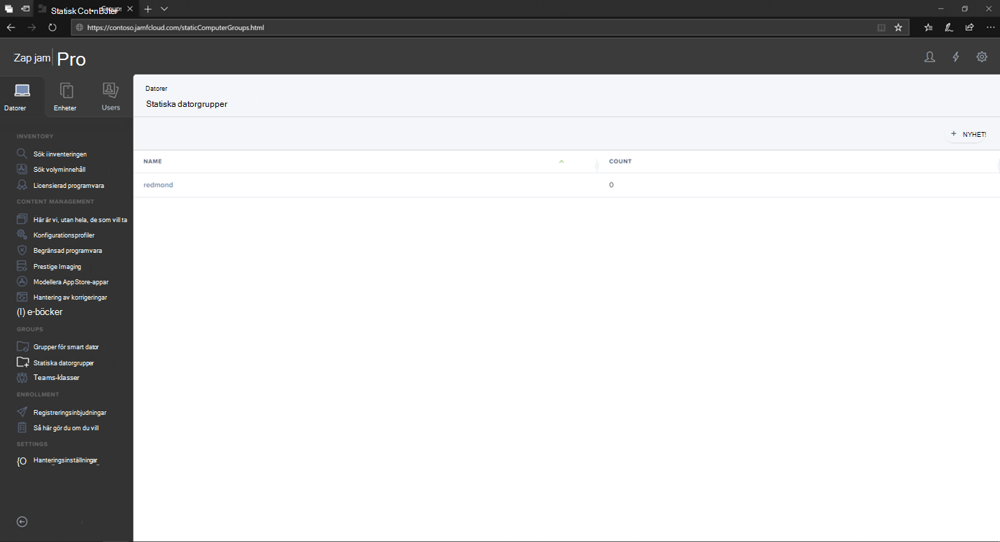
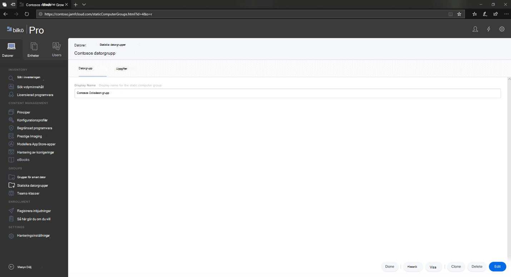
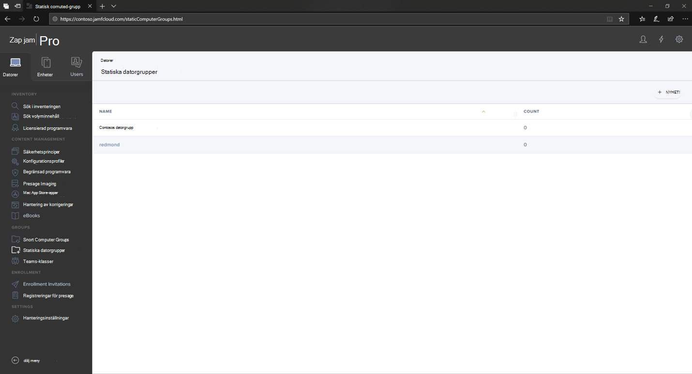

# Konfigurera Microsoft Defender för Slutpunkt för macOS-enhetsgrupper i Jamf Pro

[!INCLUDE [Microsoft 365 Defender rebranding](../../includes/microsoft-defender.md)]

**Gäller för:**
- [Microsoft Defender för Endpoint](https://go.microsoft.com/fwlink/p/?linkid=2146631)
- [Microsoft 365 Defender](https://go.microsoft.com/fwlink/?linkid=2118804)

> Vill du använda Defender för Slutpunkt? [Registrera dig för en kostnadsfri utvärderingsversion.](https://www.microsoft.com/microsoft-365/windows/microsoft-defender-atp?ocid=docs-wdatp-investigateip-abovefoldlink)

Konfigurera enhetsgrupper som liknar organisationsgrupper för grupprinciper, Enhetssamling för Microsoft Endpoint Configuration Manager och Intune-enhetsgrupperna i Intune.

1. Gå till **statiska datorgrupper.**

2. Välj **Nytt**. 

    

3. Ange ett visningsnamn och välj **Spara**.

    

4. Nu kommer du att se **Contosos datorgrupp under Statiska** **datorgrupper.**

    

## Nästa steg
- [Konfigurera Microsoft Defender för Slutpunkt för macOS-principer i Jamf Pro](mac-jamfpro-policies.md)
