# Registrera Microsoft Defender för Endpoint på macOS-enheter till Jamf ProEnroll Microsoft Defender for Endpoint on macOS devices into Jamf Pro 

[!INCLUDE [Microsoft 365 Defender rebranding](../../includes/microsoft-defender.md)]

**Gäller för:****Applies to:**
- [Microsoft Defender för EndpointMicrosoft Defender for Endpoint](https://go.microsoft.com/fwlink/p/?linkid=2154037)
- [Microsoft 365 DefenderMicrosoft 365 Defender](https://go.microsoft.com/fwlink/?linkid=2118804)

> Vill du använda Defender för Slutpunkt?Want to experience Defender for Endpoint? [Registrera dig för en kostnadsfri utvärderingsversion.Sign up for a free trial.](https://www.microsoft.com/microsoft-365/windows/microsoft-defender-atp?ocid=docs-wdatp-investigateip-abovefoldlink)

## Registrera macOS-enheterEnroll macOS devices

Det finns flera sätt att registrera sig till JamF.There are multiple methods of getting enrolled to JamF.

I den här artikeln får du vägledning om två metoder:This article will guide you on two methods:

- [Metod 1: RegistreringsinbjudningarMethod 1:  Enrollment Invitations](#enrollment-method-1-enrollment-invitations)
- [Metod 2: Prestage-registreringMethod 2:  Prestage Enrollments](#enrollment-method-2-prestage-enrollments)

En fullständig lista finns i [Om datorregistrering.](https://docs.jamf.com/9.9/casper-suite/administrator-guide/About_Computer_Enrollment.html)For a complete list, see [About Computer Enrollment](https://docs.jamf.com/9.9/casper-suite/administrator-guide/About_Computer_Enrollment.html).

## Registreringsmetod 1: RegistreringsinbjudningarEnrollment Method 1: Enrollment Invitations

1. Gå till registreringsinbjudningar i instrumentpanelen i Jamf Pro **.**In the Jamf Pro dashboard, navigate to **Enrollment invitations**.

    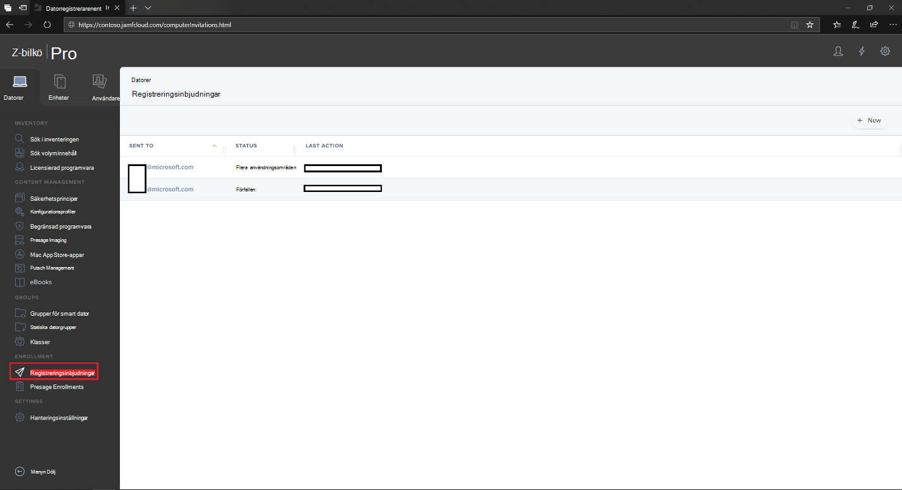

2. Välj **+ Ny.**Select **+ New**.

    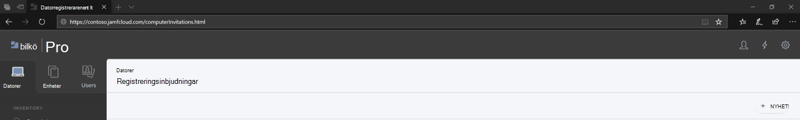

3. I **Ange mottagare för >** under  E-postadresser anger du mottagarnas e-postadresser.In **Specify Recipients for the Invitation** > under **Email Addresses** enter the e-mail address(es) of the recipients.

    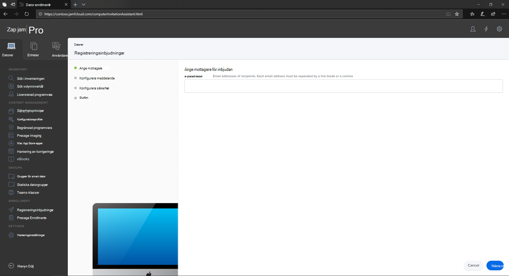

    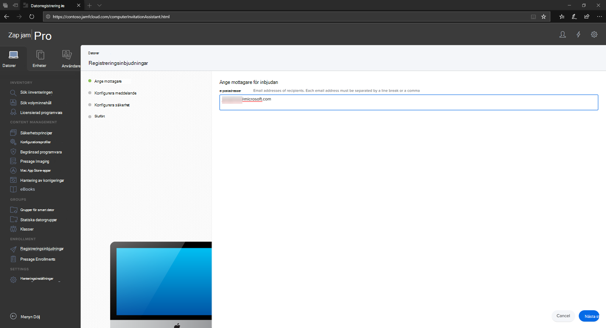

    Till exempel: janedoe@contoso.comFor example: janedoe@contoso.com

    

4. Konfigurera meddelandet för inbjudan.Configure the message for the invitation.

    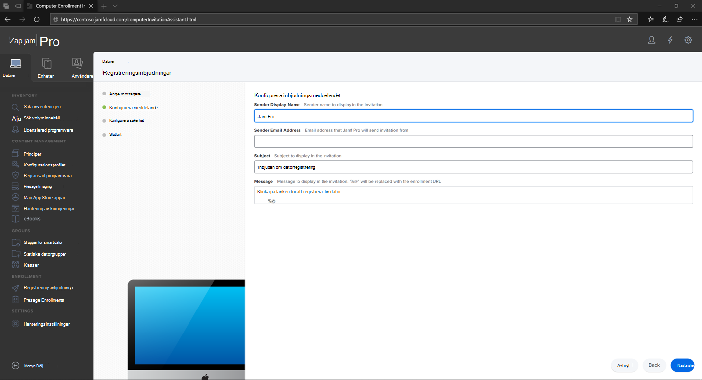

    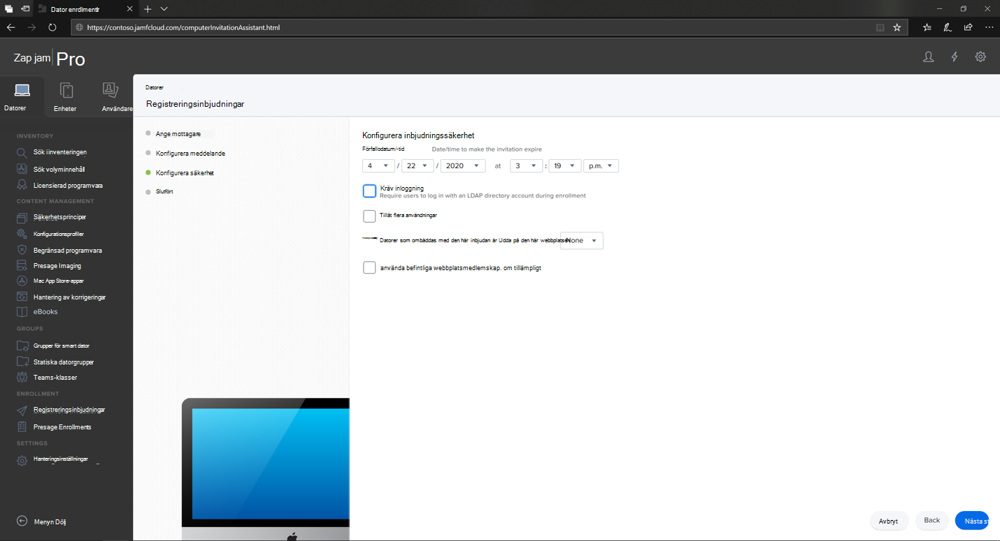

    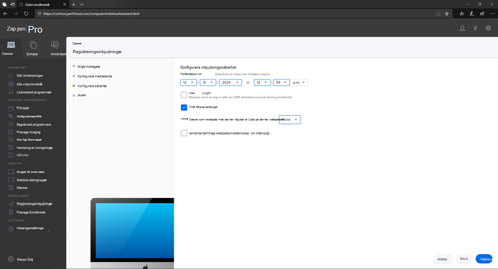

    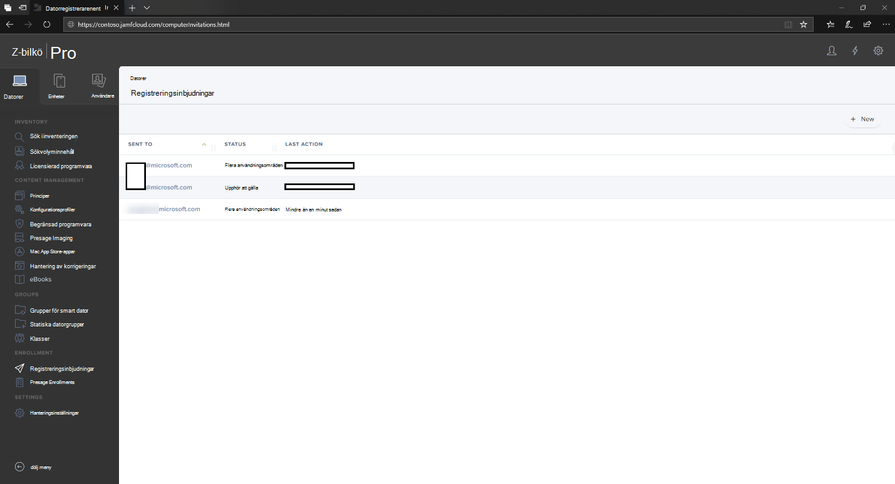

## Registreringsmetod 2: Prestage-registreringEnrollment Method 2: Prestage Enrollments

1. Gå till **Prestage-Pro** i instrumentpanelen i Jamf.In the Jamf Pro dashboard, navigate to **Prestage enrollments**.

    

2. Följ anvisningarna i [Datorns prestage-registrering.](https://docs.jamf.com/9.9/casper-suite/administrator-guide/Computer_PreStage_Enrollments.html)Follow the instructions in [Computer PreStage Enrollments](https://docs.jamf.com/9.9/casper-suite/administrator-guide/Computer_PreStage_Enrollments.html).

## Registrera macOS-enhetEnroll macOS device

1. Välj **Fortsätt** och installera certifikatutfärdaren i fönstret **Systeminställningar.**Select **Continue** and install the CA certificate from a **System Preferences** window.

    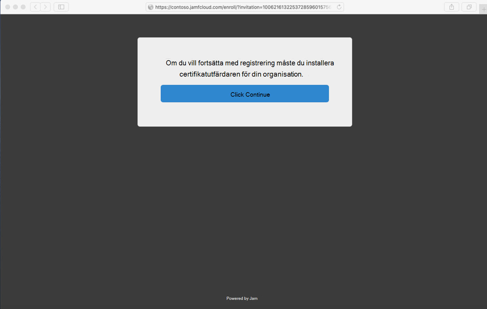

2. När CA-certifikat har installerats går du tillbaka till webbläsarfönstret **och väljer Fortsätt** och installera MDM-profilen.Once CA certificate is installed, return to the browser window and select **Continue** and install the MDM profile. 

    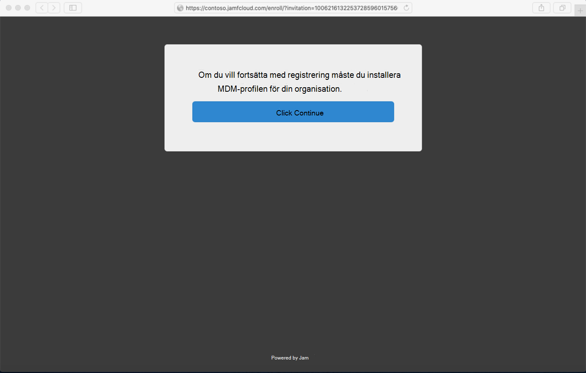

3. Välj **Tillåt** för hämtningar från JAMF.Select **Allow** to downloads from JAMF.

    

4. Välj **Fortsätt för** att fortsätta med installationen av MDM-profilen.Select **Continue** to proceed with the MDM Profile installation. 

    

5. Välj **Fortsätt** för att installera MDM-profilen.Select **Continue** to install the MDM Profile.

    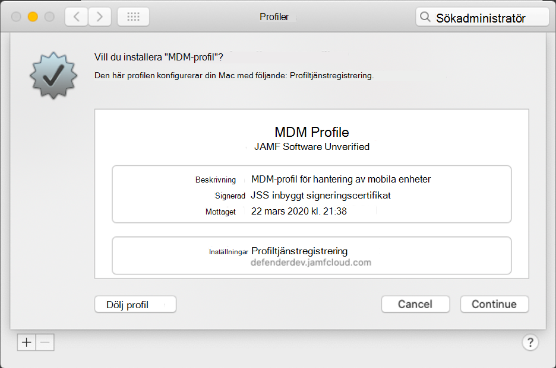

6. Välj **Fortsätt**  för att slutföra konfigurationen.Select **Continue**  to complete the configuration. 

    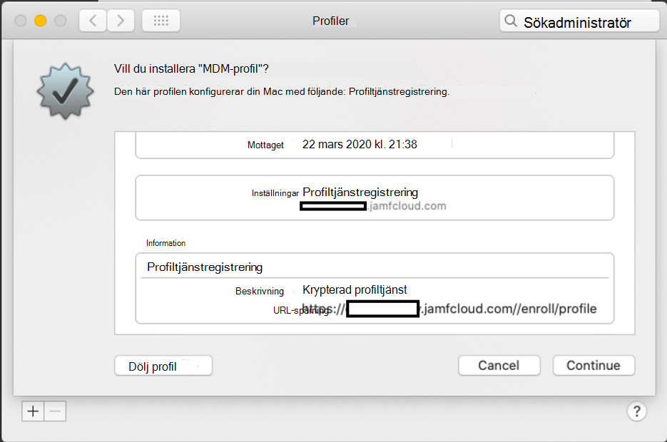
