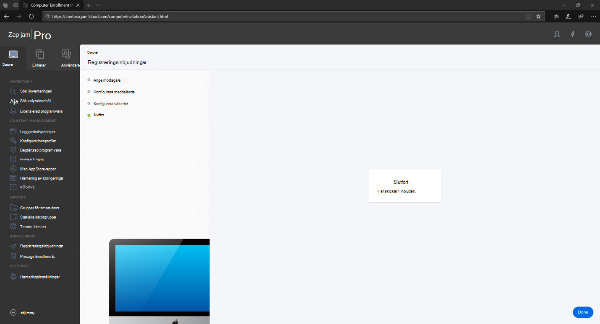
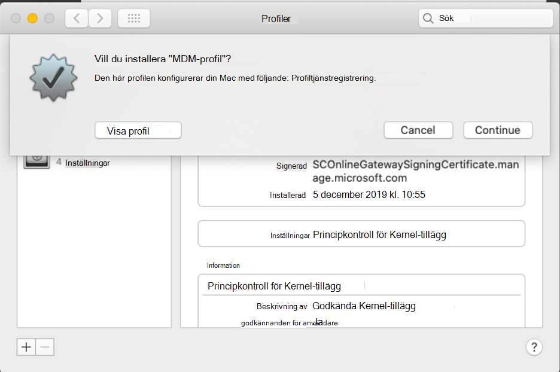

# Registrera Microsoft Defender för Endpoint på macOS-enheter till Jamf Pro 

[!INCLUDE [Microsoft 365 Defender rebranding](../../includes/microsoft-defender.md)]

**Gäller för:**
- [Microsoft Defender för Endpoint](https://go.microsoft.com/fwlink/p/?linkid=2154037)
- [Microsoft 365 Defender](https://go.microsoft.com/fwlink/?linkid=2118804)

> Vill du använda Defender för Slutpunkt? [Registrera dig för en kostnadsfri utvärderingsversion.](https://www.microsoft.com/microsoft-365/windows/microsoft-defender-atp?ocid=docs-wdatp-investigateip-abovefoldlink)

## Registrera macOS-enheter

Det finns flera sätt att registrera sig till JamF.

I den här artikeln får du vägledning om två metoder:

- [Metod 1: Registreringsinbjudningar](#enrollment-method-1-enrollment-invitations)
- [Metod 2: Prestage-registrering](#enrollment-method-2-prestage-enrollments)

En fullständig lista finns i [Om datorregistrering.](https://docs.jamf.com/9.9/casper-suite/administrator-guide/About_Computer_Enrollment.html)

## Registreringsmetod 1: Registreringsinbjudningar

1. Gå till Registreringsinbjudningar på **instrumentpanelen** Jamf Pro.

    

2. Välj **+ Ny.**

    

3. I **Ange mottagare för >** under  E-postadresser anger du mottagarnas e-postadresser.

    

    

    Till exempel: janedoe@contoso.com

    

4. Konfigurera meddelandet för inbjudan.

    

    

    

    

## Registreringsmetod 2: Prestage-registrering

1. Gå till **Prestage-registrering** i instrumentpanelen Jamf Pro.

    

2. Följ anvisningarna i [Datorns prestage-registrering.](https://docs.jamf.com/9.9/casper-suite/administrator-guide/Computer_PreStage_Enrollments.html)

## Registrera macOS-enhet

1. Välj **Fortsätt** och installera certifikatutfärdaren i fönstret **Systeminställningar.**

    

2. När CA-certifikat har installerats går du tillbaka till webbläsarfönstret **och väljer Fortsätt** och installera MDM-profilen. 

    

3. Välj **Tillåt** för hämtningar från JAMF.

    

4. Välj **Fortsätt för** att fortsätta med installationen av MDM-profilen. 

    

5. Välj **Fortsätt** för att installera MDM-profilen.

    

6. Välj **Fortsätt**  för att slutföra konfigurationen. 

    
