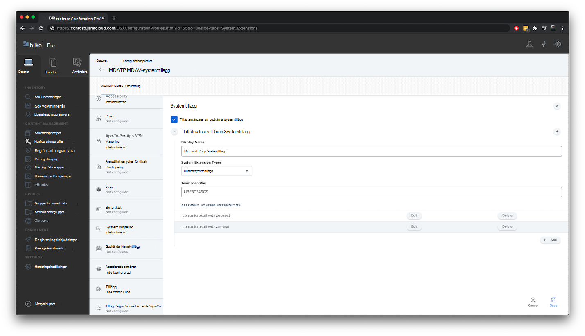

# <a name="set-up-the-microsoft-defender-for-endpoint-on-macos-policies-in-jamf-pro"></a><span data-ttu-id="00e3a-104">Konfigurera principer för Microsoft Defender för slutpunkt på macOS i Jamf Pro</span><span class="sxs-lookup"><span data-stu-id="00e3a-104">Set up the Microsoft Defender for Endpoint on macOS policies in Jamf Pro</span></span>

[!INCLUDE [Microsoft 365 Defender rebranding](../../includes/microsoft-defender.md)]


<span data-ttu-id="00e3a-105">**Gäller för:**</span><span class="sxs-lookup"><span data-stu-id="00e3a-105">**Applies to:**</span></span>

- [<span data-ttu-id="00e3a-106">Defender för Slutpunkt på Mac</span><span class="sxs-lookup"><span data-stu-id="00e3a-106">Defender for Endpoint on Mac</span></span>](microsoft-defender-endpoint-mac.md)

<span data-ttu-id="00e3a-107">På den här sidan går du igenom de steg du måste vidta för att konfigurera macOS-principer i Jamf Pro.</span><span class="sxs-lookup"><span data-stu-id="00e3a-107">This page will guide you through the steps you need to take to set up macOS policies in Jamf Pro.</span></span>

<span data-ttu-id="00e3a-108">Du måste göra följande:</span><span class="sxs-lookup"><span data-stu-id="00e3a-108">You'll need to take the following steps:</span></span>

1. [<span data-ttu-id="00e3a-109">Skaffa Microsoft Defender för slutpunktens onboarding-paket</span><span class="sxs-lookup"><span data-stu-id="00e3a-109">Get the Microsoft Defender for Endpoint onboarding package</span></span>](#step-1-get-the-microsoft-defender-for-endpoint-onboarding-package)

2. [<span data-ttu-id="00e3a-110">Skapa en konfigurationsprofil i Jamf Pro använda onboarding-paketet</span><span class="sxs-lookup"><span data-stu-id="00e3a-110">Create a configuration profile in Jamf Pro using the onboarding package</span></span>](#step-2-create-a-configuration-profile-in-jamf-pro-using-the-onboarding-package)

3. [<span data-ttu-id="00e3a-111">Konfigurera Microsoft Defender för slutpunktsinställningar</span><span class="sxs-lookup"><span data-stu-id="00e3a-111">Configure Microsoft Defender for Endpoint settings</span></span>](#step-3-configure-microsoft-defender-for-endpoint-settings)

4. [<span data-ttu-id="00e3a-112">Konfigurera microsoft Defender för aviseringsinställningar för slutpunkt</span><span class="sxs-lookup"><span data-stu-id="00e3a-112">Configure Microsoft Defender for Endpoint notification settings</span></span>](#step-4-configure-notifications-settings)

5. [<span data-ttu-id="00e3a-113">Konfigurera Microsoft AutoUpdate (MAU)</span><span class="sxs-lookup"><span data-stu-id="00e3a-113">Configure Microsoft AutoUpdate (MAU)</span></span>](#step-5-configure-microsoft-autoupdate-mau)

6. [<span data-ttu-id="00e3a-114">Bevilja fullständig diskåtkomst till Microsoft Defender för Slutpunkt</span><span class="sxs-lookup"><span data-stu-id="00e3a-114">Grant full disk access to Microsoft Defender for Endpoint</span></span>](#step-6-grant-full-disk-access-to-microsoft-defender-for-endpoint)

7. [<span data-ttu-id="00e3a-115">Godkänna Kernel-tillägg för Microsoft Defender för Endpoint</span><span class="sxs-lookup"><span data-stu-id="00e3a-115">Approve Kernel extension for Microsoft Defender for Endpoint</span></span>](#step-7-approve-kernel-extension-for-microsoft-defender-for-endpoint)

8. [<span data-ttu-id="00e3a-116">Godkänna systemtillägg för Microsoft Defender för Slutpunkt</span><span class="sxs-lookup"><span data-stu-id="00e3a-116">Approve System extensions for Microsoft Defender for Endpoint</span></span>](#step-8-approve-system-extensions-for-microsoft-defender-for-endpoint)

9. [<span data-ttu-id="00e3a-117">Konfigurera nätverkstillägg</span><span class="sxs-lookup"><span data-stu-id="00e3a-117">Configure Network Extension</span></span>](#step-9-configure-network-extension)

10. [<span data-ttu-id="00e3a-118">Schemasökningar med Microsoft Defender för Slutpunkt i macOS</span><span class="sxs-lookup"><span data-stu-id="00e3a-118">Schedule scans with Microsoft Defender for Endpoint on macOS</span></span>](/windows/security/threat-protection/microsoft-defender-atp/mac-schedule-scan-atp)

11. [<span data-ttu-id="00e3a-119">Distribuera Microsoft Defender för slutpunkt i macOS</span><span class="sxs-lookup"><span data-stu-id="00e3a-119">Deploy Microsoft Defender for Endpoint on macOS</span></span>](#step-11-deploy-microsoft-defender-for-endpoint-on-macos)


## <a name="step-1-get-the-microsoft-defender-for-endpoint-onboarding-package"></a><span data-ttu-id="00e3a-120">Steg 1: Skaffa Microsoft Defender för slutpunktens introduktionspaket</span><span class="sxs-lookup"><span data-stu-id="00e3a-120">Step 1: Get the Microsoft Defender for Endpoint onboarding package</span></span>

1. <span data-ttu-id="00e3a-121">I [Microsoft Defender Säkerhetscenter](https://securitycenter.microsoft.com )navigerar du **till Inställningar > Onboarding**.</span><span class="sxs-lookup"><span data-stu-id="00e3a-121">In [Microsoft Defender Security Center](https://securitycenter.microsoft.com ), navigate to **Settings > Onboarding**.</span></span> 

2. <span data-ttu-id="00e3a-122">Välj macOS som operativsystem och Hantering av mobila enheter /Microsoft Intune som distributionsmetod.</span><span class="sxs-lookup"><span data-stu-id="00e3a-122">Select macOS as the operating system and Mobile Device Management / Microsoft Intune as the deployment method.</span></span>

    

3. <span data-ttu-id="00e3a-124">Välj **Hämta introduktionspaket** (WindowsDefenderATPOnboardingPackage.zip).</span><span class="sxs-lookup"><span data-stu-id="00e3a-124">Select **Download onboarding package** (WindowsDefenderATPOnboardingPackage.zip).</span></span>

4. <span data-ttu-id="00e3a-125">Extrahera `WindowsDefenderATPOnboardingPackage.zip` .</span><span class="sxs-lookup"><span data-stu-id="00e3a-125">Extract `WindowsDefenderATPOnboardingPackage.zip`.</span></span>

5. <span data-ttu-id="00e3a-126">Kopiera filen till önskad plats.</span><span class="sxs-lookup"><span data-stu-id="00e3a-126">Copy the file to your preferred location.</span></span> <span data-ttu-id="00e3a-127">Till exempel  `C:\Users\JaneDoe_or_JohnDoe.contoso\Downloads\WindowsDefenderATPOnboardingPackage_macOS_MDM_contoso\jamf\WindowsDefenderATPOnboarding.plist` .</span><span class="sxs-lookup"><span data-stu-id="00e3a-127">For example,  `C:\Users\JaneDoe_or_JohnDoe.contoso\Downloads\WindowsDefenderATPOnboardingPackage_macOS_MDM_contoso\jamf\WindowsDefenderATPOnboarding.plist`.</span></span>


## <a name="step-2-create-a-configuration-profile-in-jamf-pro-using-the-onboarding-package"></a><span data-ttu-id="00e3a-128">Steg 2: Skapa en konfigurationsprofil i Jamf Pro använda onboarding-paketet</span><span class="sxs-lookup"><span data-stu-id="00e3a-128">Step 2: Create a configuration profile in Jamf Pro using the onboarding package</span></span>

1. <span data-ttu-id="00e3a-129">Leta reda på `WindowsDefenderATPOnboarding.plist` filen från föregående avsnitt.</span><span class="sxs-lookup"><span data-stu-id="00e3a-129">Locate the file `WindowsDefenderATPOnboarding.plist` from the previous section.</span></span>

   

 
2. <span data-ttu-id="00e3a-131">I instrumentpanelen i Jamf Pro väljer du **Ny**.</span><span class="sxs-lookup"><span data-stu-id="00e3a-131">In the Jamf Pro dashboard, select **New**.</span></span>

    

3. <span data-ttu-id="00e3a-133">Ange följande information:</span><span class="sxs-lookup"><span data-stu-id="00e3a-133">Enter the following details:</span></span>

   <span data-ttu-id="00e3a-134">**Allmänt**</span><span class="sxs-lookup"><span data-stu-id="00e3a-134">**General**</span></span>
   - <span data-ttu-id="00e3a-135">Namn: MDATP onboarding för macOS</span><span class="sxs-lookup"><span data-stu-id="00e3a-135">Name: MDATP onboarding for macOS</span></span>
   - <span data-ttu-id="00e3a-136">Beskrivning: MDATP Identifiering och åtgärd på slutpunkt onboarding för macOS</span><span class="sxs-lookup"><span data-stu-id="00e3a-136">Description: MDATP EDR onboarding for macOS</span></span>
   - <span data-ttu-id="00e3a-137">Kategori: Ingen</span><span class="sxs-lookup"><span data-stu-id="00e3a-137">Category: None</span></span>
   - <span data-ttu-id="00e3a-138">Distributionsmetod: Installera automatiskt</span><span class="sxs-lookup"><span data-stu-id="00e3a-138">Distribution Method: Install Automatically</span></span>
   - <span data-ttu-id="00e3a-139">Nivå: Datornivå</span><span class="sxs-lookup"><span data-stu-id="00e3a-139">Level: Computer Level</span></span>

4. <span data-ttu-id="00e3a-140">I **Program & Egen Inställningar** du **Konfigurera**.</span><span class="sxs-lookup"><span data-stu-id="00e3a-140">In **Application & Custom Settings** select **Configure**.</span></span>

    

5. <span data-ttu-id="00e3a-142">Välj **Upload (PLIST-fil)** och ange sedan: i **Preference Domain** anger du: `com.microsoft.wdav.atp` .</span><span class="sxs-lookup"><span data-stu-id="00e3a-142">Select **Upload File (PLIST file)** then in **Preference Domain** enter: `com.microsoft.wdav.atp`.</span></span> 

    

    

7. <span data-ttu-id="00e3a-145">Välj **Öppna** och välj onboarding-filen.</span><span class="sxs-lookup"><span data-stu-id="00e3a-145">Select **Open** and select the onboarding file.</span></span>

    

8. <span data-ttu-id="00e3a-147">Välj **Upload**.</span><span class="sxs-lookup"><span data-stu-id="00e3a-147">Select **Upload**.</span></span> 

    


9. <span data-ttu-id="00e3a-149">Välj **fliken Omfattning.**</span><span class="sxs-lookup"><span data-stu-id="00e3a-149">Select the **Scope** tab.</span></span>

    

10. <span data-ttu-id="00e3a-151">Välj måldatorerna.</span><span class="sxs-lookup"><span data-stu-id="00e3a-151">Select the target computers.</span></span>

    

     

11. <span data-ttu-id="00e3a-154">Välj **Spara**.</span><span class="sxs-lookup"><span data-stu-id="00e3a-154">Select **Save**.</span></span>

    

    

12. <span data-ttu-id="00e3a-157">Välj **Klar**.</span><span class="sxs-lookup"><span data-stu-id="00e3a-157">Select **Done**.</span></span>

    

    

## <a name="step-3-configure-microsoft-defender-for-endpoint-settings"></a><span data-ttu-id="00e3a-160">Steg 3: Konfigurera Microsoft Defender för Slutpunktsinställningar</span><span class="sxs-lookup"><span data-stu-id="00e3a-160">Step 3: Configure Microsoft Defender for Endpoint settings</span></span>

1.  <span data-ttu-id="00e3a-161">Använd följande konfigurationsinställningar för Microsoft Defender för Slutpunkt:</span><span class="sxs-lookup"><span data-stu-id="00e3a-161">Use the following Microsoft Defender for Endpoint configuration settings:</span></span>

    - <span data-ttu-id="00e3a-162">enableRealTimeProtection</span><span class="sxs-lookup"><span data-stu-id="00e3a-162">enableRealTimeProtection</span></span>
    - <span data-ttu-id="00e3a-163">passivläge</span><span class="sxs-lookup"><span data-stu-id="00e3a-163">passiveMode</span></span>
    
    >[!NOTE]
    ><span data-ttu-id="00e3a-164">Inte aktiverat som standard om du planerar att köra en tredjeparts-AV för macOS ställer du in den på `true` .</span><span class="sxs-lookup"><span data-stu-id="00e3a-164">Not turned on by default, if you are planning to run a third-party AV for macOS, set it to `true`.</span></span>

    - <span data-ttu-id="00e3a-165">undantag</span><span class="sxs-lookup"><span data-stu-id="00e3a-165">exclusions</span></span>
    - <span data-ttu-id="00e3a-166">excludedPath</span><span class="sxs-lookup"><span data-stu-id="00e3a-166">excludedPath</span></span>
    - <span data-ttu-id="00e3a-167">excludedFileExtension</span><span class="sxs-lookup"><span data-stu-id="00e3a-167">excludedFileExtension</span></span>
    - <span data-ttu-id="00e3a-168">excludedFileName</span><span class="sxs-lookup"><span data-stu-id="00e3a-168">excludedFileName</span></span>
    - <span data-ttu-id="00e3a-169">exclusionsMergePolicy</span><span class="sxs-lookup"><span data-stu-id="00e3a-169">exclusionsMergePolicy</span></span>
    - <span data-ttu-id="00e3a-170">allowedThreats</span><span class="sxs-lookup"><span data-stu-id="00e3a-170">allowedThreats</span></span>
    
    >[!NOTE]
    ><span data-ttu-id="00e3a-171">EICAR ingår i exemplet. Om du går igenom ett koncepttest bör du ta bort det särskilt om du testar EICAR.</span><span class="sxs-lookup"><span data-stu-id="00e3a-171">EICAR is on the sample, if you are going through a proof-of-concept, remove it especially if you are testing EICAR.</span></span>
        
    - <span data-ttu-id="00e3a-172">disallowedThreatActions</span><span class="sxs-lookup"><span data-stu-id="00e3a-172">disallowedThreatActions</span></span>
    - <span data-ttu-id="00e3a-173">potentially_unwanted_application</span><span class="sxs-lookup"><span data-stu-id="00e3a-173">potentially_unwanted_application</span></span>
    - <span data-ttu-id="00e3a-174">archive_bomb</span><span class="sxs-lookup"><span data-stu-id="00e3a-174">archive_bomb</span></span>
    - <span data-ttu-id="00e3a-175">cloudService</span><span class="sxs-lookup"><span data-stu-id="00e3a-175">cloudService</span></span>
    - <span data-ttu-id="00e3a-176">automaticSampleSubmission</span><span class="sxs-lookup"><span data-stu-id="00e3a-176">automaticSampleSubmission</span></span>
    - <span data-ttu-id="00e3a-177">taggar</span><span class="sxs-lookup"><span data-stu-id="00e3a-177">tags</span></span>
    - <span data-ttu-id="00e3a-178">hideStatusMenuIcon</span><span class="sxs-lookup"><span data-stu-id="00e3a-178">hideStatusMenuIcon</span></span>
    
     <span data-ttu-id="00e3a-179">Mer information finns i [egenskapslistan för Jamf-konfigurationsprofilen](mac-preferences.md#property-list-for-jamf-configuration-profile).</span><span class="sxs-lookup"><span data-stu-id="00e3a-179">For information, see [Property list for Jamf configuration profile](mac-preferences.md#property-list-for-jamf-configuration-profile).</span></span>

     ```XML
     <?xml version="1.0" encoding="UTF-8"?>
     <!DOCTYPE plist PUBLIC "-//Apple//DTD PLIST 1.0//EN" "http://www.apple.com/DTDs/PropertyList-1.0.dtd">
     <plist version="1.0">
     <dict>
         <key>antivirusEngine</key>
         <dict>
             <key>enableRealTimeProtection</key>
             <true/>
             <key>passiveMode</key>
             <false/>
             <key>exclusions</key>
             <array>
                 <dict>
                     <key>$type</key>
                     <string>excludedPath</string>
                     <key>isDirectory</key>
                     <false/>
                     <key>path</key>
                     <string>/var/log/system.log</string>
                 </dict>
                 <dict>
                     <key>$type</key>
                     <string>excludedPath</string>
                     <key>isDirectory</key>
                     <true/>
                     <key>path</key>
                     <string>/home</string>
                 </dict>
                 <dict>
                     <key>$type</key>
                     <string>excludedFileExtension</string>
                     <key>extension</key>
                     <string>pdf</string>
                 </dict>
                 <dict>
                     <key>$type</key>
                     <string>excludedFileName</string>
                     <key>name</key>
                     <string>cat</string>
                 </dict>
             </array>
             <key>exclusionsMergePolicy</key>
             <string>merge</string>
             <key>allowedThreats</key>
             <array>
                 <string>EICAR-Test-File (not a virus)</string>
             </array>
             <key>disallowedThreatActions</key>
             <array>
                 <string>allow</string>
                 <string>restore</string>
             </array>
             <key>threatTypeSettings</key>
             <array>
                 <dict>
                     <key>key</key>
                     <string>potentially_unwanted_application</string>
                     <key>value</key>
                     <string>block</string>
                 </dict>
                 <dict>
                     <key>key</key>
                     <string>archive_bomb</string>
                     <key>value</key>
                     <string>audit</string>
                 </dict>
             </array>
             <key>threatTypeSettingsMergePolicy</key>
             <string>merge</string>
         </dict>
         <key>cloudService</key>
         <dict>
             <key>enabled</key>
             <true/>
             <key>diagnosticLevel</key>
             <string>optional</string>
             <key>automaticSampleSubmission</key>
             <true/>
         </dict>
         <key>edr</key>
         <dict>
             <key>tags</key>
             <array>
                 <dict>
                     <key>key</key>
                     <string>GROUP</string>
                     <key>value</key>
                     <string>ExampleTag</string>
                 </dict>
             </array>
         </dict>
         <key>userInterface</key>
         <dict>
             <key>hideStatusMenuIcon</key>
             <false/>
         </dict>
     </dict>
     </plist>
     ```

2. <span data-ttu-id="00e3a-180">Spara filen som `MDATP_MDAV_configuration_settings.plist` .</span><span class="sxs-lookup"><span data-stu-id="00e3a-180">Save the file as `MDATP_MDAV_configuration_settings.plist`.</span></span>


3.  <span data-ttu-id="00e3a-181">I instrumentpanelen i Jamf Pro väljer du **Allmänt**.</span><span class="sxs-lookup"><span data-stu-id="00e3a-181">In the Jamf Pro dashboard, select **General**.</span></span>

    

4. <span data-ttu-id="00e3a-183">Ange följande information:</span><span class="sxs-lookup"><span data-stu-id="00e3a-183">Enter the following details:</span></span>

    <span data-ttu-id="00e3a-184">**Allmänt**</span><span class="sxs-lookup"><span data-stu-id="00e3a-184">**General**</span></span>
    
    - <span data-ttu-id="00e3a-185">Namn: MDATP MDAV-konfigurationsinställningar</span><span class="sxs-lookup"><span data-stu-id="00e3a-185">Name: MDATP MDAV configuration settings</span></span>
    - <span data-ttu-id="00e3a-186">Beskrivning:\<blank\></span><span class="sxs-lookup"><span data-stu-id="00e3a-186">Description:\<blank\></span></span>
    - <span data-ttu-id="00e3a-187">Kategori: Ingen (standard)</span><span class="sxs-lookup"><span data-stu-id="00e3a-187">Category: None (default)</span></span>
    - <span data-ttu-id="00e3a-188">Distributionsmetod: Installera automatiskt(standard)</span><span class="sxs-lookup"><span data-stu-id="00e3a-188">Distribution Method: Install Automatically(default)</span></span>
    - <span data-ttu-id="00e3a-189">Nivå: Datornivå(standard)</span><span class="sxs-lookup"><span data-stu-id="00e3a-189">Level: Computer Level(default)</span></span>

    

5. <span data-ttu-id="00e3a-191">I **Program & Egen Inställningar** du **Konfigurera**.</span><span class="sxs-lookup"><span data-stu-id="00e3a-191">In **Application & Custom Settings** select **Configure**.</span></span>

    

6. <span data-ttu-id="00e3a-193">Välj **Upload (PLIST-fil)**.</span><span class="sxs-lookup"><span data-stu-id="00e3a-193">Select **Upload File (PLIST file)**.</span></span>

    

7. <span data-ttu-id="00e3a-195">I **Preferences Domain** anger du och väljer Upload `com.microsoft.wdav` **PLIST-fil**.</span><span class="sxs-lookup"><span data-stu-id="00e3a-195">In **Preferences Domain**, enter `com.microsoft.wdav`, then select  **Upload PLIST File**.</span></span>

    

8. <span data-ttu-id="00e3a-197">Välj **Välj fil**.</span><span class="sxs-lookup"><span data-stu-id="00e3a-197">Select **Choose File**.</span></span>

    

9. <span data-ttu-id="00e3a-199">Välj fliken **MDATP_MDAV_configuration_settings.plist** och välj sedan **Öppna**.</span><span class="sxs-lookup"><span data-stu-id="00e3a-199">Select the **MDATP_MDAV_configuration_settings.plist**, then select **Open**.</span></span>

    

10. <span data-ttu-id="00e3a-201">Välj **Upload**.</span><span class="sxs-lookup"><span data-stu-id="00e3a-201">Select **Upload**.</span></span>

    

    

    >[!NOTE]
    ><span data-ttu-id="00e3a-204">Om du råkar ladda upp Intune-filen får du följande felmeddelande:</span><span class="sxs-lookup"><span data-stu-id="00e3a-204">If you happen to upload the Intune file, you'll get the following error:</span></span><br>
    ><span data-ttu-id="00e3a-205"></span><span class="sxs-lookup"><span data-stu-id="00e3a-205"></span></span>


11. <span data-ttu-id="00e3a-206">Välj **Spara**.</span><span class="sxs-lookup"><span data-stu-id="00e3a-206">Select **Save**.</span></span> 

    

12. <span data-ttu-id="00e3a-208">Filen laddas upp.</span><span class="sxs-lookup"><span data-stu-id="00e3a-208">The file is uploaded.</span></span>

    

    

13. <span data-ttu-id="00e3a-211">Välj **fliken Omfattning.**</span><span class="sxs-lookup"><span data-stu-id="00e3a-211">Select the **Scope** tab.</span></span>

    

14. <span data-ttu-id="00e3a-213">Välj **Contosos datorgrupp.**</span><span class="sxs-lookup"><span data-stu-id="00e3a-213">Select **Contoso's Machine Group**.</span></span> 

15. <span data-ttu-id="00e3a-214">Välj **Lägg** till och välj sedan **Spara**.</span><span class="sxs-lookup"><span data-stu-id="00e3a-214">Select **Add**, then select **Save**.</span></span>

    

    

16. <span data-ttu-id="00e3a-217">Välj **Klar**.</span><span class="sxs-lookup"><span data-stu-id="00e3a-217">Select **Done**.</span></span> <span data-ttu-id="00e3a-218">Den nya konfigurationsprofilen **visas.**</span><span class="sxs-lookup"><span data-stu-id="00e3a-218">You'll see the new **Configuration profile**.</span></span>

    


## <a name="step-4-configure-notifications-settings"></a><span data-ttu-id="00e3a-220">Steg 4: Konfigurera aviseringsinställningar</span><span class="sxs-lookup"><span data-stu-id="00e3a-220">Step 4: Configure notifications settings</span></span>

<span data-ttu-id="00e3a-221">De här stegen gäller för macOS 10.15 (Catalina) eller nyare.</span><span class="sxs-lookup"><span data-stu-id="00e3a-221">These steps are applicable of macOS 10.15 (Catalina) or newer.</span></span>

1. <span data-ttu-id="00e3a-222">I instrumentpanelen För Pro det här **instrumentpanelen väljer du Datorer** och sedan **Konfigurationsprofiler**.</span><span class="sxs-lookup"><span data-stu-id="00e3a-222">In the Jamf Pro dashboard, select **Computers**, then **Configuration Profiles**.</span></span>

2. <span data-ttu-id="00e3a-223">Klicka **på** Nytt och ange följande information för **Alternativ:**</span><span class="sxs-lookup"><span data-stu-id="00e3a-223">Click **New**, and enter the following details for **Options**:</span></span>
    
    - <span data-ttu-id="00e3a-224">Tabb **Allmänt:**</span><span class="sxs-lookup"><span data-stu-id="00e3a-224">Tab **General**:</span></span> 
        - <span data-ttu-id="00e3a-225">**Namn**: MDATP för MDAV-aviseringar</span><span class="sxs-lookup"><span data-stu-id="00e3a-225">**Name**: MDATP MDAV Notification settings</span></span>
        - <span data-ttu-id="00e3a-226">**Beskrivning**: macOS 10.15 (Catalina) eller nyare</span><span class="sxs-lookup"><span data-stu-id="00e3a-226">**Description**: macOS 10.15 (Catalina) or newer</span></span>
        - <span data-ttu-id="00e3a-227">**Kategori:** Ingen *(standard)*</span><span class="sxs-lookup"><span data-stu-id="00e3a-227">**Category**: None *(default)*</span></span>
        - <span data-ttu-id="00e3a-228">**Distributionsmetod:** Installera automatiskt *(standard)*</span><span class="sxs-lookup"><span data-stu-id="00e3a-228">**Distribution Method**: Install Automatically *(default)*</span></span>
        - <span data-ttu-id="00e3a-229">**Nivå:** Datornivå *(standard)*</span><span class="sxs-lookup"><span data-stu-id="00e3a-229">**Level**: Computer Level *(default)*</span></span>

        

    - <span data-ttu-id="00e3a-231">**Flikmeddelanden**, klicka **på** Lägg till och ange följande värden:</span><span class="sxs-lookup"><span data-stu-id="00e3a-231">Tab **Notifications**, click **Add**, and enter the following values:</span></span>
        - <span data-ttu-id="00e3a-232">**Paket-ID:**`com.microsoft.wdav.tray`</span><span class="sxs-lookup"><span data-stu-id="00e3a-232">**Bundle ID**: `com.microsoft.wdav.tray`</span></span>
        - <span data-ttu-id="00e3a-233">**Viktiga aviseringar:** Klicka på **Inaktivera**</span><span class="sxs-lookup"><span data-stu-id="00e3a-233">**Critical Alerts**: Click **Disable**</span></span>
        - <span data-ttu-id="00e3a-234">**Meddelanden**: Klicka på **Aktivera**</span><span class="sxs-lookup"><span data-stu-id="00e3a-234">**Notifications**: Click **Enable**</span></span>
        - <span data-ttu-id="00e3a-235">**Aviseringstyp för** banderoll: Välj **Inkludera** **och Tillfällig** *(standard)*</span><span class="sxs-lookup"><span data-stu-id="00e3a-235">**Banner alert type**: Select **Include** and **Temporary** *(default)*</span></span>
        - <span data-ttu-id="00e3a-236">**Meddelanden på låsskärmen:** Klicka på **Dölj**</span><span class="sxs-lookup"><span data-stu-id="00e3a-236">**Notifications on lock screen**: Click **Hide**</span></span>
        - <span data-ttu-id="00e3a-237">**Meddelanden i meddelandecentret:** Klicka på **Visa**</span><span class="sxs-lookup"><span data-stu-id="00e3a-237">**Notifications in Notification Center**: Click **Display**</span></span>
        - <span data-ttu-id="00e3a-238">**Ikon för aktivitetsikonen**: Klicka på **Visa**</span><span class="sxs-lookup"><span data-stu-id="00e3a-238">**Badge app icon**: Click **Display**</span></span>

        

    - <span data-ttu-id="00e3a-240">Flikmeddelanden , klicka **på Lägg** till en gång till, bläddra ned till **Nya Inställningar** </span><span class="sxs-lookup"><span data-stu-id="00e3a-240">Tab **Notifications**, click **Add** one more time, scroll down to **New Notifications Settings**</span></span>
        - <span data-ttu-id="00e3a-241">**Paket-ID:**`com.microsoft.autoupdate2`</span><span class="sxs-lookup"><span data-stu-id="00e3a-241">**Bundle ID**: `com.microsoft.autoupdate2`</span></span>
        - <span data-ttu-id="00e3a-242">Konfigurera resten av inställningarna till samma värden som ovan</span><span class="sxs-lookup"><span data-stu-id="00e3a-242">Configure the rest of the settings to the same values as above</span></span>

        

        <span data-ttu-id="00e3a-244">Observera att du nu har två "tabeller" med meddelandekonfigurationer, en för **Paket-ID: com.microsoft.wdav.tray** och en annan för **Paket-ID: com.microsoft.autoupdate2**.</span><span class="sxs-lookup"><span data-stu-id="00e3a-244">Note that now you have two 'tables' with notification configurations, one for **Bundle ID: com.microsoft.wdav.tray**, and another for **Bundle ID: com.microsoft.autoupdate2**.</span></span> <span data-ttu-id="00e3a-245">Du kan konfigurera aviseringsinställningar enligt dina krav, paket-ID måste  vara exakt samma som beskrivs tidigare och växeln Inkludera måste vara **På** för **Meddelanden.**</span><span class="sxs-lookup"><span data-stu-id="00e3a-245">While you can configure alert settings per your requirements, Bundle IDs must be exactly the same as described before, and **Include** switch must be **On** for **Notifications**.</span></span>

3. <span data-ttu-id="00e3a-246">Välj fliken **Omfattning** och välj sedan Lägg **till**.</span><span class="sxs-lookup"><span data-stu-id="00e3a-246">Select the **Scope** tab, then select **Add**.</span></span>

    

4. <span data-ttu-id="00e3a-248">Välj **Contosos datorgrupp.**</span><span class="sxs-lookup"><span data-stu-id="00e3a-248">Select **Contoso's Machine Group**.</span></span> 

5. <span data-ttu-id="00e3a-249">Välj **Lägg** till och välj sedan **Spara**.</span><span class="sxs-lookup"><span data-stu-id="00e3a-249">Select **Add**, then select **Save**.</span></span>
    
    
    
    

6. <span data-ttu-id="00e3a-252">Välj **Klar**.</span><span class="sxs-lookup"><span data-stu-id="00e3a-252">Select **Done**.</span></span> <span data-ttu-id="00e3a-253">Den nya konfigurationsprofilen **visas.**</span><span class="sxs-lookup"><span data-stu-id="00e3a-253">You'll see the new **Configuration profile**.</span></span>
    <span data-ttu-id="00e3a-254"></span><span class="sxs-lookup"><span data-stu-id="00e3a-254"></span></span>

## <a name="step-5-configure-microsoft-autoupdate-mau"></a><span data-ttu-id="00e3a-255">Steg 5: Konfigurera Microsoft AutoUpdate (MAU)</span><span class="sxs-lookup"><span data-stu-id="00e3a-255">Step 5: Configure Microsoft AutoUpdate (MAU)</span></span>

1. <span data-ttu-id="00e3a-256">Använd följande konfigurationsinställningar för Microsoft Defender för Slutpunkt:</span><span class="sxs-lookup"><span data-stu-id="00e3a-256">Use the following Microsoft Defender for Endpoint configuration settings:</span></span>

      ```XML
   <?xml version="1.0" encoding="UTF-8"?>
   <!DOCTYPE plist PUBLIC "-//Apple//DTD PLIST 1.0//EN" "http://www.apple.com/DTDs/PropertyList-1.0.dtd">
   <plist version="1.0">
   <dict>
    <key>ChannelName</key>
    <string>Current</string>
    <key>HowToCheck</key>
    <string>AutomaticDownload</string>
    <key>EnableCheckForUpdatesButton</key>
    <true/>
    <key>DisableInsiderCheckbox</key>
    <false/>
    <key>SendAllTelemetryEnabled</key>
    <true/>
   </dict>
   </plist>
   ```

2. <span data-ttu-id="00e3a-257">Spara den som `MDATP_MDAV_MAU_settings.plist` .</span><span class="sxs-lookup"><span data-stu-id="00e3a-257">Save it as `MDATP_MDAV_MAU_settings.plist`.</span></span>

3. <span data-ttu-id="00e3a-258">I instrumentpanelen i Jamf Pro väljer du **Allmänt**.</span><span class="sxs-lookup"><span data-stu-id="00e3a-258">In the Jamf Pro dashboard, select **General**.</span></span> 

    

4. <span data-ttu-id="00e3a-260">Ange följande information:</span><span class="sxs-lookup"><span data-stu-id="00e3a-260">Enter the following details:</span></span>

    <span data-ttu-id="00e3a-261">**Allmänt**</span><span class="sxs-lookup"><span data-stu-id="00e3a-261">**General**</span></span> 
    
    - <span data-ttu-id="00e3a-262">Namn: MDATP MDAV MAU-inställningar</span><span class="sxs-lookup"><span data-stu-id="00e3a-262">Name: MDATP MDAV MAU settings</span></span>
    - <span data-ttu-id="00e3a-263">Beskrivning: Microsoft AutoUpdate-inställningar för MDATP för macOS</span><span class="sxs-lookup"><span data-stu-id="00e3a-263">Description: Microsoft AutoUpdate settings for MDATP for macOS</span></span>
    - <span data-ttu-id="00e3a-264">Kategori: Ingen (standard)</span><span class="sxs-lookup"><span data-stu-id="00e3a-264">Category: None (default)</span></span>
    - <span data-ttu-id="00e3a-265">Distributionsmetod: Installera automatiskt(standard)</span><span class="sxs-lookup"><span data-stu-id="00e3a-265">Distribution Method: Install Automatically(default)</span></span>
    - <span data-ttu-id="00e3a-266">Nivå: Datornivå(standard)</span><span class="sxs-lookup"><span data-stu-id="00e3a-266">Level: Computer Level(default)</span></span>

5. <span data-ttu-id="00e3a-267">I **Program & Egen Inställningar** du **Konfigurera**.</span><span class="sxs-lookup"><span data-stu-id="00e3a-267">In **Application & Custom Settings** select **Configure**.</span></span>

    

6. <span data-ttu-id="00e3a-269">Välj **Upload (PLIST-fil)**.</span><span class="sxs-lookup"><span data-stu-id="00e3a-269">Select **Upload File (PLIST file)**.</span></span>

      

7. <span data-ttu-id="00e3a-271">I **Preference Domain** anger du: och väljer Upload `com.microsoft.autoupdate2` **PLIST-fil**.</span><span class="sxs-lookup"><span data-stu-id="00e3a-271">In **Preference Domain** enter: `com.microsoft.autoupdate2`, then select **Upload PLIST File**.</span></span>

    

8. <span data-ttu-id="00e3a-273">Välj **Välj fil**.</span><span class="sxs-lookup"><span data-stu-id="00e3a-273">Select **Choose File**.</span></span>

    

9. <span data-ttu-id="00e3a-275">Välj **MDATP_MDAV_MAU_settings.plist**.</span><span class="sxs-lookup"><span data-stu-id="00e3a-275">Select **MDATP_MDAV_MAU_settings.plist**.</span></span>

    

10. <span data-ttu-id="00e3a-277">Välj **Upload**.</span><span class="sxs-lookup"><span data-stu-id="00e3a-277">Select **Upload**.</span></span>
    <span data-ttu-id="00e3a-278"></span><span class="sxs-lookup"><span data-stu-id="00e3a-278"></span></span>

    

11. <span data-ttu-id="00e3a-280">Välj **Spara**.</span><span class="sxs-lookup"><span data-stu-id="00e3a-280">Select **Save**.</span></span>

    

12. <span data-ttu-id="00e3a-282">Välj **fliken Omfattning.**</span><span class="sxs-lookup"><span data-stu-id="00e3a-282">Select the **Scope** tab.</span></span>
   
     

13. <span data-ttu-id="00e3a-284">Välj **Lägg till**.</span><span class="sxs-lookup"><span data-stu-id="00e3a-284">Select **Add**.</span></span>
    
    

    

    

14. <span data-ttu-id="00e3a-288">Välj **Klar**.</span><span class="sxs-lookup"><span data-stu-id="00e3a-288">Select **Done**.</span></span>
    
    

## <a name="step-6-grant-full-disk-access-to-microsoft-defender-for-endpoint"></a><span data-ttu-id="00e3a-290">Steg 6: Ge fullständig diskåtkomst till Microsoft Defender för Slutpunkt</span><span class="sxs-lookup"><span data-stu-id="00e3a-290">Step 6: Grant full disk access to Microsoft Defender for Endpoint</span></span>

1. <span data-ttu-id="00e3a-291">Välj Konfigurationsprofiler Pro i **Det här instrumentpanelen .**</span><span class="sxs-lookup"><span data-stu-id="00e3a-291">In the Jamf Pro dashboard, select **Configuration Profiles**.</span></span>

    

2. <span data-ttu-id="00e3a-293">Välj **+ Ny.**</span><span class="sxs-lookup"><span data-stu-id="00e3a-293">Select **+ New**.</span></span> 

3. <span data-ttu-id="00e3a-294">Ange följande information:</span><span class="sxs-lookup"><span data-stu-id="00e3a-294">Enter the following details:</span></span>

    <span data-ttu-id="00e3a-295">**Allmänt**</span><span class="sxs-lookup"><span data-stu-id="00e3a-295">**General**</span></span> 
    - <span data-ttu-id="00e3a-296">Namn: MDATP MDAV – tilldela fullständig diskåtkomst till Identifiering och åtgärd på slutpunkt och AV</span><span class="sxs-lookup"><span data-stu-id="00e3a-296">Name: MDATP MDAV - grant Full Disk Access to EDR and AV</span></span>
    - <span data-ttu-id="00e3a-297">Beskrivning: På macOS Catalina eller nyare, den nya kontrollen för sekretesspolicy</span><span class="sxs-lookup"><span data-stu-id="00e3a-297">Description: On macOS Catalina or newer, the new Privacy Preferences Policy Control</span></span>
    - <span data-ttu-id="00e3a-298">Kategori: Ingen</span><span class="sxs-lookup"><span data-stu-id="00e3a-298">Category: None</span></span>
    - <span data-ttu-id="00e3a-299">Distributionsmetod: Installera automatiskt</span><span class="sxs-lookup"><span data-stu-id="00e3a-299">Distribution method: Install Automatically</span></span>
    - <span data-ttu-id="00e3a-300">Nivå: Datornivå</span><span class="sxs-lookup"><span data-stu-id="00e3a-300">Level: Computer level</span></span>


    

4. <span data-ttu-id="00e3a-302">I **Konfigurera principkontrollen för sekretesspolicy väljer** du **Konfigurera**.</span><span class="sxs-lookup"><span data-stu-id="00e3a-302">In **Configure Privacy Preferences Policy Control** select **Configure**.</span></span>

    

5. <span data-ttu-id="00e3a-304">Ange **följande information i Kontrollen** av sekretesspolicyn:</span><span class="sxs-lookup"><span data-stu-id="00e3a-304">In **Privacy Preferences Policy Control**, enter the following details:</span></span>

    - <span data-ttu-id="00e3a-305">Identifierare: `com.microsoft.wdav`</span><span class="sxs-lookup"><span data-stu-id="00e3a-305">Identifier: `com.microsoft.wdav`</span></span>
    - <span data-ttu-id="00e3a-306">Identifierartyp: Paket-ID</span><span class="sxs-lookup"><span data-stu-id="00e3a-306">Identifier Type: Bundle ID</span></span>
    - <span data-ttu-id="00e3a-307">Kodkrav: `identifier "com.microsoft.wdav" and anchor apple generic and certificate 1[field.1.2.840.113635.100.6.2.6] /* exists */ and certificate leaf[field.1.2.840.113635.100.6.1.13] /* exists */ and certificate leaf[subject.OU] = UBF8T346G9`</span><span class="sxs-lookup"><span data-stu-id="00e3a-307">Code Requirement: `identifier "com.microsoft.wdav" and anchor apple generic and certificate 1[field.1.2.840.113635.100.6.2.6] /* exists */ and certificate leaf[field.1.2.840.113635.100.6.1.13] /* exists */ and certificate leaf[subject.OU] = UBF8T346G9`</span></span>


    

6. <span data-ttu-id="00e3a-309">Välj **+ Lägg till.**</span><span class="sxs-lookup"><span data-stu-id="00e3a-309">Select **+ Add**.</span></span>

    

    - <span data-ttu-id="00e3a-311">Under App eller tjänst: Ställ in **på SystemPolicyAllFiles**</span><span class="sxs-lookup"><span data-stu-id="00e3a-311">Under App or service: Set to **SystemPolicyAllFiles**</span></span>

    - <span data-ttu-id="00e3a-312">Under "åtkomst": Ange som **Tillåt**</span><span class="sxs-lookup"><span data-stu-id="00e3a-312">Under "access": Set to **Allow**</span></span>

7. <span data-ttu-id="00e3a-313">Välj **Spara** (inte det längst ned till höger).</span><span class="sxs-lookup"><span data-stu-id="00e3a-313">Select **Save** (not the one at the bottom right).</span></span>

    

8. <span data-ttu-id="00e3a-315">Klicka på `+` tecknet bredvid **Appåtkomst för att** lägga till en ny post.</span><span class="sxs-lookup"><span data-stu-id="00e3a-315">Click the `+` sign next to **App Access** to add a new entry.</span></span>

    

9. <span data-ttu-id="00e3a-317">Ange följande information:</span><span class="sxs-lookup"><span data-stu-id="00e3a-317">Enter the following details:</span></span>

    - <span data-ttu-id="00e3a-318">Identifierare: `com.microsoft.wdav.epsext`</span><span class="sxs-lookup"><span data-stu-id="00e3a-318">Identifier: `com.microsoft.wdav.epsext`</span></span>
    - <span data-ttu-id="00e3a-319">Identifierartyp: Paket-ID</span><span class="sxs-lookup"><span data-stu-id="00e3a-319">Identifier Type: Bundle ID</span></span>
    - <span data-ttu-id="00e3a-320">Kodkrav: `identifier "com.microsoft.wdav.epsext" and anchor apple generic and certificate 1[field.1.2.840.113635.100.6.2.6] /* exists */ and certificate leaf[field.1.2.840.113635.100.6.1.13] /* exists */ and certificate leaf[subject.OU] = UBF8T346G9`</span><span class="sxs-lookup"><span data-stu-id="00e3a-320">Code Requirement: `identifier "com.microsoft.wdav.epsext" and anchor apple generic and certificate 1[field.1.2.840.113635.100.6.2.6] /* exists */ and certificate leaf[field.1.2.840.113635.100.6.1.13] /* exists */ and certificate leaf[subject.OU] = UBF8T346G9`</span></span>

10. <span data-ttu-id="00e3a-321">Välj **+ Lägg till.**</span><span class="sxs-lookup"><span data-stu-id="00e3a-321">Select **+ Add**.</span></span>

    

    - <span data-ttu-id="00e3a-323">Under App eller tjänst: Ställ in **på SystemPolicyAllFiles**</span><span class="sxs-lookup"><span data-stu-id="00e3a-323">Under App or service: Set to **SystemPolicyAllFiles**</span></span>

    - <span data-ttu-id="00e3a-324">Under "åtkomst": Ange som **Tillåt**</span><span class="sxs-lookup"><span data-stu-id="00e3a-324">Under "access": Set to **Allow**</span></span>

11. <span data-ttu-id="00e3a-325">Välj **Spara** (inte det längst ned till höger).</span><span class="sxs-lookup"><span data-stu-id="00e3a-325">Select **Save** (not the one at the bottom right).</span></span>

    

12. <span data-ttu-id="00e3a-327">Välj **fliken Omfattning.**</span><span class="sxs-lookup"><span data-stu-id="00e3a-327">Select the **Scope** tab.</span></span>

    

13. <span data-ttu-id="00e3a-329">Välj **+ Lägg till.**</span><span class="sxs-lookup"><span data-stu-id="00e3a-329">Select **+ Add**.</span></span>

    

14. <span data-ttu-id="00e3a-331">Välj **Datorgrupper** > under **Gruppnamn** > **välj Contosos Datorgrupp.**</span><span class="sxs-lookup"><span data-stu-id="00e3a-331">Select **Computer Groups** > under **Group Name** > select **Contoso's MachineGroup**.</span></span> 

    

15. <span data-ttu-id="00e3a-333">Välj **Lägg till**.</span><span class="sxs-lookup"><span data-stu-id="00e3a-333">Select **Add**.</span></span> 

16. <span data-ttu-id="00e3a-334">Välj **Spara**.</span><span class="sxs-lookup"><span data-stu-id="00e3a-334">Select **Save**.</span></span> 
    
17. <span data-ttu-id="00e3a-335">Välj **Klar**.</span><span class="sxs-lookup"><span data-stu-id="00e3a-335">Select **Done**.</span></span>
    
    
    
    

<span data-ttu-id="00e3a-338">Du kan också ladda ned [fulldisk.mobileconfig](https://github.com/microsoft/mdatp-xplat/blob/master/macos/mobileconfig/profiles/fulldisk.mobileconfig) och ladda upp den till JAMF-konfigurationsprofiler enligt beskrivningen i Distribuera anpassade konfigurationsprofiler med [Jamf Pro| Metod 2: Upload en konfigurationsprofil till Jamf Pro](https://www.jamf.com/jamf-nation/articles/648/deploying-custom-configuration-profiles-using-jamf-pro).</span><span class="sxs-lookup"><span data-stu-id="00e3a-338">Alternatively, you can download [fulldisk.mobileconfig](https://github.com/microsoft/mdatp-xplat/blob/master/macos/mobileconfig/profiles/fulldisk.mobileconfig) and upload it to JAMF Configuration Profiles as described in [Deploying Custom Configuration Profiles using Jamf Pro|Method 2: Upload a Configuration Profile to Jamf Pro](https://www.jamf.com/jamf-nation/articles/648/deploying-custom-configuration-profiles-using-jamf-pro).</span></span>

## <a name="step-7-approve-kernel-extension-for-microsoft-defender-for-endpoint"></a><span data-ttu-id="00e3a-339">Steg 7: Godkänna Kernel-tillägg för Microsoft Defender för Slutpunkt</span><span class="sxs-lookup"><span data-stu-id="00e3a-339">Step 7: Approve Kernel extension for Microsoft Defender for Endpoint</span></span>

> [!CAUTION]
> <span data-ttu-id="00e3a-340">Apple Silicon-enheter (M1) stöder inte KEXT.</span><span class="sxs-lookup"><span data-stu-id="00e3a-340">Apple Silicon (M1) devices do not support KEXT.</span></span> <span data-ttu-id="00e3a-341">Installationen av en konfigurationsprofil som består av KEXT-principer misslyckas på dessa enheter.</span><span class="sxs-lookup"><span data-stu-id="00e3a-341">Installation of a configuration profile consisting KEXT policies will fail on these devices.</span></span>

1. <span data-ttu-id="00e3a-342">I **Konfigurationsprofiler** väljer du **+ Ny.**</span><span class="sxs-lookup"><span data-stu-id="00e3a-342">In the **Configuration Profiles**, select **+ New**.</span></span>

    

2. <span data-ttu-id="00e3a-344">Ange följande information:</span><span class="sxs-lookup"><span data-stu-id="00e3a-344">Enter the following details:</span></span>

    <span data-ttu-id="00e3a-345">**Allmänt**</span><span class="sxs-lookup"><span data-stu-id="00e3a-345">**General**</span></span> 
    
    - <span data-ttu-id="00e3a-346">Namn: MDATP MDAV Kernel-tillägg</span><span class="sxs-lookup"><span data-stu-id="00e3a-346">Name: MDATP MDAV Kernel Extension</span></span>
    - <span data-ttu-id="00e3a-347">Beskrivning: MDATP (kext)</span><span class="sxs-lookup"><span data-stu-id="00e3a-347">Description: MDATP kernel extension (kext)</span></span>
    - <span data-ttu-id="00e3a-348">Kategori: Ingen</span><span class="sxs-lookup"><span data-stu-id="00e3a-348">Category: None</span></span>
    - <span data-ttu-id="00e3a-349">Distributionsmetod: Installera automatiskt</span><span class="sxs-lookup"><span data-stu-id="00e3a-349">Distribution Method: Install Automatically</span></span>
    - <span data-ttu-id="00e3a-350">Nivå: Datornivå</span><span class="sxs-lookup"><span data-stu-id="00e3a-350">Level: Computer Level</span></span>

    

3. <span data-ttu-id="00e3a-352">Välj **Konfigurera i Konfigurera godkända Kernel-tillägg.** </span><span class="sxs-lookup"><span data-stu-id="00e3a-352">In **Configure Approved Kernel Extensions** select **Configure**.</span></span>

    

   
4. <span data-ttu-id="00e3a-354">Ange **följande information i Godkända Kernel-tillägg:**</span><span class="sxs-lookup"><span data-stu-id="00e3a-354">In **Approved Kernel Extensions** Enter the following details:</span></span>

    - <span data-ttu-id="00e3a-355">Visningsnamn: Microsoft Corp.</span><span class="sxs-lookup"><span data-stu-id="00e3a-355">Display Name: Microsoft Corp.</span></span>
    - <span data-ttu-id="00e3a-356">Team-ID: UBF8T346G9</span><span class="sxs-lookup"><span data-stu-id="00e3a-356">Team ID: UBF8T346G9</span></span>

    

5. <span data-ttu-id="00e3a-358">Välj **fliken Omfattning.**</span><span class="sxs-lookup"><span data-stu-id="00e3a-358">Select the **Scope** tab.</span></span>

    

6. <span data-ttu-id="00e3a-360">Välj **+ Lägg till.**</span><span class="sxs-lookup"><span data-stu-id="00e3a-360">Select **+ Add**.</span></span>

7. <span data-ttu-id="00e3a-361">Välj **Datorgrupper** > under **Gruppnamn** > **sedan Contosos datorgrupp.**</span><span class="sxs-lookup"><span data-stu-id="00e3a-361">Select **Computer Groups** > under **Group Name** > select **Contoso's Machine Group**.</span></span>

8. <span data-ttu-id="00e3a-362">Välj **+ Lägg till.**</span><span class="sxs-lookup"><span data-stu-id="00e3a-362">Select **+ Add**.</span></span>

    

9. <span data-ttu-id="00e3a-364">Välj **Spara**.</span><span class="sxs-lookup"><span data-stu-id="00e3a-364">Select **Save**.</span></span>

    

10. <span data-ttu-id="00e3a-366">Välj **Klar**.</span><span class="sxs-lookup"><span data-stu-id="00e3a-366">Select **Done**.</span></span>

    

<span data-ttu-id="00e3a-368">Du kan också ladda ned [kext.mobileconfig](https://github.com/microsoft/mdatp-xplat/blob/master/macos/mobileconfig/profiles/kext.mobileconfig) och ladda upp den till JAMF-konfigurationsprofiler enligt beskrivningen i Distribuera anpassade konfigurationsprofiler med [Jamf Pro| Metod 2: Upload en konfigurationsprofil till Jamf Pro](https://www.jamf.com/jamf-nation/articles/648/deploying-custom-configuration-profiles-using-jamf-pro).</span><span class="sxs-lookup"><span data-stu-id="00e3a-368">Alternatively, you can download [kext.mobileconfig](https://github.com/microsoft/mdatp-xplat/blob/master/macos/mobileconfig/profiles/kext.mobileconfig) and upload it to JAMF Configuration Profiles as described in [Deploying Custom Configuration Profiles using Jamf Pro|Method 2: Upload a Configuration Profile to Jamf Pro](https://www.jamf.com/jamf-nation/articles/648/deploying-custom-configuration-profiles-using-jamf-pro).</span></span>

## <a name="step-8-approve-system-extensions-for-microsoft-defender-for-endpoint"></a><span data-ttu-id="00e3a-369">Steg 8: Godkänna systemtillägg för Microsoft Defender för Slutpunkt</span><span class="sxs-lookup"><span data-stu-id="00e3a-369">Step 8: Approve System extensions for Microsoft Defender for Endpoint</span></span>

1. <span data-ttu-id="00e3a-370">I **Konfigurationsprofiler** väljer du **+ Ny.**</span><span class="sxs-lookup"><span data-stu-id="00e3a-370">In the **Configuration Profiles**, select **+ New**.</span></span>

    

2. <span data-ttu-id="00e3a-372">Ange följande information:</span><span class="sxs-lookup"><span data-stu-id="00e3a-372">Enter the following details:</span></span>

    <span data-ttu-id="00e3a-373">**Allmänt**</span><span class="sxs-lookup"><span data-stu-id="00e3a-373">**General**</span></span>
    
    - <span data-ttu-id="00e3a-374">Namn: MDATP MDAV-systemtillägg</span><span class="sxs-lookup"><span data-stu-id="00e3a-374">Name: MDATP MDAV System Extensions</span></span>
    - <span data-ttu-id="00e3a-375">Beskrivning: MDATP för systemtillägg</span><span class="sxs-lookup"><span data-stu-id="00e3a-375">Description: MDATP system extensions</span></span>
    - <span data-ttu-id="00e3a-376">Kategori: Ingen</span><span class="sxs-lookup"><span data-stu-id="00e3a-376">Category: None</span></span>
    - <span data-ttu-id="00e3a-377">Distributionsmetod: Installera automatiskt</span><span class="sxs-lookup"><span data-stu-id="00e3a-377">Distribution Method: Install Automatically</span></span>
    - <span data-ttu-id="00e3a-378">Nivå: Datornivå</span><span class="sxs-lookup"><span data-stu-id="00e3a-378">Level: Computer Level</span></span>

    

3. <span data-ttu-id="00e3a-380">Välj **Konfigurera i** **Systemtillägg.**</span><span class="sxs-lookup"><span data-stu-id="00e3a-380">In **System Extensions** select **Configure**.</span></span>

   

4. <span data-ttu-id="00e3a-382">Ange följande information i **Systemtillägg:**</span><span class="sxs-lookup"><span data-stu-id="00e3a-382">In **System Extensions** enter the following details:</span></span>

   - <span data-ttu-id="00e3a-383">Visningsnamn: Microsoft Corp. System Extensions</span><span class="sxs-lookup"><span data-stu-id="00e3a-383">Display Name: Microsoft Corp. System Extensions</span></span>
   - <span data-ttu-id="00e3a-384">Systemtilläggstyper: Tillåtna systemtillägg</span><span class="sxs-lookup"><span data-stu-id="00e3a-384">System Extension Types: Allowed System Extensions</span></span>
   - <span data-ttu-id="00e3a-385">Team Identifier: UBF8T346G9</span><span class="sxs-lookup"><span data-stu-id="00e3a-385">Team Identifier: UBF8T346G9</span></span>
   - <span data-ttu-id="00e3a-386">Tillåtna systemtillägg:</span><span class="sxs-lookup"><span data-stu-id="00e3a-386">Allowed System Extensions:</span></span>
     - <span data-ttu-id="00e3a-387">**com.microsoft.wdav.epsext**</span><span class="sxs-lookup"><span data-stu-id="00e3a-387">**com.microsoft.wdav.epsext**</span></span>
     - <span data-ttu-id="00e3a-388">**com.microsoft.wdav.netext**</span><span class="sxs-lookup"><span data-stu-id="00e3a-388">**com.microsoft.wdav.netext**</span></span>

    

5. <span data-ttu-id="00e3a-390">Välj **fliken Omfattning.**</span><span class="sxs-lookup"><span data-stu-id="00e3a-390">Select the **Scope** tab.</span></span>

    

6. <span data-ttu-id="00e3a-392">Välj **+ Lägg till.**</span><span class="sxs-lookup"><span data-stu-id="00e3a-392">Select **+ Add**.</span></span>

7. <span data-ttu-id="00e3a-393">Välj **Datorgrupper** > under **Gruppnamn** > **sedan Contosos datorgrupp.**</span><span class="sxs-lookup"><span data-stu-id="00e3a-393">Select **Computer Groups** > under **Group Name** > select **Contoso's Machine Group**.</span></span>

8. <span data-ttu-id="00e3a-394">Välj **+ Lägg till.**</span><span class="sxs-lookup"><span data-stu-id="00e3a-394">Select **+ Add**.</span></span>

   

9. <span data-ttu-id="00e3a-396">Välj **Spara**.</span><span class="sxs-lookup"><span data-stu-id="00e3a-396">Select **Save**.</span></span>

   

10. <span data-ttu-id="00e3a-398">Välj **Klar**.</span><span class="sxs-lookup"><span data-stu-id="00e3a-398">Select **Done**.</span></span>

    

## <a name="step-9-configure-network-extension"></a><span data-ttu-id="00e3a-400">Steg 9: Konfigurera nätverkstillägg</span><span class="sxs-lookup"><span data-stu-id="00e3a-400">Step 9: Configure Network Extension</span></span>

<span data-ttu-id="00e3a-401">Som en del av funktionerna Slutpunktsidentifiering och svar inspekterar Microsoft Defender för slutpunkt på macOS sockettrafik och rapporterar den här informationen till Microsoft Defender Säkerhetscenter portalen.</span><span class="sxs-lookup"><span data-stu-id="00e3a-401">As part of the Endpoint Detection and Response capabilities, Microsoft Defender for Endpoint on macOS inspects socket traffic and reports this information to the Microsoft Defender Security Center portal.</span></span> <span data-ttu-id="00e3a-402">Med följande princip kan nätverkstillägget utföra de här funktionerna.</span><span class="sxs-lookup"><span data-stu-id="00e3a-402">The following policy allows the network extension to perform this functionality.</span></span>

<span data-ttu-id="00e3a-403">De här stegen gäller för macOS 10.15 (Catalina) eller nyare.</span><span class="sxs-lookup"><span data-stu-id="00e3a-403">These steps are applicable of macOS 10.15 (Catalina) or newer.</span></span>

1. <span data-ttu-id="00e3a-404">I instrumentpanelen För Pro det här **instrumentpanelen väljer du Datorer** och sedan **Konfigurationsprofiler**.</span><span class="sxs-lookup"><span data-stu-id="00e3a-404">In the Jamf Pro dashboard, select **Computers**, then **Configuration Profiles**.</span></span>

2. <span data-ttu-id="00e3a-405">Klicka **på** Nytt och ange följande information för **Alternativ:**</span><span class="sxs-lookup"><span data-stu-id="00e3a-405">Click **New**, and enter the following details for **Options**:</span></span>

    - <span data-ttu-id="00e3a-406">Tabb **Allmänt:**</span><span class="sxs-lookup"><span data-stu-id="00e3a-406">Tab **General**:</span></span> 
        - <span data-ttu-id="00e3a-407">**Namn**: Microsoft Defender ATP nätverkstillägg</span><span class="sxs-lookup"><span data-stu-id="00e3a-407">**Name**: Microsoft Defender ATP Network Extension</span></span>
        - <span data-ttu-id="00e3a-408">**Beskrivning**: macOS 10.15 (Catalina) eller nyare</span><span class="sxs-lookup"><span data-stu-id="00e3a-408">**Description**: macOS 10.15 (Catalina) or newer</span></span>
        - <span data-ttu-id="00e3a-409">**Kategori:** Ingen *(standard)*</span><span class="sxs-lookup"><span data-stu-id="00e3a-409">**Category**: None *(default)*</span></span>
        - <span data-ttu-id="00e3a-410">**Distributionsmetod:** Installera automatiskt *(standard)*</span><span class="sxs-lookup"><span data-stu-id="00e3a-410">**Distribution Method**: Install Automatically *(default)*</span></span>
        - <span data-ttu-id="00e3a-411">**Nivå:** Datornivå *(standard)*</span><span class="sxs-lookup"><span data-stu-id="00e3a-411">**Level**: Computer Level *(default)*</span></span>

    - <span data-ttu-id="00e3a-412">**Flikinnehållsfilter:**</span><span class="sxs-lookup"><span data-stu-id="00e3a-412">Tab **Content Filter**:</span></span>
        - <span data-ttu-id="00e3a-413">**Filternamn:** Microsoft Defender ATP innehållsfilter</span><span class="sxs-lookup"><span data-stu-id="00e3a-413">**Filter Name**: Microsoft Defender ATP Content Filter</span></span>
        - <span data-ttu-id="00e3a-414">**Identifierare:**`com.microsoft.wdav`</span><span class="sxs-lookup"><span data-stu-id="00e3a-414">**Identifier**: `com.microsoft.wdav`</span></span>
        - <span data-ttu-id="00e3a-415">Lämna **Tjänstadress,** **Organisation,** **Användarnamn,** **Lösenord,** **Certifikat** tomt **(Inkludera** *är inte* markerat)</span><span class="sxs-lookup"><span data-stu-id="00e3a-415">Leave **Service Address**, **Organization**, **User Name**, **Password**, **Certificate** blank (**Include** is *not* selected)</span></span>
        - <span data-ttu-id="00e3a-416">**Filterordning**: Kontroll</span><span class="sxs-lookup"><span data-stu-id="00e3a-416">**Filter Order**: Inspector</span></span>
        - <span data-ttu-id="00e3a-417">**Socketfilter:**`com.microsoft.wdav.netext`</span><span class="sxs-lookup"><span data-stu-id="00e3a-417">**Socket Filter**: `com.microsoft.wdav.netext`</span></span>
        - <span data-ttu-id="00e3a-418">**Socketfilter angett krav:**`identifier "com.microsoft.wdav.netext" and anchor apple generic and certificate 1[field.1.2.840.113635.100.6.2.6] /* exists */ and certificate leaf[field.1.2.840.113635.100.6.1.13] /* exists */ and certificate leaf[subject.OU] = UBF8T346G9`</span><span class="sxs-lookup"><span data-stu-id="00e3a-418">**Socket Filter Designated Requirement**: `identifier "com.microsoft.wdav.netext" and anchor apple generic and certificate 1[field.1.2.840.113635.100.6.2.6] /* exists */ and certificate leaf[field.1.2.840.113635.100.6.1.13] /* exists */ and certificate leaf[subject.OU] = UBF8T346G9`</span></span>
        - <span data-ttu-id="00e3a-419">Lämna **nätverksfilterfält** tomma **(Inkludera** *är inte* markerat)</span><span class="sxs-lookup"><span data-stu-id="00e3a-419">Leave **Network Filter** fields blank (**Include** is *not* selected)</span></span>

        <span data-ttu-id="00e3a-420">Observera att **exakta värden** för **identifierare, socketfilter** **och uttagsfilter angivna** krav enligt ovan.</span><span class="sxs-lookup"><span data-stu-id="00e3a-420">Note that **Identifier**, **Socket Filter** and **Socket Filter Designated Requirement** exact values as specified above.</span></span>

        

3. <span data-ttu-id="00e3a-422">Välj **fliken Omfattning.**</span><span class="sxs-lookup"><span data-stu-id="00e3a-422">Select the **Scope** tab.</span></span>

   

4. <span data-ttu-id="00e3a-424">Välj **+ Lägg till.**</span><span class="sxs-lookup"><span data-stu-id="00e3a-424">Select **+ Add**.</span></span>

5. <span data-ttu-id="00e3a-425">Välj **Datorgrupper** > under **Gruppnamn** > **sedan Contosos datorgrupp.**</span><span class="sxs-lookup"><span data-stu-id="00e3a-425">Select **Computer Groups** > under **Group Name** > select **Contoso's Machine Group**.</span></span>

6. <span data-ttu-id="00e3a-426">Välj **+ Lägg till.**</span><span class="sxs-lookup"><span data-stu-id="00e3a-426">Select **+ Add**.</span></span>

    

7. <span data-ttu-id="00e3a-428">Välj **Spara**.</span><span class="sxs-lookup"><span data-stu-id="00e3a-428">Select **Save**.</span></span>

    

8. <span data-ttu-id="00e3a-430">Välj **Klar**.</span><span class="sxs-lookup"><span data-stu-id="00e3a-430">Select **Done**.</span></span>

    

<span data-ttu-id="00e3a-432">Du kan också ladda ned [netfilter.mobileconfig](https://github.com/microsoft/mdatp-xplat/blob/master/macos/mobileconfig/profiles/netfilter.mobileconfig) och ladda upp den till JAMF-konfigurationsprofiler enligt beskrivningen i Distribuera anpassade konfigurationsprofiler med [Jamf Pro| Metod 2: Upload en konfigurationsprofil till Jamf Pro](https://www.jamf.com/jamf-nation/articles/648/deploying-custom-configuration-profiles-using-jamf-pro).</span><span class="sxs-lookup"><span data-stu-id="00e3a-432">Alternatively, you can download [netfilter.mobileconfig](https://github.com/microsoft/mdatp-xplat/blob/master/macos/mobileconfig/profiles/netfilter.mobileconfig) and upload it to JAMF Configuration Profiles as described in [Deploying Custom Configuration Profiles using Jamf Pro|Method 2: Upload a Configuration Profile to Jamf Pro](https://www.jamf.com/jamf-nation/articles/648/deploying-custom-configuration-profiles-using-jamf-pro).</span></span>


## <a name="step-10-schedule-scans-with-microsoft-defender-for-endpoint-on-macos"></a><span data-ttu-id="00e3a-433">Steg 10: Schemalägga genomsökningar med Microsoft Defender för Slutpunkt i macOS</span><span class="sxs-lookup"><span data-stu-id="00e3a-433">Step 10: Schedule scans with Microsoft Defender for Endpoint on macOS</span></span>
<span data-ttu-id="00e3a-434">Följ anvisningarna i [Schemalägga genomsökningar med Microsoft Defender för slutpunkt på macOS.](/windows/security/threat-protection/microsoft-defender-atp/mac-schedule-scan-atp)</span><span class="sxs-lookup"><span data-stu-id="00e3a-434">Follow the instructions on [Schedule scans with Microsoft Defender for Endpoint on macOS](/windows/security/threat-protection/microsoft-defender-atp/mac-schedule-scan-atp).</span></span>


## <a name="step-11-deploy-microsoft-defender-for-endpoint-on-macos"></a><span data-ttu-id="00e3a-435">Steg 11: Distribuera Microsoft Defender för slutpunkt i macOS</span><span class="sxs-lookup"><span data-stu-id="00e3a-435">Step 11: Deploy Microsoft Defender for Endpoint on macOS</span></span>

1. <span data-ttu-id="00e3a-436">Gå till den plats där du sparade `wdav.pkg` .</span><span class="sxs-lookup"><span data-stu-id="00e3a-436">Navigate to where you saved `wdav.pkg`.</span></span>

    

2. <span data-ttu-id="00e3a-438">Byt namn på den till `wdav_MDM_Contoso_200329.pkg` .</span><span class="sxs-lookup"><span data-stu-id="00e3a-438">Rename it to `wdav_MDM_Contoso_200329.pkg`.</span></span>

    

3. <span data-ttu-id="00e3a-440">Öppna instrumentpanelen för jamf Pro.</span><span class="sxs-lookup"><span data-stu-id="00e3a-440">Open the Jamf Pro dashboard.</span></span>

    

4. <span data-ttu-id="00e3a-442">Välj din dator och klicka på kugghjulsikonen högst upp och välj sedan **Datorhantering**.</span><span class="sxs-lookup"><span data-stu-id="00e3a-442">Select your computer and click the gear icon at the top, then select **Computer Management**.</span></span>

    

5. <span data-ttu-id="00e3a-444">I **Packages** väljer du **+ New**.</span><span class="sxs-lookup"><span data-stu-id="00e3a-444">In **Packages**, select **+ New**.</span></span> 
    <span data-ttu-id="00e3a-445"></span><span class="sxs-lookup"><span data-stu-id="00e3a-445"></span></span>

6. <span data-ttu-id="00e3a-446">Ange **följande information** i Nytt paket:</span><span class="sxs-lookup"><span data-stu-id="00e3a-446">In **New Package** Enter the following details:</span></span>

    <span data-ttu-id="00e3a-447">**Fliken Allmänt**</span><span class="sxs-lookup"><span data-stu-id="00e3a-447">**General tab**</span></span>
    - <span data-ttu-id="00e3a-448">Visningsnamn: Lämna det tomt för tillfället.</span><span class="sxs-lookup"><span data-stu-id="00e3a-448">Display Name: Leave it blank for now.</span></span> <span data-ttu-id="00e3a-449">Eftersom det återställs när du väljer ditt pkg.</span><span class="sxs-lookup"><span data-stu-id="00e3a-449">Because it will be reset when you choose your pkg.</span></span>
    - <span data-ttu-id="00e3a-450">Kategori: Ingen (standard)</span><span class="sxs-lookup"><span data-stu-id="00e3a-450">Category: None (default)</span></span>
    - <span data-ttu-id="00e3a-451">Filnamn: Välj fil</span><span class="sxs-lookup"><span data-stu-id="00e3a-451">Filename: Choose File</span></span>

    

    <span data-ttu-id="00e3a-453">Öppna filen och peka på `wdav.pkg` eller `wdav_MDM_Contoso_200329.pkg` .</span><span class="sxs-lookup"><span data-stu-id="00e3a-453">Open the file and point it to `wdav.pkg` or `wdav_MDM_Contoso_200329.pkg`.</span></span>
    
    

7. <span data-ttu-id="00e3a-455">Välj **Öppna**.</span><span class="sxs-lookup"><span data-stu-id="00e3a-455">Select **Open**.</span></span> <span data-ttu-id="00e3a-456">Ställ in **visningsnamnet** till **Microsoft Defender Avancerat skydd och Microsoft Defender Antivirus**.</span><span class="sxs-lookup"><span data-stu-id="00e3a-456">Set the **Display Name** to **Microsoft Defender Advanced Threat Protection and Microsoft Defender Antivirus**.</span></span>

    <span data-ttu-id="00e3a-457">**Manifestfil** krävs inte.</span><span class="sxs-lookup"><span data-stu-id="00e3a-457">**Manifest File** is not required.</span></span> <span data-ttu-id="00e3a-458">Microsoft Defender för slutpunkt fungerar utan manifestfil.</span><span class="sxs-lookup"><span data-stu-id="00e3a-458">Microsoft Defender for Endpoint works without Manifest File.</span></span>
    
    <span data-ttu-id="00e3a-459">**Fliken Alternativ**</span><span class="sxs-lookup"><span data-stu-id="00e3a-459">**Options tab**</span></span><br> <span data-ttu-id="00e3a-460">Behåll standardvärden.</span><span class="sxs-lookup"><span data-stu-id="00e3a-460">Keep default values.</span></span>

    <span data-ttu-id="00e3a-461">**Fliken Begränsningar**</span><span class="sxs-lookup"><span data-stu-id="00e3a-461">**Limitations tab**</span></span><br> <span data-ttu-id="00e3a-462">Behåll standardvärden.</span><span class="sxs-lookup"><span data-stu-id="00e3a-462">Keep default values.</span></span>
    
     
   
8. <span data-ttu-id="00e3a-464">Välj **Spara**.</span><span class="sxs-lookup"><span data-stu-id="00e3a-464">Select **Save**.</span></span> <span data-ttu-id="00e3a-465">Paketet laddas upp till Jamf Pro.</span><span class="sxs-lookup"><span data-stu-id="00e3a-465">The package is uploaded to Jamf Pro.</span></span> 

   

   <span data-ttu-id="00e3a-467">Det kan ta några minuter innan paketet är tillgängligt för distribution.</span><span class="sxs-lookup"><span data-stu-id="00e3a-467">It can take a few minutes for the package to be available for deployment.</span></span>
   
   

9. <span data-ttu-id="00e3a-469">Gå till **sidan** Principer.</span><span class="sxs-lookup"><span data-stu-id="00e3a-469">Navigate to the **Policies** page.</span></span>

    

10. <span data-ttu-id="00e3a-471">Välj **+ Ny för** att skapa en ny princip.</span><span class="sxs-lookup"><span data-stu-id="00e3a-471">Select **+ New** to create a new policy.</span></span>

    


11. <span data-ttu-id="00e3a-473">Ange  följande information i Allmänt:</span><span class="sxs-lookup"><span data-stu-id="00e3a-473">In **General** Enter the following details:</span></span>

    - <span data-ttu-id="00e3a-474">Visningsnamn: MDATP Onboarding Contoso 200329 v100.86.92 eller senare</span><span class="sxs-lookup"><span data-stu-id="00e3a-474">Display name: MDATP Onboarding Contoso 200329 v100.86.92 or later</span></span>

    

12. <span data-ttu-id="00e3a-476">Välj **Återkommande incheckning.**</span><span class="sxs-lookup"><span data-stu-id="00e3a-476">Select **Recurring Check-in**.</span></span> 
    
    

  
13. <span data-ttu-id="00e3a-478">Välj **Spara**.</span><span class="sxs-lookup"><span data-stu-id="00e3a-478">Select **Save**.</span></span> 
 
14. <span data-ttu-id="00e3a-479">Välj **Packages > Configure**.</span><span class="sxs-lookup"><span data-stu-id="00e3a-479">Select **Packages > Configure**.</span></span>
 
    

15. <span data-ttu-id="00e3a-481">Välj Lägg **till** bredvid Microsoft Defender Avancerat skydd **och Microsoft Defender Antivirus**.</span><span class="sxs-lookup"><span data-stu-id="00e3a-481">Select the **Add** button next to **Microsoft Defender Advanced Threat Protection and Microsoft Defender Antivirus**.</span></span>

    

16. <span data-ttu-id="00e3a-483">Välj **Spara**.</span><span class="sxs-lookup"><span data-stu-id="00e3a-483">Select **Save**.</span></span>

    

17. <span data-ttu-id="00e3a-485">Välj **fliken Omfattning.**</span><span class="sxs-lookup"><span data-stu-id="00e3a-485">Select the **Scope** tab.</span></span>  

    

18. <span data-ttu-id="00e3a-487">Välj måldatorerna.</span><span class="sxs-lookup"><span data-stu-id="00e3a-487">Select the target computers.</span></span>

    

    <span data-ttu-id="00e3a-489">**Omfattning**</span><span class="sxs-lookup"><span data-stu-id="00e3a-489">**Scope**</span></span>
    
    <span data-ttu-id="00e3a-490">Välj **Lägg till**.</span><span class="sxs-lookup"><span data-stu-id="00e3a-490">Select **Add**.</span></span>
    
    

    

    <span data-ttu-id="00e3a-493">**Självbetjäning**</span><span class="sxs-lookup"><span data-stu-id="00e3a-493">**Self-Service**</span></span>
    
    

19. <span data-ttu-id="00e3a-495">Välj **Klar**.</span><span class="sxs-lookup"><span data-stu-id="00e3a-495">Select **Done**.</span></span> 

    

    


