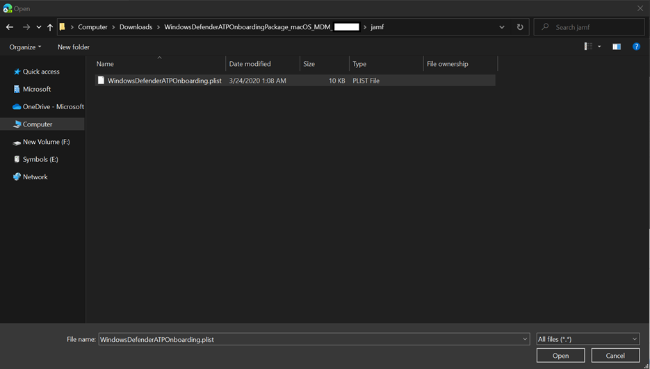

# <a name="set-up-the-microsoft-defender-for-endpoint-for-macos-policies-in-jamf-pro"></a><span data-ttu-id="df197-104">Konfigurera Principer för Microsoft Defender för Slutpunkt för macOS i Jamf Pro</span><span class="sxs-lookup"><span data-stu-id="df197-104">Set up the Microsoft Defender for Endpoint for macOS policies in Jamf Pro</span></span>

[!INCLUDE [Microsoft 365 Defender rebranding](../../includes/microsoft-defender.md)]


<span data-ttu-id="df197-105">**Gäller för:**</span><span class="sxs-lookup"><span data-stu-id="df197-105">**Applies to:**</span></span>

- [<span data-ttu-id="df197-106">Defender för Slutpunkt för Mac</span><span class="sxs-lookup"><span data-stu-id="df197-106">Defender for Endpoint for Mac</span></span>](microsoft-defender-endpoint-mac.md)

<span data-ttu-id="df197-107">På den här sidan går du igenom de steg du måste vidta för att konfigurera macOS-principer i Jamf Pro.</span><span class="sxs-lookup"><span data-stu-id="df197-107">This page will guide you through the steps you need to take to set up macOS policies in Jamf Pro.</span></span>

<span data-ttu-id="df197-108">Du måste göra följande:</span><span class="sxs-lookup"><span data-stu-id="df197-108">You'll need to take the following steps:</span></span>

1. [<span data-ttu-id="df197-109">Skaffa Microsoft Defender för slutpunktens onboarding-paket</span><span class="sxs-lookup"><span data-stu-id="df197-109">Get the Microsoft Defender for Endpoint onboarding package</span></span>](#step-1-get-the-microsoft-defender-for-endpoint-onboarding-package)

2. [<span data-ttu-id="df197-110">Skapa en konfigurationsprofil i Jamf Pro med onboarding-paketet</span><span class="sxs-lookup"><span data-stu-id="df197-110">Create a configuration profile in Jamf Pro using the onboarding package</span></span>](#step-2-create-a-configuration-profile-in-jamf-pro-using-the-onboarding-package)

3. [<span data-ttu-id="df197-111">Konfigurera Microsoft Defender för slutpunktsinställningar</span><span class="sxs-lookup"><span data-stu-id="df197-111">Configure Microsoft Defender for Endpoint settings</span></span>](#step-3-configure-microsoft-defender-for-endpoint-settings)

4. [<span data-ttu-id="df197-112">Konfigurera microsoft Defender för aviseringsinställningar för slutpunkt</span><span class="sxs-lookup"><span data-stu-id="df197-112">Configure Microsoft Defender for Endpoint notification settings</span></span>](#step-4-configure-notifications-settings)

5. [<span data-ttu-id="df197-113">Konfigurera Microsoft AutoUpdate (MAU)</span><span class="sxs-lookup"><span data-stu-id="df197-113">Configure Microsoft AutoUpdate (MAU)</span></span>](#step-5-configure-microsoft-autoupdate-mau)

6. [<span data-ttu-id="df197-114">Bevilja fullständig diskåtkomst till Microsoft Defender för Slutpunkt</span><span class="sxs-lookup"><span data-stu-id="df197-114">Grant full disk access to Microsoft Defender for Endpoint</span></span>](#step-6-grant-full-disk-access-to-microsoft-defender-for-endpoint)

7. [<span data-ttu-id="df197-115">Godkänna Kernel-tillägg för Microsoft Defender för Endpoint</span><span class="sxs-lookup"><span data-stu-id="df197-115">Approve Kernel extension for Microsoft Defender for Endpoint</span></span>](#step-7-approve-kernel-extension-for-microsoft-defender-for-endpoint)

8. [<span data-ttu-id="df197-116">Godkänna systemtillägg för Microsoft Defender för Slutpunkt</span><span class="sxs-lookup"><span data-stu-id="df197-116">Approve System extensions for Microsoft Defender for Endpoint</span></span>](#step-8-approve-system-extensions-for-microsoft-defender-for-endpoint)

9. [<span data-ttu-id="df197-117">Konfigurera nätverkstillägg</span><span class="sxs-lookup"><span data-stu-id="df197-117">Configure Network Extension</span></span>](#step-9-configure-network-extension)

10. [<span data-ttu-id="df197-118">Schemasökningar med Microsoft Defender för Slutpunkt för Mac</span><span class="sxs-lookup"><span data-stu-id="df197-118">Schedule scans with Microsoft Defender for Endpoint for Mac</span></span>](https://docs.microsoft.com/windows/security/threat-protection/microsoft-defender-atp/mac-schedule-scan-atp)

11. [<span data-ttu-id="df197-119">Distribuera Microsoft Defender för Slutpunkt för macOS</span><span class="sxs-lookup"><span data-stu-id="df197-119">Deploy Microsoft Defender for Endpoint for macOS</span></span>](#step-11-deploy-microsoft-defender-for-endpoint-for-macos)


## <a name="step-1-get-the-microsoft-defender-for-endpoint-onboarding-package"></a><span data-ttu-id="df197-120">Steg 1: Skaffa Microsoft Defender för slutpunktens introduktionspaket</span><span class="sxs-lookup"><span data-stu-id="df197-120">Step 1: Get the Microsoft Defender for Endpoint onboarding package</span></span>

1. <span data-ttu-id="df197-121">I [Microsoft Defender Säkerhetscenter](https://securitycenter.microsoft.com )går du till **Inställningar > Onboarding**.</span><span class="sxs-lookup"><span data-stu-id="df197-121">In [Microsoft Defender Security Center](https://securitycenter.microsoft.com ), navigate to **Settings > Onboarding**.</span></span> 

2. <span data-ttu-id="df197-122">Välj macOS som operativsystem och Hantering av mobila enheter/Microsoft Intune som distributionsmetod.</span><span class="sxs-lookup"><span data-stu-id="df197-122">Select macOS as the operating system and Mobile Device Management / Microsoft Intune as the deployment method.</span></span>

    

3. <span data-ttu-id="df197-124">Välj **Hämta introduktionspaket** (WindowsDefenderATPOnboardingPackage.zip).</span><span class="sxs-lookup"><span data-stu-id="df197-124">Select **Download onboarding package** (WindowsDefenderATPOnboardingPackage.zip).</span></span>

4. <span data-ttu-id="df197-125">Extrahera `WindowsDefenderATPOnboardingPackage.zip` .</span><span class="sxs-lookup"><span data-stu-id="df197-125">Extract `WindowsDefenderATPOnboardingPackage.zip`.</span></span>

5. <span data-ttu-id="df197-126">Kopiera filen till önskad plats.</span><span class="sxs-lookup"><span data-stu-id="df197-126">Copy the file to your preferred location.</span></span> <span data-ttu-id="df197-127">Till exempel  `C:\Users\JaneDoe_or_JohnDoe.contoso\Downloads\WindowsDefenderATPOnboardingPackage_macOS_MDM_contoso\jamf\WindowsDefenderATPOnboarding.plist` .</span><span class="sxs-lookup"><span data-stu-id="df197-127">For example,  `C:\Users\JaneDoe_or_JohnDoe.contoso\Downloads\WindowsDefenderATPOnboardingPackage_macOS_MDM_contoso\jamf\WindowsDefenderATPOnboarding.plist`.</span></span>


## <a name="step-2-create-a-configuration-profile-in-jamf-pro-using-the-onboarding-package"></a><span data-ttu-id="df197-128">Steg 2: Skapa en konfigurationsprofil i Jamf Pro med onboarding-paketet</span><span class="sxs-lookup"><span data-stu-id="df197-128">Step 2: Create a configuration profile in Jamf Pro using the onboarding package</span></span>

1. <span data-ttu-id="df197-129">Leta reda på `WindowsDefenderATPOnboarding.plist` filen från föregående avsnitt.</span><span class="sxs-lookup"><span data-stu-id="df197-129">Locate the file `WindowsDefenderATPOnboarding.plist` from the previous section.</span></span>

   

 
2. <span data-ttu-id="df197-131">På instrumentpanelen Jamf Pro väljer du **Ny**.</span><span class="sxs-lookup"><span data-stu-id="df197-131">In the Jamf Pro dashboard, select **New**.</span></span>

    

3. <span data-ttu-id="df197-133">Ange följande information:</span><span class="sxs-lookup"><span data-stu-id="df197-133">Enter the following details:</span></span>

   <span data-ttu-id="df197-134">**Allmänt**</span><span class="sxs-lookup"><span data-stu-id="df197-134">**General**</span></span>
   - <span data-ttu-id="df197-135">Namn: MDATP-registrering för macOS</span><span class="sxs-lookup"><span data-stu-id="df197-135">Name: MDATP onboarding for macOS</span></span>
   - <span data-ttu-id="df197-136">Beskrivning: MDATP EDR-registrering för macOS</span><span class="sxs-lookup"><span data-stu-id="df197-136">Description: MDATP EDR onboarding for macOS</span></span>
   - <span data-ttu-id="df197-137">Kategori: Ingen</span><span class="sxs-lookup"><span data-stu-id="df197-137">Category: None</span></span>
   - <span data-ttu-id="df197-138">Distributionsmetod: Installera automatiskt</span><span class="sxs-lookup"><span data-stu-id="df197-138">Distribution Method: Install Automatically</span></span>
   - <span data-ttu-id="df197-139">Nivå: Datornivå</span><span class="sxs-lookup"><span data-stu-id="df197-139">Level: Computer Level</span></span>

4. <span data-ttu-id="df197-140">I **Program & Anpassade inställningar väljer** du **Konfigurera**.</span><span class="sxs-lookup"><span data-stu-id="df197-140">In **Application & Custom Settings** select **Configure**.</span></span>

    

5. <span data-ttu-id="df197-142">Välj **Ladda upp fil (PLIST-fil)** och ange **sedan:** i Preference Domain anger du: `com.microsoft.wdav.atp` .</span><span class="sxs-lookup"><span data-stu-id="df197-142">Select **Upload File (PLIST file)** then in **Preference Domain** enter: `com.microsoft.wdav.atp`.</span></span> 

    

    

7. <span data-ttu-id="df197-145">Välj **Öppna** och välj onboarding-filen.</span><span class="sxs-lookup"><span data-stu-id="df197-145">Select **Open** and select the onboarding file.</span></span>

    

8. <span data-ttu-id="df197-147">Välj **Ladda upp**.</span><span class="sxs-lookup"><span data-stu-id="df197-147">Select **Upload**.</span></span> 

    


9. <span data-ttu-id="df197-149">Välj **fliken Omfattning.**</span><span class="sxs-lookup"><span data-stu-id="df197-149">Select the **Scope** tab.</span></span>

    

10. <span data-ttu-id="df197-151">Välj måldatorerna.</span><span class="sxs-lookup"><span data-stu-id="df197-151">Select the target computers.</span></span>

    

     

11. <span data-ttu-id="df197-154">Välj **Spara**.</span><span class="sxs-lookup"><span data-stu-id="df197-154">Select **Save**.</span></span>

    

    

12. <span data-ttu-id="df197-157">Välj **Klar**.</span><span class="sxs-lookup"><span data-stu-id="df197-157">Select **Done**.</span></span>

    

    

## <a name="step-3-configure-microsoft-defender-for-endpoint-settings"></a><span data-ttu-id="df197-160">Steg 3: Konfigurera Microsoft Defender för Slutpunktsinställningar</span><span class="sxs-lookup"><span data-stu-id="df197-160">Step 3: Configure Microsoft Defender for Endpoint settings</span></span>

1.  <span data-ttu-id="df197-161">Använd följande konfigurationsinställningar för Microsoft Defender för Slutpunkt:</span><span class="sxs-lookup"><span data-stu-id="df197-161">Use the following Microsoft Defender for Endpoint configuration settings:</span></span>

    - <span data-ttu-id="df197-162">enableRealTimeProtection</span><span class="sxs-lookup"><span data-stu-id="df197-162">enableRealTimeProtection</span></span>
    - <span data-ttu-id="df197-163">passivläge</span><span class="sxs-lookup"><span data-stu-id="df197-163">passiveMode</span></span>
    
    >[!NOTE]
    ><span data-ttu-id="df197-164">Inte aktiverat som standard om du planerar att köra en tredjeparts-AV för macOS ställer du in den på `true` .</span><span class="sxs-lookup"><span data-stu-id="df197-164">Not turned on by default, if you are planning to run a third-party AV for macOS, set it to `true`.</span></span>

    - <span data-ttu-id="df197-165">undantag</span><span class="sxs-lookup"><span data-stu-id="df197-165">exclusions</span></span>
    - <span data-ttu-id="df197-166">excludedPath</span><span class="sxs-lookup"><span data-stu-id="df197-166">excludedPath</span></span>
    - <span data-ttu-id="df197-167">excludedFileExtension</span><span class="sxs-lookup"><span data-stu-id="df197-167">excludedFileExtension</span></span>
    - <span data-ttu-id="df197-168">excludedFileName</span><span class="sxs-lookup"><span data-stu-id="df197-168">excludedFileName</span></span>
    - <span data-ttu-id="df197-169">exclusionsMergePolicy</span><span class="sxs-lookup"><span data-stu-id="df197-169">exclusionsMergePolicy</span></span>
    - <span data-ttu-id="df197-170">allowedThreats</span><span class="sxs-lookup"><span data-stu-id="df197-170">allowedThreats</span></span>
    
    >[!NOTE]
    ><span data-ttu-id="df197-171">EICAR ingår i exemplet. Om du går igenom ett koncepttest bör du ta bort det särskilt om du testar EICAR.</span><span class="sxs-lookup"><span data-stu-id="df197-171">EICAR is on the sample, if you are going through a proof-of-concept, remove it especially if you are testing EICAR.</span></span>
        
    - <span data-ttu-id="df197-172">disallowedThreatActions</span><span class="sxs-lookup"><span data-stu-id="df197-172">disallowedThreatActions</span></span>
    - <span data-ttu-id="df197-173">potentially_unwanted_application</span><span class="sxs-lookup"><span data-stu-id="df197-173">potentially_unwanted_application</span></span>
    - <span data-ttu-id="df197-174">archive_bomb</span><span class="sxs-lookup"><span data-stu-id="df197-174">archive_bomb</span></span>
    - <span data-ttu-id="df197-175">cloudService</span><span class="sxs-lookup"><span data-stu-id="df197-175">cloudService</span></span>
    - <span data-ttu-id="df197-176">automaticSampleSubmission</span><span class="sxs-lookup"><span data-stu-id="df197-176">automaticSampleSubmission</span></span>
    - <span data-ttu-id="df197-177">taggar</span><span class="sxs-lookup"><span data-stu-id="df197-177">tags</span></span>
    - <span data-ttu-id="df197-178">hideStatusMenuIcon</span><span class="sxs-lookup"><span data-stu-id="df197-178">hideStatusMenuIcon</span></span>
    
     <span data-ttu-id="df197-179">Mer information finns i [egenskapslistan för Jamf-konfigurationsprofilen](mac-preferences.md#property-list-for-jamf-configuration-profile).</span><span class="sxs-lookup"><span data-stu-id="df197-179">For information, see [Property list for Jamf configuration profile](mac-preferences.md#property-list-for-jamf-configuration-profile).</span></span>

     ```XML
     <?xml version="1.0" encoding="UTF-8"?>
     <!DOCTYPE plist PUBLIC "-//Apple//DTD PLIST 1.0//EN" "http://www.apple.com/DTDs/PropertyList-1.0.dtd">
     <plist version="1.0">
     <dict>
         <key>antivirusEngine</key>
         <dict>
             <key>enableRealTimeProtection</key>
             <true/>
             <key>passiveMode</key>
             <false/>
             <key>exclusions</key>
             <array>
                 <dict>
                     <key>$type</key>
                     <string>excludedPath</string>
                     <key>isDirectory</key>
                     <false/>
                     <key>path</key>
                     <string>/var/log/system.log</string>
                 </dict>
                 <dict>
                     <key>$type</key>
                     <string>excludedPath</string>
                     <key>isDirectory</key>
                     <true/>
                     <key>path</key>
                     <string>/home</string>
                 </dict>
                 <dict>
                     <key>$type</key>
                     <string>excludedFileExtension</string>
                     <key>extension</key>
                     <string>pdf</string>
                 </dict>
                 <dict>
                     <key>$type</key>
                     <string>excludedFileName</string>
                     <key>name</key>
                     <string>cat</string>
                 </dict>
             </array>
             <key>exclusionsMergePolicy</key>
             <string>merge</string>
             <key>allowedThreats</key>
             <array>
                 <string>EICAR-Test-File (not a virus)</string>
             </array>
             <key>disallowedThreatActions</key>
             <array>
                 <string>allow</string>
                 <string>restore</string>
             </array>
             <key>threatTypeSettings</key>
             <array>
                 <dict>
                     <key>key</key>
                     <string>potentially_unwanted_application</string>
                     <key>value</key>
                     <string>block</string>
                 </dict>
                 <dict>
                     <key>key</key>
                     <string>archive_bomb</string>
                     <key>value</key>
                     <string>audit</string>
                 </dict>
             </array>
             <key>threatTypeSettingsMergePolicy</key>
             <string>merge</string>
         </dict>
         <key>cloudService</key>
         <dict>
             <key>enabled</key>
             <true/>
             <key>diagnosticLevel</key>
             <string>optional</string>
             <key>automaticSampleSubmission</key>
             <true/>
         </dict>
         <key>edr</key>
         <dict>
             <key>tags</key>
             <array>
                 <dict>
                     <key>key</key>
                     <string>GROUP</string>
                     <key>value</key>
                     <string>ExampleTag</string>
                 </dict>
             </array>
         </dict>
         <key>userInterface</key>
         <dict>
             <key>hideStatusMenuIcon</key>
             <false/>
         </dict>
     </dict>
     </plist>
     ```

2. <span data-ttu-id="df197-180">Spara filen som `MDATP_MDAV_configuration_settings.plist` .</span><span class="sxs-lookup"><span data-stu-id="df197-180">Save the file as `MDATP_MDAV_configuration_settings.plist`.</span></span>


3.  <span data-ttu-id="df197-181">Välj **Allmänt** på instrumentpanelen Jamf Pro.</span><span class="sxs-lookup"><span data-stu-id="df197-181">In the Jamf Pro dashboard, select **General**.</span></span>

    

4. <span data-ttu-id="df197-183">Ange följande information:</span><span class="sxs-lookup"><span data-stu-id="df197-183">Enter the following details:</span></span>

    <span data-ttu-id="df197-184">**Allmänt**</span><span class="sxs-lookup"><span data-stu-id="df197-184">**General**</span></span>
    
    - <span data-ttu-id="df197-185">Namn: Konfigurationsinställningar för MDATP MDAV</span><span class="sxs-lookup"><span data-stu-id="df197-185">Name: MDATP MDAV configuration settings</span></span>
    - <span data-ttu-id="df197-186">Beskrivning:\<blank\></span><span class="sxs-lookup"><span data-stu-id="df197-186">Description:\<blank\></span></span>
    - <span data-ttu-id="df197-187">Kategori: Ingen (standard)</span><span class="sxs-lookup"><span data-stu-id="df197-187">Category: None (default)</span></span>
    - <span data-ttu-id="df197-188">Distributionsmetod: Installera automatiskt(standard)</span><span class="sxs-lookup"><span data-stu-id="df197-188">Distribution Method: Install Automatically(default)</span></span>
    - <span data-ttu-id="df197-189">Nivå: Datornivå(standard)</span><span class="sxs-lookup"><span data-stu-id="df197-189">Level: Computer Level(default)</span></span>

    

5. <span data-ttu-id="df197-191">I **Program & Anpassade inställningar väljer** du **Konfigurera**.</span><span class="sxs-lookup"><span data-stu-id="df197-191">In **Application & Custom Settings** select **Configure**.</span></span>

    

6. <span data-ttu-id="df197-193">Välj **Ladda upp fil (PLIST-fil).**</span><span class="sxs-lookup"><span data-stu-id="df197-193">Select **Upload File (PLIST file)**.</span></span>

    

7. <span data-ttu-id="df197-195">I **Preferences Domain** anger du och väljer sedan Upload `com.microsoft.wdav`  **PLIST File**.</span><span class="sxs-lookup"><span data-stu-id="df197-195">In **Preferences Domain**, enter `com.microsoft.wdav`, then select  **Upload PLIST File**.</span></span>

    

8. <span data-ttu-id="df197-197">Välj **Välj fil**.</span><span class="sxs-lookup"><span data-stu-id="df197-197">Select **Choose File**.</span></span>

    

9. <span data-ttu-id="df197-199">Välj fliken **MDATP_MDAV_configuration_settings.plist** och välj sedan **Öppna**.</span><span class="sxs-lookup"><span data-stu-id="df197-199">Select the **MDATP_MDAV_configuration_settings.plist**, then select **Open**.</span></span>

    

10. <span data-ttu-id="df197-201">Välj **Ladda upp**.</span><span class="sxs-lookup"><span data-stu-id="df197-201">Select **Upload**.</span></span>

    

    

    >[!NOTE]
    ><span data-ttu-id="df197-204">Om du råkar ladda upp Intune-filen får du följande felmeddelande:</span><span class="sxs-lookup"><span data-stu-id="df197-204">If you happen to upload the Intune file, you'll get the following error:</span></span><br>
    ><span data-ttu-id="df197-205"></span><span class="sxs-lookup"><span data-stu-id="df197-205"></span></span>


11. <span data-ttu-id="df197-206">Välj **Spara**.</span><span class="sxs-lookup"><span data-stu-id="df197-206">Select **Save**.</span></span> 

    

12. <span data-ttu-id="df197-208">Filen laddas upp.</span><span class="sxs-lookup"><span data-stu-id="df197-208">The file is uploaded.</span></span>

    

    

13. <span data-ttu-id="df197-211">Välj **fliken Omfattning.**</span><span class="sxs-lookup"><span data-stu-id="df197-211">Select the **Scope** tab.</span></span>

    

14. <span data-ttu-id="df197-213">Välj **Contosos datorgrupp.**</span><span class="sxs-lookup"><span data-stu-id="df197-213">Select **Contoso's Machine Group**.</span></span> 

15. <span data-ttu-id="df197-214">Välj **Lägg** till och välj sedan **Spara**.</span><span class="sxs-lookup"><span data-stu-id="df197-214">Select **Add**, then select **Save**.</span></span>

    

    

16. <span data-ttu-id="df197-217">Välj **Klar**.</span><span class="sxs-lookup"><span data-stu-id="df197-217">Select **Done**.</span></span> <span data-ttu-id="df197-218">Den nya konfigurationsprofilen **visas.**</span><span class="sxs-lookup"><span data-stu-id="df197-218">You'll see the new **Configuration profile**.</span></span>

    


## <a name="step-4-configure-notifications-settings"></a><span data-ttu-id="df197-220">Steg 4: Konfigurera aviseringsinställningar</span><span class="sxs-lookup"><span data-stu-id="df197-220">Step 4: Configure notifications settings</span></span>

<span data-ttu-id="df197-221">De här stegen gäller för macOS 10.15 (Catalina) eller nyare.</span><span class="sxs-lookup"><span data-stu-id="df197-221">These steps are applicable of macOS 10.15 (Catalina) or newer.</span></span>

1. <span data-ttu-id="df197-222">Ladda `notif.mobileconfig` ned från vår [GitHub-lagringsplats](https://raw.githubusercontent.com/microsoft/mdatp-xplat/master/macos/mobileconfig/profiles/notif.mobileconfig)</span><span class="sxs-lookup"><span data-stu-id="df197-222">Download `notif.mobileconfig` from [our GitHub repository](https://raw.githubusercontent.com/microsoft/mdatp-xplat/master/macos/mobileconfig/profiles/notif.mobileconfig)</span></span>

2. <span data-ttu-id="df197-223">Spara den som `MDATP_MDAV_notification_settings.plist` .</span><span class="sxs-lookup"><span data-stu-id="df197-223">Save it as `MDATP_MDAV_notification_settings.plist`.</span></span>

3. <span data-ttu-id="df197-224">Välj **Allmänt** på instrumentpanelen Jamf Pro.</span><span class="sxs-lookup"><span data-stu-id="df197-224">In the Jamf Pro dashboard, select **General**.</span></span> 
       
4. <span data-ttu-id="df197-225">Ange följande information:</span><span class="sxs-lookup"><span data-stu-id="df197-225">Enter the following details:</span></span>

    <span data-ttu-id="df197-226">**Allmänt**</span><span class="sxs-lookup"><span data-stu-id="df197-226">**General**</span></span> 
    
    - <span data-ttu-id="df197-227">Namn: Meddelandeinställningar för MDATP MDAV</span><span class="sxs-lookup"><span data-stu-id="df197-227">Name: MDATP MDAV Notification settings</span></span>
    - <span data-ttu-id="df197-228">Beskrivning: macOS 10.15 (Catalina) eller nyare</span><span class="sxs-lookup"><span data-stu-id="df197-228">Description: macOS 10.15 (Catalina) or newer</span></span>
    - <span data-ttu-id="df197-229">Kategori: Ingen (standard)</span><span class="sxs-lookup"><span data-stu-id="df197-229">Category: None (default)</span></span>
    - <span data-ttu-id="df197-230">Distributionsmetod: Installera automatiskt(standard)</span><span class="sxs-lookup"><span data-stu-id="df197-230">Distribution Method: Install Automatically(default)</span></span>
    - <span data-ttu-id="df197-231">Nivå: Datornivå(standard)</span><span class="sxs-lookup"><span data-stu-id="df197-231">Level: Computer Level(default)</span></span>

    


5. <span data-ttu-id="df197-233">Välj **Ladda upp fil (PLIST-fil).**</span><span class="sxs-lookup"><span data-stu-id="df197-233">Select **Upload File (PLIST file)**.</span></span>

    
 

6. <span data-ttu-id="df197-235">Välj **Välj**  >  **MDATP_MDAV_Notification_Settings.plist**.</span><span class="sxs-lookup"><span data-stu-id="df197-235">Select **Choose File** > **MDATP_MDAV_Notification_Settings.plist**.</span></span>


    


    

7. <span data-ttu-id="df197-238">Välj **Öppna Ladda**  >  **upp.**</span><span class="sxs-lookup"><span data-stu-id="df197-238">Select **Open** > **Upload**.</span></span>

    


    

8. <span data-ttu-id="df197-241">Välj fliken **Omfattning** och välj sedan Lägg **till**.</span><span class="sxs-lookup"><span data-stu-id="df197-241">Select the **Scope** tab, then select **Add**.</span></span>

    


9. <span data-ttu-id="df197-243">Välj **Contosos datorgrupp.**</span><span class="sxs-lookup"><span data-stu-id="df197-243">Select **Contoso's Machine Group**.</span></span> 

10. <span data-ttu-id="df197-244">Välj **Lägg** till och välj sedan **Spara**.</span><span class="sxs-lookup"><span data-stu-id="df197-244">Select **Add**, then select **Save**.</span></span>
    
    

    
    

11. <span data-ttu-id="df197-247">Välj **Klar**.</span><span class="sxs-lookup"><span data-stu-id="df197-247">Select **Done**.</span></span> <span data-ttu-id="df197-248">Den nya konfigurationsprofilen **visas.**</span><span class="sxs-lookup"><span data-stu-id="df197-248">You'll see the new **Configuration profile**.</span></span>
    <span data-ttu-id="df197-249"></span><span class="sxs-lookup"><span data-stu-id="df197-249"></span></span>

## <a name="step-5-configure-microsoft-autoupdate-mau"></a><span data-ttu-id="df197-250">Steg 5: Konfigurera Microsoft AutoUpdate (MAU)</span><span class="sxs-lookup"><span data-stu-id="df197-250">Step 5: Configure Microsoft AutoUpdate (MAU)</span></span>

1. <span data-ttu-id="df197-251">Använd följande konfigurationsinställningar för Microsoft Defender för Slutpunkt:</span><span class="sxs-lookup"><span data-stu-id="df197-251">Use the following Microsoft Defender for Endpoint configuration settings:</span></span>

      ```XML
   <?xml version="1.0" encoding="UTF-8"?>
   <!DOCTYPE plist PUBLIC "-//Apple//DTD PLIST 1.0//EN" "http://www.apple.com/DTDs/PropertyList-1.0.dtd">
   <plist version="1.0">
   <dict>
    <key>ChannelName</key>
    <string>Current</string>
    <key>HowToCheck</key>
    <string>AutomaticDownload</string>
    <key>EnableCheckForUpdatesButton</key>
    <true/>
    <key>DisableInsiderCheckbox</key>
    <false/>
    <key>SendAllTelemetryEnabled</key>
    <true/>
   </dict>
   </plist>
   ```

2. <span data-ttu-id="df197-252">Spara den som `MDATP_MDAV_MAU_settings.plist` .</span><span class="sxs-lookup"><span data-stu-id="df197-252">Save it as `MDATP_MDAV_MAU_settings.plist`.</span></span>

3. <span data-ttu-id="df197-253">Välj **Allmänt** på instrumentpanelen Jamf Pro.</span><span class="sxs-lookup"><span data-stu-id="df197-253">In the Jamf Pro dashboard, select **General**.</span></span> 

    

4. <span data-ttu-id="df197-255">Ange följande information:</span><span class="sxs-lookup"><span data-stu-id="df197-255">Enter the following details:</span></span>

    <span data-ttu-id="df197-256">**Allmänt**</span><span class="sxs-lookup"><span data-stu-id="df197-256">**General**</span></span> 
    
    - <span data-ttu-id="df197-257">Namn: MDATP MDAV MAU-inställningar</span><span class="sxs-lookup"><span data-stu-id="df197-257">Name: MDATP MDAV MAU settings</span></span>
    - <span data-ttu-id="df197-258">Beskrivning: Microsoft AutoUpdate-inställningar för MDATP för macOS</span><span class="sxs-lookup"><span data-stu-id="df197-258">Description: Microsoft AutoUpdate settings for MDATP for macOS</span></span>
    - <span data-ttu-id="df197-259">Kategori: Ingen (standard)</span><span class="sxs-lookup"><span data-stu-id="df197-259">Category: None (default)</span></span>
    - <span data-ttu-id="df197-260">Distributionsmetod: Installera automatiskt(standard)</span><span class="sxs-lookup"><span data-stu-id="df197-260">Distribution Method: Install Automatically(default)</span></span>
    - <span data-ttu-id="df197-261">Nivå: Datornivå(standard)</span><span class="sxs-lookup"><span data-stu-id="df197-261">Level: Computer Level(default)</span></span>

5. <span data-ttu-id="df197-262">I **Program & Anpassade inställningar väljer** du **Konfigurera**.</span><span class="sxs-lookup"><span data-stu-id="df197-262">In **Application & Custom Settings** select **Configure**.</span></span>

    

6. <span data-ttu-id="df197-264">Välj **Ladda upp fil (PLIST-fil).**</span><span class="sxs-lookup"><span data-stu-id="df197-264">Select **Upload File (PLIST file)**.</span></span>

      

7. <span data-ttu-id="df197-266">I **Preference Domain** anger du: och väljer sedan Upload `com.microsoft.autoupdate2` **PLIST File**.</span><span class="sxs-lookup"><span data-stu-id="df197-266">In **Preference Domain** enter: `com.microsoft.autoupdate2`, then select **Upload PLIST File**.</span></span>

    

8. <span data-ttu-id="df197-268">Välj **Välj fil**.</span><span class="sxs-lookup"><span data-stu-id="df197-268">Select **Choose File**.</span></span>

    

9. <span data-ttu-id="df197-270">Välj **MDATP_MDAV_MAU_settings.plist**.</span><span class="sxs-lookup"><span data-stu-id="df197-270">Select **MDATP_MDAV_MAU_settings.plist**.</span></span>

    

10. <span data-ttu-id="df197-272">Välj **Ladda upp**.</span><span class="sxs-lookup"><span data-stu-id="df197-272">Select **Upload**.</span></span>
    <span data-ttu-id="df197-273"></span><span class="sxs-lookup"><span data-stu-id="df197-273"></span></span>

    

11. <span data-ttu-id="df197-275">Välj **Spara**.</span><span class="sxs-lookup"><span data-stu-id="df197-275">Select **Save**.</span></span>

    

12. <span data-ttu-id="df197-277">Välj **fliken Omfattning.**</span><span class="sxs-lookup"><span data-stu-id="df197-277">Select the **Scope** tab.</span></span>
   
     

13. <span data-ttu-id="df197-279">Välj **Lägg till**.</span><span class="sxs-lookup"><span data-stu-id="df197-279">Select **Add**.</span></span>
    
    

    

    

14. <span data-ttu-id="df197-283">Välj **Klar**.</span><span class="sxs-lookup"><span data-stu-id="df197-283">Select **Done**.</span></span>
    
    

## <a name="step-6-grant-full-disk-access-to-microsoft-defender-for-endpoint"></a><span data-ttu-id="df197-285">Steg 6: Ge fullständig diskåtkomst till Microsoft Defender för Slutpunkt</span><span class="sxs-lookup"><span data-stu-id="df197-285">Step 6: Grant full disk access to Microsoft Defender for Endpoint</span></span>

1. <span data-ttu-id="df197-286">Välj Konfigurationsprofiler på instrumentpanelen Jamf **Pro.**</span><span class="sxs-lookup"><span data-stu-id="df197-286">In the Jamf Pro dashboard, select **Configuration Profiles**.</span></span>

    

2. <span data-ttu-id="df197-288">Välj **+ Ny.**</span><span class="sxs-lookup"><span data-stu-id="df197-288">Select **+ New**.</span></span> 

3. <span data-ttu-id="df197-289">Ange följande information:</span><span class="sxs-lookup"><span data-stu-id="df197-289">Enter the following details:</span></span>

    <span data-ttu-id="df197-290">**Allmänt**</span><span class="sxs-lookup"><span data-stu-id="df197-290">**General**</span></span> 
    - <span data-ttu-id="df197-291">Namn: MDATP MDAV – tilldela fullständig diskåtkomst till EDR och AV</span><span class="sxs-lookup"><span data-stu-id="df197-291">Name: MDATP MDAV - grant Full Disk Access to EDR and AV</span></span>
    - <span data-ttu-id="df197-292">Beskrivning: På macOS Catalina eller nyare, den nya kontrollen för sekretesspolicy</span><span class="sxs-lookup"><span data-stu-id="df197-292">Description: On macOS Catalina or newer, the new Privacy Preferences Policy Control</span></span>
    - <span data-ttu-id="df197-293">Kategori: Ingen</span><span class="sxs-lookup"><span data-stu-id="df197-293">Category: None</span></span>
    - <span data-ttu-id="df197-294">Distributionsmetod: Installera automatiskt</span><span class="sxs-lookup"><span data-stu-id="df197-294">Distribution method: Install Automatically</span></span>
    - <span data-ttu-id="df197-295">Nivå: Datornivå</span><span class="sxs-lookup"><span data-stu-id="df197-295">Level: Computer level</span></span>


    

4. <span data-ttu-id="df197-297">I **Konfigurera principkontrollen för sekretesspolicy väljer** du **Konfigurera**.</span><span class="sxs-lookup"><span data-stu-id="df197-297">In **Configure Privacy Preferences Policy Control** select **Configure**.</span></span>

    

5. <span data-ttu-id="df197-299">Ange **följande information i Kontrollen** av sekretesspolicyn:</span><span class="sxs-lookup"><span data-stu-id="df197-299">In **Privacy Preferences Policy Control**, enter the following details:</span></span>

    - <span data-ttu-id="df197-300">Identifierare: `com.microsoft.wdav`</span><span class="sxs-lookup"><span data-stu-id="df197-300">Identifier: `com.microsoft.wdav`</span></span>
    - <span data-ttu-id="df197-301">Identifierartyp: Paket-ID</span><span class="sxs-lookup"><span data-stu-id="df197-301">Identifier Type: Bundle ID</span></span>
    - <span data-ttu-id="df197-302">Kodkrav: `identifier "com.microsoft.wdav" and anchor apple generic and certificate 1[field.1.2.840.113635.100.6.2.6] /* exists */ and certificate leaf[field.1.2.840.113635.100.6.1.13] /* exists */ and certificate leaf[subject.OU] = UBF8T346G9`</span><span class="sxs-lookup"><span data-stu-id="df197-302">Code Requirement: `identifier "com.microsoft.wdav" and anchor apple generic and certificate 1[field.1.2.840.113635.100.6.2.6] /* exists */ and certificate leaf[field.1.2.840.113635.100.6.1.13] /* exists */ and certificate leaf[subject.OU] = UBF8T346G9`</span></span>


    

6. <span data-ttu-id="df197-304">Välj **+ Lägg till.**</span><span class="sxs-lookup"><span data-stu-id="df197-304">Select **+ Add**.</span></span>

    

    - <span data-ttu-id="df197-306">Under App eller tjänst: Ställ in **på SystemPolicyAllFiles**</span><span class="sxs-lookup"><span data-stu-id="df197-306">Under App or service: Set to **SystemPolicyAllFiles**</span></span>

    - <span data-ttu-id="df197-307">Under "åtkomst": Ange som **Tillåt**</span><span class="sxs-lookup"><span data-stu-id="df197-307">Under "access": Set to **Allow**</span></span>

7. <span data-ttu-id="df197-308">Välj **Spara** (inte det längst ned till höger).</span><span class="sxs-lookup"><span data-stu-id="df197-308">Select **Save** (not the one at the bottom right).</span></span>

    

8. <span data-ttu-id="df197-310">Klicka på `+` tecknet bredvid **Appåtkomst för att** lägga till en ny post.</span><span class="sxs-lookup"><span data-stu-id="df197-310">Click the `+` sign next to **App Access** to add a new entry.</span></span>

    

9. <span data-ttu-id="df197-312">Ange följande information:</span><span class="sxs-lookup"><span data-stu-id="df197-312">Enter the following details:</span></span>

    - <span data-ttu-id="df197-313">Identifierare: `com.microsoft.wdav.epsext`</span><span class="sxs-lookup"><span data-stu-id="df197-313">Identifier: `com.microsoft.wdav.epsext`</span></span>
    - <span data-ttu-id="df197-314">Identifierartyp: Paket-ID</span><span class="sxs-lookup"><span data-stu-id="df197-314">Identifier Type: Bundle ID</span></span>
    - <span data-ttu-id="df197-315">Kodkrav: `identifier "com.microsoft.wdav.epsext" and anchor apple generic and certificate 1[field.1.2.840.113635.100.6.2.6] /* exists */ and certificate leaf[field.1.2.840.113635.100.6.1.13] /* exists */ and certificate leaf[subject.OU] = UBF8T346G9`</span><span class="sxs-lookup"><span data-stu-id="df197-315">Code Requirement: `identifier "com.microsoft.wdav.epsext" and anchor apple generic and certificate 1[field.1.2.840.113635.100.6.2.6] /* exists */ and certificate leaf[field.1.2.840.113635.100.6.1.13] /* exists */ and certificate leaf[subject.OU] = UBF8T346G9`</span></span>

10. <span data-ttu-id="df197-316">Välj **+ Lägg till.**</span><span class="sxs-lookup"><span data-stu-id="df197-316">Select **+ Add**.</span></span>

    

    - <span data-ttu-id="df197-318">Under App eller tjänst: Ställ in **på SystemPolicyAllFiles**</span><span class="sxs-lookup"><span data-stu-id="df197-318">Under App or service: Set to **SystemPolicyAllFiles**</span></span>

    - <span data-ttu-id="df197-319">Under "åtkomst": Ange som **Tillåt**</span><span class="sxs-lookup"><span data-stu-id="df197-319">Under "access": Set to **Allow**</span></span>

11. <span data-ttu-id="df197-320">Välj **Spara** (inte det längst ned till höger).</span><span class="sxs-lookup"><span data-stu-id="df197-320">Select **Save** (not the one at the bottom right).</span></span>

    

12. <span data-ttu-id="df197-322">Välj **fliken Omfattning.**</span><span class="sxs-lookup"><span data-stu-id="df197-322">Select the **Scope** tab.</span></span>

    

13. <span data-ttu-id="df197-324">Välj **+ Lägg till.**</span><span class="sxs-lookup"><span data-stu-id="df197-324">Select **+ Add**.</span></span>

    

14. <span data-ttu-id="df197-326">Välj **Datorgrupper** > under **Gruppnamn** > **välj Contosos Datorgrupp.**</span><span class="sxs-lookup"><span data-stu-id="df197-326">Select **Computer Groups** > under **Group Name** > select **Contoso's MachineGroup**.</span></span> 

    

15. <span data-ttu-id="df197-328">Välj **Lägg till**.</span><span class="sxs-lookup"><span data-stu-id="df197-328">Select **Add**.</span></span> 

16. <span data-ttu-id="df197-329">Välj **Spara**.</span><span class="sxs-lookup"><span data-stu-id="df197-329">Select **Save**.</span></span> 
    
17. <span data-ttu-id="df197-330">Välj **Klar**.</span><span class="sxs-lookup"><span data-stu-id="df197-330">Select **Done**.</span></span>
    
    
    
    


## <a name="step-7-approve-kernel-extension-for-microsoft-defender-for-endpoint"></a><span data-ttu-id="df197-333">Steg 7: Godkänna Kernel-tillägg för Microsoft Defender för Slutpunkt</span><span class="sxs-lookup"><span data-stu-id="df197-333">Step 7: Approve Kernel extension for Microsoft Defender for Endpoint</span></span>

1. <span data-ttu-id="df197-334">I **Konfigurationsprofiler** väljer du **+ Ny.**</span><span class="sxs-lookup"><span data-stu-id="df197-334">In the **Configuration Profiles**, select **+ New**.</span></span>

    

2. <span data-ttu-id="df197-336">Ange följande information:</span><span class="sxs-lookup"><span data-stu-id="df197-336">Enter the following details:</span></span>

    <span data-ttu-id="df197-337">**Allmänt**</span><span class="sxs-lookup"><span data-stu-id="df197-337">**General**</span></span> 
    
    - <span data-ttu-id="df197-338">Namn: MDATP MDAV Kernel-tillägg</span><span class="sxs-lookup"><span data-stu-id="df197-338">Name: MDATP MDAV Kernel Extension</span></span>
    - <span data-ttu-id="df197-339">Beskrivning: MDATP-kerneltillägg (kext)</span><span class="sxs-lookup"><span data-stu-id="df197-339">Description: MDATP kernel extension (kext)</span></span>
    - <span data-ttu-id="df197-340">Kategori: Ingen</span><span class="sxs-lookup"><span data-stu-id="df197-340">Category: None</span></span>
    - <span data-ttu-id="df197-341">Distributionsmetod: Installera automatiskt</span><span class="sxs-lookup"><span data-stu-id="df197-341">Distribution Method: Install Automatically</span></span>
    - <span data-ttu-id="df197-342">Nivå: Datornivå</span><span class="sxs-lookup"><span data-stu-id="df197-342">Level: Computer Level</span></span>

    

3. <span data-ttu-id="df197-344">Välj **Konfigurera i Konfigurera godkända Kernel-tillägg.** </span><span class="sxs-lookup"><span data-stu-id="df197-344">In **Configure Approved Kernel Extensions** select **Configure**.</span></span>

    

   
4. <span data-ttu-id="df197-346">Ange **följande information i Godkända Kernel-tillägg:**</span><span class="sxs-lookup"><span data-stu-id="df197-346">In **Approved Kernel Extensions** Enter the following details:</span></span>

    - <span data-ttu-id="df197-347">Visningsnamn: Microsoft Corp.</span><span class="sxs-lookup"><span data-stu-id="df197-347">Display Name: Microsoft Corp.</span></span>
    - <span data-ttu-id="df197-348">Team-ID: UBF8T346G9</span><span class="sxs-lookup"><span data-stu-id="df197-348">Team ID: UBF8T346G9</span></span>

    

5. <span data-ttu-id="df197-350">Välj **fliken Omfattning.**</span><span class="sxs-lookup"><span data-stu-id="df197-350">Select the **Scope** tab.</span></span>

    

6. <span data-ttu-id="df197-352">Välj **+ Lägg till.**</span><span class="sxs-lookup"><span data-stu-id="df197-352">Select **+ Add**.</span></span>

7. <span data-ttu-id="df197-353">Välj **Datorgrupper** > under **Gruppnamn** > **sedan Contosos datorgrupp.**</span><span class="sxs-lookup"><span data-stu-id="df197-353">Select **Computer Groups** > under **Group Name** > select **Contoso's Machine Group**.</span></span>

8. <span data-ttu-id="df197-354">Välj **+ Lägg till.**</span><span class="sxs-lookup"><span data-stu-id="df197-354">Select **+ Add**.</span></span>

    

9. <span data-ttu-id="df197-356">Välj **Spara**.</span><span class="sxs-lookup"><span data-stu-id="df197-356">Select **Save**.</span></span>

    

10. <span data-ttu-id="df197-358">Välj **Klar**.</span><span class="sxs-lookup"><span data-stu-id="df197-358">Select **Done**.</span></span>

    


## <a name="step-8-approve-system-extensions-for-microsoft-defender-for-endpoint"></a><span data-ttu-id="df197-360">Steg 8: Godkänna systemtillägg för Microsoft Defender för Slutpunkt</span><span class="sxs-lookup"><span data-stu-id="df197-360">Step 8: Approve System extensions for Microsoft Defender for Endpoint</span></span>

1. <span data-ttu-id="df197-361">I **Konfigurationsprofiler** väljer du **+ Ny.**</span><span class="sxs-lookup"><span data-stu-id="df197-361">In the **Configuration Profiles**, select **+ New**.</span></span>

    

2. <span data-ttu-id="df197-363">Ange följande information:</span><span class="sxs-lookup"><span data-stu-id="df197-363">Enter the following details:</span></span>

    <span data-ttu-id="df197-364">**Allmänt**</span><span class="sxs-lookup"><span data-stu-id="df197-364">**General**</span></span>
    
    - <span data-ttu-id="df197-365">Namn: MDATP MDAV-systemtillägg</span><span class="sxs-lookup"><span data-stu-id="df197-365">Name: MDATP MDAV System Extensions</span></span>
    - <span data-ttu-id="df197-366">Beskrivning: MDATP-systemtillägg</span><span class="sxs-lookup"><span data-stu-id="df197-366">Description: MDATP system extensions</span></span>
    - <span data-ttu-id="df197-367">Kategori: Ingen</span><span class="sxs-lookup"><span data-stu-id="df197-367">Category: None</span></span>
    - <span data-ttu-id="df197-368">Distributionsmetod: Installera automatiskt</span><span class="sxs-lookup"><span data-stu-id="df197-368">Distribution Method: Install Automatically</span></span>
    - <span data-ttu-id="df197-369">Nivå: Datornivå</span><span class="sxs-lookup"><span data-stu-id="df197-369">Level: Computer Level</span></span>

    

3. <span data-ttu-id="df197-371">Välj **Konfigurera i** **Systemtillägg.**</span><span class="sxs-lookup"><span data-stu-id="df197-371">In **System Extensions** select **Configure**.</span></span>

   

4. <span data-ttu-id="df197-373">Ange följande information i **Systemtillägg:**</span><span class="sxs-lookup"><span data-stu-id="df197-373">In **System Extensions** enter the following details:</span></span>

   - <span data-ttu-id="df197-374">Visningsnamn: Microsoft Corp. System Extensions</span><span class="sxs-lookup"><span data-stu-id="df197-374">Display Name: Microsoft Corp. System Extensions</span></span>
   - <span data-ttu-id="df197-375">Systemtilläggstyper: Tillåtna systemtillägg</span><span class="sxs-lookup"><span data-stu-id="df197-375">System Extension Types: Allowed System Extensions</span></span>
   - <span data-ttu-id="df197-376">Team Identifier: UBF8T346G9</span><span class="sxs-lookup"><span data-stu-id="df197-376">Team Identifier: UBF8T346G9</span></span>
   - <span data-ttu-id="df197-377">Tillåtna systemtillägg:</span><span class="sxs-lookup"><span data-stu-id="df197-377">Allowed System Extensions:</span></span>
     - <span data-ttu-id="df197-378">**com.microsoft.wdav.epsext**</span><span class="sxs-lookup"><span data-stu-id="df197-378">**com.microsoft.wdav.epsext**</span></span>
     - <span data-ttu-id="df197-379">**com.microsoft.wdav.netext**</span><span class="sxs-lookup"><span data-stu-id="df197-379">**com.microsoft.wdav.netext**</span></span>

    

5. <span data-ttu-id="df197-381">Välj **fliken Omfattning.**</span><span class="sxs-lookup"><span data-stu-id="df197-381">Select the **Scope** tab.</span></span>

    

6. <span data-ttu-id="df197-383">Välj **+ Lägg till.**</span><span class="sxs-lookup"><span data-stu-id="df197-383">Select **+ Add**.</span></span>

7. <span data-ttu-id="df197-384">Välj **Datorgrupper** > under **Gruppnamn** > **sedan Contosos datorgrupp.**</span><span class="sxs-lookup"><span data-stu-id="df197-384">Select **Computer Groups** > under **Group Name** > select **Contoso's Machine Group**.</span></span>

8. <span data-ttu-id="df197-385">Välj **+ Lägg till.**</span><span class="sxs-lookup"><span data-stu-id="df197-385">Select **+ Add**.</span></span>

   

9. <span data-ttu-id="df197-387">Välj **Spara**.</span><span class="sxs-lookup"><span data-stu-id="df197-387">Select **Save**.</span></span>

   

10. <span data-ttu-id="df197-389">Välj **Klar**.</span><span class="sxs-lookup"><span data-stu-id="df197-389">Select **Done**.</span></span>

    

## <a name="step-9-configure-network-extension"></a><span data-ttu-id="df197-391">Steg 9: Konfigurera nätverkstillägg</span><span class="sxs-lookup"><span data-stu-id="df197-391">Step 9: Configure Network Extension</span></span>

<span data-ttu-id="df197-392">Som en del av funktionerna Identifiering av slutpunkt och svar inspekterar Microsoft Defender för Slutpunkt för Mac sockettrafik och rapporterar den här informationen till Microsoft Defender Säkerhetscenter-portalen.</span><span class="sxs-lookup"><span data-stu-id="df197-392">As part of the Endpoint Detection and Response capabilities, Microsoft Defender for Endpoint for Mac inspects socket traffic and reports this information to the Microsoft Defender Security Center portal.</span></span> <span data-ttu-id="df197-393">Med följande princip kan nätverkstillägget utföra de här funktionerna.</span><span class="sxs-lookup"><span data-stu-id="df197-393">The following policy allows the network extension to perform this functionality.</span></span>

>[!NOTE]
><span data-ttu-id="df197-394">JAMF har inte inbyggt stöd för principer för innehållsfiltrering, vilket är en förutsättning för att aktivera nätverkstillägg som Microsoft Defender för Endpoint för Mac installerar på enheten.</span><span class="sxs-lookup"><span data-stu-id="df197-394">JAMF doesn’t have built-in support for content filtering policies, which are a pre-requisite for enabling the network extensions that Microsoft Defender for Endpoint for Mac installs on the device.</span></span> <span data-ttu-id="df197-395">DESSUTOM ändrar JAMF ibland innehållet i de principer som distribueras.</span><span class="sxs-lookup"><span data-stu-id="df197-395">Furthermore, JAMF sometimes changes the content of the policies being deployed.</span></span>
><span data-ttu-id="df197-396">Följande steg ger dig därför en lösning som innebär att du signerar konfigurationsprofilen.</span><span class="sxs-lookup"><span data-stu-id="df197-396">As such, the following steps provide a workaround that involve signing the configuration profile.</span></span>

1. <span data-ttu-id="df197-397">Ladda `netfilter.mobileconfig` ned från vår [GitHub-lagringsplats](https://raw.githubusercontent.com/microsoft/mdatp-xplat/master/macos/mobileconfig/profiles/netfilter.mobileconfig) till din enhet och spara den som `com.microsoft.network-extension.mobileconfig`</span><span class="sxs-lookup"><span data-stu-id="df197-397">Download `netfilter.mobileconfig` from [our GitHub repository](https://raw.githubusercontent.com/microsoft/mdatp-xplat/master/macos/mobileconfig/profiles/netfilter.mobileconfig) to your device and save it as `com.microsoft.network-extension.mobileconfig`</span></span>

2. <span data-ttu-id="df197-398">Följ instruktionerna på [den här sidan](https://www.jamf.com/jamf-nation/articles/649/creating-a-signing-certificate-using-jamf-pro-s-built-in-certificate-authority) för att skapa ett signeringscertifikat med HJÄLP av DEN inbyggda certifikatutfärdaren i JAMF</span><span class="sxs-lookup"><span data-stu-id="df197-398">Follow the instructions on [this page](https://www.jamf.com/jamf-nation/articles/649/creating-a-signing-certificate-using-jamf-pro-s-built-in-certificate-authority) to create a signing certificate using JAMF’s built-in certificate authority</span></span>

3. <span data-ttu-id="df197-399">När certifikatet har skapats och installerats på enheten kör du följande kommando från terminalen från en macOS-enhet:</span><span class="sxs-lookup"><span data-stu-id="df197-399">After the certificate is created and installed to your device, run the following command from the Terminal from a macOS device:</span></span>

   ```bash
   $ security cms -S -N "<certificate name>" -i com.microsoft.network-extension.mobileconfig -o com.microsoft.network-extension.signed.mobileconfig
   ```

   

4. <span data-ttu-id="df197-401">Från JAMF-portalen går du till **Konfigurationsprofiler** och klickar på **knappen Ladda** upp.</span><span class="sxs-lookup"><span data-stu-id="df197-401">From the JAMF portal, navigate to **Configuration Profiles** and click the **Upload** button.</span></span> 

   

5. <span data-ttu-id="df197-403">Välj **Välj fil** och välj `microsoft.network-extension.signed.mobileconfig` .</span><span class="sxs-lookup"><span data-stu-id="df197-403">Select **Choose File** and select `microsoft.network-extension.signed.mobileconfig`.</span></span>

   

6. <span data-ttu-id="df197-405">Välj **Ladda upp**.</span><span class="sxs-lookup"><span data-stu-id="df197-405">Select **Upload**.</span></span>

   

7. <span data-ttu-id="df197-407">När du har laddat upp filen omdirigeras du till en ny sida för att slutföra skapandet av profilen.</span><span class="sxs-lookup"><span data-stu-id="df197-407">After uploading the file, you are redirected to a new page to finalize the creation of this profile.</span></span>

   

8. <span data-ttu-id="df197-409">Välj **fliken Omfattning.**</span><span class="sxs-lookup"><span data-stu-id="df197-409">Select the **Scope** tab.</span></span>

   

9. <span data-ttu-id="df197-411">Välj **+ Lägg till.**</span><span class="sxs-lookup"><span data-stu-id="df197-411">Select **+ Add**.</span></span>

10. <span data-ttu-id="df197-412">Välj **Datorgrupper** > under **Gruppnamn** > **sedan Contosos datorgrupp.**</span><span class="sxs-lookup"><span data-stu-id="df197-412">Select **Computer Groups** > under **Group Name** > select **Contoso's Machine Group**.</span></span>

11. <span data-ttu-id="df197-413">Välj **+ Lägg till.**</span><span class="sxs-lookup"><span data-stu-id="df197-413">Select **+ Add**.</span></span>

    

12. <span data-ttu-id="df197-415">Välj **Spara**.</span><span class="sxs-lookup"><span data-stu-id="df197-415">Select **Save**.</span></span>

    

13. <span data-ttu-id="df197-417">Välj **Klar**.</span><span class="sxs-lookup"><span data-stu-id="df197-417">Select **Done**.</span></span>

    

## <a name="step-10-schedule-scans-with-microsoft-defender-for-endpoint-for-mac"></a><span data-ttu-id="df197-419">Steg 10: Schemalägga genomsökningar med Microsoft Defender för Slutpunkt för Mac</span><span class="sxs-lookup"><span data-stu-id="df197-419">Step 10: Schedule scans with Microsoft Defender for Endpoint for Mac</span></span>
<span data-ttu-id="df197-420">Följ anvisningarna i [Schemalägga genomsökningar med Microsoft Defender för Endpoint för Mac.](https://docs.microsoft.com/windows/security/threat-protection/microsoft-defender-atp/mac-schedule-scan-atp)</span><span class="sxs-lookup"><span data-stu-id="df197-420">Follow the instructions on [Schedule scans with Microsoft Defender for Endpoint for Mac](https://docs.microsoft.com/windows/security/threat-protection/microsoft-defender-atp/mac-schedule-scan-atp).</span></span>

## <a name="step-11-deploy-microsoft-defender-for-endpoint-for-macos"></a><span data-ttu-id="df197-421">Steg 11: Distribuera Microsoft Defender för Slutpunkt för macOS</span><span class="sxs-lookup"><span data-stu-id="df197-421">Step 11: Deploy Microsoft Defender for Endpoint for macOS</span></span>

1. <span data-ttu-id="df197-422">Gå till den plats där du sparade `wdav.pkg` .</span><span class="sxs-lookup"><span data-stu-id="df197-422">Navigate to where you saved `wdav.pkg`.</span></span>

    

2. <span data-ttu-id="df197-424">Byt namn på den till `wdav_MDM_Contoso_200329.pkg` .</span><span class="sxs-lookup"><span data-stu-id="df197-424">Rename it to `wdav_MDM_Contoso_200329.pkg`.</span></span>

    

3. <span data-ttu-id="df197-426">Öppna instrumentpanelen Jamf Pro.</span><span class="sxs-lookup"><span data-stu-id="df197-426">Open the Jamf Pro dashboard.</span></span>

    

4. <span data-ttu-id="df197-428">Välj din dator och klicka på kugghjulsikonen högst upp och välj sedan **Datorhantering**.</span><span class="sxs-lookup"><span data-stu-id="df197-428">Select your computer and click the gear icon at the top, then select **Computer Management**.</span></span>

    

5. <span data-ttu-id="df197-430">I **Packages** väljer du **+ New**.</span><span class="sxs-lookup"><span data-stu-id="df197-430">In **Packages**, select **+ New**.</span></span> 
    <span data-ttu-id="df197-431"></span><span class="sxs-lookup"><span data-stu-id="df197-431"></span></span>

6. <span data-ttu-id="df197-432">Ange **följande information** i Nytt paket:</span><span class="sxs-lookup"><span data-stu-id="df197-432">In **New Package** Enter the following details:</span></span>

    <span data-ttu-id="df197-433">**Fliken Allmänt**</span><span class="sxs-lookup"><span data-stu-id="df197-433">**General tab**</span></span>
    - <span data-ttu-id="df197-434">Visningsnamn: Lämna det tomt för tillfället.</span><span class="sxs-lookup"><span data-stu-id="df197-434">Display Name: Leave it blank for now.</span></span> <span data-ttu-id="df197-435">Eftersom det återställs när du väljer ditt pkg.</span><span class="sxs-lookup"><span data-stu-id="df197-435">Because it will be reset when you choose your pkg.</span></span>
    - <span data-ttu-id="df197-436">Kategori: Ingen (standard)</span><span class="sxs-lookup"><span data-stu-id="df197-436">Category: None (default)</span></span>
    - <span data-ttu-id="df197-437">Filnamn: Välj fil</span><span class="sxs-lookup"><span data-stu-id="df197-437">Filename: Choose File</span></span>

    

    <span data-ttu-id="df197-439">Öppna filen och peka på `wdav.pkg` eller `wdav_MDM_Contoso_200329.pkg` .</span><span class="sxs-lookup"><span data-stu-id="df197-439">Open the file and point it to `wdav.pkg` or `wdav_MDM_Contoso_200329.pkg`.</span></span>
    
    

7. <span data-ttu-id="df197-441">Välj **Öppna**.</span><span class="sxs-lookup"><span data-stu-id="df197-441">Select **Open**.</span></span> <span data-ttu-id="df197-442">Ställ in **visningsnamnet** på **Microsoft Defender Advanced Threat Protection och Microsoft Defender Antivirus.**</span><span class="sxs-lookup"><span data-stu-id="df197-442">Set the **Display Name** to **Microsoft Defender Advanced Threat Protection and Microsoft Defender Antivirus**.</span></span>

    <span data-ttu-id="df197-443">**Manifestfil** krävs inte.</span><span class="sxs-lookup"><span data-stu-id="df197-443">**Manifest File** is not required.</span></span> <span data-ttu-id="df197-444">Microsoft Defender Avancerat skydd fungerar utan manifestfil.</span><span class="sxs-lookup"><span data-stu-id="df197-444">Microsoft Defender Advanced Threat Protection works without Manifest File.</span></span>
    
    <span data-ttu-id="df197-445">**Fliken Alternativ**</span><span class="sxs-lookup"><span data-stu-id="df197-445">**Options tab**</span></span><br> <span data-ttu-id="df197-446">Behåll standardvärden.</span><span class="sxs-lookup"><span data-stu-id="df197-446">Keep default values.</span></span>

    <span data-ttu-id="df197-447">**Fliken Begränsningar**</span><span class="sxs-lookup"><span data-stu-id="df197-447">**Limitations tab**</span></span><br> <span data-ttu-id="df197-448">Behåll standardvärden.</span><span class="sxs-lookup"><span data-stu-id="df197-448">Keep default values.</span></span>
    
     
   
8. <span data-ttu-id="df197-450">Välj **Spara**.</span><span class="sxs-lookup"><span data-stu-id="df197-450">Select **Save**.</span></span> <span data-ttu-id="df197-451">Paketet laddas upp till Jamf Pro.</span><span class="sxs-lookup"><span data-stu-id="df197-451">The package is uploaded to Jamf Pro.</span></span> 

   

   <span data-ttu-id="df197-453">Det kan ta några minuter innan paketet är tillgängligt för distribution.</span><span class="sxs-lookup"><span data-stu-id="df197-453">It can take a few minutes for the package to be available for deployment.</span></span>
   
   

9. <span data-ttu-id="df197-455">Gå till **sidan** Principer.</span><span class="sxs-lookup"><span data-stu-id="df197-455">Navigate to the **Policies** page.</span></span>

    

10. <span data-ttu-id="df197-457">Välj **+ Ny för** att skapa en ny princip.</span><span class="sxs-lookup"><span data-stu-id="df197-457">Select **+ New** to create a new policy.</span></span>

    


11. <span data-ttu-id="df197-459">Ange  följande information i Allmänt:</span><span class="sxs-lookup"><span data-stu-id="df197-459">In **General** Enter the following details:</span></span>

    - <span data-ttu-id="df197-460">Visningsnamn: MDATP Onboarding Contoso 200329 v100.86.92 eller senare</span><span class="sxs-lookup"><span data-stu-id="df197-460">Display name: MDATP Onboarding Contoso 200329 v100.86.92 or later</span></span>

    

12. <span data-ttu-id="df197-462">Välj **Återkommande incheckning.**</span><span class="sxs-lookup"><span data-stu-id="df197-462">Select **Recurring Check-in**.</span></span> 
    
    

  
13. <span data-ttu-id="df197-464">Välj **Spara**.</span><span class="sxs-lookup"><span data-stu-id="df197-464">Select **Save**.</span></span> 
 
14. <span data-ttu-id="df197-465">Välj **Packages > Configure**.</span><span class="sxs-lookup"><span data-stu-id="df197-465">Select **Packages > Configure**.</span></span>
 
    

15. <span data-ttu-id="df197-467">Välj Lägg **till-knappen** bredvid **Microsoft Defender Advanced Threat Protection och Microsoft Defender Antivirus**.</span><span class="sxs-lookup"><span data-stu-id="df197-467">Select the **Add** button next to **Microsoft Defender Advanced Threat Protection and Microsoft Defender Antivirus**.</span></span>

    

16. <span data-ttu-id="df197-469">Välj **Spara**.</span><span class="sxs-lookup"><span data-stu-id="df197-469">Select **Save**.</span></span>

    

17. <span data-ttu-id="df197-471">Välj **fliken Omfattning.**</span><span class="sxs-lookup"><span data-stu-id="df197-471">Select the **Scope** tab.</span></span>  

    

18. <span data-ttu-id="df197-473">Välj måldatorerna.</span><span class="sxs-lookup"><span data-stu-id="df197-473">Select the target computers.</span></span>

    

    <span data-ttu-id="df197-475">**Omfattning**</span><span class="sxs-lookup"><span data-stu-id="df197-475">**Scope**</span></span>
    
    <span data-ttu-id="df197-476">Välj **Lägg till**.</span><span class="sxs-lookup"><span data-stu-id="df197-476">Select **Add**.</span></span>
    
    

    

    <span data-ttu-id="df197-479">**Självbetjäning**</span><span class="sxs-lookup"><span data-stu-id="df197-479">**Self-Service**</span></span>
    
    

19. <span data-ttu-id="df197-481">Välj **Klar**.</span><span class="sxs-lookup"><span data-stu-id="df197-481">Select **Done**.</span></span> 

    

    


