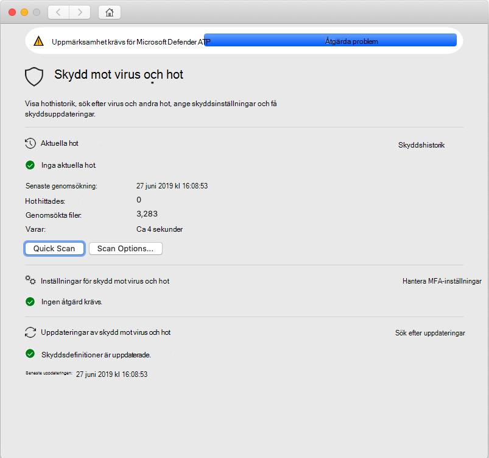

# <a name="troubleshoot-kernel-extension-issues-in-microsoft-defender-for-endpoint-for-mac"></a><span data-ttu-id="64d04-104">Felsöka problem med kernel-tillägg i Microsoft Defender för Slutpunkt för Mac</span><span class="sxs-lookup"><span data-stu-id="64d04-104">Troubleshoot kernel extension issues in Microsoft Defender for Endpoint for Mac</span></span>

[!INCLUDE [Microsoft 365 Defender rebranding](../../includes/microsoft-defender.md)]


<span data-ttu-id="64d04-105">**Gäller för:**</span><span class="sxs-lookup"><span data-stu-id="64d04-105">**Applies to:**</span></span>

- [<span data-ttu-id="64d04-106">Microsoft Defender för Slutpunkt för Mac</span><span class="sxs-lookup"><span data-stu-id="64d04-106">Microsoft Defender for Endpoint for Mac</span></span>](microsoft-defender-endpoint-mac.md)
- [<span data-ttu-id="64d04-107">Microsoft Defender för Endpoint</span><span class="sxs-lookup"><span data-stu-id="64d04-107">Microsoft Defender for Endpoint</span></span>](https://go.microsoft.com/fwlink/p/?linkid=2154037)
- [<span data-ttu-id="64d04-108">Microsoft 365 Defender</span><span class="sxs-lookup"><span data-stu-id="64d04-108">Microsoft 365 Defender</span></span>](https://go.microsoft.com/fwlink/?linkid=2118804)

> <span data-ttu-id="64d04-109">Vill du uppleva Microsoft Defender för Slutpunkt?</span><span class="sxs-lookup"><span data-stu-id="64d04-109">Want to experience Microsoft Defender for Endpoint?</span></span> [<span data-ttu-id="64d04-110">Registrera dig för en kostnadsfri utvärderingsversion.</span><span class="sxs-lookup"><span data-stu-id="64d04-110">Sign up for a free trial.</span></span>](https://www.microsoft.com/microsoft-365/windows/microsoft-defender-atp?ocid=docs-wdatp-exposedapis-abovefoldlink)

<span data-ttu-id="64d04-111">Den här artikeln innehåller information om hur du felsöker problem med kerneltillägget som installeras som en del av Microsoft Defender för Slutpunkt för Mac.</span><span class="sxs-lookup"><span data-stu-id="64d04-111">This article provides information on how to troubleshoot issues with the kernel extension that is installed as part of Microsoft Defender for Endpoint for Mac.</span></span>

<span data-ttu-id="64d04-112">Från och med macOS High Sierra (10.13) kräver macOS att alla kernel-tillägg uttryckligen godkänns innan de får köras på enheten.</span><span class="sxs-lookup"><span data-stu-id="64d04-112">Starting with macOS High Sierra (10.13), macOS requires all kernel extensions to be explicitly approved before they're allowed to run on the device.</span></span>

<span data-ttu-id="64d04-113">Om du inte godkänna kernel-tillägget under distributionen/installationen av Microsoft Defender för Slutpunkt för Mac visas en banderoll i programmet där du uppmanas att aktivera det:</span><span class="sxs-lookup"><span data-stu-id="64d04-113">If you didn't approve the kernel extension during the deployment/installation of Microsoft Defender for Endpoint for Mac, the application displays a banner prompting you to enable it:</span></span>

   

<span data-ttu-id="64d04-115">Du kan också köra ```mdatp health``` .</span><span class="sxs-lookup"><span data-stu-id="64d04-115">You can also run ```mdatp health```.</span></span> <span data-ttu-id="64d04-116">Den rapporterar om realtidsskydd är aktiverat men inte tillgängligt.</span><span class="sxs-lookup"><span data-stu-id="64d04-116">It reports if real-time protection is enabled but not available.</span></span> <span data-ttu-id="64d04-117">Det här anger att kernel-tillägget inte är godkänt att köras på enheten.</span><span class="sxs-lookup"><span data-stu-id="64d04-117">This indicates that the kernel extension isn't approved to run on your device.</span></span>

```bash
mdatp health
```
```Output
...
real_time_protection_enabled                : false
real_time_protection_available              : true
...
```

<span data-ttu-id="64d04-118">I följande avsnitt finns anvisningar om hur du kan åtgärda problemet, beroende på vilken metod du använde för att distribuera Microsoft Defender för Endpoint för Mac.</span><span class="sxs-lookup"><span data-stu-id="64d04-118">The following sections provide guidance on how to address this issue, depending on the method that you used to deploy Microsoft Defender for Endpoint for Mac.</span></span>

## <a name="managed-deployment"></a><span data-ttu-id="64d04-119">Hanterad distribution</span><span class="sxs-lookup"><span data-stu-id="64d04-119">Managed deployment</span></span>

<span data-ttu-id="64d04-120">Se anvisningarna som motsvarar det hanteringsverktyg som du använde för att distribuera produkten:</span><span class="sxs-lookup"><span data-stu-id="64d04-120">See the instructions corresponding to the management tool that you used to deploy the product:</span></span>

- [<span data-ttu-id="64d04-121">JAMF-baserad distribution</span><span class="sxs-lookup"><span data-stu-id="64d04-121">JAMF-based deployment</span></span>](mac-install-with-jamf.md)
- [<span data-ttu-id="64d04-122">Microsoft Intune-baserad distribution</span><span class="sxs-lookup"><span data-stu-id="64d04-122">Microsoft Intune-based deployment</span></span>](mac-install-with-intune.md#create-system-configuration-profiles)

## <a name="manual-deployment"></a><span data-ttu-id="64d04-123">Manuell distribution</span><span class="sxs-lookup"><span data-stu-id="64d04-123">Manual deployment</span></span>

<span data-ttu-id="64d04-124">Om mindre än 30 minuter har gått sedan produkten installerades går du till Säkerhet i **systeminställningar**& Sekretess, där du måste tillåta systemprogramvara från utvecklare  >  "Microsoft  Corporation".</span><span class="sxs-lookup"><span data-stu-id="64d04-124">If less than 30 minutes have passed since the product was installed, navigate to **System Preferences** > **Security & Privacy**, where you have to **Allow** system software from developers "Microsoft Corporation".</span></span>

<span data-ttu-id="64d04-125">Om du inte ser det här kommandotolken har det gått 30 minuter eller mer och kerneltillägget fortfarande inte har godkänts för att köras på enheten:</span><span class="sxs-lookup"><span data-stu-id="64d04-125">If you don't see this prompt, it means that 30 or more minutes have passed, and the kernel extension still not been approved to run on your device:</span></span>


<span data-ttu-id="64d04-127">I det här fallet måste du utföra följande steg för att starta godkännandeflödet igen.</span><span class="sxs-lookup"><span data-stu-id="64d04-127">In this case, you need to perform the following steps to trigger the approval flow again.</span></span>

1. <span data-ttu-id="64d04-128">Försök installera drivrutinen i terminalen.</span><span class="sxs-lookup"><span data-stu-id="64d04-128">In Terminal, attempt to install the driver.</span></span> <span data-ttu-id="64d04-129">Följande åtgärd kommer att misslyckas, eftersom kernel-tillägget inte godkänts för att köras på enheten.</span><span class="sxs-lookup"><span data-stu-id="64d04-129">The following operation will fail, because the kernel extension wasn't approved to run on the device.</span></span> <span data-ttu-id="64d04-130">Men den utlöser godkännandeflödet igen.</span><span class="sxs-lookup"><span data-stu-id="64d04-130">However, it will trigger the approval flow again.</span></span>

    ```bash
    sudo kextutil /Library/Extensions/wdavkext.kext
    ```
    
    ```Output
    Kext rejected due to system policy: <OSKext 0x7fc34d528390 [0x7fffa74aa8e0]> { URL = "file:///Library/StagedExtensions/Library/Extensions/wdavkext.kext/", ID = "com.microsoft.wdavkext" }
    Kext rejected due to system policy: <OSKext 0x7fc34d528390 [0x7fffa74aa8e0]> { URL = "file:///Library/StagedExtensions/Library/Extensions/wdavkext.kext/", ID = "com.microsoft.wdavkext" }
    Diagnostics for /Library/Extensions/wdavkext.kext:
    ```

2. <span data-ttu-id="64d04-131">Öppna **Systeminställningar**  >  **för & sekretess** på menyn.</span><span class="sxs-lookup"><span data-stu-id="64d04-131">Open **System Preferences** > **Security & Privacy** from the menu.</span></span> <span data-ttu-id="64d04-132">(Stäng det först om det öppnas.)</span><span class="sxs-lookup"><span data-stu-id="64d04-132">(Close it first, if it's opened.)</span></span>

3. <span data-ttu-id="64d04-133">**Tillåt** systemprogramvara från utvecklare "Microsoft Corporation"</span><span class="sxs-lookup"><span data-stu-id="64d04-133">**Allow** system software from developers "Microsoft Corporation"</span></span>

4. <span data-ttu-id="64d04-134">Installera drivrutinen igen i terminalen.</span><span class="sxs-lookup"><span data-stu-id="64d04-134">In Terminal, install the driver again.</span></span> <span data-ttu-id="64d04-135">Nu lyckas åtgärden:</span><span class="sxs-lookup"><span data-stu-id="64d04-135">This time the operation will succeed:</span></span>

    ```bash
    sudo kextutil /Library/Extensions/wdavkext.kext
    ```

    <span data-ttu-id="64d04-136">Banderollen ska försvinna från Defender-programmet ```mdatp health``` och bör nu rapportera att realtidsskydd både är aktiverat och tillgängligt:</span><span class="sxs-lookup"><span data-stu-id="64d04-136">The banner should disappear from the Defender application, and ```mdatp health``` should now report that real-time protection is both enabled and available:</span></span>

    ```bash
    mdatp health
    ```

    ```Output
    ...
    real_time_protection_enabled                : true
    real_time_protection_available              : true
    ...
    ```
