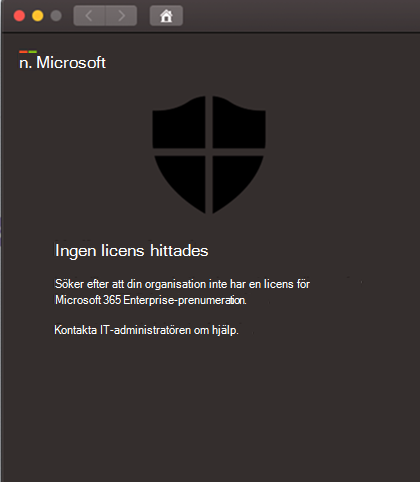

# Felsöka licensproblem för Microsoft Defender för slutpunkt i macOSTroubleshoot license issues for Microsoft Defender for Endpoint on macOS

[!INCLUDE [Microsoft 365 Defender rebranding](../../includes/microsoft-defender.md)]

**Gäller för:****Applies to:**

- [Microsoft Defender för Endpoint för macOSMicrosoft Defender for Endpoint on macOS](microsoft-defender-endpoint-mac.md)
- [Microsoft Defender för EndpointMicrosoft Defender for Endpoint](https://go.microsoft.com/fwlink/p/?linkid=2154037)
- [Microsoft 365 DefenderMicrosoft 365 Defender](https://go.microsoft.com/fwlink/?linkid=2118804)

> Vill du uppleva Microsoft Defender för Slutpunkt?Want to experience Microsoft Defender for Endpoint? [Registrera dig för en kostnadsfri utvärderingsversion.Sign up for a free trial.](https://www.microsoft.com/microsoft-365/windows/microsoft-defender-atp?ocid=docs-wdatp-exposedapis-abovefoldlink)

När du går igenom Microsoft Defender för Slutpunkt på [macOS](microsoft-defender-endpoint-mac.md) och [testa manuell](mac-install-manually.md) distribution eller ett PoC (Proof Of Concept) kan du få följande felmeddelande:While you are going through [Microsoft Defender for Endpoint on macOS](microsoft-defender-endpoint-mac.md) and [Manual deployment](mac-install-manually.md) testing or a Proof Of Concept (PoC), you might get the following error:

**Meddelande:****Message:** 

Ingen licens hittadesNo license found

Det verkar som att din organisation inte har någon licens för Microsoft 365 Enterprise prenumeration.Looks like your organization does not have a license for Microsoft 365 Enterprise subscription.

Kontakta administratören om du behöver hjälp.Contact your administrator for help.

**Orsak:****Cause:** 

Du har distribuerat och/eller installerat Microsoft Defender för Slutpunkt för macOS-paketet (&quot;Ladda ned installationspaket"), men du kanske har kört konfigurationsskriptet ("Hämta onboarding-paket") eller så har du inte tilldelat någon licens till användaren.You deployed and/or installed the Microsoft Defender for Endpoint for macOS package ("Download installation package"), but you might have run the configuration script ("Download onboarding package"), or you have not assigned a license to the user.

**Lösning:****Solution:**

Följ de MicrosoftDefenderATPOnboardingMacOs.py som beskrivs här: [Klientkonfiguration](mac-install-manually.md#client-configuration)Follow the MicrosoftDefenderATPOnboardingMacOs.py instructions documented here: [Client configuration](mac-install-manually.md#client-configuration)
