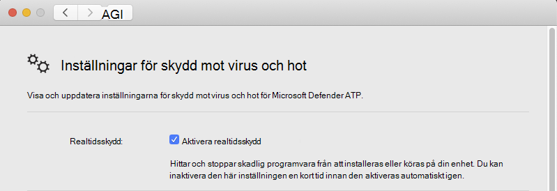

# <a name="troubleshoot-performance-issues-for-microsoft-defender-for-endpoint-on-macos"></a>Felsöka prestandaproblem för Microsoft Defender för slutpunkt i macOS

[!INCLUDE [Microsoft 365 Defender rebranding](../../includes/microsoft-defender.md)]


**Gäller för:**

- [Microsoft Defender för Slutpunkt på macOS](microsoft-defender-endpoint-mac.md)
- [Microsoft Defender för Endpoint](https://go.microsoft.com/fwlink/p/?linkid=2154037)
- [Microsoft 365 Defender](https://go.microsoft.com/fwlink/?linkid=2118804)

> Vill du uppleva Microsoft Defender för Slutpunkt? [Registrera dig för en kostnadsfri utvärderingsversion.](https://www.microsoft.com/microsoft-365/windows/microsoft-defender-atp?ocid=docs-wdatp-exposedapis-abovefoldlink)

Det här avsnittet innehåller några allmänna steg som kan användas för att begränsa prestandaproblem som rör Microsoft Defender för slutpunkt i macOS.

Realtidsskydd (RTP) är en funktion i Microsoft Defender för Endpoint på macOS som kontinuerligt övervakar och skyddar din enhet mot hot. Den består av fil- och processövervakning och annan heuristics.

Beroende på vilka program du kör och enhetens egenskaper kan du uppleva underoptimal prestanda när du kör Microsoft Defender för Endpoint på macOS. Särskilt program eller systemprocesser som har åtkomst till många resurser under ett kort tidspann kan leda till prestandaproblem i Microsoft Defender för slutpunkten i macOS.

Följande steg kan användas för att felsöka och minimera dessa problem:

1. Inaktivera realtidsskyddet med någon av följande metoder och se om prestandan förbättras. Den här metoden begränsar om Microsoft Defender för Slutpunkt på macOS bidrar till prestandaproblemen.

      Om din enhet inte hanteras av din organisation kan realtidsskydd inaktiveras med något av följande alternativ:

    - Från användargränssnittet. Öppna Microsoft Defender för slutpunkt i macOS och gå till **Hantera inställningar.**

      

    - Från terminalen. Av säkerhetsskäl kräver den här åtgärden höjd.

      ```bash
      mdatp config real-time-protection --value disabled
      ```

      Om enheten hanteras av din organisation kan realtidsskydd inaktiveras av administratören genom att följa anvisningarna i Ange inställningar för Microsoft Defender för [slutpunkt i macOS.](mac-preferences.md)
      
      Om prestandaproblemet kvarstår när realtidsskyddet är inaktiverat kan problemets ursprung vara slutpunktsidentifierings- och svarskomponenten. I så fall kan du kontakta kundsupport för ytterligare instruktioner och åtgärder.

2. Öppna Finder och gå **till**  >  **Programverktyg.** Öppna **Aktivitetsrapporter** och analysera vilka program som använder resurserna på ditt system. Vanliga exempel är programuppdateringsprogram och kompilatorer.

1. Du kan använda statistik i realtid som har samlats av Defender för Endpoint för Mac för att hitta de program som utlöser flest genomsökningar.

      > [!NOTE]
      > Den här funktionen är tillgänglig i version 100.90.70 eller senare.
      Den här funktionen är aktiverad som standard på **Dogpat-** **och InsiderFast-kanalerna.** Om du använder en annan uppdateringskanal kan den här funktionen aktiveras från kommandoraden:
      ```bash
      mdatp config real-time-protection-statistics  --value enabled
      ```

      Den här funktionen kräver realtidsskydd för att aktiveras. Om du vill kontrollera statusen för realtidsskyddet kör du följande kommando:

      ```bash
      mdatp health --field real_time_protection_enabled
      ```

    Kontrollera att **real_time_protection_enabled** stämmer. Annars kör du följande kommando för att aktivera det:

      ```bash
      mdatp config real-time-protection --value enabled
      ```

      ```output
      Configuration property updated
      ```

      Om du vill samla in aktuell statistik kör du:

      ```bash
      mdatp config real-time-protection --value enabled
      ```

      > [!NOTE]
      > Med **hjälp av --output-json** (observera det dubbla strecket) ser du till att utdataformatet är klart för tolkning.
      Utdata från det här kommandot visar alla processer och deras associerade genomsökningsaktivitet.

1. Ladda ned exemplet Python-parser på Mac-systemet high_cpu_parser.py med kommandot:

    ```bash
    wget -c https://raw.githubusercontent.com/microsoft/mdatp-xplat/master/linux/diagnostic/high_cpu_parser.py
    ```

    Utdata för det här kommandot bör se ut ungefär så här:

    ```Output
    --2020-11-14 11:27:27-- https://raw.githubusercontent.com/microsoft.
    mdatp-xplat/master/linus/diagnostic/high_cpu_parser.py
    Resolving raw.githubusercontent.com (raw.githubusercontent.com)... 151.101.xxx.xxx
    Connecting to raw.githubusercontent.com (raw.githubusercontent.com)| 151.101.xxx.xxx| :443... connected.
    HTTP request sent, awaiting response... 200 OK
    Length: 1020 [text/plain]
    Saving to: 'high_cpu_parser.py'
    100%[===========================================>] 1,020    --.-K/s   in 
    0s
    ```

1. Skriv sedan följande kommandon:

      ```bash
        chmod +x high_cpu_parser.py
      ```

      ```bash
        cat real_time_protection.json | python high_cpu_parser.py  > real_time_protection.log
      ```

      Utdata från ovanstående är en lista över de mest deltagare som har prestandaproblem. Den första kolumnen är PID (processidentifierare), den andra är namnet på processen och den sista kolumnen är antalet skannade filer, sorterade efter påverkan.

      Till exempel ser utdata för kommandot ut ungefär så här:

      ```output
        ... > python ~/repo/mdatp-xplat/linux/diagnostic/high_cpu_parser.py <~Downloads/output.json | head -n 10
        27432 None 76703
        73467 actool     1249
        73914 xcodebuild 1081
        73873 bash 1050
        27475 None 836
        1    launchd    407
        73468 ibtool     344
        549  telemetryd_v1   325
        4764 None 228
        125  CrashPlanService 164
      ```

      Om du vill förbättra prestandan för Defender för slutpunkt på Mac letar du reda på den med det högsta numret under raden Totalt antal genomsökta filer och lägger till ett undantag för det. Mer information finns i [Konfigurera och validera undantag för Defender för Endpoint på Linux.](linux-exclusions.md)

      > [!NOTE]
      > Programmet lagrar statistik i minnet och håller bara reda på filaktiviteten sedan den startades och realtidsskyddet aktiverades. Processer som startats tidigare eller under perioder där realtidsskydd var inaktiverat räknas inte. Dessutom räknas bara händelser som utlöste genomsökningar.
      > 
1. Konfigurera Microsoft Defender för slutpunkt på macOS med undantag för de processer eller diskutrymmen som bidrar till prestandaproblemen och återaktivera realtidsskydd.

     Mer [information finns i Konfigurera och validera undantag för Microsoft Defender för slutpunkt på macOS.](mac-exclusions.md)
