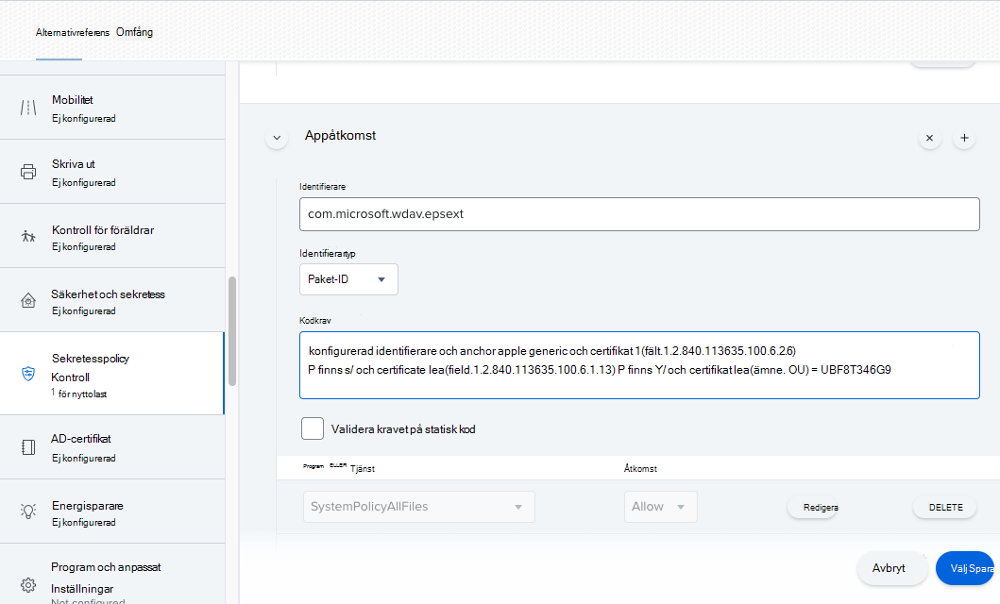
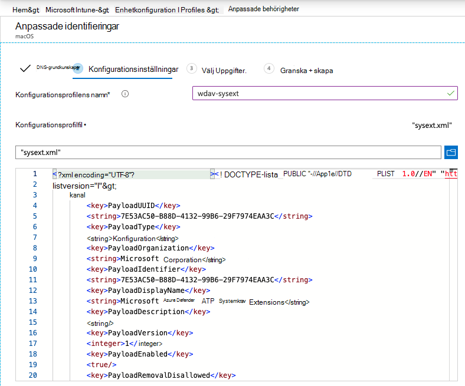

# <a name="new-configuration-profiles-for-macos-catalina-and-newer-versions-of-macos"></a><span data-ttu-id="df703-104">Nya konfigurationsprofiler för macOS Catalina och nyare versioner av macOS</span><span class="sxs-lookup"><span data-stu-id="df703-104">New configuration profiles for macOS Catalina and newer versions of macOS</span></span>

[!INCLUDE [Microsoft 365 Defender rebranding](../../includes/microsoft-defender.md)]

<span data-ttu-id="df703-105">**Gäller för:**</span><span class="sxs-lookup"><span data-stu-id="df703-105">**Applies to:**</span></span>
- [<span data-ttu-id="df703-106">Microsoft Defender för Endpoint</span><span class="sxs-lookup"><span data-stu-id="df703-106">Microsoft Defender for Endpoint</span></span>](https://go.microsoft.com/fwlink/p/?linkid=2154037)
- [<span data-ttu-id="df703-107">Microsoft 365 Defender</span><span class="sxs-lookup"><span data-stu-id="df703-107">Microsoft 365 Defender</span></span>](https://go.microsoft.com/fwlink/?linkid=2118804)

> <span data-ttu-id="df703-108">Vill du uppleva Microsoft Defender för Slutpunkt?</span><span class="sxs-lookup"><span data-stu-id="df703-108">Want to experience Microsoft Defender for Endpoint?</span></span> [<span data-ttu-id="df703-109">Registrera dig för en kostnadsfri utvärderingsversion.</span><span class="sxs-lookup"><span data-stu-id="df703-109">Sign up for a free trial.</span></span>](https://www.microsoft.com/microsoft-365/windows/microsoft-defender-atp?ocid=docs-wdatp-exposedapis-abovefoldlink)

<span data-ttu-id="df703-110">I linje med macOS-utveckling förbereder vi en Microsoft Defender för slutpunkt på macOS-uppdatering som utnyttjar systemtillägg istället för kernel-tillägg.</span><span class="sxs-lookup"><span data-stu-id="df703-110">In alignment with macOS evolution, we are preparing a Microsoft Defender for Endpoint on macOS update that leverages system extensions instead of kernel extensions.</span></span> <span data-ttu-id="df703-111">Den här uppdateringen gäller endast för macOS Catalina (10.15.4) och senare versioner av macOS.</span><span class="sxs-lookup"><span data-stu-id="df703-111">This update will only be applicable to macOS Catalina (10.15.4) and newer versions of macOS.</span></span>

<span data-ttu-id="df703-112">Om du har distribuerat Microsoft Defender för slutpunkt på macOS i en hanterad miljö (via JAMF, Intune eller en annan MDM-lösning) måste du distribuera nya konfigurationsprofiler.</span><span class="sxs-lookup"><span data-stu-id="df703-112">If you have deployed Microsoft Defender for Endpoint on macOS in a managed environment (through JAMF, Intune, or another MDM solution), you must deploy new configuration profiles.</span></span> <span data-ttu-id="df703-113">Om du inte gör det får användarna en uppmaning om att köra de här nya komponenterna.</span><span class="sxs-lookup"><span data-stu-id="df703-113">Failure to do these steps will result in users getting approval prompts to run these new components.</span></span>

## <a name="jamf"></a><span data-ttu-id="df703-114">JAMF</span><span class="sxs-lookup"><span data-stu-id="df703-114">JAMF</span></span>

### <a name="system-extensions-policy"></a><span data-ttu-id="df703-115">Princip för systemtillägg</span><span class="sxs-lookup"><span data-stu-id="df703-115">System Extensions Policy</span></span>

<span data-ttu-id="df703-116">Skapa följande nyttolast för att godkänna systemtilläggen:</span><span class="sxs-lookup"><span data-stu-id="df703-116">To approve the system extensions, create the following payload:</span></span>

1. <span data-ttu-id="df703-117">I **Datorer > Konfigurationsprofiler väljer** du Alternativ > **Systemtillägg**.</span><span class="sxs-lookup"><span data-stu-id="df703-117">In **Computers > Configuration Profiles** select **Options > System Extensions**.</span></span>
2. <span data-ttu-id="df703-118">Välj **Tillåtna systemtillägg** i **listrutan Systemtilläggstyper.**</span><span class="sxs-lookup"><span data-stu-id="df703-118">Select **Allowed System Extensions** from the **System Extension Types** drop-down list.</span></span>
3. <span data-ttu-id="df703-119">Använd **UBF8T346G9** för team-ID.</span><span class="sxs-lookup"><span data-stu-id="df703-119">Use **UBF8T346G9** for Team Id.</span></span>
4. <span data-ttu-id="df703-120">Lägg till följande paketidentifierare i listan **Med tillåtna systemtillägg:**</span><span class="sxs-lookup"><span data-stu-id="df703-120">Add the following bundle identifiers to the **Allowed System Extensions** list:</span></span>

    - <span data-ttu-id="df703-121">**com.microsoft.wdav.epsext**</span><span class="sxs-lookup"><span data-stu-id="df703-121">**com.microsoft.wdav.epsext**</span></span>
    - <span data-ttu-id="df703-122">**com.microsoft.wdav.netext**</span><span class="sxs-lookup"><span data-stu-id="df703-122">**com.microsoft.wdav.netext**</span></span>

    

### <a name="privacy-preferences-policy-control"></a><span data-ttu-id="df703-124">Policykontroll för sekretesspolicy</span><span class="sxs-lookup"><span data-stu-id="df703-124">Privacy Preferences Policy Control</span></span>

<span data-ttu-id="df703-125">Lägg till följande JAMF-nyttolast för att bevilja fullständig diskåtkomst till Microsoft Defender för Slutpunktens säkerhetstillägg.</span><span class="sxs-lookup"><span data-stu-id="df703-125">Add the following JAMF payload to grant Full Disk Access to the Microsoft Defender for Endpoint Endpoint Security Extension.</span></span> <span data-ttu-id="df703-126">Den här principen är en förutsättning för att du ska kunna köra tillägget på din enhet.</span><span class="sxs-lookup"><span data-stu-id="df703-126">This policy is a pre-requisite for running the extension on your device.</span></span>

1. <span data-ttu-id="df703-127">Välj **Alternativ**  >  **principkontroll för Sekretesspolicy.**</span><span class="sxs-lookup"><span data-stu-id="df703-127">Select **Options** > **Privacy Preferences Policy Control**.</span></span>
2. <span data-ttu-id="df703-128">Använd `com.microsoft.wdav.epsext` som **identifierare** och `Bundle ID` som **pakettyp**.</span><span class="sxs-lookup"><span data-stu-id="df703-128">Use `com.microsoft.wdav.epsext` as the **Identifier** and `Bundle ID` as **Bundle type**.</span></span>
3. <span data-ttu-id="df703-129">Ställ in kodkrav på `identifier "com.microsoft.wdav.epsext" and anchor apple generic and certificate 1[field.1.2.840.113635.100.6.2.6] /* exists */ and certificate leaf[field.1.2.840.113635.100.6.1.13] /* exists */ and certificate leaf[subject.OU] = UBF8T346G9`</span><span class="sxs-lookup"><span data-stu-id="df703-129">Set Code Requirement to `identifier "com.microsoft.wdav.epsext" and anchor apple generic and certificate 1[field.1.2.840.113635.100.6.2.6] /* exists */ and certificate leaf[field.1.2.840.113635.100.6.1.13] /* exists */ and certificate leaf[subject.OU] = UBF8T346G9`</span></span>
4. <span data-ttu-id="df703-130">Ställ **in app eller tjänst** på **SystemPolicyAllFiles och** åtkomst till **Tillåt**.</span><span class="sxs-lookup"><span data-stu-id="df703-130">Set **App or service** to **SystemPolicyAllFiles** and access to **Allow**.</span></span>

    

### <a name="network-extension-policy"></a><span data-ttu-id="df703-132">Princip för nätverkstillägg</span><span class="sxs-lookup"><span data-stu-id="df703-132">Network Extension Policy</span></span>

<span data-ttu-id="df703-133">Som en del av funktionerna Slutpunktsidentifiering och svar inspekterar Microsoft Defender för slutpunkt på macOS sockettrafik och rapporterar den här informationen till Microsoft Defender Säkerhetscenter portalen.</span><span class="sxs-lookup"><span data-stu-id="df703-133">As part of the Endpoint Detection and Response capabilities, Microsoft Defender for Endpoint on macOS inspects socket traffic and reports this information to the Microsoft Defender Security Center portal.</span></span> <span data-ttu-id="df703-134">Med följande princip kan nätverkstillägget utföra de här funktionerna.</span><span class="sxs-lookup"><span data-stu-id="df703-134">The following policy allows the network extension to perform this functionality.</span></span>

>[!NOTE]
><span data-ttu-id="df703-135">JAMF har inte inbyggt stöd för principer för innehållsfiltrering, vilket är en förutsättning för att aktivera nätverkstillägg som Microsoft Defender för Slutpunkt på macOS installerar på enheten.</span><span class="sxs-lookup"><span data-stu-id="df703-135">JAMF doesn’t have built-in support for content filtering policies, which are a pre-requisite for enabling the network extensions that Microsoft Defender for Endpoint on macOS installs on the device.</span></span> <span data-ttu-id="df703-136">DESSUTOM ändrar JAMF ibland innehållet i de principer som distribueras.</span><span class="sxs-lookup"><span data-stu-id="df703-136">Furthermore, JAMF sometimes changes the content of the policies being deployed.</span></span>
><span data-ttu-id="df703-137">Följande steg ger dig därför en lösning som innebär att du signerar konfigurationsprofilen.</span><span class="sxs-lookup"><span data-stu-id="df703-137">As such, the following steps provide a workaround that involve signing the configuration profile.</span></span>

1. <span data-ttu-id="df703-138">Spara följande innehåll på din enhet som med `com.microsoft.network-extension.mobileconfig` en textredigerare:</span><span class="sxs-lookup"><span data-stu-id="df703-138">Save the following content to your device as `com.microsoft.network-extension.mobileconfig` using a text editor:</span></span>

    ```xml
    <?xml version="1.0" encoding="UTF-8"?><!DOCTYPE plist PUBLIC "-//Apple//DTD PLIST 1.0//EN" "http://www.apple.com/DTDs/PropertyList-1.0.dtd">
    <plist version="1">
        <dict>
            <key>PayloadUUID</key>
            <string>DA2CC794-488B-4AFF-89F7-6686A7E7B8AB</string>
            <key>PayloadType</key>
            <string>Configuration</string>
            <key>PayloadOrganization</key>
            <string>Microsoft Corporation</string>
            <key>PayloadIdentifier</key>
            <string>DA2CC794-488B-4AFF-89F7-6686A7E7B8AB</string>
            <key>PayloadDisplayName</key>
            <string>Microsoft Defender ATP Network Extension</string>
            <key>PayloadDescription</key>
            <string/>
            <key>PayloadVersion</key>
            <integer>1</integer>
            <key>PayloadEnabled</key>
            <true/>
            <key>PayloadRemovalDisallowed</key>
            <true/>
            <key>PayloadScope</key>
            <string>System</string>
            <key>PayloadContent</key>
            <array>
                <dict>
                    <key>PayloadUUID</key>
                    <string>2BA070D9-2233-4827-AFC1-1F44C8C8E527</string>
                    <key>PayloadType</key>
                    <string>com.apple.webcontent-filter</string>
                    <key>PayloadOrganization</key>
                    <string>Microsoft Corporation</string>
                    <key>PayloadIdentifier</key>
                    <string>CEBF7A71-D9A1-48BD-8CCF-BD9D18EC155A</string>
                    <key>PayloadDisplayName</key>
                    <string>Approved Network Extension</string>
                    <key>PayloadDescription</key>
                    <string/>
                    <key>PayloadVersion</key>
                    <integer>1</integer>
                    <key>PayloadEnabled</key>
                    <true/>
                    <key>FilterType</key>
                    <string>Plugin</string>
                    <key>UserDefinedName</key>
                    <string>Microsoft Defender ATP Network Extension</string>
                    <key>PluginBundleID</key>
                    <string>com.microsoft.wdav</string>
                    <key>FilterSockets</key>
                    <true/>
                    <key>FilterDataProviderBundleIdentifier</key>
                    <string>com.microsoft.wdav.netext</string>
                    <key>FilterDataProviderDesignatedRequirement</key>
                    <string>identifier "com.microsoft.wdav.netext" and anchor apple generic and certificate 1[field.1.2.840.113635.100.6.2.6] /* exists */ and certificate leaf[field.1.2.840.113635.100.6.1.13] /* exists */ and certificate leaf[subject.OU] = UBF8T346G9</string>
                </dict>
            </array>
        </dict>
    </plist>
    ```

2. <span data-ttu-id="df703-139">Kontrollera att ovanstående fil kopierades korrekt genom att köra `plutil` verktyget i terminalen:</span><span class="sxs-lookup"><span data-stu-id="df703-139">Verify that the above file was copied correctly by running the `plutil` utility in the Terminal:</span></span>

    ```bash
    $ plutil -lint <PathToFile>/com.microsoft.network-extension.mobileconfig
    ```

    <span data-ttu-id="df703-140">Om filen till exempel lagrades i Dokument:</span><span class="sxs-lookup"><span data-stu-id="df703-140">For example, if the file was stored in Documents:</span></span>

    ```bash
    $ plutil -lint ~/Documents/com.microsoft.network-extension.mobileconfig
    ```
    
    <span data-ttu-id="df703-141">Kontrollera att kommandot matas ut `OK` .</span><span class="sxs-lookup"><span data-stu-id="df703-141">Verify that the command outputs `OK`.</span></span>
        
    ```bash
    <PathToFile>/com.microsoft.network-extension.mobileconfig: OK
    ```
    
3. <span data-ttu-id="df703-142">Följ instruktionerna på [den här sidan](https://www.jamf.com/jamf-nation/articles/649/creating-a-signing-certificate-using-jamf-pro-s-built-in-certificate-authority) för att skapa ett signeringscertifikat med HJÄLP av DEN inbyggda certifikatutfärdaren i JAMF.</span><span class="sxs-lookup"><span data-stu-id="df703-142">Follow the instructions on [this page](https://www.jamf.com/jamf-nation/articles/649/creating-a-signing-certificate-using-jamf-pro-s-built-in-certificate-authority) to create a signing certificate using JAMF’s built-in certificate authority.</span></span>

4. <span data-ttu-id="df703-143">När certifikatet har skapats och installerats på enheten kör du följande kommando från Terminalen för att signera filen:</span><span class="sxs-lookup"><span data-stu-id="df703-143">After the certificate is created and installed to your device, run the following command from the Terminal to sign the file:</span></span>

    ```bash
    $ security cms -S -N "<CertificateName>" -i <PathToFile>/com.microsoft.network-extension.mobileconfig -o <PathToSignedFile>/com.microsoft.network-extension.signed.mobileconfig
    ```
    
    <span data-ttu-id="df703-144">Om certifikatnamnet till exempel är **SigningCertificate** och den signerade filen ska lagras i Dokument:</span><span class="sxs-lookup"><span data-stu-id="df703-144">For example, if the certificate name is **SigningCertificate** and the signed file is going to be stored in Documents:</span></span>
    
    ```bash
    $ security cms -S -N "SigningCertificate" -i ~/Documents/com.microsoft.network-extension.mobileconfig -o ~/Documents/com.microsoft.network-extension.signed.mobileconfig
    ```
    
5. <span data-ttu-id="df703-145">Från JAMF-portalen går du till **Konfigurationsprofiler** och klickar **Upload** profil.</span><span class="sxs-lookup"><span data-stu-id="df703-145">From the JAMF portal, navigate to **Configuration Profiles** and click the **Upload** button.</span></span> <span data-ttu-id="df703-146">Välj `com.microsoft.network-extension.signed.mobileconfig` när du uppmanas att ange filen.</span><span class="sxs-lookup"><span data-stu-id="df703-146">Select `com.microsoft.network-extension.signed.mobileconfig` when prompted for the file.</span></span>

## <a name="intune"></a><span data-ttu-id="df703-147">Intune</span><span class="sxs-lookup"><span data-stu-id="df703-147">Intune</span></span>

### <a name="system-extensions-policy"></a><span data-ttu-id="df703-148">Princip för systemtillägg</span><span class="sxs-lookup"><span data-stu-id="df703-148">System Extensions Policy</span></span>

<span data-ttu-id="df703-149">Så här godkänner du systemtilläggen:</span><span class="sxs-lookup"><span data-stu-id="df703-149">To approve the system extensions:</span></span>

1. <span data-ttu-id="df703-150">Öppna Hantera enhetskonfiguration **i**  >  Intune.</span><span class="sxs-lookup"><span data-stu-id="df703-150">In Intune, open **Manage** > **Device configuration**.</span></span> <span data-ttu-id="df703-151">Välj **Hantera**  >  **profiler**  >  **skapa profil**.</span><span class="sxs-lookup"><span data-stu-id="df703-151">Select **Manage** > **Profiles** > **Create Profile**.</span></span>
2. <span data-ttu-id="df703-152">Välj ett namn för profilen.</span><span class="sxs-lookup"><span data-stu-id="df703-152">Choose a name for the profile.</span></span> <span data-ttu-id="df703-153">Ändra **Platform=macOS** till **Profiltyp=Tillägg.**</span><span class="sxs-lookup"><span data-stu-id="df703-153">Change **Platform=macOS** to **Profile type=Extensions**.</span></span> <span data-ttu-id="df703-154">Välj **Skapa**.</span><span class="sxs-lookup"><span data-stu-id="df703-154">Select **Create**.</span></span>
3. <span data-ttu-id="df703-155">Ge den `Basics` här nya profilen ett namn på fliken.</span><span class="sxs-lookup"><span data-stu-id="df703-155">In the `Basics` tab, give a name to this new profile.</span></span>
4. <span data-ttu-id="df703-156">Lägg `Configuration settings` till följande poster i avsnittet på `Allowed system extensions` fliken:</span><span class="sxs-lookup"><span data-stu-id="df703-156">In the `Configuration settings` tab, add the following entries in the `Allowed system extensions` section:</span></span>

    <span data-ttu-id="df703-157">Paketidentifierare</span><span class="sxs-lookup"><span data-stu-id="df703-157">Bundle identifier</span></span>         | <span data-ttu-id="df703-158">Teamidentifierare</span><span class="sxs-lookup"><span data-stu-id="df703-158">Team identifier</span></span>
    --------------------------|----------------
    <span data-ttu-id="df703-159">com.microsoft.wdav.epsext</span><span class="sxs-lookup"><span data-stu-id="df703-159">com.microsoft.wdav.epsext</span></span> | <span data-ttu-id="df703-160">UBF8T346G9</span><span class="sxs-lookup"><span data-stu-id="df703-160">UBF8T346G9</span></span>
    <span data-ttu-id="df703-161">com.microsoft.wdav.netext</span><span class="sxs-lookup"><span data-stu-id="df703-161">com.microsoft.wdav.netext</span></span> | <span data-ttu-id="df703-162">UBF8T346G9</span><span class="sxs-lookup"><span data-stu-id="df703-162">UBF8T346G9</span></span>

    

5. <span data-ttu-id="df703-164">På fliken `Assignments` tilldelar du den här profilen **till Alla användare & alla enheter.**</span><span class="sxs-lookup"><span data-stu-id="df703-164">In the `Assignments` tab, assign this profile to **All Users & All devices**.</span></span>
6. <span data-ttu-id="df703-165">Granska och skapa den här konfigurationsprofilen.</span><span class="sxs-lookup"><span data-stu-id="df703-165">Review and create this configuration profile.</span></span>

### <a name="create-and-deploy-the-custom-configuration-profile"></a><span data-ttu-id="df703-166">Skapa och distribuera den anpassade konfigurationsprofilen</span><span class="sxs-lookup"><span data-stu-id="df703-166">Create and deploy the Custom Configuration Profile</span></span>

<span data-ttu-id="df703-167">Följande konfigurationsprofil aktiverar nätverkstillägget och beviljar Fullständig diskåtkomst till slutpunktssäkerhetssystemtillägget.</span><span class="sxs-lookup"><span data-stu-id="df703-167">The following configuration profile enables the network extension and grants Full Disk Access to the Endpoint Security system extension.</span></span> 

<span data-ttu-id="df703-168">Spara följande innehåll i en fil med namnet **sysext.xml:**</span><span class="sxs-lookup"><span data-stu-id="df703-168">Save the following content to a file named **sysext.xml**:</span></span>

```xml
<?xml version="1.0" encoding="UTF-8"?><!DOCTYPE plist PUBLIC "-//Apple//DTD PLIST 1.0//EN" "http://www.apple.com/DTDs/PropertyList-1.0.dtd">
<plist version="1">
    <dict>
        <key>PayloadUUID</key>
        <string>7E53AC50-B88D-4132-99B6-29F7974EAA3C</string>
        <key>PayloadType</key>
        <string>Configuration</string>
        <key>PayloadOrganization</key>
        <string>Microsoft Corporation</string>
        <key>PayloadIdentifier</key>
        <string>7E53AC50-B88D-4132-99B6-29F7974EAA3C</string>
        <key>PayloadDisplayName</key>
        <string>Microsoft Defender ATP System Extensions</string>
        <key>PayloadDescription</key>
        <string/>
        <key>PayloadVersion</key>
        <integer>1</integer>
        <key>PayloadEnabled</key>
        <true/>
        <key>PayloadRemovalDisallowed</key>
        <true/>
        <key>PayloadScope</key>
        <string>System</string>
        <key>PayloadContent</key>
        <array>
            <dict>
                <key>PayloadUUID</key>
                <string>2BA070D9-2233-4827-AFC1-1F44C8C8E527</string>
                <key>PayloadType</key>
                <string>com.apple.webcontent-filter</string>
                <key>PayloadOrganization</key>
                <string>Microsoft Corporation</string>
                <key>PayloadIdentifier</key>
                <string>CEBF7A71-D9A1-48BD-8CCF-BD9D18EC155A</string>
                <key>PayloadDisplayName</key>
                <string>Approved Network Extension</string>
                <key>PayloadDescription</key>
                <string/>
                <key>PayloadVersion</key>
                <integer>1</integer>
                <key>PayloadEnabled</key>
                <true/>
                <key>FilterType</key>
                <string>Plugin</string>
                <key>UserDefinedName</key>
                <string>Microsoft Defender ATP Network Extension</string>
                <key>PluginBundleID</key>
                <string>com.microsoft.wdav</string>
                <key>FilterSockets</key>
                <true/>
                <key>FilterDataProviderBundleIdentifier</key>
                <string>com.microsoft.wdav.netext</string>
                <key>FilterDataProviderDesignatedRequirement</key>
                <string>identifier &quot;com.microsoft.wdav.netext&quot; and anchor apple generic and certificate 1[field.1.2.840.113635.100.6.2.6] /* exists */ and certificate leaf[field.1.2.840.113635.100.6.1.13] /* exists */ and certificate leaf[subject.OU] = UBF8T346G9</string>
            </dict>
            <dict>
                <key>PayloadUUID</key>
                <string>56105E89-C7C8-4A95-AEE6-E11B8BEA0366</string>
                <key>PayloadType</key>
                <string>com.apple.TCC.configuration-profile-policy</string>
                <key>PayloadOrganization</key>
                <string>Microsoft Corporation</string>
                <key>PayloadIdentifier</key>
                <string>56105E89-C7C8-4A95-AEE6-E11B8BEA0366</string>
                <key>PayloadDisplayName</key>
                <string>Privacy Preferences Policy Control</string>
                <key>PayloadDescription</key>
                <string/>
                <key>PayloadVersion</key>
                <integer>1</integer>
                <key>PayloadEnabled</key>
                <true/>
                <key>Services</key>
                <dict>
                    <key>SystemPolicyAllFiles</key>
                    <array>
                        <dict>
                            <key>Identifier</key>
                            <string>com.microsoft.wdav.epsext</string>
                            <key>CodeRequirement</key>
                            <string>identifier "com.microsoft.wdav.epsext" and anchor apple generic and certificate 1[field.1.2.840.113635.100.6.2.6] /* exists */ and certificate leaf[field.1.2.840.113635.100.6.1.13] /* exists */ and certificate leaf[subject.OU] = UBF8T346G9</string>
                            <key>IdentifierType</key>
                            <string>bundleID</string>
                            <key>StaticCode</key>
                            <integer>0</integer>
                            <key>Allowed</key>
                            <integer>1</integer>
                        </dict>
                    </array>
                </dict>
            </dict>
        </array>
    </dict>
</plist>
```

<span data-ttu-id="df703-169">Kontrollera att ovanstående fil kopierades korrekt.</span><span class="sxs-lookup"><span data-stu-id="df703-169">Verify that the above file was copied correctly.</span></span> <span data-ttu-id="df703-170">Kör följande kommando från terminalen och kontrollera att det matas `OK` ut:</span><span class="sxs-lookup"><span data-stu-id="df703-170">From the Terminal, run the following command and verify that it outputs `OK`:</span></span>

```bash
$ plutil -lint sysext.xml
sysext.xml: OK
```

<span data-ttu-id="df703-171">Så här distribuerar du den här anpassade konfigurationsprofilen:</span><span class="sxs-lookup"><span data-stu-id="df703-171">To deploy this custom configuration profile:</span></span>

1.  <span data-ttu-id="df703-172">Öppna Hantera enhetskonfiguration **i**  >  Intune.</span><span class="sxs-lookup"><span data-stu-id="df703-172">In Intune, open **Manage** > **Device configuration**.</span></span> <span data-ttu-id="df703-173">Välj **Hantera**  >  **profiler**  >  **Skapa profil**.</span><span class="sxs-lookup"><span data-stu-id="df703-173">Select **Manage** > **Profiles** > **Create profile**.</span></span>
2. <span data-ttu-id="df703-174">Välj ett namn för profilen.</span><span class="sxs-lookup"><span data-stu-id="df703-174">Choose a name for the profile.</span></span> <span data-ttu-id="df703-175">Change **Platform=macOS** and **Profile type=Custom**.</span><span class="sxs-lookup"><span data-stu-id="df703-175">Change **Platform=macOS** and **Profile type=Custom**.</span></span> <span data-ttu-id="df703-176">Välj **Konfigurera**.</span><span class="sxs-lookup"><span data-stu-id="df703-176">Select **Configure**.</span></span>
3.  <span data-ttu-id="df703-177">Öppna konfigurationsprofilen och ladda **uppsysext.xml**.</span><span class="sxs-lookup"><span data-stu-id="df703-177">Open the configuration profile and upload **sysext.xml**.</span></span> <span data-ttu-id="df703-178">Den här filen skapades i föregående steg.</span><span class="sxs-lookup"><span data-stu-id="df703-178">This file was created in the preceding step.</span></span>
4.  <span data-ttu-id="df703-179">Välj **OK**.</span><span class="sxs-lookup"><span data-stu-id="df703-179">Select **OK**.</span></span>

    

5. <span data-ttu-id="df703-181">På fliken `Assignments` tilldelar du den här profilen **till Alla användare & alla enheter.**</span><span class="sxs-lookup"><span data-stu-id="df703-181">In the `Assignments` tab, assign this profile to **All Users & All devices**.</span></span>
6. <span data-ttu-id="df703-182">Granska och skapa den här konfigurationsprofilen.</span><span class="sxs-lookup"><span data-stu-id="df703-182">Review and create this configuration profile.</span></span>
