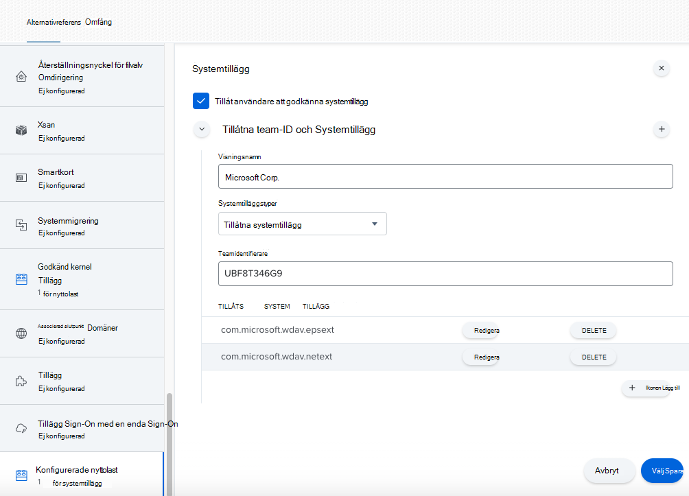

# <a name="new-configuration-profiles-for-macos-catalina-and-newer-versions-of-macos"></a>Nya konfigurationsprofiler för macOS Catalina och nyare versioner av macOS

[!INCLUDE [Microsoft 365 Defender rebranding](../../includes/microsoft-defender.md)]

**Gäller för:**
- [Microsoft Defender för Endpoint](https://go.microsoft.com/fwlink/p/?linkid=2154037)
- [Microsoft 365 Defender](https://go.microsoft.com/fwlink/?linkid=2118804)

> Vill du uppleva Microsoft Defender för Slutpunkt? [Registrera dig för en kostnadsfri utvärderingsversion.](https://www.microsoft.com/microsoft-365/windows/microsoft-defender-atp?ocid=docs-wdatp-exposedapis-abovefoldlink)

I linje med macOS-utveckling förbereder vi en Microsoft Defender för slutpunkt på macOS-uppdatering som utnyttjar systemtillägg istället för kernel-tillägg. Den här uppdateringen gäller endast för macOS Catalina (10.15.4) och senare versioner av macOS.

Om du har distribuerat Microsoft Defender för slutpunkt på macOS i en hanterad miljö (via JAMF, Intune eller en annan MDM-lösning) måste du distribuera nya konfigurationsprofiler. Om du inte gör det får användarna en uppmaning om att köra de här nya komponenterna.

## <a name="jamf"></a>JAMF

### <a name="system-extensions-policy"></a>Princip för systemtillägg

Skapa följande nyttolast för att godkänna systemtilläggen:

1. I **Datorer > Konfigurationsprofiler väljer** du Alternativ > **Systemtillägg**.
2. Välj **Tillåtna systemtillägg** i **listrutan Systemtilläggstyper.**
3. Använd **UBF8T346G9** för team-ID.
4. Lägg till följande paketidentifierare i listan **Med tillåtna systemtillägg:**

    - **com.microsoft.wdav.epsext**
    - **com.microsoft.wdav.netext**

    

### <a name="privacy-preferences-policy-control"></a>Policykontroll för sekretesspolicy

Lägg till följande JAMF-nyttolast för att bevilja fullständig diskåtkomst till Microsoft Defender för Slutpunktens säkerhetstillägg. Den här principen är en förutsättning för att du ska kunna köra tillägget på din enhet.

1. Välj **Alternativ**  >  **principkontroll för Sekretesspolicy.**
2. Använd `com.microsoft.wdav.epsext` som **identifierare** och `Bundle ID` som **pakettyp**.
3. Ställ in kodkrav på `identifier "com.microsoft.wdav.epsext" and anchor apple generic and certificate 1[field.1.2.840.113635.100.6.2.6] /* exists */ and certificate leaf[field.1.2.840.113635.100.6.1.13] /* exists */ and certificate leaf[subject.OU] = UBF8T346G9`
4. Ställ **in app eller tjänst** på **SystemPolicyAllFiles och** åtkomst till **Tillåt**.

    

### <a name="network-extension-policy"></a>Princip för nätverkstillägg

Som en del av funktionerna Slutpunktsidentifiering och svar inspekterar Microsoft Defender för slutpunkt på macOS sockettrafik och rapporterar den här informationen till Microsoft Defender Säkerhetscenter portalen. Med följande princip kan nätverkstillägget utföra de här funktionerna.

>[!NOTE]
>JAMF har inte inbyggt stöd för principer för innehållsfiltrering, vilket är en förutsättning för att aktivera nätverkstillägg som Microsoft Defender för Slutpunkt på macOS installerar på enheten. DESSUTOM ändrar JAMF ibland innehållet i de principer som distribueras.
>Följande steg ger dig därför en lösning som innebär att du signerar konfigurationsprofilen.

1. Spara följande innehåll på din enhet som med `com.microsoft.network-extension.mobileconfig` en textredigerare:

    ```xml
    <?xml version="1.0" encoding="UTF-8"?><!DOCTYPE plist PUBLIC "-//Apple//DTD PLIST 1.0//EN" "http://www.apple.com/DTDs/PropertyList-1.0.dtd">
    <plist version="1">
        <dict>
            <key>PayloadUUID</key>
            <string>DA2CC794-488B-4AFF-89F7-6686A7E7B8AB</string>
            <key>PayloadType</key>
            <string>Configuration</string>
            <key>PayloadOrganization</key>
            <string>Microsoft Corporation</string>
            <key>PayloadIdentifier</key>
            <string>DA2CC794-488B-4AFF-89F7-6686A7E7B8AB</string>
            <key>PayloadDisplayName</key>
            <string>Microsoft Defender ATP Network Extension</string>
            <key>PayloadDescription</key>
            <string/>
            <key>PayloadVersion</key>
            <integer>1</integer>
            <key>PayloadEnabled</key>
            <true/>
            <key>PayloadRemovalDisallowed</key>
            <true/>
            <key>PayloadScope</key>
            <string>System</string>
            <key>PayloadContent</key>
            <array>
                <dict>
                    <key>PayloadUUID</key>
                    <string>2BA070D9-2233-4827-AFC1-1F44C8C8E527</string>
                    <key>PayloadType</key>
                    <string>com.apple.webcontent-filter</string>
                    <key>PayloadOrganization</key>
                    <string>Microsoft Corporation</string>
                    <key>PayloadIdentifier</key>
                    <string>CEBF7A71-D9A1-48BD-8CCF-BD9D18EC155A</string>
                    <key>PayloadDisplayName</key>
                    <string>Approved Network Extension</string>
                    <key>PayloadDescription</key>
                    <string/>
                    <key>PayloadVersion</key>
                    <integer>1</integer>
                    <key>PayloadEnabled</key>
                    <true/>
                    <key>FilterType</key>
                    <string>Plugin</string>
                    <key>UserDefinedName</key>
                    <string>Microsoft Defender ATP Network Extension</string>
                    <key>PluginBundleID</key>
                    <string>com.microsoft.wdav</string>
                    <key>FilterSockets</key>
                    <true/>
                    <key>FilterDataProviderBundleIdentifier</key>
                    <string>com.microsoft.wdav.netext</string>
                    <key>FilterDataProviderDesignatedRequirement</key>
                    <string>identifier "com.microsoft.wdav.netext" and anchor apple generic and certificate 1[field.1.2.840.113635.100.6.2.6] /* exists */ and certificate leaf[field.1.2.840.113635.100.6.1.13] /* exists */ and certificate leaf[subject.OU] = UBF8T346G9</string>
                </dict>
            </array>
        </dict>
    </plist>
    ```

2. Kontrollera att ovanstående fil kopierades korrekt genom att köra `plutil` verktyget i terminalen:

    ```bash
    $ plutil -lint <PathToFile>/com.microsoft.network-extension.mobileconfig
    ```

    Om filen till exempel lagrades i Dokument:

    ```bash
    $ plutil -lint ~/Documents/com.microsoft.network-extension.mobileconfig
    ```
    
    Kontrollera att kommandot matas ut `OK` .
        
    ```bash
    <PathToFile>/com.microsoft.network-extension.mobileconfig: OK
    ```
    
3. Följ instruktionerna på [den här sidan](https://www.jamf.com/jamf-nation/articles/649/creating-a-signing-certificate-using-jamf-pro-s-built-in-certificate-authority) för att skapa ett signeringscertifikat med HJÄLP av DEN inbyggda certifikatutfärdaren i JAMF.

4. När certifikatet har skapats och installerats på enheten kör du följande kommando från Terminalen för att signera filen:

    ```bash
    $ security cms -S -N "<CertificateName>" -i <PathToFile>/com.microsoft.network-extension.mobileconfig -o <PathToSignedFile>/com.microsoft.network-extension.signed.mobileconfig
    ```
    
    Om certifikatnamnet till exempel är **SigningCertificate** och den signerade filen ska lagras i Dokument:
    
    ```bash
    $ security cms -S -N "SigningCertificate" -i ~/Documents/com.microsoft.network-extension.mobileconfig -o ~/Documents/com.microsoft.network-extension.signed.mobileconfig
    ```
    
5. Från JAMF-portalen går du till **Konfigurationsprofiler** och klickar **Upload** profil. Välj `com.microsoft.network-extension.signed.mobileconfig` när du uppmanas att ange filen.

## <a name="intune"></a>Intune

### <a name="system-extensions-policy"></a>Princip för systemtillägg

Så här godkänner du systemtilläggen:

1. Öppna Hantera enhetskonfiguration **i**  >  Intune. Välj **Hantera**  >  **profiler**  >  **skapa profil**.
2. Välj ett namn för profilen. Ändra **Platform=macOS** till **Profiltyp=Tillägg.** Välj **Skapa**.
3. Ge den `Basics` här nya profilen ett namn på fliken.
4. Lägg `Configuration settings` till följande poster i avsnittet på `Allowed system extensions` fliken:

    Paketidentifierare         | Teamidentifierare
    --------------------------|----------------
    com.microsoft.wdav.epsext | UBF8T346G9
    com.microsoft.wdav.netext | UBF8T346G9

    

5. På fliken `Assignments` tilldelar du den här profilen **till Alla användare & alla enheter.**
6. Granska och skapa den här konfigurationsprofilen.

### <a name="create-and-deploy-the-custom-configuration-profile"></a>Skapa och distribuera den anpassade konfigurationsprofilen

Följande konfigurationsprofil aktiverar nätverkstillägget och beviljar Fullständig diskåtkomst till slutpunktssäkerhetssystemtillägget. 

Spara följande innehåll i en fil med namnet **sysext.xml:**

```xml
<?xml version="1.0" encoding="UTF-8"?><!DOCTYPE plist PUBLIC "-//Apple//DTD PLIST 1.0//EN" "http://www.apple.com/DTDs/PropertyList-1.0.dtd">
<plist version="1">
    <dict>
        <key>PayloadUUID</key>
        <string>7E53AC50-B88D-4132-99B6-29F7974EAA3C</string>
        <key>PayloadType</key>
        <string>Configuration</string>
        <key>PayloadOrganization</key>
        <string>Microsoft Corporation</string>
        <key>PayloadIdentifier</key>
        <string>7E53AC50-B88D-4132-99B6-29F7974EAA3C</string>
        <key>PayloadDisplayName</key>
        <string>Microsoft Defender ATP System Extensions</string>
        <key>PayloadDescription</key>
        <string/>
        <key>PayloadVersion</key>
        <integer>1</integer>
        <key>PayloadEnabled</key>
        <true/>
        <key>PayloadRemovalDisallowed</key>
        <true/>
        <key>PayloadScope</key>
        <string>System</string>
        <key>PayloadContent</key>
        <array>
            <dict>
                <key>PayloadUUID</key>
                <string>2BA070D9-2233-4827-AFC1-1F44C8C8E527</string>
                <key>PayloadType</key>
                <string>com.apple.webcontent-filter</string>
                <key>PayloadOrganization</key>
                <string>Microsoft Corporation</string>
                <key>PayloadIdentifier</key>
                <string>CEBF7A71-D9A1-48BD-8CCF-BD9D18EC155A</string>
                <key>PayloadDisplayName</key>
                <string>Approved Network Extension</string>
                <key>PayloadDescription</key>
                <string/>
                <key>PayloadVersion</key>
                <integer>1</integer>
                <key>PayloadEnabled</key>
                <true/>
                <key>FilterType</key>
                <string>Plugin</string>
                <key>UserDefinedName</key>
                <string>Microsoft Defender ATP Network Extension</string>
                <key>PluginBundleID</key>
                <string>com.microsoft.wdav</string>
                <key>FilterSockets</key>
                <true/>
                <key>FilterDataProviderBundleIdentifier</key>
                <string>com.microsoft.wdav.netext</string>
                <key>FilterDataProviderDesignatedRequirement</key>
                <string>identifier &quot;com.microsoft.wdav.netext&quot; and anchor apple generic and certificate 1[field.1.2.840.113635.100.6.2.6] /* exists */ and certificate leaf[field.1.2.840.113635.100.6.1.13] /* exists */ and certificate leaf[subject.OU] = UBF8T346G9</string>
            </dict>
            <dict>
                <key>PayloadUUID</key>
                <string>56105E89-C7C8-4A95-AEE6-E11B8BEA0366</string>
                <key>PayloadType</key>
                <string>com.apple.TCC.configuration-profile-policy</string>
                <key>PayloadOrganization</key>
                <string>Microsoft Corporation</string>
                <key>PayloadIdentifier</key>
                <string>56105E89-C7C8-4A95-AEE6-E11B8BEA0366</string>
                <key>PayloadDisplayName</key>
                <string>Privacy Preferences Policy Control</string>
                <key>PayloadDescription</key>
                <string/>
                <key>PayloadVersion</key>
                <integer>1</integer>
                <key>PayloadEnabled</key>
                <true/>
                <key>Services</key>
                <dict>
                    <key>SystemPolicyAllFiles</key>
                    <array>
                        <dict>
                            <key>Identifier</key>
                            <string>com.microsoft.wdav.epsext</string>
                            <key>CodeRequirement</key>
                            <string>identifier "com.microsoft.wdav.epsext" and anchor apple generic and certificate 1[field.1.2.840.113635.100.6.2.6] /* exists */ and certificate leaf[field.1.2.840.113635.100.6.1.13] /* exists */ and certificate leaf[subject.OU] = UBF8T346G9</string>
                            <key>IdentifierType</key>
                            <string>bundleID</string>
                            <key>StaticCode</key>
                            <integer>0</integer>
                            <key>Allowed</key>
                            <integer>1</integer>
                        </dict>
                    </array>
                </dict>
            </dict>
        </array>
    </dict>
</plist>
```

Kontrollera att ovanstående fil kopierades korrekt. Kör följande kommando från terminalen och kontrollera att det matas `OK` ut:

```bash
$ plutil -lint sysext.xml
sysext.xml: OK
```

Så här distribuerar du den här anpassade konfigurationsprofilen:

1.  Öppna Hantera enhetskonfiguration **i**  >  Intune. Välj **Hantera**  >  **profiler**  >  **Skapa profil**.
2. Välj ett namn för profilen. Change **Platform=macOS** and **Profile type=Custom**. Välj **Konfigurera**.
3.  Öppna konfigurationsprofilen och ladda **uppsysext.xml**. Den här filen skapades i föregående steg.
4.  Välj **OK**.

    

5. På fliken `Assignments` tilldelar du den här profilen **till Alla användare & alla enheter.**
6. Granska och skapa den här konfigurationsprofilen.
