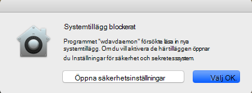
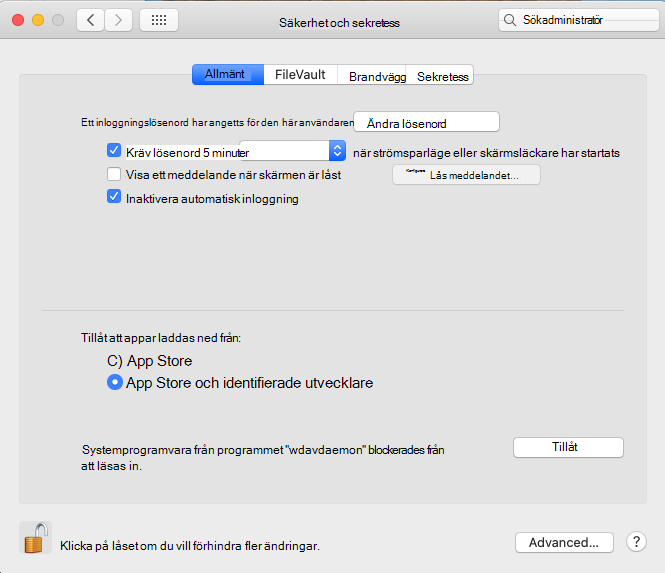
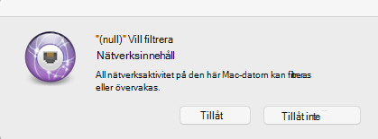
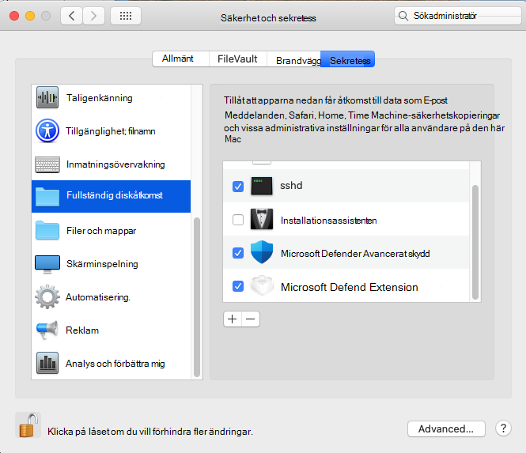

# <a name="microsoft-defender-for-endpoint-for-mac---system-extensions-public-preview"></a>Microsoft Defender för slutpunkt för Mac – systemtillägg offentlig förhandsversion)

**Gäller för:**
- [Microsoft Defender för Endpoint](https://go.microsoft.com/fwlink/p/?linkid=2154037)
- [Microsoft 365 Defender](https://go.microsoft.com/fwlink/?linkid=2118804)

> Vill du uppleva Microsoft Defender för Slutpunkt? [Registrera dig för en kostnadsfri utvärderingsversion.](https://www.microsoft.com/microsoft-365/windows/microsoft-defender-atp?ocid=docs-wdatp-exposedapis-abovefoldlink)

I linje med macOS-utveckling förbereder vi en Defender för slutpunkt för Mac-uppdatering som utnyttjar systemtillägg istället för kernel-tillägg. Den här uppdateringen gäller endast för macOS Catalina (10.15.4) och senare versioner av macOS.

Den här funktionen är för närvarande i offentlig förhandsversion. I den här artikeln beskrivs hur du aktiverar den här funktionen på din enhet. Du kan prova den här funktionen lokalt på din egen enhet eller konfigurera den via ett hanteringsverktyg.

De här instruktionerna förutsätter att du redan har Defender för Endpoint igång på enheten. Mer information finns på den [här sidan.](microsoft-defender-endpoint-mac.md)

## <a name="known-issues"></a>Kända problem

- Vi har fått rapporter om att nätverkstillägget stör Apple SSO Kerberos-tillägget.
- I den aktuella versionen av produkten installeras fortfarande ett kernel-tillägg. Kernel-tillägg används endast som en reservmekanism och kommer att tas bort innan den här funktionen når offentlig förhandsversion.
- Vi arbetar fortfarande med en produktversion som distribuerar och fungerar korrekt på macOS 11 Big Sur.

## <a name="deployment-prerequisites"></a>Distributionsförutsättningarna

- Lägsta macOS-operativsystemsversion: **10.15.4**
- Lägsta produktversion: **101.03.73**
- Enheten måste vara i **uppdateringskanalen för Insider – snabbt.** Du kan kontrollera uppdateringskanalen med hjälp av följande kommando:

  ```bash
  mdatp health --field release_ring
  ```

  Om enheten inte redan finns i uppdateringskanalen för Insider – snabbt kör du följande kommando från terminalen. Kanaluppdateringen börjar gälla nästa gång produkten startar (när nästa produktuppdatering installeras eller när enheten startas om).

  ```bash
  defaults write com.microsoft.autoupdate2 ChannelName -string Beta
  ```

  Om du är i en hanterad miljö (JAMF eller Intune) kan du även konfigurera uppdateringskanalen via fjärrstyrd anslutning. Mer information finns i [Distribuera uppdateringar för Microsoft Defender ATP för Mac: Ange kanalnamnet](mac-updates.md#set-the-channel-name).

## <a name="deployment-steps"></a>Distributionssteg

Följ distributionsanvisningarna som motsvarar din miljö och den metod du föredrar för att prova den här funktionen.

### <a name="manual-deployment"></a>Manuell distribution

#### <a name="approve-the-system-extensions-and-enable-the-network-extension"></a>Godkänna systemtilläggen och aktivera nätverkstillägget

1. När alla distributionsförutsättningarna är uppfyllda startar du om enheten för att starta godkännande- och aktiveringsprocessen för systemtillägg.

   Du ser en serie systemuppslag om att godkänna Defender för slutpunktssystemtillägg. Du måste godkänna **alla** uppmaningar i serien eftersom macOS kräver ett uttryckligt godkännande för varje tillägg som Defender för Endpoint för Mac installerar på enheten.
   
   För varje godkännande väljer du **Öppna säkerhetsinställningar** och sedan Tillåt **för** att tillåta att systemtillägget körs.

   > [!IMPORTANT]
   > Du måste stänga och öppna säkerhetsinställningarna **i**  >  **Systeminställningar & sekretessfönstret** mellan efterföljande godkännanden. Annars visas inte nästa godkännande i macOS.

   > [!IMPORTANT]
   > Det finns en timeout på en minut innan produkten hamnar i kernel-tillägg igen. Det säkerställer att enheten är skyddad.
   >
   > Om det tar mer än en minut startar du om datorn genom att starta om enheten eller använda den för att `sudo killall -9 wdavdaemon` starta godkännandeflödet igen.

   

   

1. När systemtilläggen har godkänts uppmanar macOS dig att godkänna att nätverkstrafiken filtreras. Klicka **på Tillåt.**

   

#### <a name="grant-full-disk-access-to-the-endpoint-security-system-extension"></a>Bevilja fullständig diskåtkomst till slutpunktssäkerhetssystemtillägget

Öppna fliken **Systeminställningar**  >  **för & Sekretess**  >  **och** ge **fullständig diskåtkomst** till **Microsoft Defender Endpoint Security Extension.**



#### <a name="reboot-your-device"></a>Starta om enheten

För att ändringarna ska gå ut måste du starta om enheten.

#### <a name="verify-that-the-system-extensions-are-running"></a>Kontrollera att systemtilläggen körs

Kör följande kommando från terminalen:

```bash
mdatp health --field real_time_protection_subsystem
```

`endpoint_security_extension`Terminalutdata anger att produkten använder systemtilläggsfunktionen.

### <a name="managed-deployment"></a>Hanterad distribution

Se Nya [konfigurationsprofiler för macOS Catalina](mac-sysext-policies.md#jamf) och nyare versioner av macOS: JAMF för de nya konfigurationsprofiler som du måste distribuera för den nya funktionen.

Förutom de profilerna ska du konfigurera målenheterna så att de finns i uppdateringskanalen För Insider – snabbt, enligt beskrivningen [i Distributionsförutsättningarna.](#deployment-prerequisites)

Kör följande kommando på en enhet där alla krav uppfylls och de nya konfigurationsprofilerna har distribuerats:

```bash
$ mdatp health --field real_time_protection_subsystem
```

Om det här `endpoint_security_extension` kommandot skrivs ut används systemtilläggsfunktionen i produkten.

## <a name="validate-basic-scenarios"></a>Validera grundläggande scenarier

1. Test European Institute for Computer Antivirus Research (EICAR). Kör följande kommando från ett terminalfönster:

   ```bash
   curl -o eicar.txt https://secure.eicar.org/eicar.com.txt
   ```

   Kontrollera att EICAR-filen har satts i karantän. Du kan kontrollera filens status på sidan Säkerhetshistorik i användargränssnittet eller från en kommandorad med hjälp av följande kommando:

    ```bash
    mdatp threat list
    ```

2. Testa scenariot Slutpunktsidentifiering och svar (EDR) -PROJEKT. Kör följande kommando från ett terminalfönster:

   ```bash
   curl -o "MDATP MacOS DIY.zip" https://aka.ms/mdatpmacosdiy
   ```

   Verifiera att två aviseringar visas i portalen på datorsidan för EICAR- och EDR-SJÄLV-scenarier.

## <a name="frequently-asked-questions"></a>Vanliga frågor och svar

- F: Varför ser jag fortfarande `kernel_extension` när jag `mdatp health --field real_time_protection_subsystem` kör?

    S: Gå tillbaka till [avsnittet Distributionsförutsättningarna](#deployment-prerequisites) och kontrollera att alla krav uppfylls. Om alla krav uppfylls startar du om enheten och kontrollerar igen.

- F: När stöds macOS 11 Big Sur?

    S: Vi arbetar aktivt med att lägga till support för macOS 11. Vi publicerar mer information [på sidan Vad är nytt.](mac-whatsnew.md)
