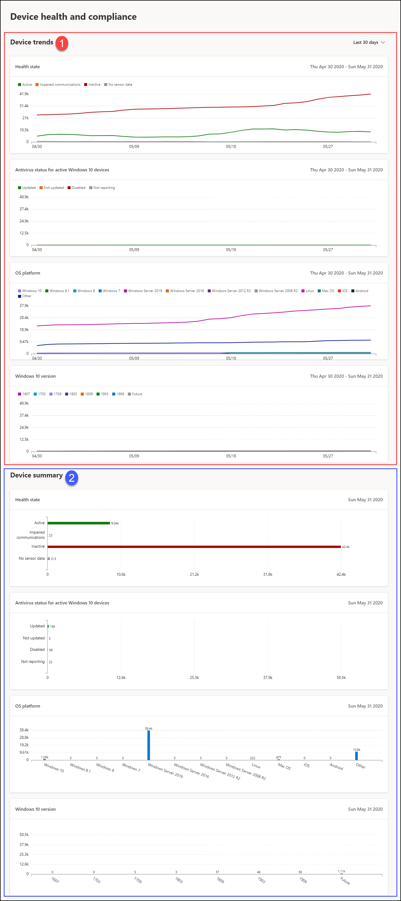

# Rapport om enhetshälsa och efterlevnad i Microsoft Defender för Endpoint

[!INCLUDE [Microsoft 365 Defender rebranding](../../includes/microsoft-defender.md)]

**Gäller för:**
- [Microsoft Defender för Endpoint](https://go.microsoft.com/fwlink/p/?linkid=2154037)
- [Microsoft 365 Defender](https://go.microsoft.com/fwlink/?linkid=2118804)

> Vill du uppleva Microsoft Defender för Slutpunkt? [Registrera dig för en kostnadsfri utvärderingsversion.](https://www.microsoft.com/microsoft-365/windows/microsoft-defender-atp?ocid=docs-wdatp-exposedapis-abovefoldlink)

Statusrapporten för enheter innehåller detaljerad information om enheterna i organisationen. Rapporten innehåller trendinformation som visar sensorns status, antivirusstatus, OS-plattformar och Windows 10-versioner.

Instrumentpanelen är strukturerad i två avsnitt: 
 
Avsnitt | Beskrivning
:---|:---
1 | Enhetstrender
2 | Enhetssammanfattning (aktuell dag)
 
 
## Enhetstrender 
Som standard visar enhetstrender enhetsinformation från 30-dagarsperioden som slutar på den senaste fullständiga dagen. För att få bättre perspektiv på trender i organisationen kan du finjustera rapporteringsperioden genom att justera tidsperioden som visas. Om du vill justera tidsperioden väljer du ett tidsperiodintervall bland alternativen i listrutan:
 
- 30 dagar
- 3 månader
- 6 månader
- Anpassad

>[!NOTE]
>Dessa filter tillämpas endast på avsnittet enhetstrender. Avsnittet med enhetssammanfattningar påverkas inte.

## Enhetssammanfattning 
Även om enhetstrender visar trendande enhetsinformation, visar enhetssammanfattningen enhetsinformation begränsad till den aktuella dagen. 

>[!NOTE]
>Data som återspeglas i sammanfattningsavsnittet är begränsade till 180 dagar före dagens datum. Om dagens datum till exempel är den 27 mars 2019 återspeglar informationen i sammanfattningsavsnittet tal från den 28 september 2018 till den 27 mars 2019. 
> Filtret som används i avsnittet trender tillämpas inte i sammanfattningsavsnittet. 
 
I avsnittet enhetstrender kan du granska nedåt i enhetslistan och använda motsvarande filter. Om du till exempel klickar på fältet Inaktiv i kortet Sensorhälsa visas listan över enheter med resultat som bara visar enheter vars sensorstatus är inaktiv. 
 
 
 
## Enhetsattribut
Rapporten består av kort som visar följande enhetsattribut:
 
- **Hälsotillstånd**: visar information om sensortillståndet på enheter, som ger en samlad vy av enheter som är aktiva, har nedsatt kommunikation, inaktiv eller där inga sensordata visas.
  
- **Antivirusstatus för aktiva Windows 10-enheter**: visar antalet enheter och status för Microsoft Defender Antivirus.
    
- **OS-plattformar**: visar den distribution av OS-plattformar som finns i din organisation. 
 
- **Windows 10-versioner**: visar distributionen av Windows 10-enheter och deras versioner i din organisation.
 
 
 
## Filtrera data
 
Använd de angivna filtren för att inkludera eller exkludera enheter med vissa attribut.

Du kan välja flera filter som ska användas från enhetsattributen. 
 
>[!NOTE]
>De här filtren **gäller** för alla korten i rapporten.
 
Om du till exempel vill visa data om Windows 10-enheter med statusen Aktiv sensor:
 
1. Under **Filter > sensorns hälsotillstånd > Aktiv**.
2. Välj sedan **OS-> Windows 10.**
3. Välj **Använd**.

## Relaterat ämne
- [Rapport om hotskydd](threat-protection-reports.md)
