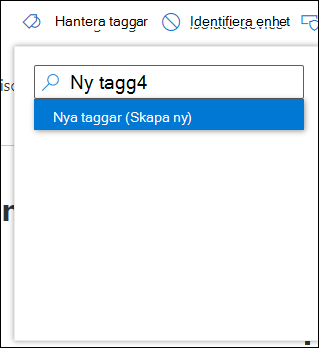
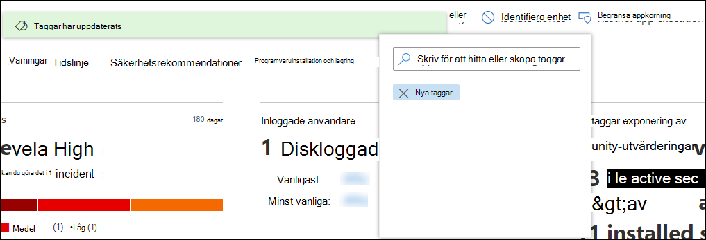

# Skapa och hantera enhetstaggarCreate and manage device tags

[!INCLUDE [Microsoft 365 Defender rebranding](../../includes/microsoft-defender.md)]

**Gäller för:****Applies to:**
- [Microsoft Defender för EndpointMicrosoft Defender for Endpoint](https://go.microsoft.com/fwlink/p/?linkid=2154037)
- [Microsoft 365 DefenderMicrosoft 365 Defender](https://go.microsoft.com/fwlink/?linkid=2118804)

> Vill du uppleva Microsoft Defender för Slutpunkt?Want to experience Microsoft Defender for Endpoint? [Registrera dig för en kostnadsfri utvärderingsversion.Sign up for a free trial.](https://www.microsoft.com/microsoft-365/windows/microsoft-defender-atp?ocid=docs-wdatp-exposedapis-abovefoldlink)

Lägg till taggar på enheter för att skapa logiskt grupp samarbete.Add tags on devices to create a logical group affiliation. Enhetstaggar stöder korrekt mappning av nätverket, så att du kan bifoga olika taggar för att fånga sammanhang och möjliggöra skapande av dynamiska listor som en del av ett problem.Device tags support proper mapping of the network, enabling you to attach different tags to capture context and to enable dynamic list creation as part of an incident. Taggar kan användas som ett filter i **listvyn Enheter** eller för att gruppera enheter.Tags can be used as a filter in **Devices list** view, or to group devices. Mer information om enhetsgruppering finns i [Skapa och hantera enhetsgrupper.](machine-groups.md)For more information on device grouping, see [Create and manage device groups](machine-groups.md).

Du kan lägga till taggar på enheter på följande sätt:You can add tags on devices using the following ways:

- Med hjälp av portalenUsing the portal
- Ange ett registernyckelvärdeSetting a registry key value

> [!NOTE]
> Det kan finnas viss svarstid mellan det att en tagg läggs till på en enhet och dess tillgänglighet i listan enheter och på sidan enhet.There may be some latency between the time a tag is added to a device and its availability in the devices list and device page.  

Information om hur du lägger till enhetstaggar med API finns [i Lägga till eller ta bort API för enhetstaggar.](add-or-remove-machine-tags.md)To add device tags using API, see [Add or remove device tags API](add-or-remove-machine-tags.md).

## Lägga till och hantera enhetstaggar via portalenAdd and manage device tags using the portal

1. Välj den enhet där du vill hantera taggar.Select the device that you want to manage tags on. Du kan välja eller söka efter en enhet i någon av följande vyer:You can select or search for a device from any of the following views:

   - **Instrumentpanel för** säkerhetsåtgärder – Välj enhetens namn i avsnittet Populära enheter med aktiva aviseringar.**Security operations dashboard** - Select the device name from the Top devices with active alerts section.
   - **Telefonaviseringar** – Välj enhetsnamnet bredvid enhetsikonen från aviseringskön.**Alerts queue** - Select the device name beside the device icon from the alerts queue.
   - **Listan Enheter** – Välj enhetsnamnet i listan över enheter.**Devices list** - Select the device name from the list of devices.
   - **Sökruta** – Välj enhet i listrutan och ange enhetens namn.**Search box** - Select Device from the drop-down menu and enter the device name.

     Du kan också gå till aviseringssidan via filen och IP-vyerna.You can also get to the alert page through the file and IP views.

2. Välj **Hantera taggar** i raden med svarsåtgärder.Select **Manage Tags** from the row of Response actions.

    

3. Skriv för att hitta eller skapa taggarType to find or create tags

    

Taggar läggs till i enhetsvyn och visas även i **listvyn** Enheter.Tags are added to the device view and will also be reflected on the **Devices list** view. Sedan kan du använda **filtret Taggar** för att se den relevanta listan över enheter.You can then use the **Tags** filter to see the relevant list of devices.

>[!NOTE]
> Filtrering kanske inte fungerar på taggnamn som innehåller parenteser.Filtering might not work on tag names that contain parenthesis. 
> När du skapar en ny tagg visas en lista med befintliga taggar.When you create a new tag, a list of existing tags are displayed. I listan visas bara taggar som skapats via portalen.The list only shows tags created through the portal. Befintliga taggar som skapats från klientenheter visas inte.Existing tags created from client devices will not be displayed.

Du kan också ta bort taggar från den här vyn.You can also delete tags from this view.

## Lägga till enhetstaggar genom att ange ett registernyckelvärdeAdd device tags by setting a registry key value

>[!NOTE]
> Endast tillämpligt på följande enheter:Applicable only on the following devices:
>- Windows 10, version 1709 eller senareWindows 10, version 1709 or later
>- Windows Server, version 1803 eller senareWindows Server, version 1803 or later
>- Windows Server 2016Windows Server 2016
>- Windows Server 2012 R2Windows Server 2012 R2
>- Windows Server 2008 R2 SP1Windows Server 2008 R2 SP1
>- Windows 8.1Windows 8.1
>- Windows 7 SP1Windows 7 SP1

> [!NOTE] 
> Det maximala antalet tecken som kan anges i en tagg är 200.The maximum number of characters that can be set in a tag is 200.

Enheter med liknande taggar kan vara praktiska när du behöver tillämpa sammanhangsberoende åtgärder på en viss lista med enheter.Devices with similar tags can be handy when you need to apply contextual action on a specific list of devices.

Använd följande registernyckelpost för att lägga till en tagg på en enhet:Use the following registry key entry to add a tag on a device:

- Registernyckel: `HKEY_LOCAL_MACHINE\SOFTWARE\Policies\Microsoft\Windows Advanced Threat Protection\DeviceTagging\`Registry key: `HKEY_LOCAL_MACHINE\SOFTWARE\Policies\Microsoft\Windows Advanced Threat Protection\DeviceTagging\`
- Registernyckelvärde (REG_SZ): `Group`Registry key value (REG_SZ): `Group`
- Registernyckeldata: `Name of the tag you want to set`Registry key data: `Name of the tag you want to set`

>[!NOTE]
>Enhetstaggen är en del av enhetsinformationsrapporten som genereras en gång om dagen.The device tag is part of the device information report that's generated once a day. Alternativt kan du välja att starta om slutpunkten som överför en ny enhetsinformationsrapport.As an alternative, you may choose to restart the endpoint that would transfer a new device information report.
> 
> Om du behöver ta bort en tagg som lagts till med ovanstående registernyckel rensar du innehållet i registernyckeldata i stället för att ta bort gruppnyckeln.If you need to remove a tag that was added using the above Registry key, clear the contents of the Registry key data instead of removing the 'Group' key.
