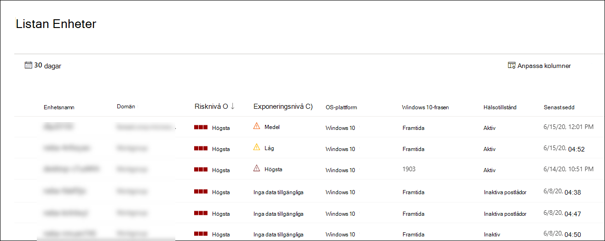

# Visa och ordna listan Microsoft Defender för slutpunktsenheterView and organize the Microsoft Defender for Endpoint Devices list

[!INCLUDE [Microsoft 365 Defender rebranding](../../includes/microsoft-defender.md)]

**Gäller för:****Applies to:**
- [Microsoft Defender för EndpointMicrosoft Defender for Endpoint](https://go.microsoft.com/fwlink/p/?linkid=2154037)
- [Microsoft 365 DefenderMicrosoft 365 Defender](https://go.microsoft.com/fwlink/?linkid=2118804)

> Vill du använda Defender för Slutpunkt?Want to experience Defender for Endpoint? [Registrera dig för en kostnadsfri utvärderingsversion.Sign up for a free trial.](https://www.microsoft.com/microsoft-365/windows/microsoft-defender-atp?ocid=docs-wdatp-machinesview-abovefoldlink)

I **listan Enheter** visas en lista med de enheter i nätverket där aviseringar har genererats.The **Devices list** shows a list of the devices in your network where alerts were generated. Som standard visar kön enheter som har setts de senaste 30 dagarna.By default, the queue displays devices seen in the last 30 days.  

Du får snabbt tillgång till information som domän, risknivå, OS-plattform och annan information för enkel identifiering av enheter som är mest riskfyllda.At a glance you'll see information such as domain, risk level, OS platform, and other details for easy identification of devices most at risk.

Du kan välja mellan flera olika alternativ om du vill anpassa enheternas listvy.There are several options you can choose from to customize the devices list view. I det övre navigeringsfältet kan du:On the top navigation you can:

- Lägga till eller ta bort kolumnerAdd or remove columns
- Exportera hela listan i CSV-formatExport the entire list in CSV format
- Välj hur många objekt som ska visas per sidaSelect the number of items to show per page
- Använda filterApply filters

Under registreringsprocessen fylls **listan Enheter gradvis i** med enheter när de börjar rapportera sensordata.During the onboarding process, the **Devices list** is gradually populated with devices as they begin to report sensor data. Använd den här vyn för att spåra dina inbyggda slutpunkter när de publiceras online, eller ladda ned hela slutpunktslistan som en CSV-fil för offlineanalys.Use this view to track your onboarded endpoints as they come online, or download the complete endpoint list as a CSV file for offline analysis.

>[!NOTE]
> Om du exporterar enhetslistan innehåller den alla enheter i organisationen.If you export the device list, it will contain every device in your organization. Det kan ta mycket tid att ladda ned, beroende på hur stor organisationen är.It might take a significant amount of time to download, depending on how large your organization is. När du exporterar listan i CSV-format visas data på ett ofiltrerat sätt.Exporting the list in CSV format displays the data in an unfiltered manner. CSV-filen innehåller alla enheter i organisationen, oavsett filtrering som används i själva vyn.The CSV file will include all devices in the organization, regardless of any filtering applied in the view itself.

## Sortera och filtrera enhetslistanSort and filter the device list

Du kan använda följande filter för att begränsa listan med aviseringar och få en mer fokuserad vy.You can apply the following filters to limit the list of alerts and get a more focused view.

### RisknivåRisk level

Risknivån återspeglar den övergripande riskbedömningen av enheten baserat på en kombination av faktorer, inklusive typer och allvarlighetsgrad för aktiva varningar på enheten.The risk level reflects the overall risk assessment of the device based on a combination of factors, including the types and severity of active alerts on the device. Att lösa aktiva aviseringar, godkänna åtgärdsaktiviteter och dölja efterföljande aviseringar kan sänka risknivån.Resolving active alerts, approving remediation activities, and suppressing subsequent alerts can lower the risk level.

### ExponeringsnivåExposure level

Exponeringsnivån återspeglar enhetens aktuella exponering baserat på den kumulativa effekten av de väntande säkerhetsrekommendationerna.The exposure level reflects the current exposure of the device based on the cumulative impact of its pending security recommendations. De möjliga nivåerna är låga, medelhöga och höga.The possible levels are low, medium, and high. Låg exponering innebär att enheterna är mindre sårbara för användning.Low exposure means your devices are less vulnerable from exploitation.

Om exponeringsnivån säger "Inga data tillgängliga" finns det några anledningar till varför det kan vara så:If the exposure level says "No data available," there are a few reasons why this may be the case:

- Enheten slutade rapportera i mer än 30 dagar – i så fall anses den vara inaktiv och exponering beräknas inteDevice stopped reporting for more than 30 days – in that case it is considered inactive, and the exposure isn't computed
- Enhetens operativsystem stöds inte – se [minimikraven för Microsoft Defender för Slutpunkt](minimum-requirements.md)Device OS not supported - see [minimum requirements for Microsoft Defender for Endpoint](minimum-requirements.md)
- Enhet med inaktuell agent (mycket osannolikt)Device with stale agent (very unlikely)

### OS-plattformOS Platform

Välj bara de OS-plattformar som du är intresserad av att undersöka.Select only the OS platforms you're interested in investigating.

### HälsotillståndHealth state

Filtrera efter följande tillstånd för enhetshälsa:Filter by the following device health states:

- **Aktiv** – Enheter som aktivt rapporterar sensordata till tjänsten.**Active** – Devices that are actively reporting sensor data to the service.
- **Inaktiv** – Enheter som helt slutat skicka signaler i mer än 7 dagar.**Inactive** – Devices that have completely stopped sending signals for more than 7 days.
- **Felkonfigurerad** – Enheter som har nedsatt kommunikation med tjänsten eller inte kan skicka sensordata.**Misconfigured** – Devices that have impaired communications with service or are unable to send sensor data. Felkonfigurerade enheter kan klassificeras ytterligare till:Misconfigured devices can further be classified to:
  - Inga sensordataNo sensor data
  - Nedsatt kommunikationImpaired communications

  Mer information om hur du åtgärdar problem på felkonfigurerade enheter finns i [Åtgärda defekta sensor .](fix-unhealthy-sensors.md)For more information on how to address issues on misconfigured devices see, [Fix unhealthy sensors](fix-unhealthy-sensors.md).

### AntivirusstatusAntivirus status

Filtrera enheter efter antivirusstatus.Filter devices by antivirus status. Gäller endast Windows 10 aktiva enheter.Applies to active Windows 10 devices only.

- **Inaktiverad** – & skydd mot virus är inaktiverat.**Disabled** - Virus & threat protection is turned off.
- **Rapportering inte** – & skydd mot virushot rapporterar inte.**Not reporting** - Virus & threat protection is not reporting.
- **Inte uppdaterat** – & skydd mot virus är inte uppdaterat.**Not updated** - Virus & threat protection is not up to date.

Mer information finns i View [the Threat & Vulnerability Management dashboard](tvm-dashboard-insights.md).For more information, see [View the Threat & Vulnerability Management dashboard](tvm-dashboard-insights.md).

### Status för åtgärder mot hotThreat mitigation status

Om du vill visa enheter som kan påverkas av ett visst hot väljer du hot i listmenyn och väljer sedan vilken säkerhetsrisk som behöver minimeras.To view devices that may be affected by a certain threat, select the threat from the dropdown menu, and then select what vulnerability aspect needs to be mitigated.

Mer information om vissa hot finns i [Hotanalyser.](threat-analytics.md)To learn more about certain threats, see [Threat analytics](threat-analytics.md). Information om åtgärder finns i [& sårbarhetshantering.](next-gen-threat-and-vuln-mgt.md)For mitigation information, see [Threat & Vulnerability Management](next-gen-threat-and-vuln-mgt.md).

### Windows 10 versionWindows 10 version

Markera bara de Windows 10 versioner du vill undersöka.Select only the Windows 10 versions you're interested in investigating.

### Taggar & grupperTags & Groups

Filtrera listan baserat på de gruppering och taggning som du har lagt till på enskilda enheter.Filter the list based on the grouping and tagging that you've added to individual devices. Se [Skapa och hantera enhetstaggar](machine-tags.md) och Skapa och hantera [enhetsgrupper.](machine-groups.md)See [Create and manage device tags](machine-tags.md) and [Create and manage device groups](machine-groups.md).

## Relaterade ämnenRelated topics

- [Undersöka enheter i listan Microsoft Defender för slutpunktsenheterInvestigate devices in the Microsoft Defender for Endpoint Devices list](investigate-machines.md)
