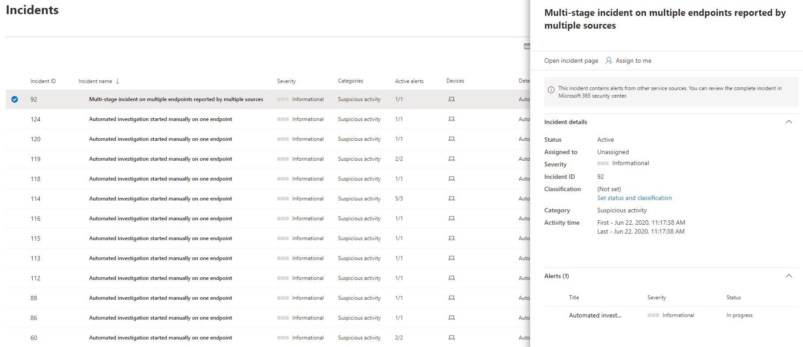

# Hantera Microsoft Defender för slutpunktsincidenter

[!INCLUDE [Microsoft 365 Defender rebranding](../../includes/microsoft-defender.md)]

**Gäller för:**
- [Microsoft Defender för Endpoint](https://go.microsoft.com/fwlink/p/?linkid=2154037)
- [Microsoft 365 Defender](https://go.microsoft.com/fwlink/?linkid=2118804)

> Vill du uppleva Microsoft Defender för Slutpunkt? [Registrera dig för en kostnadsfri utvärderingsversion.](https://www.microsoft.com/microsoft-365/windows/microsoft-defender-atp?ocid=docs-wdatp-exposedapis-abovefoldlink)

Hantering av incidenter är en viktig del av varje cybersäkerhetsåtgärd. Du kan hantera incidenter genom att välja en incident **i kön Incidenter** eller **i fönstret Incidenthantering.** 

Om du väljer en incident **i kön Incidenter** visas **fönstret Incidenthantering** där du kan öppna incidentsidan för mer information.

Du kan tilldela incidenter till dig själv, ändra status och klassificering, byta namn på eller kommentera dem för att hålla reda på förloppet.

> [!TIP]
> För att du snabbt ska kunna se fler incidentnamn genereras incidentnamn automatiskt baserat på aviseringsattribut, till exempel antalet slutpunkter som påverkas, användare som påverkas, identifieringskällor eller kategorier. På så sätt kan du snabbt förstå incidentens omfattning.
>
> Till exempel: *Incident i flera steg på flera slutpunkter som rapporterats av flera källor.*
>
> Incidenter som tidigare fanns före automatisk namngivning för incidenter behåller sina namn.
>

## Tilldela ärenden
Om en incident inte har tilldelats ännu kan du välja Tilldela **till mig och** tilldela incidenten till dig själv. När du gör det förutsätts att du äger inte bara händelsen utan även alla aviseringar som hör till den.

## Ange status och klassificering
### Incidentstatus
Du kan kategorisera incidenter (som **Aktiva** eller **lösta**) genom att ändra deras status allt eftersom undersökningen fortskrider. På så sätt kan du organisera och hantera hur ditt team kan svara på incidenter.

Din SOC-analytiker kan till  exempel granska brådskande aktiva incidenter för dagen och bestämma sig för att tilldela dem till sig själv för undersökning.

Alternativt kan soc-analytikern ange incidenten som **Löst** om incidenten har åtgärdats. 

### Klassificering
Du kan välja att inte ange någon klassificering eller att ange om incidenten är sann eller falsk. Det gör det lättare för teamet att se mönster och lära sig av dem.

### Lägga till kommentarer
Du kan lägga till kommentarer och visa historiska händelser om en händelse om du vill se tidigare ändringar i den.

När en ändring eller kommentar görs i en avisering registreras den i avsnittet Kommentarer och historik.

Tillagda kommentarer visas direkt i fönstret.

## Relaterade ämnen
- [Incidentkö](https://docs.microsoft.com/microsoft-365/security/defender-endpoint/view-incidents-queue)
- [Visa och ordna incidentkö](view-incidents-queue.md)
- [Undersöka incidenter](investigate-incidents.md)
