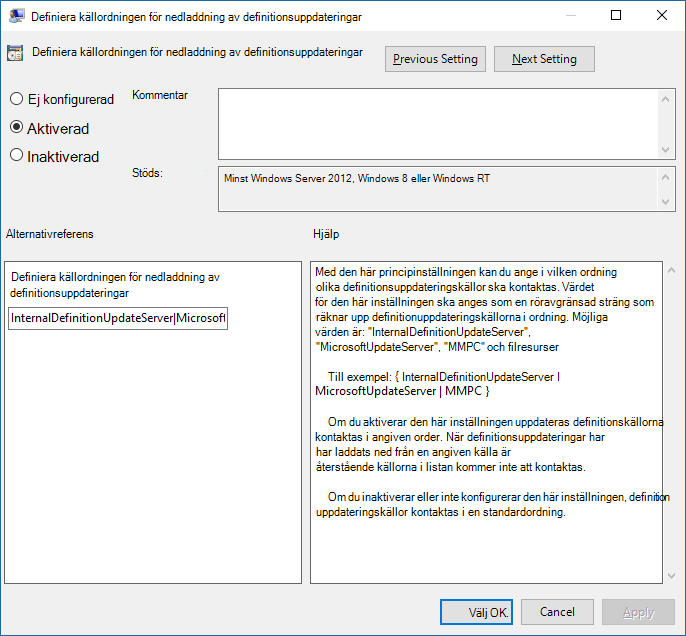

# <a name="manage-the-sources-for-microsoft-defender-antivirus-protection-updates"></a><span data-ttu-id="1882e-104">Hantera källor för skyddsuppdateringar av Microsoft Defender Antivirus</span><span class="sxs-lookup"><span data-stu-id="1882e-104">Manage the sources for Microsoft Defender Antivirus protection updates</span></span>

[!INCLUDE [Microsoft 365 Defender rebranding](../../includes/microsoft-defender.md)]


<span data-ttu-id="1882e-105">**Gäller för:**</span><span class="sxs-lookup"><span data-stu-id="1882e-105">**Applies to:**</span></span>

- [<span data-ttu-id="1882e-106">Microsoft Defender för Endpoint</span><span class="sxs-lookup"><span data-stu-id="1882e-106">Microsoft Defender for Endpoint</span></span>](https://go.microsoft.com/fwlink/p/?linkid=22154037)

<a id="protection-updates"></a>
<!-- this has been used as anchor in VDI content -->

<span data-ttu-id="1882e-107">Det är viktigt att hålla antivirusskyddet uppdaterat.</span><span class="sxs-lookup"><span data-stu-id="1882e-107">Keeping your antivirus protection up to date is critical.</span></span> <span data-ttu-id="1882e-108">Det finns två komponenter för hantering av skyddsuppdateringar för Microsoft Defender Antivirus:</span><span class="sxs-lookup"><span data-stu-id="1882e-108">There are two components to managing protection updates for Microsoft Defender Antivirus:</span></span> 
- <span data-ttu-id="1882e-109">*Var* uppdateringarna hämtas från och</span><span class="sxs-lookup"><span data-stu-id="1882e-109">*Where* the updates are downloaded from; and</span></span> 
- <span data-ttu-id="1882e-110">*När* uppdateringar laddas ned och tillämpas.</span><span class="sxs-lookup"><span data-stu-id="1882e-110">*When* updates are downloaded and applied.</span></span> 

<span data-ttu-id="1882e-111">I den här artikeln beskrivs hur du anger varifrån uppdateringar ska laddas ned (detta kallas även reservordningen).</span><span class="sxs-lookup"><span data-stu-id="1882e-111">This article describes how to specify from where updates should be downloaded (this is also known as the fallback order).</span></span> <span data-ttu-id="1882e-112">I avsnittet Hantera Microsoft Defender Antivirus uppdateringar och använda baslinjer finns en översikt över hur uppdateringar fungerar och hur du konfigurerar andra aspekter av uppdateringar (till exempel [schemaläggningsuppdateringar).](manage-updates-baselines-microsoft-defender-antivirus.md)</span><span class="sxs-lookup"><span data-stu-id="1882e-112">See [Manage Microsoft Defender Antivirus updates and apply baselines](manage-updates-baselines-microsoft-defender-antivirus.md) topic for an overview on how updates work, and how to configure other aspects of updates (such as scheduling updates).</span></span>

> [!IMPORTANT]
> <span data-ttu-id="1882e-113">Microsoft Defender Antivirus Säkerhetsintelligensuppdateringar levereras via Windows Uppdatering och från och med måndagen den 21 oktober 2019 är alla säkerhetsintelligensuppdateringar SHA-2-signerade exklusivt.</span><span class="sxs-lookup"><span data-stu-id="1882e-113">Microsoft Defender Antivirus Security intelligence updates are delivered through Windows Update and starting Monday, October 21, 2019, all security intelligence updates will be SHA-2 signed exclusively.</span></span> <span data-ttu-id="1882e-114">Enheterna måste uppdateras med stöd för SHA-2 för att du ska kunna uppdatera säkerhetsintelligens.</span><span class="sxs-lookup"><span data-stu-id="1882e-114">Your devices must be updated to support SHA-2 in order to update your security intelligence.</span></span> <span data-ttu-id="1882e-115">Mer information finns i krav [för stöd för SHA-2-kodsignering för 2019 Windows och WSUS.](https://support.microsoft.com/help/4472027/2019-sha-2-code-signing-support-requirement-for-windows-and-wsus)</span><span class="sxs-lookup"><span data-stu-id="1882e-115">To learn more, see [2019 SHA-2 Code Signing Support requirement for Windows and WSUS](https://support.microsoft.com/help/4472027/2019-sha-2-code-signing-support-requirement-for-windows-and-wsus).</span></span>  


<a id="fallback-order"></a>

## <a name="fallback-order"></a><span data-ttu-id="1882e-116">Reservorder</span><span class="sxs-lookup"><span data-stu-id="1882e-116">Fallback order</span></span>

<span data-ttu-id="1882e-117">Vanligtvis konfigurerar du slutpunkter att individuellt ladda ned uppdateringar från en primär källa följt av andra källor i prioritetsordning, baserat på din nätverkskonfiguration.</span><span class="sxs-lookup"><span data-stu-id="1882e-117">Typically, you configure endpoints to individually download updates from a primary source followed by other sources in order of priority, based on your network configuration.</span></span> <span data-ttu-id="1882e-118">Uppdateringar hämtas från källor i den ordning du anger.</span><span class="sxs-lookup"><span data-stu-id="1882e-118">Updates are obtained from sources in the order you specify.</span></span> <span data-ttu-id="1882e-119">Om en källa inte är tillgänglig används nästa källa i listan omedelbart.</span><span class="sxs-lookup"><span data-stu-id="1882e-119">If a source is not available, the next source in the list is used immediately.</span></span>

<span data-ttu-id="1882e-120">När uppdateringar publiceras används en logik för att minimera uppdateringens storlek.</span><span class="sxs-lookup"><span data-stu-id="1882e-120">When updates are published, some logic is applied to minimize the size of the update.</span></span> <span data-ttu-id="1882e-121">I de flesta fall är det bara skillnaderna mellan den senaste uppdateringen och den uppdatering som är installerad (det här kallas för delta) på enheten laddas ned och tillämpas.</span><span class="sxs-lookup"><span data-stu-id="1882e-121">In most cases, only the differences between the latest update and the update that is currently installed (this is referred to as the delta) on the device is downloaded and applied.</span></span> <span data-ttu-id="1882e-122">Storleken på deltat beror emellertid på två huvudfaktorer:</span><span class="sxs-lookup"><span data-stu-id="1882e-122">However, the size of the delta depends on two main factors:</span></span>
- <span data-ttu-id="1882e-123">Ålder för den senaste uppdateringen på enheten. och</span><span class="sxs-lookup"><span data-stu-id="1882e-123">The age of the last update on the device; and</span></span> 
- <span data-ttu-id="1882e-124">Den källa som används för att ladda ned och installera uppdateringar.</span><span class="sxs-lookup"><span data-stu-id="1882e-124">The source used to download and apply updates.</span></span> 

<span data-ttu-id="1882e-125">Ju äldre uppdateringar på en slutpunkt, desto större blir nedladdningen.</span><span class="sxs-lookup"><span data-stu-id="1882e-125">The older the updates on an endpoint, the larger the download will be.</span></span> <span data-ttu-id="1882e-126">Men du måste också överväga nedladdningsfrekvens.</span><span class="sxs-lookup"><span data-stu-id="1882e-126">However, you must also consider download frequency as well.</span></span> <span data-ttu-id="1882e-127">Ett uppdateringsschema som ofta används kan leda till större nätverksanvändning, medan ett schema som inte blir så ofta kan leda till större filstorlekar per nedladdning.</span><span class="sxs-lookup"><span data-stu-id="1882e-127">A more frequent update schedule can result in more network usage, whereas a less-frequent schedule can result in larger file sizes per download.</span></span> 

<span data-ttu-id="1882e-128">Det finns fem platser där du kan ange var en slutpunkt ska hämta uppdateringar:</span><span class="sxs-lookup"><span data-stu-id="1882e-128">There are five locations where you can specify where an endpoint should obtain updates:</span></span> 

- [<span data-ttu-id="1882e-129">Microsoft Update</span><span class="sxs-lookup"><span data-stu-id="1882e-129">Microsoft Update</span></span>](https://support.microsoft.com/help/12373/windows-update-faq)
- [<span data-ttu-id="1882e-130">Windows Uppdateringstjänst för server</span><span class="sxs-lookup"><span data-stu-id="1882e-130">Windows Server Update Service</span></span>](/windows-server/administration/windows-server-update-services/get-started/windows-server-update-services-wsus)
- [<span data-ttu-id="1882e-131">Microsoft Endpoint Configuration Manager</span><span class="sxs-lookup"><span data-stu-id="1882e-131">Microsoft Endpoint Configuration Manager</span></span>](/configmgr/core/servers/manage/updates)
- [<span data-ttu-id="1882e-132">Nätverksresurs</span><span class="sxs-lookup"><span data-stu-id="1882e-132">Network file share</span></span>](#unc-share)
- <span data-ttu-id="1882e-133">[Säkerhetsintelligensuppdateringar för Microsoft Defender Antivirus](https://www.microsoft.com/en-us/wdsi/defenderupdates) och andra Microsoft-program mot skadlig programvara (din princip och ditt register kan ha den i listan Microsoft Malware Protection Center (MMPC) säkerhetsinformation, dess tidigare namn.)</span><span class="sxs-lookup"><span data-stu-id="1882e-133">[Security intelligence updates for Microsoft Defender Antivirus and other Microsoft antimalware](https://www.microsoft.com/en-us/wdsi/defenderupdates) (Your policy and registry might have this listed as Microsoft Malware Protection Center (MMPC) security intelligence, its former name.)</span></span>

<span data-ttu-id="1882e-134">För att säkerställa den bästa skyddsnivån ger Microsoft Update snabba versioner, vilket innebär mindre nedladdningar ofta.</span><span class="sxs-lookup"><span data-stu-id="1882e-134">To ensure the best level of protection, Microsoft Update allows for rapid releases, which means smaller downloads on a frequent basis.</span></span> <span data-ttu-id="1882e-135">Källor Windows Server Update Service, Microsoft Endpoint Configuration Manager och Microsofts säkerhetsintelligensuppdateringar ger färre uppdateringar.</span><span class="sxs-lookup"><span data-stu-id="1882e-135">The Windows Server Update Service, Microsoft Endpoint Configuration Manager, and Microsoft security intelligence updates sources deliver less frequent updates.</span></span> <span data-ttu-id="1882e-136">Delta kan alltså vara större, vilket resulterar i större nedladdningar.</span><span class="sxs-lookup"><span data-stu-id="1882e-136">Thus, the delta can be larger, resulting in larger downloads.</span></span> 

> [!IMPORTANT]
> <span data-ttu-id="1882e-137">Om du har angett uppdateringar för [Microsofts](https://www.microsoft.com/security/portal/definitions/adl.aspx) säkerhetsinformationssida som reservkälla efter Windows Serveruppdateringstjänst eller Microsoft Update laddas uppdateringar bara ned från säkerhetsintelligensuppdateringar när den aktuella uppdateringen anses vara in datera.</span><span class="sxs-lookup"><span data-stu-id="1882e-137">If you have set [Microsoft Security intelligence page](https://www.microsoft.com/security/portal/definitions/adl.aspx) updates as a fallback source after Windows Server Update Service or Microsoft Update, updates are only downloaded from security intelligence updates when the current update is considered out-of-date.</span></span> <span data-ttu-id="1882e-138">(Som standard är det sju dagar i följd då uppdateringar inte kan installeras från Windows Server Update Service eller Microsoft Update-tjänsterna).</span><span class="sxs-lookup"><span data-stu-id="1882e-138">(By default, this is seven consecutive days of not being able to apply updates from the Windows Server Update Service or Microsoft Update services).</span></span>
> <span data-ttu-id="1882e-139">Du kan dock [ange antalet dagar innan skyddet rapporteras som inställt.](/windows/threat-protection/microsoft-defender-antivirus/manage-outdated-endpoints-microsoft-defender-antivirus#set-the-number-of-days-before-protection-is-reported-as-out-of-date)</span><span class="sxs-lookup"><span data-stu-id="1882e-139">You can, however, [set the number of days before protection is reported as out-of-date](/windows/threat-protection/microsoft-defender-antivirus/manage-outdated-endpoints-microsoft-defender-antivirus#set-the-number-of-days-before-protection-is-reported-as-out-of-date).</span></span><p>
> <span data-ttu-id="1882e-140">Från och med måndagen den 21 oktober 2019 kommer säkerhetsintelligensuppdateringar att vara SHA-2-signerade exklusivt.</span><span class="sxs-lookup"><span data-stu-id="1882e-140">Starting Monday, October 21, 2019, security intelligence updates will be SHA-2 signed exclusively.</span></span> <span data-ttu-id="1882e-141">Enheter måste uppdateras med stöd för SHA-2 för att få de senaste säkerhetsintelligensuppdateringarna.</span><span class="sxs-lookup"><span data-stu-id="1882e-141">Devices must be updated to support SHA-2 in order to get the latest security intelligence updates.</span></span> <span data-ttu-id="1882e-142">Mer information finns i krav [för stöd för SHA-2-kodsignering för 2019 Windows och WSUS.](https://support.microsoft.com/help/4472027/2019-sha-2-code-signing-support-requirement-for-windows-and-wsus)</span><span class="sxs-lookup"><span data-stu-id="1882e-142">To learn more, see [2019 SHA-2 Code Signing Support requirement for Windows and WSUS](https://support.microsoft.com/help/4472027/2019-sha-2-code-signing-support-requirement-for-windows-and-wsus).</span></span>

<span data-ttu-id="1882e-143">Varje källa har vanliga scenarier som beror på hur nätverket är konfigurerat, utöver hur ofta de publicerar uppdateringar, enligt beskrivningen i följande tabell:</span><span class="sxs-lookup"><span data-stu-id="1882e-143">Each source has typical scenarios that depend on how your network is configured, in addition to how often they publish updates, as described in the following table:</span></span>

|<span data-ttu-id="1882e-144">Plats</span><span class="sxs-lookup"><span data-stu-id="1882e-144">Location</span></span> | <span data-ttu-id="1882e-145">Exempelscenario</span><span class="sxs-lookup"><span data-stu-id="1882e-145">Sample scenario</span></span> |
|---|---|
|<span data-ttu-id="1882e-146">Windows Uppdateringstjänst för server</span><span class="sxs-lookup"><span data-stu-id="1882e-146">Windows Server Update Service</span></span> | <span data-ttu-id="1882e-147">Du använder Windows Server Update Service för att hantera uppdateringar för nätverket.</span><span class="sxs-lookup"><span data-stu-id="1882e-147">You are using Windows Server Update Service to manage updates for your network.</span></span>|
|<span data-ttu-id="1882e-148">Microsoft Update</span><span class="sxs-lookup"><span data-stu-id="1882e-148">Microsoft Update</span></span> | <span data-ttu-id="1882e-149">Du vill att dina slutpunkter ska ansluta direkt till Microsoft Update.</span><span class="sxs-lookup"><span data-stu-id="1882e-149">You want your endpoints to connect directly to Microsoft Update.</span></span> <span data-ttu-id="1882e-150">Detta kan vara användbart för slutpunkter som oregelbundet ansluter till företagsnätverket eller om du inte använder serveruppdateringstjänsten för Windows för att hantera dina uppdateringar.</span><span class="sxs-lookup"><span data-stu-id="1882e-150">This can be useful for endpoints that irregularly connect to your enterprise network, or if you do not use Windows Server Update Service to manage your updates.</span></span>|
|<span data-ttu-id="1882e-151">Filresurs</span><span class="sxs-lookup"><span data-stu-id="1882e-151">File share</span></span> | <span data-ttu-id="1882e-152">Du har icke-Internetanslutna enheter (till exempel virtuella maskiner).</span><span class="sxs-lookup"><span data-stu-id="1882e-152">You have non-Internet-connected devices (such as VMs).</span></span> <span data-ttu-id="1882e-153">Du kan använda den Internetanslutna VM-värden för att hämta uppdateringar till en nätverksresurs från vilken de virtuella maskinerna kan hämta uppdateringarna.</span><span class="sxs-lookup"><span data-stu-id="1882e-153">You can use your Internet-connected VM host to download the updates to a network share, from which the VMs can obtain the updates.</span></span> <span data-ttu-id="1882e-154">Se [VDI-distributionsguiden](deployment-vdi-microsoft-defender-antivirus.md) för hur filresurser kan användas i VDI-miljöer (Virtual Desktop Infrastructure).</span><span class="sxs-lookup"><span data-stu-id="1882e-154">See the [VDI deployment guide](deployment-vdi-microsoft-defender-antivirus.md) for how file shares can be used in virtual desktop infrastructure (VDI) environments.</span></span>|
|<span data-ttu-id="1882e-155">Microsoft Endpoint Manager</span><span class="sxs-lookup"><span data-stu-id="1882e-155">Microsoft Endpoint Manager</span></span> | <span data-ttu-id="1882e-156">Du använder Microsoft Endpoint Manager för att uppdatera slutpunkterna.</span><span class="sxs-lookup"><span data-stu-id="1882e-156">You are using Microsoft Endpoint Manager to update your endpoints.</span></span>|
|<span data-ttu-id="1882e-157">Säkerhetsintelligensuppdateringar för Microsoft Defender Antivirus och andra Microsoft-program mot skadlig programvara (tidigare kallad MMPC)</span><span class="sxs-lookup"><span data-stu-id="1882e-157">Security intelligence updates for Microsoft Defender Antivirus and other Microsoft antimalware (formerly referred to as MMPC)</span></span> |<span data-ttu-id="1882e-158">[Kontrollera att dina enheter har uppdaterats med stöd för SHA-2.](https://support.microsoft.com/help/4472027/2019-sha-2-code-signing-support-requirement-for-windows-and-wsus)</span><span class="sxs-lookup"><span data-stu-id="1882e-158">[Make sure your devices are updated to support SHA-2](https://support.microsoft.com/help/4472027/2019-sha-2-code-signing-support-requirement-for-windows-and-wsus).</span></span> <span data-ttu-id="1882e-159">Microsoft Defender Antivirus Säkerhetsintelligensuppdateringar levereras via Windows Update och från och med måndagen den 21 oktober 2019 är säkerhetsintelligensuppdateringar SHA-2-signerade exklusivt.</span><span class="sxs-lookup"><span data-stu-id="1882e-159">Microsoft Defender Antivirus Security intelligence updates are delivered through Windows Update, and starting Monday October 21, 2019 security intelligence updates will be SHA-2 signed exclusively.</span></span> <br/><span data-ttu-id="1882e-160">Ladda ned de senaste skyddsuppdateringarna på grund av en nyligen genomförd distribution eller för att tillhandahålla en stark, grundläggande bild för [VDI-distribution.](deployment-vdi-microsoft-defender-antivirus.md)</span><span class="sxs-lookup"><span data-stu-id="1882e-160">Download the latest protection updates because of a recent infection or to help provision a strong, base image for [VDI deployment](deployment-vdi-microsoft-defender-antivirus.md).</span></span> <span data-ttu-id="1882e-161">Det här alternativet bör i allmänhet bara användas som en slutgiltig reservkälla, inte den primära källan.</span><span class="sxs-lookup"><span data-stu-id="1882e-161">This option should generally be used only as a final fallback source, and not the primary source.</span></span> <span data-ttu-id="1882e-162">Den används endast om uppdateringar inte kan laddas ned från Windows Server Update Service eller Microsoft Update [under ett angivet antal dagar.](/windows/threat-protection/microsoft-defender-antivirus/manage-outdated-endpoints-microsoft-defender-antivirus#set-the-number-of-days-before-protection-is-reported-as-out-of-date)</span><span class="sxs-lookup"><span data-stu-id="1882e-162">It will only be used if updates cannot be downloaded from Windows Server Update Service or Microsoft Update for [a specified number of days](/windows/threat-protection/microsoft-defender-antivirus/manage-outdated-endpoints-microsoft-defender-antivirus#set-the-number-of-days-before-protection-is-reported-as-out-of-date).</span></span>|

<span data-ttu-id="1882e-163">Du kan hantera i vilken ordning uppdateringskällor används med Grupprincip, Microsoft Endpoint Configuration Manager, PowerShell-cmdlets och WMI.</span><span class="sxs-lookup"><span data-stu-id="1882e-163">You can manage the order in which update sources are used with Group Policy, Microsoft Endpoint Configuration Manager, PowerShell cmdlets, and WMI.</span></span>

> [!IMPORTANT]
> <span data-ttu-id="1882e-164">Om du Windows serveruppdateringstjänsten som en nedladdningsplats måste du godkänna uppdateringarna, oavsett vilket hanteringsverktyg du använder för att ange platsen.</span><span class="sxs-lookup"><span data-stu-id="1882e-164">If you set Windows Server Update Service as a download location, you must approve the updates, regardless of the management tool you use to specify the location.</span></span> <span data-ttu-id="1882e-165">Du kan konfigurera en regel för automatiskt godkännande Windows tjänsten Serveruppdatering, vilket kan vara användbart när uppdateringar kommer in minst en gång om dagen.</span><span class="sxs-lookup"><span data-stu-id="1882e-165">You can set up an automatic approval rule with Windows Server Update Service, which might be useful as updates arrive at least once a day.</span></span> <span data-ttu-id="1882e-166">Mer information finns i Synkronisera [uppdateringar av slutpunktsskydd i fristående program Windows Serveruppdateringstjänst.](/configmgr/protect/deploy-use/endpoint-definitions-wsus#to-synchronize-endpoint-protection-definition-updates-in-standalone-wsus)</span><span class="sxs-lookup"><span data-stu-id="1882e-166">To learn more, see [synchronize endpoint protection updates in standalone Windows Server Update Service](/configmgr/protect/deploy-use/endpoint-definitions-wsus#to-synchronize-endpoint-protection-definition-updates-in-standalone-wsus).</span></span>

<span data-ttu-id="1882e-167">Procedurerna i den här artikeln beskriver först hur du  anger ordningen och sedan hur du ställer in alternativet Filresurs om du har aktiverat den.</span><span class="sxs-lookup"><span data-stu-id="1882e-167">The procedures in this article first describe how to set the order, and then how to set up the **File share** option if you have enabled it.</span></span>

## <a name="use-group-policy-to-manage-the-update-location"></a><span data-ttu-id="1882e-168">Hantera uppdateringsplatsen med grupprinciper</span><span class="sxs-lookup"><span data-stu-id="1882e-168">Use Group Policy to manage the update location</span></span>

1. <span data-ttu-id="1882e-169">På hanteringsdatorn för grupprinciper öppnar du [Konsolen](/previous-versions/windows/it-pro/windows-server-2008-R2-and-2008/cc731212(v=ws.11))för grupprinciphantering, högerklickar på det grupprincipobjekt du vill konfigurera och klickar på **Redigera.**</span><span class="sxs-lookup"><span data-stu-id="1882e-169">On your Group Policy management machine, open the [Group Policy Management Console](/previous-versions/windows/it-pro/windows-server-2008-R2-and-2008/cc731212(v=ws.11)), right-click the Group Policy Object you want to configure and click **Edit**.</span></span>

2. <span data-ttu-id="1882e-170">Gå till **Datorkonfiguration i redigeraren** för **grupprinciphantering.**</span><span class="sxs-lookup"><span data-stu-id="1882e-170">In the **Group Policy Management Editor** go to **Computer configuration**.</span></span>

3. <span data-ttu-id="1882e-171">Klicka **på Principer** och sedan på Administrativa **mallar.**</span><span class="sxs-lookup"><span data-stu-id="1882e-171">Click **Policies** then **Administrative templates**.</span></span>

4. <span data-ttu-id="1882e-172">Expandera trädet så att **Windows delar > Windows Defender > uppdateringar och** konfigurera följande inställningar:</span><span class="sxs-lookup"><span data-stu-id="1882e-172">Expand the tree to **Windows components > Windows Defender > Signature updates** and configure the following settings:</span></span>

   1.  <span data-ttu-id="1882e-173">Dubbelklicka på inställningen Definiera **ordningen på källor för nedladdning av säkerhetsintelligensuppdateringar** och ange alternativet **Aktiverad**.</span><span class="sxs-lookup"><span data-stu-id="1882e-173">Double-click the **Define the order of sources for downloading security intelligence updates** setting and set the option to **Enabled**.</span></span>

   2.  <span data-ttu-id="1882e-174">Ange källordningen, avgränsad med ett enda rör, till exempel: `InternalDefinitionUpdateServer|MicrosoftUpdateServer|MMPC` , som på följande skärmbild.</span><span class="sxs-lookup"><span data-stu-id="1882e-174">Enter the order of sources, separated by a single pipe, for example: `InternalDefinitionUpdateServer|MicrosoftUpdateServer|MMPC`, as shown in the following screenshot.</span></span>

   

   3. <span data-ttu-id="1882e-176">Klicka på **OK**.</span><span class="sxs-lookup"><span data-stu-id="1882e-176">Click **OK**.</span></span> <span data-ttu-id="1882e-177">Då anges ordningen för skydd av uppdateringskällor.</span><span class="sxs-lookup"><span data-stu-id="1882e-177">This will set the order of protection update sources.</span></span>

   4. <span data-ttu-id="1882e-178">Dubbelklicka på inställningen Definiera **filresurser för hämtning av säkerhetsintelligensuppdateringar** och ange alternativet **Aktiverad.**</span><span class="sxs-lookup"><span data-stu-id="1882e-178">Double-click the **Define file shares for downloading security intelligence updates** setting and set the option to **Enabled**.</span></span>

   5. <span data-ttu-id="1882e-179">Ange filresurskällan.</span><span class="sxs-lookup"><span data-stu-id="1882e-179">Enter the file share source.</span></span> <span data-ttu-id="1882e-180">Om du har flera källor anger du varje källa i den ordning de ska användas, avgränsade med en enda rörledning.</span><span class="sxs-lookup"><span data-stu-id="1882e-180">If you have multiple sources, enter each source in the order they should be used, separated by a single pipe.</span></span> <span data-ttu-id="1882e-181">Använd [standard-UNC-notation](/openspecs/windows_protocols/ms-dtyp/62e862f4-2a51-452e-8eeb-dc4ff5ee33cc) för att beteckna sökvägen, till exempel: `\\host-name1\share-name\object-name|\\host-name2\share-name\object-name` .</span><span class="sxs-lookup"><span data-stu-id="1882e-181">Use [standard UNC notation](/openspecs/windows_protocols/ms-dtyp/62e862f4-2a51-452e-8eeb-dc4ff5ee33cc) for denoting the path, for example: `\\host-name1\share-name\object-name|\\host-name2\share-name\object-name`.</span></span>  <span data-ttu-id="1882e-182">Om du inte anger några sökvägar hoppas den här källan över när den virtuella maskinerna laddar ned uppdateringar.</span><span class="sxs-lookup"><span data-stu-id="1882e-182">If you do not enter any paths, then this source will be skipped when the VM downloads updates.</span></span>

   6. <span data-ttu-id="1882e-183">Klicka på **OK**.</span><span class="sxs-lookup"><span data-stu-id="1882e-183">Click **OK**.</span></span> <span data-ttu-id="1882e-184">Då anges ordningen på filresurser när källan refereras i grupprincipinställningen **Definiera ordningen** på källor....</span><span class="sxs-lookup"><span data-stu-id="1882e-184">This will set the order of file shares when that source is referenced in the **Define the order of sources...** group policy setting.</span></span>

> [!NOTE]
> <span data-ttu-id="1882e-185">För Windows 10, version 1703 upp till och med 1809 är principsökvägen **Windows Components > Microsoft Defender Antivirus > Signature Updates** för Windows 10, version 1903, och den principsökväg som används är Windows Components > Microsoft Defender Antivirus > Security Intelligence **Updates**</span><span class="sxs-lookup"><span data-stu-id="1882e-185">For Windows 10, versions 1703 up to and including 1809, the policy path is **Windows Components > Microsoft Defender Antivirus > Signature Updates** For Windows 10, version 1903, the policy path is **Windows Components > Microsoft Defender Antivirus > Security Intelligence Updates**</span></span>

## <a name="use-configuration-manager-to-manage-the-update-location"></a><span data-ttu-id="1882e-186">Hantera uppdateringsplatsen med Konfigurationshanteraren</span><span class="sxs-lookup"><span data-stu-id="1882e-186">Use Configuration Manager to manage the update location</span></span>

<span data-ttu-id="1882e-187">Mer [information om hur du konfigurerar Microsoft Endpoint Manager](/configmgr/protect/deploy-use/endpoint-definition-updates) (current branch) finns i Konfigurera Endpoint Protection säkerhetsintelligensuppdateringar.</span><span class="sxs-lookup"><span data-stu-id="1882e-187">See [Configure Security intelligence Updates for Endpoint Protection](/configmgr/protect/deploy-use/endpoint-definition-updates) for details on configuring Microsoft Endpoint Manager (current branch).</span></span>


## <a name="use-powershell-cmdlets-to-manage-the-update-location"></a><span data-ttu-id="1882e-188">Använda PowerShell-cmdlets för att hantera uppdateringsplatsen</span><span class="sxs-lookup"><span data-stu-id="1882e-188">Use PowerShell cmdlets to manage the update location</span></span>

<span data-ttu-id="1882e-189">Använd följande PowerShell-cmdlets för att ange uppdateringsordningen.</span><span class="sxs-lookup"><span data-stu-id="1882e-189">Use the following PowerShell cmdlets to set the update order.</span></span>

```PowerShell
Set-MpPreference -SignatureFallbackOrder {LOCATION|LOCATION|LOCATION|LOCATION}
Set-MpPreference -SignatureDefinitionUpdateFileSharesSource {\\UNC SHARE PATH|\\UNC SHARE PATH}
```
<span data-ttu-id="1882e-190">Mer information finns i följande artiklar:</span><span class="sxs-lookup"><span data-stu-id="1882e-190">See the following articles for more information:</span></span>
- [<span data-ttu-id="1882e-191">Set-MpPreference -SignatureFallbackOrder</span><span class="sxs-lookup"><span data-stu-id="1882e-191">Set-MpPreference -SignatureFallbackOrder</span></span>](/powershell/module/defender/set-mppreference)
- [<span data-ttu-id="1882e-192">Set-MpPreference -SignatureDefinitionUpdateFileSharesSource</span><span class="sxs-lookup"><span data-stu-id="1882e-192">Set-MpPreference -SignatureDefinitionUpdateFileSharesSource</span></span>](/powershell/module/defender/set-mppreference#-signaturedefinitionupdatefilesharessources)
- [<span data-ttu-id="1882e-193">Använda PowerShell-cmdlets för att konfigurera och köra Microsoft Defender Antivirus</span><span class="sxs-lookup"><span data-stu-id="1882e-193">Use PowerShell cmdlets to configure and run Microsoft Defender Antivirus</span></span>](use-powershell-cmdlets-microsoft-defender-antivirus.md)
- [<span data-ttu-id="1882e-194">Defender-cmdlets</span><span class="sxs-lookup"><span data-stu-id="1882e-194">Defender cmdlets</span></span>](/powershell/module/defender/index)

## <a name="use-windows-management-instruction-wmi-to-manage-the-update-location"></a><span data-ttu-id="1882e-195">Hantera Windows uppdateringsplatsen med hjälp av WMI (Management Instruction)</span><span class="sxs-lookup"><span data-stu-id="1882e-195">Use Windows Management Instruction (WMI) to manage the update location</span></span>

<span data-ttu-id="1882e-196">Använd [ **metoden** Set för **MSFT_MpPreference**](/previous-versions/windows/desktop/legacy/dn455323(v=vs.85)) för följande egenskaper:</span><span class="sxs-lookup"><span data-stu-id="1882e-196">Use the [**Set** method of the **MSFT_MpPreference**](/previous-versions/windows/desktop/legacy/dn455323(v=vs.85)) class for the following properties:</span></span>

```WMI
SignatureFallbackOrder
SignatureDefinitionUpdateFileSharesSource
```

<span data-ttu-id="1882e-197">Mer information finns i följande artiklar:</span><span class="sxs-lookup"><span data-stu-id="1882e-197">See the following articles for more information:</span></span>
- [<span data-ttu-id="1882e-198">Windows Defender WMIv2-API:er</span><span class="sxs-lookup"><span data-stu-id="1882e-198">Windows Defender WMIv2 APIs</span></span>](/previous-versions/windows/desktop/defender/windows-defender-wmiv2-apis-portal)

## <a name="use-mobile-device-management-mdm-to-manage-the-update-location"></a><span data-ttu-id="1882e-199">Använda MDM (Mobile Device Management) för att hantera uppdateringsplatsen</span><span class="sxs-lookup"><span data-stu-id="1882e-199">Use Mobile Device Management (MDM) to manage the update location</span></span>

<span data-ttu-id="1882e-200">Mer information om konfiguration av MDM finns i [Policy CSP – Defender/SignatureUpdateFallbackOrder.](/windows/client-management/mdm/policy-csp-defender#defender-signatureupdatefallbackorder)</span><span class="sxs-lookup"><span data-stu-id="1882e-200">See [Policy CSP - Defender/SignatureUpdateFallbackOrder](/windows/client-management/mdm/policy-csp-defender#defender-signatureupdatefallbackorder) for details on configuring MDM.</span></span>

## <a name="what-if-were-using-a-third-party-vendor"></a><span data-ttu-id="1882e-201">Vad händer om vi använder en tredjepartsleverantör?</span><span class="sxs-lookup"><span data-stu-id="1882e-201">What if we're using a third-party vendor?</span></span>

<span data-ttu-id="1882e-202">I den här artikeln beskrivs hur du konfigurerar och hanterar uppdateringar för Microsoft Defender Antivirus.</span><span class="sxs-lookup"><span data-stu-id="1882e-202">This article describes how to configure and manage updates for Microsoft Defender Antivirus.</span></span> <span data-ttu-id="1882e-203">Tredjepartsleverantörer kan emellertid användas för att utföra de här uppgifterna.</span><span class="sxs-lookup"><span data-stu-id="1882e-203">However, third-party vendors can be used to perform these tasks.</span></span> 

<span data-ttu-id="1882e-204">Anta till exempel att Contoso har anställt Fabrikam för att hantera sin säkerhetslösning, vilket omfattar Microsoft Defender Antivirus.</span><span class="sxs-lookup"><span data-stu-id="1882e-204">For example, suppose that Contoso has hired Fabrikam to manage their security solution, which includes Microsoft Defender Antivirus.</span></span> <span data-ttu-id="1882e-205">Fabrikam använder [Windows Management Instrumentation,](./use-wmi-microsoft-defender-antivirus.md) [PowerShell-cmdlets](./use-powershell-cmdlets-microsoft-defender-antivirus.md) [eller Windows-kommandoraden för](./command-line-arguments-microsoft-defender-antivirus.md) att distribuera korrigeringar och uppdateringar.</span><span class="sxs-lookup"><span data-stu-id="1882e-205">Fabrikam typically uses [Windows Management Instrumentation](./use-wmi-microsoft-defender-antivirus.md), [PowerShell cmdlets](./use-powershell-cmdlets-microsoft-defender-antivirus.md), or [Windows command-line](./command-line-arguments-microsoft-defender-antivirus.md) to deploy patches and updates.</span></span> 

> [!NOTE]
> <span data-ttu-id="1882e-206">Microsoft testar inte tredjepartslösningar för att hantera Microsoft Defender Antivirus.</span><span class="sxs-lookup"><span data-stu-id="1882e-206">Microsoft does not test third-party solutions for managing Microsoft Defender Antivirus.</span></span>

<a id="unc-share"></a>
## <a name="create-a-unc-share-for-security-intelligence-updates"></a><span data-ttu-id="1882e-207">Skapa en UNC-delning för säkerhetsintelligensuppdateringar</span><span class="sxs-lookup"><span data-stu-id="1882e-207">Create a UNC share for security intelligence updates</span></span>

<span data-ttu-id="1882e-208">Konfigurera en nätverksresurs (UNC/mappad enhet) för att hämta säkerhetsintelligensuppdateringar från MMPC-webbplatsen med hjälp av en schemalagd aktivitet.</span><span class="sxs-lookup"><span data-stu-id="1882e-208">Set up a network file share (UNC/mapped drive) to download security intelligence updates from the MMPC site by using a scheduled task.</span></span>

1. <span data-ttu-id="1882e-209">Skapa en mapp där du vill spara skriptet i det system där du vill etablera resursen och ladda ned uppdateringarna.</span><span class="sxs-lookup"><span data-stu-id="1882e-209">On the system on which you want to provision the share and download the updates, create a folder to which you will save the script.</span></span>
    ```DOS
    Start, CMD (Run as admin)
    MD C:\Tool\PS-Scripts\
    ```

2. <span data-ttu-id="1882e-210">Skapa den mapp som du ska spara signaturuppdateringarna i.</span><span class="sxs-lookup"><span data-stu-id="1882e-210">Create the folder to which you will save the signature updates.</span></span>
    ```DOS
    MD C:\Temp\TempSigs\x64
    MD C:\Temp\TempSigs\x86
    ```

3. <span data-ttu-id="1882e-211">Ladda ned PowerShell-skriptet [från www.powershellgallery.com/packages/SignatureDownloadCustomTask/1.4](https://www.powershellgallery.com/packages/SignatureDownloadCustomTask/1.4).</span><span class="sxs-lookup"><span data-stu-id="1882e-211">Download the PowerShell script from [www.powershellgallery.com/packages/SignatureDownloadCustomTask/1.4](https://www.powershellgallery.com/packages/SignatureDownloadCustomTask/1.4).</span></span>

4. <span data-ttu-id="1882e-212">Klicka **på Manuell nedladdning.**</span><span class="sxs-lookup"><span data-stu-id="1882e-212">Click **Manual Download**.</span></span>

5. <span data-ttu-id="1882e-213">Klicka **på Ladda ned den obearbetade nupkg-filen**.</span><span class="sxs-lookup"><span data-stu-id="1882e-213">Click **Download the raw nupkg file**.</span></span>

6. <span data-ttu-id="1882e-214">Extrahera filen.</span><span class="sxs-lookup"><span data-stu-id="1882e-214">Extract the file.</span></span>

7. <span data-ttu-id="1882e-215">Kopiera filen eller SignatureDownloadCustomTask.ps1 den mapp som du tidigare skapade, C:\Tool\PS-Scripts\ .</span><span class="sxs-lookup"><span data-stu-id="1882e-215">Copy the file SignatureDownloadCustomTask.ps1 to the folder you previously created, C:\Tool\PS-Scripts\ .</span></span>

8. <span data-ttu-id="1882e-216">Använd kommandoraden för att konfigurera den schemalagda aktiviteten.</span><span class="sxs-lookup"><span data-stu-id="1882e-216">Use the command line to set up the scheduled task.</span></span>
    > [!NOTE]
    > <span data-ttu-id="1882e-217">Det finns två typer av uppdateringar: fullständiga och delta.</span><span class="sxs-lookup"><span data-stu-id="1882e-217">There are two types of updates: full and delta.</span></span>
   - <span data-ttu-id="1882e-218">För x64 delta:</span><span class="sxs-lookup"><span data-stu-id="1882e-218">For x64 delta:</span></span>

       ```DOS
       Powershell (Run as admin)
    
       C:\Tool\PS-Scripts\
    
       “.\SignatureDownloadCustomTask.ps1 -action create -arch x64 -isDelta $true -destDir C:\Temp\TempSigs\x64 -scriptPath C:\Tool\PS-Scripts\SignatureDownloadCustomTask.ps1 -daysInterval 1”
       ```

   - <span data-ttu-id="1882e-219">För x64 fullt:</span><span class="sxs-lookup"><span data-stu-id="1882e-219">For x64 full:</span></span>

       ```DOS
       Powershell (Run as admin)
    
       C:\Tool\PS-Scripts\
    
       “.\SignatureDownloadCustomTask.ps1 -action create -arch x64 -isDelta $false -destDir C:\Temp\TempSigs\x64 -scriptPath C:\Tool\PS-Scripts\SignatureDownloadCustomTask.ps1 -daysInterval 1”
       ```

   - <span data-ttu-id="1882e-220">För x86 delta:</span><span class="sxs-lookup"><span data-stu-id="1882e-220">For x86 delta:</span></span>

       ```DOS
       Powershell (Run as admin)
    
       C:\Tool\PS-Scripts\
    
       “.\SignatureDownloadCustomTask.ps1 -action create -arch x86 -isDelta $true -destDir C:\Temp\TempSigs\x86 -scriptPath C:\Tool\PS-Scripts\SignatureDownloadCustomTask.ps1 -daysInterval 1”
       ```

   - <span data-ttu-id="1882e-221">För x86 fullt:</span><span class="sxs-lookup"><span data-stu-id="1882e-221">For x86 full:</span></span>

       ```DOS
       Powershell (Run as admin)
    
       C:\Tool\PS-Scripts\
    
       “.\SignatureDownloadCustomTask.ps1 -action create -arch x86 -isDelta $false -destDir C:\Temp\TempSigs\x86 -scriptPath C:\Tool\PS-Scripts\SignatureDownloadCustomTask.ps1 -daysInterval 1”
       ```

    > [!NOTE]
    > <span data-ttu-id="1882e-222">När de schemalagda aktiviteterna har skapats hittar du dem i Schemaläggaren under Microsoft\Windows\Windows Defender</span><span class="sxs-lookup"><span data-stu-id="1882e-222">When the scheduled tasks are created, you can find these in the Task Scheduler under Microsoft\Windows\Windows Defender</span></span>
9. <span data-ttu-id="1882e-223">Kör varje aktivitet manuellt och kontrollera att du har data (mpam-d.exe, mpam-fe.exe och nis_full.exe) i följande mappar (du kanske har valt olika platser):</span><span class="sxs-lookup"><span data-stu-id="1882e-223">Run each task manually and verify that you have data (mpam-d.exe, mpam-fe.exe, and nis_full.exe) in the following folders (you might have chosen different locations):</span></span>

   - <span data-ttu-id="1882e-224">C:\Temp\TempSigs\x86</span><span class="sxs-lookup"><span data-stu-id="1882e-224">C:\Temp\TempSigs\x86</span></span>
   - <span data-ttu-id="1882e-225">C:\Temp\TempSigs\x64</span><span class="sxs-lookup"><span data-stu-id="1882e-225">C:\Temp\TempSigs\x64</span></span>

   <span data-ttu-id="1882e-226">Om den schemalagda aktiviteten misslyckas kör du följande kommandon:</span><span class="sxs-lookup"><span data-stu-id="1882e-226">If the scheduled task fails, run the following commands:</span></span>

    ```DOS
    C:\windows\system32\windowspowershell\v1.0\powershell.exe -NoProfile -executionpolicy allsigned -command “&\”C:\Tool\PS-Scripts\SignatureDownloadCustomTask.ps1\” -action run -arch x64 -isDelta $False -destDir C:\Temp\TempSigs\x64″
    
    C:\windows\system32\windowspowershell\v1.0\powershell.exe -NoProfile -executionpolicy allsigned -command “&\”C:\Tool\PS-Scripts\SignatureDownloadCustomTask.ps1\” -action run -arch x64 -isDelta $True -destDir C:\Temp\TempSigs\x64″
    
    C:\windows\system32\windowspowershell\v1.0\powershell.exe -NoProfile -executionpolicy allsigned -command “&\”C:\Tool\PS-Scripts\SignatureDownloadCustomTask.ps1\” -action run -arch x86 -isDelta $False -destDir C:\Temp\TempSigs\x86″
    
    C:\windows\system32\windowspowershell\v1.0\powershell.exe -NoProfile -executionpolicy allsigned -command “&\”C:\Tool\PS-Scripts\SignatureDownloadCustomTask.ps1\” -action run -arch x86 -isDelta $True -destDir C:\Temp\TempSigs\x86″
    ```
    > [!NOTE]
    > <span data-ttu-id="1882e-227">Problem kan också bero på körningsprincipen.</span><span class="sxs-lookup"><span data-stu-id="1882e-227">Issues could also be due to execution policy.</span></span>
    
10. <span data-ttu-id="1882e-228">Skapa en delning som pekar på C:\Temp\TempSigs (t.ex. \\ server\uppdateringar).</span><span class="sxs-lookup"><span data-stu-id="1882e-228">Create a share pointing to C:\Temp\TempSigs (e.g. \\server\updates).</span></span>
    > [!NOTE]
    > <span data-ttu-id="1882e-229">Som minst måste autentiserade användare ha läsbehörighet.</span><span class="sxs-lookup"><span data-stu-id="1882e-229">At a minimum, authenticated users must have “Read” access.</span></span>
11. <span data-ttu-id="1882e-230">Ställ in delningsplatsen i principen på delningsplatsen.</span><span class="sxs-lookup"><span data-stu-id="1882e-230">Set the share location in the policy to the share.</span></span>

    > [!NOTE]
    > <span data-ttu-id="1882e-231">Lägg inte till mappen x64 (eller x86) i sökvägen.</span><span class="sxs-lookup"><span data-stu-id="1882e-231">Do not add the x64 (or x86) folder in the path.</span></span> <span data-ttu-id="1882e-232">Processen mpcmdrun.exe lägger till den automatiskt.</span><span class="sxs-lookup"><span data-stu-id="1882e-232">The mpcmdrun.exe process adds it automatically.</span></span>

## <a name="related-articles"></a><span data-ttu-id="1882e-233">Relaterade artiklar</span><span class="sxs-lookup"><span data-stu-id="1882e-233">Related articles</span></span>

- [<span data-ttu-id="1882e-234">Distribuera Microsoft Defender Antivirus</span><span class="sxs-lookup"><span data-stu-id="1882e-234">Deploy Microsoft Defender Antivirus</span></span>](deploy-manage-report-microsoft-defender-antivirus.md)
- [<span data-ttu-id="1882e-235">Hantera Microsoft Defender Antivirus uppdateringar och använda baslinjer</span><span class="sxs-lookup"><span data-stu-id="1882e-235">Manage Microsoft Defender Antivirus updates and apply baselines</span></span>](manage-updates-baselines-microsoft-defender-antivirus.md)
- [<span data-ttu-id="1882e-236">Hantera uppdateringar för slutpunkter som är in uppdaterade</span><span class="sxs-lookup"><span data-stu-id="1882e-236">Manage updates for endpoints that are out of date</span></span>](manage-outdated-endpoints-microsoft-defender-antivirus.md)
- [<span data-ttu-id="1882e-237">Hantera händelsebaserade uppdateringar</span><span class="sxs-lookup"><span data-stu-id="1882e-237">Manage event-based forced updates</span></span>](manage-event-based-updates-microsoft-defender-antivirus.md)
- [<span data-ttu-id="1882e-238">Hantera uppdateringar för mobila enheter och virtuella maskiner</span><span class="sxs-lookup"><span data-stu-id="1882e-238">Manage updates for mobile devices and VMs</span></span>](manage-updates-mobile-devices-vms-microsoft-defender-antivirus.md)
- [<span data-ttu-id="1882e-239">Microsoft Defender Antivirus i Windows 10</span><span class="sxs-lookup"><span data-stu-id="1882e-239">Microsoft Defender Antivirus in Windows 10</span></span>](microsoft-defender-antivirus-in-windows-10.md)