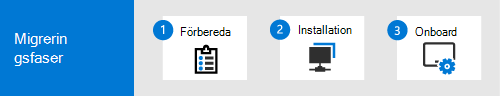

# Migrera från McAfee till Microsoft Defender för Endpoint

**Gäller för:**
- [Microsoft Defender för Endpoint](https://go.microsoft.com/fwlink/p/?linkid=2154037)
- [Microsoft 365 Defender](https://go.microsoft.com/fwlink/?linkid=2118804)

Om du planerar att byta från McAfee Endpoint Security (McAfee) till [Microsoft Defender](https://docs.microsoft.com/windows/security/threat-protection) för Endpoint (Microsoft Defender för Endpoint) är du på rätt plats. Använd den här artikeln som en guide.

:::image type="content" source="images/mcafee-mde-migration.png" alt-text="Översikt över migrering från McAfee till Defender för Endpoint":::

När du gör bytet från McAfee till Defender för Endpoint börjar du med din McAfee-lösning i aktivt läge, konfigurerar Defender för Slutpunkt i passiv form, växlar till Defender för Slutpunkt och anger sedan att Defender ska vara aktivt läge och att McAfee ska tas bort.

## Migreringsprocessen

När du byter från McAfee till Microsoft Defender för Endpoint följer du en process som kan delas upp i tre faser: Förbereda, konfigurera och registrera. 

|Fas |Beskrivning |
|--|--|
|[Förbereda migreringen](mcafee-to-microsoft-defender-prepare.md) |Under [**förberedelsefasen**](mcafee-to-microsoft-defender-prepare.md) uppdaterar du organisationens enheter, hämtar Microsoft Defender för Endpoint, planerar dina roller och behörigheter och ger åtkomst till Microsoft Defender Säkerhetscenter. Du kan också konfigurera din enhetsproxy och Internetinställningar för att aktivera kommunikation mellan din organisations enheter och Microsoft Defender för slutpunkt. |
|[Konfigurera Microsoft Defender för Slutpunkt](mcafee-to-microsoft-defender-setup.md) |Under [**konfigurationsfasen**](mcafee-to-microsoft-defender-setup.md) aktiverar du Microsoft Defender Antivirus och kontrollerar att det är i passivt läge, och du konfigurerar inställningar & undantag för Microsoft Defender Antivirus, Microsoft Defender för Endpoint och McAfee. Du kan också skapa enhetsgrupper, samlingar och organisationsenheter. Slutligen konfigurerar du dina riktlinjer för program mot skadlig programvara och inställningar för realtidsskydd.|
|[Gå till Microsoft Defender för Slutpunkt](mcafee-to-microsoft-defender-onboard.md) |Under fasen [**Onboard**](mcafee-to-microsoft-defender-onboard.md) onboardar du dina enheter till Microsoft Defender för Endpoint och kontrollerar att dessa enheter kommunicerar med Microsoft Defender för Endpoint. Sist avinstallerar du McAfee och ser till att skyddet via Microsoft Defender Antivirus & Microsoft Defender för Endpoint är i aktivt läge. |

## Vad ingår i Microsoft Defender för Slutpunkt?

I den här migreringsguiden fokuserar  vi på nästa [generations](https://docs.microsoft.com/windows/security/threat-protection/microsoft-defender-antivirus/microsoft-defender-antivirus-in-windows-10) skydd och funktioner för identifiering av slutpunkt och svar som en utgångspunkt när vi flyttar över till Microsoft Defender för Slutpunkt. Men Microsoft Defender för Endpoint innehåller mycket mer än antivirus- och slutpunktsskydd. Microsoft Defender för Endpoint är en enhetlig plattform för förebyggande skydd, identifiering efter intrång, automatiserad undersökning och svar. I följande tabell sammanfattas funktioner i Microsoft Defender för Endpoint. 

| Funktion/funktion | Beskrivning |
|---|---|
| [Hot & sårbarhetshantering](https://docs.microsoft.com/microsoft-365/security/defender-endpoint/next-gen-threat-and-vuln-mgt) | Hot & funktioner för sårbarhetshantering hjälper till att identifiera, bedöma och åtgärda svagheter mellan dina slutpunkter (t.ex. enheter). |
| [Minskning av attackytan](https://docs.microsoft.com/microsoft-365/security/defender-endpoint/overview-attack-surface-reduction) | Minskningsregler för attackytan hjälper till att skydda organisationens enheter och program från cyberhot och attacker. |
| [Nästa generations skydd](https://docs.microsoft.com/windows/security/threat-protection/windows-defender-antivirus/windows-defender-antivirus-in-windows-10) | Nästa generations skydd inkluderar Microsoft Defender Antivirus för att blockera hot och skadlig programvara. |
| [Identifiering och svar av slutpunkter](https://docs.microsoft.com/microsoft-365/security/defender-endpoint/overview-endpoint-detection-response) | Funktioner för identifiering av slutpunkter och svar identifierar, undersöker och svarar på intrångsförsök och aktiva intrång.  |
| [Avancerad jakt](advanced-hunting-overview.md) | Med avancerade sökfunktioner kan ditt säkerhetsteam hitta indikatorer och enheter för kända eller potentiella hot. |
| [Blockering och inneslutning av beteende](https://docs.microsoft.com/microsoft-365/security/defender-endpoint/behavioral-blocking-containment) | Funktioner för blockering och inneslutning hjälper till att identifiera och stoppa hot, baserat på deras beteende och processträd även när hoten har börjat körs. |
| [Automatiserad undersökning och åtgärder](https://docs.microsoft.com/microsoft-365/security/defender-endpoint/automated-investigations) | Med automatiska undersöknings- och svarsfunktioner undersöks aviseringar och åtgärder vidtas omedelbart för att lösa överträdelser. |
| [Service för hot efter](https://docs.microsoft.com/microsoft-365/security/defender-endpoint/microsoft-threat-experts) hot (Microsoft Threat Experts) | Med tjänster för hotsäkerhet kan säkerhetsgrupper med övervakning och analys på expertnivå säkerställa att inga kritiska hot missas. |

**Vill du veta mer? Se [Microsoft Defender för Slutpunkt](https://docs.microsoft.com/windows/security/threat-protection).**

## Nästa steg

- Fortsätt till [Förbereda för migreringen.](mcafee-to-microsoft-defender-prepare.md)
