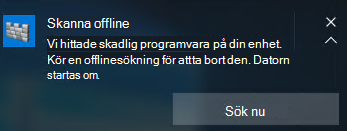

# <a name="run-and-review-the-results-of-a-microsoft-defender-offline-scan"></a><span data-ttu-id="3a917-105">Köra och granska resultatet av en sökning i Microsoft Defender Offline</span><span class="sxs-lookup"><span data-stu-id="3a917-105">Run and review the results of a Microsoft Defender Offline scan</span></span>

[!INCLUDE [Microsoft 365 Defender rebranding](../../includes/microsoft-defender.md)]


<span data-ttu-id="3a917-106">**Gäller för:**</span><span class="sxs-lookup"><span data-stu-id="3a917-106">**Applies to:**</span></span>

- [<span data-ttu-id="3a917-107">Microsoft Defender för Endpoint</span><span class="sxs-lookup"><span data-stu-id="3a917-107">Microsoft Defender for Endpoint</span></span>](/microsoft-365/security/defender-endpoint/)

<span data-ttu-id="3a917-108">Microsoft Defender Offline är ett sökverktyg mot skadlig programvara som gör att du kan starta och köra en sökning från en betrodd miljö.</span><span class="sxs-lookup"><span data-stu-id="3a917-108">Microsoft Defender Offline is an antimalware scanning tool that lets you boot and run a scan from a trusted environment.</span></span> <span data-ttu-id="3a917-109">Genomsökningen körs från den normala Windows-kerneln så att den kan rikta skadlig programvara som försöker kringgå Windows Shell, till exempel virus och rotkits som smittar eller skriver över huvudstartsposten (MBR).</span><span class="sxs-lookup"><span data-stu-id="3a917-109">The scan runs from outside the normal Windows kernel so it can target malware that attempts to bypass the Windows shell, such as viruses and rootkits that infect or overwrite the master boot record (MBR).</span></span>

<span data-ttu-id="3a917-110">Du kan använda Microsoft Defender Offline om du misstänker att det kan smittas med skadlig kod eller om du vill bekräfta att slutpunkten har rensat helt efter ett utbrott av skadlig programvara.</span><span class="sxs-lookup"><span data-stu-id="3a917-110">You can use Microsoft Defender Offline if you suspect a malware infection, or you want to confirm a thorough clean of the endpoint after a malware outbreak.</span></span>

<span data-ttu-id="3a917-111">I Windows 10 kan Microsoft Defender Offline köras med ett klick direkt från [Windows-säkerhetsappen.](microsoft-defender-security-center-antivirus.md)</span><span class="sxs-lookup"><span data-stu-id="3a917-111">In Windows 10, Microsoft Defender Offline can be run with one click directly from the [Windows Security app](microsoft-defender-security-center-antivirus.md).</span></span> <span data-ttu-id="3a917-112">I tidigare versioner av Windows var en användare tvungen att installera Microsoft Defender Offline för att starta om media, starta om slutpunkten och läsa in startbara media.</span><span class="sxs-lookup"><span data-stu-id="3a917-112">In previous versions of Windows, a user had to install Microsoft Defender Offline to bootable media, restart the endpoint, and load the bootable media.</span></span>

## <a name="prerequisites-and-requirements"></a><span data-ttu-id="3a917-113">krav och förutsättningar</span><span class="sxs-lookup"><span data-stu-id="3a917-113">prerequisites and requirements</span></span>

<span data-ttu-id="3a917-114">Microsoft Defender Offline i Windows 10 har samma maskinvarukrav som för Windows 10.</span><span class="sxs-lookup"><span data-stu-id="3a917-114">Microsoft Defender Offline in Windows 10 has the same hardware requirements as Windows 10.</span></span> 

<span data-ttu-id="3a917-115">Mer information om Windows 10-krav finns i följande avsnitt:</span><span class="sxs-lookup"><span data-stu-id="3a917-115">For more information about Windows 10 requirements, see the following topics:</span></span>

- [<span data-ttu-id="3a917-116">Minimikrav för maskinvara</span><span class="sxs-lookup"><span data-stu-id="3a917-116">Minimum hardware requirements</span></span>](/windows-hardware/design/minimum/minimum-hardware-requirements-overview)

- [<span data-ttu-id="3a917-117">Riktlinjer för maskinvarukomponenter</span><span class="sxs-lookup"><span data-stu-id="3a917-117">Hardware component guidelines</span></span>](/windows-hardware/design/component-guidelines/components)

> [!NOTE]
> <span data-ttu-id="3a917-118">Microsoft Defender Offline stöds inte på datorer med ARM-processorer eller på Windows Server Stock Keeping Units.</span><span class="sxs-lookup"><span data-stu-id="3a917-118">Microsoft Defender Offline is not supported on machines with ARM processors, or on Windows Server Stock Keeping Units.</span></span>

<span data-ttu-id="3a917-119">Om du vill köra Microsoft Defender Offline från slutpunkten måste användaren vara inloggad med administratörsbehörighet.</span><span class="sxs-lookup"><span data-stu-id="3a917-119">To run Microsoft Defender Offline from the endpoint, the user must be logged in with administrator privileges.</span></span>
 
## <a name="microsoft-defender-offline-updates"></a><span data-ttu-id="3a917-120">Uppdateringar för Microsoft Defender Offline</span><span class="sxs-lookup"><span data-stu-id="3a917-120">Microsoft Defender Offline updates</span></span>

<span data-ttu-id="3a917-121">Microsoft Defender Offline använder de senaste skyddsuppdateringarna som finns tillgängliga på slutpunkten. uppdateras när Windows Defender Antivirus uppdateras.</span><span class="sxs-lookup"><span data-stu-id="3a917-121">Microsoft Defender Offline uses the most recent protection updates available on the endpoint; it's updated whenever Windows Defender Antivirus is updated.</span></span> 

> [!NOTE]
> <span data-ttu-id="3a917-122">Innan du kör en offlinesökning bör du försöka uppdatera Microsoft Defender AV-skyddet.</span><span class="sxs-lookup"><span data-stu-id="3a917-122">Before running an offline scan, you should attempt to update Microsoft Defender AV protection.</span></span> <span data-ttu-id="3a917-123">Du kan antingen tvinga fram en uppdatering med grupprinciper eller hur du normalt distribuerar uppdateringar till slutpunkter, eller så kan du manuellt ladda ned och installera de senaste skyddsuppdateringarna från [Microsoft Malware Protection Center.](https://www.microsoft.com/security/portal/definitions/adl.aspx)</span><span class="sxs-lookup"><span data-stu-id="3a917-123">You can either force an update with Group Policy or however you normally deploy updates to endpoints, or you can manually download and install the latest protection updates from the [Microsoft Malware Protection Center](https://www.microsoft.com/security/portal/definitions/adl.aspx).</span></span>

<span data-ttu-id="3a917-124">Mer information [finns i avsnittet Hantera uppdateringar av Microsoft Defender Antivirus Security Intelligence.](manage-protection-updates-microsoft-defender-antivirus.md)</span><span class="sxs-lookup"><span data-stu-id="3a917-124">See the [Manage Microsoft Defender Antivirus Security intelligence  updates](manage-protection-updates-microsoft-defender-antivirus.md) topic for more information.</span></span>

## <a name="usage-scenarios"></a><span data-ttu-id="3a917-125">Användningsscenarier</span><span class="sxs-lookup"><span data-stu-id="3a917-125">Usage scenarios</span></span>

<span data-ttu-id="3a917-126">I Windows 10, version 1607, kan du manuellt tvinga fram en offlinesökning.</span><span class="sxs-lookup"><span data-stu-id="3a917-126">In Windows 10, version 1607, you can manually force an offline scan.</span></span> <span data-ttu-id="3a917-127">Alternativt, om Windows Defender anser att Microsoft Defender Offline måste köras, uppmanas användaren i slutpunkten.</span><span class="sxs-lookup"><span data-stu-id="3a917-127">Alternatively, if Windows Defender determines that Microsoft Defender Offline needs to run, it will prompt the user on the endpoint.</span></span> 

<span data-ttu-id="3a917-128">Att du behöver göra en offlinesökning visas också i Microsoft Endpoint Manager om du använder den för att hantera dina slutpunkter.</span><span class="sxs-lookup"><span data-stu-id="3a917-128">The need to perform an offline scan will also be revealed in Microsoft Endpoint Manager if you're using it to manage your endpoints.</span></span>

<span data-ttu-id="3a917-129">Uppmaningen kan visas via ett meddelande, ungefär så här:</span><span class="sxs-lookup"><span data-stu-id="3a917-129">The prompt can occur via a notification, similar to the following:</span></span>



<span data-ttu-id="3a917-131">Användaren meddelas också i Windows Defender-klienten.</span><span class="sxs-lookup"><span data-stu-id="3a917-131">The user will also be notified within the Windows Defender client.</span></span>

<span data-ttu-id="3a917-132">I Konfigurationshanteraren kan du identifiera slutpunktens status genom att navigera till Övervaknings- **och >-översikt > Säkerhets- > Endpoint Protection Status > System Center Endpoint Protection Status**.</span><span class="sxs-lookup"><span data-stu-id="3a917-132">In Configuration Manager, you can identify the status of endpoints by navigating to **Monitoring > Overview > Security > Endpoint Protection Status > System Center Endpoint Protection Status**.</span></span> 

<span data-ttu-id="3a917-133">Microsoft Defender Offline-genomsökningar visas under Status **för åtgärder vid** skadlig programvara som en **offlinesökning krävs.**</span><span class="sxs-lookup"><span data-stu-id="3a917-133">Microsoft Defender Offline scans are indicated under **Malware remediation status** as **Offline scan required**.</span></span>


## <a name="configure-notifications"></a><span data-ttu-id="3a917-135">Konfigurera meddelanden</span><span class="sxs-lookup"><span data-stu-id="3a917-135">Configure notifications</span></span>

<span data-ttu-id="3a917-136">Microsoft Defender Offline-meddelanden konfigureras i samma principinställning som andra Av-meddelanden i Microsoft Defender.</span><span class="sxs-lookup"><span data-stu-id="3a917-136">Microsoft Defender Offline notifications are configured in the same policy setting as other Microsoft Defender AV notifications.</span></span>

<span data-ttu-id="3a917-137">Mer information om meddelanden i Windows Defender finns i avsnittet [Konfigurera meddelanden som visas på slutpunkter.](configure-notifications-microsoft-defender-antivirus.md)</span><span class="sxs-lookup"><span data-stu-id="3a917-137">For more information about notifications in Windows Defender, see the [Configure the notifications that appear on endpoints](configure-notifications-microsoft-defender-antivirus.md) topic.</span></span>

## <a name="run-a-scan"></a><span data-ttu-id="3a917-138">Köra en genomsökning</span><span class="sxs-lookup"><span data-stu-id="3a917-138">Run a scan</span></span> 

> [!IMPORTANT]
> <span data-ttu-id="3a917-139">Innan du använder Microsoft Defender Offline ska du se till att spara alla filer och stänga av program som körs.</span><span class="sxs-lookup"><span data-stu-id="3a917-139">Before you use Microsoft Defender Offline, make sure you save any files and shut down running programs.</span></span> <span data-ttu-id="3a917-140">Genomsökningen av Microsoft Defender Offline tar ca 15 minuter att köra.</span><span class="sxs-lookup"><span data-stu-id="3a917-140">The Microsoft Defender Offline scan takes about 15 minutes to run.</span></span> <span data-ttu-id="3a917-141">När genomsökningen är klar startar den om slutpunkten.</span><span class="sxs-lookup"><span data-stu-id="3a917-141">It will restart the endpoint when the scan is complete.</span></span> <span data-ttu-id="3a917-142">Genomsökningen utförs utanför den vanliga Windows-operativsystemsmiljön.</span><span class="sxs-lookup"><span data-stu-id="3a917-142">The scan is performed outside of the usual Windows operating environment.</span></span> <span data-ttu-id="3a917-143">Användargränssnittet ser annorlunda ut än det som utförs i Windows Defender.</span><span class="sxs-lookup"><span data-stu-id="3a917-143">The user interface will appear different to a normal scan performed by Windows Defender.</span></span> <span data-ttu-id="3a917-144">När genomsökningen har slutförts startas slutpunkten om och Windows läses in normalt.</span><span class="sxs-lookup"><span data-stu-id="3a917-144">After the scan is completed, the endpoint will be restarted and Windows will load normally.</span></span>

<span data-ttu-id="3a917-145">Du kan köra en microsoft Defender Offline-genomsökning med följande:</span><span class="sxs-lookup"><span data-stu-id="3a917-145">You can run a Microsoft Defender Offline scan with the following:</span></span>

- <span data-ttu-id="3a917-146">PowerShell</span><span class="sxs-lookup"><span data-stu-id="3a917-146">PowerShell</span></span>
- <span data-ttu-id="3a917-147">Windows Management Instrumentation (WMI)</span><span class="sxs-lookup"><span data-stu-id="3a917-147">Windows Management Instrumentation (WMI)</span></span>
- <span data-ttu-id="3a917-148">Appen Windows-säkerhet</span><span class="sxs-lookup"><span data-stu-id="3a917-148">The Windows Security app</span></span>


### <a name="use-powershell-cmdlets-to-run-an-offline-scan"></a><span data-ttu-id="3a917-149">Använda PowerShell-cmdlets för att köra en offlinesökning</span><span class="sxs-lookup"><span data-stu-id="3a917-149">Use PowerShell cmdlets to run an offline scan</span></span>

<span data-ttu-id="3a917-150">Använd följande cmdlets:</span><span class="sxs-lookup"><span data-stu-id="3a917-150">Use the following cmdlets:</span></span>

```PowerShell
Start-MpWDOScan
```

<span data-ttu-id="3a917-151">Mer information om hur du använder PowerShell med Microsoft Defender Antivirus finns i Använda [PowerShell-cmdlets](use-powershell-cmdlets-microsoft-defender-antivirus.md) för att konfigurera och köra Microsoft Defender Antivirus- och [Defender-cmdlets.](/powershell/module/defender/)</span><span class="sxs-lookup"><span data-stu-id="3a917-151">See [Use PowerShell cmdlets to configure and run Microsoft Defender Antivirus](use-powershell-cmdlets-microsoft-defender-antivirus.md) and [Defender cmdlets](/powershell/module/defender/) for more information on how to use PowerShell with Microsoft Defender Antivirus.</span></span>

### <a name="use-windows-management-instruction-wmi-to-run-an-offline-scan"></a><span data-ttu-id="3a917-152">Använd WMI (Windows Management Instruction) för att köra en offlinesökning</span><span class="sxs-lookup"><span data-stu-id="3a917-152">Use Windows Management Instruction (WMI) to run an offline scan</span></span>

<span data-ttu-id="3a917-153">Använd [**MSFT_MpWDOScan**](/previous-versions/windows/desktop/legacy/dn455323(v=vs.85)) att köra en offlinesökning.</span><span class="sxs-lookup"><span data-stu-id="3a917-153">Use the [**MSFT_MpWDOScan**](/previous-versions/windows/desktop/legacy/dn455323(v=vs.85)) class to run an offline scan.</span></span>

<span data-ttu-id="3a917-154">Följande WMI-skriptavsnitt kör omedelbart en Microsoft Defender Offline-genomsökning, vilket gör att slutpunkten startas om, kör offlinesökningen och startar sedan om och startar i Windows.</span><span class="sxs-lookup"><span data-stu-id="3a917-154">The following WMI script snippet will immediately run a Microsoft Defender Offline scan, which will cause the endpoint to restart, run the offline scan, and then restart and boot into Windows.</span></span>

```console
wmic /namespace:\\root\Microsoft\Windows\Defender path MSFT_MpWDOScan call Start 
```

<span data-ttu-id="3a917-155">Mer information finns i följande avsnitt:</span><span class="sxs-lookup"><span data-stu-id="3a917-155">See the following for more information:</span></span>
- [<span data-ttu-id="3a917-156">API:er för Windows Defender WMIv2</span><span class="sxs-lookup"><span data-stu-id="3a917-156">Windows Defender WMIv2 APIs</span></span>](/previous-versions/windows/desktop/defender/windows-defender-wmiv2-apis-portal)


### <a name="use-the-windows-defender-security-app-to-run-an-offline-scan"></a><span data-ttu-id="3a917-157">Köra en offlinesökning med hjälp av windows Defender-säkerhetsappen</span><span class="sxs-lookup"><span data-stu-id="3a917-157">Use the Windows Defender Security app to run an offline scan</span></span>

1. <span data-ttu-id="3a917-158">Öppna appen Windows-säkerhet genom att klicka på sköldikonen i aktivitetsfältet eller söka efter Defender på **startmenyn.**</span><span class="sxs-lookup"><span data-stu-id="3a917-158">Open the Windows Security app by clicking the shield icon in the task bar or searching the start menu for **Defender**.</span></span>

2. <span data-ttu-id="3a917-159">Klicka på **& för skydd mot** hot (eller sköldikonen på den vänstra menyraden) och sedan på etiketten Avancerad **genomsökning:**</span><span class="sxs-lookup"><span data-stu-id="3a917-159">Click the **Virus & threat protection** tile (or the shield icon on the left menu bar) and then the **Advanced scan** label:</span></span>
    
3. <span data-ttu-id="3a917-160">Välj **Microsoft Defender Offlinesökning och** klicka på Sök **nu**.</span><span class="sxs-lookup"><span data-stu-id="3a917-160">Select **Microsoft Defender Offline scan** and click **Scan now**.</span></span>

    > [!NOTE]
    > <span data-ttu-id="3a917-161">I Windows 10, version 1607, kan du köra offlinesökningen under **Windows Settings** Update & Windows Defender eller  >    >   från Windows Defender-klienten.</span><span class="sxs-lookup"><span data-stu-id="3a917-161">In Windows 10, version 1607, the offline scan could be run from under **Windows Settings** > **Update & security** > **Windows Defender** or from the Windows Defender client.</span></span>


## <a name="review-scan-results"></a><span data-ttu-id="3a917-162">Granska genomsökningsresultat</span><span class="sxs-lookup"><span data-stu-id="3a917-162">Review scan results</span></span>

<span data-ttu-id="3a917-163">Microsoft Defender Offline-genomsökningsresultaten visas i avsnittet [Genomsökningshistorik i Windows-säkerhetsappen.](microsoft-defender-security-center-antivirus.md)</span><span class="sxs-lookup"><span data-stu-id="3a917-163">Microsoft Defender Offline scan results will be listed in the [Scan history section of the Windows Security app](microsoft-defender-security-center-antivirus.md).</span></span> 


## <a name="related-articles"></a><span data-ttu-id="3a917-164">Relaterade artiklar</span><span class="sxs-lookup"><span data-stu-id="3a917-164">Related articles</span></span>

- [<span data-ttu-id="3a917-165">Anpassa, initiera och granska resultatet av genomsökningar och åtgärder</span><span class="sxs-lookup"><span data-stu-id="3a917-165">Customize, initiate, and review the results of scans and remediation</span></span>](customize-run-review-remediate-scans-microsoft-defender-antivirus.md)
- [<span data-ttu-id="3a917-166">Microsoft Defender Antivirus i Windows 10</span><span class="sxs-lookup"><span data-stu-id="3a917-166">Microsoft Defender Antivirus in Windows 10</span></span>](microsoft-defender-antivirus-in-windows-10.md)