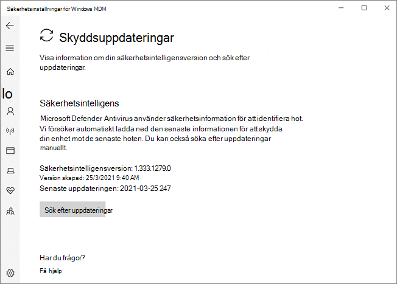

# Microsoft Defender Antivirus i Windows-säkerhet appenMicrosoft Defender Antivirus in the Windows Security app

[!INCLUDE [Microsoft 365 Defender rebranding](../../includes/microsoft-defender.md)]

**Gäller för:****Applies to:**

- [Microsoft Defender för EndpointMicrosoft Defender for Endpoint](/microsoft-365/security/defender-endpoint/)

I Windows 10, version 1703 och senare är Windows Defender en del av Windows-säkerhet.In Windows 10, version 1703 and later, the Windows Defender app is part of the Windows Security.

Inställningar som tidigare ingick i Windows Defender-klienten och huvudklienten Windows Inställningar har kombinerats och flyttats till den nya appen, som installeras som standard som en del av Windows 10, version 1703.Settings that were previously part of the Windows Defender client and main Windows Settings have been combined and moved to the new app, which is installed by default as part of Windows 10, version 1703.

> [!IMPORTANT]
> Om du inaktiverar Windows-säkerhet Center inaktiveras inte Microsoft Defender Antivirus eller [Windows Defender-brandväggen.](/windows/security/threat-protection/windows-firewall/windows-firewall-with-advanced-security)Disabling the Windows Security Center service does not disable Microsoft Defender Antivirus or [Windows Defender Firewall](/windows/security/threat-protection/windows-firewall/windows-firewall-with-advanced-security). De inaktiveras automatiskt när ett antivirusprogram eller en brandvägg för tredje part installeras och hålls uppdaterade.These are disabled automatically when a third-party antivirus or firewall product is installed and kept up to date.
>
> Om du inaktiverar tjänsten Windows-säkerhet Center eller konfigurerar de tillhörande grupprincipinställningarna så att den inte startas eller körs kan det hända att Windows-säkerhet-appen visar inaktuell eller felaktig information om antivirus- eller brandväggsprodukter som du har installerat på enheten.If you do disable the Windows Security Center service, or configure its associated Group Policy settings to prevent it from starting or running, the Windows Security app might display stale or inaccurate information about any antivirus or firewall products you have installed on the device.
> Det kan också förhindra Microsoft Defender Antivirus från att aktivera sig själv om du har ett gammalt eller inaktuellt antivirusprogram från tredje part eller om du avinstallerar antivirusprodukter från tredje part som du kanske har installerat tidigare.It might also prevent Microsoft Defender Antivirus from enabling itself if you have an old or outdated third-party antivirus, or if you uninstall any third-party antivirus products you might have previously installed.
> Det här minskar skyddet på enheten avsevärt och kan leda till skadlig kod.This will significantly lower the protection of your device and could lead to malware infection.

Mer [Windows-säkerhet om andra](/windows/threat-protection/windows-defender-security-center/windows-defender-security-center) funktioner Windows kan övervakas i appen finns i artikeln om säkerhet.See the [Windows Security article](/windows/threat-protection/windows-defender-security-center/windows-defender-security-center) for more information on other Windows security features that can be monitored in the app.

Appen Windows-säkerhet ett klientgränssnitt i Windows 10, version 1703 och senare.The Windows Security app is a client interface on Windows 10, version 1703 and later. Det är inte den Microsoft Defender Säkerhetscenter webbportal som används för att granska och hantera [Microsoft Defender för slutpunkt.](/microsoft-365/security/defender-endpoint/microsoft-defender-endpoint)It is not the Microsoft Defender Security Center web portal that is used to review and manage [Microsoft Defender for Endpoint](/microsoft-365/security/defender-endpoint/microsoft-defender-endpoint).

## Granska inställningarna för skydd mot virus och hot i Windows-säkerhet appenReview virus and threat protection settings in the Windows Security app

1. Öppna Windows-säkerhet genom att klicka på sköldikonen i aktivitetsfältet eller söka efter Defender på **startmenyn.**Open the Windows Security app by clicking the shield icon in the task bar or searching the start menu for **Defender**.

2. Välj panelen **& skydd mot hot** (eller sköldikonen på den vänstra menyraden).Select the **Virus & threat protection** tile (or the shield icon on the left menu bar).
   
I följande avsnitt beskrivs hur du utför några av de vanligaste uppgifterna när du granskar eller interagerar med hotskyddet som tillhandahålls av Microsoft Defender Antivirus i Windows-säkerhet-appen.The following sections describe how to perform some of the most common tasks when reviewing or interacting with the threat protection provided by Microsoft Defender Antivirus in the Windows Security app.

> [!NOTE]
> Om de här inställningarna konfigureras och distribueras med grupprincip kommer inställningarna som beskrivs i det här avsnittet att vara nedtonade och inte tillgängliga för användning i enskilda slutpunkter.If these settings are configured and deployed using Group Policy, the settings described in this section will be greyed-out and unavailable for use on individual endpoints. Ändringar som görs via ett grupprincipobjekt måste först distribueras till enskilda slutpunkter innan inställningen uppdateras i Windows-inställningarna.Changes made through a Group Policy Object must first be deployed to individual endpoints before the setting will be updated in Windows Settings. I [avsnittet Konfigurera användarinteraktion med Microsoft Defender Antivirus](configure-end-user-interaction-microsoft-defender-antivirus.md) beskrivs hur du kan konfigurera inställningar för åsidosättning av lokala policyer.The [Configure end-user interaction with Microsoft Defender Antivirus](configure-end-user-interaction-microsoft-defender-antivirus.md) topic describes how local policy override settings can be configured.

## Köra en genomsökning med Windows-säkerhet appenRun a scan with the Windows Security app

1. Öppna Windows-säkerhet-appen genom att söka efter **Säkerhet** på Start-menyn och sedan välja **Windows-säkerhet**.Open the Windows Security app by searching the start menu for **Security**, and then selecting **Windows Security**.

2. Välj panelen **& skydd mot hot** (eller sköldikonen på den vänstra menyraden).Select the **Virus & threat protection** tile (or the shield icon on the left menu bar).

3. Välj **Snabbsökning**.Select **Quick scan**. Du kan också köra en fullständig genomsökning genom att **välja Skanningsalternativ** och sedan välja ett alternativ, till exempel **Fullständig sökning**.Or, to run a full scan, select **Scan options**, and then select an option, such as **Full scan**.

## Granska uppdateringsversionen av säkerhetsintelligens och ladda ned de senaste uppdateringarna Windows-säkerhet säkerhetsappenReview the security intelligence update version and download the latest updates in the Windows Security app

1. Öppna Windows-säkerhet-appen genom att söka efter *Säkerhet* på Start-menyn och sedan välja **Windows-säkerhet**.Open the Windows Security app by searching the start menu for *Security*, and then selecting **Windows Security**.

2. Välj panelen **& skydd mot hot** (eller sköldikonen på den vänstra menyraden).Select the **Virus & threat protection** tile (or the shield icon on the left menu bar).

3. Välj **Uppdateringar & skydd mot virus .**Select **Virus & threat protection updates**. Den installerade versionen visas tillsammans med en del information om när den laddades ned.The currently installed version is displayed along with some information about when it was downloaded. Du kan kontrollera din aktuella version mot den senaste versionen som finns tillgänglig för manuell nedladdning eller granska ändringsloggen för den versionen.You can check your current against the latest version available for manual download, or review the change log for that version. Se [Säkerhetsintelligensuppdateringar för Microsoft Defender Antivirus och andra Microsoft-program mot skadlig programvara.](https://www.microsoft.com/en-us/wdsi/defenderupdates)See [Security intelligence updates for Microsoft Defender Antivirus and other Microsoft antimalware](https://www.microsoft.com/en-us/wdsi/defenderupdates).

4. Välj **Sök efter uppdateringar för** att ladda ned nya skyddsuppdateringar (om det finns några).Select **Check for updates** to download new protection updates (if there are any).

## Kontrollera Microsoft Defender Antivirus är aktiverat i Windows-säkerhet appenEnsure Microsoft Defender Antivirus is enabled in the Windows Security app

1. Öppna Windows-säkerhet-appen genom att söka efter *Säkerhet* på Start-menyn och sedan välja **Windows-säkerhet**.Open the Windows Security app by searching the start menu for *Security*, and then selecting **Windows Security**.

2. Välj panelen **& skydd mot hot** (eller sköldikonen på den vänstra menyraden).Select the **Virus & threat protection** tile (or the shield icon on the left menu bar).

3. Välj **Inställningar & för skydd mot virushot**.Select **Virus & threat protection settings**.

4. Ändra **realtidsskyddet till** **På**.Toggle the **Real-time protection** switch to **On**.

    > [!NOTE]
    > Om du **inaktiverar realtidsskyddet** aktiveras det automatiskt igen efter en kort fördröjning.If you switch **Real-time protection** off, it will automatically turn back on after a short delay. Detta är för att säkerställa att du är skyddad från skadlig programvara och hot.This is to ensure you are protected from malware and threats.
    > Om du installerar ett annat antivirusprogram inaktiveras Microsoft Defender Antivirus automatiskt och anges som sådant i Windows-säkerhet programmet.If you install another antivirus product, Microsoft Defender Antivirus automatically disables itself and is indicated as such in the Windows Security app. En inställning visas som gör att du kan aktivera [begränsad regelbunden genomsökning.](limited-periodic-scanning-microsoft-defender-antivirus.md)A setting will appear that will allow you to enable [limited periodic scanning](limited-periodic-scanning-microsoft-defender-antivirus.md).

## Lägga till undantag för Microsoft Defender Antivirus i Windows-säkerhet appenAdd exclusions for Microsoft Defender Antivirus in the Windows Security app

1. Öppna Windows-säkerhet-appen genom att söka efter *Säkerhet* på Start-menyn och sedan välja **Windows-säkerhet**.Open the Windows Security app by searching the start menu for *Security*, and then selecting **Windows Security**.

2. Välj panelen **& skydd mot hot** (eller sköldikonen på den vänstra menyraden).Select the **Virus & threat protection** tile (or the shield icon on the left menu bar).

3. Under Hantera **inställningar väljer** du Inställningar & för skydd mot **virus .**Under the **Manage settings**, select **Virus & threat protection settings**.

4. Under inställningen **Undantag väljer** du Lägg till eller ta **bort undantag.**Under the **Exclusions** setting, select **Add or remove exclusions**. 

5. Välj plusikonen **+** () om du vill välja typ och ange alternativ för varje undantag.Select the plus icon (**+**) to choose the type and set the options for each exclusion. 

I följande tabell sammanfattas undantagstyper och vad som händer:The following table summarizes exclusion types and what happens:

|ExkluderingstypExclusion type  |Definieras avDefined by  |Vad som händerWhat happens  |
|---------|---------|---------|
|**Fil****File** |PlatsLocation  Exempel: `c:\sample\sample.test`Example: `c:\sample\sample.test` |Den specifika filen hoppas över av Microsoft Defender Antivirus.The specific file is skipped by Microsoft Defender Antivirus. |
|**Mapp****Folder**    |PlatsLocation  Exempel: `c:\test\sample`Example: `c:\test\sample`       |Alla objekt i den angivna mappen hoppas över av Microsoft Defender Antivirus.All items in the specified folder are skipped by Microsoft Defender Antivirus.         |
|**Filtyp****File type**   |FilnamnstilläggFile extension  Exempel: `.test`Example: `.test` |Alla filer med tillägget `.test` var som helst på din enhet hoppas över av Microsoft Defender Antivirus.All files with the `.test` extension anywhere on your device are skipped by Microsoft Defender Antivirus.         |
|**Process****Process**     |Körbar sökvägExecutable file path  Exempel: `c:\test\process.exe`Example: `c:\test\process.exe`         |Den specifika processen och alla filer som öppnas av den processen hoppas över av Microsoft Defender Antivirus.The specific process and any files that are opened by that process are skipped by Microsoft Defender Antivirus.         |

Mer information finns i följande resurser:To learn more, see the following resources:
- [Konfigurera och validera undantag baserat på filtillägg och mappplatsConfigure and validate exclusions based on file extension and folder location](./configure-extension-file-exclusions-microsoft-defender-antivirus.md) 
- [Konfigurera undantag för filer som öppnas av processerConfigure exclusions for files opened by processes](./configure-process-opened-file-exclusions-microsoft-defender-antivirus.md)

## Granska historik för identifiering av hot Windows Defender appen SäkerhetscenterReview threat detection history in the Windows Defender Security Center app

1. Öppna Windows-säkerhet-appen genom att söka efter *Säkerhet* på Start-menyn och sedan välja **Windows-säkerhet**.Open the Windows Security app by searching the start menu for *Security*, and then selecting **Windows Security**.

2. Välj panelen **& skydd mot hot** (eller sköldikonen på den vänstra menyraden).Select the **Virus & threat protection** tile (or the shield icon on the left menu bar).

3. Välj **Skyddshistorik**.Select **Protection history**. Eventuella tidigare objekt visas.Any recent items are listed.

## Ange alternativ för utpressningstrojaner och återställningSet ransomware protection and recovery options

1. Öppna Windows-säkerhet-appen genom att söka efter *Säkerhet* på Start-menyn och sedan välja **Windows-säkerhet**.Open the Windows Security app by searching the start menu for *Security*, and then selecting **Windows Security**.

2. Välj panelen **& skydd mot hot** (eller sköldikonen på den vänstra menyraden).Select the **Virus & threat protection** tile (or the shield icon on the left menu bar).

3. Under **Utpressningstrojanskydd** väljer du **Hantera utpressningstrojanskydd**.Under **Ransomware protection**, select **Manage ransomware protection**.

4. Information om hur **du ändrar inställningarna för kontrollerad** mappåtkomst finns i Skydda viktiga mappar med [kontrollerad mappåtkomst.](/microsoft-365/security/defender-endpoint/controlled-folders)To change **Controlled folder access** settings, see [Protect important folders with Controlled folder access](/microsoft-365/security/defender-endpoint/controlled-folders).

5. Om du vill konfigurera återställningsalternativ för  utpressningstrojaner väljer du Konfigurera **under** Återställning av utpressningstrojandata och följer anvisningarna för att länka eller konfigurera ditt OneDrive-konto så att du enkelt kan återställa efter en utpressningstrojanattack.To set up ransomware recovery options, select **Set up** under **Ransomware data recovery** and follow the instructions for linking or setting up your OneDrive account so you can easily recover from a ransomware attack.

## Se ävenSee also
- [Microsoft Defender AntivirusMicrosoft Defender Antivirus](microsoft-defender-antivirus-in-windows-10.md)