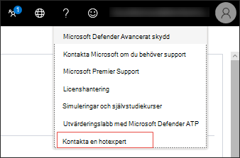
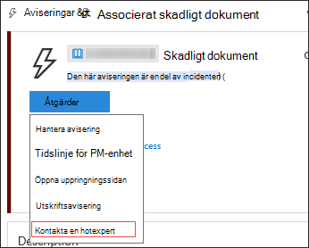
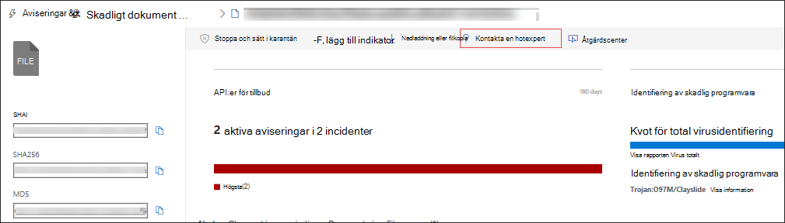

# Microsoft Threat ExpertsMicrosoft Threat Experts

[!INCLUDE [Microsoft 365 Defender rebranding](../../includes/microsoft-defender.md)]

**Gäller för:****Applies to:**
- [Microsoft Defender för EndpointMicrosoft Defender for Endpoint](https://go.microsoft.com/fwlink/p/?linkid=2154037)
- [Microsoft 365 DefenderMicrosoft 365 Defender](https://go.microsoft.com/fwlink/?linkid=2118804)

> Vill du uppleva Microsoft Defender för Slutpunkt?Want to experience Microsoft Defender for Endpoint? [Registrera dig för en kostnadsfri utvärderingsversion.Sign up for a free trial.](https://www.microsoft.com/microsoft-365/windows/microsoft-defender-atp?ocid=docs-wdatp-exposedapis-abovefoldlink)

Microsoft Threat Experts är en hanterad tjänst för hot efter hot som förser ditt säkerhetscenter med övervakning och analys på expertnivå för att hjälpa dem att säkerställa att kritiska hot i dina unika miljöer inte missas.Microsoft Threat Experts is a managed threat hunting service that provides your Security Operation Centers (SOCs) with expert level monitoring and analysis to help them ensure that critical threats in your unique environments don’t get missed.
  
Denna tjänst för hantering av hot efter hot ger expertdrivna insikter och data med dessa två funktioner: riktade attackmeddelanden och tillgång till experter på begäran.This managed threat hunting service provides expert-driven insights and data through these two capabilities: targeted attack notification and access to experts on demand.

## Innan du börjarBefore you begin 
> [!NOTE]
> Diskutera kraven för berättigande med din Microsoft-leverantör och ditt kontoteam innan du använder den hanterade söktjänsten för hot.Discuss the eligibility requirements with your Microsoft Technical Service provider and account team before you apply to the managed threat hunting service.

Om du är Microsoft Defender för slutpunktskund måste du ansöka om **Microsoft Threat Experts – Riktade** attackmeddelanden för att få särskilda insikter och analyser som hjälper dig att identifiera de viktigaste hoten i din miljö så att du snabbt kan svara på demIf you're a Microsoft Defender for Endpoint customer, you need to apply for **Microsoft Threat Experts - Targeted Attack Notifications** to get special insights and analysis that help identify the most critical threats in your environment so you can respond to them quickly

Om du vill registrera dig till Microsoft Threat Experts – fördelar med riktade attackmeddelanden går du till Inställningar Allmänna avancerade funktioner  >    >    >  **Microsoft Threat Experts – Riktade attackmeddelanden** kan användas.To enroll to Microsoft Threat Experts - Targeted Attack Notifications benefits, go to **Settings** > **General** > **Advanced features** > **Microsoft Threat Experts - Targeted Attack Notifications** to apply. När du accepterat det får du fördelarna med riktade attackmeddelanden.Once accepted, you will get the benefits of Targeted Attack Notifications.

Kontakta ditt kontoteam eller din Microsoft-representant för att prenumerera på **Microsoft Threat Experts – Experts on Demand** och rådgör med våra hotexperter om relevanta identifieringar och adversaries som din organisation står inför.Contact your account team or Microsoft representative to subscribe to **Microsoft Threat Experts - Experts on Demand** to consult with our threat experts on relevant detections and adversaries that your organization is facing.

Mer [information finns i Konfigurera Microsoft Threat Experts-funktioner.](https://docs.microsoft.com/microsoft-365/security/defender-endpoint/configure-microsoft-threat-experts#before-you-begin)See [Configure Microsoft Threat Experts capabilities](https://docs.microsoft.com/microsoft-365/security/defender-endpoint/configure-microsoft-threat-experts#before-you-begin) for details. 

## Microsoft Threat Experts – riktad attackaviseringMicrosoft Threat Experts - Targeted attack notification 
Microsoft Threat Experts – Riktade attackmeddelanden ger proaktiv sökning efter de viktigaste hoten mot nätverket, bland annat intrång, hand på tangentbordsattacker och avancerade attacker som cyberhot.Microsoft Threat Experts - Targeted attack notification provides proactive hunting for the most important threats to your network, including human adversary intrusions, hands-on-keyboard attacks, or advanced attacks like cyber-espionage. Dessa meddelanden visas som en ny avisering.These notifications shows up as a new alert. Den hanterade servicen för servicen omfattar:The managed hunting service includes:  
- Övervaka och analysera hot, minska invånartid och risker för företagetThreat monitoring and analysis, reducing dwell time and risk to the business 
- Så här upptäcker och prioriterar du både kända och okända attackerHunter-trained artificial intelligence to discover and prioritize both known and unknown attacks  
- Att identifiera de viktigaste riskerna, hjälpa SOC att maximera tid och energiIdentifying the most important risks, helping SOCs maximize time and energy 
- Omfång för kompromettera och så mycket kontext som kan levereras snabbt för att möjliggöra snabbt SOC-svar.Scope of compromise and as much context as can be quickly delivered to enable fast SOC response. 
 
## Microsoft Threat Experts – experter på begäranMicrosoft Threat Experts - Experts on Demand
Kunder kan engagera våra säkerhetsexperter direkt från Microsoft Defender Säkerhetscenter för att få snabba och korrekta svar.Customers can engage our security experts directly from within Microsoft Defender Security Center for timely and accurate response. Experter tillhandahåller insikter som behövs för att bättre förstå komplexa hot som påverkar organisationen, från aviseringar, potentiellt komprometterade enheter, orsaken till en misstänkt nätverksanslutning, till ytterligare hotinformation om pågående avancerade fortlöpande hotkampanjer.Experts provide insights needed to better understand the complex threats affecting your organization, from alert inquiries, potentially compromised devices, root cause of a suspicious network connection, to additional threat intelligence regarding ongoing advanced persistent threat campaigns. Med den här funktionen kan du:With this capability, you can:
- Få ytterligare ett förtydligande av aviseringar, inklusive orsaken till eller omfattningen av händelsenGet additional clarification on alerts including root cause or scope of the incident 
- Öka tydligheten i beteendet på en misstänkt enhet och nästa steg om du står inför en avancerad attackGain clarity into suspicious device behavior and next steps if faced with an advanced attacker  
- Fastställa risker och skydd för hotfaktorer, kampanjer eller nya attackerteknikerDetermine risk and protection regarding threat actors, campaigns, or emerging attacker techniques 

Alternativet att Kontakta **en hotexpert finns** på flera platser i portalen så att du kan kommunicera med experter inom ramen för din undersökning:The option to **Consult a threat expert** is available in several places in the portal so you can engage with experts in the context of your investigation:

- <i>**Menyn Hjälp och support**</i><i>**Help and support menu**</i> 

- <i>**Menyn Enhet sidåtgärder**</i><i>**Device page actions menu**</i> 

- <i>**Menyn Åtgärder på sidan Aviseringar**</i><i>**Alerts page actions menu**</i> 

- <i>**Menyn Filsidasåtgärder**</i><i>**File page actions menu**</i> 

> [!NOTE]
> Om du vill spåra statusen för ärenden för experter på begäran via Microsoft Services Hub kan du kontakta din Technical Account Manager.If you would like to track the status of your Experts on Demand cases through Microsoft Services Hub, reach out to your Technical Account Manager. 

Titta på den här videon för en snabb överblick över Microsoft Services-hubben.Watch this video for a quick overview of the Microsoft Services Hub.

>[!VIDEO https://www.microsoft.com/videoplayer/embed/RE4pk9f] 

   
## Relaterat ämneRelated topic
- [Konfigurera microsoft Threat Experts-funktionerConfigure Microsoft Threat Experts capabilities](configure-microsoft-threat-experts.md)
